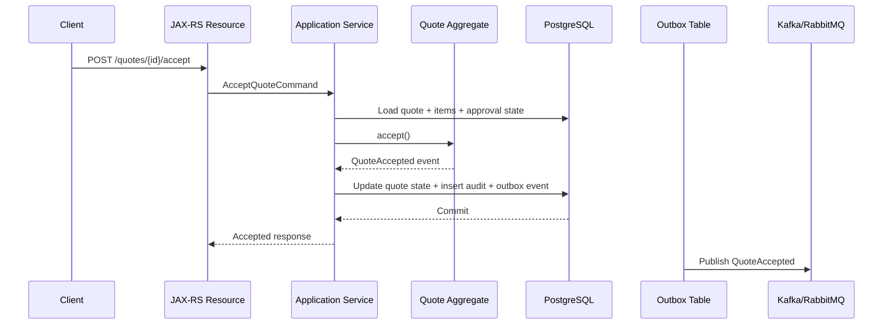
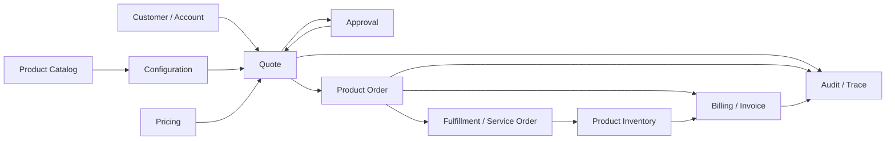
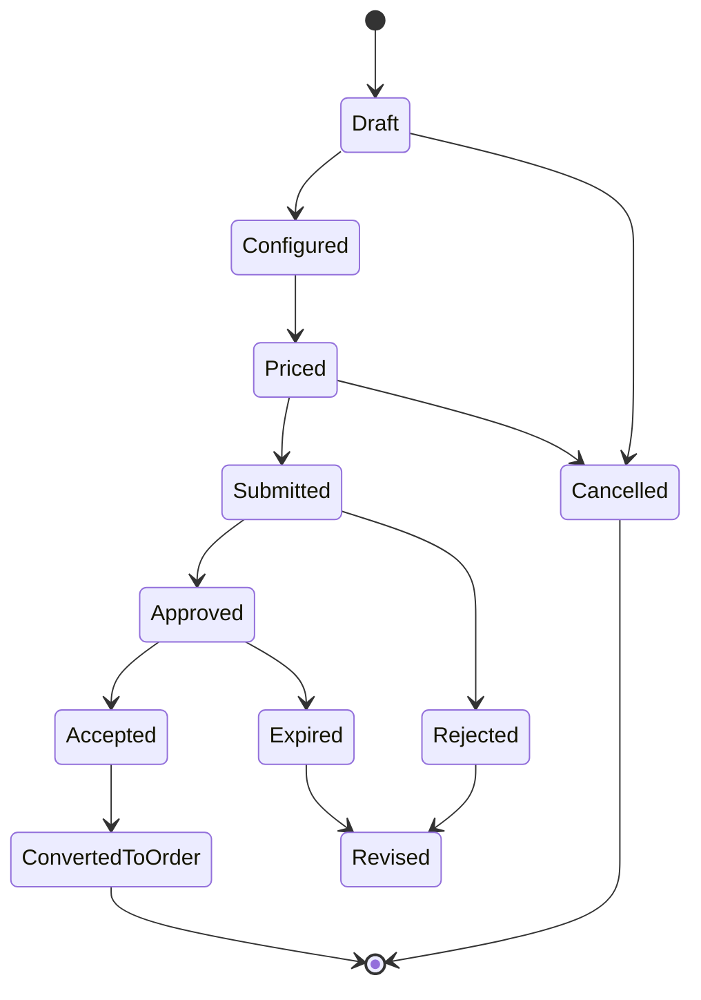

# Enterprise Data Modelling Foundation

Enterprise data modelling bukan sekadar aktivitas membuat tabel database. Dalam sistem CPQ, quote management, order management, catalog, billing, telco BSS/OSS, dan quote-to-cash, data model adalah **kontrak kebenaran bisnis** yang menentukan:

- data apa yang boleh ada,
- data apa yang tidak boleh ada,
- siapa pemilik data,
- kapan data boleh berubah,
- perubahan apa yang harus bisa diaudit,
- state apa yang valid,
- event apa yang boleh dipublikasikan,
- API apa yang aman dikonsumsi,
- query apa yang harus performant,
- dan bagaimana production issue bisa ditelusuri kembali ke penyebabnya.

Untuk senior backend engineer, enterprise data modelling adalah kemampuan memahami sistem sebagai kombinasi dari **domain model, lifecycle model, persistence model, API contract, event contract, reporting model, audit evidence, dan operational control**.

---

## 1. Core Mental Model

Data model enterprise harus menjawab lima pertanyaan besar.

```text
1. Apa real-world business object yang sedang dimodelkan?
2. Siapa yang memiliki dan boleh mengubah data tersebut?
3. Bagaimana lifecycle data tersebut dari dibuat sampai retired/deleted?
4. Invariant apa yang tidak boleh dilanggar sepanjang lifecycle?
5. Bagaimana data tersebut ditelusuri, direkonsiliasi, dan dipertanggungjawabkan saat production issue terjadi?
```

Dalam CPQ dan quote-to-cash, contoh konkretnya:

| Domain Area | Pertanyaan Data Modelling |
|---|---|
| Product Catalog | Offering mana yang valid dijual hari ini untuk customer tertentu? |
| Pricing | Harga mana yang berlaku saat quote dibuat, saat disetujui, dan saat billing aktif? |
| Quote | Apakah quote yang diterima customer masih boleh berubah? |
| Order | Apakah order item boleh fulfilled sebagian? |
| Billing | Charge mana yang berasal dari order, subscription, atau usage? |
| Inventory | Product instance mana yang benar-benar aktif untuk customer? |
| Audit | Siapa mengubah discount dan dengan approval apa? |
| Integration | Apakah event yang dikirim downstream merepresentasikan state yang durable? |

Jika model tidak bisa menjawab pertanyaan ini, model tersebut belum cukup enterprise-grade.

---

## 2. Apa Itu Enterprise Data Modelling?

Enterprise data modelling adalah disiplin merancang struktur, hubungan, lifecycle, ownership, constraint, dan representasi data lintas sistem bisnis yang kompleks.

Dalam sistem sederhana, data modelling sering berhenti di:

```text
entity -> table -> repository -> API response
```

Dalam sistem enterprise, alurnya lebih kompleks:

```text
business concept
  -> conceptual model
  -> logical model
  -> domain aggregate
  -> persistence model
  -> API model
  -> event model
  -> read model
  -> audit model
  -> reporting model
  -> reconciliation model
  -> operational diagnostic model
```

Setiap layer punya tujuan berbeda. Kesalahan umum adalah memaksa semua layer memakai bentuk data yang sama.

---

## 3. Kenapa Enterprise Data Modelling Penting?

Pada sistem CPQ/order/billing, data model yang buruk biasanya tidak langsung gagal saat development. Ia gagal nanti di production, misalnya:

- quote berhasil dibuat, tetapi harga tidak sama saat order dibuat,
- order berhasil submit, tetapi billing tidak aktif,
- product sudah disconnected, tetapi masih muncul sebagai active inventory,
- catalog sudah retired, tetapi masih bisa dipakai untuk quote baru,
- approval discount ada di UI, tetapi tidak bisa dibuktikan di audit,
- event sudah dikirim, tetapi database transaction rollback,
- reporting menunjukkan order completed padahal fulfillment masih fallout,
- duplicate order tercipta karena conversion tidak idempotent,
- customer hierarchy salah sehingga invoice dikirim ke billing account yang salah,
- migration sukses secara teknis tetapi merusak historical quote.

Enterprise data modelling ada untuk mengurangi risiko ini melalui struktur data yang benar, eksplisit, dan bisa diverifikasi.

---

## 4. Model Types yang Harus Dibedakan

### 4.1 Conceptual Model

Conceptual model menjelaskan konsep bisnis utama tanpa detail implementasi database.

Contoh konsep dalam quote-to-cash:

```text
Customer places Quote.
Quote contains Quote Items.
Quote Item references Product Offering.
Accepted Quote can be converted to Product Order.
Product Order fulfillment creates Product Instance.
Billing Account receives Charges and Invoices.
```

Conceptual model berguna untuk menyamakan bahasa antara engineer, BA, product owner, solution architect, QA, dan support.

Tidak boleh terlalu cepat berubah menjadi tabel.

---

### 4.2 Logical Model

Logical model mulai mendefinisikan entity, relationship, cardinality, lifecycle, dan major attribute tanpa terlalu terikat ke physical database.

Contoh logical entity:

- `Party`
- `Customer`
- `Account`
- `BillingAccount`
- `ProductOffering`
- `ProductSpecification`
- `Quote`
- `QuoteItem`
- `ProductOrder`
- `ProductOrderItem`
- `ProductInstance`
- `Charge`
- `Invoice`

Logical model menjawab:

- apakah relationship one-to-one, one-to-many, atau many-to-many?
- apakah entity punya lifecycle sendiri?
- apakah entity harus versioned?
- apakah entity owned oleh service tertentu?
- apakah entity bisa menjadi aggregate root?
- apakah entity harus muncul di API/event/reporting?

---

### 4.3 Physical Model

Physical model adalah implementasi database nyata.

Contoh concern physical model di PostgreSQL:

- table name,
- column type,
- primary key,
- foreign key,
- unique constraint,
- check constraint,
- index,
- partition,
- JSONB usage,
- schema namespace,
- migration strategy,
- query access pattern,
- retention strategy.

Physical model harus mengikuti kebutuhan correctness dan access pattern, bukan sekadar hasil generate dari entity class.

---

### 4.4 Domain Model

Domain model adalah model perilaku bisnis di application layer.

Dalam Java/JAX-RS service, domain model bisa muncul sebagai:

- aggregate root,
- entity,
- value object,
- domain service,
- domain event,
- invariant validator,
- state machine,
- command handler.

Domain model tidak harus sama dengan JPA entity atau table structure.

Contoh:

```text
Quote aggregate
  - validates quote lifecycle transition
  - checks accepted quote immutability
  - computes whether conversion to order is allowed
  - emits QuoteAccepted or QuoteConverted event
```

Persistence model mungkin menyimpan quote header, quote item, quote price snapshot, quote audit, dan quote approval dalam beberapa tabel.

---

### 4.5 Persistence Model

Persistence model adalah bentuk data yang disimpan untuk durability, consistency, query, dan recovery.

Persistence model harus mempertimbangkan:

- write transaction boundary,
- optimistic locking,
- foreign key strategy,
- idempotency,
- audit/history,
- migration,
- query performance,
- long-term retention,
- partial failure recovery.

Dalam sistem enterprise, persistence model tidak boleh hanya mengikuti shape request API.

---

### 4.6 API Model

API model adalah contract untuk client atau service lain.

Di Java/JAX-RS/Jakarta RESTful service, API model biasanya muncul sebagai:

- request DTO,
- response DTO,
- error response,
- pagination response,
- status representation,
- embedded resource,
- reference object,
- external identifier.

API model harus stabil dan backward-compatible. Internal table boleh berubah, tetapi API contract tidak boleh sembarangan berubah.

Contoh risiko:

```text
Database column renamed -> API field accidentally renamed -> external client breaks.
```

---

### 4.7 Event Model

Event model adalah contract asynchronous.

Dalam Kafka/RabbitMQ, event model harus menjawab:

- event merepresentasikan fakta apa?
- event dipublish setelah database commit atau sebelum?
- apa event ID-nya?
- aggregate ID apa yang dipakai?
- ordering key apa yang dipakai?
- versioning bagaimana?
- metadata apa yang wajib?
- apakah event replay aman?
- apakah consumer idempotent?

Contoh event:

```text
QuoteAccepted
ProductOrderCreated
OrderItemFulfilled
BillingAccountActivated
ProductInstanceTerminated
```

Event bukan sekadar notifikasi. Event adalah evidence perubahan state yang bisa dikonsumsi sistem lain.

---

### 4.8 Reporting Model

Reporting model dirancang untuk membaca data lintas lifecycle.

Contoh reporting question:

- berapa quote yang expired sebelum approval?
- berapa order stuck di fulfillment pending lebih dari 3 hari?
- berapa mismatch antara order completed dan billing activated?
- berapa revenue dari recurring charge per billing cycle?
- product offering mana yang paling sering gagal provision?

Reporting model bisa berupa:

- read model,
- materialized view,
- denormalized table,
- fact table,
- dimension table,
- operational dashboard table.

Reporting model tidak boleh merusak OLTP model.

---

### 4.9 Audit Model

Audit model menjawab:

```text
Who changed what, when, why, from where, under what approval, and what was the previous value?
```

Dalam CPQ/order/billing, audit sangat penting untuk:

- discount approval,
- price override,
- quote acceptance,
- order cancellation,
- billing correction,
- contract amendment,
- manual fallout resolution,
- data repair,
- regulatory/internal investigation.

Audit model bukan hanya `created_at` dan `updated_at`.

Minimal audit concern:

- actor,
- action,
- target entity,
- before value,
- after value,
- timestamp,
- correlation ID,
- causation ID,
- source system,
- business reason,
- technical reason,
- approval reference.

---

### 4.10 Canonical Model

Canonical model adalah model bersama untuk integrasi enterprise.

Canonical model bisa berguna untuk menyamakan contract antar sistem, tetapi berbahaya jika dipaksa menjadi domain model semua service.

Risiko canonical model:

- terlalu general,
- semantic mismatch,
- semua service terikat ke satu shared schema,
- sulit versioning,
- extension field menjadi tempat sampah,
- perubahan kecil berdampak luas.

Dalam CPQ/order/billing, canonical model sebaiknya dipakai sebagai integration contract, bukan sebagai internal aggregate model.

---

## 5. Enterprise Data Modelling di Java/JAX-RS Systems

Dalam service Java/JAX-RS, data model biasanya menyebar di banyak layer:

```text
HTTP Resource / Controller
  -> Request DTO
  -> Application Service / Command Handler
  -> Domain Model / Aggregate
  -> Repository / Mapper
  -> Persistence Model
  -> Outbox Event
  -> Response DTO
```

Contoh flow quote acceptance:



Key point:

- API request bukan domain model.
- Domain event bukan database row.
- Outbox event harus satu transaction dengan state change.
- Audit record harus menjelaskan business action.
- Response DTO harus stabil untuk client.

---

## 6. Enterprise Data Modelling di CPQ/Quote/Order/Catalog/Billing

### 6.1 Product Catalog

Catalog modelling menjawab:

- apa yang bisa dijual?
- kepada siapa?
- kapan berlaku?
- dengan konfigurasi apa?
- dengan harga apa?
- apakah offering masih active?
- apakah offering bisa digabung dengan offering lain?

Core concern:

- versioning,
- effective dating,
- eligibility,
- compatibility,
- bundle relationship,
- price association,
- publication lifecycle,
- impact ke in-flight quote/order.

---

### 6.2 Quote

Quote modelling menjawab:

- proposal commercial apa yang diberikan ke customer?
- item apa saja yang dikutip?
- harga dan discount apa yang disetujui?
- apakah quote masih valid?
- apakah quote sudah accepted?
- apakah quote sudah converted ke order?
- apakah accepted quote immutable?

Core concern:

- quote header,
- quote item,
- price snapshot,
- catalog snapshot,
- approval trail,
- version/revision,
- expiry,
- quote-to-order conversion.

---

### 6.3 Order

Order modelling menjawab:

- instruksi fulfillment apa yang harus dieksekusi?
- item mana yang add/modify/disconnect/suspend/resume?
- dependency antar item bagaimana?
- state order dan item apa?
- apakah fulfillment partial diperbolehkan?
- kapan billing boleh diaktifkan?
- bagaimana retry/fallout/cancel/amend direpresentasikan?

Core concern:

- order header,
- order item,
- action,
- dependency,
- decomposition,
- milestone,
- fallout,
- billing trigger,
- reconciliation.

---

### 6.4 Billing

Billing modelling menjawab:

- siapa payer?
- billing account mana yang dipakai?
- charge apa yang muncul?
- apakah charge recurring, one-time, atau usage-based?
- billing cycle apa?
- invoice line berasal dari charge mana?
- tax dan discount bagaimana?
- payment status apa?

Core concern:

- billing account,
- billing profile,
- charge,
- invoice,
- invoice line,
- billing period,
- payment state,
- billing activation,
- billing reconciliation.

---

### 6.5 Product Inventory

Product inventory modelling menjawab:

- produk apa yang benar-benar aktif untuk customer?
- product instance berasal dari order mana?
- status saat ini apa?
- characteristic value aktual apa?
- service/resource apa yang merealisasikan product instance?
- kapan product instance mulai dan berakhir?

Core concern:

- installed product,
- product instance status,
- parent-child product,
- source order,
- service/resource realization,
- billing account reference,
- lifecycle history.

---

## 7. Conceptual End-to-End Flow



Alur ini tidak berarti semua data ada dalam satu database atau satu service. Ini hanya conceptual lifecycle.

Dalam microservices, ownership harus dipisah.

---

## 8. Data Ownership

Data ownership menentukan service mana yang menjadi source of truth untuk data tertentu.

Contoh ownership konseptual:

| Data | Possible Owner | Consumer |
|---|---|---|
| Product Offering | Catalog Service | CPQ, Quote, Order, Search, Reporting |
| Price Definition | Pricing Service | Quote, Billing, Reporting |
| Quote | Quote Service | Order, Approval, Reporting |
| Product Order | Order Service | Fulfillment, Billing, Reporting |
| Product Instance | Inventory Service | Order, Billing, Assurance |
| Billing Account | Billing/Account Service | Quote, Order, Invoice |
| Audit Event | Audit/Platform or Owning Service | Support, Compliance, Reporting |

Ownership bukan berarti service lain tidak boleh menyimpan copy. Tapi copy harus jelas sebagai:

- snapshot,
- read model,
- cache,
- replicated data,
- denormalized projection,
- external reference,
- reporting fact.

Kesalahan umum:

```text
Service A owns customer data.
Service B updates copied customer name directly.
Report reads both and finds mismatch.
No one knows which value is correct.
```

---

## 9. Data Correctness Mindset

Enterprise data modelling harus correctness-oriented.

Correctness bukan hanya:

```text
SQL query berhasil.
API response 200.
No exception thrown.
```

Correctness berarti:

```text
The system state reflects a valid business reality according to domain rules, lifecycle rules, ownership boundaries, and audit requirements.
```

Contoh invariant:

| Invariant | Domain |
|---|---|
| Accepted quote cannot be modified directly | Quote |
| Converted quote must reference exactly one created order or explicit failed conversion attempt | Quote-to-Order |
| Retired offering cannot be used for new quote unless allowed by migration/backward compatibility rule | Catalog |
| Order item cannot be completed before required dependency item is completed | Order/Fulfillment |
| Billing activation requires fulfilled billable item or explicit manual override | Billing |
| Product instance active period must not overlap illegally for same subscription/resource | Inventory |
| Discount above threshold requires approval record | Pricing/Approval |

---

## 10. Lifecycle-Oriented Modelling

Setiap entity penting harus punya lifecycle eksplisit.

Contoh quote lifecycle:



Lifecycle modelling harus menjawab:

- state apa saja yang valid?
- transition apa yang legal?
- guard apa yang dibutuhkan?
- side effect apa yang terjadi?
- siapa actor yang boleh melakukan transition?
- apakah transition harus atomic?
- apakah transition publish event?
- apakah transition membuat audit record?
- apakah transition bisa di-retry?
- apakah transition terminal?

---

## 11. Temporal Modelling Awareness

Banyak bug enterprise berasal dari salah memahami waktu.

Contoh pertanyaan temporal:

- Harga mana yang berlaku saat quote dibuat?
- Jika catalog berubah besok, apakah quote hari ini berubah?
- Jika customer menerima quote setelah expiry, apakah order boleh dibuat?
- Jika billing cycle dimulai di timezone berbeda, charge masuk periode mana?
- Jika contract effective date retroactive, apa dampaknya ke invoice?

Minimal field temporal yang sering muncul:

| Field | Meaning |
|---|---|
| `created_at` | Kapan record dibuat di sistem |
| `updated_at` | Kapan record terakhir diubah |
| `valid_from` | Kapan data valid secara bisnis |
| `valid_to` | Kapan data tidak lagi valid secara bisnis |
| `effective_date` | Kapan perubahan mulai berlaku |
| `submitted_at` | Kapan entity masuk approval/submission |
| `accepted_at` | Kapan customer menerima quote |
| `activated_at` | Kapan product/billing aktif |
| `terminated_at` | Kapan product/service berakhir |

Jangan mencampur business time dan system time tanpa definisi eksplisit.

---

## 12. Auditability Awareness

Auditability harus didesain dari awal.

Audit yang buruk biasanya hanya mencatat:

```text
updated_at = 2026-07-11
updated_by = user123
```

Audit enterprise harus bisa menjawab:

```text
User X changed discount from 5% to 20% on Quote Q-123,
because customer negotiated enterprise agreement A-456,
approved by manager Y under approval rule R-789,
through UI session S,
correlated with request C,
before quote acceptance,
and before order conversion.
```

Audit model yang baik menghubungkan:

- business action,
- technical action,
- actor,
- role,
- approval,
- before/after data,
- request correlation,
- event causation,
- source system,
- timestamp,
- affected entity.

---

## 13. Reporting Readiness

Data model yang baik tidak hanya melayani transaksi, tetapi juga membantu menjawab pertanyaan operasional.

Contoh operational reporting:

- quote aging by status,
- approval pending by approver,
- order fallout by downstream system,
- fulfillment SLA breach,
- billing activation mismatch,
- catalog usage by offering,
- discount distribution by sales channel,
- expired quote conversion rate,
- product inventory active count,
- reconciliation mismatch count.

Jika schema transactional terlalu normalized, reporting mungkin butuh projection.

Jika reporting query terlalu berat ke OLTP, production bisa terganggu.

---

## 14. Integration Contract Thinking

Enterprise systems jarang berdiri sendiri. Data model harus siap untuk integrasi.

Integration model harus mempertimbangkan:

- REST API contract,
- event schema,
- external ID,
- idempotency key,
- correlation ID,
- retry count,
- status mapping,
- error code,
- request/response payload retention,
- versioning,
- backward compatibility,
- deprecation,
- reconciliation.

Contoh masalah:

```text
Order Service sends ProductOrderCreated event.
Billing Service consumes event and creates billing activation request.
Later, order is cancelled before fulfillment.
If cancellation event is missing or unordered, billing may activate wrong account.
```

Data model harus mendukung event ordering, compensation, and reconciliation.

---

## 15. PostgreSQL Implementation Considerations

PostgreSQL physical design harus mengikuti model domain dan access pattern.

Concern penting:

- primary key strategy,
- business key uniqueness,
- idempotency key,
- foreign key vs eventual consistency,
- check constraint,
- JSONB vs relational table,
- composite index,
- partial index,
- partitioning,
- optimistic locking,
- audit/history tables,
- materialized views,
- migration/backfill strategy,
- retention/archive.

Contoh:

```sql
-- Conceptual example only, not a recommendation for internal schema.
CREATE TABLE quote (
    id UUID PRIMARY KEY,
    quote_number TEXT NOT NULL UNIQUE,
    customer_id UUID NOT NULL,
    status TEXT NOT NULL,
    version INT NOT NULL,
    valid_from TIMESTAMPTZ,
    valid_to TIMESTAMPTZ,
    created_at TIMESTAMPTZ NOT NULL,
    updated_at TIMESTAMPTZ NOT NULL,
    CONSTRAINT quote_status_check CHECK (
        status IN ('DRAFT', 'PRICED', 'SUBMITTED', 'APPROVED', 'ACCEPTED', 'EXPIRED', 'CANCELLED', 'CONVERTED_TO_ORDER')
    )
);
```

Ini hanya contoh bentuk. Schema internal harus diverifikasi, bukan diasumsikan.

---

## 16. Java/JAX-RS, MyBatis, JPA, and JDBC Implications

Enterprise data modelling memengaruhi implementasi backend.

### JAX-RS

API resource harus menjaga boundary:

- validate request DTO,
- call application service,
- avoid leaking database entity,
- return stable response DTO,
- map domain error ke HTTP status yang tepat,
- propagate correlation ID.

### MyBatis

MyBatis cocok saat query kompleks dan eksplisit.

Concern:

- mapper query harus align dengan access pattern,
- mapping nested object harus hati-hati terhadap N+1,
- SQL harus reviewable,
- pagination harus deterministic,
- result map harus stabil saat schema berubah.

### JPA

JPA cocok untuk aggregate tertentu, tetapi bisa berbahaya jika:

- entity graph terlalu besar,
- lazy loading bocor ke API,
- cascade salah,
- lifecycle domain terlalu bergantung pada ORM,
- optimistic locking tidak dipakai,
- schema dianggap otomatis dari entity.

### JDBC

JDBC memberi kontrol penuh, tetapi butuh disiplin tinggi:

- transaction boundary,
- row mapping,
- error handling,
- batch operation,
- migration compatibility,
- SQL observability.

---

## 17. Kafka, RabbitMQ, Redis, Camunda, Kubernetes, Cloud Implications

### Kafka/RabbitMQ

Data model harus mendukung:

- outbox,
- inbox,
- event schema versioning,
- idempotent consumer,
- ordering key,
- DLQ,
- replay,
- correlation/causation.

### Redis

Cache model harus mendukung:

- versioned cache key,
- TTL,
- invalidation,
- ownership,
- stale data mitigation,
- tenant isolation.

Catalog/pricing cache adalah area rawan karena stale data bisa menyebabkan wrong quote price.

### Camunda

Workflow state tidak boleh otomatis dianggap sama dengan domain state.

Perlu pemisahan:

```text
domain state != process state != task state != integration status
```

### Kubernetes / Cloud / On-Prem

Data model harus operable:

- migration safe across rolling deployment,
- backward-compatible schema change,
- feature flag aware,
- retry safe,
- observable,
- repairable,
- environment-aware.

---

## 18. Failure-Oriented Thinking

Senior engineer harus bertanya: bagaimana model ini gagal?

Contoh failure mode:

| Failure Mode | Likely Root Cause |
|---|---|
| Duplicate quote | Missing idempotency key or unique business constraint |
| Duplicate order | Quote-to-order conversion retry not idempotent |
| Price mismatch | Quote uses current price instead of price snapshot |
| Stale catalog | Cache invalidation or effective date bug |
| Invalid transition | State machine not centralized |
| Missing audit trail | Update path bypasses audit write |
| Billing mismatch | Fulfillment and billing activation not reconciled |
| Orphan order item | Weak referential integrity or async decomposition failure |
| Reporting mismatch | Read model lag or inconsistent projection logic |
| Cross-tenant leak | Missing tenant predicate or index strategy |

A good data model makes failure visible and diagnosable.

---

## 19. Data Debugging Mindset

Saat production data issue terjadi, engineer perlu menelusuri:

```text
1. Business object affected
2. Current state
3. Expected state
4. Last valid state
5. Last transition
6. Actor/source system
7. API request
8. Database transaction
9. Event emitted
10. Downstream consumer result
11. Audit record
12. Reconciliation status
13. Repair option
```

Data model yang baik menyediakan evidence untuk semua langkah ini.

---

## 20. Trade-Offs dalam Enterprise Data Modelling

Tidak ada model sempurna. Yang ada adalah trade-off eksplisit.

| Decision | Benefit | Risk |
|---|---|---|
| Normalize heavily | Integrity, reduced duplication | Complex query, reporting cost |
| Denormalize read model | Fast reporting/search | Projection lag, duplication |
| JSONB dynamic attributes | Flexibility | Weak constraints, indexing/reporting complexity |
| Strong FK constraints | Referential integrity | Harder async/microservice boundary |
| Snapshot quote data | Stable evidence | Storage duplication |
| Reference current catalog | Less duplication | Historical inconsistency |
| Event-driven replication | Decoupling | Eventual consistency, ordering issue |
| Shared canonical model | Integration consistency | Coupling, semantic mismatch |

Senior engineer harus membuat trade-off terlihat, bukan tersembunyi.

---

## 21. Security and Privacy Concern

Enterprise data model harus mengklasifikasikan data:

- PII,
- contact information,
- billing address,
- payment-related data,
- contract data,
- commercial pricing,
- discount/margin,
- approval decision,
- customer hierarchy,
- audit trail,
- tenant-specific data.

Pertanyaan penting:

- apakah field ini boleh muncul di API response?
- apakah field ini boleh masuk event?
- apakah field ini boleh masuk log?
- apakah field ini perlu masking?
- apakah field ini perlu encryption?
- apakah field ini perlu retention policy?
- apakah access harus role-based atau row-level?

---

## 22. Observability Concern

Data model harus observable.

Metric penting:

- duplicate quote count,
- duplicate order count,
- invalid state transition count,
- stuck order count,
- order fallout count,
- quote aging by status,
- approval aging,
- billing mismatch count,
- reconciliation mismatch count,
- event publish failure count,
- projection lag,
- cache stale hit estimate,
- orphan record count.

Data correctness metric harus dianggap production metric, bukan hanya data team concern.

---

## 23. Minimum PR Review Questions

Saat mereview perubahan data model, tanyakan:

```text
1. Business concept apa yang dimodelkan?
2. Apakah entity ini punya lifecycle sendiri?
3. Siapa owner data ini?
4. Apa invariant yang harus dijaga?
5. Apakah ada state transition baru?
6. Apakah perubahan ini memengaruhi API contract?
7. Apakah perubahan ini memengaruhi event contract?
8. Apakah perlu audit/history?
9. Apakah perlu snapshot/versioning?
10. Apakah migration/backfill aman?
11. Apakah query/index sudah sesuai access pattern?
12. Apakah reporting/search/cache terdampak?
13. Apakah ada privacy/security implication?
14. Bagaimana failure mode-nya?
15. Bagaimana mendeteksi inconsistency?
16. Bagaimana memperbaiki data jika salah?
```

---

## 24. Internal Verification Checklist

Gunakan checklist ini untuk mempelajari data model internal tim.

### Core Documentation

- Cari ERD internal.
- Cari data dictionary.
- Cari glossary domain.
- Cari onboarding document.
- Cari architecture decision records.
- Cari API contract documentation.
- Cari event schema documentation.
- Cari migration repository.
- Cari incident notes terkait data inconsistency.

### Core Entities

- Identifikasi entity untuk customer, account, party, contact.
- Identifikasi entity untuk product catalog.
- Identifikasi entity untuk product offering dan specification.
- Identifikasi entity untuk price dan discount.
- Identifikasi entity untuk quote dan quote item.
- Identifikasi entity untuk order dan order item.
- Identifikasi entity untuk fulfillment task.
- Identifikasi entity untuk billing account, charge, invoice.
- Identifikasi entity untuk product inventory.
- Identifikasi entity untuk audit/history.

### Ownership

- Service mana owner quote?
- Service mana owner order?
- Service mana owner catalog?
- Service mana owner pricing?
- Service mana owner billing account?
- Service mana owner product inventory?
- Service mana owner audit?
- Data mana yang hanya snapshot?
- Data mana yang replicated read model?
- Data mana yang shared reference data?

### Lifecycle

- Apa state machine quote?
- Apa state machine order?
- Apa state machine order item?
- Apa state machine approval?
- Apa state machine fulfillment?
- Apa state machine product instance?
- Apa state machine billing activation?

### Integration

- API apa yang membuat quote?
- API apa yang submit/approve/accept quote?
- API apa yang convert quote ke order?
- Event apa yang dipublish saat quote accepted?
- Event apa yang dipublish saat order created?
- Event apa yang dikonsumsi billing?
- Event apa yang dikonsumsi fulfillment?
- Apakah outbox dipakai?
- Apakah event schema versioned?

### Production Correctness

- Query apa untuk menemukan stuck order?
- Query apa untuk duplicate order?
- Query apa untuk billing mismatch?
- Query apa untuk orphan order item?
- Query apa untuk invalid state?
- Dashboard apa yang dipakai support?
- Runbook apa yang dipakai saat data repair?

---

## 25. Common Anti-Patterns

### Anti-Pattern 1: Table-First Modelling

Membuat tabel sebelum memahami lifecycle, ownership, dan invariant.

Dampak:

- table terlihat benar,
- tetapi transition salah,
- audit kurang,
- reporting sulit,
- migration menyakitkan.

### Anti-Pattern 2: One Model for Everything

Memakai satu class untuk:

- DB entity,
- API DTO,
- event payload,
- UI model,
- reporting projection.

Dampak:

- contract bocor,
- internal schema sulit berubah,
- backward compatibility rusak,
- field tidak jelas semantics-nya.

### Anti-Pattern 3: Status as Random String

Status disimpan sebagai field tanpa transition rules.

Dampak:

- invalid transition,
- inconsistent state,
- sulit audit,
- sulit debug.

### Anti-Pattern 4: Snapshot Missing

Accepted quote masih membaca current catalog/current price.

Dampak:

- historical quote berubah,
- customer dispute,
- billing mismatch,
- audit tidak defensible.

### Anti-Pattern 5: Shared Database as Integration

Service lain membaca/menulis table owner service lain.

Dampak:

- ownership hilang,
- invariant bypassed,
- schema change berbahaya,
- sulit observability.

---

## 26. Practical Mental Checklist

Saat melihat entity baru, pikirkan:

```text
Concept
  -> Apa benda bisnisnya?

Lifecycle
  -> Bagaimana ia dibuat, berubah, selesai, dibatalkan, expired, atau retired?

Ownership
  -> Service mana source of truth?

Invariant
  -> Apa yang tidak boleh dilanggar?

Temporal
  -> Waktu apa yang penting?

Versioning
  -> Apakah historical view harus stabil?

Audit
  -> Siapa harus bisa membuktikan perubahan?

API
  -> Bagaimana data ini diekspos?

Event
  -> Fakta perubahan apa yang dipublish?

Persistence
  -> Bagaimana disimpan, di-index, di-migrate?

Reporting
  -> Pertanyaan operasional apa yang harus dijawab?

Failure
  -> Bagaimana data ini bisa salah?

Repair
  -> Bagaimana memperbaikinya tanpa merusak audit?
```

---

## 27. Summary

Enterprise data modelling untuk CPQ, quote, order, catalog, billing, telco BSS/OSS, dan mission-critical SaaS systems adalah disiplin menjaga **business truth** sepanjang lifecycle data.

Fondasi yang harus dipegang:

- bedakan conceptual, logical, physical, domain, persistence, API, event, reporting, audit, dan canonical model,
- jangan samakan database schema dengan domain model,
- lifecycle dan invariant lebih penting daripada nama tabel,
- accepted quote, order, billing, dan inventory harus traceable,
- ownership harus eksplisit dalam microservices,
- versioning dan snapshot adalah correctness mechanism,
- audit adalah evidence, bukan logging kosmetik,
- reporting/read model perlu dirancang, bukan dipaksakan dari OLTP,
- integration contract harus versioned dan idempotent,
- production data issue harus bisa didiagnosis dari model.

Jika hanya ada satu prinsip utama:

> Model data enterprise harus membuat business state yang valid menjadi mudah, dan business state yang invalid menjadi sulit atau mustahil.

---

## 28. Learning Outcome

Setelah menyelesaikan part ini, Anda harus mampu:

- menjelaskan apa itu enterprise data modelling,
- membedakan model bisnis, model logical, model physical, model API, model event, model audit, dan model reporting,
- memahami kenapa CPQ/order/billing membutuhkan lifecycle-oriented modelling,
- mengidentifikasi ownership dan invariant awal dari suatu entity,
- membaca data model sebagai keputusan architecture,
- mengajukan pertanyaan PR review yang tepat untuk perubahan entity/schema/API/event,
- memahami risiko model yang tidak versioned, tidak auditable, dan tidak memiliki ownership jelas.

---

## 29. Prerequisite untuk Part Berikutnya

Sebelum lanjut ke Part 002, pastikan Anda sudah nyaman dengan istilah berikut:

- conceptual model,
- logical model,
- physical model,
- domain model,
- persistence model,
- API model,
- event model,
- reporting model,
- audit model,
- canonical model,
- lifecycle,
- invariant,
- ownership,
- snapshot,
- versioning,
- auditability,
- reconciliation.

Part berikutnya akan membahas lebih tajam tentang **Data Model Types and Their Boundaries**: bagaimana setiap jenis model punya batas, tujuan, dan failure mode berbeda.
