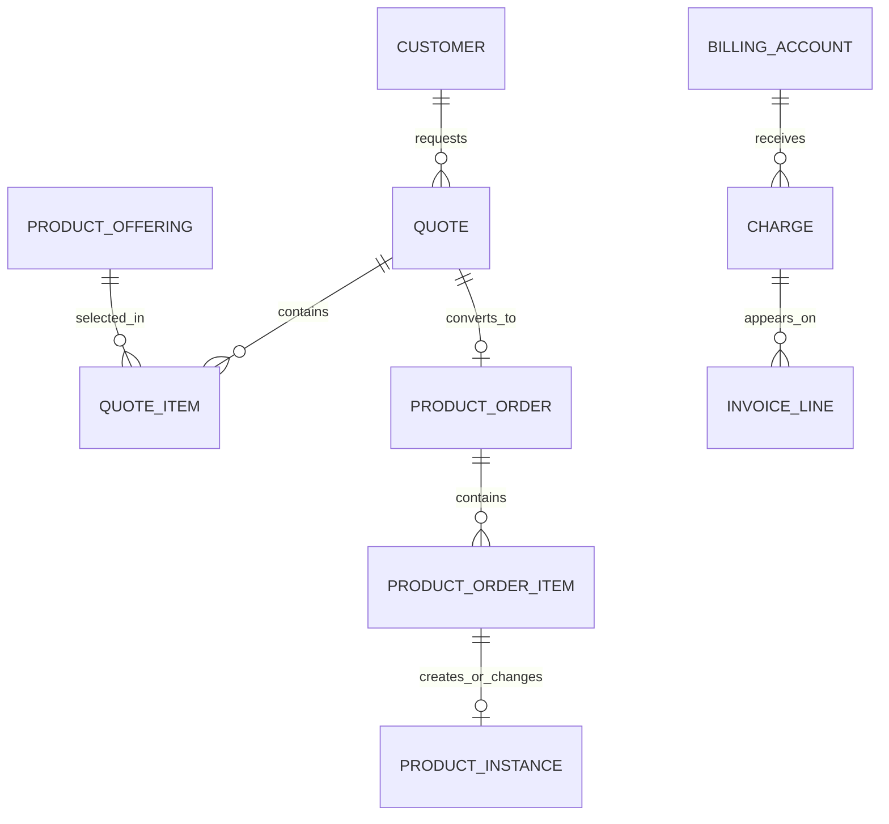
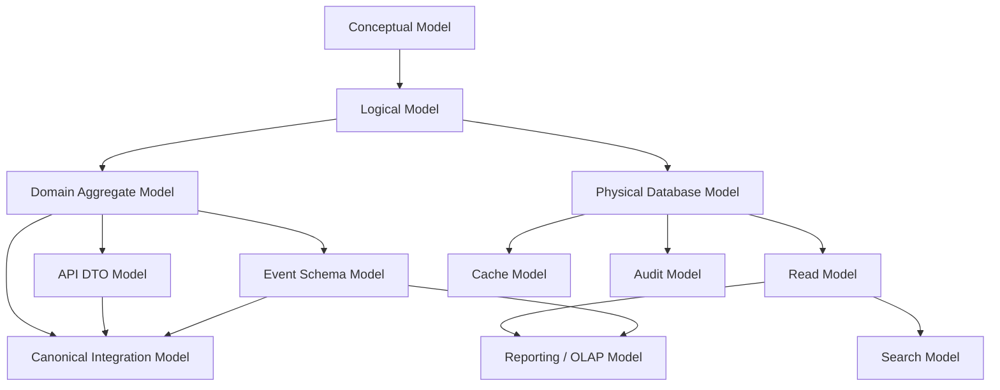

# Data Model Types and Their Boundaries

Kesalahan besar dalam enterprise data modelling adalah menganggap semua model harus sama bentuknya.

Dalam sistem CPQ, quote, order, catalog, billing, telco BSS/OSS, dan quote-to-cash, satu konsep bisnis bisa memiliki banyak representasi berbeda:

```text
Quote as business concept
Quote as logical entity
Quote as aggregate root
Quote as database tables
Quote as API response
Quote as event payload
Quote as search document
Quote as reporting fact
Quote as audit target
Quote as cache value
```

Semua bernama “quote”, tetapi tujuan, constraint, lifecycle, dan risiko masing-masing berbeda.

Part ini fokus pada **boundary antar model**: kapan model boleh mirip, kapan harus berbeda, dan apa risiko jika boundary dicampur.

---

## 1. Why Model Boundaries Matter

Dalam sistem kecil, sering cukup membuat satu class:

```text
Quote.java
  -> mapped to quote table
  -> returned as API response
  -> serialized as event
  -> used in UI
```

Dalam enterprise system, pola ini biasanya menjadi masalah.

Alasannya:

- database schema butuh optimasi untuk integrity dan query,
- API contract butuh backward compatibility,
- event schema butuh compatibility untuk consumer lama,
- domain aggregate butuh behavior dan invariant,
- reporting model butuh denormalisasi,
- search model butuh flattening,
- audit model butuh before/after evidence,
- cache model butuh TTL dan invalidation,
- canonical model butuh integrasi lintas sistem.

Satu bentuk data tidak bisa optimal untuk semua kebutuhan ini.

---

## 2. Boundary Principle

Gunakan prinsip berikut:

> A model should be shaped by its purpose, owner, lifecycle, consumer, and correctness requirement.

Artinya, sebelum membuat atau mengubah model, tanyakan:

```text
1. Model ini untuk siapa?
2. Model ini source of truth atau derived view?
3. Model ini mutable atau immutable?
4. Model ini internal atau external contract?
5. Model ini transactional atau analytical?
6. Model ini synchronous atau asynchronous?
7. Model ini harus backward-compatible atau bebas berubah?
8. Model ini memerlukan audit/history?
9. Model ini memerlukan performance optimization khusus?
10. Model ini boleh stale atau harus strongly consistent?
```

---

## 3. Conceptual ERD

Conceptual ERD menggambarkan konsep bisnis dan hubungan besar antar konsep.

Contoh conceptual ERD untuk quote-to-cash:



Conceptual ERD tidak menjawab:

- nama table,
- column type,
- foreign key detail,
- index,
- JSONB,
- partitioning,
- DTO field,
- event schema.

Conceptual ERD menjawab:

- konsep bisnis utama,
- relationship besar,
- bahasa bersama,
- scope domain,
- kemungkinan bounded context.

### Boundary Rule

Conceptual ERD jangan dipakai langsung sebagai database schema.

### Failure Mode

Jika conceptual ERD langsung dijadikan table design:

- relationship terlalu naïve,
- lifecycle tidak muncul,
- state transition hilang,
- versioning tidak ada,
- audit tidak terdesain,
- reporting dan integration terlupakan.

---

## 4. Logical ERD

Logical ERD lebih detail daripada conceptual ERD.

Logical ERD mulai menentukan:

- entity,
- attribute utama,
- relationship cardinality,
- optionality,
- lifecycle ownership,
- high-level constraint,
- candidate key,
- versioning need.

Contoh logical quote model:

```text
Quote
  - quoteId
  - quoteNumber
  - customerRef
  - accountRef
  - status
  - validFrom
  - validTo
  - currency
  - version

QuoteItem
  - quoteItemId
  - quoteId
  - parentQuoteItemId
  - productOfferingRef
  - action
  - quantity
  - state
  - configurationSnapshotRef

QuotePrice
  - quotePriceId
  - quoteItemId
  - priceType
  - amount
  - currency
  - sourcePriceRef
  - snapshotAt
```

Logical ERD belum harus menentukan:

- PostgreSQL data type,
- index exact,
- table partition,
- migration detail,
- ORM annotation.

### Boundary Rule

Logical ERD harus cukup stabil untuk diskusi domain, tetapi belum terikat penuh ke physical implementation.

### Failure Mode

Jika logical ERD terlalu physical:

- diskusi bisnis menjadi terlalu teknis,
- BA/PO sulit review,
- model cepat terkunci ke database decision,
- conceptual gap tersembunyi.

Jika logical ERD terlalu vague:

- engineer membuat interpretasi berbeda,
- API dan DB drift,
- lifecycle tidak jelas,
- ownership tidak jelas.

---

## 5. Physical ERD / Database Schema Model

Physical ERD adalah implementasi database nyata.

Di PostgreSQL, physical model memperhatikan:

- table,
- column,
- data type,
- primary key,
- foreign key,
- unique constraint,
- check constraint,
- index,
- partition,
- schema namespace,
- sequence/identity,
- JSONB,
- materialized view,
- migration ordering.

Contoh physical concern untuk quote item:

```sql
-- Conceptual example only.
CREATE TABLE quote_item (
    id UUID PRIMARY KEY,
    quote_id UUID NOT NULL,
    parent_quote_item_id UUID NULL,
    product_offering_id UUID NOT NULL,
    action TEXT NOT NULL,
    state TEXT NOT NULL,
    quantity NUMERIC(18, 4) NOT NULL,
    created_at TIMESTAMPTZ NOT NULL,
    updated_at TIMESTAMPTZ NOT NULL,
    version INT NOT NULL,

    CONSTRAINT fk_quote_item_quote
      FOREIGN KEY (quote_id) REFERENCES quote(id),

    CONSTRAINT fk_quote_item_parent
      FOREIGN KEY (parent_quote_item_id) REFERENCES quote_item(id),

    CONSTRAINT quote_item_quantity_positive
      CHECK (quantity > 0)
);
```

Physical model harus menjawab:

- bagaimana data dijaga tetap valid?
- bagaimana query utama dijalankan?
- bagaimana migration dilakukan?
- bagaimana data besar dipartisi?
- bagaimana retention/archive?
- bagaimana locking/concurrency?

### Boundary Rule

Physical model boleh berbeda dari domain model dan API model.

### Failure Mode

Jika API DTO langsung dijadikan physical model:

- table mengikuti kebutuhan UI sementara,
- redundant fields tidak jelas source-nya,
- contract field menjadi sulit dihapus,
- database terlalu mudah berubah karena API request berubah.

Jika domain object langsung dijadikan table:

- aggregate behavior hilang,
- persistence concern bocor ke domain,
- JPA cascade/lazy loading bisa merusak boundary,
- schema optimization sulit.

---

## 6. Domain Aggregate Model

Domain aggregate model adalah model yang menjaga business invariant.

Contoh aggregate:

```text
Quote Aggregate
  Root: Quote
  Children: QuoteItem, QuotePrice, QuoteDiscount, QuoteApprovalSummary
  Invariants:
    - accepted quote cannot be modified
    - submitted quote must have at least one valid quote item
    - quote cannot be accepted without approval if discount exceeds threshold
    - quote cannot be converted after expiry
```

Aggregate bukan sekadar struktur data. Aggregate punya behavior.

Contoh behavior:

```java
// Conceptual example only.
quote.submit(actor, submittedAt);
quote.approve(approvalDecision);
quote.accept(customerAcceptance);
quote.convertToOrder(conversionRequest);
```

Domain aggregate harus bisa menolak operasi invalid.

### Boundary Rule

Domain aggregate tidak harus sama dengan table structure.

Satu aggregate bisa disimpan ke banyak tabel.
Satu tabel bisa mendukung beberapa read model.

### Failure Mode

Jika aggregate boundary terlalu besar:

- transaction terlalu berat,
- concurrency conflict tinggi,
- performance buruk,
- deployment sulit.

Jika aggregate boundary terlalu kecil:

- invariant cross-entity sulit dijaga,
- data mudah inconsistent,
- business rule tersebar.

---

## 7. API DTO Model

API DTO adalah model contract antara service dan client/consumer synchronous.

Contoh quote response DTO:

```json
{
  "id": "q-123",
  "quoteNumber": "Q-2026-000123",
  "status": "APPROVED",
  "customer": {
    "id": "cust-456",
    "name": "Example Enterprise"
  },
  "validUntil": "2026-08-10T23:59:59Z",
  "totalPrice": {
    "amount": "12000.00",
    "currency": "USD"
  },
  "items": []
}
```

DTO concern:

- naming stability,
- backward compatibility,
- field deprecation,
- error representation,
- pagination,
- filtering,
- security masking,
- external ID vs internal ID,
- null vs missing semantics,
- enum compatibility.

### Boundary Rule

API DTO tidak boleh expose internal database schema secara mentah.

### Failure Mode

Jika API DTO sama dengan DB entity:

- internal column bocor ke client,
- sensitive field bisa terekspos,
- schema migration menjadi breaking API change,
- lazy-loaded relation bisa menyebabkan performance issue,
- client bergantung pada detail internal.

---

## 8. Event Schema Model

Event schema adalah contract asynchronous.

Contoh event:

```json
{
  "eventId": "evt-001",
  "eventType": "QuoteAccepted",
  "eventVersion": 1,
  "occurredAt": "2026-07-11T12:00:00Z",
  "aggregateType": "Quote",
  "aggregateId": "q-123",
  "correlationId": "corr-789",
  "causationId": "cmd-456",
  "payload": {
    "quoteId": "q-123",
    "quoteNumber": "Q-2026-000123",
    "customerId": "cust-456",
    "acceptedAt": "2026-07-11T12:00:00Z",
    "validUntil": "2026-08-10T23:59:59Z"
  }
}
```

Event schema concern:

- event identity,
- aggregate identity,
- event type,
- event version,
- metadata,
- payload compatibility,
- ordering,
- idempotency,
- replay,
- consumer ownership,
- schema evolution.

### Boundary Rule

Event payload bukan API response dan bukan DB row.

Event harus merepresentasikan fakta yang sudah terjadi dan durable.

### Failure Mode

Jika event dipublish sebelum DB commit:

```text
Consumer sees event.
Producer transaction rolls back.
Downstream system acts on state that does not exist.
```

Jika event terlalu mirip DB row:

- consumer tahu terlalu banyak detail internal,
- schema evolution sulit,
- payload terlalu besar,
- event meaning tidak jelas.

Jika event terlalu minimal:

- consumer harus call back ke producer,
- coupling meningkat,
- replay sulit,
- historical reconstruction tidak lengkap.

---

## 9. Database Schema Model

Database schema model adalah persistence truth dalam boundary service.

Database model harus memperhatikan:

- transaction boundary,
- consistency,
- idempotency,
- concurrency,
- FK/constraint,
- indexes,
- retention,
- migration,
- query pattern.

Contoh data yang sering dipisah di database:

```text
quote
quote_item
quote_price_snapshot
quote_discount
quote_approval
quote_audit
quote_event_outbox
quote_conversion_attempt
```

Padahal dalam domain/API, user hanya melihat “Quote”.

### Boundary Rule

Database schema adalah internal implementation detail untuk service owner.

Consumer tidak boleh bergantung langsung pada table internal.

### Failure Mode

Jika service lain membaca table langsung:

- schema change menjadi cross-team breaking change,
- invariant owner bisa dibypass,
- authorization bisa dilewati,
- stale interpretation muncul,
- audit tidak lengkap.

---

## 10. Read Model

Read model adalah model yang dioptimalkan untuk query tertentu.

Contoh read model:

```text
quote_summary_view
  - quote_id
  - quote_number
  - customer_name
  - account_name
  - status
  - approval_status
  - total_amount
  - currency
  - valid_until
  - owner_name
  - last_updated_at
```

Read model cocok untuk:

- dashboard,
- search result,
- list page,
- approval queue,
- aging report,
- operational support screen.

Read model boleh denormalized.

### Boundary Rule

Read model boleh stale jika freshness expectation jelas.

### Failure Mode

Jika read model dianggap source of truth:

- write dilakukan ke projection,
- stale data menjadi business decision,
- inconsistency sulit dilacak,
- reconciliation tidak jelas.

---

## 11. Materialized View

Materialized view adalah read model yang disimpan dan di-refresh.

Cocok untuk:

- expensive aggregation,
- operational report,
- large join,
- historical summary,
- dashboard yang tidak butuh real-time absolute.

Concern:

- refresh strategy,
- freshness SLA,
- locking,
- incremental vs full refresh,
- index on materialized view,
- ownership,
- monitoring.

### Boundary Rule

Materialized view bukan pengganti transactional table.

### Failure Mode

Jika freshness tidak jelas:

```text
Support sees order as pending.
Actual order already completed.
Wrong manual intervention performed.
```

---

## 12. Audit Model

Audit model adalah evidence model.

Audit model berbeda dari domain model dan event model.

Contoh audit record:

```json
{
  "auditId": "aud-001",
  "targetType": "Quote",
  "targetId": "q-123",
  "action": "DISCOUNT_CHANGED",
  "actorId": "user-789",
  "actorRole": "SALES_MANAGER",
  "reason": "Enterprise negotiation",
  "before": {
    "discountPercent": "5.00"
  },
  "after": {
    "discountPercent": "15.00"
  },
  "correlationId": "corr-123",
  "occurredAt": "2026-07-11T12:00:00Z"
}
```

Audit model concern:

- before/after,
- actor,
- action,
- reason,
- source system,
- correlation,
- causation,
- retention,
- sensitive data handling,
- queryability,
- legal/compliance requirement.

### Boundary Rule

Audit model harus menjelaskan perubahan, bukan hanya menyalin entity.

### Failure Mode

Jika audit hanya “updated_by/updated_at”:

- tidak bisa membuktikan nilai lama,
- tidak bisa menjelaskan reason,
- tidak bisa trace approval,
- sulit incident investigation,
- dispute customer sulit dibela.

---

## 13. Search Model

Search model adalah document/projection untuk kebutuhan pencarian.

Contoh quote search document:

```json
{
  "quoteId": "q-123",
  "quoteNumber": "Q-2026-000123",
  "customerName": "Example Enterprise",
  "accountName": "Global Account",
  "status": "APPROVED",
  "owner": "Alice",
  "productNames": ["Fiber Internet", "Managed Router"],
  "totalAmount": 12000.00,
  "currency": "USD",
  "createdAt": "2026-07-11T12:00:00Z",
  "validUntil": "2026-08-10T23:59:59Z"
}
```

Search model concern:

- flattening,
- filter fields,
- sort fields,
- facet fields,
- full-text fields,
- security filtering,
- tenant filtering,
- reindexing,
- freshness,
- deletion/retention.

### Boundary Rule

Search model bukan domain model.

Search document boleh berisi denormalized data yang berasal dari banyak source, tetapi source harus jelas.

### Failure Mode

Jika search model tidak memperhatikan security:

- user bisa menemukan quote/customer yang tidak boleh dilihat,
- cross-tenant leak,
- sensitive pricing muncul di index.

Jika reindex process buruk:

- search result stale,
- deleted/archived data masih muncul,
- support mengambil tindakan pada data lama.

---

## 14. Cache Model

Cache model adalah representasi sementara untuk mempercepat akses.

Contoh cache:

```text
catalog:offering:v42:offering-123
pricing:list:v8:enterprise-usd
customer:summary:cust-456
quote:summary:q-123
```

Cache model concern:

- key design,
- value shape,
- TTL,
- invalidation,
- versioning,
- tenant isolation,
- ownership,
- stale data risk,
- fallback behavior,
- observability.

### Boundary Rule

Cache bukan source of truth.

### Failure Mode

Jika catalog/pricing cache stale:

- quote memakai offering retired,
- price salah,
- discount eligibility salah,
- quote acceptance bisa dispute.

Jika cache key tidak tenant-aware:

- cross-tenant data leak.

---

## 15. Canonical Model

Canonical model adalah model integrasi bersama.

Contoh canonical object:

```text
CanonicalCustomer
CanonicalProduct
CanonicalOrder
CanonicalBillingAccount
```

Canonical model concern:

- semantic alignment,
- extension fields,
- versioning,
- mapping from local domain,
- mapping to external system,
- governance,
- compatibility,
- ownership.

### Boundary Rule

Canonical model sebaiknya berada di integration boundary, bukan menggantikan bounded context model.

### Failure Mode

Jika canonical model dipakai sebagai internal model semua service:

- service kehilangan language domain sendiri,
- model menjadi terlalu besar,
- optional fields meledak,
- semantic mismatch tersembunyi,
- release coordination berat,
- perubahan kecil berdampak enterprise-wide.

---

## 16. Boundary Mismatch Examples

### 16.1 API DTO = Database Entity

```text
Problem:
  QuoteEntity returned directly as REST response.

Impact:
  Internal columns exposed.
  Lazy relations accidentally serialized.
  Sensitive fields leak.
  Schema change breaks API.
```

Better:

```text
QuoteEntity -> QuoteAggregate/ReadModel -> QuoteResponseDTO
```

---

### 16.2 Event Payload = Full Database Row

```text
Problem:
  ProductOrderCreated event contains every column from product_order table.

Impact:
  Consumer coupled to producer schema.
  Sensitive internal field exposed.
  Event versioning painful.
  Event meaning unclear.
```

Better:

```text
Event contains stable business fact + minimal required payload + metadata.
```

---

### 16.3 Read Model = Source of Truth

```text
Problem:
  Approval service updates quote_approval_summary_view directly.

Impact:
  Projection no longer derived.
  Source of truth ambiguous.
  Rebuild projection loses update.
```

Better:

```text
Write to approval domain table.
Projection is rebuilt from source/event.
```

---

### 16.4 Cache = Contract

```text
Problem:
  Another service depends on Redis key shape owned by Quote Service.

Impact:
  Cache refactor breaks consumer.
  No compatibility policy.
  Ownership unclear.
```

Better:

```text
Expose API/event/read model contract.
Keep cache internal.
```

---

### 16.5 Canonical Model = Domain Model

```text
Problem:
  Quote Service uses enterprise canonical order object internally.

Impact:
  Quote domain polluted by fields only relevant to billing/fulfillment.
  Business rules become unclear.
  Code filled with null checks and generic extensions.
```

Better:

```text
Quote domain model stays local.
Canonical mapping occurs at integration boundary.
```

---

## 17. Model Boundary Map



Diagram ini bukan urutan teknis mutlak. Ini menunjukkan bahwa setiap model punya boundary dan mapping.

---

## 18. CPQ/Quote/Order/Catalog/Billing Boundary Examples

### 18.1 Product Offering

| Model Type | Representation |
|---|---|
| Conceptual | Sellable thing offered to customer |
| Logical | ProductOffering entity with version, status, validity |
| Physical | `product_offering`, `product_offering_price`, `product_offering_relationship` tables |
| API | Product offering response with selected visible fields |
| Event | `ProductOfferingPublished`, `ProductOfferingRetired` |
| Search | Flattened offering document with category, tags, eligibility hints |
| Cache | Versioned offering cache by catalog version |
| Reporting | Offering usage count in quote/order |
| Audit | Who changed offering status/price/relation |

---

### 18.2 Quote

| Model Type | Representation |
|---|---|
| Conceptual | Commercial proposal to customer |
| Logical | Quote, QuoteItem, QuotePrice, QuoteApproval |
| Physical | Multiple normalized tables with status, version, snapshot |
| API | Quote detail/list/summary DTO |
| Event | `QuoteCreated`, `QuoteSubmitted`, `QuoteAccepted`, `QuoteConverted` |
| Search | Quote searchable by number, customer, owner, status, product |
| Cache | Quote summary for UI or workflow lookup |
| Reporting | Quote funnel, aging, conversion rate |
| Audit | Price/discount/status/approval changes |

---

### 18.3 Product Order

| Model Type | Representation |
|---|---|
| Conceptual | Execution instruction created from accepted quote |
| Logical | ProductOrder, ProductOrderItem, OrderMilestone, OrderDependency |
| Physical | Order tables, item tables, status history, integration attempt |
| API | Product order create/status response |
| Event | `ProductOrderCreated`, `OrderItemCompleted`, `OrderFalloutRaised` |
| Search | Searchable order document |
| Cache | Order status cache |
| Reporting | Stuck order, fallout rate, SLA aging |
| Audit | State transitions, manual intervention, cancellation/amendment |

---

### 18.4 Billing Account

| Model Type | Representation |
|---|---|
| Conceptual | Account responsible for billing/invoice/payment |
| Logical | BillingAccount, BillingProfile, PaymentMethodRef, TaxProfile |
| Physical | Billing account/profile tables or external reference tables |
| API | Billing account reference/summary |
| Event | `BillingAccountCreated`, `BillingProfileUpdated` |
| Search | Customer/billing account lookup |
| Cache | Billing account summary cache |
| Reporting | Invoice aging, account revenue |
| Audit | Billing profile changes, tax/payment preference changes |

---

## 19. Mapping Layer

Mapping layer adalah komponen yang menerjemahkan antar model.

Contoh mapping:

```text
Request DTO -> Command
Command -> Domain Aggregate operation
Domain Aggregate -> Persistence rows
Persistence rows -> Domain Aggregate
Domain Event -> Outbox Event row
Domain/Read Model -> Response DTO
Persistence/Event -> Reporting projection
```

Mapping layer harus eksplisit agar:

- contract tidak bocor,
- sensitive field bisa difilter,
- enum bisa diterjemahkan,
- backward compatibility bisa dijaga,
- internal refactoring aman,
- audit dan event metadata bisa ditambahkan.

---

## 20. Boundary Review Checklist

Saat melihat model baru, tanyakan:

```text
1. Ini model jenis apa?
2. Siapa consumer model ini?
3. Apakah model ini internal atau external contract?
4. Apakah model ini source of truth atau derived?
5. Apakah model ini boleh stale?
6. Apakah model ini mutable atau immutable?
7. Apakah field ini berasal dari domain, persistence, API, event, atau report?
8. Apakah ada sensitive field yang bocor ke API/event/search/log/cache?
9. Apakah model ini punya lifecycle sendiri?
10. Apakah model ini punya versioning policy?
11. Apakah model ini punya owner?
12. Apakah ada mapping layer eksplisit?
13. Apakah perubahan model ini breaking untuk consumer?
14. Apakah migration/backfill diperlukan?
15. Apakah audit/reporting/search/cache terdampak?
```

---

## 21. Boundary Smell Catalog

### Smell 1: DTO Has Database Column Names

Contoh smell:

```json
{
  "quote_hdr_id": "...",
  "quote_stat_cd": "...",
  "upd_ts": "..."
}
```

Kemungkinan masalah:

- API bocor dari physical schema,
- naming tidak domain-oriented,
- client akan bergantung pada detail internal.

---

### Smell 2: Event Contains UI-Only Fields

Contoh:

```json
{
  "eventType": "QuoteSubmitted",
  "payload": {
    "buttonLabel": "Submit Quote",
    "screenSection": "approvalPanel"
  }
}
```

Kemungkinan masalah:

- event polluted by presentation concern,
- consumer bingung semantics,
- UI refactor memengaruhi event.

---

### Smell 3: Database Table Has External API Version Fields Everywhere

Contoh:

```text
api_v1_field_name
api_v2_field_name
legacy_response_flag
```

Kemungkinan masalah:

- persistence model tercemar contract compatibility,
- mapping layer kurang,
- versioning API salah tempat.

---

### Smell 4: Search Index Is Used for Business Validation

Contoh:

```text
Before accepting quote, service checks search index to see whether customer is active.
```

Kemungkinan masalah:

- search index stale,
- validation tidak strongly consistent,
- quote acceptance bisa salah.

---

### Smell 5: Cache Key Used as External Identifier

Contoh:

```text
catalog:tenant-1:v42:offering-123 exposed to client
```

Kemungkinan masalah:

- internal cache structure menjadi API contract,
- cache refactor breaking,
- tenant/version detail bocor.

---

## 22. Java/JAX-RS Implementation Boundary

Dalam Java service, boundary bisa dijaga dengan package/layer yang jelas.

Contoh struktur konseptual:

```text
com.company.quote.api
  QuoteResource
  QuoteRequestDto
  QuoteResponseDto

com.company.quote.application
  SubmitQuoteCommand
  SubmitQuoteHandler
  QuoteApplicationService

com.company.quote.domain
  Quote
  QuoteItem
  QuoteStatus
  QuoteInvariantViolation
  QuoteAcceptedEvent

com.company.quote.persistence
  QuoteRepository
  QuoteMapper
  QuoteEntity
  QuoteItemEntity

com.company.quote.integration
  QuoteEventPublisher
  QuoteOutboxRecord
  BillingClient

com.company.quote.reporting
  QuoteSummaryProjection
```

Boundary rule:

```text
API layer should not return persistence entity.
Domain layer should not depend on JAX-RS DTO.
Event schema should not be generated blindly from entity.
Reporting projection should not be used as command model.
```

---

## 23. MyBatis/JPA/JDBC Boundary Concerns

### MyBatis

MyBatis membuat SQL eksplisit. Ini bagus untuk read model dan complex query.

Boundary concern:

- mapper result tidak otomatis domain aggregate,
- query projection jangan dipakai sebagai write model,
- SQL result harus jelas consumer-nya,
- DTO mapping jangan dicampur dengan persistence row mapping.

### JPA

JPA sering menggoda engineer untuk menjadikan entity sebagai domain model sekaligus persistence model.

Boundary concern:

- lazy loading bocor ke API,
- cascade bisa menulis data tanpa domain invariant,
- bidirectional relation membuat aggregate boundary kabur,
- generated schema bukan pengganti data modelling.

### JDBC

JDBC memberi kontrol, tetapi boundary harus manual.

Boundary concern:

- row mapper harus jelas output-nya,
- transaction boundary explicit,
- mapping duplication harus dikendalikan,
- SQL error harus diterjemahkan ke domain/application error.

---

## 24. Event and API Compatibility Boundaries

API dan event sama-sama contract, tetapi compatibility-nya berbeda.

| Concern | API | Event |
|---|---|---|
| Interaction | synchronous | asynchronous |
| Consumer | client/service caller | event consumer |
| Failure | immediate response | retry/DLQ/replay |
| Versioning | endpoint/media/field compatibility | schema/event version |
| Ordering | per request | per key/partition/queue semantics |
| State | request-time view | fact after state change |
| Replay | usually no | often yes |

Jangan menganggap event schema bisa sama dengan API response.

API response sering menjawab:

```text
What is the current view of this resource?
```

Event menjawab:

```text
What fact just happened?
```

---

## 25. Reporting Boundary

Reporting model sering membutuhkan data lintas bounded context.

Contoh report:

```text
Quote conversion rate by product family and sales channel.
```

Data yang dibutuhkan:

- quote,
- quote item,
- product offering,
- product family,
- sales channel,
- order conversion,
- time dimension.

Jika report langsung join semua OLTP table lintas service, boundary rusak.

Alternatif:

- event-driven projection,
- reporting database,
- materialized read model,
- ETL/ELT pipeline,
- fact/dimension model.

Reporting boleh duplicate data, tetapi harus jelas:

- source,
- freshness,
- transformation logic,
- reconciliation method,
- ownership.

---

## 26. Audit Boundary

Audit model tidak boleh hanya dianggap sebagai event model.

Domain event:

```text
QuoteAccepted
```

Audit event:

```text
Actor Alice accepted Quote Q-123 through UI using customer acceptance evidence E-456 at time T.
Before status APPROVED, after status ACCEPTED.
```

Event memberi tahu sistem lain bahwa fakta terjadi.
Audit menjelaskan bukti perubahan.

Keduanya bisa dibuat dari action yang sama, tetapi modelnya berbeda.

---

## 27. Security Boundary

Model boundary harus mempertimbangkan data exposure.

Sensitive fields bisa aman di database tetapi tidak aman di:

- API response,
- event payload,
- search index,
- cache value,
- logs,
- audit before/after,
- reporting export.

Contoh sensitive data:

- customer contact,
- billing address,
- payment reference,
- contract terms,
- negotiated discount,
- margin/cost,
- approval comment,
- internal fallout reason,
- tenant identifier,
- external system credential/reference.

Boundary review harus selalu bertanya:

```text
Should this field cross this boundary?
```

---

## 28. Performance Boundary

Setiap model punya performance concern berbeda.

| Model | Performance Concern |
|---|---|
| Domain aggregate | transaction size, loading strategy, locking |
| Physical DB | index, join, partition, constraint cost |
| API DTO | payload size, pagination, nested expansion |
| Event | payload size, partition key, consumer throughput |
| Read model | refresh cost, denormalization correctness |
| Search model | indexing lag, query latency, security filtering |
| Cache model | hit ratio, invalidation, stale risk |
| Audit model | write volume, retention, queryability |

Performance optimization di satu model bisa merusak correctness di model lain jika tidak hati-hati.

---

## 29. Model Drift

Model drift terjadi saat representasi data antar layer perlahan tidak sinkron secara semantic.

Contoh drift:

```text
Database status: APPROVED
API status: READY_FOR_ACCEPTANCE
Event status: APPROVED_PENDING_CUSTOMER
UI label: Approved
Report bucket: Submitted
```

Mungkin semua terlihat benar secara lokal, tetapi secara enterprise membingungkan.

Penyebab drift:

- mapping tidak eksplisit,
- enum tidak terdokumentasi,
- backward compatibility patch tanpa cleanup,
- reporting transformation berbeda,
- event version lama masih dipakai,
- business terminology berubah.

Mitigasi:

- glossary,
- mapping table,
- contract tests,
- state transition docs,
- data dictionary,
- schema governance,
- observability metric.

---

## 30. Boundary Decision Matrix

Gunakan matrix ini saat mendesain model.

| Question | Conceptual | Logical | Physical | API | Event | Read/Search | Audit |
|---|---|---|---|---|---|---|---|
| Business meaning | High | High | Medium | Medium | High | Medium | High |
| Implementation detail | Low | Medium | High | Medium | Medium | High | Medium |
| External compatibility | Low | Low | Low | High | High | Medium | Medium |
| Query performance | Low | Medium | High | Medium | Medium | High | Medium |
| Historical evidence | Medium | Medium | Medium | Low | Medium | Medium | High |
| Mutability | Conceptual | Controlled | Controlled | Contractual | Immutable fact | Derived | Append-oriented |
| Owner | Business/domain | Domain architect | Service/DB owner | API owner | Event owner | Projection owner | Audit owner |

---

## 31. Internal Verification Checklist

Gunakan checklist ini untuk memeriksa boundary model di codebase dan dokumentasi internal.

### Conceptual / Logical Model

- Apakah ada ERD konseptual?
- Apakah ada logical ERD?
- Apakah entity relationship dijelaskan dengan business meaning?
- Apakah cardinality dan optionality jelas?
- Apakah lifecycle entity utama terdokumentasi?
- Apakah istilah domain konsisten dengan BA/PO/architect?

### Physical Model

- Apakah table design sesuai logical model?
- Apakah ada constraint yang menjaga invariant dasar?
- Apakah index sesuai query pattern?
- Apakah JSONB/EAV digunakan dengan alasan jelas?
- Apakah migration scripts terdokumentasi?
- Apakah table history/audit tersedia?

### Domain Model

- Apakah aggregate root jelas?
- Apakah business invariant ada di domain/application layer?
- Apakah state transition centralized?
- Apakah domain model bebas dari JAX-RS DTO?
- Apakah domain model bebas dari persistence-specific leakage?

### API Model

- Apakah DTO terpisah dari DB entity?
- Apakah API field punya backward compatibility policy?
- Apakah sensitive field dimasking?
- Apakah enum API terdokumentasi?
- Apakah pagination/filter/sort contract jelas?

### Event Model

- Apakah event schema terpisah dari API DTO?
- Apakah event punya metadata wajib?
- Apakah event versioned?
- Apakah outbox digunakan?
- Apakah consumer idempotent?
- Apakah event ordering key jelas?

### Read / Reporting Model

- Apakah read model source-nya jelas?
- Apakah freshness SLA jelas?
- Apakah projection bisa direbuild?
- Apakah reporting query tidak membebani OLTP secara berlebihan?
- Apakah metric lifecycle punya definisi konsisten?

### Search Model

- Apakah search document hanya berisi field yang aman dicari?
- Apakah tenant/security filtering diterapkan?
- Apakah reindex process tersedia?
- Apakah stale search result dimonitor?

### Cache Model

- Apakah cache key internal dan tidak menjadi contract?
- Apakah TTL/invalidation jelas?
- Apakah cache tenant-aware?
- Apakah stale data failure mode terdokumentasi?

### Audit Model

- Apakah audit before/after tersedia untuk field penting?
- Apakah actor/action/reason/correlation dicatat?
- Apakah approval trace tersambung?
- Apakah audit retention policy jelas?

### Canonical Model

- Apakah canonical model hanya dipakai di integration boundary?
- Apakah local domain model tetap independen?
- Apakah extension field terkendali?
- Apakah semantic mismatch didokumentasikan?

---

## 32. PR Review Checklist for Model Boundaries

Saat review PR, gunakan pertanyaan berikut:

```text
1. Model apa yang berubah: DB, API, event, domain, read, search, cache, audit, atau reporting?
2. Apakah perubahan di satu model membutuhkan perubahan mapping di model lain?
3. Apakah external contract berubah?
4. Apakah backward compatibility aman?
5. Apakah field baru perlu audit?
6. Apakah field baru boleh masuk API/event/search/cache/log?
7. Apakah migration/backfill diperlukan?
8. Apakah read model/projection perlu rebuild?
9. Apakah index perlu ditambah/diubah?
10. Apakah event consumer terdampak?
11. Apakah API client terdampak?
12. Apakah report/KPI terdampak?
13. Apakah cache invalidation terdampak?
14. Apakah data ownership tetap jelas?
15. Apakah test mencakup boundary mapping?
```

---

## 33. Practical Example: Adding Quote Expiry Reason

Misalkan bisnis ingin menambahkan alasan kenapa quote expired.

### Conceptual Model

```text
Quote may expire because of validity date, customer rejection, superseded revision, or manual cancellation-like business reason.
```

### Logical Model

Tambahkan konsep:

```text
QuoteExpiryReason
  - reasonCode
  - reasonDescription
  - source
  - actorRef
  - expiredAt
```

### Physical Model

Opsi:

```text
Add columns to quote:
  expiry_reason_code
  expired_at
  expired_by

Or create quote_expiry table if richer history is required.
```

### Domain Model

```text
quote.expire(reason, actor, time)
```

Guard:

```text
Only non-terminal quote can expire.
Accepted or converted quote cannot expire.
```

### API Model

Response may expose:

```json
{
  "status": "EXPIRED",
  "expiryReason": "VALIDITY_PERIOD_ENDED",
  "expiredAt": "..."
}
```

But internal actor/source may not be exposed.

### Event Model

Publish:

```text
QuoteExpired
```

Payload includes stable reason code, not internal DB fields.

### Audit Model

Audit records actor/source/reason/before-after status.

### Reporting Model

Quote expiry funnel can group by reason.

### Search Model

Quote search may filter by expired status, but maybe not by detailed internal reason.

### Cache Model

Quote summary cache must be invalidated.

### Boundary Lesson

Satu business change memengaruhi banyak model, tetapi setiap model menerima bentuk data yang berbeda.

---

## 34. Summary

Model boundary adalah fondasi enterprise data modelling.

Prinsip utama:

- conceptual model menyamakan business meaning,
- logical model merinci entity dan relationship,
- physical model mengoptimalkan persistence dan integrity,
- domain aggregate menjaga invariant,
- API DTO menjaga synchronous contract,
- event schema menjaga asynchronous contract,
- read model mengoptimalkan query,
- materialized view mengoptimalkan reporting tertentu,
- audit model menyimpan evidence,
- search model mengoptimalkan discovery,
- cache model mengoptimalkan latency,
- canonical model membantu integrasi tetapi bisa menjadi coupling risk.

Jangan memaksa satu bentuk data menjadi semua model.

> Model boundary yang jelas membuat sistem lebih mudah berubah, lebih aman di production, lebih mudah diaudit, dan lebih mudah direkonsiliasi.

---

## 35. Learning Outcome

Setelah menyelesaikan part ini, Anda harus mampu:

- membedakan conceptual ERD, logical ERD, physical ERD, domain aggregate, API DTO, event schema, database schema, read model, materialized view, audit model, search model, cache model, dan canonical model,
- menjelaskan kenapa setiap model punya purpose dan boundary berbeda,
- mendeteksi boundary mismatch dalam PR atau desain architecture,
- menghindari penggunaan DB entity sebagai API response atau event payload,
- memahami risiko canonical model yang terlalu dominan,
- menilai dampak perubahan field/entity ke API, event, reporting, cache, audit, dan migration,
- membuat checklist review untuk model mapping dan contract compatibility.

---

## 36. Prerequisite untuk Part Berikutnya

Sebelum lanjut ke Part 003, pastikan Anda sudah memahami:

- model boundary,
- source of truth vs derived model,
- internal model vs external contract,
- DTO vs entity vs event payload,
- read model vs write model,
- cache/search/reporting as projections,
- audit as evidence model,
- canonical model risk.

Part berikutnya akan masuk ke **Domain-Driven Data Modelling**: entity, value object, aggregate, aggregate root, bounded context, invariant, lifecycle state, domain event, dan data ownership.
