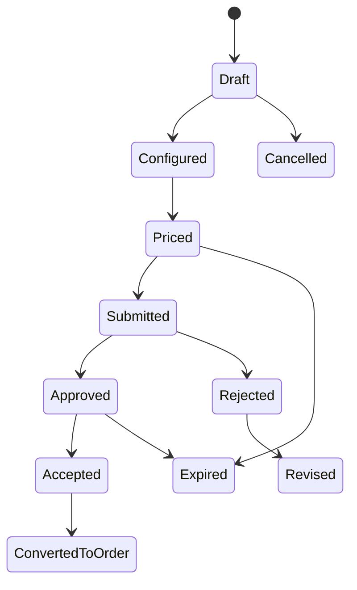
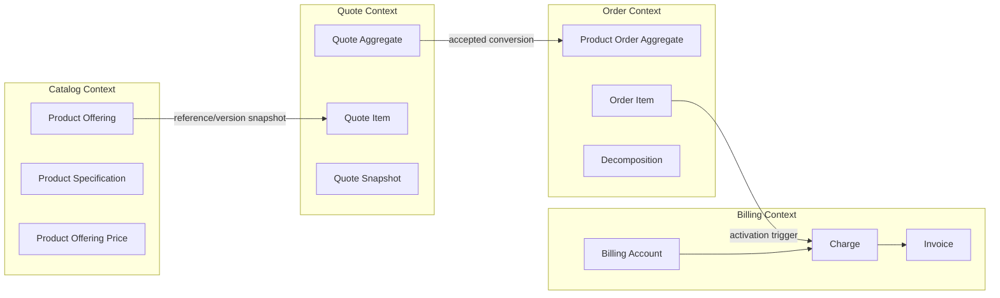

# Domain-Driven Data Modelling

Domain-driven data modelling adalah cara memodelkan data berdasarkan **aturan bisnis, lifecycle, ownership, dan invariant domain**, bukan berdasarkan bentuk tabel, bentuk request JSON, atau convenience class di Java.

Dalam sistem CPQ, quote management, order management, catalog, billing, telco BSS/OSS, dan quote-to-cash, model data yang buruk biasanya bukan gagal karena kolomnya kurang. Ia gagal karena tidak jelas:

- siapa pemilik data,
- lifecycle apa yang sedang dimodelkan,
- state mana yang valid,
- perubahan mana yang legal,
- kapan data boleh berubah,
- kapan data harus immutable,
- mana data source of truth,
- dan invariant apa yang harus dijaga lintas entity.

DDD membantu senior backend engineer melihat data model sebagai **model perilaku bisnis yang dipersist**, bukan sekadar struktur penyimpanan.

---

## 1. Core Mental Model

DDD data modelling tidak dimulai dari pertanyaan:

```text
Tabel apa yang harus dibuat?
```

DDD data modelling dimulai dari pertanyaan:

```text
Konsep bisnis apa yang sedang kita lindungi kebenarannya?
```

Contoh dalam CPQ dan quote-to-cash:

| Area | Pertanyaan DDD |
|---|---|
| Catalog | Siapa yang berhak memutuskan product offering valid untuk dijual? |
| Configuration | Apa yang membuat konfigurasi produk dianggap valid atau invalid? |
| Pricing | Kapan harga dianggap final dan tidak boleh dihitung ulang sembarangan? |
| Quote | Kapan quote masih draft dan kapan sudah menjadi commercial evidence? |
| Approval | Siapa yang boleh menyetujui discount tertentu? |
| Order | Kapan order item boleh masuk fulfillment? |
| Billing | Kapan order menghasilkan billable charge? |
| Inventory | Kapan product instance dianggap active, suspended, atau terminated? |

DDD membuat setiap pertanyaan ini diterjemahkan menjadi entity, value object, aggregate, invariant, lifecycle state, event, repository, dan ownership boundary.

---

## 2. Entity

Entity adalah object domain yang identitasnya penting dan bertahan sepanjang waktu.

Entity bukan sekadar row database. Entity adalah object yang bisa berubah state tetapi tetap dianggap object yang sama karena identitasnya stabil.

Contoh entity dalam CPQ/order/billing:

| Entity | Identitas Stabil | Kenapa Entity? |
|---|---|---|
| Customer | customerId / externalCustomerId | Customer memiliki lifecycle dan relationship jangka panjang. |
| Billing Account | billingAccountId | Digunakan untuk invoice, tax, payment, dan responsibility. |
| Product Offering | offeringId + version | Offering punya lifecycle catalog dan effective date. |
| Quote | quoteId / quoteNumber | Quote berubah dari draft sampai accepted/expired/converted. |
| Quote Item | quoteItemId | Item punya configuration, price, state, dan relationship. |
| Product Order | orderId / orderNumber | Order punya lifecycle fulfillment dan billing activation. |
| Order Item | orderItemId | Item punya action, dependency, milestone, dan fulfillment result. |
| Product Instance | productInstanceId | Installed product bertahan setelah order selesai. |
| Agreement | agreementId | Agreement punya term, amendment, renewal, dan expiry. |

Entity harus memiliki **identity semantics** yang jelas.

Buruk:

```text
Quote dianggap sama jika customer_id dan created_date sama.
```

Lebih baik:

```text
Quote memiliki quote_id sebagai internal stable identifier dan quote_number sebagai business-facing identifier.
```

Untuk production system, entity identity harus mendukung:

- update lifecycle,
- audit trail,
- external reference,
- idempotency,
- reconciliation,
- search,
- reporting,
- dan incident debugging.

---

## 3. Value Object

Value object adalah object yang identitasnya tidak penting. Yang penting adalah nilainya.

Contoh value object:

| Value Object | Contoh Field | Catatan |
|---|---|---|
| Money | amount, currency | Tidak boleh amount tanpa currency. |
| ValidityPeriod | validFrom, validTo | Penting untuk price, catalog, agreement, quote. |
| Address | street, city, postalCode, country | Bisa entity jika address punya lifecycle/mastering sendiri. |
| ContactMedium | type, value, preference | Bisa value object dalam customer/contact context. |
| Quantity | value, unit | Penting untuk usage, order quantity, bandwidth, seats. |
| TaxAmount | amount, taxCode, jurisdiction | Biasanya hasil calculation, bukan source rule. |
| PriceComponent | type, amount, recurrence | Digunakan untuk quote price breakdown. |
| CorrelationReference | correlationId, causationId | Digunakan untuk traceability. |

Value object bagus untuk mengekspresikan invariant kecil.

Contoh invariant:

```text
Money harus selalu memiliki currency.
ValidityPeriod valid jika validFrom < validTo.
Quantity tidak boleh negatif kecuali secara eksplisit merepresentasikan credit/reversal.
```

Dalam Java, value object sering lebih aman daripada primitive obsession.

Buruk:

```java
BigDecimal amount;
String currency;
```

Lebih baik secara domain:

```java
Money recurringCharge;
```

Tetapi dalam persistence PostgreSQL, value object bisa disimpan sebagai beberapa kolom:

```sql
recurring_charge_amount numeric(19, 4) not null,
recurring_charge_currency varchar(3) not null
```

Prinsipnya:

```text
Domain boleh expressive.
Database harus queryable dan constrained.
API harus stable.
Event harus backward-compatible.
```

---

## 4. Aggregate

Aggregate adalah boundary konsistensi. Aggregate menentukan data mana yang harus berubah bersama agar invariant tetap benar.

Aggregate bukan sekadar kumpulan entity yang berelasi. Aggregate adalah **unit perubahan transactional**.

Contoh aggregate dalam quote domain:

```text
Quote Aggregate
  - Quote header
  - Quote item
  - Quote price summary
  - Quote validation state
  - Quote approval state reference
```

Invariant quote aggregate:

```text
Accepted quote tidak boleh diubah.
Quote total harus konsisten dengan sum active quote item price.
Quote tidak boleh submitted jika ada invalid quote item.
Quote tidak boleh accepted jika approval required tetapi belum approved.
Quote tidak boleh converted lebih dari sekali.
```

Contoh aggregate dalam order domain:

```text
Order Aggregate
  - Order header
  - Order item
  - Order item dependency
  - Order state summary
```

Invariant order aggregate:

```text
Order tidak boleh completed jika ada mandatory order item belum terminal.
Order item action harus valid terhadap product inventory state.
Cancelled order tidak boleh membuat billing activation baru.
Order item dependency tidak boleh cyclic.
```

Aggregate harus dirancang berdasarkan **write consistency**, bukan berdasarkan UI view.

Jika UI butuh menampilkan quote + customer + catalog + approval history + latest order status, itu kemungkinan read model, bukan satu aggregate raksasa.

---

## 5. Aggregate Root

Aggregate root adalah entity utama yang menjadi pintu masuk perubahan aggregate.

Rule dasar:

```text
Entity di dalam aggregate tidak boleh dimodifikasi langsung dari luar aggregate root.
```

Contoh:

```text
QuoteItem price tidak diubah langsung oleh QuoteItemRepository.
Perubahan dilakukan melalui Quote aggregate:

Quote.applyPricing(pricingResult)
Quote.addItem(configuration)
Quote.submitForApproval()
Quote.accept()
Quote.convertToOrder()
```

Tujuannya bukan memaksakan style object-oriented. Tujuannya adalah menjaga invariant.

Jika setiap service bisa update `quote_item.price_amount` langsung, maka sulit menjamin:

- quote total benar,
- approval status masih valid,
- margin threshold masih valid,
- audit trail lengkap,
- event yang dipublish konsisten,
- read model tidak stale.

Dalam aplikasi Java/JAX-RS, aggregate root biasanya tidak harus diekspos sebagai API model. API resource menerima command DTO, lalu application service memuat aggregate root dan menjalankan operasi domain.

```text
POST /quotes/{quoteId}/items
  -> AddQuoteItemRequest DTO
  -> QuoteApplicationService
  -> QuoteRepository.load(quoteId)
  -> Quote.addItem(...)
  -> QuoteRepository.save(quote)
  -> Outbox event: QuoteItemAdded
```

---

## 6. Domain Service

Domain service digunakan saat operasi domain tidak natural dimiliki satu entity/value object.

Contoh domain service:

| Domain Service | Tanggung Jawab |
|---|---|
| PricingService | Menghitung harga berdasarkan offering, configuration, customer, contract, effective date. |
| EligibilityService | Menentukan apakah customer/site/channel eligible membeli offering. |
| CompatibilityService | Mengevaluasi compatibility antar offering/options. |
| QuoteValidationService | Memvalidasi quote sebelum submit/approval. |
| OrderDecompositionService | Mengubah product order item menjadi service/resource fulfillment tasks. |
| BillingActivationService | Menentukan kapan order menghasilkan billable charge. |
| ApprovalPolicyService | Menentukan apakah quote perlu approval dan siapa approver-nya. |

Domain service bukan tempat membuang semua logic. Domain service harus punya konsep bisnis yang jelas.

Buruk:

```text
QuoteHelper
OrderUtil
DataService
CommonDomainService
```

Lebih baik:

```text
QuotePricingPolicy
OrderDecompositionPolicy
BillingActivationPolicy
DiscountApprovalPolicy
```

---

## 7. Repository

Repository adalah abstraction untuk mengambil dan menyimpan aggregate.

Repository bukan DAO generik untuk setiap table.

Buruk:

```text
QuoteHeaderDao
QuoteItemDao
QuotePriceDao
QuoteStatusDao
```

Lebih baik pada domain layer:

```text
QuoteRepository
  - findById(QuoteId)
  - save(Quote)
  - existsByQuoteNumber(QuoteNumber)
```

Pada infrastructure layer, repository boleh menggunakan banyak mapper/table:

```text
QuoteRepositoryImpl
  -> quote_header table
  -> quote_item table
  -> quote_item_price table
  -> quote_audit table
  -> outbox_event table
```

Dalam MyBatis/JPA/JDBC, senior engineer perlu membedakan:

```text
Repository interface = domain/application abstraction
Mapper/DAO = persistence implementation detail
Table = physical storage
```

Jangan membuat domain model tunduk total pada mapper convenience.

---

## 8. Bounded Context

Bounded context adalah batas makna model.

Satu istilah bisa punya makna berbeda di context berbeda.

Contoh istilah “Product”:

| Context | Arti Product |
|---|---|
| Catalog | Product offering/specification yang bisa dijual. |
| Quote | Product yang sedang dikonfigurasi dan dihargai. |
| Order | Product yang diperintahkan untuk add/modify/disconnect. |
| Inventory | Installed product milik customer. |
| Billing | Product/charge reference untuk invoice. |
| OSS | Service/resource realization. |

Kesalahan umum adalah membuat satu `Product` table atau satu `ProductDTO` untuk semua context.

Akibatnya:

- field menjadi terlalu banyak,
- lifecycle campur aduk,
- status ambigu,
- ownership tidak jelas,
- API sulit versioning,
- reporting penuh special case,
- incident sulit di-debug.

Model yang lebih sehat:

```text
Catalog Context
  ProductOffering
  ProductSpecification
  ProductOfferingPrice

Quote Context
  QuoteItem
  QuoteProductConfiguration
  QuotePriceSnapshot

Order Context
  ProductOrderItem
  OrderAction
  FulfillmentDependency

Inventory Context
  ProductInstance
  InstalledProductRelationship

Billing Context
  Charge
  InvoiceLine
  BillingAccount
```

---

## 9. Ubiquitous Language

Ubiquitous language adalah bahasa bersama antara engineer, BA, product owner, solution architect, support, dan domain expert.

Dalam enterprise system, naming bukan kosmetik. Naming menentukan cara orang memahami data.

Contoh naming ambiguity:

```text
account
```

Bisa berarti:

- customer account,
- billing account,
- service account,
- financial account,
- login account,
- CRM account,
- organization account.

Jika schema hanya punya `account_id`, maka reviewer harus bertanya:

```text
Account yang mana?
Dalam context apa?
Siapa owner-nya?
Apakah account ini payer, buyer, service owner, atau login principal?
```

Ubiquitous language harus tercermin di:

- ERD,
- table name,
- column name,
- Java class,
- API DTO,
- event schema,
- documentation,
- test case,
- dashboard,
- incident report.

---

## 10. Shared Kernel

Shared kernel adalah bagian kecil dari model yang sengaja dibagi oleh beberapa bounded context.

Contoh shared kernel yang mungkin valid:

- Money,
- CurrencyCode,
- DateRange,
- CorrelationId,
- TenantId,
- PartyReference,
- ProductOfferingReference,
- BillingAccountReference.

Shared kernel harus kecil dan stabil. Jika terlalu besar, ia berubah menjadi distributed monolith.

Risiko shared kernel:

```text
Satu perubahan field di shared library memaksa banyak service deploy.
Satu enum dipakai lintas context padahal lifecycle berbeda.
Satu DTO dipakai untuk API, event, dan persistence.
```

Rule praktis:

```text
Share semantic primitives and references.
Do not casually share aggregates.
```

---

## 11. Anti-Corruption Layer

Anti-corruption layer adalah mapping boundary untuk mencegah model internal tercemar oleh model external system.

Dalam CPQ/order/billing, external system bisa berupa:

- CRM,
- billing platform,
- product catalog provider,
- provisioning system,
- tax engine,
- payment gateway,
- data warehouse,
- TM Forum Open API consumer/provider,
- legacy order management system.

Tanpa anti-corruption layer, model internal akan mengikuti format external payload.

Contoh buruk:

```text
Internal Order table menyimpan status persis seperti downstream provisioning status.
```

Akibat:

- domain lifecycle menjadi tergantung vendor/downstream,
- status internal sulit dijaga,
- perubahan external API memaksa schema internal berubah,
- reporting jadi ambigu.

Lebih baik:

```text
External status -> Integration adapter -> Internal domain status mapping
```

Contoh mapping:

| External Provisioning Status | Internal Fulfillment State |
|---|---|
| RECEIVED | FulfillmentPending |
| IN_EXECUTION | InProgress |
| PARTIAL_DONE | PartiallyFulfilled |
| DONE | Fulfilled |
| TECHNICAL_ERROR | Fallout |
| CANCELLED_BY_PROVIDER | Cancelled |

Internal model tetap stabil. External mapping terdokumentasi dan bisa diuji.

---

## 12. Domain Invariant

Invariant adalah aturan yang harus selalu benar.

Contoh invariant CPQ:

```text
Quote yang accepted tidak boleh berubah price-nya.
Discount di atas threshold membutuhkan approval.
Product offering retired tidak boleh dipakai untuk quote baru.
Quote expired tidak boleh dikonversi menjadi order.
```

Contoh invariant order:

```text
Order item tidak boleh fulfilled sebelum dependency mandatory fulfilled.
Order completed harus memiliki semua mandatory item terminal.
Cancel tidak boleh menghapus audit history.
Modify/disconnect harus refer ke product instance yang valid.
```

Contoh invariant billing:

```text
Charge harus punya billing account.
Recurring charge harus punya billing period.
Invoice line harus traceable ke charge/source.
Usage charge harus traceable ke rated usage.
```

Invariant bisa ditegakkan di beberapa layer:

| Layer | Cocok Untuk | Contoh |
|---|---|---|
| Database constraint | Invariant lokal, sederhana, selalu benar | NOT NULL, UNIQUE, CHECK amount >= 0 |
| Application/domain service | Invariant multi-entity atau lifecycle | Quote accepted cannot be modified |
| Workflow engine | Process sequencing | Approval before acceptance |
| Event consumer | Projection consistency | Ignore stale event version |
| Reconciliation job | Cross-system correctness | Billing charge matches activated order |

Senior engineer harus tahu bahwa tidak semua invariant bisa menjadi database constraint, tetapi semua invariant penting harus punya enforcement dan observability.

---

## 13. Lifecycle State as Domain Data

State bukan sekadar enum. State adalah ringkasan posisi entity dalam lifecycle.

Contoh quote lifecycle:



State modelling harus mendefinisikan:

- allowed transition,
- illegal transition,
- guard condition,
- side effect,
- actor/permission,
- audit event,
- domain event,
- terminal state,
- retryable state,
- concurrent transition handling.

Buruk:

```text
status varchar bebas diupdate oleh banyak service.
```

Lebih baik:

```text
transition command -> guard validation -> state update -> transition history -> domain event
```

---

## 14. Domain Event

Domain event adalah fakta bahwa sesuatu yang penting dalam domain sudah terjadi.

Contoh:

- QuoteCreated,
- QuotePriced,
- QuoteSubmitted,
- QuoteApproved,
- QuoteAccepted,
- QuoteConvertedToOrder,
- ProductOrderSubmitted,
- OrderItemFulfilled,
- OrderFalloutDetected,
- BillingActivated,
- ProductInstanceCreated.

Event harus merepresentasikan fakta yang sudah committed, bukan request yang belum tentu berhasil.

Buruk:

```text
Publish QuoteAccepted event sebelum transaction commit.
```

Risiko:

- consumer membaca event untuk state yang tidak durable,
- downstream membuat order dari quote yang rollback,
- reconciliation sulit.

Lebih baik:

```text
Transaction:
  update quote state to Accepted
  insert transition history
  insert outbox event QuoteAccepted
Commit
Outbox publisher publishes event
```

---

## 15. Data Ownership

DDD memaksa pertanyaan ownership:

```text
Siapa yang boleh mengubah data ini?
```

Contoh ownership:

| Data | Owner yang Mungkin | Consumer |
|---|---|---|
| Product Offering | Catalog Service | Quote, Order, Search, Reporting |
| Quote | Quote Service | Order, Approval, Reporting |
| Product Order | Order Service | Fulfillment, Billing, Customer Portal |
| Billing Account | Billing/Account Service | Quote, Order, Invoice |
| Product Instance | Inventory Service | Order, Billing, Support |
| Approval Decision | Approval Service | Quote, Audit, Reporting |

Prinsip:

```text
Only owner writes.
Others consume via API, event, or read model.
```

Jika banyak service menulis table yang sama, model ownership sudah rusak.

---

## 16. Conceptual, Logical, and Physical Modelling with DDD

DDD tidak menggantikan ERD. DDD memberi konteks agar ERD tidak menyesatkan.

### Conceptual Model

```text
Customer accepts Quote.
Quote contains Quote Items.
Quote converts to Product Order.
Product Order creates/changes Product Instances.
Product Instances generate Charges through Billing.
```

### Logical Model

```text
Customer
BillingAccount
Quote
QuoteItem
QuotePriceSnapshot
ProductOrder
ProductOrderItem
ProductInstance
Charge
Invoice
```

### Physical PostgreSQL Model

```text
quote_header
quote_item
quote_item_price_snapshot
quote_transition_history
product_order_header
product_order_item
product_order_item_dependency
product_instance
charge
invoice_line
outbox_event
```

DDD membantu memutuskan:

- aggregate boundary,
- transaction boundary,
- state ownership,
- invariant location,
- event source,
- audit scope.

---

## 17. API Model Mapping

API model harus merepresentasikan command atau query contract, bukan expose aggregate internal mentah.

Contoh command API:

```http
POST /quotes/{quoteId}/submit
```

Request:

```json
{
  "submittedBy": "user-123",
  "comment": "Ready for customer approval"
}
```

Internal flow:

```text
SubmitQuoteRequest DTO
  -> QuoteApplicationService.submit()
  -> Quote aggregate guard validation
  -> state transition
  -> audit event
  -> domain event
```

API query response boleh lebih denormalized:

```json
{
  "quoteNumber": "Q-10001",
  "customerName": "Example Enterprise",
  "status": "SUBMITTED",
  "totalRecurringCharge": {
    "amount": 1200,
    "currency": "USD"
  },
  "approvalRequired": true
}
```

Jangan menyimpulkan bahwa response shape ini harus sama dengan aggregate atau table.

---

## 18. Event Model Mapping

Event model harus stabil untuk consumer.

Contoh event:

```json
{
  "eventId": "evt-123",
  "eventType": "QuoteAccepted",
  "eventVersion": 1,
  "occurredAt": "2026-07-11T10:00:00Z",
  "aggregateType": "Quote",
  "aggregateId": "quote-123",
  "correlationId": "corr-789",
  "payload": {
    "quoteNumber": "Q-10001",
    "customerId": "cust-456",
    "acceptedVersion": 3,
    "validUntil": "2026-07-31T23:59:59Z"
  }
}
```

Event payload tidak harus berisi seluruh aggregate. Ia harus berisi data yang cukup untuk consumer dan traceability.

Pertanyaan review:

```text
Apakah event ini fakta domain atau command?
Apakah event dipublish setelah commit?
Apakah event memiliki version?
Apakah event idempotent untuk consumer?
Apakah payload mengandung data sensitif?
Apakah consumer bisa bereaksi tanpa query berlebihan ke owner?
```

---

## 19. PostgreSQL Mapping Considerations

DDD bukan berarti database tidak penting. Dalam enterprise system, database constraint dan query design tetap sangat penting.

Contoh mapping aggregate ke table:

```sql
create table quote_header (
  quote_id uuid primary key,
  quote_number varchar(64) not null unique,
  customer_id uuid not null,
  billing_account_id uuid,
  status varchar(32) not null,
  version integer not null,
  valid_until timestamptz,
  created_at timestamptz not null,
  updated_at timestamptz not null
);

create table quote_item (
  quote_item_id uuid primary key,
  quote_id uuid not null references quote_header(quote_id),
  parent_quote_item_id uuid,
  product_offering_id uuid not null,
  product_offering_version varchar(32) not null,
  action varchar(32) not null,
  quantity numeric(19, 4) not null,
  state varchar(32) not null,
  created_at timestamptz not null
);
```

Physical model harus mendukung:

- aggregate load,
- optimistic locking,
- transition history,
- audit query,
- lifecycle dashboard,
- search projection,
- reconciliation,
- migration/backfill,
- retention.

---

## 20. Java/JAX-RS Implementation Awareness

Dalam Java/JAX-RS backend, layer yang sehat biasanya seperti ini:

```text
Resource / Controller
  - HTTP semantics
  - request validation ringan
  - authentication/authorization context

Application Service
  - transaction boundary
  - orchestration
  - repository usage
  - domain command execution
  - outbox insertion

Domain Model
  - aggregate
  - value object
  - invariant
  - state transition

Infrastructure
  - MyBatis/JPA/JDBC mapper
  - SQL queries
  - external API adapter
  - event publisher
```

Anti-pattern:

```text
JAX-RS resource langsung update mapper table-by-table.
```

Risiko:

- invariant bypass,
- audit missing,
- event missing,
- transaction partial,
- state illegal,
- business logic tersebar.

Lebih baik:

```text
Resource receives command -> Application service -> Aggregate method -> Repository save -> Outbox event
```

---

## 21. MyBatis, JPA, and JDBC Awareness

DDD tidak memaksa ORM tertentu.

### MyBatis

Cocok saat:

- query kompleks,
- SQL perlu explicit,
- reporting/read model banyak,
- performance tuning penting.

Risiko:

- domain logic masuk XML/mapper,
- update table-by-table tanpa aggregate guard,
- mapper menjadi model utama.

### JPA

Cocok saat:

- aggregate relatif jelas,
- lifecycle entity cocok dengan persistence context,
- relational mapping tidak terlalu kompleks.

Risiko:

- lazy loading tidak terkendali,
- aggregate terlalu besar,
- hidden query,
- cascade salah,
- entity dipakai sebagai API DTO.

### JDBC

Cocok saat:

- kontrol penuh dibutuhkan,
- high-performance batch,
- migration/backfill,
- critical path sederhana.

Risiko:

- boilerplate tinggi,
- invariant tersebar,
- mapping inconsistency.

Prinsipnya:

```text
Persistence tool boleh berbeda.
Domain ownership dan invariant tetap harus jelas.
```

---

## 22. Kafka, RabbitMQ, Redis, and Camunda Awareness

DDD data modelling harus mempertimbangkan platform sekitar.

### Kafka / RabbitMQ

Event harus berasal dari domain state yang durable.

```text
Domain transition -> outbox event -> broker -> consumer read model/integration
```

### Redis

Cache harus menghormati ownership.

```text
Catalog owner publishes CatalogPublished event.
Consumers invalidate versioned catalog cache.
```

### Camunda

Workflow state tidak boleh tanpa sadar menggantikan domain state.

```text
Domain state: QuoteSubmitted
Process state: WaitingForApprovalTask
Task state: AssignedToApprover
```

Ketiganya berbeda dan harus dimapping dengan jelas.

---

## 23. Mermaid: DDD Boundary Example



Diagram ini menunjukkan bahwa quote tidak “memiliki” catalog. Quote mengambil reference atau snapshot dari catalog. Order tidak “memiliki” quote. Order menyimpan source reference dan hasil mapping. Billing tidak “memiliki” order. Billing menyimpan charge yang traceable ke source order/product/subscription.

---

## 24. Common Failure Modes

### 24.1 Aggregate Boundary Terlalu Besar

Gejala:

- satu transaksi update terlalu banyak table,
- lock contention tinggi,
- API lambat,
- perubahan kecil memicu regression besar.

Contoh:

```text
Customer aggregate berisi customer, account, billing account, quote, order, invoice, dan inventory.
```

Solusi:

```text
Pisahkan bounded context dan gunakan reference/event/read model.
```

### 24.2 Aggregate Boundary Terlalu Kecil

Gejala:

- invariant sulit dijaga,
- banyak partial update,
- total quote tidak sinkron dengan item,
- state header tidak sesuai item.

Solusi:

```text
Satukan data yang harus berubah konsisten dalam satu aggregate/transaction boundary.
```

### 24.3 DTO Menjadi Domain Model

Gejala:

- field API langsung masuk table,
- backward compatibility mengunci internal model,
- domain invariant tersebar di controller.

Solusi:

```text
Pisahkan API DTO, command, aggregate, persistence entity, dan event payload.
```

### 24.4 Shared Database Ownership

Gejala:

- banyak service update table yang sama,
- tidak jelas siapa source of truth,
- reconciliation sulit,
- race condition antar service.

Solusi:

```text
Tentukan single writer. Service lain consume via API/event/read model.
```

### 24.5 Event Bukan Fakta Durable

Gejala:

- event sudah diterima consumer, tetapi DB owner rollback,
- duplicate downstream order,
- mismatch read model.

Solusi:

```text
Gunakan outbox dan publish setelah commit.
```

---

## 25. Debugging Data Issue with DDD Lens

Saat menemukan data issue, jangan langsung mulai dari query table. Mulai dari model pertanyaan.

```text
1. Entity apa yang salah?
2. Aggregate mana yang seharusnya menjaga invariant?
3. State transition apa yang terakhir terjadi?
4. Siapa writer terakhir?
5. Apakah event dipublish?
6. Apakah read model/cache/search index stale?
7. Apakah external integration mengubah/mengirim status berbeda?
8. Apakah ada migration/backfill yang bypass domain logic?
9. Apakah audit trail cukup menjelaskan perubahan?
10. Apakah issue ini local inconsistency atau cross-context mismatch?
```

Contoh issue:

```text
Order completed tetapi satu order item masih InProgress.
```

Analisis DDD:

```text
Aggregate: Order
Invariant: Completed order requires all mandatory items terminal
Possible failure:
  - status aggregation bug
  - concurrent item update
  - manual DB correction
  - event ordering issue
  - decomposition item excluded incorrectly
  - retry path missed state recalculation
```

---

## 26. PR Review Checklist

Gunakan checklist ini saat mereview PR yang menyentuh data model.

### Entity and Identity

- Apakah entity baru benar-benar butuh identity stabil?
- Apakah business key dan surrogate key dibedakan?
- Apakah external ID tidak dipakai sebagai internal primary key tanpa alasan kuat?

### Aggregate and Invariant

- Aggregate apa yang memiliki data ini?
- Invariant apa yang harus dijaga?
- Apakah invariant ditegakkan di layer yang tepat?
- Apakah update bypass aggregate root?

### Lifecycle and State

- Apakah state baru memiliki allowed transitions?
- Apakah terminal state jelas?
- Apakah retry/cancel/amend path jelas?
- Apakah transition history dicatat?

### API/Event/Persistence Separation

- Apakah DTO bocor menjadi entity persistence?
- Apakah event payload stabil dan versioned?
- Apakah mapper melakukan business logic terlalu banyak?

### Ownership and Integration

- Siapa single writer?
- Apakah service lain butuh read model?
- Apakah external model dimapping melalui anti-corruption layer?

### Auditability

- Apakah perubahan penting punya actor, reason, timestamp, before/after, correlation ID?
- Apakah approval/pricing/order transition bisa dijelaskan?

### Production Safety

- Apakah migration aman?
- Apakah backfill idempotent?
- Apakah query pattern punya index?
- Apakah observability untuk inconsistency tersedia?

---

## 27. Internal Verification Checklist

Gunakan checklist ini di codebase, database, dokumentasi, dan diskusi internal. Jangan mengasumsikan detail internal tanpa verifikasi.

### Domain and Language

- Apa glossary resmi untuk customer, account, billing account, service account, party, organization?
- Apakah istilah quote item, quote line, order item, product instance, service instance digunakan konsisten?
- Apakah ada istilah legacy yang berbeda dari istilah TM Forum atau product documentation?

### Aggregate and Ownership

- Aggregate utama apa saja di Quote & Order?
- Service mana yang menjadi owner untuk quote, order, catalog, billing account, approval, inventory?
- Apakah ada table yang ditulis oleh lebih dari satu service?
- Apakah ada shared database anti-pattern?

### Lifecycle and State

- Di mana quote state transition didefinisikan?
- Di mana order state transition didefinisikan?
- Apakah transition history disimpan?
- Apakah illegal transition dicegah di application layer, database layer, workflow engine, atau kombinasi?

### Persistence

- Apakah Java domain model dipisahkan dari MyBatis/JPA/JDBC persistence model?
- Apakah mapper berisi business logic?
- Apakah optimistic locking digunakan untuk aggregate penting?
- Apakah migration repository menjelaskan evolution schema?

### API and Event

- Apakah API DTO berbeda dari database entity?
- Apakah event schema berbeda dari internal aggregate?
- Apakah event punya version, correlation ID, causation ID, dan idempotency support?
- Apakah ada outbox/inbox pattern?

### Integration and Workflow

- Bagaimana external CRM/catalog/billing/provisioning status dimapping ke internal state?
- Apakah ada anti-corruption layer?
- Apakah Camunda process state dipisahkan dari domain state?
- Apakah workflow incident bisa ditelusuri ke domain entity?

### Audit and Reporting

- Apakah quote approval, discount, pricing, order transition, dan billing activation punya audit trail?
- Apakah reporting/read model dibangun dari owner data/event?
- Apakah stale projection bisa dideteksi?

### Production Incidents

- Incident data inconsistency apa yang pernah terjadi?
- Apakah root cause-nya aggregate boundary, missing invariant, event ordering, migration, manual correction, atau integration drift?
- Apakah ada dashboard untuk stuck quote/order/billing mismatch?

---

## 28. Practical Exercise

Ambil satu flow internal, misalnya:

```text
Create quote -> configure product -> price quote -> submit approval -> approve -> accept -> convert to order
```

Untuk setiap step, dokumentasikan:

| Step | Aggregate | State Change | Invariant | Event | Audit | Owner |
|---|---|---|---|---|---|---|
| Create quote | Quote | None/Draft | customer valid | QuoteCreated | actor/time | Quote Service |
| Configure | Quote | Draft -> Configured | config valid | QuoteConfigured | before/after config | Quote Service |
| Price | Quote | Configured -> Priced | price version valid | QuotePriced | pricing trace | Quote/Pricing |
| Submit | Quote | Priced -> Submitted | no invalid item | QuoteSubmitted | submitter | Quote Service |
| Approve | Approval/Quote | Submitted -> Approved | threshold satisfied | QuoteApproved | approver/reason | Approval/Quote |
| Accept | Quote | Approved -> Accepted | validity active | QuoteAccepted | customer action | Quote Service |
| Convert | Quote/Order | Accepted -> Converted | idempotency | OrderCreated | conversion trace | Quote/Order |

Tujuannya bukan membuat dokumentasi sempurna, tetapi melatih cara berpikir DDD terhadap data.

---

## 29. Key Takeaways

- DDD data modelling melindungi business correctness, bukan sekadar merapikan class.
- Entity punya identity; value object punya semantic value.
- Aggregate adalah boundary konsistensi, bukan sekadar object graph.
- Bounded context mencegah satu istilah dipaksa memiliki satu arti global.
- Invariant harus eksplisit dan punya enforcement.
- Domain event harus merepresentasikan fakta durable setelah commit.
- API model, event model, persistence model, dan domain model tidak harus sama.
- Data ownership adalah pertanyaan utama dalam microservices.
- Anti-corruption layer melindungi model internal dari external schema drift.
- Senior engineer harus bisa membaca PR data model dari sisi lifecycle, invariant, ownership, auditability, and production risk.

---

## 30. Learning Outcome Recap

Setelah menyelesaikan part ini, Anda harus mampu:

- membedakan entity, value object, aggregate, aggregate root, domain service, repository, bounded context, shared kernel, anti-corruption layer, dan domain event;
- menjelaskan bagaimana DDD memengaruhi schema, API, event, Java model, dan service ownership;
- mengidentifikasi aggregate boundary untuk quote, order, catalog, billing, dan inventory;
- menulis invariant domain dan menentukan enforcement layer;
- mereview PR yang menyentuh data model dengan sudut pandang ownership, lifecycle, correctness, dan auditability;
- menanyakan pertanyaan internal yang tepat tanpa mengarang detail schema internal.
