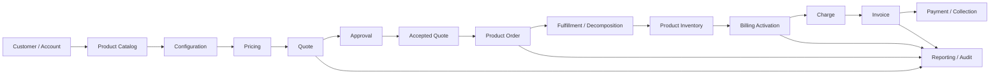
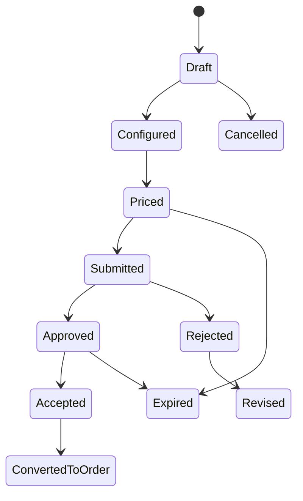
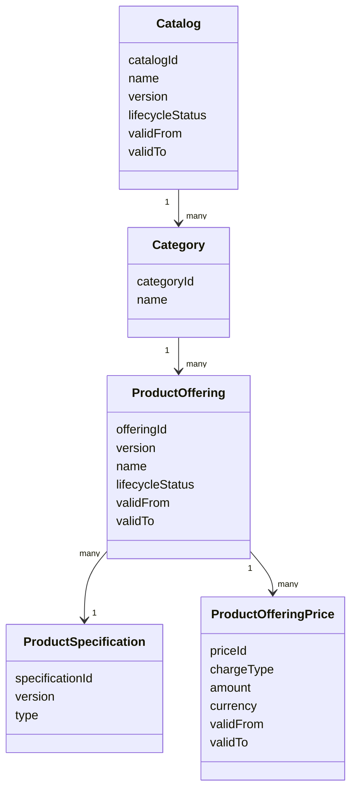
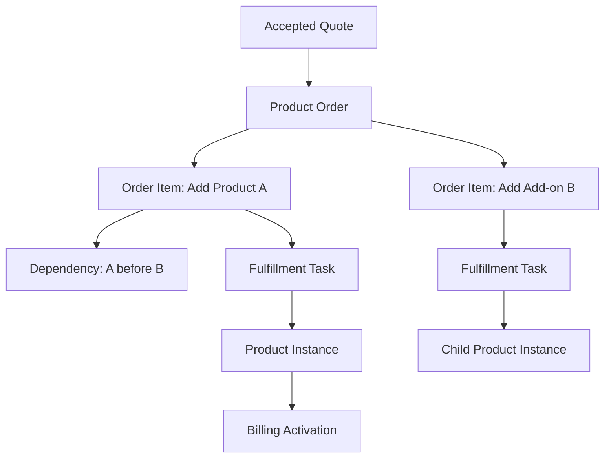
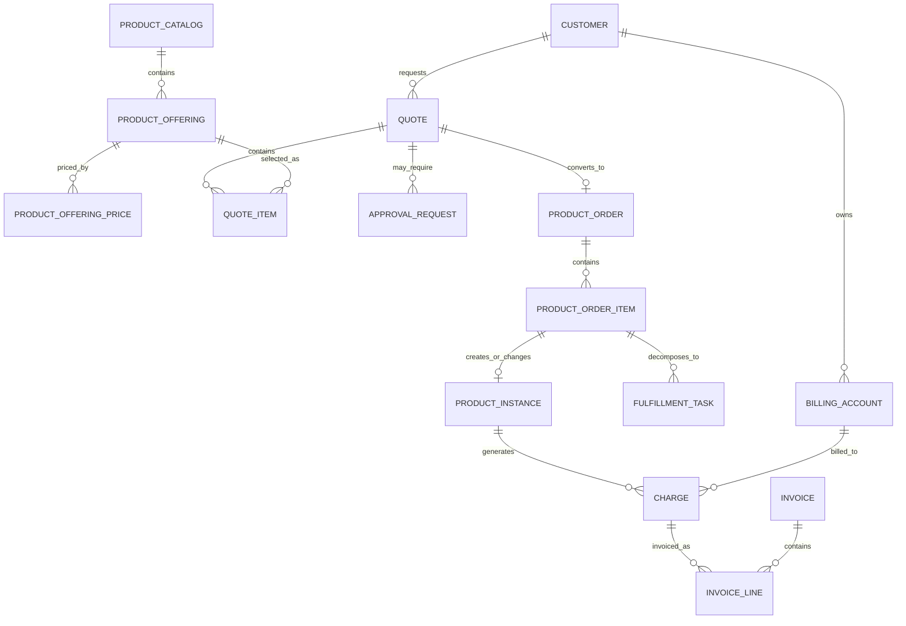

# CPQ and Quote-to-Cash Data Landscape

CPQ dan quote-to-cash bukan satu fitur. Ia adalah rangkaian lifecycle data yang menghubungkan kebutuhan customer, product catalog, configuration, pricing, quote, approval, order, fulfillment, inventory, billing, invoice, payment, dan reporting.

Part ini membangun peta besar agar Anda bisa membaca sistem CPQ/Quote & Order sebagai **data landscape end-to-end**, bukan sebagai kumpulan endpoint, table, atau microservice terpisah.

Tujuan utamanya: memahami bagaimana data mengalir dari **commercial intent** menjadi **contractual commitment**, lalu menjadi **execution order**, lalu menjadi **active product/service**, lalu menjadi **billable financial record**.

---

## 1. Core Mental Model

Quote-to-cash dapat dipahami sebagai transformasi data bertahap:

```text
Customer intent
  -> Product configuration
  -> Price calculation
  -> Commercial quote
  -> Approval/acceptance
  -> Product order
  -> Fulfillment/decomposition
  -> Product/service activation
  -> Billing activation
  -> Charge/invoice/payment
  -> Reporting/reconciliation/audit
```

Setiap tahap memiliki model data sendiri. Kesalahan fatal terjadi ketika satu model dipakai untuk semua tahap.

Contoh:

```text
Product Offering != Quote Item != Order Item != Product Instance != Invoice Line
```

Mereka mungkin saling referensi, tetapi bukan object yang sama.

---

## 2. End-to-End Quote-to-Cash Flow



Flow ini terlihat linear, tetapi production reality jauh lebih kompleks:

- quote bisa direvisi,
- approval bisa ditolak,
- quote bisa expired,
- order bisa amend/cancel,
- fulfillment bisa partial,
- downstream provisioning bisa fallout,
- billing activation bisa gagal,
- invoice bisa disesuaikan dengan credit/debit,
- product inventory bisa tidak sinkron dengan order,
- reporting projection bisa stale.

Karena itu data model harus memuat lifecycle, state, invariant, audit, dan reconciliation.

---

## 3. CPQ: Configure, Price, Quote

CPQ adalah proses mengubah kebutuhan customer menjadi proposal komersial yang valid.

### Configure

Configure menjawab:

```text
Produk apa yang boleh dipilih?
Opsi apa yang mandatory/optional?
Kombinasi apa yang valid?
Customer/site/channel ini eligible atau tidak?
```

Data utama:

- product catalog,
- product offering,
- product specification,
- bundle/component,
- characteristic,
- option,
- eligibility rule,
- compatibility rule,
- configuration session,
- selected option,
- validation result.

### Price

Price menjawab:

```text
Berapa harga konfigurasi ini untuk customer ini, pada tanggal ini, dalam currency ini, dengan agreement/promotion/discount ini?
```

Data utama:

- price list,
- product offering price,
- recurring charge,
- one-time charge,
- usage charge,
- discount,
- promotion,
- tax awareness,
- cost/margin,
- price validity,
- price version,
- pricing trace.

### Quote

Quote menjawab:

```text
Apa proposal komersial yang diberikan kepada customer?
Berapa lama valid?
Siapa owner?
Apa status approval?
Apa yang akan dikonversi menjadi order jika diterima?
```

Data utama:

- quote header,
- quote item,
- quote price snapshot,
- customer/account reference,
- agreement reference,
- approval status,
- validity period,
- revision/version,
- acceptance evidence.

---

## 4. Quote Management Data Landscape

Quote management bukan hanya menyimpan quote. Ia mengelola commercial proposal lifecycle.



Quote data model biasanya memiliki:

| Data Area | Fungsi |
|---|---|
| Quote Header | Container proposal: customer, account, owner, channel, currency, status. |
| Quote Item | Unit produk/layanan yang ditawarkan. |
| Configuration Snapshot | Bukti konfigurasi saat quote dibuat/dihargai. |
| Price Snapshot | Bukti harga saat quote disubmit/accepted. |
| Discount and Margin | Commercial adjustment dan guardrail. |
| Approval Trace | Siapa menyetujui apa, kapan, dan dengan alasan apa. |
| Validity Period | Batas waktu proposal. |
| Version/Revision | Jejak perubahan quote. |
| Conversion Reference | Hubungan quote ke order. |

Quote harus menjadi evidence yang dapat diaudit. Terutama setelah quote accepted, data penting tidak boleh berubah tanpa revision/amendment model yang jelas.

---

## 5. Product Catalog Data Landscape

Product catalog adalah sumber kebenaran tentang apa yang bisa dijual.

Catalog bukan hanya daftar produk. Catalog memuat:

- commercial offering,
- technical specification,
- bundle structure,
- characteristic model,
- option model,
- compatibility,
- eligibility,
- pricing relationship,
- lifecycle status,
- version,
- effective date,
- publication state.



Catalog data correctness concern:

```text
Quote baru tidak boleh memakai offering retired.
Quote accepted harus tetap traceable ke offering version yang berlaku saat quote dibuat.
In-flight order tidak boleh rusak karena catalog version baru dipublish.
Catalog rollback harus jelas dampaknya ke quote/order aktif.
```

---

## 6. Pricing Data Landscape

Pricing adalah domain yang rawan incident karena menyentuh revenue, margin, approval, customer trust, dan billing.

Pricing data memiliki beberapa level:

| Level | Contoh | Catatan |
|---|---|---|
| Price Definition | Product offering price | Data master/versioned. |
| Price Rule | Tier, volume, eligibility, promotion | Rule-driven. |
| Price Calculation | Pricing result | Hasil kalkulasi sementara. |
| Price Snapshot | Quote price snapshot | Evidence saat quote. |
| Billable Charge | Charge/recurring charge/usage charge | Digunakan billing. |
| Invoice Line | Final invoice representation | Financial/customer-facing. |

Jangan mencampur `price` dan `charge`.

```text
Price = commercial definition or calculated quote amount.
Charge = billable obligation generated for billing.
Invoice line = billed representation of charge.
```

Failure mode umum:

- quote price tidak sama dengan order price,
- order price tidak sama dengan billing charge,
- catalog price berubah setelah quote accepted,
- currency/tax salah,
- discount approval hilang,
- usage rating double count,
- recurring charge start date salah.

---

## 7. Agreement and Contract Data Landscape

Agreement/contract adalah sumber constraint commercial/legal.

Agreement bisa memengaruhi:

- eligibility,
- special pricing,
- discount entitlement,
- contract term,
- SLA,
- billing term,
- renewal,
- cancellation penalty,
- commitment,
- account hierarchy,
- quote approval.

Data utama:

```text
Agreement
  -> Agreement Item / Term
  -> Customer / Party
  -> Contracting Entity
  -> Product/Offering Scope
  -> Pricing/Discount Term
  -> Billing Term
  -> Effective Period
  -> Amendment/Renewal
```

Dalam quote-to-cash, agreement harus bisa direferensikan oleh quote, order, subscription, charge, dan invoice jika relevan.

Correctness concern:

```text
Quote menggunakan agreement yang sudah expired.
Discount agreement tidak berlaku untuk product offering tertentu.
Order created setelah contract term berakhir.
Billing term tidak sesuai accepted quote/agreement.
```

---

## 8. Order Management Data Landscape

Order management mengubah accepted commercial proposal menjadi instruksi eksekusi.

Order bukan quote. Order adalah command bisnis untuk membuat, mengubah, menghentikan, atau memindahkan product/service.

Data utama:

- product order header,
- product order item,
- action,
- source quote reference,
- customer/account reference,
- billing account reference,
- requested/completion date,
- order state,
- order item state,
- dependency,
- milestone,
- decomposition result,
- fulfillment task reference,
- fallout/retry/reconciliation.



Order data model harus mendukung:

- add,
- modify,
- disconnect,
- suspend,
- resume,
- cancel,
- amend,
- retry,
- compensation,
- partial fulfillment,
- fallout.

---

## 9. Fulfillment Data Landscape

Fulfillment adalah proses menjalankan order di downstream system.

Dalam telco/BSS/OSS, fulfillment sering melibatkan decomposition:

```text
Product Order
  -> Service Order
  -> Resource Order / Provisioning Request
  -> Network / OSS / Activation
```

Data utama:

- fulfillment task,
- work order,
- service order,
- resource order,
- downstream system,
- dependency graph,
- orchestration step,
- status,
- retry count,
- error code,
- fallout reason,
- manual intervention,
- completion proof.

Fulfillment correctness concern:

```text
Order item marked fulfilled but downstream never activated service.
Downstream succeeded but internal state stuck InProgress.
Manual fallout resolution not reflected in product inventory.
Retry creates duplicate provisioning request.
Partial fulfillment incorrectly triggers full billing.
```

---

## 10. Billing and Charging Data Landscape

Billing converts commercial/product state into financial obligation.

Billing data includes:

- billing account,
- billing profile,
- billing cycle,
- tax profile,
- payment method,
- charge,
- recurring charge,
- one-time charge,
- usage charge,
- rated usage,
- invoice,
- invoice line,
- credit/debit,
- payment status,
- billing adjustment,
- reconciliation status.

Billing trigger can come from:

```text
Order completion
Product activation
Subscription start
Usage rating
Manual adjustment
Contract renewal
```

Key separation:

```text
Order tells what should be fulfilled.
Inventory tells what is active.
Billing tells what should be charged.
Invoice tells what was billed.
Payment tells what was settled.
```

Billing correctness concern:

- charge without billing account,
- duplicate charge,
- missed activation,
- wrong start date,
- wrong billing cycle,
- invoice line not traceable,
- usage double-rated,
- credit/debit missing source reason,
- tax jurisdiction mismatch.

---

## 11. Product Inventory Data Landscape

Product inventory represents what customer actually has.

Product catalog says:

```text
What can be sold.
```

Quote says:

```text
What is proposed.
```

Order says:

```text
What should be changed.
```

Inventory says:

```text
What exists now or existed historically.
```

Data utama:

- product instance,
- installed product,
- product status,
- characteristic value,
- start date,
- end date,
- parent/child instance,
- source order,
- billing account,
- realizing service,
- related resource,
- lifecycle history.

Inventory menjadi sumber penting untuk:

- modify order,
- disconnect order,
- renewal,
- billing validation,
- customer support,
- service assurance,
- reporting installed base.

---

## 12. Customer and Account Data Landscape

Customer/account modelling adalah fondasi quote-to-cash.

Namun istilah account sering ambigu.

Minimal, bedakan:

| Concept | Makna |
|---|---|
| Party | Individual/organization sebagai real-world actor. |
| Customer | Party yang berperan sebagai pembeli/pelanggan. |
| Customer Account | Relationship commercial/customer management. |
| Billing Account | Entity yang menerima invoice/charge. |
| Service Account | Entity/context untuk service ownership atau installed services. |
| Contact | Orang/channel komunikasi. |
| Organization Hierarchy | Parent/subsidiary/legal/billing/contracting relationships. |

Dalam enterprise B2B, satu organization bisa menjadi:

- contracting party,
- buying party,
- billing responsible party,
- service recipient,
- parent account,
- child account,
- approver organization.

Data model harus eksplisit, bukan hanya `customer_id` di semua table.

---

## 13. Conceptual Model of CPQ/Quote-to-Cash



Conceptual model ini bukan physical schema. Ini peta hubungan bisnis.

Physical schema bisa jauh lebih banyak table karena butuh:

- versioning,
- history,
- snapshots,
- rule trace,
- audit,
- outbox,
- search projection,
- reporting fact,
- integration attempt,
- reconciliation.

---

## 14. Lifecycle Data by Domain

| Domain | Created When | Mutated When | Terminal/Stable When | Main Risk |
|---|---|---|---|---|
| Catalog | Product setup/release | Draft/publication/versioning | Retired/superseded | In-flight quote/order broken |
| Configuration | User configures product | Options/characteristics change | Quote snapshot | Invalid configuration accepted |
| Pricing | Price setup/calculation | Price list/rule changes | Quote accepted snapshot | Price mismatch billing |
| Quote | Sales creates proposal | Configure/price/revise/approve | Accepted/expired/cancelled/converted | Mutable accepted quote |
| Order | Quote accepted/manual order | Fulfillment/amend/cancel/retry | Completed/cancelled/closed | Partial/inconsistent fulfillment |
| Inventory | Fulfillment activation | Modify/suspend/disconnect | Terminated | Inventory not matching reality |
| Billing | Activation/rating | Adjustment/invoice/payment | Invoice finalized/paid | Charge mismatch/duplicate |
| Reporting | Projection refresh | Event/ETL updates | Snapshot/frozen period | Stale or wrong KPI |
| Audit | Business/technical action | Append-only | Retention expiry | Missing evidence |

---

## 15. Data Ownership Across the Landscape

Microservices architecture requires explicit ownership.

Possible ownership map:

| Data | Likely Owner | Read Consumers |
|---|---|---|
| Product Catalog | Catalog Service | CPQ, Quote, Order, Search, Reporting |
| Pricing Rules | Pricing Service/Catalog | Quote, Approval, Billing awareness |
| Quote | Quote Service | Order, Reporting, Customer Portal |
| Approval Decision | Approval Service | Quote, Audit, Reporting |
| Product Order | Order Service | Fulfillment, Billing, Reporting |
| Fulfillment Task | Fulfillment/Orchestration Service | Order, Support, Reporting |
| Product Inventory | Inventory Service | Order, Billing, Support, Reporting |
| Billing Account | Billing/Account Service | Quote, Order, Billing |
| Charge/Invoice | Billing System | Reporting, Customer Portal, Reconciliation |

Ini bukan klaim internal CSG. Ini pola umum enterprise. Internal implementation harus diverifikasi.

Rule:

```text
One owner writes. Others reference, subscribe, or project.
```

---

## 16. API Model Across Quote-to-Cash

API model biasanya mengikuti use case, bukan table.

Contoh API command:

```http
POST /quotes
POST /quotes/{id}/items
POST /quotes/{id}/price
POST /quotes/{id}/submit
POST /quotes/{id}/accept
POST /quotes/{id}/convert-to-order
POST /orders/{id}/cancel
POST /orders/{id}/items/{itemId}/retry
```

Contoh API query:

```http
GET /quotes/{id}
GET /quotes?customerId=&status=&createdFrom=
GET /orders/{id}
GET /orders?status=&customerId=&agingBucket=
GET /customers/{id}/products
GET /billing-accounts/{id}/invoices
```

Mapping concern:

```text
Command DTO harus kecil dan intention-revealing.
Query DTO boleh denormalized.
Internal aggregate jangan diekspos mentah.
External contract harus backward-compatible.
```

---

## 17. Event Model Across Quote-to-Cash

Event penting lintas landscape:

| Event | Producer | Consumer |
|---|---|---|
| CatalogPublished | Catalog | Quote, Search, Cache, Reporting |
| QuoteCreated | Quote | Reporting, Audit, CRM integration |
| QuotePriced | Quote/Pricing | Approval, Reporting |
| QuoteSubmitted | Quote | Approval workflow |
| QuoteApproved | Approval/Quote | Quote, Reporting |
| QuoteAccepted | Quote | Order conversion |
| ProductOrderCreated | Order | Fulfillment, Reporting |
| OrderItemFulfilled | Fulfillment/Order | Inventory, Billing readiness |
| ProductInstanceActivated | Inventory | Billing, Assurance, Reporting |
| BillingActivated | Billing | Reporting, Reconciliation |
| InvoiceGenerated | Billing | Customer portal, Reporting |

Event correctness concern:

- event published before commit,
- duplicate event not idempotent,
- event order not handled,
- consumer assumes event contains full state,
- schema changes break consumer,
- sensitive data leaked in event payload.

---

## 18. PostgreSQL Implementation Awareness

PostgreSQL physical model must serve multiple needs:

- transactional writes,
- state transition safety,
- aggregate loading,
- audit/history,
- reporting/read model,
- search projection source,
- reconciliation queries,
- migration/backfill,
- retention/archival.

Common table categories:

```text
Core transaction tables
  quote_header
  quote_item
  product_order
  product_order_item

Snapshot/history tables
  quote_price_snapshot
  quote_catalog_snapshot
  quote_revision
  order_transition_history

Reference/version tables
  product_offering
  product_offering_version
  product_offering_price

Operational tables
  fulfillment_task
  integration_attempt
  reconciliation_result

Event/audit tables
  outbox_event
  inbox_event
  audit_event

Reporting/search tables
  quote_read_model
  order_read_model
  lifecycle_fact_quote
```

Physical design must consider:

- primary key strategy,
- business key uniqueness,
- tenant ID if multi-tenant,
- optimistic locking,
- status/date/customer indexes,
- partial indexes for work queues,
- partitioning for audit/event/billing/usage,
- JSONB only where justified,
- FK vs loose external references.

---

## 19. Java/JAX-RS Backend Impact

In Java/JAX-RS services, quote-to-cash data landscape affects layer design.

### Resource Layer

Should handle:

- HTTP method semantics,
- request DTO,
- authentication/authorization,
- response status,
- idempotency header if applicable,
- correlation ID propagation.

Should not contain:

- pricing algorithm,
- lifecycle transition logic,
- mapper-by-mapper transaction script,
- ad hoc audit insertion.

### Application Service

Should handle:

- transaction boundary,
- orchestration across repositories/domain services,
- command execution,
- outbox event creation,
- idempotency check,
- integration handoff.

### Domain Layer

Should handle:

- aggregate invariant,
- value object validation,
- state transition,
- domain event decision,
- business rule expression.

### Infrastructure Layer

Should handle:

- MyBatis/JPA/JDBC mapping,
- SQL tuning,
- external API mapping,
- event publishing,
- Redis cache,
- Camunda adapter.

---

## 20. MyBatis/JPA/JDBC Impact

The data landscape often creates complex query needs.

### MyBatis Patterns

Useful for:

- explicit joins for read models,
- queue queries,
- reporting queries,
- custom snapshot loading,
- batch updates/backfills.

Watch out for:

- business logic in SQL mapper,
- inconsistent mapping of status enums,
- partial aggregate updates bypassing service logic.

### JPA Patterns

Useful for:

- aggregate persistence where mapping is stable,
- optimistic locking,
- simple repository operations.

Watch out for:

- lazy loading explosion,
- accidental cascade writes,
- entity used as API response,
- aggregate too large.

### JDBC Patterns

Useful for:

- high-volume migration,
- backfill,
- critical SQL paths,
- low-level integration jobs.

Watch out for:

- duplicate mapping logic,
- missing transaction discipline,
- weak test coverage.

---

## 21. Kafka, RabbitMQ, Redis, Camunda Impact

### Kafka/RabbitMQ

Used for:

- domain events,
- integration events,
- async workflow handoff,
- read model projection,
- billing/fulfillment notifications.

Data model implication:

```text
Need outbox/inbox, event ID, aggregate ID, event version, ordering key, idempotency, DLQ, replay strategy.
```

### Redis

Used for:

- catalog cache,
- pricing cache,
- eligibility cache,
- quote/session cache,
- order status cache.

Data model implication:

```text
Need cache key model, TTL, invalidation event, versioned key, stale data detection.
```

### Camunda

Used for:

- approval workflow,
- order orchestration,
- fulfillment task flow,
- manual intervention.

Data model implication:

```text
Need process instance reference, business key, domain state mapping, task reference, incident trace, message correlation.
```

---

## 22. Reporting and Analytics Landscape

Quote-to-cash reporting needs both operational and analytical models.

Operational reporting examples:

- quotes awaiting approval,
- expired quotes,
- stuck orders,
- fallout queue,
- pending billing activation,
- billing mismatch,
- SLA aging.

Analytical reporting examples:

- quote conversion rate,
- average discount,
- approval cycle time,
- order completion time,
- fallout rate,
- revenue by product/customer/channel,
- churn/disconnect trend,
- recurring revenue trend.

Reporting model should not blindly query OLTP aggregate tables for everything.

Common read model:

```text
fact_quote_lifecycle
fact_order_lifecycle
fact_billing_charge
dim_customer
dim_product
dim_sales_channel
dim_time
```

Freshness matters:

```text
Operational dashboard may need near real-time.
Executive analytics may tolerate batch delay.
Financial reporting may require frozen period snapshot.
```

---

## 23. Auditability Landscape

Every critical business action needs evidence.

Audit targets:

- quote created/revised/submitted/accepted,
- price calculated/overridden,
- discount requested/approved/rejected,
- order created/amended/cancelled,
- fulfillment failed/retried/resolved,
- billing activated/adjusted,
- invoice generated/credited,
- catalog published/retired,
- agreement amended/renewed.

Minimum audit fields:

```text
actor
business action
technical action
target entity
target entity version
before value
after value
reason/comment
timestamp
correlation ID
causation ID
source system
```

Audit is not the same as application log. Audit must answer business accountability questions.

---

## 24. Cross-Domain Invariants

Some invariants cross service/domain boundaries.

Examples:

```text
Accepted quote price must match order price carry-over unless explicit repricing is allowed.
Order item action Modify must reference active product instance.
Billing activation must reference fulfilled/activated product or valid subscription start.
Invoice line must be traceable to charge/source.
Product inventory status must reflect completed disconnect order.
Catalog offering version used by quote must remain resolvable historically.
```

Cross-domain invariants are hard because no single database constraint can enforce them across microservices.

Possible controls:

- synchronous validation at command time,
- domain events,
- read model checks,
- reconciliation jobs,
- data quality dashboards,
- manual repair workflow,
- incident playbooks.

---

## 25. Data Failure Modes

### 25.1 Duplicate Quote

Possible causes:

- missing idempotency key,
- retry from UI/API gateway,
- race condition,
- external CRM duplicate request.

Detection:

```text
same customer + opportunity + channel + time window + createdBy
```

### 25.2 Duplicate Order

Possible causes:

- quote conversion retried without idempotency,
- event consumer duplicate processing,
- conversion table missing unique constraint.

Detection:

```text
multiple orders referencing same accepted quote/version
```

### 25.3 Price Mismatch

Possible causes:

- repricing after quote acceptance,
- catalog price version drift,
- currency/tax mismatch,
- billing charge recalculated differently.

Detection:

```text
quote price snapshot vs order item price vs billing charge
```

### 25.4 Stuck Order

Possible causes:

- missing event,
- downstream timeout,
- fulfillment task fallout not propagated,
- state transition guard too strict,
- Camunda incident.

Detection:

```text
order in non-terminal state beyond SLA aging threshold
```

### 25.5 Billing Activation Mismatch

Possible causes:

- fulfillment completed but billing event missing,
- product inventory active but no charge,
- duplicate activation event,
- billing account invalid.

Detection:

```text
active product instance without expected billing charge
```

---

## 26. Debugging Quote-to-Cash Data Issues

Use this diagnostic path:

```text
1. Identify customer/account/quote/order/product instance/billing account.
2. Locate source-of-truth owner for the broken data.
3. Read lifecycle state and transition history.
4. Compare header state vs item state.
5. Check version/snapshot references.
6. Check audit trail for last business action.
7. Check outbox/inbox/event publication.
8. Check downstream integration attempt.
9. Check read model/cache/search freshness.
10. Check reconciliation report or build one-off reconciliation query.
```

Example issue:

```text
Customer says service is active but invoice is missing.
```

Trace:

```text
Customer -> Billing Account -> Product Instance -> Source Order -> Order Item -> Fulfillment Task -> Billing Activation -> Charge -> Invoice Line
```

Possible root causes:

- product inventory active but billing activation failed,
- billing account missing/invalid,
- charge created but invoice cycle not reached,
- invoice generated but customer portal projection stale,
- order fulfilled manually without event,
- data repair bypassed audit/event.

---

## 27. Trade-Offs in CPQ Data Modelling

### Normalize vs Snapshot

Normalize when:

- source data must be reused,
- updates should affect future usage,
- query consistency matters.

Snapshot when:

- historical evidence must not change,
- quote acceptance must be auditable,
- price/catalog/customer details must reflect point-in-time reality.

### Synchronous Validation vs Eventual Reconciliation

Use synchronous validation when:

- user action must be blocked,
- invariant is local or quickly checkable,
- wrong state causes immediate financial/customer harm.

Use reconciliation when:

- systems are distributed,
- downstream state changes asynchronously,
- cross-system consistency cannot be guaranteed transactionally.

### Generic Model vs Specific Model

Generic model helps flexibility, but can harm:

- queryability,
- validation,
- reporting,
- readability,
- performance.

Specific model helps correctness, but can reduce flexibility.

Senior engineer chooses based on lifecycle and access pattern, not preference.

---

## 28. Internal Verification Checklist

Do not assume internal CSG implementation. Verify these explicitly.

### CPQ and Quote

- What are the core quote tables/entities?
- Is there a distinction between quote header, quote item, quote line, price item, discount item, and tax item?
- How is quote version/revision represented?
- Is accepted quote immutable?
- How are price/catalog/configuration snapshots stored?
- What prevents duplicate quote conversion?

### Catalog and Pricing

- What is the product catalog owner?
- Is catalog versioned and effective-dated?
- How are bundles/options/characteristics modelled?
- Where are eligibility and compatibility rules stored?
- Where are price lists, discounts, promotions, and pricing rules stored?
- How does pricing result become quote price snapshot?

### Order and Fulfillment

- How does quote item map to order item?
- What order actions are supported: add, modify, disconnect, suspend, resume, cancel, amend?
- Is there order decomposition?
- How are dependencies between order items stored?
- How are fulfillment tasks, fallout, retry, and manual intervention represented?
- How is product inventory updated?

### Billing

- How is billing account referenced from quote/order/product instance?
- What triggers billing activation?
- How are charges represented?
- Does billing integration receive price snapshot, charge instruction, or product activation event?
- How are invoice lines reconciled back to charge/order/product?

### Integration and Events

- What Kafka/RabbitMQ events exist for quote, order, fulfillment, inventory, billing?
- Is outbox/inbox pattern used?
- What are event ordering keys?
- How are duplicate events handled?
- How are external IDs stored?
- Are request/response payloads retained for integration debugging?

### Workflow and Camunda

- Which flows use Camunda?
- What is the business key?
- How is process instance linked to quote/order/approval/fulfillment?
- Is domain state independent from process state?
- How are incidents surfaced and repaired?

### Reporting and Audit

- What operational reports exist for quote/order/billing?
- Are read models/materialized views used?
- What is the freshness SLA?
- Where is audit trail stored?
- Can you answer: who changed price/discount/status and why?

### Production Operations

- What are known data inconsistency incidents?
- What reconciliation jobs exist?
- What dashboards detect stuck quote/order/fulfillment/billing?
- What data repair process is allowed?
- Who approves manual correction?

---

## 29. Practical Study Path in the Codebase

Untuk memahami landscape internal, pelajari dengan urutan ini:

```text
1. Glossary and product documentation
2. ERD or schema migration repository
3. Quote header and quote item model
4. Quote lifecycle transition code
5. Quote pricing snapshot model
6. Quote-to-order conversion code
7. Order header and order item model
8. Order state machine and fulfillment mapping
9. Billing account and billing integration reference
10. Event schemas and outbox/inbox implementation
11. Audit/history tables
12. Reporting/read models
13. Incident notes about data inconsistency
```

Saat membaca code, fokus pada pertanyaan:

```text
What is source of truth?
Who writes this?
What state transition occurred?
What invariant should hold?
What event was emitted?
What audit record proves it?
What reconciliation detects mismatch?
```

---

## 30. PR Review Checklist

Saat mereview perubahan di CPQ/quote-to-cash data landscape:

### Scope

- Domain mana yang berubah: catalog, quote, order, fulfillment, billing, inventory, reporting?
- Apakah perubahan ini local atau cross-domain?
- Apakah owner data jelas?

### Lifecycle

- State apa yang bertambah/berubah?
- Transition apa yang valid/invalid?
- Apakah terminal state terdampak?
- Apakah retry/cancel/amend path terdampak?

### Correctness

- Invariant apa yang harus tetap benar?
- Apakah accepted quote tetap immutable?
- Apakah price carry-over jelas?
- Apakah billing trigger aman?
- Apakah duplicate prevention ada?

### Data Model

- Apakah entity/relationship baru diperlukan?
- Apakah field baru belongs to header, item, snapshot, audit, or read model?
- Apakah migration aman untuk existing data?
- Apakah nullable/default value benar?

### API/Event

- Apakah API backward-compatible?
- Apakah event schema berubah?
- Apakah consumer terdampak?
- Apakah idempotency/correlation ada?

### Reporting/Audit

- Apakah report/read model perlu update?
- Apakah audit trail menangkap perubahan?
- Apakah dashboard/alert/reconciliation perlu update?

### Operations

- Apakah ada backfill?
- Apakah rollback/roll-forward plan ada?
- Apakah data repair strategy jelas?
- Apakah observability cukup?

---

## 31. Key Takeaways

- CPQ dan quote-to-cash adalah lifecycle data end-to-end, bukan modul terpisah.
- Product offering, quote item, order item, product instance, charge, dan invoice line adalah konsep berbeda.
- Quote adalah commercial evidence; order adalah execution instruction; inventory adalah installed reality; billing adalah financial obligation.
- Catalog, pricing, quote, order, fulfillment, billing, inventory, audit, event, dan reporting masing-masing punya model dan ownership.
- Snapshot/versioning sangat penting untuk accepted quote, price, catalog, agreement, dan billing evidence.
- Failure mode utama biasanya muncul di boundary: quote-to-order, order-to-fulfillment, fulfillment-to-inventory, inventory-to-billing, billing-to-invoice.
- Senior engineer harus bisa menelusuri data dari customer intent sampai invoice dan kembali lagi untuk reconciliation.

---

## 32. Learning Outcome Recap

Setelah menyelesaikan part ini, Anda harus mampu:

- menjelaskan peta data CPQ dan quote-to-cash end-to-end;
- membedakan catalog, configuration, price, quote, approval, order, fulfillment, inventory, billing, invoice, dan reporting model;
- memahami lifecycle data utama dan failure mode di setiap boundary;
- membaca data ownership antar microservices;
- menilai impact perubahan data model terhadap Java/JAX-RS service, MyBatis/JPA/JDBC, Kafka/RabbitMQ, Redis, Camunda, PostgreSQL, reporting, audit, dan production operations;
- menyusun checklist internal untuk memverifikasi implementasi nyata tanpa mengarang detail internal.
