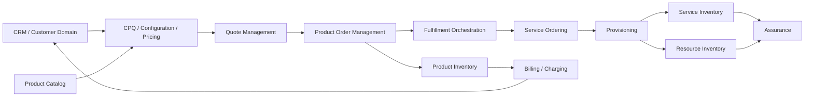
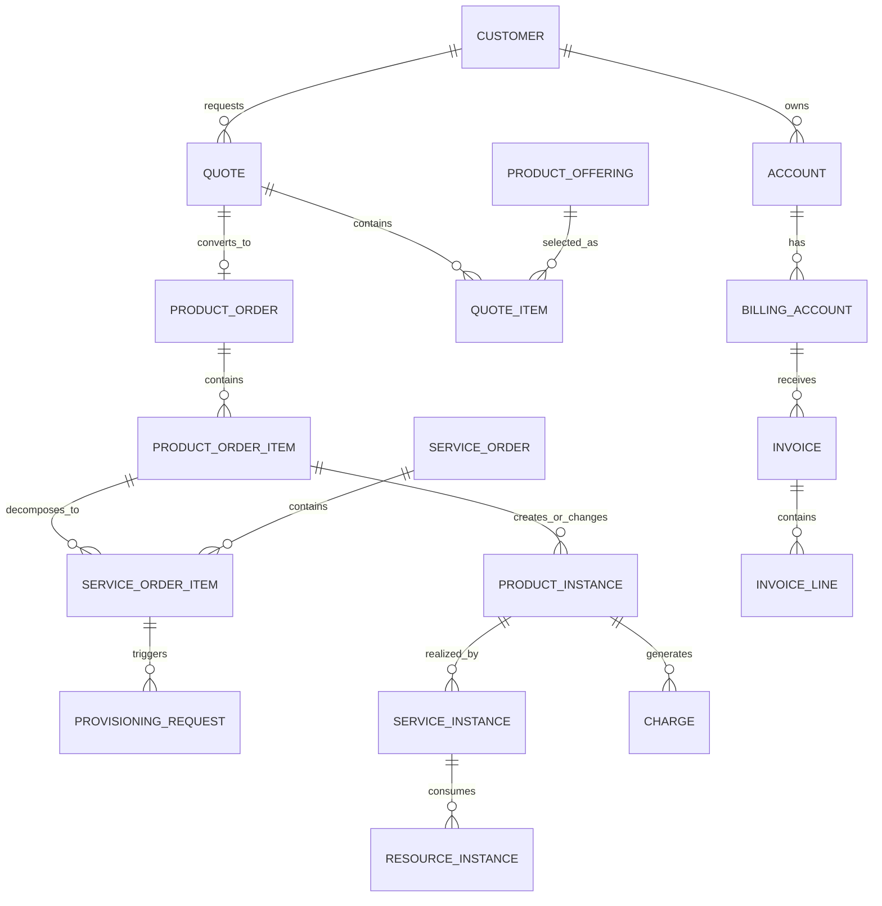
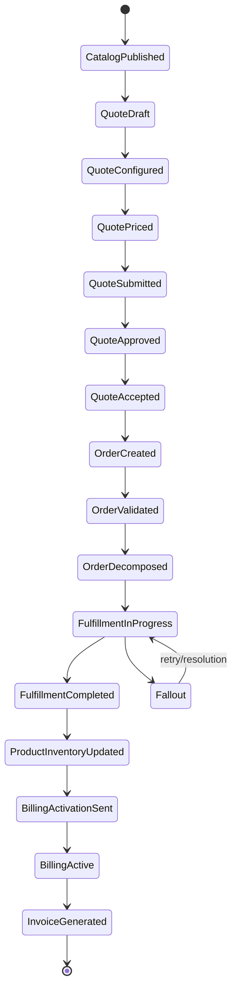
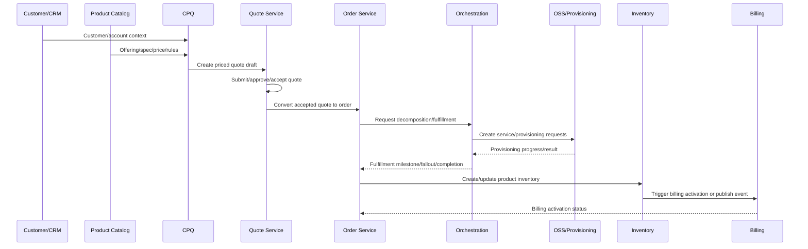

# Telco BSS/OSS Data Landscape

Telco BSS/OSS data modelling adalah disiplin memisahkan **commercial truth**, **customer truth**, **technical service truth**, **resource truth**, **billing truth**, dan **operational assurance truth** agar sistem quote-to-cash tidak berubah menjadi satu model besar yang ambigu.

Dalam sistem CPQ, quote management, order management, catalog, fulfillment, billing, dan inventory, kesalahan data model sering muncul karena semua hal disebut “product”. Padahal dalam telco, biasanya ada beberapa level realitas:

```text
Commercial product sold to customer
  -> realized by service
      -> realized by resource
          -> provisioned in network/platform
              -> billed, monitored, assured, changed, suspended, terminated
```

Jika level-level ini dicampur, banyak hal akan rusak:

- quote sulit dikonversi menjadi order,
- order sulit didecompose,
- billing trigger tidak jelas,
- product inventory tidak sinkron dengan service inventory,
- provisioning tidak bisa direkonsiliasi,
- assurance tidak tahu service mana yang terdampak,
- reporting quote-to-cash tidak bisa menjelaskan bottleneck,
- dan production incident sulit di-debug.

Tujuan part ini adalah membangun peta mental data landscape BSS/OSS dari sudut pandang senior backend engineer.

---

## 1. Core Mental Model

BSS/OSS bukan sekadar dua kategori aplikasi. Dalam data modelling, BSS/OSS adalah pemisahan antara:

| Layer | Fokus | Pertanyaan Utama |
|---|---|---|
| BSS | Commercial/customer/business operation | Apa yang dijual, ke siapa, dengan harga apa, dalam kontrak apa, dan ditagih ke siapa? |
| OSS | Technical/network/service operation | Service teknis apa yang harus dipenuhi, resource apa yang dipakai, bagaimana provisioning dan assurance dilakukan? |

BSS biasanya dekat dengan:

- CRM,
- customer/account,
- CPQ,
- quote,
- product catalog,
- product order,
- agreement,
- billing,
- charging,
- invoice,
- payment,
- product inventory.

OSS biasanya dekat dengan:

- service catalog,
- resource catalog,
- service ordering,
- resource ordering,
- provisioning,
- activation,
- network/resource inventory,
- service assurance,
- trouble ticket,
- performance monitoring,
- fault management.

Dalam enterprise data modelling, batas BSS/OSS harus terlihat pada:

- entity ownership,
- API contract,
- event contract,
- state machine,
- reconciliation key,
- audit trail,
- reporting model,
- dan operational dashboard.

---

## 2. BSS vs OSS as Data Ownership Boundary

Pemisahan BSS/OSS harus membantu menjawab pertanyaan ownership.

Buruk:

```text
Order service menyimpan semua data customer, product, service, network resource, invoice, dan ticket.
```

Lebih baik:

```text
Customer service owns customer/account data.
Catalog service owns product offering/specification data.
Quote service owns quote lifecycle data.
Order service owns product order lifecycle data.
Fulfillment/orchestration owns decomposition/progress data.
Billing service/system owns billing account, charge, invoice, payment data.
Inventory service owns installed product/service/resource state.
Assurance system owns fault/performance/trouble state.
```

Data boleh direferensikan, disalin sebagai snapshot, atau direplikasi sebagai read model, tetapi ownership tetap harus jelas.

### Ownership example

| Data | Likely Owner | Other Services Should |
|---|---|---|
| Customer legal identity | CRM/customer domain | Reference or snapshot |
| Product offering | Catalog domain | Reference versioned offering |
| Quote price snapshot | Quote domain | Treat as commercial evidence |
| Product order state | Order domain | Subscribe to lifecycle events |
| Service provisioning state | OSS/fulfillment domain | Publish fulfillment progress |
| Billing activation state | Billing domain | Publish billing status |
| Product instance | Product inventory domain | Use as installed-base source |
| Service instance | Service inventory/OSS domain | Use for assurance/provisioning |

---

## 3. The Commercial-to-Technical Chain

A telco quote-to-cash system usually follows this conceptual chain:

```text
Customer
  -> Product Offering
  -> Product Configuration
  -> Quote
  -> Product Order
  -> Order Decomposition
  -> Service Order
  -> Resource Order / Provisioning Request
  -> Service Instance
  -> Product Instance
  -> Billing Activation
  -> Charge / Invoice
  -> Assurance / Change / Disconnect
```

This chain is not always linear. In production:

- quote can be revised,
- order can be amended,
- fulfillment can partially complete,
- provisioning can fail,
- billing activation can lag technical activation,
- inventory can disagree with downstream network state,
- service can be active but billing not started,
- billing can charge while service is not actually provisioned,
- customer can request disconnect while amend is still in progress.

Therefore, the data model must support:

- references across lifecycle stages,
- state transition history,
- idempotent conversion,
- reconciliation,
- compensation,
- partial state,
- and evidence for debugging.

---

## 4. Conceptual Data Flow



Key modelling point:

```text
Not every arrow means shared database access.
Most arrows should be API calls, events, snapshots, references, or projections.
```

---

## 5. CRM Data Domain

CRM/customer domain models who the business relationship is with.

Typical entities:

- Party,
- Individual,
- Organization,
- Customer,
- Account,
- Contact,
- Contact Medium,
- Address,
- Customer Segment,
- Related Party,
- Customer Hierarchy.

In quote-to-cash, CRM data is used by:

- CPQ for eligibility,
- quote for customer reference and snapshot,
- order for fulfillment party/context,
- billing for billing account and payer details,
- assurance for customer impact.

### Correctness concern

Customer data often changes over time. A quote made last month should not silently change its legal/customer evidence just because CRM data changed today.

For quote/order modelling, decide explicitly:

| Usage | Better Strategy |
|---|---|
| Current customer profile display | Reference current CRM record |
| Accepted quote evidence | Snapshot relevant customer/account data |
| Billing responsibility | Reference billing account/version or snapshot billing profile |
| Audit/legal evidence | Preserve historical representation |

### Failure mode

```text
Quote accepted by Customer A legal entity,
but after CRM merge/update the quote appears under a different legal entity.
```

Possible causes:

- quote only stores mutable customer reference,
- no customer snapshot,
- customer hierarchy changed without effective dating,
- reporting joins current customer instead of historical customer view.

---

## 6. CPQ Data Domain

CPQ owns the commercial decision before order execution:

```text
Configure -> Price -> Quote
```

Key data concepts:

- configuration session,
- selected product offering,
- selected bundle option,
- characteristic value,
- eligibility result,
- compatibility result,
- price calculation result,
- discount request,
- margin calculation,
- approval requirement,
- quote draft.

CPQ data is highly sensitive to:

- catalog version,
- price version,
- customer segment,
- agreement term,
- location/serviceability,
- sales channel,
- currency,
- effective date.

### CPQ invariant examples

```text
A quote item cannot be priced if its configuration is invalid.

A discount above authority threshold must not move to approved state without approval evidence.

An accepted quote must preserve the catalog, price, and configuration snapshot used at acceptance time.
```

### Data modelling trap

Do not model CPQ as just:

```text
quote_line(product_id, quantity, price)
```

That loses:

- configuration choices,
- rule evaluation,
- pricing trace,
- discount reason,
- approval trace,
- bundle relationship,
- catalog version,
- validity period.

---

## 7. Product Catalog Data Domain

Product catalog is the commercial source of truth for what can be sold.

Typical entities:

- Catalog,
- Category,
- Product Offering,
- Product Specification,
- Product Offering Price,
- Product Relationship,
- Product Characteristic,
- Offering Version,
- Lifecycle Status,
- Effective Date.

Catalog answers:

```text
What can we sell?
To whom?
In which market/channel?
During what effective period?
With what options?
With what compatibility and eligibility rules?
With what commercial price definitions?
```

### Catalog vs Quote

Catalog defines reusable commercial possibilities.
Quote captures a customer-specific commercial proposal.

| Catalog | Quote |
|---|---|
| Reusable definition | Customer-specific instance |
| Versioned and published | Draft/revised/accepted lifecycle |
| Defines available offering | Captures selected offering |
| Defines possible price | Captures calculated price snapshot |
| Defines possible characteristic | Captures selected characteristic value |

---

## 8. Service Catalog Data Domain

Service catalog describes technical services used to realize commercial products.

Typical entities:

- Service Specification,
- Service Characteristic,
- Service Relationship,
- Service Template,
- Service Fulfillment Rule,
- Service Eligibility,
- Service Lifecycle Status.

Product catalog says:

```text
Sell Enterprise Internet 1Gbps.
```

Service catalog may say:

```text
Realize with Internet Access Service, CPE Service, IP Allocation Service, Monitoring Service.
```

### Important separation

A product offering is what customer buys.
A service specification is how the provider realizes it technically.

Mixing them causes:

- commercial catalog polluted by network details,
- technical changes forcing commercial catalog changes,
- poor decomposition,
- unclear provisioning data,
- assurance unable to map service impact to customer product.

---

## 9. Resource Catalog Data Domain

Resource catalog describes technical resources that can be allocated.

Examples:

- router model,
- SIM profile,
- phone number range,
- IP address pool,
- VLAN,
- port,
- circuit,
- network slice,
- capacity unit,
- license,
- cloud resource.

Resource catalog should not be confused with resource inventory.

| Concept | Meaning |
|---|---|
| Resource Catalog | What type of resource can exist |
| Resource Inventory | Which actual resource exists or is assigned |

Example:

```text
Catalog: IP address resource type.
Inventory: 10.20.30.40 assigned to customer product instance X.
```

---

## 10. Product Inventory Data Domain

Product inventory stores installed commercial products.

Typical entities:

- Product Instance,
- Installed Product,
- Product Characteristic Value,
- Product Relationship,
- Product Status,
- Start Date,
- End Date,
- Source Order,
- Billing Account Reference,
- Realizing Service Reference.

Product inventory answers:

```text
What commercial products does this customer currently have?
What state are they in?
When did they start?
What order created or changed them?
What service/resource realizes them?
What billing account pays for them?
```

### Product inventory is not the catalog

Catalog:

```text
Enterprise Internet 1Gbps can be sold.
```

Product inventory:

```text
Customer ABC has Enterprise Internet 1Gbps active at Site Jakarta since 2026-03-01.
```

### Product inventory is critical for actions

Modify, suspend, resume, disconnect, upgrade, downgrade, and change-plan orders need product inventory as input.

---

## 11. Service Inventory Data Domain

Service inventory stores active or historical technical services.

Typical entities:

- Service Instance,
- Service Specification Reference,
- Service Characteristic Value,
- Service Status,
- Service Relationship,
- Product Instance Reference,
- Resource Reference,
- Provisioning State,
- Start/End Date.

Service inventory answers:

```text
What technical services are running?
Which product instances do they realize?
Which resources do they consume?
What is their operational state?
```

### Failure mode

```text
Product inventory says product is active,
but service inventory has no active realizing service.
```

Possible causes:

- order completed before OSS confirmation,
- missing provisioning event,
- reconciliation not implemented,
- manual repair changed one inventory but not the other,
- product order status derived incorrectly.

---

## 12. Resource Inventory Data Domain

Resource inventory stores actual technical assets and assignments.

Typical entities:

- Resource Instance,
- Resource Specification Reference,
- Resource Status,
- Assignment Status,
- Capacity,
- Location,
- Service Reference,
- Reservation,
- Allocation,
- Deallocation,
- Start/End Date.

Resource inventory answers:

```text
Which concrete resources are available, reserved, assigned, exhausted, faulty, or retired?
```

### Correctness concern

Resource allocation must be consistent under concurrency.

Example invariant:

```text
A unique network port cannot be assigned to two active service instances at the same time.
```

This may require:

- unique constraints,
- reservation records,
- optimistic locking,
- allocation transaction boundary,
- reconciliation with network source,
- audit trail for manual allocation.

---

## 13. Product Order Management Domain

Product order management owns the commercial execution request.

Typical entities:

- Product Order,
- Product Order Item,
- Order Action,
- Order State,
- Order Item State,
- Order Milestone,
- Order Relationship,
- Source Quote Reference,
- Billing Account Reference,
- Fulfillment Status,
- Customer Requested Date,
- Committed Date.

Product order asks:

```text
What commercial change has the customer requested and what is its execution state?
```

Order item actions:

- add,
- modify,
- disconnect,
- suspend,
- resume,
- cancel,
- amend,
- move,
- change plan,
- upgrade,
- downgrade.

### Order lifecycle should not hide item complexity

A top-level order can be `In Progress` while:

- item A is completed,
- item B is waiting for manual work,
- item C failed,
- item D is blocked by dependency,
- billing activation is pending.

Therefore, model both:

- order header state,
- order item state,
- fulfillment task state,
- billing state,
- reconciliation state.

---

## 14. Service Ordering Domain

Service ordering translates product order intent into technical service work.

Typical entities:

- Service Order,
- Service Order Item,
- Service Action,
- Service Specification Reference,
- Service Characteristic,
- Service Relationship,
- Service Order State,
- Service Milestone,
- Product Order Item Reference.

Service order asks:

```text
What technical service work must be done to realize the product order item?
```

Example mapping:

| Product Order Item | Service Order Item |
|---|---|
| Add Enterprise Internet | Add Internet Access Service |
| Add Managed Router Add-on | Add CPE Management Service |
| Disconnect Broadband | Disconnect Access Service |
| Change bandwidth | Modify Bandwidth Characteristic |

---

## 15. Provisioning Domain

Provisioning executes technical changes against network/platform systems.

Typical entities:

- Provisioning Request,
- Provisioning Command,
- Provisioning Step,
- External System,
- Request Payload,
- Response Payload,
- Correlation ID,
- Error Code,
- Retry Count,
- Last Attempt,
- Completion Evidence.

Provisioning asks:

```text
What command was sent to which technical system and what happened?
```

### Provisioning data must be auditable

For production support, you need to answer:

- what was sent,
- when it was sent,
- to which system,
- with what correlation ID,
- what response came back,
- whether retry happened,
- whether manual repair occurred,
- whether inventory was updated,
- whether billing was triggered.

---

## 16. Billing and Charging Domain

Billing/charging owns financial obligations.

Typical entities:

- Billing Account,
- Billing Profile,
- Charge,
- Recurring Charge,
- One-Time Charge,
- Usage Charge,
- Tax,
- Discount,
- Credit,
- Debit,
- Invoice,
- Invoice Line,
- Payment Status,
- Billing Cycle,
- Billing Activation.

Billing asks:

```text
What should be charged, to whom, for what period, based on what product/subscription/order, and with what tax/payment terms?
```

### Billing activation is not the same as order completion

A product can be technically provisioned before billing starts, or billing may fail after fulfillment completes.

Useful separate states:

| State | Owner | Meaning |
|---|---|---|
| Fulfillment Completed | Fulfillment/OSS | Technical work done |
| Product Active | Inventory | Installed product active |
| Billing Activation Sent | Order/Billing Integration | Billing trigger sent |
| Billing Active | Billing | Product/charge active in billing system |
| Invoice Generated | Billing | Financial document created |

---

## 17. Assurance Domain

Assurance manages operational health after activation.

Typical entities:

- Trouble Ticket,
- Fault,
- Alarm,
- Incident,
- Service Problem,
- Service Quality,
- SLA Breach,
- Impacted Service,
- Impacted Product,
- Impacted Customer,
- Resolution.

Assurance asks:

```text
What is broken, which service/resource is affected, which customer/product is impacted, and what is the repair lifecycle?
```

Assurance depends on correct mapping:

```text
Resource -> Service -> Product Instance -> Customer / Account
```

If product-service-resource mapping is weak, impact analysis becomes guesswork.

---

## 18. Product-Service-Resource Separation

The most important telco modelling pattern:

```text
Product = commercial thing sold to customer
Service = technical capability delivered
Resource = concrete asset/capacity used to deliver service
```

### Example

| Layer | Example |
|---|---|
| Product Offering | Enterprise Internet 1Gbps with Managed Router |
| Product Instance | Customer ABC's Enterprise Internet at Jakarta site |
| Service Specification | Internet Access Service, CPE Management Service |
| Service Instance | Access service provisioned for site JKT-001 |
| Resource Specification | Fiber circuit, IP address, router model |
| Resource Instance | Circuit ID CKT-8832, IP block 10.1.2.0/29, Router SN123 |

### Why this matters

- Product catalog can change commercial packaging without changing all technical services.
- Service catalog can change fulfillment design without changing sales offering.
- Resource inventory can manage capacity without polluting quote/order model.
- Assurance can trace technical fault to customer impact.
- Billing can charge based on commercial product even if multiple technical services exist.

---

## 19. Conceptual ERD



This ERD is conceptual. It is not a recommendation to put all entities in one database.

In microservices, these entities may live in different databases and connect through:

- API references,
- event payloads,
- replicated read models,
- snapshots,
- external IDs,
- correlation IDs,
- reconciliation keys.

---

## 20. Lifecycle Map



Important: real systems may have multiple parallel state machines. Do not collapse all of them into one status field.

---

## 21. State Ownership Map

| State | Entity | Owner | Common Mistake |
|---|---|---|---|
| Quote status | Quote | Quote service | Derived from order status after conversion |
| Order status | Product order | Order service | Mixed with fulfillment task status |
| Order item status | Order item | Order service | Only header status exists |
| Fulfillment status | Fulfillment task | Orchestration/OSS | Stored only as free-text note |
| Provisioning status | Provisioning request | Provisioning adapter | Lost after API call completes |
| Product status | Product instance | Product inventory | Recomputed from last order only |
| Billing status | Billing activation/charge | Billing | Assumed active after fulfillment |
| Service status | Service instance | Service inventory | Not reconciled with network state |
| Resource status | Resource instance | Resource inventory | No assignment history |

---

## 22. Data Flow Sequence



---

## 23. Integration Contract Thinking

BSS/OSS landscape usually has many integration boundaries.

For each boundary, define:

- source system,
- target system,
- owning domain,
- data contract,
- version,
- idempotency key,
- correlation ID,
- retry policy,
- failure status,
- reconciliation key,
- audit retention,
- payload retention policy.

### Example boundaries

| Boundary | Contract Risk |
|---|---|
| Quote -> Order | Duplicate order creation, lost quote snapshot |
| Order -> Fulfillment | Missing decomposition, wrong action mapping |
| Fulfillment -> Provisioning | Non-idempotent external command |
| Provisioning -> Inventory | Inventory says active without technical proof |
| Inventory -> Billing | Billing not activated or activated twice |
| Billing -> Reporting | Invoice mismatch or stale revenue reporting |
| Assurance -> Customer Impact | Cannot map resource fault to customer product |

---

## 24. Event Model in BSS/OSS

Events should represent meaningful lifecycle facts.

Examples:

```text
QuoteAccepted
QuoteConvertedToOrder
ProductOrderCreated
ProductOrderItemSubmitted
OrderDecomposed
FulfillmentTaskStarted
FulfillmentTaskFailed
FulfillmentTaskCompleted
ProductInstanceActivated
BillingActivationRequested
BillingActivationFailed
BillingActivated
InvoiceGenerated
ServiceIncidentRaised
```

Avoid vague events:

```text
DataUpdated
StatusChanged
OrderSynced
PayloadReceived
```

A good event should include:

- eventId,
- eventType,
- eventVersion,
- aggregateId,
- aggregateType,
- occurredAt,
- sourceSystem,
- correlationId,
- causationId,
- businessKey,
- state transition if relevant,
- payload relevant to consumers,
- schema version.

---

## 25. API Model in BSS/OSS

APIs should expose contract semantics, not internal table shape.

Example API boundaries:

| API | Should Express |
|---|---|
| Customer API | Customer/account identity and relationship |
| Catalog API | Published offering/specification/price/rule metadata |
| Quote API | Quote lifecycle and commercial proposal |
| Product Order API | Order intent, item action, status, milestone |
| Service Order API | Technical service work request |
| Inventory API | Installed product/service/resource state |
| Billing API | Billing account, charge, invoice, activation status |
| Assurance API | Fault/ticket/service problem lifecycle |

A Java/JAX-RS backend should avoid returning JPA/MyBatis persistence objects directly as API DTOs.

API contract should be stable even when:

- DB columns are renamed,
- internal aggregate changes,
- event schema evolves,
- table is partitioned,
- read model is introduced,
- external integration mapping changes.

---

## 26. PostgreSQL Modelling Considerations

For BSS/OSS enterprise systems, PostgreSQL schema design should be driven by:

- ownership boundary,
- lifecycle state,
- access pattern,
- write contention,
- audit needs,
- history volume,
- retention policy,
- reporting requirement,
- reconciliation query,
- migration safety.

### Common table categories

| Table Type | Example |
|---|---|
| Master/reference | product_offering, service_specification, status_code |
| Transactional aggregate | quote, product_order, service_order |
| Transactional child | quote_item, order_item, fulfillment_task |
| Snapshot | quote_price_snapshot, quote_catalog_snapshot |
| History | order_state_history, quote_revision_history |
| Integration | external_request, provisioning_attempt |
| Audit | audit_event, approval_decision_history |
| Projection/read model | order_dashboard_view, billing_reconciliation_projection |

### PostgreSQL concerns

- large audit/event/history tables may need partitioning,
- lifecycle queues need partial indexes,
- multi-tenant systems need tenant-aware indexes,
- JSONB is useful but can damage reporting if abused,
- FK constraints are useful inside service-owned schema but dangerous across service databases,
- idempotency keys need unique constraints,
- optimistic locking may be required for concurrent state transitions.

---

## 27. Java/JAX-RS Backend Considerations

In Java/JAX-RS services, the BSS/OSS model appears through:

- REST resources,
- DTOs,
- domain services,
- repositories,
- transaction boundaries,
- mappers,
- validators,
- state transition handlers,
- event publishers,
- integration adapters.

### Recommended separation

```text
JAX-RS Resource
  -> Request DTO validation
  -> Application service / command handler
  -> Domain model / aggregate decision
  -> Repository / mapper
  -> Outbox event
  -> Response DTO
```

Avoid:

```text
JAX-RS Resource directly modifies tables and publishes integration event with request payload.
```

That tends to create:

- weak invariant enforcement,
- audit gaps,
- event contract drift,
- duplicate side effects,
- untestable state transition logic.

---

## 28. MyBatis, JPA, and JDBC Implications

### MyBatis

Good for explicit SQL and complex query control.

Watch for:

- mapper result drift,
- missing columns in joins,
- accidental N+1 through manual loops,
- duplicate mapping between aggregate and read model,
- SQL not aligned with lifecycle indexes.

### JPA

Good for aggregate persistence when object graph is bounded.

Watch for:

- lazy loading surprises,
- accidental cascade updates,
- entity graph crossing aggregate boundaries,
- exposing entities as DTOs,
- optimistic locking omitted.

### JDBC

Good for explicit, controlled operations and batch jobs.

Watch for:

- hand-written mapping inconsistencies,
- transaction boundary mistakes,
- retry/idempotency not enforced,
- backfill scripts bypassing invariant checks.

---

## 29. Kafka and RabbitMQ Implications

BSS/OSS systems frequently use messaging for lifecycle propagation.

Kafka is often used for:

- durable lifecycle event streams,
- projections,
- analytics feed,
- integration event replay,
- cross-service replication.

RabbitMQ is often used for:

- task/work dispatch,
- command-style asynchronous processing,
- retry queues,
- routing-based workflows.

The exact internal usage must be verified.

### Event-driven invariant

```text
Publishing an event must not happen unless the database state change committed.
```

Common pattern:

```text
Transactional write + outbox row -> outbox publisher -> broker
```

### Failure modes

- event published but DB rollback,
- DB committed but event not published,
- consumer processes duplicate event,
- event order differs from state transition order,
- DLQ has business-critical events ignored,
- projection stale but UI assumes strong consistency.

---

## 30. Redis and Cache Implications

Redis may appear in BSS/OSS systems as:

- catalog cache,
- pricing cache,
- customer context cache,
- quote session cache,
- idempotency cache,
- distributed lock,
- rate limit store,
- workflow/session state cache,
- dashboard acceleration.

Do not treat cache as source of truth unless explicitly designed as such.

### Cache correctness rules

- include version in cache key for catalog/price,
- define owner of invalidation,
- avoid caching mutable commercial state without invalidation,
- avoid caching authorization decisions too broadly,
- observe hit/miss/stale behavior,
- never let Redis-only state be required for audit evidence.

---

## 31. Camunda / Workflow Implications

Workflow engines are useful for orchestration, approval, long-running fulfillment, and manual intervention.

But workflow state and domain state are not identical.

| Concern | Domain Model | Workflow Model |
|---|---|---|
| Quote status | Commercial lifecycle | Approval process state |
| Order status | Product order lifecycle | Fulfillment orchestration process |
| Fulfillment task | Work item state | BPMN activity/task state |
| Audit | Business evidence | Process execution trace |

A common trap:

```text
The system treats process instance status as the only order status.
```

Better:

```text
Domain aggregate owns business state.
Workflow process coordinates tasks and records process references.
```

---

## 32. Observability Model

BSS/OSS data observability should include business-data metrics, not only CPU and latency.

Useful metrics:

- quote accepted but not converted count,
- duplicate order attempts,
- orders stuck by state and age,
- fulfillment fallout count,
- provisioning retry count,
- product active but billing inactive count,
- service active but product inactive count,
- billing activation mismatch count,
- stale catalog cache hit count,
- event DLQ count by event type,
- projection lag,
- reconciliation mismatch count.

### Example dashboard dimensions

| Metric | Dimension |
|---|---|
| Stuck orders | status, age bucket, product family, region, tenant |
| Fallout | reason code, downstream system, retryable, manual required |
| Billing mismatch | product type, billing account, order action, activation date |
| Catalog mismatch | catalog version, offering, quote creation date |
| Event lag | topic/queue, consumer group, event type |

---

## 33. Reporting and Analytics Impact

Quote-to-cash reporting needs lifecycle facts from multiple domains.

Examples:

- quote funnel,
- quote acceptance rate,
- average approval time,
- order cycle time,
- fulfillment SLA,
- fallout rate,
- billing activation delay,
- revenue leakage,
- inventory mismatch,
- customer impact.

Reporting model should not rely only on current status.

It needs:

- timestamps per lifecycle transition,
- state history,
- reason codes,
- source quote/order references,
- customer/account dimensions,
- product/catalog dimensions,
- billing dimensions,
- fulfillment dimensions.

---

## 34. Core Invariants Across BSS/OSS

Examples:

```text
Accepted quote must not lose its price snapshot.

Product order must reference an accepted quote if created via quote conversion.

Order item action must be valid for the target product inventory state.

A product instance must trace back to the order item that created or modified it.

Billing activation must reference an active or activation-pending product instance.

A service instance realizing a product instance must be traceable through fulfillment.

A resource assigned to an active service must not be simultaneously assigned incompatibly.

A terminal order must have clear completion, cancellation, or failure evidence.
```

---

## 35. Common Failure Modes

### 35.1 Duplicate order

Symptom:

```text
Customer accepted quote once, but two orders exist.
```

Likely causes:

- missing idempotency key,
- retry after timeout creates second order,
- no unique constraint on quote conversion,
- event consumed twice without dedupe.

Detection:

```sql
select source_quote_id, count(*)
from product_order
where source_quote_id is not null
group by source_quote_id
having count(*) > 1;
```

### 35.2 Billing activation mismatch

Symptom:

```text
Product is active but billing is not active.
```

Likely causes:

- missing billing trigger,
- billing integration failed,
- billing event stuck in DLQ,
- product inventory updated too early,
- no reconciliation job.

Detection idea:

```sql
select pi.product_instance_id, pi.status, pi.activated_at, ba.status as billing_activation_status
from product_instance pi
left join billing_activation ba on ba.product_instance_id = pi.product_instance_id
where pi.status = 'ACTIVE'
  and (ba.status is null or ba.status <> 'ACTIVE');
```

### 35.3 Service active but product inactive

Symptom:

```text
OSS shows service active, but BSS product inventory is not active.
```

Likely causes:

- product inventory update failed,
- provisioning callback not correlated,
- manual provisioning bypassed order flow,
- reconciliation incomplete.

### 35.4 Catalog mismatch

Symptom:

```text
Order item references product offering no longer valid.
```

Likely causes:

- order references current catalog instead of catalog version,
- accepted quote lacks catalog snapshot,
- catalog retired while in-flight orders still depend on it.

### 35.5 Orphan fulfillment task

Symptom:

```text
Fulfillment task exists with no valid order item.
```

Likely causes:

- async creation partially failed,
- manual DB repair,
- missing FK inside service boundary,
- cleanup job removed parent incorrectly.

---

## 36. Debugging Data Issues Across BSS/OSS

When debugging, follow the lifecycle chain backward and forward.

### Start from symptom

Example:

```text
Customer says service is active but invoice is missing.
```

Trace:

```text
Customer/account
  -> product instance
  -> source order item
  -> order state history
  -> fulfillment task
  -> provisioning result
  -> billing activation request
  -> billing response
  -> invoice line
  -> reconciliation report
```

### Evidence to collect

- customer/account ID,
- product instance ID,
- source quote ID,
- source order ID,
- order item ID,
- fulfillment task ID,
- service instance ID,
- resource instance ID,
- billing account ID,
- external billing reference,
- correlation ID,
- event ID,
- audit events,
- DLQ records,
- retry attempts.

---

## 37. Internal Verification Checklist

Use this checklist in the real CSG/team environment.

### BSS/OSS landscape

- [ ] What systems/domains are considered BSS internally?
- [ ] What systems/domains are considered OSS internally?
- [ ] Which services own customer, account, catalog, quote, order, fulfillment, billing, inventory?
- [ ] Is there an explicit product/service/resource separation?
- [ ] Which domains are implemented in-house vs external platforms?
- [ ] Which data is source-of-truth vs replicated read model?

### Catalog and CPQ

- [ ] Where is product catalog stored?
- [ ] Is there a separate service catalog/resource catalog?
- [ ] How are catalog versions and effective dates represented?
- [ ] How does quote store catalog/price/configuration snapshot?
- [ ] How are eligibility/compatibility/pricing rules persisted and traced?

### Quote/order lifecycle

- [ ] How is accepted quote converted into order?
- [ ] Is conversion idempotent?
- [ ] Is there a quote-order mapping table?
- [ ] Are order item actions explicit?
- [ ] Are order state and order item state separated?
- [ ] Is order state derived, persisted, or both?

### Fulfillment/OSS

- [ ] How does product order decompose into service/resource work?
- [ ] Is decomposition rule data-driven?
- [ ] How are fulfillment tasks persisted?
- [ ] How are fallout reasons classified?
- [ ] Are retries/manual interventions auditable?
- [ ] How is provisioning callback correlated?

### Inventory

- [ ] Is product inventory separate from catalog?
- [ ] Is service inventory separate from product inventory?
- [ ] Is resource inventory modelled or external only?
- [ ] How are product-service-resource relationships persisted?
- [ ] What reconciliation exists between inventory and downstream OSS?

### Billing

- [ ] What triggers billing activation?
- [ ] Is billing activation state separate from fulfillment state?
- [ ] How are billing account, charge, invoice references stored?
- [ ] Is billing mismatch reconciliation implemented?
- [ ] How are billing failures surfaced operationally?

### Events and integrations

- [ ] Which Kafka topics or RabbitMQ queues carry lifecycle events?
- [ ] Is outbox/inbox used?
- [ ] Are event schemas versioned?
- [ ] Are correlation and causation IDs propagated?
- [ ] Is DLQ monitored by event type and business severity?

### Reporting and observability

- [ ] Which reports exist for quote-to-cash lifecycle?
- [ ] Are lifecycle timestamps captured?
- [ ] Are stuck order and fallout dashboards available?
- [ ] Are billing activation mismatches monitored?
- [ ] Are product/service/resource inventory mismatches monitored?

---

## 38. PR Review Checklist

When reviewing code or schema changes touching BSS/OSS data:

- [ ] Does the change respect data ownership boundary?
- [ ] Does it mix product, service, and resource concepts incorrectly?
- [ ] Does it preserve lifecycle traceability from quote to order to fulfillment to billing?
- [ ] Does it include explicit state transition handling?
- [ ] Does it protect idempotency for async/integration flows?
- [ ] Does it add enough audit evidence?
- [ ] Does it affect quote/order/billing reporting?
- [ ] Does it need a new reconciliation check?
- [ ] Does it require migration/backfill?
- [ ] Does it need index/query plan review?
- [ ] Does it leak internal schema through API/event contracts?
- [ ] Does it require internal CSG/team verification before merging?

---

## 39. Practical Mental Compression

For senior engineer work, keep this compact model:

```text
BSS decides commercial truth.
OSS realizes technical truth.
Catalog defines what can be sold.
Quote captures what was proposed.
Order captures what must be executed.
Fulfillment captures how execution progresses.
Inventory captures what exists after execution.
Billing captures what must be charged.
Assurance captures what is broken after activation.
Reconciliation proves the domains still agree.
```

If a data model cannot answer where a fact belongs in that chain, it is not ready for enterprise production.

---

## 40. Summary

Telco BSS/OSS data modelling is fundamentally about **separation of concerns with traceability**.

A strong model:

- separates product, service, and resource,
- separates commercial lifecycle from technical lifecycle,
- separates order state from fulfillment/provisioning/billing state,
- preserves quote/order/catalog/billing evidence,
- supports reconciliation across systems,
- makes state transitions auditable,
- makes failures diagnosable,
- supports reporting without corrupting OLTP models,
- and keeps microservice ownership explicit.

A weak model collapses everything into broad tables like:

```text
product
order
status
payload
```

That may work in demos, but it fails under real CPQ, fulfillment, billing, assurance, migration, audit, and production incident pressure.
