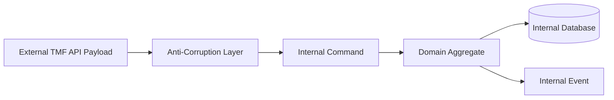
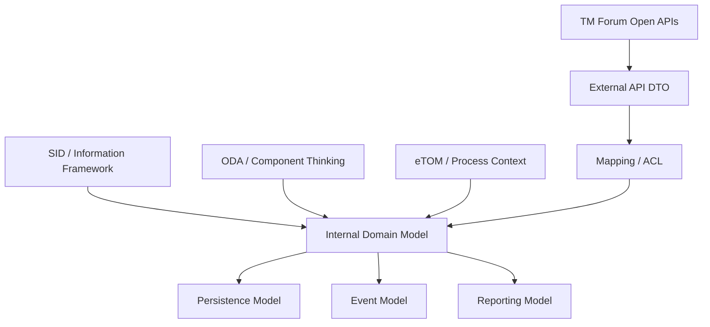
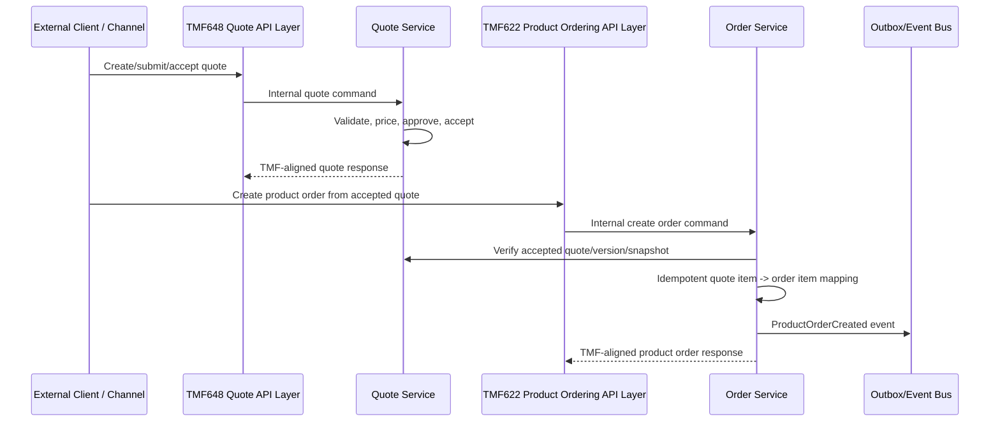
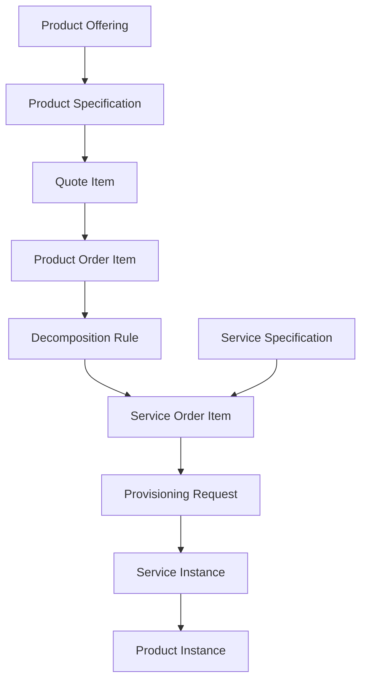

# TM Forum Data Reference Model

TM Forum adalah referensi penting untuk telco BSS/OSS karena menyediakan bahasa, framework, dan API reference yang sering dipakai untuk menyelaraskan sistem customer, catalog, quote, order, inventory, service, resource, billing, dan assurance.

Tetapi untuk senior backend engineer, prinsip utamanya adalah:

```text
Use TM Forum as a reference model, not as blind internal schema.
```

TM Forum membantu menjawab:

- entity apa yang umum dalam telco,
- bagaimana API contract sering distrukturkan,
- bagaimana product, service, resource, customer, order, dan inventory dipisahkan,
- bagaimana istilah domain distandarkan,
- bagaimana integrasi antar sistem bisa dibuat lebih interoperable.

Namun TM Forum tidak otomatis menjawab:

- schema internal PostgreSQL harus seperti apa,
- aggregate boundary service internal harus seperti apa,
- workflow internal harus memakai state apa,
- event internal harus punya payload apa,
- rule engine internal harus bekerja bagaimana,
- CSG/team menggunakan subset atau extension apa,
- dan bagaimana production migration/reconciliation dilakukan.

Bagian ini membangun cara berpikir untuk memakai TM Forum secara benar dalam enterprise data modelling.

---

## 1. Core Mental Model

TM Forum reference model sebaiknya dipakai pada tiga level berbeda:

| Level | Fungsi | Risiko Jika Disalahgunakan |
|---|---|---|
| Vocabulary | Menyamakan bahasa domain | Nama entity sama tetapi semantics internal berbeda |
| Integration Reference | Membantu API/event mapping | API contract disalin tanpa ownership clarity |
| Conceptual Model | Membantu entity relationship thinking | Conceptual model dipaksa menjadi physical schema |

Rule of thumb:

```text
TM Forum is excellent for alignment.
Internal architecture still needs bounded context, invariant, lifecycle, ownership, and operational design.
```

---

## 2. TM Forum Landscape

Dalam konteks data modelling, beberapa asset TM Forum yang paling relevan adalah:

- ODA: Open Digital Architecture,
- SID: Information Framework / Shared Information/Data model,
- eTOM: Business Process Framework,
- Open APIs: REST/event/API specifications untuk domain telco,
- component model / ODA components,
- conformance/testing guidance,
- API data model / JSON schema artifacts.

### How to map them mentally

| TM Forum Asset | Data Modelling Use |
|---|---|
| ODA | Membantu memikirkan component/domain decomposition |
| SID | Membantu vocabulary dan conceptual information model |
| eTOM | Membantu memahami process context dan lifecycle responsibility |
| Open APIs | Membantu integration contract dan API resource shape |
| API Data Model | Membantu common JSON schema alignment |
| ODA Components | Membantu service capability ownership discussion |

---

## 3. ODA: Open Digital Architecture

ODA dapat dipahami sebagai blueprint modern untuk telco digital platforms.

Dari sudut data modelling, ODA berguna untuk:

- memisahkan domain/component responsibility,
- menghindari monolithic enterprise data model,
- menyelaraskan component capability dengan Open APIs,
- mendukung cloud-native, component-based architecture,
- dan membantu diskusi modernization dari legacy BSS/OSS.

### ODA is not a database design

Jangan membaca ODA sebagai:

```text
ODA component = database schema.
```

Lebih tepat:

```text
ODA component = capability boundary candidate.
```

Internal service boundary tetap harus diverifikasi berdasarkan:

- existing architecture,
- transaction boundary,
- team ownership,
- deployment topology,
- data ownership,
- integration pattern,
- performance constraints,
- migration reality.

---

## 4. SID: Information Framework

SID adalah information/data reference model dan vocabulary untuk telco business entities.

Dalam data modelling, SID membantu engineer memahami konsep seperti:

- Party,
- Customer,
- Account,
- Product,
- Product Offering,
- Product Specification,
- Service,
- Resource,
- Agreement,
- Product Order,
- Product Inventory,
- Service Inventory,
- Billing,
- Trouble/assurance concepts.

### How to use SID

Gunakan SID untuk:

- glossary alignment,
- conceptual ERD discussion,
- entity naming sanity check,
- integration mapping,
- avoiding local terminology chaos,
- onboarding engineers into telco domain language.

Jangan gunakan SID untuk:

- menyalin seluruh inheritance model ke database,
- membuat satu canonical model yang dipakai semua service,
- mengabaikan bounded context internal,
- memaksa semua field TMF masuk schema internal,
- mengganti domain reasoning dengan compliance checklist.

---

## 5. eTOM: Business Process Framework

eTOM membantu memahami business process context dalam telco.

Untuk data modelling, eTOM penting karena entity tidak hidup sendirian. Entity berubah karena proses:

- sell,
- quote,
- order capture,
- order fulfillment,
- service provisioning,
- billing,
- payment,
- assurance,
- problem handling,
- change management,
- termination.

### Process-to-data mapping

| Process Concern | Data Model Concern |
|---|---|
| Order capture | Quote/order entity, customer intent, validation |
| Order handling | Order state, order item state, milestone |
| Service configuration | Service order, service instance, service characteristic |
| Resource provisioning | Resource assignment, provisioning request |
| Billing | Charge, invoice, billing account, cycle |
| Assurance | Trouble ticket, fault, impacted service/product |
| Customer management | Party, customer, account, contact |

A good data model supports the process without being enslaved by a single workflow implementation.

---

## 6. Open APIs

TM Forum Open APIs are integration specifications for telecom domains. They help external and internal systems communicate using familiar resource models.

Relevant APIs for this series include:

- TMF620 Product Catalog Management,
- TMF648 Quote Management,
- TMF622 Product Ordering,
- TMF629 Customer Management,
- TMF637 Product Inventory,
- TMF641 Service Ordering,
- plus adjacent APIs such as Party Management, Service Catalog, Service Inventory, Billing, Trouble Ticket, and Product Offering Qualification depending on architecture.

### Open API role in data modelling

Open APIs should influence:

- DTO structure,
- resource naming,
- relationship representation,
- lifecycle states,
- API event model,
- external integration contract,
- backward compatibility expectations.

But Open APIs should not automatically dictate:

- internal table names,
- internal aggregate boundaries,
- JPA entity structure,
- MyBatis mapper shape,
- database normalization level,
- internal event payloads,
- cache model,
- reporting model.

---

## 7. TM Forum API vs Internal Model

A common mistake is to make the internal database exactly mirror TMF API JSON.

This is tempting because:

- mapping feels easy,
- external integration looks standard,
- developers avoid writing translation layers,
- demos work quickly.

But in production this creates problems:

- DB becomes coupled to API version,
- internal lifecycle cannot evolve freely,
- external optional fields pollute core model,
- nested JSON shape becomes hard to query,
- reporting becomes fragile,
- migrations are harder,
- API compatibility blocks internal refactor,
- bounded contexts blur.

Better pattern:

```text
TMF API DTO
  -> Anti-corruption / mapping layer
      -> Internal command / domain model
          -> Persistence model
              -> Event / read model / audit model
```

---

## 8. TMF620 Product Catalog Reference

TMF620 helps model product catalog management.

Important concepts:

- Product Catalog,
- Category,
- Product Offering,
- Product Specification,
- Product Offering Price,
- Product Relationship,
- Product Characteristic,
- Lifecycle Status,
- Version,
- Validity Period.

### Internal interpretation

TMF620 can guide how to expose published catalog data, but internal catalog modelling still needs:

- draft vs published separation,
- effective dating,
- catalog release workflow,
- approval/publication audit,
- price versioning,
- rule versioning,
- in-flight quote/order impact handling,
- rollback strategy,
- cache invalidation strategy.

### Mapping example

| TMF Concept | Internal Data Question |
|---|---|
| ProductOffering | Is this sellable? Is it versioned? Is it market/channel-specific? |
| ProductSpecification | What technical/commercial structure does offering instantiate? |
| ProductOfferingPrice | Is this definition, calculated price, or quote snapshot? |
| ProductCharacteristic | Is it static attribute, configurable option, or runtime value? |
| ValidFor | Is this business effective time, system time, or both? |

---

## 9. TMF648 Quote Management Reference

TMF648 helps model quote lifecycle and quote items.

Important concepts:

- Quote,
- Quote Item,
- Related Party,
- Product Offering Reference,
- Product Configuration,
- Price,
- Agreement Reference,
- Validity Period,
- Quote State,
- Quote Item Action,
- Approval/authorization awareness,
- Quote-to-order conversion.

### Internal interpretation

Quote is not merely cart data. In enterprise CPQ, quote can become commercial evidence.

Internal model must answer:

- when is quote mutable?
- when is quote immutable?
- how are revisions represented?
- what price snapshot is preserved?
- what catalog version is preserved?
- how is approval traced?
- how is quote converted to order idempotently?
- what happens after expiry?

### Mapping risk

TMF quote payload may allow flexible/nested product objects. Internal model should not blindly store the entire quote as opaque JSON unless that is a deliberate design with query/audit/reporting trade-offs accepted.

---

## 10. TMF622 Product Ordering Reference

TMF622 helps model product orders and order items.

Important concepts:

- Product Order,
- Product Order Item,
- Product Action,
- Product Reference,
- Related Party,
- Billing Account Reference,
- Order State,
- Order Item State,
- Order Relationship,
- Order Milestone,
- Decomposition awareness,
- Fallout handling.

### Internal interpretation

A product order is an execution request, not a quote copy.

Internal model must answer:

- what quote/order mapping exists?
- which order items correspond to which quote items?
- what action is requested?
- what current inventory state is being changed?
- what dependencies exist between items?
- how does order decompose into service/resource work?
- how are partial completion and fallout represented?
- what triggers billing?

### Product order invariant examples

```text
A product order created from a quote must trace to the accepted quote version.

An order item action must be valid for the target product inventory state.

An order cannot be marked completed while required order items remain in non-terminal failure state unless explicitly closed with fallout/exception evidence.
```

---

## 11. TMF629 Customer Management Reference

TMF629 helps model customer management concepts.

Important concepts:

- Customer,
- Party,
- Contact Medium,
- Related Party,
- Account Relationship,
- Customer Status,
- Customer Segment,
- Organization,
- Individual,
- Customer Hierarchy,
- Customer Identity.

### Internal interpretation

Customer model in enterprise B2B must distinguish:

- legal party,
- customer role,
- account,
- billing account,
- service account,
- contact person,
- buyer,
- approver,
- payer,
- service owner,
- contracting entity.

### Mapping risk

Do not use one `customer` table for every party/account/contact/billing role unless the domain is extremely simple.

That creates ambiguity:

```text
Is this customer the legal entity, the billing payer, the site owner, the buyer, or the support contact?
```

---

## 12. TMF637 Product Inventory Reference

TMF637 helps model product inventory.

Important concepts:

- Product Instance,
- Product Relationship,
- Product Characteristic Value,
- Product Status,
- Start Date,
- Termination Date,
- Realizing Service,
- Realizing Resource,
- Billing Account Reference,
- Installed Product.

### Internal interpretation

Product inventory is the installed commercial state after order fulfillment.

It should answer:

- what product does customer currently have?
- what order created or modified it?
- what status is it in?
- what characteristics are active?
- what service/resource realizes it?
- which billing account pays for it?
- what historical changes happened?

### Common invariant

```text
A product instance should trace back to a source order/order item or approved migration/backfill evidence.
```

---

## 13. TMF641 Service Ordering Reference

TMF641 helps model service orders.

Important concepts:

- Service Order,
- Service Order Item,
- Service Action,
- Service Specification,
- Service Characteristic,
- Service Relationship,
- Service State,
- Service Order Milestone,
- Service Fulfillment,
- Service Decomposition,
- Service Order Fallout.

### Internal interpretation

Service order is usually closer to OSS than CPQ.

It should answer:

- what service work must be done?
- which product order item caused it?
- what service specification applies?
- what characteristics are requested?
- what dependencies exist?
- what downstream provisioning request was sent?
- what status/fallout happened?

---

## 14. TMF as Anti-Corruption Boundary

When integrating with systems that expose TMF APIs, your service often needs an anti-corruption layer.



The anti-corruption layer handles:

- naming mismatch,
- optional/mandatory field mismatch,
- lifecycle state mapping,
- enum translation,
- characteristic/value normalization,
- relationship flattening,
- extension fields,
- version compatibility,
- validation differences,
- internal invariant enforcement.

---

## 15. TMF Mapping Dimensions

When mapping internal model to TMF, do not map only fields. Map dimensions.

| Dimension | Question |
|---|---|
| Identity | Which internal ID maps to which external ID? |
| Lifecycle | Are states semantically equivalent? |
| Time | Does validFor mean business validity, system validity, or both? |
| Ownership | Which system owns updates? |
| Relationship | Is relation direct, derived, or projection? |
| Version | Is this current entity, versioned entity, or snapshot? |
| Extensibility | Are custom fields needed? |
| Audit | Can the mapping be explained later? |
| Error | What happens when mapping fails? |
| Compatibility | Can old consumers still understand the response/event? |

---

## 16. Conceptual Mapping Diagram



The most important arrow is not `API -> DB`.

The important arrow is:

```text
TMF reference -> internal domain reasoning -> persistence/integration/reporting design
```

---

## 17. TMF State Mapping

TMF APIs often define lifecycle states or state-like fields. Internal systems may use different states.

Do not assume enum names are equivalent.

Example:

| External/TMF-ish State | Internal State Possibility |
|---|---|
| acknowledged | captured, received, accepted by API |
| inProgress | validated, decomposed, fulfillment pending, provisioning running |
| completed | fulfilled, billing active, closed, or technically completed |
| failed | terminal failure, retryable fallout, external failure, validation failure |
| cancelled | customer cancelled, system cancelled, superseded by amendment |

State mapping must define:

- source state,
- target state,
- allowed transitions,
- terminal semantics,
- retry semantics,
- manual intervention semantics,
- audit reason,
- reporting meaning.

---

## 18. TMF Relationship Mapping

TMF payloads often represent relationships flexibly.

Internal model must decide whether a relationship is:

- strong ownership,
- parent-child composition,
- weak reference,
- external reference,
- derived relation,
- historical snapshot,
- many-to-many association,
- temporary workflow relation.

Example:

```text
QuoteItem -> ProductOffering
```

Could mean:

- reference current offering,
- reference offering version,
- store copied offering snapshot,
- store external offering href only,
- map to internal catalog offering ID.

The choice affects:

- auditability,
- price correctness,
- in-flight quote handling,
- reporting,
- migration,
- API compatibility.

---

## 19. TMF Characteristic Mapping

TMF-style models often use flexible characteristic arrays.

Example conceptual structure:

```text
characteristic: [
  { name: "bandwidth", value: "1Gbps" },
  { name: "contractTerm", value: "36 months" }
]
```

Internal choices:

| Internal Strategy | Good For | Risk |
|---|---|---|
| JSONB payload | Flexibility, external payload preservation | Poor constraints/reporting if abused |
| EAV table | Dynamic attributes, query by name/value | Complexity and weak typing |
| Relational columns | Strong typing and constraints | Low flexibility |
| Hybrid | Core fields relational, extension JSONB | Requires discipline |

For enterprise CPQ, a hybrid model is often safer:

```text
Core invariant fields -> relational columns
Configurable characteristics -> typed characteristic tables
External/raw payload -> retained separately if needed
```

---

## 20. TMF Extension Strategy

TMF APIs often need extension for vendor/customer-specific needs.

Internal extension strategy should define:

- allowed extension fields,
- namespace convention,
- validation rules,
- owner of extension semantics,
- backward compatibility,
- reporting impact,
- privacy/security classification,
- whether extension is persisted, ignored, or mapped.

Bad extension pattern:

```text
Put everything into customFields and let every consumer interpret it differently.
```

Better:

```text
Use extension fields only for well-owned semantics with documentation, validation, and compatibility rules.
```

---

## 21. TMF and Microservice Ownership

TMF resource boundaries are not automatically your microservice boundaries.

Example:

```text
ProductOrdering API exists.
```

That does not mean:

```text
One ProductOrdering service owns quote, order, fulfillment, billing, and inventory.
```

Internal boundaries should consider:

- transaction needs,
- lifecycle ownership,
- team ownership,
- data volume,
- deployment independence,
- integration complexity,
- consistency needs,
- event ownership,
- migration history.

### Pattern

```text
External TMF API facade
  -> internal services by bounded context
```

This can protect internal design while exposing a standardized contract.

---

## 22. TMF and PostgreSQL Physical Schema

Do not convert TMF nested JSON directly into PostgreSQL tables mechanically.

Bad approach:

```text
Every TMF JSON object becomes a table.
Every nested array becomes a child table.
Every field becomes nullable because API says optional.
```

Problems:

- sparse tables,
- unclear invariants,
- weak ownership,
- too many generic relationships,
- hard-to-query lifecycle,
- no domain-specific constraints,
- API version migration becomes DB migration.

Better approach:

```text
Design internal logical model from domain invariants.
Map TMF DTOs at the boundary.
Persist internal entities optimized for correctness and access patterns.
Keep raw external payload only when needed for audit/debug/replay.
```

---

## 23. TMF and Java/JAX-RS Services

A Java/JAX-RS service may expose TMF-aligned endpoints, but internal layers should stay separated.

Recommended structure:

```text
JAX-RS TMF Resource
  -> TMF Request DTO
  -> TMF Mapper / ACL
  -> Internal Command
  -> Domain Service / Aggregate
  -> Repository
  -> Outbox Event
  -> TMF Response DTO
```

Avoid:

```text
JAX-RS TMF Resource
  -> JPA Entity matching TMF JSON
  -> Database save
```

That collapses API, persistence, and domain model.

---

## 24. TMF and Event-Driven Systems

TMF APIs often define notification/event patterns. Internal event-driven architecture still needs explicit event design.

Internal events should answer:

- what fact happened?
- which aggregate changed?
- what version is the event?
- what correlation/causation IDs apply?
- is payload snapshot or delta?
- is event replay safe?
- is consumer idempotency possible?

Example:

```text
External: ProductOrderStateChangeNotification
Internal: ProductOrderItemFulfillmentCompleted, BillingActivationRequested, ProductOrderCompleted
```

External event may be coarser. Internal events may be more specific.

---

## 25. TMF and Reporting Model

TMF APIs are not reporting models.

For reporting, you need:

- lifecycle timestamps,
- state history,
- fact tables,
- dimension tables,
- denormalized projections,
- customer/product/order/billing joins,
- data freshness metadata,
- reconciliation status,
- SLA metrics.

A TMF API response may expose current resource state, but reporting needs history and aggregation.

Example:

```text
TMF product order current state = completed
Reporting needs:
  - created_at
  - submitted_at
  - decomposed_at
  - first_fallout_at
  - fallout_reason
  - completed_at
  - billing_activation_at
  - product_family
  - customer_segment
  - region
```

---

## 26. TMF and Auditability

TMF alignment does not guarantee auditability.

Internal audit model must capture:

- actor,
- action,
- target entity,
- before/after values,
- business reason,
- source system,
- correlation ID,
- causation ID,
- timestamp,
- approval evidence,
- pricing trace,
- order trace,
- external payload reference.

For integration, store enough evidence to answer:

```text
Did we receive this TMF request?
How did we map it?
Which internal aggregate did it affect?
What state transition happened?
What event did we publish?
What response did we return?
```

---

## 27. TMF and Versioning

TMF APIs have versions. Internal models also have versions. These are not the same.

Version dimensions:

| Version Type | Example |
|---|---|
| API version | TMF API v4/v5 style contract |
| Schema version | JSON schema version |
| Entity version | optimistic locking / revision |
| Business version | catalog version, price version, quote revision |
| Event version | event payload version |
| Mapping version | ACL mapping behavior version |

A production-grade system should know which version changed and who is affected.

### Compatibility checklist

- [ ] Is the field additive or breaking?
- [ ] Does old consumer ignore unknown fields?
- [ ] Does removed field affect downstream mapping?
- [ ] Is enum expansion safe?
- [ ] Does state mapping change reporting semantics?
- [ ] Is schema registry or contract testing used?
- [ ] Is API version independent from DB migration?

---

## 28. TMF and Canonical Model Risk

TM Forum can tempt teams into creating a single enterprise canonical model.

Canonical model can be useful for integration, but dangerous as universal internal model.

Risks:

- all services depend on one shared DTO library,
- domain-specific invariants disappear,
- every field becomes optional,
- schema grows endlessly,
- versioning becomes political,
- teams cannot evolve independently,
- internal semantics diverge while names remain same.

Better:

```text
Use canonical model at integration boundary only when necessary.
Keep bounded-context models internally.
Map explicitly.
Document semantic differences.
```

---

## 29. TMF Compliance vs Production Correctness

A system can be TMF-aligned and still production-unsafe.

Examples:

- API shape matches TMF but quote conversion is not idempotent.
- Product order state exists but item-level fallout is not modelled.
- Product inventory API exists but source order trace is missing.
- Catalog API exposes offering but quote does not snapshot catalog version.
- Customer API exists but B2B legal/billing/service roles are ambiguous.
- Event notification exists but no outbox guarantees publication after commit.

Production correctness requires:

- invariant enforcement,
- lifecycle state design,
- audit trail,
- reconciliation,
- migration discipline,
- observability,
- failure handling,
- ownership clarity.

TMF helps with alignment. It does not replace engineering design.

---

## 30. TMF Mapping Example: Quote to Order



Key points:

- TMF API layer is not necessarily the domain owner.
- Internal quote/order services enforce invariants.
- Mapping is explicit.
- Idempotency is required.
- Events are internal integration facts.

---

## 31. TMF Mapping Example: Product to Service



The model must preserve the mapping chain:

```text
Product offering selected in quote
  -> order item action
      -> decomposition rule
          -> service order item
              -> provisioning result
                  -> service instance
                      -> product instance realization
```

---

## 32. TMF Mapping Table Template

Use this template when mapping internal models to TMF concepts.

| Internal Concept | TMF Concept | Mapping Type | Owner | Notes |
|---|---|---|---|---|
| internal_quote | Quote | direct/resource | Quote service | State mapping required |
| internal_quote_line | QuoteItem | direct/resource child | Quote service | Bundle hierarchy mapping required |
| accepted_quote_snapshot | Quote/related objects | snapshot | Quote service | Preserve price/catalog evidence |
| product_order | ProductOrder | direct/resource | Order service | Idempotent conversion from quote |
| product_order_item | ProductOrderItem | direct/resource child | Order service | Action mapping required |
| installed_product | Product inventory Product | direct/resource | Inventory service | Source order trace required |
| customer_account | Customer/Account | semantic mapping | Customer domain | B2B role distinction needed |
| service_work_item | ServiceOrderItem | semantic mapping | Fulfillment/OSS | Depends on decomposition design |

---

## 33. Internal Verification Checklist

### TM Forum usage

- [ ] Which TM Forum APIs are officially used or targeted internally?
- [ ] Are APIs v4, v5, custom, or hybrid?
- [ ] Is there a documented TMF mapping guide?
- [ ] Which fields are standard vs internal extension?
- [ ] Is TMF used for external API only, internal API, event model, or documentation?
- [ ] Is there conformance testing or only semantic alignment?

### ODA/SID/eTOM

- [ ] Does the team use ODA component terminology?
- [ ] Is SID used as glossary/reference model?
- [ ] Is eTOM used to align business process ownership?
- [ ] Are internal terms mapped to TMF terms?
- [ ] Are deviations documented?

### API and DTO mapping

- [ ] Are TMF DTOs separated from domain entities?
- [ ] Is there an anti-corruption/mapping layer?
- [ ] Are enum/state mappings documented?
- [ ] Are optional TMF fields validated against internal invariants?
- [ ] Are href/id/externalId mappings consistent?
- [ ] Are API versions decoupled from DB schema versions?

### Database model

- [ ] Does internal schema mirror TMF JSON directly?
- [ ] If yes, is this deliberate and documented?
- [ ] Are core invariant fields relational and constrained?
- [ ] Are characteristic/extension fields queryable when needed?
- [ ] Are raw payloads stored only when needed for audit/debug?
- [ ] Is reporting protected from opaque payload dependency?

### Event model

- [ ] Are TMF notifications used internally or externally?
- [ ] Are internal events more specific than external notifications?
- [ ] Are event versions documented?
- [ ] Are event schema changes contract-tested?
- [ ] Is outbox/inbox used for reliability?
- [ ] Can consumers handle enum expansion or optional fields?

### Quote/order/catalog/billing mapping

- [ ] How is TMF620 catalog mapped to internal catalog model?
- [ ] How is TMF648 quote mapped to internal quote model?
- [ ] How is TMF622 product order mapped to internal order model?
- [ ] How is TMF629 customer mapped to internal party/account model?
- [ ] How is TMF637 product inventory mapped to installed product?
- [ ] How is TMF641 service order mapped to OSS/fulfillment model?
- [ ] What billing APIs/models are used internally or externally?

### Governance

- [ ] Who approves TMF mapping changes?
- [ ] Are deviations captured in ADRs?
- [ ] Is there a versioning/deprecation policy?
- [ ] Are backward compatibility requirements explicit?
- [ ] Are TMF-related changes reviewed by solution architect/BA/product owner/senior engineer?

---

## 34. PR Review Checklist

When reviewing a PR involving TMF-aligned models:

- [ ] Does the PR confuse TMF DTO with internal domain entity?
- [ ] Does it expose internal schema through TMF API response?
- [ ] Does it store external payload without validating internal invariants?
- [ ] Does it map lifecycle states explicitly?
- [ ] Does it handle unknown enum values safely?
- [ ] Does it preserve idempotency and correlation IDs?
- [ ] Does it update contract tests?
- [ ] Does it document extension fields?
- [ ] Does it preserve backward compatibility?
- [ ] Does it affect reporting/read models?
- [ ] Does it require migration/backfill?
- [ ] Does it require internal verification with architect/BA/PO/DBA/platform team?

---

## 35. Common Anti-Patterns

### Anti-pattern 1: TMF JSON as database schema

Symptoms:

- many nullable columns,
- opaque nested payloads,
- weak constraints,
- difficult reporting,
- painful API version migration.

### Anti-pattern 2: Shared TMF DTO library everywhere

Symptoms:

- all services depend on same DTO package,
- domain semantics leak across contexts,
- small API changes force broad redeploy,
- fields become meaningless outside owner context.

### Anti-pattern 3: Same state name, different meaning

Symptoms:

- `completed` means fulfilled in one system,
- `completed` means billed in another,
- dashboard mixes both,
- customer support sees wrong status.

### Anti-pattern 4: No deviation documentation

Symptoms:

- team says “we follow TMF”,
- but no one knows which parts,
- integrators assume different semantics,
- bugs appear during integration testing.

### Anti-pattern 5: Reference model replaces domain reasoning

Symptoms:

- design discussions become field-by-field matching,
- no one discusses invariants,
- no state machine review,
- no audit/reconciliation model,
- production issues persist despite “standard API”.

---

## 36. Correct Usage Pattern

A stronger TMF usage pattern:

```text
1. Use SID/ODA/eTOM to align vocabulary and capability boundaries.
2. Use TMF Open APIs to design external resource contracts.
3. Define internal bounded contexts and data ownership.
4. Design internal conceptual/logical model from invariants and lifecycle.
5. Map TMF DTOs through an explicit anti-corruption layer.
6. Keep persistence model optimized for correctness and access patterns.
7. Keep event model explicit and versioned.
8. Build reporting/read models separately.
9. Document deviations and extension semantics.
10. Add contract, migration, reconciliation, and observability checks.
```

---

## 37. Senior Engineer Questions

Ask these in architecture/design review:

```text
Which TMF API or SID concept are we aligning to?
Is this alignment external, internal, or only conceptual?
What is the internal aggregate owner?
What invariant is not captured by the TMF payload?
What lifecycle state mapping is required?
What is the persistence model optimized for?
What is the event model?
What is the reporting model?
What is the audit evidence?
What happens when TMF version changes?
What extension fields are we introducing?
How do we reconcile internal/external mismatch?
```

---

## 38. Practical Mental Compression

Use this compressed model:

```text
SID gives vocabulary.
eTOM gives process context.
ODA gives component/capability orientation.
Open APIs give integration contract patterns.
Internal domain model gives business correctness.
Persistence model gives durable state.
Event model gives distributed facts.
Reporting model gives operational insight.
Audit model gives evidence.
Reconciliation proves systems still agree.
```

Do not skip the middle.

---

## 39. Summary

TM Forum is valuable because it reduces domain ambiguity in telco systems. It gives a shared reference for product catalog, quote, product order, customer, inventory, service ordering, and many adjacent BSS/OSS capabilities.

But TM Forum alignment is not the same as production-grade data modelling.

A senior engineer must still design:

- bounded context ownership,
- lifecycle state machines,
- invariants,
- snapshot/versioning,
- audit trail,
- API mapping,
- event schema,
- PostgreSQL physical model,
- reporting/read model,
- reconciliation,
- migration strategy,
- and observability.

The right goal is not:

```text
Make our database look like TMF.
```

The right goal is:

```text
Make our system semantically align with TMF where useful,
while preserving internal correctness, ownership, traceability, performance, and operability.
```
