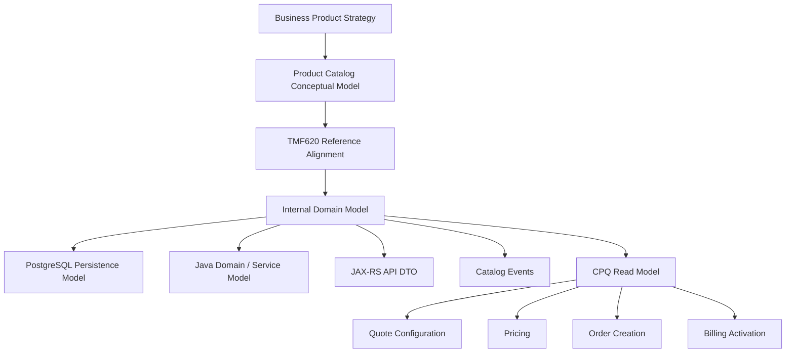
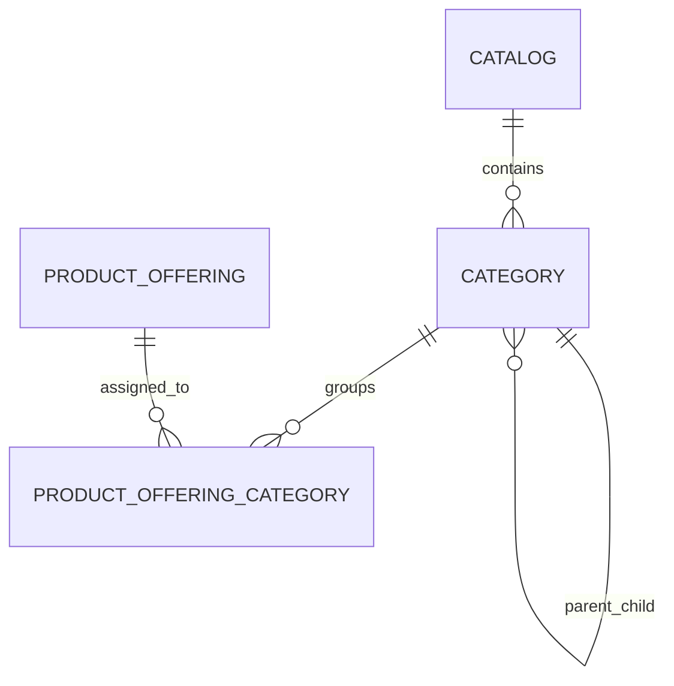
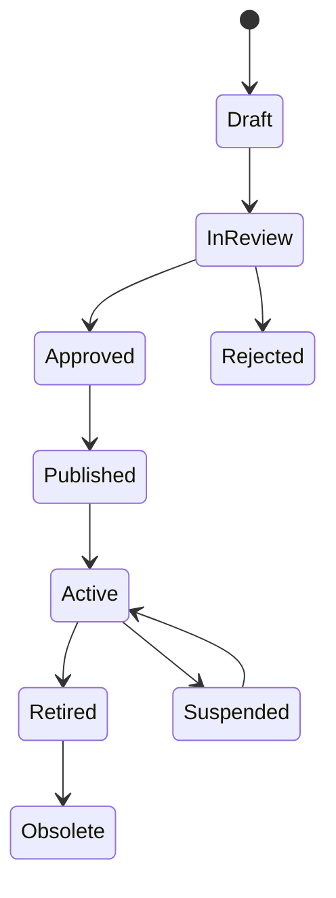
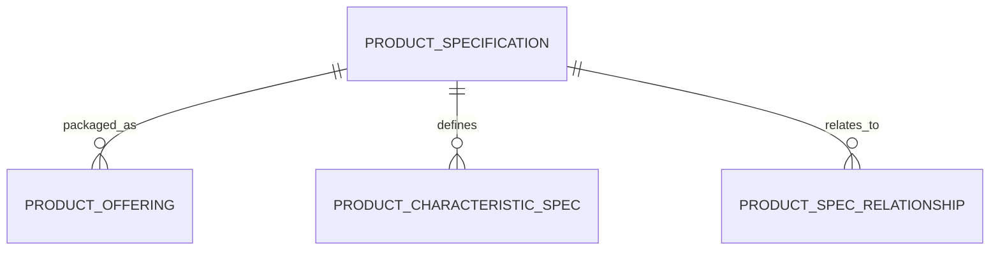
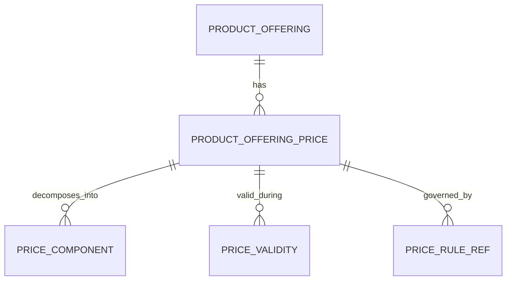
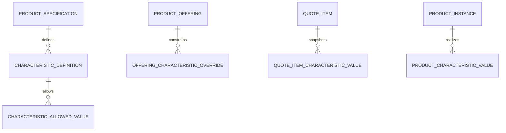
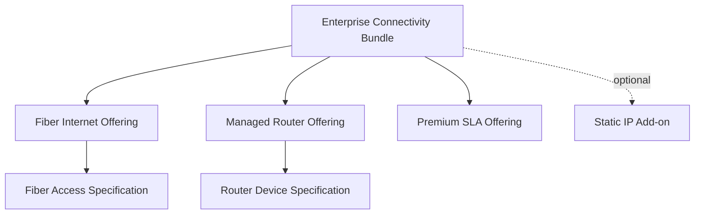
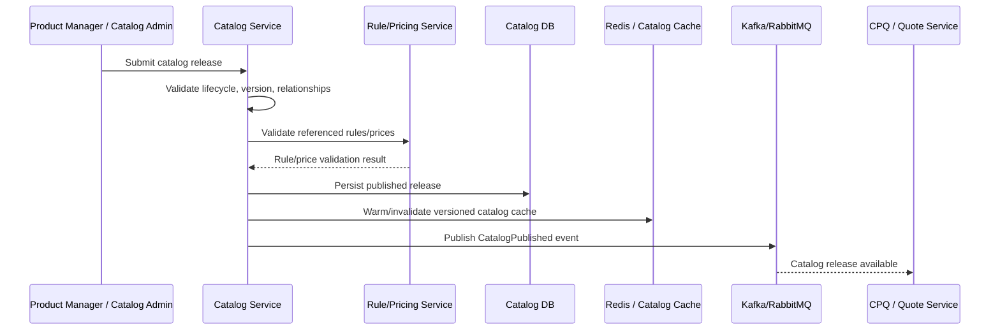

# TMF620 Product Catalog Data Model

TMF620 Product Catalog Management API adalah salah satu reference paling penting untuk memahami product catalog di telco/CPQ systems.

Tetapi mindset yang benar bukan:

```text
TMF620 JSON = internal database schema.
```

Mindset yang benar:

```text
TMF620 gives a reference shape for catalog resources.
Your internal model still needs lifecycle, ownership, versioning, publication, pricing, rules, auditability, and production correctness design.
```

Bagian ini membahas TMF620 sebagai **reference model** untuk membangun product catalog data model di CPQ, quote management, order management, billing, dan telco BSS/OSS systems.

Fokus utamanya:

- catalog sebagai source of commercial truth,
- product offering sebagai sellable construct,
- product specification sebagai technical/commercial product definition,
- product offering price sebagai pricing reference,
- product characteristic sebagai configurable attribute,
- relationship sebagai bundle/dependency/compatibility structure,
- lifecycle status sebagai governance state,
- version dan effective date sebagai temporal correctness boundary,
- publication sebagai operational control point,
- dan qualification awareness sebagai jembatan ke availability/eligibility logic.

---

## 1. Core Mental Model

Product catalog adalah tempat sistem mendefinisikan **apa yang boleh dijual, bagaimana dijual, kapan berlaku, dengan harga apa, dan dalam kombinasi apa**.

Dalam CPQ/order/billing systems, catalog bukan hanya daftar produk.

Catalog adalah input utama untuk:

- configuration,
- eligibility,
- compatibility,
- pricing,
- quote line creation,
- discount eligibility,
- approval guardrail,
- order item creation,
- decomposition,
- billing charge generation,
- reporting by product family,
- dan lifecycle governance.

### Important distinction

| Concept | Meaning |
|---|---|
| Product Catalog | Container / publication space untuk product offering dan related definitions |
| Category | Grouping / navigational structure |
| Product Offering | Sellable item atau bundle yang bisa dipilih customer |
| Product Specification | Definition of what the product is |
| Product Offering Price | Commercial price definition attached to offering |
| Product Characteristic | Attribute yang dapat mendeskripsikan atau mengkonfigurasi product |
| Product Relationship | Relationship antar offering/specification, misalnya bundle, dependency, replacement, incompatibility |
| Lifecycle Status | State governance: draft, active, retired, obsolete, etc. |
| Version / Effective Date | Temporal boundary untuk perubahan catalog |

Rule of thumb:

```text
Quote should not depend on mutable catalog meaning.
Quote should depend on a stable catalog version or snapshot.
```

---

## 2. TMF620 in the Enterprise Data Modelling Stack

TMF620 biasanya berada di antara conceptual model dan API/reference model.



Jangan membuat satu object yang dipakai untuk semua layer.

Contoh anti-pattern:

```text
ProductOfferingEntity is used as:
- JPA entity
- REST response DTO
- Kafka event payload
- quote snapshot object
- pricing input object
- cache value
- reporting row
```

Masalahnya:

- internal schema menjadi external contract,
- perubahan persistence menjadi breaking API,
- event consumer bergantung pada internal detail,
- quote snapshot ikut mutable,
- reporting field bergantung pada runtime join,
- cache invalidation makin sulit.

Model yang lebih sehat:

| Layer | Model Shape |
|---|---|
| Conceptual | Catalog, Offering, Specification, Price, Characteristic, Relationship |
| Domain | Aggregate dan invariant internal |
| Persistence | Normalized tables, version tables, relation tables, audit tables |
| API | TMF620-aligned resource shape |
| Event | CatalogPublished, ProductOfferingChanged, PriceChanged |
| Quote Snapshot | Frozen subset yang diperlukan quote |
| Reporting | Denormalized product dimension / catalog dimension |
| Cache | Versioned read-optimized structure |

---

## 3. Product Catalog

Product catalog adalah container untuk product offerings dan metadata publikasi.

Contoh field conceptual:

| Field | Purpose | Concern |
|---|---|---|
| catalog_id | Internal identifier | Stable internal reference |
| catalog_code | Business identifier | Bisa dipakai external/internal business process |
| name | Human-readable name | Localisation mungkin diperlukan |
| description | Business explanation | Jangan dipakai untuk rule logic |
| version | Catalog release version | Harus jelas semantics-nya |
| lifecycle_status | Draft/published/retired | Governance state |
| valid_from | Business effective start | Temporal correctness |
| valid_to | Business effective end | Expiry handling |
| tenant_id | SaaS isolation | Multi-tenancy correctness |
| publication_id | Release/publication reference | Audit dan rollback |

### Catalog as aggregate?

Tergantung skala.

Untuk catalog kecil:

```text
Catalog aggregate may contain categories and offerings.
```

Untuk enterprise catalog besar:

```text
Catalog is usually not a single transactional aggregate.
It is a publication boundary, not necessarily one write aggregate.
```

Kenapa?

- product offering bisa ribuan,
- pricing bisa versioned terpisah,
- rule update bisa beda lifecycle,
- publication bisa batch/release process,
- read access jauh lebih besar daripada write access,
- search/cache model biasanya dibangun terpisah.

### Internal verification checklist

Cek di internal codebase/database:

- Apakah ada entity/table untuk catalog sebagai container?
- Apakah catalog hanya grouping UI atau benar-benar release boundary?
- Apakah ada concept catalog version?
- Apakah catalog punya lifecycle status?
- Apakah catalog effective-dated?
- Apakah catalog tenant/customer/channel-specific?
- Apakah quote menyimpan catalog version atau hanya catalog current reference?
- Apakah catalog publication punya audit trail?
- Apakah rollback catalog pernah terjadi atau didukung?

---

## 4. Category

Category biasanya digunakan untuk grouping product offering.

Contoh:

- Broadband,
- Mobile,
- Enterprise Connectivity,
- Cloud Services,
- Managed Services,
- Add-ons,
- Devices,
- Professional Services.

Category bisa terlihat sederhana, tetapi failure mode-nya nyata.

### Category modelling choices

| Pattern | Good For | Risk |
|---|---|---|
| Flat category | Simple catalog navigation | Tidak cukup untuk large enterprise catalog |
| Tree category | Product browsing hierarchy | Parent-child lifecycle complexity |
| Multi-category assignment | Offering bisa muncul di banyak view | Reporting ambiguity |
| Channel-specific category | Sales/channel catalog | Duplication dan governance complexity |
| Tenant-specific category | SaaS/customer-specific catalog | Cross-tenant leak risk |

### Conceptual model



### Correctness concerns

Category tidak boleh menjadi source of truth untuk product validity.

Anti-pattern:

```text
If product appears in category, it is sellable.
```

Lebih aman:

```text
Sellability = offering lifecycle + validity window + channel/tenant/customer eligibility + pricing availability + rule evaluation.
```

### Internal verification checklist

- Apakah category tree punya parent-child constraint?
- Apakah category digunakan untuk UI only atau eligibility logic?
- Apakah product offering bisa masuk banyak category?
- Apakah category assignment versioned?
- Apakah category assignment effective-dated?
- Apakah reporting memakai category sebagai dimension?
- Apakah category rename berdampak ke historical reports?

---

## 5. Product Offering

Product offering adalah sesuatu yang dapat dijual.

Dalam CPQ, user biasanya memilih offering, bukan product specification mentah.

Contoh:

```text
Enterprise Fiber 1Gbps - 36 Months
Managed Router Add-on
Premium Support Bundle
Cloud Backup 5TB
Static IP Add-on
```

Offering membawa commercial packaging.

Product specification membawa definisi product.

### Product offering conceptual fields

| Field | Purpose |
|---|---|
| offering_id | Internal stable ID |
| offering_code | Business/catalog code |
| name | Display name |
| description | Business description |
| product_specification_id | What this offering realizes |
| lifecycle_status | Draft/active/retired/etc. |
| version | Offering version |
| valid_from / valid_to | Effective selling window |
| is_bundle | Whether this offering is composite |
| sellable | Whether selectable for quote |
| channel_scope | Sales channel applicability |
| market_scope | Segment/market applicability |
| tenant_id | Tenant isolation if applicable |

### Offering is not Product Instance

```text
Product Offering = what can be sold.
Product Instance = what has been sold/activated for a customer.
```

This distinction is critical.

If system confuses offering and instance:

- modify/disconnect logic becomes wrong,
- billing activation may reference catalog instead of installed base,
- customer asset history becomes corrupted,
- reporting cannot separate sales catalog from installed product.

### Offering lifecycle



Not every implementation uses these exact states. The important point is that lifecycle must distinguish:

- design state,
- approval state,
- publication state,
- sellability state,
- retirement state,
- historical availability state.

### Invariant examples

```text
An offering cannot be active without a valid product specification.
An offering cannot be sold outside its validity window.
A quote item must reference an offering version or snapshot, not ambiguous current offering meaning.
A retired offering may remain visible for historical quote/order/inventory references.
A deleted offering must not break old orders or invoices.
```

### Internal verification checklist

- Apakah product offering punya stable ID dan business code?
- Apakah offering punya version?
- Apakah offering lifecycle status jelas?
- Apakah offering bisa retired tanpa menghapus historical references?
- Apakah quote item menyimpan offering version/snapshot?
- Apakah offering relationship dengan product specification mandatory?
- Apakah ada tenant/channel/market eligibility pada offering?
- Apakah offering code reused antar version?
- Apakah duplicate offering code dicegah?

---

## 6. Product Specification

Product specification mendefinisikan apa produk itu secara konseptual/teknis.

Contoh:

```text
Fiber Internet Access
Managed Router
SIP Trunk
Cloud Storage
VPN Service
Mobile Subscription
```

Product specification biasanya lebih stabil daripada offering.

Offering adalah packaging commercial.
Specification adalah definition.

### Relationship



### Specification vs offering

| Question | Product Specification | Product Offering |
|---|---|---|
| What is it? | Defines product type | Defines sellable package |
| Does it have price? | Usually no direct price | Usually yes |
| Does customer select it? | Usually indirectly | Usually directly |
| Is it used in quote line? | As reference through offering | Yes |
| Is it used in service/resource mapping? | Often yes | Sometimes via decomposition rule |
| Is it versioned? | Yes | Yes |

### Failure mode

Anti-pattern:

```text
All product-specific fields are added directly to product_offering table.
```

This causes:

- offering table becomes wide and inconsistent,
- product type changes require schema migration,
- dynamic configuration becomes hard,
- reporting becomes ambiguous,
- bundle components cannot share specification cleanly.

Better:

```text
ProductOffering references ProductSpecification.
ProductSpecification defines characteristics.
QuoteItem captures configured characteristic values as a snapshot.
```

### Internal verification checklist

- Apakah product specification dipisahkan dari offering?
- Apakah specification punya version/lifecycle?
- Apakah characteristic didefinisikan di specification atau offering?
- Apakah technical decomposition memakai specification?
- Apakah reporting membedakan product family/spec/offering?
- Apakah specification rename berdampak ke historical data?

---

## 7. Product Offering Price

Product offering price adalah definisi harga yang attached ke offering.

Tipe harga umum:

- one-time charge,
- recurring charge,
- usage charge,
- installation charge,
- activation charge,
- termination charge,
- discountable price,
- non-discountable fee,
- tax-aware component.

### Price is not quote price

Pembedaan penting:

```text
ProductOfferingPrice = catalog price definition.
QuoteItemPrice = quote-specific calculated/snapshotted price.
InvoiceLine = billed financial record.
```

Jika tiga hal ini dicampur, sistem akan gagal menjawab:

- harga list saat itu berapa,
- harga yang diberikan ke customer berapa,
- discount siapa yang approve,
- invoice menagih apa,
- kenapa invoice berbeda dari quote,
- apakah price recalculated atau snapshotted.

### Conceptual model



### Correctness concerns

```text
Price definition must be versioned.
Quote price must be snapshotted.
Billing charge must be reconciliable against quote/order activation.
```

### Internal verification checklist

- Apakah product offering price dipisahkan dari quote price?
- Apakah price punya validity window?
- Apakah price punya currency?
- Apakah recurring/one-time/usage charge dipisahkan?
- Apakah price version disimpan di quote item?
- Apakah price rule result diaudit?
- Apakah price change berdampak ke existing quotes?
- Apakah billing menerima price snapshot atau recalculates?

---

## 8. Product Characteristic

Product characteristic mendefinisikan atribut yang mendeskripsikan atau mengkonfigurasi produk.

Contoh:

```text
Bandwidth = 1Gbps
ContractTerm = 36 months
StaticIPCount = 5
RouterManaged = true
SLAClass = Gold
InstallationAddress = Site A
```

Characteristic bisa berada di beberapa level:

| Level | Example |
|---|---|
| Specification-level characteristic | Bandwidth is applicable to Fiber Internet |
| Offering-level characteristic | This offering allows 500Mbps/1Gbps only |
| Quote configuration value | Customer selected 1Gbps |
| Product inventory value | Installed product has 1Gbps |
| Service characteristic | Provisioned service bandwidth is 1Gbps |

### Characteristic definition vs value

```text
Characteristic Definition = what attribute exists and what values are valid.
Characteristic Value = selected/actual value for a specific quote/order/product instance.
```

### Conceptual model



### Modelling options

| Option | Strength | Risk |
|---|---|---|
| Fixed columns | Strong typing, easy query | Frequent migration, poor extensibility |
| EAV | Flexible | Hard validation, hard query, weak integrity |
| JSONB | Flexible and compact | Hidden schema, reporting/indexing complexity |
| Relational characteristic tables | Balanced | More joins and modelling discipline |
| Hybrid | Practical | Needs governance |

### Internal verification checklist

- Apakah characteristic definition dan value dipisahkan?
- Apakah allowed value versioned?
- Apakah values typed?
- Apakah JSONB/EAV digunakan?
- Apakah characteristic value di quote merupakan snapshot?
- Apakah characteristic value di product inventory merefleksikan actual installed state?
- Apakah reporting bisa query key characteristics?
- Apakah indexes tersedia untuk characteristic yang sering difilter?

---

## 9. Product Relationship

Product relationship merepresentasikan hubungan antar offering atau specification.

Contoh relationship:

- bundle contains component,
- requires,
- excludes,
- replaces,
- upgrades to,
- downgrades to,
- depends on,
- compatible with,
- add-on for,
- migration path,
- successor/predecessor.

### Relationship needs semantics

Anti-pattern:

```text
relationship_type = 'related'
```

Ini terlalu lemah.

Lebih baik:

```text
relationship_type = REQUIRES | EXCLUDES | BUNDLES | ADD_ON | REPLACES | UPGRADE_TO | DOWNGRADE_TO
```

Tetapi enum saja belum cukup. Relationship perlu semantics:

- direction,
- cardinality,
- validity,
- lifecycle,
- rule effect,
- quote impact,
- order impact,
- inventory impact.

### Conceptual relationship table

| Field | Meaning |
|---|---|
| relationship_id | Stable ID |
| source_offering_id | From offering |
| target_offering_id | To offering |
| relationship_type | Requires/excludes/bundle/etc. |
| min_cardinality | Minimum required target count |
| max_cardinality | Maximum allowed target count |
| valid_from / valid_to | Effective window |
| rule_ref | Optional rule reference |
| lifecycle_status | Draft/active/retired |
| version | Relationship version |

### Bundle modelling



### Failure modes

- bundle component missing price,
- optional add-on treated as mandatory,
- circular dependency,
- compatibility rule not versioned,
- quote created from old relationship but order uses new relationship,
- retired component still required by active bundle,
- relationship deleted and old quote cannot be explained.

### Internal verification checklist

- Apakah relationship punya type yang jelas?
- Apakah direction jelas?
- Apakah cardinality dimodelkan?
- Apakah relationship effective-dated?
- Apakah relationship versioned?
- Apakah circular dependency dicegah?
- Apakah relationship deletion aman untuk historical quote/order?
- Apakah bundle relationship dipakai saat order decomposition?

---

## 10. Constraint and Rule Awareness

TMF620 dapat merepresentasikan catalog element dan relationship, tetapi banyak enterprise system perlu rule model tambahan.

Rule umum:

- eligibility rule,
- compatibility rule,
- dependency rule,
- pricing rule,
- discount rule,
- approval rule,
- channel availability rule,
- customer segment rule,
- geography/serviceability rule,
- tenant-specific rule.

### Rule placement decision

| Rule Type | Possible Owner |
|---|---|
| Product existence | Catalog service |
| Product sellability | Catalog + eligibility/rule service |
| Product compatibility | Catalog/rule service |
| Customer eligibility | Customer/eligibility service |
| Site serviceability | Serviceability/network service |
| Price calculation | Pricing service |
| Discount approval | Approval/commercial policy service |

### Correctness principle

```text
A catalog relationship tells what may be structurally related.
A rule evaluation tells whether this customer/context may actually buy it now.
```

### Internal verification checklist

- Apakah rules disimpan sebagai data atau hardcoded?
- Apakah rule version disimpan?
- Apakah quote menyimpan rule evaluation trace?
- Apakah eligibility/compatibility result bisa dijelaskan?
- Apakah rule owner jelas?
- Apakah catalog publication dan rule publication sinkron?

---

## 11. Lifecycle Status

Catalog lifecycle harus memisahkan beberapa pertanyaan:

```text
Is this catalog element being designed?
Is it approved?
Is it published?
Is it currently sellable?
Is it retired but still referencable?
Is it obsolete and hidden from normal operations?
```

Satu status `ACTIVE/INACTIVE` biasanya tidak cukup untuk enterprise catalog.

### Possible lifecycle states

| State | Meaning |
|---|---|
| Draft | Sedang disusun |
| In Review | Menunggu governance/approval |
| Approved | Disetujui untuk publish |
| Published | Sudah masuk published catalog release |
| Active | Bisa dipakai untuk selling/configuration |
| Suspended | Temporary unavailable |
| Retired | Tidak dijual lagi, masih valid untuk historical references |
| Obsolete | Tidak untuk new use, hanya legacy reference |

### Lifecycle vs effective date

Keduanya berbeda.

```text
Lifecycle status = governance state.
Effective date = business time validity.
```

Contoh:

```text
Offering status = Published
valid_from = 2026-08-01
```

Artinya offering sudah published, tetapi belum boleh dijual sebelum effective date.

### Internal verification checklist

- Apakah lifecycle status dan effective date dipisahkan?
- Apakah retired data tetap bisa direferensikan quote/order/inventory?
- Apakah active flag overloaded?
- Apakah status transition diaudit?
- Apakah lifecycle state punya guard?
- Apakah UI/API/search menghormati lifecycle status?

---

## 12. Versioning and Effective Dating

Catalog data hampir selalu berubah.

Perubahan umum:

- price update,
- offering rename,
- eligibility change,
- characteristic allowed value change,
- component bundle change,
- product retirement,
- channel-specific availability,
- tenant-specific override,
- regulatory/commercial policy change.

### Key question

```text
When a catalog element changes, what happens to in-flight quotes and existing orders?
```

Jawaban yang buruk:

```text
They just see the latest value.
```

Jawaban enterprise-grade:

```text
In-flight quotes, accepted quotes, orders, billing, and inventory must have stable historical meaning through version reference or snapshot.
```

### Versioning patterns

| Pattern | Use Case | Risk |
|---|---|---|
| Mutable current row | Draft editing | Unsafe for historical records |
| Version table | Controlled release | More joins, version resolution logic |
| Effective-dated rows | Business-time lookup | Overlap/gap validation needed |
| Snapshot copy | Quote/order evidence | Storage growth |
| Event-sourced changes | Full history/replay | Complexity |
| Publication release | Catalog governance | Operational process needed |

### Effective date invariant

```text
For the same offering code and tenant/channel scope, active validity windows must not overlap unless explicitly allowed.
```

### Internal verification checklist

- Apakah catalog element punya version?
- Apakah price/offering/characteristic relationship versioned secara konsisten?
- Apakah valid_from/valid_to overlap dicegah?
- Apakah quote lookup memakai effective date?
- Apakah accepted quote menyimpan snapshot?
- Apakah order memakai quote snapshot atau catalog current?
- Apakah ada publication release ID?

---

## 13. Product Offering Qualification Awareness

Product Offering Qualification biasanya domain/API terpisah, tetapi catalog model harus mendukungnya.

Qualification menjawab:

```text
Given customer/context/site/channel/date, which product offerings are available and eligible?
```

Catalog menjawab:

```text
What product offerings exist and how are they defined?
```

Keduanya tidak sama.

### Qualification inputs

- customer segment,
- account type,
- sales channel,
- location/site,
- serviceability result,
- contract/agreement,
- installed base,
- product inventory,
- credit/commercial policy,
- tenant/customer-specific catalog,
- effective date.

### Catalog fields that support qualification

| Catalog Data | Qualification Use |
|---|---|
| lifecycle_status | Exclude draft/retired offerings |
| valid_from/valid_to | Date-based availability |
| market_segment | Segment filtering |
| channel_scope | Channel filtering |
| relationship | Bundle/add-on compatibility |
| characteristic constraints | Configuration validation |
| rule references | Eligibility evaluation |
| tenant/customer scope | Private catalog |

### Internal verification checklist

- Apakah qualification logic berada di catalog service atau service lain?
- Apakah product offering qualification API digunakan?
- Apakah eligibility result disimpan di quote?
- Apakah qualification trace tersedia?
- Apakah serviceability ikut qualification?
- Apakah installed base dipakai untuk add/modify/disconnect eligibility?

---

## 14. Catalog Publication Model

Catalog publication adalah proses membuat catalog definition siap dipakai oleh CPQ/order/billing.

Publication bukan hanya update row.

Publication melibatkan:

- validation,
- approval,
- version freeze,
- effective date assignment,
- cache warm-up,
- search index update,
- downstream notification,
- rollback plan,
- audit record,
- compatibility check terhadap in-flight quotes/orders,
- reporting dimension update.

### Publication flow



### Publication invariants

```text
Published catalog release must be internally consistent.
A published offering must not reference draft-only specification.
A published bundle must not include obsolete mandatory component.
A published price must be valid for at least one business window.
A published catalog event must include release/version metadata.
```

### Internal verification checklist

- Apakah catalog publication punya workflow?
- Apakah ada validation sebelum publish?
- Apakah ada approval sebelum publish?
- Apakah publication atomically visible?
- Apakah cache/search index diupdate setelah publish?
- Apakah event CatalogPublished/OfferingChanged ada?
- Apakah rollback catalog release didukung?
- Apakah audit publication cukup untuk compliance/support?

---

## 15. API Model Mapping

TMF620-aligned API resource biasanya tidak sama dengan persistence schema.

Contoh mapping:

| API Resource | Internal Domain/Persistence |
|---|---|
| ProductCatalog | catalog + release metadata |
| Category | category tree + assignment table |
| ProductOffering | offering version + lifecycle + relationship summary |
| ProductSpecification | spec version + characteristic definition |
| ProductOfferingPrice | price definition/version |
| ProductRelationship | relation table/rule references |
| Characteristic | characteristic definition/value constraints |

### API stability rule

```text
External API should change slower than internal schema.
```

Jika API langsung expose schema:

- migration menjadi breaking change,
- internal refactor sulit,
- consumer coupling tinggi,
- field semantics tidak bisa berubah aman.

### Java/JAX-RS implication

Dalam Java/JAX-RS backend, pisahkan:

```text
CatalogResource / JAX-RS Controller
    -> CatalogApplicationService
        -> CatalogDomainService
            -> CatalogRepository
                -> MyBatis/JPA/JDBC persistence mapping
```

Jangan langsung:

```text
JAX-RS Resource returns database entity.
```

### Internal verification checklist

- Apakah API DTO terpisah dari DB entity?
- Apakah TMF620 response dibangun dari mapper layer?
- Apakah API versioning ada?
- Apakah extension fields terdokumentasi?
- Apakah internal nullable field bocor ke external contract?
- Apakah backward compatibility diuji?

---

## 16. Event Model Mapping

Catalog changes harus bisa diketahui downstream service.

Event umum:

- CatalogCreated,
- CatalogPublished,
- CatalogRetired,
- ProductOfferingCreated,
- ProductOfferingUpdated,
- ProductOfferingRetired,
- ProductOfferingPriceChanged,
- ProductSpecificationChanged,
- ProductRelationshipChanged,
- CatalogCacheInvalidationRequested.

### Event payload principle

```text
Catalog event should carry enough metadata for consumers to decide whether to refresh, not necessarily the full catalog tree.
```

Contoh event minimal:

```json
{
  "eventId": "...",
  "eventType": "CatalogPublished",
  "eventVersion": 1,
  "catalogId": "...",
  "catalogVersion": "2026.08",
  "publicationId": "...",
  "effectiveFrom": "2026-08-01T00:00:00Z",
  "tenantId": "...",
  "correlationId": "...",
  "occurredAt": "2026-07-11T10:15:30Z"
}
```

### Event correctness concerns

- duplicate event,
- out-of-order event,
- old catalog event arrives late,
- consumer cache not invalidated,
- event lacks version metadata,
- event payload exposes internal schema,
- event cannot be replayed,
- publication DB commit succeeds but event publish fails.

Use outbox pattern when possible:

```text
Catalog DB transaction writes catalog changes + outbox event.
Event publisher later emits from outbox.
```

### Internal verification checklist

- Apakah catalog event ada?
- Apakah event punya eventId/version/correlationId/catalogVersion?
- Apakah outbox digunakan?
- Apakah consumer idempotent?
- Apakah cache invalidation bergantung pada event?
- Apakah event schema versioned?
- Apakah event replay aman?

---

## 17. PostgreSQL Implementation Considerations

TMF620 tidak menentukan physical schema. PostgreSQL design harus mengikuti access pattern dan invariant.

### Possible table structure

```text
catalog
catalog_release
category
category_assignment
product_specification
product_specification_version
product_offering
product_offering_version
product_offering_price
product_characteristic_definition
product_characteristic_allowed_value
product_relationship
catalog_publication_audit
catalog_outbox_event
```

### Constraint examples

```sql
-- Example only. Verify against actual internal schema conventions.
unique (tenant_id, offering_code, version)
check (valid_to is null or valid_to > valid_from)
unique (tenant_id, catalog_code, version)
```

### Index examples

| Query Pattern | Index Candidate |
|---|---|
| active offerings by tenant/channel/date | `(tenant_id, lifecycle_status, valid_from, valid_to)` |
| offering by code/version | `(tenant_id, offering_code, version)` |
| category browsing | `(catalog_id, parent_category_id)` |
| price lookup by offering/date | `(offering_id, currency, valid_from, valid_to)` |
| changed since timestamp | `(updated_at)` |
| publication lookup | `(publication_id)` |

### JSONB caution

JSONB can be useful for extension attributes, but avoid hiding core catalog semantics inside ungoverned JSON.

Core fields should usually remain relational:

- offering code,
- lifecycle status,
- version,
- validity window,
- tenant scope,
- price amount/currency/type,
- relationship type,
- characteristic definition.

### Internal verification checklist

- Apakah core fields relational atau tersembunyi di JSONB?
- Apakah version/effective date indexed?
- Apakah FK digunakan atau sengaja tidak karena service boundary?
- Apakah uniqueness constraint melindungi duplicate offering/version?
- Apakah audit/outbox table partitioned?
- Apakah migration strategy aman untuk catalog besar?

---

## 18. MyBatis/JPA/JDBC Implications

Catalog model biasanya punya struktur graph yang kompleks.

### Common implementation traps

| Trap | Impact |
|---|---|
| Eager loading full catalog graph | Memory spike, slow API |
| Lazy loading outside transaction | Runtime error / N+1 query |
| One giant join for everything | Duplicate rows, hard mapping |
| Returning entity directly as DTO | Contract coupling |
| Updating child collection blindly | Lost update / accidental delete |
| No optimistic locking | Concurrent publication corruption |

### Safer patterns

- repository method per use case,
- read model for catalog browsing,
- dedicated query for quote configuration,
- projection DTO for API,
- explicit mapper layer,
- optimistic lock on versioned entities,
- batch loading for characteristic/relationship,
- avoid mutating published version in place.

### Internal verification checklist

- Apakah MyBatis/JPA mapping raw table terlalu bocor ke domain?
- Apakah catalog graph loading dikontrol?
- Apakah ada N+1 query pada offering/price/characteristic?
- Apakah published catalog immutable di repository layer?
- Apakah optimistic locking dipakai saat edit draft?
- Apakah mapper memisahkan persistence model dan API DTO?

---

## 19. Cache/Search/Read Model Implications

Catalog sering dibaca jauh lebih sering daripada ditulis.

Read-optimized model umum:

- active offering cache,
- catalog browsing tree,
- product offering search document,
- pricing lookup cache,
- characteristic metadata cache,
- compatibility matrix cache,
- quote configuration read model.

### Cache key principle

```text
Catalog cache key should include version/effective context.
```

Contoh:

```text
catalog:{tenantId}:{catalogVersion}:offering:{offeringCode}
active-offerings:{tenantId}:{channel}:{effectiveDate}
```

### Search model concerns

Search document harus mencakup field yang sering difilter:

- offering code,
- name,
- category,
- product family,
- lifecycle status,
- valid_from/valid_to,
- channel,
- tenant,
- price range,
- keywords.

### Internal verification checklist

- Apakah catalog cache versioned?
- Apakah invalidation terjadi saat publication?
- Apakah stale catalog pernah menyebabkan quote/order issue?
- Apakah search index menyimpan lifecycle/effective date?
- Apakah search result difilter tenant/channel?
- Apakah cache/search rebuild bisa dilakukan?

---

## 20. Reporting and Analytics Implications

Catalog model berdampak ke reporting:

- sales by product offering,
- sales by product family,
- quote conversion by catalog version,
- revenue by offering/specification,
- retired product exposure,
- discount by product category,
- order fallout by product type,
- billing mismatch by offering version.

### Reporting dimension

Operational schema tidak selalu cocok langsung untuk analytics.

Buat dimension-like model:

```text
dim_product_offering
- offering_key
- offering_id
- offering_code
- offering_name
- offering_version
- product_family
- category
- lifecycle_status
- valid_from
- valid_to
- catalog_version
```

### Historical reporting concern

Jika offering name/category berubah, historical report harus tetap bisa menjawab:

```text
At the time quote was accepted, what offering/category/version was used?
```

### Internal verification checklist

- Apakah reporting memakai current catalog atau historical snapshot?
- Apakah product dimension versioned?
- Apakah catalog version ada di quote/order facts?
- Apakah retired offering masih muncul di historical reports?
- Apakah product family/category changes tracked?

---

## 21. Failure Modes

Common failure modes pada TMF620/catalog modelling:

| Failure Mode | Cause | Detection |
|---|---|---|
| Quote uses stale catalog | Cache not invalidated | Compare quote catalogVersion vs published version |
| Price mismatch | Quote recalculates from current price | Compare quote price snapshot vs product offering price version |
| Bundle invalid | Component retired/missing | Bundle validation query |
| Duplicate offering | Weak business key constraint | Duplicate code/version check |
| Catalog overlap | Effective windows overlap | Validity overlap query |
| Historical quote broken | Catalog row deleted/mutated | Quote snapshot/reference check |
| Wrong eligibility | Catalog rule not synced | Rule trace and qualification log |
| Search shows unavailable product | Search index stale | Search freshness metric |
| Cross-tenant leak | Missing tenant filter/index | Tenant isolation query/test |

---

## 22. Debugging Data Issues

Saat ada data issue terkait catalog, jangan mulai dari table. Mulai dari lifecycle question.

### Diagnostic questions

```text
Which catalog version was intended?
Which effective date was used?
Was the offering active at that business time?
Was the price version valid?
Was the product relationship valid?
Was the customer/site/channel eligible?
Was quote using snapshot or current catalog?
Was cache/search stale?
Was event published and consumed?
Was billing using quote price or catalog price?
```

### Diagnostic query categories

- offering by code/version,
- lifecycle status at date,
- validity overlap check,
- quote item snapshot check,
- product offering price lookup,
- relationship graph validation,
- publication event check,
- cache/search freshness check,
- audit trail by correlation ID.

---

## 23. PR Review Checklist

When reviewing a PR that changes catalog data model, ask:

### Entity and relationship

- What entity is being added or changed?
- Is it catalog, category, offering, specification, price, characteristic, relationship, or rule?
- Is ownership clear?
- Is this a domain model change or only API response change?

### Lifecycle and temporal

- Does this need lifecycle status?
- Does this need version?
- Does this need effective date?
- What happens to in-flight quotes?
- What happens to accepted quotes and orders?

### Persistence

- Are constraints strong enough?
- Are indexes aligned with query patterns?
- Is JSONB used only where justified?
- Is migration backward compatible?

### API/event

- Does TMF620 mapping change?
- Is API backward compatible?
- Is event schema versioned?
- Will consumers need migration?

### Operations

- Does cache need invalidation?
- Does search need reindex?
- Does reporting need dimension update?
- Is audit trail sufficient?
- Is rollback possible?

---

## 24. Internal Verification Checklist

Gunakan checklist ini saat mulai mempelajari catalog model internal.

### Codebase

- Temukan service/module yang memiliki catalog data.
- Temukan aggregate/domain classes untuk catalog/offering/spec/price/characteristic.
- Temukan JAX-RS resources/API controllers untuk catalog.
- Temukan mapper layer DTO/entity/domain.
- Temukan validation rule dan publication logic.

### Database schema

- Temukan tables untuk catalog, offering, spec, price, relationship, characteristic.
- Cek version dan effective date fields.
- Cek lifecycle status field.
- Cek unique constraints dan indexes.
- Cek audit/history tables.
- Cek outbox/event tables.

### API contract

- Cek apakah API TMF620-aligned.
- Cek extension fields.
- Cek API versioning.
- Cek backward compatibility notes.
- Cek contract tests.

### Event schema

- Cek CatalogPublished atau equivalent event.
- Cek ProductOfferingChanged event.
- Cek event versioning.
- Cek correlation ID.
- Cek consumers.

### CPQ/order/billing impact

- Cek quote item catalog reference.
- Cek price snapshot.
- Cek order item mapping.
- Cek billing activation input.
- Cek reporting dimension.

### People/process

- Tanya senior engineer: catalog versioning pattern yang dipakai apa?
- Tanya solution architect: TMF620 alignment sejauh mana?
- Tanya BA/PO: lifecycle catalog business process seperti apa?
- Tanya DBA: table terbesar dan query paling mahal apa?
- Tanya platform/ops: cache/search/event invalidation bagaimana?

---

## 25. Summary

TMF620 membantu memberi reference shape untuk product catalog management, tetapi internal data modelling tetap harus menjawab hal-hal yang lebih operasional:

- siapa owner data catalog,
- apa aggregate boundary,
- bagaimana lifecycle status bekerja,
- bagaimana version dan effective date diterapkan,
- bagaimana quote menyimpan snapshot,
- bagaimana order dan billing menjaga historical correctness,
- bagaimana API/event mapping distabilkan,
- bagaimana cache/search/reporting tetap konsisten,
- bagaimana perubahan catalog dipublish dan diaudit,
- dan bagaimana production issue bisa direkonsiliasi.

Core takeaway:

```text
Product catalog is not a product list.
It is a governed, versioned, temporal, integration-sensitive source of commercial truth.
```
