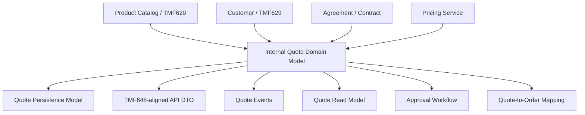
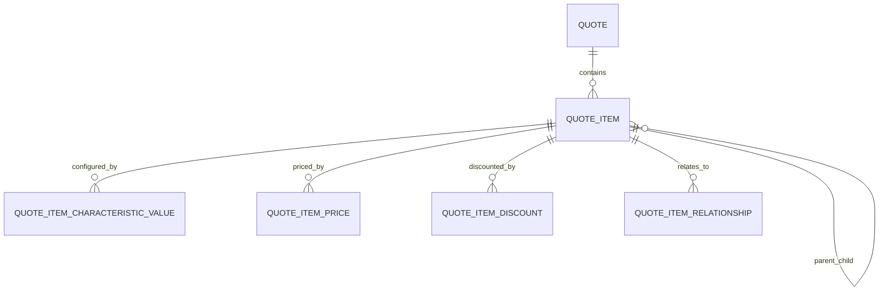
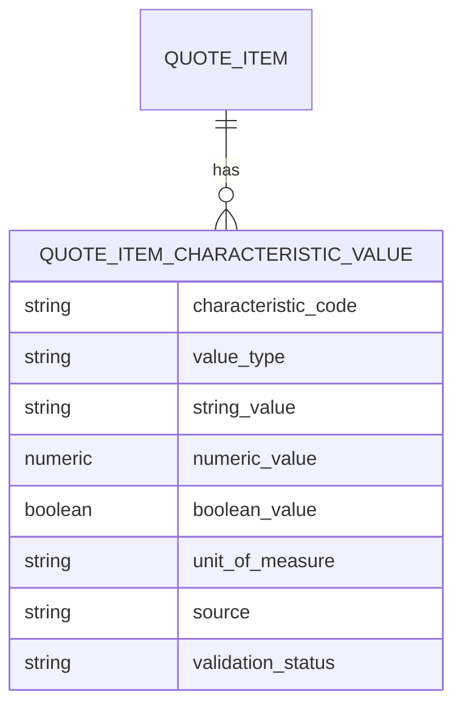
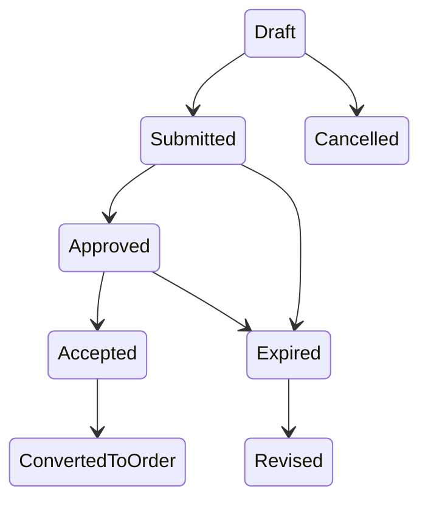
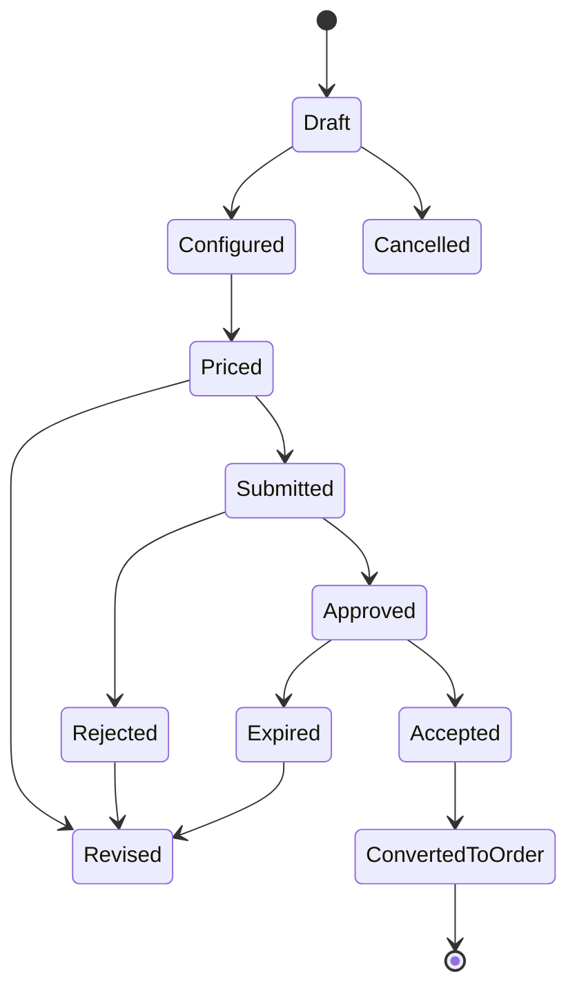
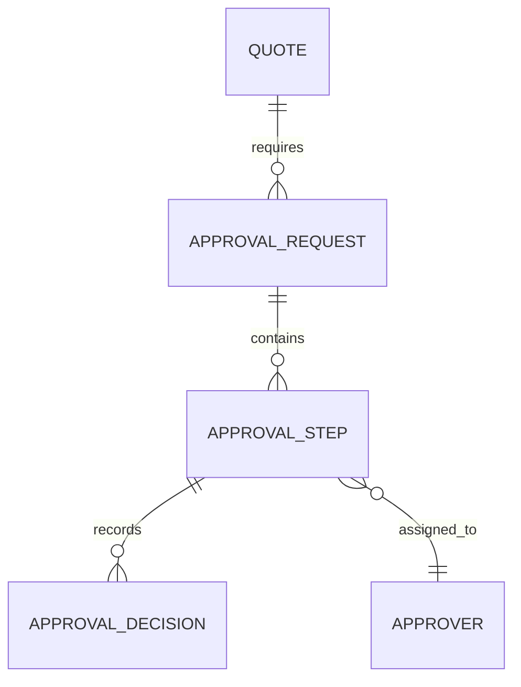
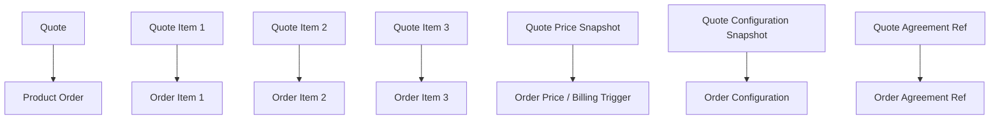

# TMF648 Quote Management Data Model

TMF648 Quote Management API memberi reference shape untuk customer quote management.

Tetapi untuk senior backend engineer, quote bukan hanya REST resource.

Quote adalah **commercial proposal state** yang mengikat customer context, product selection, configuration, price, discount, approval, validity, dan eventual conversion ke order.

Mindset yang benar:

```text
Quote is the commercial decision record before order execution.
```

TMF648 membantu menyamakan vocabulary dan API shape, tetapi internal system tetap harus mendesain:

- quote aggregate boundary,
- quote item structure,
- price snapshot,
- configuration snapshot,
- approval trace,
- lifecycle state machine,
- version/revision,
- quote expiry,
- quote-to-order mapping,
- idempotent conversion,
- auditability,
- event contract,
- reporting model,
- dan production failure recovery.

---

## 1. Core Mental Model

Quote menjawab pertanyaan:

```text
For this customer/account/context, what are we proposing to sell, at what configuration, price, terms, validity, and approval state?
```

Quote berada di antara product catalog dan product order.


Quote bukan sekadar shopping cart.

Quote adalah evidence untuk:

- apa yang ditawarkan,
- kapan ditawarkan,
- siapa customer/account/party-nya,
- harga dan discount yang disetujui,
- catalog version yang digunakan,
- configuration yang valid saat itu,
- approval yang diperlukan,
- expiry dan acceptance,
- dan dasar order creation.

### Quote as stateful commercial artifact

Quote biasanya melalui lifecycle:

```text
Draft -> Configured -> Priced -> Submitted -> Approved -> Accepted -> ConvertedToOrder
```

Dengan alternate path:

```text
Rejected, Cancelled, Expired, Revised
```

Hal yang harus dijaga:

```text
A quote must remain explainable after catalog, price, customer, or rules have changed.
```

---

## 2. TMF648 Position in the Model Stack

TMF648 biasanya muncul sebagai API/reference model di boundary pre-ordering.



Pemisahan penting:

| Model | Purpose |
|---|---|
| Quote Domain Model | Invariant, lifecycle, command handling |
| Quote Persistence Model | Tables, constraints, history, indexes |
| TMF648 API DTO | External/internal API contract shape |
| Quote Event Model | Integration and projection changes |
| Quote Snapshot Model | Frozen evidence for acceptance/conversion |
| Quote Read Model | Search, dashboard, approval queue, reporting |
| Quote-to-Order Mapping Model | Conversion traceability |

Jangan memaksakan TMF648 response object menjadi database entity.

---

## 3. Quote Header

Quote header adalah container utama.

Quote header menyimpan data yang berlaku untuk seluruh quote.

Contoh conceptual fields:

| Field | Purpose | Correctness Concern |
|---|---|---|
| quote_id | Internal stable ID | Internal reference |
| quote_number | Business/public identifier | Unique, human-readable |
| customer_ref | Customer context | Must be stable/snapshotted if needed |
| account_ref | Account/billing/service account context | Avoid ambiguity |
| related_party | Roles involved | Buyer, seller, approver, contact |
| sales_channel | Channel source | Pricing/eligibility impact |
| owner_user_id | Sales owner | Access/approval routing |
| currency | Quote currency | Price consistency |
| validity_period | Quote expiry | Acceptance guard |
| quote_state | Lifecycle state | Transition correctness |
| approval_status | Commercial approval state | Must not be conflated with quote state |
| version/revision | Revision control | Immutability and diff |
| source_opportunity | CRM/opportunity reference | External traceability |
| catalog_version | Catalog context | Historical correctness |
| price_summary | Derived total | Recalculation/snapshot policy |
| created/updated metadata | Audit | Actor/source/correlation |

### Quote header invariant examples

```text
A quote must have exactly one primary customer context.
A quote must have a currency before pricing is finalized.
An accepted quote must not be mutable except through revision/amendment process.
An expired quote cannot be accepted unless explicitly revived/revised.
A quote converted to order must retain source order mapping.
```

### Internal verification checklist

- Apakah quote punya internal ID dan business quote number?
- Apakah quote number unique per tenant/customer/channel atau global?
- Apakah customer/account distinction jelas?
- Apakah currency wajib sebelum pricing?
- Apakah quote state dan approval state dipisahkan?
- Apakah quote expiry enforced?
- Apakah quote revision/version ada?
- Apakah accepted quote immutable?
- Apakah quote punya source opportunity/CRM reference?

---

## 4. Quote Item

Quote item adalah unit komersial yang ditawarkan.

Quote item biasanya mereferensikan product offering dari catalog.

Quote item membawa:

- selected product offering,
- quantity,
- configuration,
- price,
- discount,
- tax estimate,
- action,
- site/location,
- parent-child relation,
- validation state,
- approval impact,
- order item mapping.

### Conceptual model



### Quote item fields

| Field | Purpose |
|---|---|
| quote_item_id | Internal item ID |
| quote_id | Parent quote |
| parent_quote_item_id | Bundle/component hierarchy |
| item_sequence | Display/order sequence |
| product_offering_ref | Catalog offering reference |
| product_offering_version | Stable version reference |
| product_specification_ref | Optional derived reference |
| action | Add/modify/disconnect/etc. |
| quantity | Quantity |
| site/location_ref | Site-specific quote context |
| state | Item lifecycle/validation state |
| validation_status | Config/pricing validation |
| price_summary | Item-level summary |

### Quote item vs quote line

Terminology differs across systems.

Possible interpretation:

| Term | Common Meaning |
|---|---|
| Quote Item | Domain unit that maps to product/order item |
| Quote Line | UI/commercial line; sometimes same as item, sometimes price line/detail |
| Price Item | Component of item price |
| Discount Item | Applied discount component |
| Tax Item | Estimated tax component |

Internal verification is mandatory because teams often use these terms differently.

### Internal verification checklist

- Apakah quote item dan quote line istilahnya sama atau berbeda?
- Apakah parent-child quote item mendukung bundle?
- Apakah item action ada?
- Apakah quote item menyimpan offering version/snapshot?
- Apakah quantity dan site/location dimodelkan?
- Apakah validation status item-level ada?
- Apakah item-level price breakdown ada?
- Apakah quote item mapping ke order item disimpan?

---

## 5. Related Party

Related party menunjukkan pihak-pihak yang berperan dalam quote.

Contoh role:

- customer,
- buyer,
- account owner,
- sales representative,
- reseller/partner,
- approver,
- billing contact,
- technical contact,
- legal contact,
- contracting party.

### Why related party matters

Related party memengaruhi:

- authority to request quote,
- approval routing,
- legal/commercial responsibility,
- contact notification,
- billing profile,
- order ownership,
- audit evidence.

### Party vs Customer vs Account

```text
Party = real-world individual or organization.
Customer = party in commercial customer role.
Account = financial/service relationship container.
RelatedParty = party reference with a role in this quote context.
```

### Common failure modes

- billing contact dipakai sebagai buyer,
- legal entity tidak sama dengan service user,
- approver disimpan sebagai free text,
- partner/reseller ownership hilang saat conversion,
- related party tidak versioned/snapshotted,
- old quote rusak saat contact/customer data berubah.

### Internal verification checklist

- Apakah related party role punya controlled vocabulary?
- Apakah quote customer, buyer, billing contact, legal contact dipisahkan?
- Apakah related party snapshot disimpan?
- Apakah quote approval routing memakai related party?
- Apakah related party ikut dibawa ke order?
- Apakah CRM/customer master update mengubah historical quote meaning?

---

## 6. Product Offering Reference

Quote item biasanya dibuat berdasarkan product offering.

Critical question:

```text
Does quote item reference current offering or a specific offering version/snapshot?
```

Untuk production correctness, quote item perlu stable reference.

### Reference patterns

| Pattern | Meaning | Risk |
|---|---|---|
| offering_id only | References current offering row | Mutable meaning risk |
| offering_id + version | Stable version reference | Need version lookup |
| deep snapshot | Full frozen product details | Storage and mapping complexity |
| mixed reference + snapshot | Practical compromise | Needs clear rules |

### Recommended principle

```text
Quote item should retain enough product/catalog data to explain the quote without relying on mutable current catalog state.
```

At minimum, consider storing:

- product offering ID/code,
- product offering name at quote time,
- product offering version,
- catalog version/release,
- product specification reference,
- selected characteristics,
- price version/reference,
- effective date used.

### Internal verification checklist

- Apakah quote item punya offering ID, code, dan version?
- Apakah offering name disnapshot?
- Apakah catalog release/version disimpan?
- Apakah product offering deletion/retirement aman untuk old quote?
- Apakah quote display memakai snapshot atau current catalog?
- Apakah conversion ke order memakai snapshot atau latest catalog?

---

## 7. Product Configuration

Product configuration adalah selected options dan characteristic values untuk quote item.

Configuration berasal dari catalog-driven rules tetapi quote harus menyimpan hasilnya.

### Definition vs selected value

```text
Catalog characteristic definition: Bandwidth allowed values = 500Mbps, 1Gbps, 10Gbps.
Quote configuration value: Bandwidth selected = 1Gbps.
```

### Configuration model



### Configuration snapshot

Quote should preserve:

- characteristic code/name,
- selected value,
- value type,
- unit of measure,
- catalog characteristic version,
- validation result,
- rule trace if needed,
- configuration errors/warnings.

### Failure modes

- selected value no longer allowed after catalog update,
- quote display changes because characteristic name changed,
- order decomposition lacks required technical characteristic,
- billing cannot map configurable option to charge,
- modify order cannot compare old vs new configuration.

### Internal verification checklist

- Apakah configuration disimpan structured atau JSONB?
- Apakah characteristic value typed?
- Apakah catalog characteristic version/reference disimpan?
- Apakah validation error/warning disimpan?
- Apakah configuration snapshot immutable setelah quote accepted?
- Apakah order receives configuration snapshot?
- Apakah billing/provisioning membutuhkan subset field tertentu?

---

## 8. Quote Price Model

Quote price adalah harga yang dihitung untuk quote context.

Quote price bukan sekadar copy product offering price.

Quote price dipengaruhi oleh:

- catalog price,
- customer segment,
- contract/agreement,
- selected configuration,
- quantity,
- site/location,
- term,
- discount,
- promotion,
- tax estimate,
- currency,
- effective date,
- approval policy.

### Price layers

| Layer | Meaning |
|---|---|
| Catalog Price | List/reference price from catalog |
| Calculated Price | Result of pricing engine |
| Quote Price | Price proposed to customer, possibly with discount |
| Approved Price | Price after approval decision |
| Order Price | Price carried into order |
| Billing Charge | Billable financial component |
| Invoice Line | Actual invoice record |

### Quote price breakdown

A robust quote item price model should capture:

- base/list price,
- recurring charge,
- one-time charge,
- usage charge estimate,
- discount amount/percentage,
- promotion reference,
- tax estimate,
- currency,
- price version,
- calculation timestamp,
- pricing rule trace,
- manual override indicator,
- approval requirement indicator.

### Price snapshot invariant

```text
Accepted quote price must be explainable without recalculating from current pricing rules.
```

### Internal verification checklist

- Apakah quote price dipisahkan dari catalog price?
- Apakah price breakdown disimpan?
- Apakah discount dan tax estimate dipisahkan?
- Apakah pricing rule trace ada?
- Apakah manual override ditandai?
- Apakah accepted quote price immutable?
- Apakah order carries quote price?
- Apakah billing receives quote/order price snapshot?

---

## 9. Agreement Reference

Quote dapat merujuk agreement/contract.

Agreement memengaruhi:

- eligible products,
- negotiated pricing,
- discount entitlement,
- contract term,
- renewal condition,
- SLA,
- billing terms,
- legal entity,
- termination fee,
- special commercial terms.

### Agreement modelling in quote

Quote tidak selalu perlu menyimpan full agreement copy, tetapi harus menyimpan reference/snapshot cukup untuk traceability.

Possible fields:

| Field | Purpose |
|---|---|
| agreement_id | Internal agreement reference |
| agreement_number | Business/legal reference |
| agreement_version | Stable version |
| agreement_term_ref | Specific term reference |
| commercial_term_snapshot | Relevant terms used in quote |
| discount_agreement_ref | Discount entitlement |
| contract_validity | Validity period |

### Invariant examples

```text
A quote cannot use an expired agreement unless business explicitly allows renewal/revision flow.
A quote using agreement-based discount must record the agreement version/term used.
An accepted quote must remain explainable even if the agreement is later amended.
```

### Internal verification checklist

- Apakah quote punya agreement reference?
- Apakah agreement version disimpan?
- Apakah agreement term/discount entitlement disnapshot?
- Apakah agreement validity dicek saat submit/accept?
- Apakah quote-to-order membawa agreement reference?
- Apakah billing memakai agreement terms?

---

## 10. Validity Period and Expiry

Quote validity period adalah batas waktu commercial offer berlaku.

Ini berbeda dari:

- catalog validity,
- price validity,
- contract term,
- subscription period,
- order requested date,
- billing period.

### Validity semantics

```text
Quote validity defines until when the customer may accept this commercial proposal.
```

Common fields:

- valid_from,
- valid_to,
- expiry_reason,
- expiry_policy,
- expired_at,
- expiry_job_id,
- extended_from_quote_id,
- extension_approval_ref.

### Expiry state flow



### Correctness concerns

- quote accepted after expiry,
- timezone boundary issue,
- expiry job misses quote,
- quote valid_to changed without audit,
- extension bypasses approval,
- expired quote converted to order.

### Internal verification checklist

- Apakah valid_from/valid_to timezone policy jelas?
- Apakah expiry enforced by API and job?
- Apakah expired quote cannot be accepted?
- Apakah extension flow ada?
- Apakah expiry transition diaudit?
- Apakah conversion checks expiry?

---

## 11. Quote State

Quote state merepresentasikan lifecycle commercial artifact.

Jangan campur quote state dengan:

- approval status,
- pricing status,
- validation status,
- payment status,
- order status,
- fulfillment status.

### Example state model



### State transition table example

| From | To | Guard | Side Effect |
|---|---|---|---|
| Draft | Configured | Required items valid | Save configuration snapshot |
| Configured | Priced | Pricing input complete | Create price snapshot |
| Priced | Submitted | Quote complete | Start approval if needed |
| Submitted | Approved | Approval passed | Freeze approved price |
| Approved | Accepted | Not expired | Freeze accepted quote |
| Accepted | ConvertedToOrder | Idempotency check passed | Create order + mapping |

### Internal verification checklist

- Apakah state transition eksplisit?
- Apakah illegal transition dicegah?
- Apakah state history disimpan?
- Apakah side effect transition jelas?
- Apakah concurrent transition ditangani?
- Apakah quote state dan approval state tidak dicampur?

---

## 12. Quote Item Action

Quote item action menjelaskan apa yang ingin dilakukan terhadap product.

Common actions:

- add,
- modify,
- disconnect,
- suspend,
- resume,
- change plan,
- upgrade,
- downgrade,
- move,
- renew.

### Why action matters

Action menentukan:

- required reference ke installed product,
- pricing behavior,
- eligibility rule,
- order item action,
- fulfillment task,
- billing trigger,
- inventory update.

### Add vs Modify vs Disconnect

| Action | Requires Product Inventory? | Typical Effect |
|---|---|---|
| Add | No | Create new product instance |
| Modify | Yes | Change existing product instance |
| Disconnect | Yes | Terminate product instance |
| Suspend | Yes | Temporarily disable service |
| Resume | Yes | Reactivate suspended service |
| Change Plan | Yes | Replace/modify offering/configuration |

### Invariant examples

```text
Modify/disconnect action must reference an existing active/suspendable product instance.
Add action must not reference existing product instance as target unless explicitly modelling replacement.
Action must be compatible with offering and current inventory state.
```

### Internal verification checklist

- Apakah quote item action ada?
- Apakah action enum aligned dengan order item action?
- Apakah modify/disconnect reference installed product?
- Apakah action compatibility divalidasi?
- Apakah pricing berbeda per action?
- Apakah action dibawa ke order item?

---

## 13. Quote Authorization and Approval

Quote approval adalah commercial governance process.

Approval biasanya dipicu oleh:

- discount melebihi threshold,
- margin rendah,
- non-standard term,
- special price override,
- risky customer segment,
- contract exception,
- product exception,
- channel-specific rule.

### Approval is not quote state

```text
Quote state = lifecycle of the quote.
Approval status = governance decision state.
```

Quote bisa `Submitted` dengan approval status `Pending`.
Quote bisa `Approved` setelah semua approval selesai.

### Approval data model



### Approval trace should capture

- approval rule that triggered,
- threshold exceeded,
- requested discount/margin,
- approver role/group,
- assigned approver,
- delegation if any,
- decision,
- comment/reason,
- timestamp,
- actor,
- correlation ID,
- before/after quote price.

### Internal verification checklist

- Apakah approval request dipisahkan dari quote?
- Apakah approval rule trace disimpan?
- Apakah approval decision immutable?
- Apakah delegation didukung?
- Apakah approval history cukup untuk audit?
- Apakah quote can be accepted only after required approvals?
- Apakah approval re-triggered after quote revision?

---

## 14. Quote-to-Order Conversion

Quote-to-order conversion adalah transformasi dari accepted quote menjadi executable order.

Ini harus idempotent dan auditable.

### Conversion mapping



### Conversion record

A robust model stores:

| Field | Purpose |
|---|---|
| conversion_id | Unique conversion attempt/reference |
| quote_id | Source quote |
| quote_version | Accepted version |
| order_id | Created order |
| idempotency_key | Duplicate prevention |
| conversion_status | Success/failed/partial |
| failure_reason | Debugging |
| started_at/completed_at | Operational tracking |
| correlation_id | Traceability |

### Invariant examples

```text
Only accepted quote can be converted.
Expired/cancelled/rejected quote cannot be converted.
A quote version should not create duplicate orders for the same idempotency key.
Order item must be traceable back to quote item.
```

### Internal verification checklist

- Apakah conversion punya idempotency key?
- Apakah quote-to-order mapping table ada?
- Apakah duplicate order dicegah?
- Apakah conversion failure disimpan?
- Apakah partial conversion mungkin?
- Apakah order item punya source quote item reference?
- Apakah conversion event diterbitkan?

---

## 15. API Model Mapping

TMF648-aligned API DTO harus dipisahkan dari internal persistence.

Possible mapping:

| TMF648-like Resource | Internal Model |
|---|---|
| Quote | quote_header + summary + related refs |
| QuoteItem | quote_item + config + price summary |
| RelatedParty | related_party table/snapshot |
| ProductOfferingRef | offering version/snapshot reference |
| Product | configured product representation |
| QuotePrice | quote item/header price breakdown |
| AgreementRef | agreement reference/snapshot |
| State | quote lifecycle state mapping |

### API contract concerns

- field names may follow TMF reference,
- internal field names may differ,
- extension fields must be intentional,
- nullability must be stable,
- enum values must be mapped carefully,
- pagination/search must not expose inefficient query pattern,
- PATCH semantics must preserve invariants.

### Java/JAX-RS implication

Recommended structure:

```text
QuoteResource
  -> QuoteApplicationService
      -> QuoteCommandHandler / QuoteDomainService
          -> QuoteRepository
          -> PricingClient
          -> CatalogClient
          -> ApprovalClient
          -> OrderClient
```

Avoid:

```text
QuoteResource directly manipulates quote tables and returns persistence entity.
```

### Internal verification checklist

- Apakah TMF648 DTO dipisahkan dari quote entity/table?
- Apakah enum mapping terdokumentasi?
- Apakah PATCH/update menjaga invariant?
- Apakah API response memakai snapshot atau current reference?
- Apakah API backward compatibility diuji?
- Apakah API extension fields jelas owner-nya?

---

## 16. Event Model Mapping

Quote lifecycle menghasilkan events.

Event umum:

- QuoteCreated,
- QuoteConfigured,
- QuotePriced,
- QuoteSubmitted,
- QuoteApprovalRequested,
- QuoteApproved,
- QuoteRejected,
- QuoteAccepted,
- QuoteExpired,
- QuoteCancelled,
- QuoteRevised,
- QuoteConvertedToOrder,
- QuoteConversionFailed.

### Event payload principles

Quote event harus membawa:

- event ID,
- event version,
- quote ID,
- quote number,
- quote version/revision,
- state before/after if lifecycle event,
- customer/account reference,
- correlation ID,
- causation ID,
- occurred at,
- source system,
- minimal business summary.

### Event example

```json
{
  "eventId": "...",
  "eventType": "QuoteAccepted",
  "eventVersion": 1,
  "quoteId": "...",
  "quoteNumber": "Q-2026-000123",
  "quoteRevision": 3,
  "customerId": "...",
  "accountId": "...",
  "acceptedAt": "2026-07-11T10:15:30Z",
  "validTo": "2026-07-31T23:59:59Z",
  "correlationId": "...",
  "causationId": "..."
}
```

### Event correctness concerns

- QuoteAccepted emitted before DB commit,
- QuoteConvertedToOrder emitted twice,
- event lacks quote revision,
- out-of-order QuoteRevised arrives after QuoteAccepted,
- consumer assumes event payload is full snapshot,
- event schema changes break consumers,
- quote projection stale.

### Internal verification checklist

- Apakah quote events ada?
- Apakah event emitted via outbox?
- Apakah event punya quote version/revision?
- Apakah state before/after disimpan?
- Apakah consumer idempotent?
- Apakah event schema versioned?
- Apakah event digunakan untuk reporting/read model?

---

## 17. PostgreSQL Implementation Considerations

Possible physical model:

```text
quote
quote_version
quote_item
quote_item_characteristic_value
quote_item_price
quote_item_discount
quote_item_tax
quote_related_party
quote_agreement_ref
quote_state_history
quote_approval_ref
quote_conversion
quote_order_mapping
quote_audit_event
quote_outbox_event
```

### Constraint examples

```sql
-- Example only. Verify against actual internal schema conventions.
unique (tenant_id, quote_number)
check (valid_to is null or valid_to > valid_from)
unique (quote_id, revision)
unique (quote_id, idempotency_key) -- for conversion if scoped this way
```

### Index candidates

| Query Pattern | Index Candidate |
|---|---|
| quote by number | `(tenant_id, quote_number)` |
| quotes by customer | `(tenant_id, customer_id, created_at desc)` |
| approval queue | `(tenant_id, approval_status, updated_at)` |
| expiry job | `(quote_state, valid_to)` |
| quote search by owner/status | `(tenant_id, owner_user_id, quote_state, updated_at)` |
| conversion lookup | `(quote_id, quote_revision, conversion_status)` |
| audit by correlation | `(correlation_id)` |

### Snapshot storage

Snapshot can be stored as:

- normalized version tables,
- immutable quote revision tables,
- JSONB snapshot for external references,
- audit/change-history tables,
- hybrid normalized + JSONB evidence.

Principle:

```text
Core fields that drive lifecycle/query/reporting should not be hidden only in JSONB.
```

### Internal verification checklist

- Apakah quote table terlalu wide?
- Apakah quote item/price/config normalized?
- Apakah snapshot versioning jelas?
- Apakah expiry query indexed?
- Apakah approval queue query indexed?
- Apakah conversion idempotency constrained?
- Apakah audit/event tables partitioned jika besar?

---

## 18. MyBatis/JPA/JDBC Implications

Quote model sering kompleks karena nested item, price breakdown, config values, related parties, dan approval references.

### Common traps

| Trap | Impact |
|---|---|
| Loading full quote graph for every search | Slow list/search API |
| Updating quote item tree by replace-all | Accidental data loss |
| No optimistic locking on quote revision | Lost update |
| Entity reused as DTO | Contract coupling |
| Price recalculated on read | Historical inconsistency |
| JSONB config with no validation | Invalid order payload |

### Safer patterns

- command-based update,
- explicit quote aggregate loading for write use cases,
- projection/read model for list/search,
- optimistic locking on quote revision,
- immutable accepted quote snapshot,
- dedicated mapper for TMF648 DTO,
- separate queries for price/config/approval when needed,
- transactional outbox for lifecycle events.

### Internal verification checklist

- Apakah repository membedakan write aggregate dan read projection?
- Apakah quote revision memakai optimistic lock?
- Apakah update quote item tree aman?
- Apakah price dihitung saat command, bukan diam-diam saat read?
- Apakah mapper memisahkan entity dan DTO?
- Apakah MyBatis/JPA query menyebabkan N+1?

---

## 19. Reporting and Read Model Implications

Quote reporting umum:

- quote pipeline,
- quote conversion rate,
- average quote value,
- discount by approver/product/customer,
- quote aging,
- quote expiry risk,
- approval SLA,
- win/loss analysis,
- quote-to-order fallout,
- price override frequency.

### Read model examples

```text
quote_search_view
quote_pipeline_projection
approval_queue_projection
quote_item_product_projection
quote_conversion_fact
```

### Reporting fields to preserve

- quote number,
- customer/account,
- owner,
- channel,
- quote state,
- approval status,
- created/submitted/approved/accepted/expired timestamps,
- total one-time charge,
- total recurring charge,
- discount amount/percentage,
- catalog version,
- product family/category,
- converted order reference.

### Internal verification checklist

- Apakah quote lifecycle timestamps disimpan?
- Apakah quote state history tersedia untuk funnel metrics?
- Apakah quote item product dimension versioned?
- Apakah quote value snapshot digunakan untuk reporting?
- Apakah approval aging dapat dihitung?
- Apakah quote-to-order conversion metric tersedia?

---

## 20. Auditability and Change History

Quote adalah commercial evidence. Audit trail harus kuat.

Audit harus menjawab:

```text
Who changed what, when, why, under what business action, from what source, with what approval, and what price/configuration was affected?
```

### Audit event examples

- quote created,
- item added/removed,
- configuration changed,
- price recalculated,
- discount overridden,
- submitted for approval,
- approved/rejected,
- validity extended,
- quote accepted,
- quote revised,
- quote converted to order.

### Audit record should include

- actor,
- action,
- target entity,
- before/after values,
- reason/comment,
- source system,
- correlation ID,
- causation ID,
- timestamp,
- quote revision,
- approval reference.

### Internal verification checklist

- Apakah quote audit event ada?
- Apakah before/after value disimpan untuk critical fields?
- Apakah price/discount changes audited?
- Apakah approval trace linked ke quote revision?
- Apakah correlation ID tersedia end-to-end?
- Apakah audit immutable?

---

## 21. Security and Privacy Concerns

Quote mengandung data sensitif:

- customer identity,
- commercial price,
- discount,
- margin/profitability,
- contract/agreement reference,
- contact information,
- site/location,
- internal approval comments,
- competitive pricing notes,
- credit/commercial risk signals.

### Access model

Quote access bisa bergantung pada:

- tenant,
- sales team,
- owner,
- customer/account assignment,
- role/permission,
- approval authority,
- commercial sensitivity,
- geographic/business unit boundary.

### Security failure modes

- sales rep melihat quote customer lain,
- approver melihat margin tanpa authority,
- exported quote membuka internal cost,
- API response exposes approval comments,
- search index tidak menerapkan tenant/security filter,
- audit log menyimpan PII tanpa retention/masking.

### Internal verification checklist

- Apakah quote access tenant-aware?
- Apakah owner/team-based visibility diterapkan?
- Apakah margin/cost fields protected?
- Apakah export/print quote berbeda dari internal API?
- Apakah search index aman?
- Apakah PII retention/masking policy jelas?

---

## 22. Failure Modes

Common quote data failure modes:

| Failure Mode | Cause | Detection |
|---|---|---|
| Duplicate quote | Retry without idempotency | Duplicate external/opportunity/request key |
| Accepted expired quote | Missing expiry guard | accepted_at > valid_to query |
| Price mismatch | Recalculation from latest price | Compare quote snapshot vs price version |
| Catalog mismatch | Mutable catalog reference | Quote offering version missing |
| Invalid configuration | Rule not enforced or stale config | Validation status/error query |
| Approval bypass | State transition without approval guard | Approved/accepted with missing approval decision |
| Duplicate order | Conversion retry unsafe | Multiple orders for same quote revision |
| Lost update | Concurrent edits without revision lock | Revision conflict/audit gap |
| Audit gap | Direct DB update/no audit | Critical changes without audit event |
| Stale read model | Projection lag | Read model freshness metric |

---

## 23. Debugging Quote Data Issues

When debugging quote issue, use lifecycle trace.

### Diagnostic questions

```text
Which quote revision is relevant?
Which catalog version was used?
Which product offering version was selected?
Which configuration values were selected?
Which price version/rules were used?
Was the quote expired when accepted?
Was approval required and completed?
Was the quote revised after approval?
Was the accepted quote converted more than once?
Did read model/search show stale state?
```

### Diagnostic data trail

Follow this order:

1. quote header,
2. quote revision/version,
3. quote state history,
4. quote item tree,
5. configuration snapshot,
6. price snapshot,
7. discount/approval trace,
8. agreement reference,
9. conversion record,
10. order mapping,
11. outbox/event log,
12. read model projection.

---

## 24. PR Review Checklist

When reviewing a quote data model PR, ask:

### Entity and lifecycle

- Is this quote header, item, price, configuration, approval, or conversion data?
- Is the lifecycle state impacted?
- Are illegal transitions prevented?
- Is quote revision/version handled?

### Snapshot and correctness

- Does accepted quote remain immutable?
- Does the change preserve historical catalog/price/config meaning?
- Does quote-to-order mapping remain traceable?
- Does expiry still work?

### API/event

- Does TMF648 DTO contract change?
- Is backward compatibility preserved?
- Are event schemas updated/versioned?
- Are consumers affected?

### Persistence and performance

- Are constraints sufficient?
- Are indexes aligned with search/queue/expiry patterns?
- Is migration safe for existing quotes?
- Is JSONB used responsibly?

### Operations and audit

- Is audit trail updated?
- Is read model projection updated?
- Is cache invalidation needed?
- Is reporting impacted?
- Is data repair/reconciliation possible?

---

## 25. Internal Verification Checklist

Gunakan checklist ini untuk mempelajari quote model internal.

### Codebase

- Temukan quote service/module.
- Temukan quote aggregate/domain classes.
- Temukan quote JAX-RS resources/controllers.
- Temukan quote command handlers.
- Temukan pricing/catalog/customer/agreement clients.
- Temukan quote-to-order conversion code.

### Database schema

- Temukan quote header table.
- Temukan quote item table.
- Temukan quote price/discount/tax tables.
- Temukan configuration value storage.
- Temukan quote state history.
- Temukan quote approval references.
- Temukan quote conversion/order mapping.
- Temukan audit/history/outbox tables.

### API contract

- Cek apakah API TMF648-aligned.
- Cek enum state mapping.
- Cek update/PATCH semantics.
- Cek extension fields.
- Cek API versioning and contract tests.

### Events

- Cek QuoteCreated/Submitted/Approved/Accepted/Converted events.
- Cek event versioning.
- Cek outbox pattern.
- Cek projection consumers.
- Cek idempotency handling.

### Business/process

- Tanya BA/PO: quote lifecycle business semantics.
- Tanya senior engineer: accepted quote immutability policy.
- Tanya solution architect: TMF648 alignment level.
- Tanya DBA: quote query hotspots.
- Tanya support/ops: frequent quote production issues.

---

## 26. Summary

TMF648 membantu memberi reference model untuk quote management, tetapi production-grade quote model harus lebih dalam daripada API shape.

Quote data model harus menjaga:

- customer/account context,
- product offering reference,
- configuration snapshot,
- price snapshot,
- discount and approval trace,
- validity and expiry,
- lifecycle state machine,
- version/revision,
- quote-to-order mapping,
- auditability,
- security,
- reporting readiness,
- dan failure recovery.

Core takeaway:

```text
A quote is not just a proposal document.
It is a versioned, stateful, auditable commercial evidence object that becomes the source for order execution.
```
