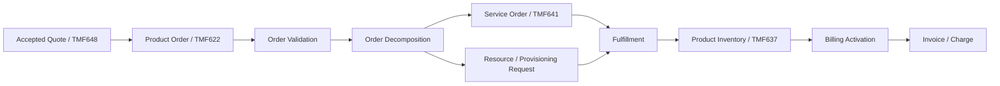
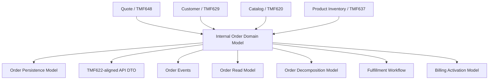
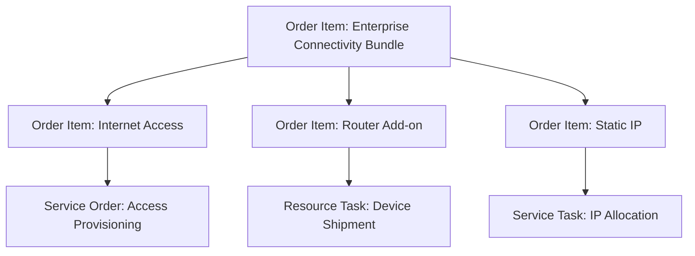
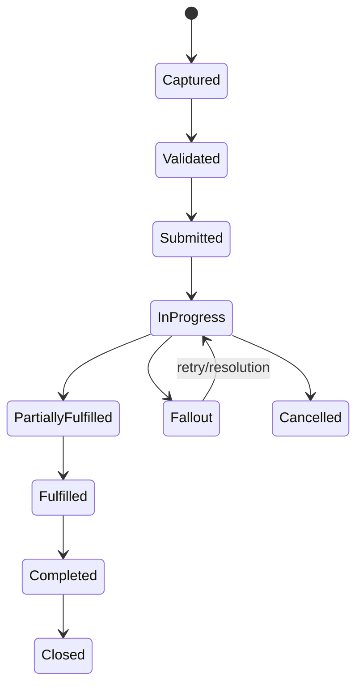
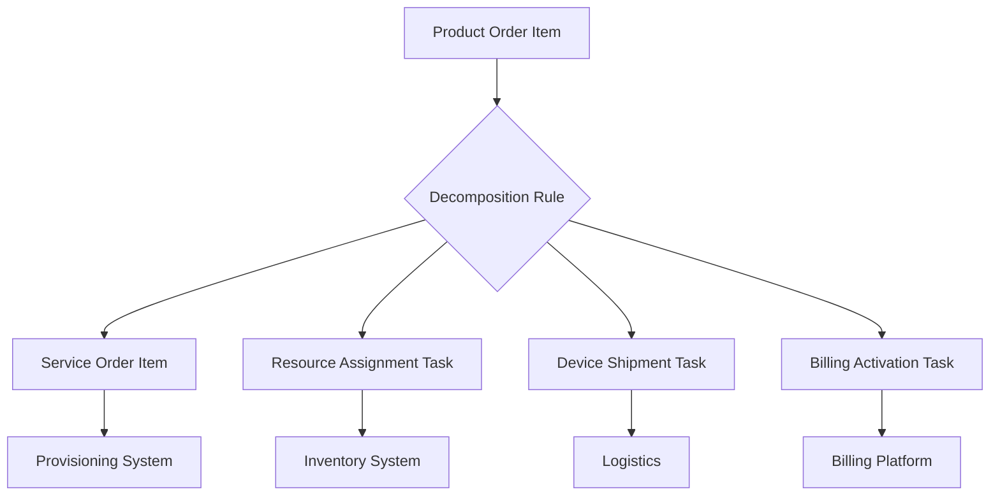
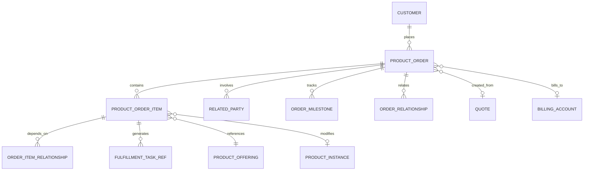
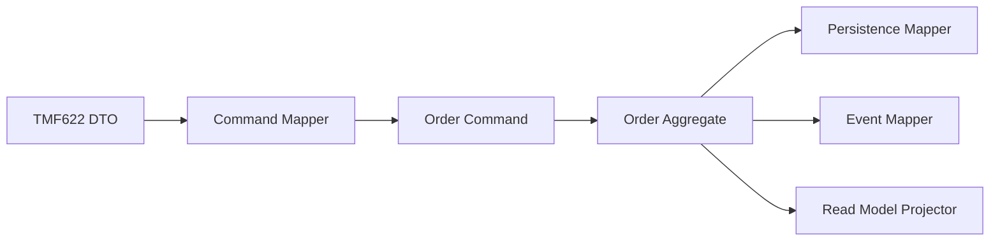

# TMF622 Product Ordering Data Model

TMF622 Product Ordering API memberi reference shape untuk **product order management**.

Dalam sistem CPQ, quote management, telco BSS/OSS, dan quote-to-cash, product order bukan sekadar record transaksi.

Product order adalah **execution commitment**: instruksi formal untuk memenuhi commercial commitment yang biasanya berasal dari quote, cart, CRM opportunity, migration request, service desk request, atau external ordering channel.

Mindset yang benar:

```text
A product order is not just what the customer wants.
A product order is what the enterprise has accepted to execute, track, fulfill, reconcile, and possibly bill.
```

TMF622 membantu menyamakan vocabulary dan API boundary, tetapi internal enterprise system tetap harus mendesain:

- aggregate boundary order,
- order item tree,
- action semantics,
- state machine,
- item dependency,
- milestone,
- decomposition,
- fulfillment reference,
- billing trigger,
- amendment/cancellation/retry,
- idempotency,
- audit trail,
- event contract,
- reporting/read model,
- reconciliation model,
- dan production recovery model.

Jangan menganggap TMF622 sebagai physical database schema.

TMF622 adalah reference contract. Internal schema harus tetap mengikuti data ownership, lifecycle invariant, performance pattern, migration discipline, dan auditability requirement sistem Anda.

---

## 1. Core Mental Model

Product order menjawab pertanyaan:

```text
For this customer/account/context, what product changes must be executed, in what order, under what constraints, with what fulfillment and billing consequences?
```

Dalam quote-to-cash, order berada setelah commercial agreement/quote dan sebelum fulfillment, inventory update, billing activation, dan assurance.



Product order harus memuat cukup data untuk menjawab:

- order ini berasal dari mana,
- customer/account mana yang terkena dampak,
- produk apa yang diminta,
- action apa yang dilakukan,
- item mana bergantung pada item mana,
- fulfillment mana yang harus dijalankan,
- apakah order sudah layak masuk billing,
- apakah order boleh diubah/dibatalkan,
- dan bagaimana membuktikan riwayat eksekusinya.

---

## 2. TMF622 Position in the Model Stack

TMF622 biasanya berada pada API/integration boundary order management.



Pemisahan penting:

| Model | Purpose |
|---|---|
| Order Domain Model | Command handling, invariant, lifecycle, action semantics |
| Order Persistence Model | Tables, constraints, indexes, history, state storage |
| TMF622 API DTO | External/internal API contract shape |
| Order Event Model | Publish perubahan order ke downstream/read model |
| Order Decomposition Model | Mapping product order item ke service/resource task |
| Fulfillment Model | Execution tracking, fallout, retry, manual intervention |
| Billing Activation Model | Data yang memicu charge/subscription/billing account update |
| Reporting Model | Aging, SLA, funnel, stuck order, fallout metrics |

Rule utama:

```text
API shape is not aggregate shape.
Aggregate shape is not table shape.
Table shape is not reporting shape.
```

---

## 3. Product Order as Aggregate

Product order biasanya aggregate root untuk lifecycle ordering.

Contoh aggregate boundary:

```text
ProductOrder
  - OrderHeader
  - OrderItems
  - OrderRelationships
  - RelatedParties
  - BillingAccountReference
  - Milestones
  - StateHistory
  - SourceReferences
```

Tetapi order aggregate tidak harus memiliki seluruh data customer, catalog, billing, atau inventory.

Ia biasanya menyimpan:

- reference,
- snapshot minimal,
- execution state,
- mapping result,
- dan audit evidence.

### Data yang biasanya direferensikan

| Data | Biasanya Disimpan Sebagai | Alasan |
|---|---|---|
| Customer | Reference + optional snapshot | Customer master owned elsewhere |
| Product offering | Reference to version/snapshot | Catalog can change |
| Product specification | Reference/snapshot | Needed for decomposition |
| Billing account | Reference | Billing ownership elsewhere |
| Source quote | Reference + conversion metadata | Traceability |
| Price | Snapshot/carry-over reference | Billing and audit impact |
| Product inventory | Reference for modify/disconnect | Installed base source |
| Service order | Generated downstream reference | OSS/workflow ownership |

### Aggregate invariant examples

```text
A product order must have at least one order item.
A product order item must have an action.
An order item with action=modify/disconnect must reference an existing product instance.
An order cannot be completed while any mandatory item is unresolved.
An order cannot be submitted without required customer/account context.
An order cannot trigger billing activation before required fulfillment completion evidence exists.
```

---

## 4. Product Order Header

Order header menyimpan data yang berlaku untuk seluruh order.

Contoh conceptual fields:

| Field | Purpose | Correctness Concern |
|---|---|---|
| order_id | Internal stable ID | Internal persistence reference |
| order_number | Business/public ID | Human-readable, unique |
| source_quote_id | Link ke accepted quote | Traceability |
| external_order_id | External system reference | Idempotency/reconciliation |
| customer_ref | Customer context | Stable enough for lifecycle |
| account_ref | Commercial/service account | Avoid ambiguous ownership |
| billing_account_ref | Billing responsibility | Billing activation |
| order_state | Header lifecycle | Must be derived/guarded correctly |
| fulfillment_state | Execution summary | Do not conflate with order state blindly |
| requested_completion_date | Customer/requested date | SLA planning |
| committed_completion_date | Enterprise commitment | SLA tracking |
| priority | Fulfillment priority | Queue handling |
| channel | Source channel | Policy/pricing/validation impact |
| related_party | Roles | Customer, owner, contact, seller |
| created/updated metadata | Audit | Actor/source/correlation |

Order header harus stabil tetapi tidak menjadi dumping ground.

Data item-level tetap harus berada di order item.

### Header invariant examples

```text
An order must have exactly one primary customer or customer account context.
An order created from a quote must retain source quote reference.
A submitted order must have a valid order number.
A completed order must have completion timestamp.
A cancelled order must have cancellation reason.
```

---

## 5. Product Order Item

Order item adalah unit utama eksekusi.

Order item menjawab:

```text
What exactly must be added, modified, disconnected, suspended, resumed, or otherwise changed?
```

Contoh fields:

| Field | Purpose | Correctness Concern |
|---|---|---|
| order_item_id | Stable item ID | Used by workflow/decomposition |
| product_order_id | Parent order | Aggregate link |
| parent_order_item_id | Bundle/tree relation | Dependency and hierarchy |
| item_sequence | Human/order display | Stable display/debugging |
| action | Add/modify/delete/suspend/resume/etc | Drives validation and fulfillment |
| product_offering_ref | Commercial product | Catalog version concern |
| product_spec_ref | Product spec | Decomposition concern |
| product_instance_ref | Installed product | Required for modify/disconnect |
| quantity | Number of units | Compatibility with offering |
| location/site_ref | Site-specific execution | Serviceability/pricing impact |
| item_state | Item lifecycle | Can differ from header state |
| validation_state | Valid/invalid/pending | Prevents bad submission |
| fulfillment_task_ref | Execution link | Traceability |
| billing_trigger_state | Billing readiness | Prevent premature billing |

### Item tree example



Tree modelling matters because:

- bundle component may depend on parent,
- optional add-on may fail independently,
- billing may start only for completed components,
- cancellation may cascade differently per component,
- reporting needs item-level aging/fallout,
- decomposition needs explicit parent-child context.

---

## 6. Product Action Semantics

Action is not a label. Action changes validation, inventory reference, fulfillment path, billing impact, and allowed state transition.

Common actions:

| Action | Meaning | Data Requirement |
|---|---|---|
| add | Add new product instance | Product offering/spec/config |
| modify | Change existing product | Existing product instance + delta |
| disconnect | Terminate product | Existing active product instance |
| suspend | Temporarily stop service | Existing active product/service |
| resume | Resume suspended service | Existing suspended product/service |
| cancel | Cancel pending order/item | Existing order/item not terminal |
| amend | Change in-flight order | Previous order reference |
| move | Move service/location | Existing product + old/new location |
| changePlan | Replace offering/plan | Existing product + target offering |
| upgrade/downgrade | Specific commercial change | Compatibility with current inventory |

### Action invariant examples

```text
ADD must not require existing product inventory reference.
MODIFY must require existing product inventory reference.
DISCONNECT must target an active or suspendable product instance.
RESUME must target a suspended product instance.
MOVE must include valid source and target site/location context.
CHANGE_PLAN must preserve billing/account continuity or define explicit transfer behavior.
```

Bad action modelling causes downstream ambiguity.

Common smell:

```text
All order items use action = ADD, while modification/disconnect semantics are hidden in custom attributes.
```

That makes validation, reporting, billing, inventory update, and reconciliation fragile.

---

## 7. Related Party and Role Modelling

TMF-style models often use `relatedParty` to capture parties involved in a resource.

For product order, related parties may include:

- customer,
- buyer,
- requestor,
- technical contact,
- billing contact,
- sales owner,
- approver,
- partner/reseller,
- service recipient,
- account manager.

Important modelling rule:

```text
Party role is not the same as party identity.
```

The same organization/person can appear with different roles.

Example:

| Party | Role | Meaning |
|---|---|---|
| ACME Ltd | Customer | Commercial customer |
| ACME Singapore | Service recipient | Site/service user |
| Jane Doe | Technical contact | Fulfillment contact |
| John Doe | Buyer | Commercial requestor |
| Partner X | Reseller | Sales channel partner |

### Internal verification checklist

- Apakah related party hanya menyimpan ID, atau juga snapshot nama/contact?
- Apakah role enum jelas?
- Apakah buyer, payer, service user, dan technical contact dibedakan?
- Apakah billing contact diambil dari billing account atau order payload?
- Apakah privacy/PII handling jelas?

---

## 8. Billing Account Reference

Billing account reference pada order adalah salah satu field paling berbahaya jika dimodelkan asal.

Billing account menentukan:

- siapa yang akan ditagih,
- cycle billing,
- invoice preference,
- tax profile,
- payment method,
- currency,
- credit profile,
- dan billing responsibility.

Order item bisa memiliki billing account yang sama dengan header atau berbeda jika mendukung multi-account/multi-site billing.

### Design options

| Option | Use Case | Risk |
|---|---|---|
| Header-level billing account only | Simple order | Tidak cukup untuk multi-site/multi-payer |
| Item-level billing account | Complex enterprise | Lebih kompleks untuk validation |
| Header default + item override | Practical compromise | Butuh clear inheritance rule |

### Billing invariant examples

```text
A billable order item must resolve to exactly one billing account before billing activation.
Billing account currency must be compatible with order/price currency or have explicit conversion policy.
Billing activation must not happen for cancelled or failed mandatory item.
```

---

## 9. Order State vs Order Item State

Header state dan item state tidak selalu sama.

Order bisa `InProgress` sementara beberapa item:

- completed,
- pending,
- failed,
- cancelled,
- waiting manual intervention,
- waiting dependency,
- billing pending.



### Header state derivation

A robust model defines how header state is derived or updated.

Example policy:

```text
If all mandatory items are completed -> order can be Fulfilled.
If any mandatory item is in Fallout -> order may be Fallout or InProgressWithFallout.
If optional item fails but policy allows continuation -> order may be PartiallyFulfilled.
If billing activation succeeds for all billable completed items -> order can move toward Completed.
```

Avoid vague state names like:

```text
PROCESSING
DONE
ERROR
```

They do not encode lifecycle meaning.

---

## 10. Milestone Model

Milestone records important progress points.

Milestones are useful because order state alone is too coarse.

Examples:

- order submitted,
- validation completed,
- decomposition completed,
- service order created,
- resource assigned,
- provisioning started,
- provisioning completed,
- customer appointment scheduled,
- installation completed,
- inventory updated,
- billing activated,
- order closed.

### Milestone table concept

| Column | Purpose |
|---|---|
| milestone_id | Stable ID |
| order_id | Header reference |
| order_item_id | Optional item reference |
| milestone_type | Business milestone |
| status | Pending/completed/failed/skipped |
| planned_at | Expected time |
| completed_at | Actual completion |
| source_system | Origin |
| evidence_ref | Proof/document/link |
| correlation_id | Traceability |

Milestones support:

- SLA reporting,
- operational dashboard,
- customer status tracking,
- fallout diagnosis,
- billing readiness,
- audit evidence.

---

## 11. Order Relationship Model

Orders may relate to other orders.

Examples:

| Relationship | Meaning |
|---|---|
| sourceQuote | Order created from quote |
| amendmentOf | Order amends another order |
| cancellationOf | Order cancels previous order/order item |
| supersedes | New order replaces previous order |
| dependsOn | Order depends on another order |
| followUpOf | Order created as follow-up/correction |
| splitFrom | Order split from larger order |
| mergedInto | Order merged into combined order |

Relationship model matters because production rarely follows happy path.

### Relationship invariant examples

```text
An amendment order must reference the order it amends.
A cancellation order must specify cancellation target and scope.
A superseded order must not be treated as current active execution source.
Circular order dependency must be rejected.
```

---

## 12. Order Decomposition Awareness

Product order is commercial/product-facing.

Fulfillment often requires decomposition into:

- service order,
- resource order,
- provisioning request,
- shipping task,
- installation task,
- activation task,
- billing task,
- assurance task.



Product order item should not contain all downstream technical details.

But it must retain enough reference to trace execution.

Useful decomposition fields:

- decomposition status,
- decomposition version/rule reference,
- downstream order/task references,
- dependency graph ID,
- decomposition error,
- retry attempt,
- generated_at,
- correlation ID.

---

## 13. Fallout Model

Fallout is not just error logging.

Fallout is a business/operations state where order cannot continue automatically.

A useful fallout record captures:

| Field | Purpose |
|---|---|
| fallout_id | Stable ID |
| order_id/order_item_id | Scope |
| task_ref | Fulfillment task link |
| fallout_type | Validation/provisioning/billing/inventory/integration |
| fallout_reason_code | Controlled taxonomy |
| error_message | Human diagnostic |
| source_system | Where failure came from |
| retryable | Whether auto retry is allowed |
| resolution_owner | Team/person/system |
| resolution_status | Open/in-progress/resolved/waived |
| resolved_at | Closure time |
| repair_action_ref | Evidence of repair |

### Fallout modelling principle

```text
If production support cannot decide what to do from the data, the fallout model is incomplete.
```

---

## 14. Conceptual Model

Conceptual ERD:



Important: this is conceptual, not final physical schema.

The actual internal schema may split by service ownership or bounded context.

---

## 15. Logical Model

A logical model could use entities like:

```text
product_order
product_order_item
product_order_related_party
product_order_relationship
product_order_item_relationship
product_order_milestone
product_order_state_history
product_order_external_reference
product_order_decomposition_ref
product_order_fallout
```

### Logical relationship examples

| Entity | Relationship |
|---|---|
| product_order | has many product_order_item |
| product_order_item | optionally has parent product_order_item |
| product_order | has many related party roles |
| product_order | has many milestones |
| product_order_item | has many dependencies |
| product_order_item | may target product inventory instance |
| product_order | may originate from quote |
| product_order | may have many external references |

### Logical modelling concern

Do not make one table with every possible field:

```text
order(id, product_json, customer_json, billing_json, workflow_json, status, error_json, ...)
```

That might move fast initially, but it destroys:

- constraint enforcement,
- queryability,
- auditability,
- reporting,
- migration safety,
- and debugging clarity.

---

## 16. Physical PostgreSQL Considerations

PostgreSQL design depends on actual scale and access patterns, but typical concerns include:

### Primary key

Use stable internal ID:

```sql
order_id uuid primary key
```

or sequence/identity depending on internal convention.

### Business key

Use business order number separately:

```sql
order_number text not null unique
```

Never expose internal DB surrogate key if public/business ID must remain stable across migration.

### State constraints

Use controlled enum/check/reference table depending on governance.

Example:

```sql
order_state text not null
```

with check constraint or reference table.

### Index examples

```text
(order_number)
(customer_id, created_at desc)
(order_state, updated_at)
(billing_account_id, created_at desc)
(source_quote_id)
(external_order_id, source_system)
```

For item-level operations:

```text
(product_order_id)
(parent_order_item_id)
(product_instance_id)
(item_state, updated_at)
(action, item_state)
```

### JSONB usage

JSONB may be useful for:

- raw external payload retention,
- flexible characteristic snapshot,
- diagnostic metadata,
- non-query-heavy extension attributes.

But avoid JSONB for:

- lifecycle state,
- action,
- item dependency,
- billing account reference,
- customer reference,
- order number,
- fields used by queues/reports/reconciliation.

---

## 17. API Model Mapping

TMF622-aligned API model can expose:

- id,
- href,
- externalId,
- priority,
- category,
- description,
- requestedStartDate/requestedCompletionDate,
- expectedCompletionDate,
- completionDate,
- state,
- productOrderItem,
- relatedParty,
- billingAccount,
- orderRelationship,
- note,
- milestone.

Internal mapping should be explicit.



### API mapping rules

```text
External DTO can be permissive.
Internal command must be strict.
Persistence model must be constraint-aware.
Event model must be consumer-safe.
```

Do not let API extension fields bypass invariant validation.

---

## 18. Event Model Mapping

Order events should express meaningful lifecycle changes.

Examples:

- ProductOrderCreated
- ProductOrderValidated
- ProductOrderSubmitted
- ProductOrderDecomposed
- ProductOrderItemStateChanged
- ProductOrderMilestoneCompleted
- ProductOrderFalloutRaised
- ProductOrderFalloutResolved
- ProductOrderCancelled
- ProductOrderCompleted
- ProductOrderBillingActivationRequested

Event envelope should include:

| Field | Purpose |
|---|---|
| event_id | Deduplication |
| event_type | Routing/consumer behavior |
| event_version | Compatibility |
| aggregate_id | Order ID |
| aggregate_type | ProductOrder |
| occurred_at | Event time |
| correlation_id | Trace across quote/order/fulfillment/billing |
| causation_id | Previous event/command |
| source_service | Ownership |
| payload | Event data |

### Event payload principle

```text
Publish enough to let consumers react safely, but not so much that event becomes a shared database row.
```

For example, billing activation event may need:

- order ID,
- order item ID,
- product instance reference,
- billing account reference,
- charge/price snapshot reference,
- activation date,
- currency,
- source quote/order context.

It does not need every internal column.

---

## 19. Java/JAX-RS Backend Implications

In Java/JAX-RS/Jakarta RESTful services, avoid letting resource classes contain domain logic.

Typical separation:

```text
ProductOrderResource
  -> ProductOrderApplicationService
    -> ProductOrderCommandHandler
      -> ProductOrderAggregate / Domain Service
        -> ProductOrderRepository
        -> EventPublisher / Outbox
```

### Common anti-patterns

```text
JAX-RS DTO directly persisted as JPA entity.
Order status updated by multiple services without transition guard.
Action validation split across controllers, mappers, and database triggers with no central invariant.
External payload accepted and stored without normalizing business keys.
```

### Recommended modelling discipline

- DTO validates syntactic shape.
- Command validates intent.
- Aggregate/domain service validates lifecycle invariant.
- Repository persists state atomically.
- Outbox records event in same transaction.
- Projection updates read model asynchronously.

---

## 20. MyBatis, JPA, and JDBC Considerations

### MyBatis

Good for explicit SQL and complex query/read model.

Risks:

- mapper drift from schema,
- manual relationship mapping bugs,
- missing optimistic lock checks,
- partial updates bypassing invariant.

Use MyBatis carefully for:

- order search,
- dashboard queries,
- reconciliation queries,
- batch repair/backfill,
- projection queries.

### JPA

Good for aggregate persistence if boundaries are disciplined.

Risks:

- accidental lazy loading,
- huge object graph,
- cascade side effects,
- entity equals/hashCode bugs,
- implicit dirty update of immutable/snapshotted data.

Avoid mapping entire order graph as one always-loaded entity if order item count is large.

### JDBC

Useful for:

- high-control writes,
- batch operations,
- migration/backfill,
- explicit transaction boundaries.

But JDBC requires strong conventions for mapping, error handling, and transaction management.

---

## 21. Kafka, RabbitMQ, Redis, and Camunda Implications

### Kafka

Useful for durable event stream:

- order created,
- order item state changed,
- fallout raised,
- billing activation requested,
- inventory update completed.

Need:

- partition key strategy,
- event versioning,
- outbox pattern,
- consumer idempotency,
- replay awareness.

### RabbitMQ

Useful for command/work queues:

- fulfillment task dispatch,
- retryable integration task,
- manual workflow notification,
- async validation job.

Need:

- retry policy,
- DLQ,
- deduplication,
- poison message handling.

### Redis

Useful for:

- short-lived order status cache,
- idempotency key,
- distributed lock with caution,
- read-heavy catalog/config cache.

Never make Redis the only source of order lifecycle truth.

### Camunda

Useful for workflow/process orchestration:

- approval,
- fulfillment orchestration,
- manual tasks,
- timers,
- escalation.

But domain state must not disappear into process variables only.

```text
Camunda process state is not a substitute for domain order state.
```

---

## 22. Reporting and Analytics Impact

Order model feeds operational and analytical reports.

Common reports:

- order funnel,
- order aging,
- order SLA,
- fallout count,
- cancellation rate,
- amendment rate,
- fulfillment cycle time,
- quote-to-order conversion success,
- order-to-billing activation lag,
- stuck order dashboard.

Recommended reporting dimensions:

- created date,
- submitted date,
- completed date,
- customer/account,
- product offering,
- channel,
- order state,
- item action,
- fallout reason,
- fulfillment system,
- region/site,
- billing status.

Do not rely only on current state if lifecycle analytics need history.

You need state transition history.

---

## 23. Auditability Concerns

A product order must be auditable because it affects customer service, billing, contract obligations, and operational work.

Audit trail should answer:

```text
Who created the order?
From which quote or channel?
What did each order item request?
What changed after creation?
Who cancelled/amended it?
Which system fulfilled it?
When did billing activation happen?
Why did it fail?
How was it repaired?
```

Minimum audit evidence:

- actor,
- action,
- target entity,
- before/after state,
- timestamp,
- source system,
- correlation ID,
- reason/comment,
- approval/workflow reference,
- external reference.

---

## 24. Security and Privacy Concerns

Product order can contain sensitive data:

- customer identity,
- contact details,
- site address,
- pricing/discount,
- contract references,
- billing account,
- service location,
- technical service details.

Security rules:

- avoid leaking internal IDs externally,
- filter order visibility by tenant/customer/account/role,
- mask PII in logs/events when not needed,
- restrict pricing/discount visibility,
- secure raw payload retention,
- audit manual repair and admin changes.

Events require extra care because they fan out to consumers.

Do not publish PII or sensitive pricing data unless consumers truly need it.

---

## 25. Production Failure Modes

Common order data failures:

| Failure Mode | Symptom | Likely Model Weakness |
|---|---|---|
| Duplicate order | Same quote converted twice | Missing idempotency/conversion key |
| Orphan order item | Item without valid order/header | Weak FK/transaction boundary |
| Invalid transition | Completed -> InProgress | Missing state machine guard |
| Wrong billing account | Invoice wrong payer | Ambiguous account modelling |
| Stale catalog reference | Fulfillment uses retired spec | Missing catalog version/snapshot |
| Missing product instance | Modify/disconnect fails | Action invariant not enforced |
| Partial fulfillment mismatch | Header completed while item failed | Weak state aggregation |
| Lost external reference | Cannot reconcile downstream | Integration reference not persisted |
| Event duplicated | Consumer repeats activation | Missing event idempotency |
| Stuck order | No task progresses | Missing milestone/fallout observability |

---

## 26. Debugging Data Issues

When debugging order issue, follow chain of evidence:

```text
Source quote/order request
  -> order header
  -> order items
  -> action semantics
  -> state history
  -> milestones
  -> decomposition records
  -> fulfillment tasks
  -> downstream references
  -> events/outbox/inbox
  -> billing activation
  -> inventory update
  -> audit trail
```

Questions to ask:

1. Was order creation idempotent?
2. Did each item have valid action and target?
3. Was state transition legal?
4. Did decomposition generate expected tasks?
5. Did downstream system acknowledge request?
6. Did event publish succeed?
7. Did consumers process event idempotently?
8. Did billing/inventory update happen once?
9. Is read model stale or source data wrong?
10. Is there a repair/audit record?

---

## 27. Trade-Offs

### Normalized vs denormalized order item

Normalized model improves constraints and reporting.

Denormalized snapshot improves historical trace and performance.

Usually you need both:

```text
Normalized operational model + explicit snapshots + read projection.
```

### Header state stored vs derived

Stored header state is fast and easy for query.

Derived state is safer if item states are complex.

Practical approach:

```text
Store header state, but define deterministic derivation/transition rules and audit state changes.
```

### Strict FK vs service boundary

Inside same database/service, FK can protect integrity.

Across microservices, FK is not possible; use reference validation, events, reconciliation, and read model consistency checks.

### Generic relationship model vs explicit fields

Generic relation tables are flexible.

Explicit columns are easier to query and constrain.

Use generic relations for secondary links; use explicit fields for primary lifecycle references like source_quote_id, billing_account_id, customer_id.

---

## 28. PR Review Checklist

When reviewing product ordering model changes, ask:

- What aggregate owns this data?
- Is this header-level or item-level?
- Is action semantics explicit?
- What lifecycle states are affected?
- Are illegal transitions blocked?
- Is source quote traceability preserved?
- Is billing account resolution unambiguous?
- Does modify/disconnect require product inventory reference?
- Are decomposition and fulfillment references persisted?
- Is idempotency handled for order creation/conversion?
- Are events versioned and consumer-safe?
- Are audit records sufficient for production support?
- Are indexes aligned with order search/queue/reporting?
- Does migration protect existing orders?
- What reconciliation query proves correctness?

---

## 29. Internal Verification Checklist

Verify in internal CSG/team context:

- Product order API contract and whether it aligns with TMF622.
- Internal order aggregate boundary.
- Order header table/schema.
- Order item table/schema.
- Order item action enum and semantics.
- Order state and order item state machine.
- Quote-to-order conversion mapping.
- Source quote reference and accepted quote snapshot.
- Billing account reference resolution.
- Customer/account/related party mapping.
- Product offering/spec/catalog version reference.
- Product inventory reference for modify/disconnect.
- Order relationship model for amend/cancel/supersede.
- Decomposition model and generated service/resource task reference.
- Fulfillment/fallout tables.
- Milestone model.
- Outbox/event schema for order lifecycle events.
- Kafka/RabbitMQ routing and idempotency policy.
- Camunda/process instance mapping if workflow is used.
- PostgreSQL constraints/indexes.
- Reporting/read model for order aging and stuck orders.
- Reconciliation jobs between order, fulfillment, inventory, and billing.
- Incident notes involving duplicate/stuck/mismatched orders.
- Data repair runbook.

---

## 30. Key Takeaways

Product order is the execution center of quote-to-cash.

A strong TMF622-aware product ordering model must make explicit:

- order header,
- order item,
- action,
- state,
- dependency,
- milestone,
- related party,
- billing account,
- source quote,
- product/catalog reference,
- product inventory target,
- decomposition,
- fulfillment/fallout,
- audit,
- event contract,
- and reconciliation.

The most dangerous modelling mistake is treating order as a flat status record.

In production, order is a lifecycle graph.

```text
A product order model is correct only if it can explain what should happen, what did happen, what failed, what was repaired, and what should be billed.
```
