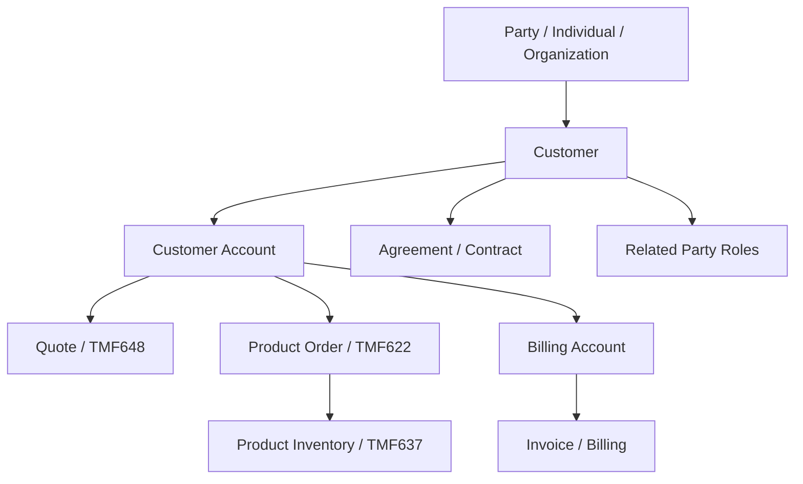
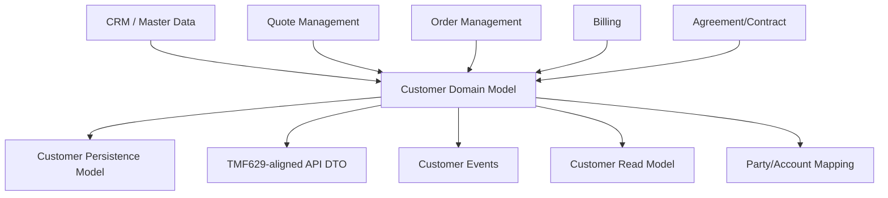
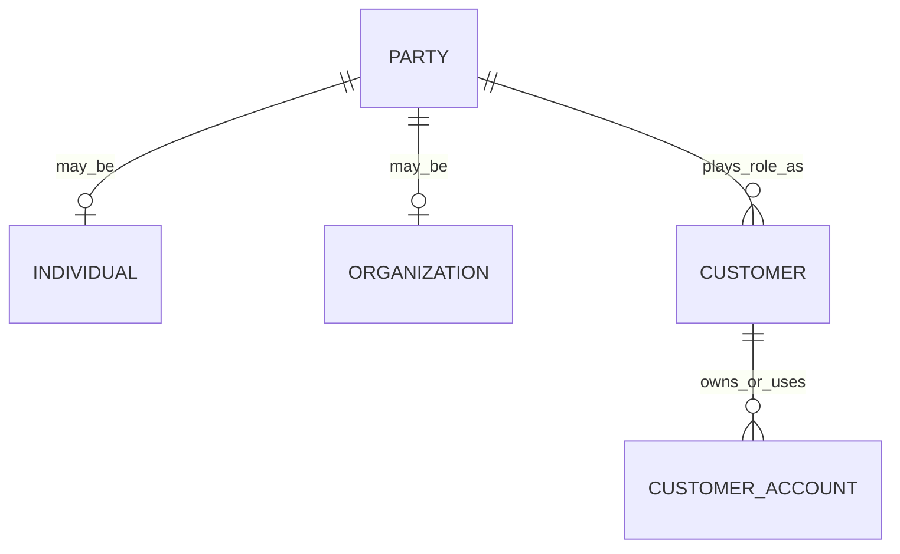
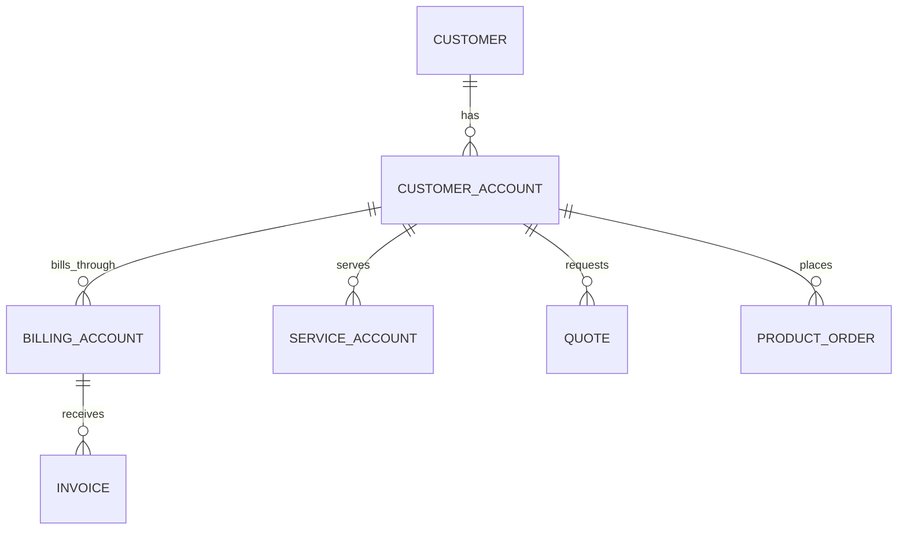
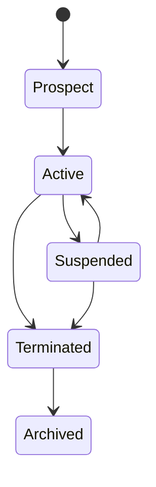
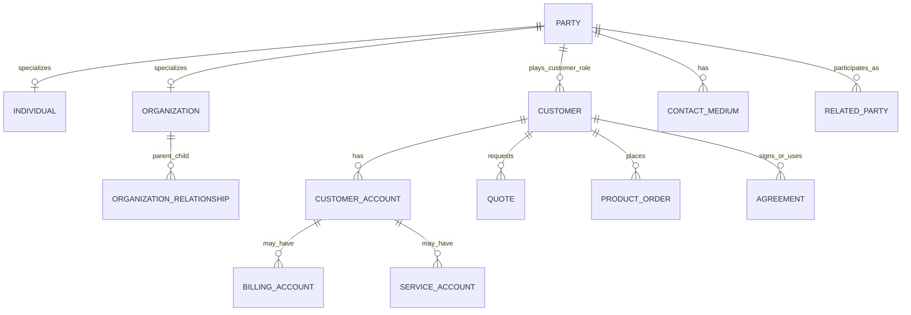
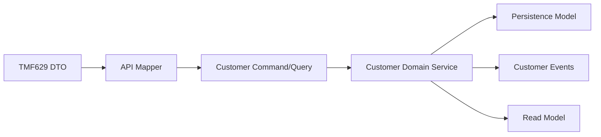

# TMF629 Customer Management Data Model

TMF629 Customer Management API memberi reference shape untuk **customer management**.

Dalam CPQ, quote management, order management, billing, telco BSS/OSS, dan mission-critical SaaS systems, customer model adalah fondasi banyak keputusan:

- eligibility,
- pricing,
- discount,
- approval,
- quote ownership,
- order fulfillment,
- billing responsibility,
- access control,
- reporting,
- privacy,
- dan auditability.

Mindset yang benar:

```text
Customer is not just a name on a quote.
Customer is a role played by a party within commercial, contractual, billing, and service relationships.
```

TMF629 membantu menyamakan vocabulary customer management, tetapi internal enterprise system harus tetap mendesain:

- party identity,
- customer role,
- account relationship,
- billing/service account boundary,
- related party role,
- organization hierarchy,
- contact model,
- address usage,
- lifecycle status,
- master/reference ownership,
- privacy/security classification,
- API/event mapping,
- reporting/read model,
- dan reconciliation dengan CRM/billing/order systems.

Jangan menganggap TMF629 sebagai final internal schema.

TMF629 adalah reference model/API boundary. Internal schema harus mempertimbangkan bounded context, customer master ownership, tenant isolation, performance, historical snapshot, and regulatory/audit needs.

---

## 1. Core Mental Model

Customer management menjawab pertanyaan:

```text
Who is involved in the commercial relationship, what role do they play, how are they identified, how are they contacted, and how do they relate to accounts, orders, products, services, contracts, and billing?
```

Customer data berada di tengah banyak domain.



Customer model harus menjawab beberapa pertanyaan yang berbeda:

| Question | Model Concern |
|---|---|
| Siapa individu/organisasi ini? | Party identity |
| Apakah dia customer? | Customer role |
| Siapa yang membeli? | Buyer/account role |
| Siapa yang membayar? | Billing account/payer |
| Siapa yang memakai service? | Service account/service recipient |
| Siapa yang bisa approve? | Commercial authority |
| Siapa contact teknis? | Contact/related party role |
| Siapa legal contracting party? | Agreement/legal entity |

Jika semua dijawab dengan satu `customer_id` tanpa role, data model akan cepat rusak.

---

## 2. TMF629 Position in the Model Stack

TMF629 biasanya berada di CRM/customer management boundary.



Pemisahan model:

| Model | Purpose |
|---|---|
| Party Model | Identity of individual/organization |
| Customer Model | Commercial role of a party |
| Account Model | Grouping for commercial, service, or billing responsibility |
| Contact Model | How to reach a party or role |
| Related Party Model | Role-based participation in quote/order/agreement |
| API DTO Model | TMF629-aligned external/internal contract |
| Event Model | Customer/account change propagation |
| Snapshot Model | Historical customer context on quote/order |
| Reporting Model | Customer hierarchy, revenue, lifecycle, segmentation |

Rule utama:

```text
Party is identity.
Customer is role.
Account is relationship container.
Contact is communication endpoint.
Related party is contextual participation.
```

---

## 3. Party vs Customer

A party can be:

- individual,
- organization.

A customer is usually a party playing a commercial customer role.



### Party fields

| Field | Purpose | Concern |
|---|---|---|
| party_id | Stable party identity | Master data ownership |
| party_type | Individual/organization | Drives validation |
| legal_name/display_name | Identification | PII/legal correctness |
| external_party_id | CRM/MDM reference | Reconciliation |
| status | Active/inactive/merged/etc | Lifecycle |
| created/updated metadata | Audit | Traceability |

### Customer fields

| Field | Purpose | Concern |
|---|---|---|
| customer_id | Customer role ID | Not always same as party ID |
| party_id | Identity link | Must be valid |
| customer_number | Business/customer identifier | Public/reference key |
| customer_status | Prospect/active/suspended/terminated | Lifecycle |
| customer_segment | Enterprise/SMB/residential/etc | Pricing/reporting |
| customer_since | Relationship start | Analytics |
| risk/credit profile ref | Commercial governance | Sensitive data |
| owner/team ref | Sales/service ownership | Access/routing |

### Why separate party and customer?

Because one party can have multiple roles:

```text
Organization A may be a customer, supplier, partner, reseller, and legal counterparty.
```

If identity and role are collapsed, future integrations become painful.

---

## 4. Individual and Organization

### Individual

Individual model captures person-specific identity:

- given name,
- family name,
- preferred name,
- date of birth if legally required,
- identification document reference if applicable,
- contact preferences,
- privacy consent.

Be careful: individual data is often PII.

Do not copy it everywhere.

### Organization

Organization model captures company/legal entity identity:

- legal name,
- trading name,
- registration number,
- tax identifier,
- organization type,
- industry,
- parent organization,
- legal entity status,
- operating region.

For B2B enterprise CPQ, organization hierarchy matters more than simple flat customer table.

---

## 5. Customer Account, Billing Account, and Service Account

Account is often the most overloaded word in enterprise systems.

Do not assume all accounts are the same.

| Account Type | Purpose | Example |
|---|---|---|
| Customer Account | Commercial relationship container | ACME enterprise account |
| Billing Account | Payer/invoice responsibility | ACME Singapore billing account |
| Service Account | Service usage/installation relationship | ACME Jakarta site service account |
| Financial Account | Credit/payment balance | Billing platform account |
| CRM Account | Sales/CRM grouping | Salesforce account |

### Modelling principle

```text
Customer account groups commercial relationship.
Billing account determines who pays.
Service account determines who receives/uses service.
```

One customer may have many accounts.

One account may have many quotes/orders/products.

One billing account may pay for multiple service accounts.



---

## 6. Related Party Model

Related party is contextual.

A party can be related to a quote/order/account/agreement with a role.

Examples:

| Entity | Related Party Role |
|---|---|
| Quote | buyer, seller, approver, sales owner |
| Order | requestor, technical contact, delivery contact |
| Billing Account | payer, billing contact, finance contact |
| Agreement | legal signatory, contracting party |
| Product Inventory | service user, site contact |

### Related party fields

| Field | Purpose |
|---|---|
| related_party_id | Stable record |
| target_entity_type | Quote/order/account/etc |
| target_entity_id | Target reference |
| party_id | Party reference |
| role | Contextual role |
| contact_medium_id | Optional contact method |
| valid_from/valid_to | Temporal role validity |
| source_system | Origin |

### Correctness concern

Do not store role as free text if it drives behavior.

Use controlled vocabulary or reference data for roles involved in:

- billing,
- approval,
- access control,
- notification,
- legal signature,
- fulfillment contact.

---

## 7. Contact Medium Model

Contact medium represents how to reach a party or account.

Examples:

- email,
- phone,
- mobile,
- postal address,
- billing address,
- installation address,
- service address,
- support contact,
- portal user,
- notification endpoint.

### Contact medium fields

| Field | Purpose | Concern |
|---|---|---|
| contact_medium_id | Stable ID | Reference |
| party_id/account_id | Owner | Ownership clarity |
| medium_type | Email/phone/address/etc | Validation |
| value | Actual contact data | PII/sensitive |
| purpose | Billing/service/technical/legal | Role clarity |
| preferred | Contact preference | Notification routing |
| valid_from/valid_to | Temporal validity | Historical correctness |
| verified | Trust level | Delivery risk |

### Contact modelling trap

Avoid a single generic address field like:

```text
customer.address
```

Address usage matters.

Billing address, legal address, service address, installation address, and shipping address can differ.

---

## 8. Customer Hierarchy

Enterprise customers often have hierarchy:

```text
Global Parent
  -> Regional Entity
    -> Country Entity
      -> Department / Business Unit
        -> Site / Service Account
```

Hierarchy affects:

- pricing agreement,
- discount entitlement,
- approval authority,
- billing consolidation,
- contract coverage,
- reporting rollup,
- access control,
- service responsibility.

### Hierarchy model options

| Pattern | Use Case | Risk |
|---|---|---|
| Adjacency list | Simple parent-child | Recursive queries |
| Closure table | Fast hierarchy queries | More maintenance |
| Materialized path | Easy read/rollup | Path update complexity |
| Graph model | Complex relationship | Harder relational reporting |

For PostgreSQL, adjacency list plus recursive CTE may be enough initially. Closure table is useful for heavy hierarchy reporting/authorization.

### Hierarchy invariant examples

```text
Organization hierarchy must not contain cycles.
A child organization cannot have effective dates outside parent relationship validity if policy requires containment.
Billing rollup must follow explicit billing hierarchy, not automatically organization hierarchy.
```

---

## 9. Customer Lifecycle

Customer lifecycle is not the same as party lifecycle.

Example states:

```text
Prospect -> Active -> Suspended -> Terminated
```

Alternative/secondary states:

- pending verification,
- credit hold,
- blacklisted,
- merged,
- inactive,
- archived.



### Lifecycle invariant examples

```text
A terminated customer cannot create new quote unless reactivated or explicitly allowed.
A suspended customer may be blocked from new orders but may allow billing/payment actions.
A merged customer must redirect references or preserve historical identity.
A customer under credit hold may require approval for quote/order submission.
```

Customer status must be interpreted carefully by domain.

Blocking order creation, billing, support, and reporting may require different statuses or policies.

---

## 10. Customer Identity and External References

Customer data often comes from or synchronizes with CRM/MDM/billing systems.

Important identifiers:

| Identifier | Purpose |
|---|---|
| internal_customer_id | Internal persistence key |
| customer_number | Business/public customer key |
| party_id | Party identity link |
| external_crm_id | CRM reference |
| external_billing_customer_id | Billing reference |
| tax_id/company_reg_no | Legal identity |
| tenant_id | SaaS isolation |
| correlation_id | Trace change propagation |

### ID modelling rule

```text
Do not use external IDs as primary keys unless the external system is truly authoritative and stable.
```

External IDs can change, merge, split, or be duplicated.

Keep explicit external reference table if multiple systems are involved.

Example:

```text
customer_external_reference
  - customer_id
  - source_system
  - external_id
  - external_type
  - valid_from
  - valid_to
  - status
```

---

## 11. Customer Snapshot in Quote and Order

Quotes and orders often need stable historical customer context.

If customer legal name or address changes after quote acceptance, historical quote/order should remain explainable.

Snapshot candidates:

- customer number,
- display/legal name,
- customer segment at time of quote,
- account number,
- billing account reference,
- service address,
- related party roles,
- contact details relevant to fulfillment,
- tax profile reference if used in pricing.

### Reference vs snapshot

| Data | Reference | Snapshot |
|---|---|---|
| customer_id | Yes | Usually no need to copy as value only |
| customer name | Reference current for UI | Snapshot for accepted quote/order evidence |
| billing account | Reference | Snapshot summary if billing evidence needed |
| contact email/phone | Reference for current contact | Snapshot if required for order fulfillment evidence |
| address | Reference current | Snapshot if service/legal/billing historical correctness matters |

Principle:

```text
Operational relationship uses reference.
Historical evidence uses snapshot.
```

---

## 12. Conceptual Model

Conceptual ERD:



This model is conceptual.

Internal systems may split party, customer, account, contact, billing, and CRM integration across services.

---

## 13. Logical Model

Possible logical entities:

```text
party
individual
organization
customer
customer_account
billing_account_reference
service_account_reference
contact_medium
party_role
related_party
organization_relationship
customer_external_reference
customer_state_history
customer_snapshot
```

### Logical relationship examples

| Entity | Relationship |
|---|---|
| party | may have individual detail |
| party | may have organization detail |
| party | may play customer role |
| customer | has customer account |
| account | has contact medium |
| account | may have billing account reference |
| organization | may have parent organization |
| quote/order | references customer/account/related party |
| customer | has external references |

### Avoid overloading

Do not use one table for all of this without clear semantics:

```text
account(id, name, type, address, billing_flag, service_flag, customer_flag, org_parent_id, ...)
```

It may look flexible but tends to create undefined behavior.

---

## 14. Physical PostgreSQL Considerations

### Keys

Use internal stable keys:

```text
party_id uuid
customer_id uuid
customer_account_id uuid
```

Keep business identifiers separate:

```text
customer_number text unique
account_number text unique
```

### External references

Use separate table when multiple systems exist:

```text
customer_external_reference(customer_id, source_system, external_id, external_type)
```

Unique constraint likely needed:

```text
(source_system, external_id, external_type)
```

### Hierarchy

For adjacency list:

```text
organization_relationship(parent_org_id, child_org_id, relationship_type, valid_from, valid_to)
```

Need cycle prevention at application/service layer or specialized DB strategy.

### Indexes

Useful indexes:

```text
(customer_number)
(party_id)
(customer_status, updated_at)
(customer_segment)
(tenant_id, customer_number)
(source_system, external_id)
(parent_org_id)
(child_org_id)
```

### PII fields

For PII-heavy contact data:

- restrict read access,
- avoid unnecessary indexes on sensitive values,
- consider encryption/tokenization policy,
- avoid logging raw values,
- define retention and deletion behavior.

---

## 15. API Model Mapping

TMF629-aligned API can expose customer resource with related party/account references.

Internal mapping should prevent accidental coupling.



### API mapping concern

External API may use:

- `id`,
- `href`,
- `name`,
- `status`,
- `statusReason`,
- `account`,
- `contactMedium`,
- `relatedParty`,
- `validFor`,
- `characteristic`.

Internal model should map them explicitly into:

- party,
- customer,
- account,
- role,
- contact,
- status,
- external reference,
- extension attribute.

Do not let flexible `characteristic` become ungoverned business-critical data.

---

## 16. Event Model Mapping

Customer events may include:

- CustomerCreated
- CustomerUpdated
- CustomerStatusChanged
- CustomerAccountCreated
- CustomerAccountUpdated
- CustomerMerged
- CustomerHierarchyChanged
- CustomerContactChanged
- CustomerExternalReferenceLinked

Event design concerns:

| Concern | Explanation |
|---|---|
| PII minimization | Do not publish sensitive contact data unless necessary |
| Event versioning | Customer model evolves often |
| Consumer impact | Quote/order/billing may depend on customer changes |
| Snapshot vs reference | Historical quote/order may not update automatically |
| Merge/split semantics | Hardest customer lifecycle events |
| Tenant isolation | Must include tenant context when applicable |

### Event envelope

```text
event_id
event_type
event_version
aggregate_id = customer_id
occurred_at
correlation_id
causation_id
source_service
tenant_id
payload
```

### Important distinction

```text
CustomerUpdated does not mean every existing quote/order should be mutated.
```

Downstream services must decide whether to update read views, future defaults, or historical snapshots.

---

## 17. Java/JAX-RS Backend Implications

In Java/JAX-RS, avoid exposing internal customer entity directly.

Recommended structure:

```text
CustomerResource
  -> CustomerApplicationService
    -> CustomerCommandHandler / QueryService
      -> CustomerDomainService
        -> CustomerRepository
        -> CustomerEventPublisher / Outbox
```

### DTO boundary

Use separate classes for:

- API request/response,
- command model,
- domain model,
- persistence entity/record,
- event payload,
- read model projection.

Customer model changes are high blast-radius.

A field added casually to customer DTO can affect:

- quote eligibility,
- order validation,
- billing account resolution,
- user visibility,
- reporting,
- PII exposure,
- event consumers.

---

## 18. MyBatis, JPA, and JDBC Considerations

### MyBatis

Useful for:

- customer search,
- hierarchy query,
- account lookup,
- reporting/read model,
- reconciliation query.

Need discipline for:

- tenant filtering,
- PII column selection,
- pagination,
- recursive hierarchy performance,
- mapping external references.

### JPA

Use carefully if modelling party/customer/account graph.

Risks:

- accidental eager loading of huge hierarchy,
- cascade update of contact/account records,
- dirty checking changing audit-sensitive fields,
- lazy loading outside transaction,
- entity graph too broad.

### JDBC

Useful for:

- explicit customer/account writes,
- external reference linking,
- bulk migration/backfill,
- repair scripts.

But all writes must preserve audit and event publication semantics.

---

## 19. Kafka, RabbitMQ, Redis, and Camunda Implications

### Kafka

Good for customer change events:

- customer created,
- account updated,
- hierarchy changed,
- status changed,
- contact changed.

Need careful PII governance.

### RabbitMQ

Useful for:

- CRM sync jobs,
- contact validation tasks,
- customer merge processing,
- async enrichment.

### Redis

Common usage:

- customer profile cache,
- account lookup cache,
- hierarchy cache,
- entitlement/eligibility cache.

Risk:

```text
Stale customer/account cache can cause wrong quote eligibility, wrong billing account, or wrong access decision.
```

Use versioned keys or invalidation events for sensitive customer context.

### Camunda

Customer lifecycle may trigger workflows:

- onboarding,
- KYC/verification,
- credit approval,
- account setup,
- customer merge review,
- enterprise hierarchy approval.

Keep workflow state separate from customer master state.

---

## 20. Reporting and Analytics Impact

Customer model feeds many reports:

- revenue by customer,
- quote conversion by segment,
- order volume by account,
- billing aging by payer,
- churn/termination,
- product penetration,
- account hierarchy rollup,
- enterprise customer profitability,
- SLA by customer tier,
- support incidents by customer.

Reporting needs stable dimensions.

Common dimension fields:

- customer_number,
- customer_name_snapshot,
- segment,
- industry,
- region,
- parent organization,
- account type,
- customer status,
- customer since,
- tenant.

If customer hierarchy changes, reporting must decide:

```text
Do historical metrics roll up to historical hierarchy or current hierarchy?
```

This is a temporal modelling decision.

---

## 21. Auditability Concerns

Customer changes can have legal, commercial, and billing consequences.

Audit must answer:

```text
Who changed the customer/account/contact data?
What changed?
Why did it change?
Which source system initiated it?
Which quote/order/billing records were affected?
Was the change synchronized downstream?
```

High-risk audited changes:

- legal name,
- tax identifier,
- billing address,
- billing account relationship,
- customer status,
- credit hold,
- account hierarchy,
- customer merge/split,
- contact medium for billing/legal notification,
- tenant/customer ownership.

Audit should include:

- actor,
- source system,
- before/after,
- timestamp,
- correlation ID,
- reason,
- approval/workflow reference if applicable.

---

## 22. Security and Privacy Concerns

Customer model often contains PII and sensitive commercial data.

Sensitive data may include:

- individual name,
- email,
- phone,
- address,
- national ID/passport if applicable,
- tax ID,
- account hierarchy,
- contract relationship,
- credit status,
- billing profile,
- commercial segment,
- pricing entitlement.

Security requirements:

- tenant isolation,
- row-level access awareness,
- field-level masking,
- purpose-based access,
- event payload minimization,
- log redaction,
- retention/deletion policy,
- audit on sensitive reads/writes if required.

Never treat customer data as harmless reference data.

---

## 23. Customer Merge, Split, and Duplicate Handling

Customer master data often faces duplicates and merges.

Examples:

```text
ACME Ltd
ACME Limited
ACME Singapore Pte Ltd
A.C.M.E. Corp
```

Duplicate handling requires explicit model.

### Merge model fields

| Field | Purpose |
|---|---|
| merge_id | Stable merge operation |
| survivor_customer_id | Customer kept active |
| merged_customer_id | Customer absorbed |
| merge_reason | Why |
| approved_by | Governance |
| merged_at | Timestamp |
| source_system | Origin |
| affected_records_count | Impact |

### Merge invariant examples

```text
Merged customer ID must remain resolvable for historical references.
New quotes should use survivor customer.
Historical orders must not lose original customer context.
Billing/legal records may require stricter merge policy than CRM display.
```

A naive physical update of all foreign keys may destroy audit evidence.

---

## 24. Production Failure Modes

Common customer data failures:

| Failure Mode | Symptom | Likely Model Weakness |
|---|---|---|
| Customer/account ambiguity | Quote under wrong account | Party/customer/account collapsed |
| Wrong payer | Invoice sent to wrong entity | Billing account relationship unclear |
| Wrong service contact | Fulfillment cannot reach customer | Contact purpose not modelled |
| Cross-tenant data leak | User sees other customer | Missing tenant filtering/indexing |
| Stale hierarchy | Wrong approval/discount/reporting | Cache/projection not invalidated |
| Duplicate customer | Fragmented revenue/orders | Weak external reference/MDM process |
| Broken quote history | Customer name changed historically | Missing snapshot |
| Invalid status usage | Suspended customer can order | Weak lifecycle invariant |
| PII leak in event/log | Sensitive data exposed | Event/log governance missing |
| CRM/billing mismatch | Account reconciliation fails | External reference model weak |

---

## 25. Debugging Customer Data Issues

Debug chain:

```text
Party identity
  -> customer role
  -> customer account
  -> billing/service account
  -> related party roles
  -> contact medium
  -> external references
  -> quote/order references
  -> event propagation
  -> read model/cache
  -> audit trail
```

Questions to ask:

1. Is this party an individual or organization?
2. Is the customer role active?
3. Which account is used by quote/order?
4. Which billing account pays?
5. Which service account/site receives service?
6. Which related party role is involved?
7. Is the contact medium correct and valid?
8. Is data current, historical snapshot, or stale projection?
9. Did CRM/billing/customer service publish a change event?
10. Did read model/cache update?
11. Is there an audit record for the change?

---

## 26. Trade-Offs

### Single customer table vs party/customer/account split

Single table is simpler early.

Split model is more correct for enterprise B2B, telco, billing, and integration.

Practical approach:

```text
Keep party/customer/account semantics explicit even if physical implementation starts simple.
```

### Snapshot vs live reference

Live reference gives current data.

Snapshot gives historical evidence.

Use both intentionally.

### Generic related party vs explicit roles

Generic related party is flexible.

Explicit role columns are easier for critical behavior.

Use generic model for broad participation, but enforce controlled roles for billing, legal, approval, and fulfillment.

### Customer hierarchy current vs historical

Current hierarchy is easier for operational lookup.

Historical hierarchy is needed for accurate past reporting and contract interpretation.

Decide per reporting/business requirement.

---

## 27. PR Review Checklist

When reviewing customer model changes, ask:

- Is this party, customer, account, contact, or related party data?
- Who owns the source of truth?
- Does this field contain PII or sensitive commercial data?
- Is this field needed in quote/order snapshot?
- Does it affect billing account resolution?
- Does it affect eligibility, pricing, approval, or access control?
- Is lifecycle/status semantics clear?
- Is hierarchy handling clear?
- Are external references versioned/reconciled?
- Are events safe for consumers and privacy?
- Are indexes tenant-aware and query-pattern-aware?
- Does migration preserve historical quote/order correctness?
- Is audit required for this change?
- Is cache/read model invalidation handled?

---

## 28. Internal Verification Checklist

Verify in internal CSG/team context:

- Customer API contract and TMF629 alignment.
- Whether party, customer, account, billing account, and service account are separated.
- Customer master/source-of-truth system.
- CRM integration model.
- Billing account integration model.
- Customer/account external reference table.
- Customer status lifecycle and business meaning.
- Customer segment usage in pricing/reporting.
- Organization hierarchy model.
- Related party role vocabulary.
- Contact medium model and purpose.
- Address usage distinction: billing, service, installation, legal, shipping.
- Customer snapshot policy in quote/order.
- Customer/account event schema.
- Cache/read model invalidation for customer/account changes.
- PII classification and masking.
- Tenant isolation enforcement.
- Audit trail for sensitive customer/account changes.
- Duplicate/merge/split handling.
- Reconciliation between CRM, order, billing, and reporting.
- Incident notes involving wrong customer/account/payer/contact.

---

## 29. Key Takeaways

Customer model is not a flat profile table.

A production-grade TMF629-aware customer model must distinguish:

- party identity,
- customer role,
- individual/organization detail,
- customer account,
- billing account,
- service account,
- related party role,
- contact medium,
- organization hierarchy,
- external reference,
- lifecycle status,
- snapshot,
- audit,
- privacy/security,
- and reporting dimension.

The most dangerous mistake is using one overloaded `customer` object for every commercial, legal, billing, service, and contact responsibility.

```text
A customer model is correct only if it can explain who the party is, what role they play, which account is responsible, who pays, who receives service, who can act, and what historical context must remain true.
```
