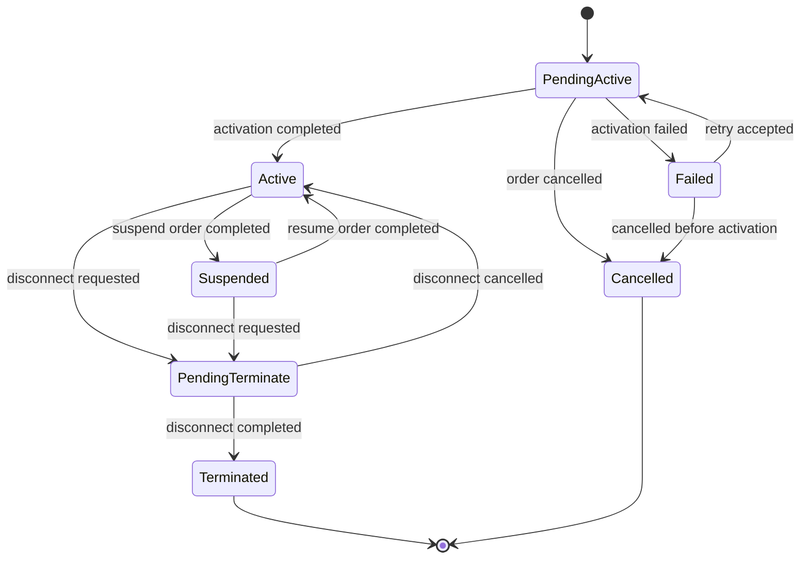
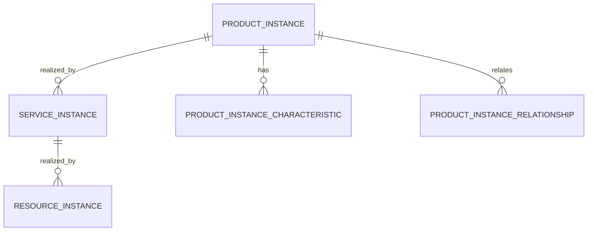
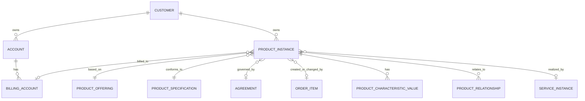

# TMF637 Product Inventory Data Model

Product inventory adalah model untuk **produk yang sudah dimiliki, sedang aktif, pernah aktif, sedang diubah, atau sedang dihentikan** pada customer/account tertentu.

Dalam CPQ dan quote-to-cash, product catalog menjawab:

```text
Apa yang bisa dijual?
```

Quote menjawab:

```text
Apa yang ditawarkan dan disetujui secara commercial?
```

Order menjawab:

```text
Apa yang harus dieksekusi?
```

Product inventory menjawab:

```text
Apa yang benar-benar menjadi installed base customer sekarang?
```

Kesalahan umum dalam enterprise system adalah memperlakukan product catalog, quote item, order item, dan product inventory sebagai hal yang sama. Itu berbahaya.

Product offering adalah definisi commercial.
Quote item adalah proposal commercial.
Order item adalah instruksi eksekusi.
Product inventory adalah hasil aktual yang menjadi basis modify, suspend, resume, disconnect, billing, support, assurance, dan renewal.

---

## 1. Core Mental Model

TMF637 dapat dipahami sebagai reference API/model untuk mengelola representasi product dalam inventory. Dalam konteks data modelling internal, yang penting bukan menyalin field mentah dari TMF637, tetapi memahami fungsi modelnya.

Product inventory harus menjawab pertanyaan berikut:

```text
1. Customer/account mana yang memiliki product instance ini?
2. Product offering/specification mana yang menjadi asal commercial-nya?
3. Order mana yang menciptakan atau mengubah product instance ini?
4. Status lifecycle product instance sekarang apa?
5. Karakteristik aktual product instance apa?
6. Service/resource teknis apa yang merealisasikan product ini?
7. Billing account mana yang membayar product ini?
8. Kapan product mulai aktif, suspend, terminate, atau berubah?
9. Product ini parent/child dari product mana?
10. Bukti audit dan reconciliation apa yang menjelaskan state saat ini?
```

Dalam enterprise telco/BSS/OSS, product inventory sering menjadi pusat dari operasi berikut:

| Operation | Product Inventory Role |
|---|---|
| Modify plan | Menentukan installed product yang akan diubah |
| Add-on purchase | Menentukan parent product yang menerima add-on |
| Disconnect | Menentukan product instance yang harus dihentikan |
| Suspend/resume | Menentukan lifecycle state commercial dan service impact |
| Billing | Menentukan product/subscription/charge yang masih aktif |
| Assurance | Menentukan layanan aktif yang dilaporkan customer |
| Renewal | Menentukan contract/subscription/product yang perlu diperpanjang |
| Migration | Menentukan installed base yang terdampak perubahan catalog atau platform |

---

## 2. Product Inventory Is Not Product Catalog

Perbedaan ini fundamental.

| Concern | Product Catalog | Product Inventory |
|---|---|---|
| Pertanyaan utama | Apa yang bisa dijual? | Apa yang sudah dimiliki customer? |
| Entity utama | Product offering/specification | Product instance/installed product |
| Mutability | Versioned, published, retired | Lifecycle-driven, berubah karena order/action |
| Temporal concern | Effective date, catalog version | Start date, status date, termination date |
| Source | Catalog management | Order fulfillment/activation/reconciliation |
| Used by | CPQ, eligibility, pricing | Modify order, billing, support, assurance |
| Risk utama | Salah jual/stale catalog | Salah installed base/billing/support |

Catalog adalah template.
Inventory adalah instance.

Contoh:

```text
Catalog:
  Product Offering = Enterprise Fiber 1Gbps
  Product Specification = Fiber Connectivity Service
  Price = IDR X/month

Inventory:
  Product Instance = Enterprise Fiber 1Gbps for Customer A at Site Jakarta
  Status = Active
  Start Date = 2026-03-01
  Billing Account = BA-001
  Realizing Service = CFS-7781
```

Jika sistem mengambil data catalog untuk menentukan produk aktif customer, hasilnya bisa salah karena catalog bisa berubah, retired, atau republished.

---

## 3. Product Inventory Is Not Quote Item

Quote item adalah proposal. Product inventory adalah actual installed base.

| Concern | Quote Item | Product Inventory |
|---|---|---|
| Lifecycle | Draft -> approved -> accepted -> converted | Created -> active -> suspended -> terminated |
| Price | Commercial snapshot | Billing/subscription linkage |
| Validity | Quote validity/expiry | Actual service/product lifecycle |
| Evidence | Proposal evidence | Operational truth/evidence |
| Mutation source | Sales/configuration/approval | Fulfillment/order/reconciliation |

Quote item bisa gagal menjadi product inventory jika order gagal atau customer membatalkan sebelum fulfillment.

Karena itu, jangan membuat product inventory hanya karena quote diterima. Biasanya product inventory dibuat atau diaktifkan setelah order mencapai titik fulfillment/billing readiness tertentu.

Internal variation harus diverifikasi:

```text
Apakah inventory dibuat saat order submitted, fulfilled, activated, atau billing activated?
```

---

## 4. Product Inventory Is Not Order Item

Order item adalah instruksi perubahan. Product inventory adalah state setelah instruksi diterapkan.

| Order Item Action | Product Inventory Impact |
|---|---|
| Add | Membuat product instance baru atau pending activation |
| Modify | Mengubah characteristic/version/relationship product instance |
| Disconnect | Mengubah status menjadi termination pending/terminated |
| Suspend | Mengubah status menjadi suspended atau suspension pending |
| Resume | Mengembalikan status ke active jika valid |
| Move | Mengubah site/location atau relationship |
| Change plan | Mengubah offering/spec/version atau membuat replacement instance |

Order item sebaiknya tidak dianggap sebagai installed product.

Order item bisa memiliki banyak attempt, fallout, retry, amend, atau cancellation. Product inventory harus mencerminkan hasil aktual yang durable.

---

## 5. Product Instance

Product instance adalah representasi konkret dari produk yang dimiliki customer.

Minimal product instance biasanya membutuhkan:

```text
product_instance_id
public_product_id / installed_product_number
customer_id / account_id
billing_account_id
product_offering_id
product_specification_id
source_order_id
source_order_item_id
status
start_date
end_date / termination_date
created_at
updated_at
```

Namun enterprise-grade product inventory biasanya juga membutuhkan:

```text
catalog_version_id
offering_version_id
agreement_id
subscription_id
site_id
parent_product_instance_id
external_inventory_id
realizing_service_id
realizing_resource_id
activation_date
suspension_date
termination_reason
last_reconciled_at
version / optimistic_lock
```

Field-field tersebut tidak selalu satu tabel. Beberapa bisa berada pada relationship table, characteristic table, audit table, atau external reference table.

---

## 6. Installed Product Number vs Internal ID

Jangan mencampur internal primary key dengan business-visible installed product identifier.

| Identifier | Purpose |
|---|---|
| Internal ID | FK internal, join, storage efficiency |
| Public product ID | API/UI/customer support reference |
| Installed product number | Business reference, sometimes printed/reported |
| External inventory ID | Reference dari downstream OSS/BSS/inventory system |
| Source order item ID | Traceability ke order yang menciptakan/mengubah product |
| Correlation ID | Traceability lintas event/API/job |

Rule praktis:

```text
Internal primary key boleh berubah implementation-specific.
Business/public identifier harus stabil.
External identifier harus disimpan sebagai external reference, bukan menggantikan identity internal.
```

---

## 7. Product Relationship Model

Product inventory jarang flat.

Contoh relationship:

```text
Enterprise Connectivity Package
  -> Internet Access Product
  -> Static IP Add-on
  -> Managed Router Add-on
  -> SLA Premium Add-on
```

Relationship yang perlu dimodelkan:

| Relationship | Meaning |
|---|---|
| parent-child | Bundle/component instance |
| depends-on | Product instance bergantung pada product lain |
| replaces | Product instance menggantikan product sebelumnya |
| bundled-with | Product menjadi bagian package commercial |
| add-on-of | Add-on melekat pada base product |
| migrated-from | Product hasil migration dari legacy product |
| realized-by | Product direalisasikan oleh service/resource |

Contoh table:

```sql
product_instance_relationship
- id
- source_product_instance_id
- target_product_instance_id
- relationship_type
- valid_from
- valid_to
- created_at
```

Correctness concern:

```text
Tidak boleh ada cycle parent-child jika business rule melarang.
Add-on tidak boleh active jika parent base product terminated.
Replacement harus memiliki trace ke product lama.
```

---

## 8. Product Characteristic Value

Characteristic pada product inventory adalah **nilai aktual** dari product instance.

Jangan mencampur:

| Model | Meaning |
|---|---|
| Product specification characteristic | Attribute yang bisa ada pada jenis produk |
| Quote configuration characteristic | Attribute yang dipilih saat proposal |
| Order item characteristic | Attribute yang diminta untuk dieksekusi |
| Product inventory characteristic | Attribute aktual setelah fulfillment/activation |

Contoh:

```text
Specification:
  bandwidth allowed values = 100Mbps, 500Mbps, 1Gbps

Quote:
  bandwidth = 1Gbps

Order:
  bandwidth = 1Gbps, install date requested = 2026-03-01

Inventory:
  bandwidth = 1Gbps, circuit_id = CKT-123, activation_date = 2026-03-02
```

Nilai di inventory bisa berbeda dari quote/order jika fulfillment melakukan normalization, enrichment, provisioning assignment, atau technical mapping.

---

## 9. Characteristic Storage Pattern

Tiga pattern umum:

### Pattern 1: Relational table

```sql
product_instance_characteristic
- id
- product_instance_id
- characteristic_code
- value_text
- value_number
- value_boolean
- value_json
- unit_of_measure
- valid_from
- valid_to
```

Cocok untuk:

- query by characteristic,
- reporting,
- validation,
- history,
- indexing,
- reconciliation.

### Pattern 2: JSONB payload

```sql
product_instance.characteristics_jsonb
```

Cocok untuk:

- flexible payload,
- low query need,
- integration mirror,
- rapid extension.

Risiko:

- sulit enforce constraint,
- sulit report,
- index perlu hati-hati,
- schema drift tidak terlihat,
- field semantics bisa kabur.

### Pattern 3: Hybrid

```text
Core searchable characteristics -> relational columns/tables
Extension characteristics -> JSONB
```

Ini sering paling realistis untuk enterprise SaaS/telco.

---

## 10. Product Status Model

Product inventory membutuhkan lifecycle status yang lebih hati-hati daripada catalog.

Status umum:

```text
pendingActive
active
suspended
pendingTerminate
terminated
cancelled
failed
```

Namun internal system mungkin memakai status berbeda.

Yang penting adalah semantic clarity:

| Status | Meaning |
|---|---|
| Pending Active | Product instance dibuat tapi belum aktif/ready |
| Active | Product tersedia/berjalan secara commercial/operational |
| Suspended | Product sementara tidak aktif tetapi belum terminated |
| Pending Terminate | Disconnect sedang berjalan |
| Terminated | Product sudah dihentikan |
| Cancelled | Creation dibatalkan sebelum menjadi active |
| Failed | Activation/change gagal dan perlu resolution |

Status harus bisa menjawab:

```text
Apakah product boleh ditagih?
Apakah product boleh dimodify?
Apakah product boleh didisconnect?
Apakah product terlihat di customer care?
Apakah product boleh menjadi parent add-on?
Apakah product harus masuk assurance?
```

---

## 11. Product Lifecycle State Machine

Contoh lifecycle sederhana:



State machine harus memiliki transition history:

```sql
product_instance_state_history
- id
- product_instance_id
- from_status
- to_status
- transition_reason
- source_order_id
- source_order_item_id
- actor_type
- actor_id
- correlation_id
- occurred_at
```

Tanpa transition history, support/debugging hanya melihat current state dan kehilangan alasan perubahan.

---

## 12. Lifecycle Dates

Product inventory sangat temporal.

Field umum:

| Field | Meaning |
|---|---|
| created_at | Record dibuat di system |
| start_date | Product mulai berlaku secara business |
| activation_date | Product benar-benar aktif secara operational |
| billing_start_date | Billing mulai berjalan |
| suspension_date | Product disuspend |
| resume_date | Product direaktivasi |
| termination_date | Product dihentikan |
| valid_from/valid_to | Validity relationship/characteristic |
| last_reconciled_at | Terakhir diverifikasi dengan source/downstream |

Jangan menganggap semua tanggal ini sama.

Contoh failure:

```text
Order completed: 2026-03-01
Service activated: 2026-03-02
Billing started: 2026-03-01
Inventory start_date: 2026-03-02
```

Jika definisi tanggal tidak jelas, invoice bisa salah satu hari, SLA bisa salah, dan dispute customer sulit dijawab.

---

## 13. Realizing Service and Realizing Resource

Dalam telco, product adalah commercial abstraction.

Service/resource adalah technical realization.



Contoh:

```text
Product Instance:
  Managed Internet 1Gbps

Realizing Service:
  Customer Facing Service: Enterprise Internet Access

Realizing Resources:
  Circuit
  Router
  IP address block
  Port
```

Inventory model harus dapat menyimpan reference ke realizing service/resource, tetapi tidak harus memiliki semua detail OSS.

Internal verification:

```text
Apakah product inventory menyimpan service/resource secara langsung,
atau hanya external reference ke service inventory/resource inventory?
```

---

## 14. Billing Account Reference

Product inventory sering menjadi input billing.

Namun billing account reference harus dipahami hati-hati.

Product instance bisa:

- dibayar oleh billing account tertentu,
- dipindah ke billing account lain,
- memiliki charge yang sudah berubah,
- memiliki billing effective date berbeda dari activation date,
- menjadi bagian subscription atau contract.

Model minimal:

```sql
product_instance_billing_assignment
- id
- product_instance_id
- billing_account_id
- subscription_id
- effective_from
- effective_to
- source_order_id
- created_at
```

Ini lebih aman daripada hanya satu `billing_account_id` mutable jika billing assignment bisa berubah historis.

---

## 15. Source Order Traceability

Setiap product instance harus bisa menjawab:

```text
Order mana yang membuat saya?
Order mana yang terakhir mengubah saya?
Order mana yang menghentikan saya?
```

Model yang umum:

```text
created_by_order_id
created_by_order_item_id
last_modified_by_order_id
last_modified_by_order_item_id
terminated_by_order_id
terminated_by_order_item_id
```

Namun untuk audit lebih lengkap, gunakan history:

```sql
product_instance_change
- id
- product_instance_id
- change_type
- source_order_id
- source_order_item_id
- before_snapshot
- after_snapshot
- occurred_at
```

Snapshot before/after membantu menjawab perubahan characteristic, billing account, status, site, atau relationship.

---

## 16. Conceptual Model



Conceptual model menekankan relationship bisnis, bukan table final.

Pertanyaan review:

```text
Apakah product inventory adalah source of truth installed base?
Apakah billing menggunakan product inventory sebagai source?
Apakah support/customer care membaca product inventory atau order history?
Apakah product inventory bisa dijelaskan tanpa membuka quote/order detail?
```

---

## 17. Logical Model

Logical entities:

```text
ProductInstance
ProductInstanceCharacteristic
ProductInstanceRelationship
ProductInstanceStatusHistory
ProductInstanceExternalReference
ProductInstanceBillingAssignment
ProductInstanceServiceRealization
ProductInstanceChangeHistory
```

Logical relationships:

```text
ProductInstance belongs to Customer/Account
ProductInstance references ProductOffering/ProductSpecification/CatalogVersion
ProductInstance may be billed to BillingAccount
ProductInstance may be governed by Agreement/Subscription
ProductInstance may be realized by ServiceInstance/ResourceInstance
ProductInstance may be created/modified/terminated by OrderItem
ProductInstance has many CharacteristicValues
ProductInstance has many Relationships
ProductInstance has many StateHistory records
```

Logical invariant examples:

```text
Terminated product cannot be modified except through correction/reinstatement flow.
Active add-on must have active parent product unless business explicitly allows otherwise.
Product instance created from order item must reference source order item.
Billing-active product must have valid billing account assignment.
Characteristic value must conform to applicable product specification/version unless marked as legacy/exception.
```

---

## 18. Physical PostgreSQL Considerations

Example physical skeleton:

```sql
create table product_instance (
    id uuid primary key,
    public_product_id text not null unique,
    tenant_id uuid not null,
    customer_id uuid not null,
    account_id uuid,
    product_offering_id uuid,
    product_specification_id uuid,
    catalog_version_id uuid,
    status text not null,
    start_date timestamptz,
    activation_date timestamptz,
    termination_date timestamptz,
    source_order_id uuid,
    source_order_item_id uuid,
    version bigint not null default 0,
    created_at timestamptz not null,
    updated_at timestamptz not null
);
```

Common indexes:

```sql
create index idx_product_instance_customer_status
on product_instance (tenant_id, customer_id, status);

create index idx_product_instance_account_status
on product_instance (tenant_id, account_id, status);

create index idx_product_instance_source_order
on product_instance (tenant_id, source_order_id);

create index idx_product_instance_status_dates
on product_instance (tenant_id, status, activation_date, termination_date);
```

Physical design concerns:

- avoid table too wide with every characteristic as column,
- avoid unbounded JSONB without indexing strategy,
- index active product queries,
- preserve source order trace,
- support tenant isolation if SaaS,
- support retention/archive if product history is huge,
- support optimistic locking for concurrent modifications.

---

## 19. API Model Mapping

Internal product inventory model should not leak blindly through API.

API response should be consumer-oriented:

```json
{
  "id": "PI-12345",
  "status": "active",
  "productOffering": {
    "id": "PO-100",
    "name": "Enterprise Internet 1Gbps"
  },
  "relatedParty": [],
  "billingAccount": {
    "id": "BA-001"
  },
  "startDate": "2026-03-01T00:00:00Z",
  "productCharacteristic": [],
  "realizingService": []
}
```

Mapping concerns:

| Internal Model | API Concern |
|---|---|
| internal UUID | public ID or href |
| status enum | stable external status semantics |
| relationship table | nested relationship representation |
| characteristic table | productCharacteristic array |
| service/resource refs | realizingService/realizingResource links |
| audit fields | usually hidden unless audit endpoint |
| tenant_id | never leaked unless explicitly part of contract |

Do not expose internal table shape as REST contract.

---

## 20. Event Model Mapping

Important events:

```text
ProductInstanceCreated
ProductInstanceActivated
ProductInstanceModified
ProductInstanceSuspended
ProductInstanceResumed
ProductInstanceTerminated
ProductInstanceRelationshipChanged
ProductInstanceBillingAssignmentChanged
ProductInventoryReconciled
```

Event payload should include:

```text
event_id
occurred_at
event_type
event_version
aggregate_id / product_instance_id
tenant_id
customer_id
account_id
status
source_order_id
source_order_item_id
correlation_id
causation_id
changed_fields or snapshot summary
```

Event correctness rules:

```text
Publish only after DB commit using outbox.
Use stable event version.
Include enough identity for consumers to reconcile.
Avoid publishing giant full inventory object unless there is a clear contract.
Make event idempotent for consumers.
```

---

## 21. Java/JAX-RS Backend Implications

Backend service should separate:

```text
API Resource / Controller
Application Service
Domain Service / Aggregate Logic
Repository / Mapper
Event Publisher / Outbox Writer
Integration Adapter
```

Avoid this anti-pattern:

```text
JAX-RS DTO -> JPA Entity -> database -> event payload
```

This couples external API, persistence, and integration.

Better:

```text
JAX-RS DTO
  -> Command
  -> ProductInventoryApplicationService
  -> ProductInstance aggregate / lifecycle policy
  -> Repository
  -> Outbox event
  -> API response DTO
```

Lifecycle transition should live in domain/application logic, not scattered in controller, mapper XML, job, and event handler.

---

## 22. MyBatis, JPA, and JDBC Considerations

### MyBatis

Good for explicit SQL and complex read models.

Watch out for:

- duplicated mapping fragments,
- missing status filters,
- accidental N+1 relationship loading,
- dynamic SQL that bypasses tenant/status constraints,
- manual optimistic locking omissions.

### JPA

Useful for aggregate persistence if relationships are controlled.

Watch out for:

- lazy loading surprises,
- cascade errors on relationship/history tables,
- entity graph too large,
- accidental mutation of historical data,
- optimistic lock not applied to important transitions.

### JDBC

Good for high-control batch/reconciliation/backfill.

Watch out for:

- bypassing domain invariants,
- missing audit/outbox writes,
- inconsistent transaction boundary,
- untracked repair scripts.

---

## 23. Kafka, RabbitMQ, Redis, and Camunda Implications

### Kafka

Use for durable product inventory lifecycle events.

Key choice matters:

```text
message key = product_instance_id
```

This helps preserve per-product ordering.

### RabbitMQ

Useful for command/task style operations:

```text
activate product
sync inventory
repair inventory mismatch
```

Must be idempotent.

### Redis

May cache active product lookup.

Cache key should include version/tenant/customer where relevant:

```text
product-inventory:{tenantId}:{customerId}:active:v{projectionVersion}
```

Stale inventory cache can cause wrong modify/disconnect eligibility.

### Camunda

Workflow should reference product inventory by business key or product instance ID.

Do not let Camunda process variable become authoritative product inventory state.

---

## 24. Reporting and Analytics Impact

Product inventory powers reports such as:

- active installed base,
- product adoption,
- product churn,
- suspend/resume volume,
- disconnect trend,
- migration progress,
- billing activation gap,
- order-to-activation lead time,
- customer product portfolio,
- product/service mismatch.

Reporting model usually needs denormalization:

```text
fact_product_instance_lifecycle
fact_product_status_transition
dim_customer
dim_product_offering
dim_site
dim_billing_account
```

Reporting concern:

```text
Current state table is not enough for lifecycle reporting.
You need event/history/fact table to answer "how long was product active/suspended/pending?".
```

---

## 25. Auditability Concerns

Product inventory audit must answer:

```text
Who changed product status?
What order caused the change?
What characteristic changed?
What downstream system confirmed activation?
What billing account was active at that time?
What was the previous value?
What correlation ID ties this to request/event/job?
```

Audit table should capture business action, not only technical update.

Bad audit:

```text
updated product_instance set status='active'
```

Good audit:

```text
Business action: activation completed
Source order item: OI-123
Downstream confirmation: OSS-ACT-998
Before status: pendingActive
After status: active
Actor: system:fulfillment-adapter
Correlation ID: corr-789
```

---

## 26. Security and Privacy Concerns

Product inventory may expose sensitive commercial or operational data:

- customer identity,
- installed services,
- site/location,
- billing account,
- IP/resource references,
- contract/agreement reference,
- service identifiers,
- support-impacting status.

Security concerns:

```text
Can user A see product inventory for customer B?
Can sales see technical resource IDs?
Can support see pricing/billing linkage?
Can tenant boundary be bypassed via product_instance_id?
Can exported inventory leak sensitive service topology?
```

Apply least privilege at API/query layer.

---

## 27. Production Failure Modes

| Failure Mode | Typical Cause | Detection |
|---|---|---|
| Product active but order failed | Incorrect transition source | Compare order state vs inventory state |
| Product billed but inventory inactive | Billing trigger mismatch | Billing reconciliation |
| Add-on active but parent terminated | Missing relationship invariant | Relationship integrity query |
| Duplicate product instance | Retry without idempotency | Duplicate source_order_item check |
| Product missing after order completion | Fulfillment event lost | Order-to-inventory reconciliation |
| Characteristic mismatch | OSS enrichment not synced | Inventory vs service/resource compare |
| Stale customer inventory | Cache/projection lag | Freshness metric |
| Wrong billing account | Assignment not versioned | Billing assignment history audit |
| Terminated product still visible | Query missing status filter | Customer care query review |
| Inventory event out of order | Bad event key/consumer logic | Event metadata and version check |

---

## 28. Debugging Product Inventory Issues

Debugging sequence:

```text
1. Identify product_instance_id/public_product_id.
2. Check current product_instance row.
3. Check status history.
4. Check source order/order item.
5. Check fulfillment/provisioning events.
6. Check realizing service/resource mapping.
7. Check billing assignment and invoice/charge linkage.
8. Check audit trail and correlation ID.
9. Check event outbox/inbox and consumer status.
10. Check cache/read model freshness.
11. Check reconciliation reports.
```

Useful diagnostic questions:

```text
Was the product ever active?
Was the activation confirmed by downstream?
Did billing start before inventory activation?
Was the product modified by amend/correction?
Is current state derived or directly stored?
Which service owns the write path?
```

---

## 29. Trade-Offs

| Decision | Benefit | Risk |
|---|---|---|
| Store full inventory snapshot | Easy read/debug | Large storage, duplication |
| Store only references | Normalized, less duplication | Harder audit/report/debug |
| JSONB characteristics | Flexible | Weak constraints/reporting |
| Relational characteristics | Queryable/auditable | More schema complexity |
| Product status derived from order | Less duplication | Hard to query, brittle lifecycle |
| Product status stored directly | Fast current state | Must keep transition invariant |
| Strong FK to catalog | Integrity | Hard with versioned/retired catalog |
| Soft reference to catalog version | Flexible history | Needs reconciliation discipline |

There is no universal answer. Choose based on lifecycle, reporting, integration, and repair requirements.

---

## 30. PR Review Checklist

When reviewing product inventory changes, ask:

- Does this change alter installed base semantics?
- Is product inventory being confused with catalog, quote, or order item?
- Is lifecycle status transition explicit and guarded?
- Is source order traceability preserved?
- Is billing account assignment historized if it can change?
- Are product relationships protected from invalid parent/add-on states?
- Are characteristics validated or at least typed/versioned?
- Are API DTO, DB entity, and event payload separated?
- Is idempotency handled for activation/retry events?
- Are audit and state history written in the same transaction?
- Are indexes aligned with customer/status/order lookup?
- Is tenant/security filtering enforced?
- Is reporting/read model impact handled?
- Is cache invalidation handled?
- Is reconciliation path available for mismatch?

---

## 31. Internal Verification Checklist

Verify in internal CSG/team context:

- Which service owns product inventory writes?
- Is product inventory created at order submission, fulfillment completion, activation, or billing activation?
- What are official product inventory statuses and transition rules?
- Is there a state transition table or only enum checks in code?
- How are product offering/specification/catalog version references stored?
- Are quote/order snapshots carried into inventory?
- How are product characteristics stored: relational, JSONB, EAV, hybrid?
- Is product relationship model explicit?
- How are add-ons represented?
- How are modify/disconnect/suspend/resume actions applied to inventory?
- Is billing account assignment historized?
- How are realizing service/resource references represented?
- Which downstream systems confirm activation?
- Are inventory events published through outbox?
- Are consumers idempotent?
- Is there product inventory reconciliation against order/billing/OSS?
- Are data repair scripts tracked and audited?
- Which dashboards detect missing/duplicate/stale product inventory?
- How is product inventory exposed through API?
- Is there TMF637 mapping documentation?
- What deviations from TMF637 are intentional?

---

## 32. Key Takeaways

Product inventory is the **installed base truth**.

It should not be reduced to quote item, order item, or catalog offering.

A production-grade product inventory model must include:

- stable product instance identity,
- customer/account/billing linkage,
- product offering/specification/catalog version reference,
- lifecycle status and transition history,
- source order traceability,
- characteristic values,
- product relationships,
- service/resource realization references,
- audit evidence,
- event/reconciliation support,
- security and reporting readiness.

The most important correctness question:

```text
Can we explain, from data alone, why this customer currently has this product in this state, with this billing/account/service relationship?
```

If the answer is no, product inventory is not yet enterprise-grade.
