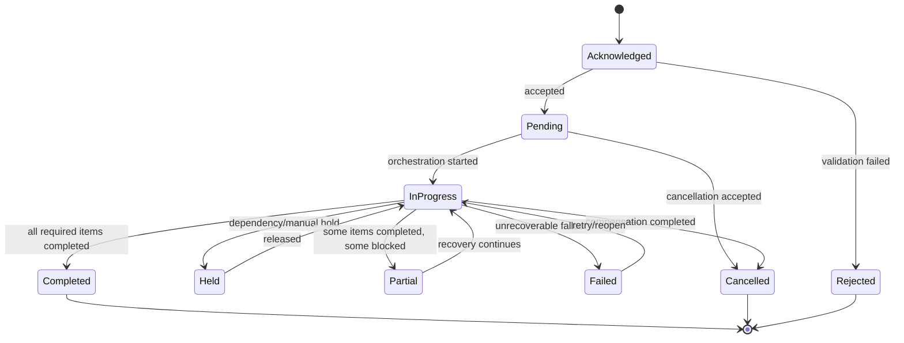
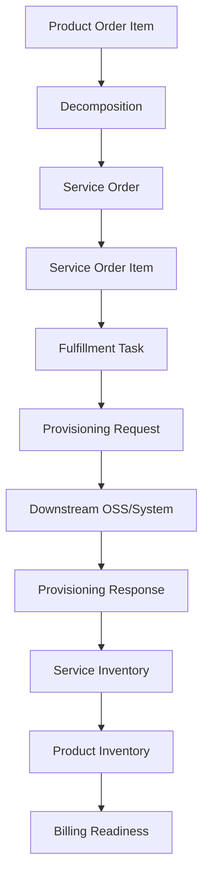
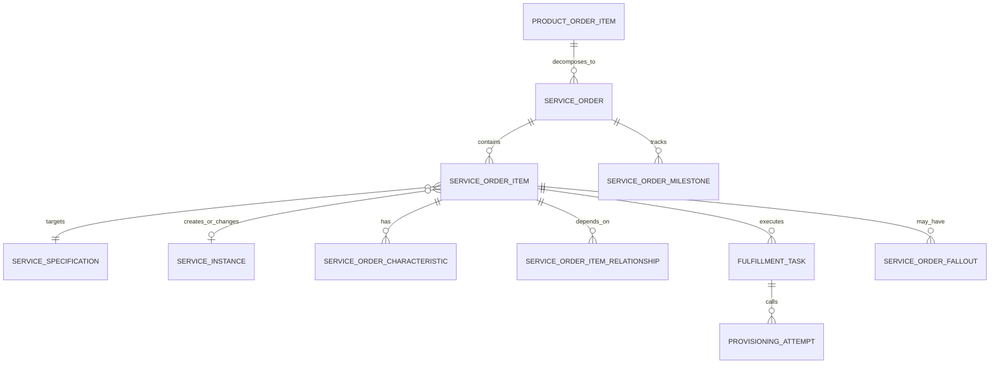

# TMF641 Service Ordering Data Model

Service ordering adalah jembatan antara **commercial product order** dan **technical fulfillment**.

Dalam CPQ/quote-to-cash, product order biasanya merepresentasikan apa yang customer beli secara commercial. Service order merepresentasikan pekerjaan teknis untuk membuat, mengubah, menghentikan, atau mengelola service yang merealisasikan product tersebut.

Secara sederhana:

```text
Quote Item
  -> Product Order Item
  -> Service Order Item
  -> Provisioning / Resource Order / Network Action
  -> Service Inventory
  -> Product Inventory update
  -> Billing activation
```

Service ordering tidak boleh dipahami sebagai duplikasi product order. Ia adalah model eksekusi teknis dengan lifecycle, dependency, fallout, retry, milestone, dan reconciliation sendiri.

---

## 1. Core Mental Model

Service order menjawab:

```text
Apa pekerjaan teknis yang harus dilakukan agar product order dapat direalisasikan sebagai service?
```

Pertanyaan utamanya:

```text
1. Product order item mana yang menyebabkan service order ini?
2. Service apa yang dibuat, diubah, disuspend, diresume, atau dihentikan?
3. Service specification apa yang menjadi target?
4. Characteristic teknis apa yang diminta?
5. Dependency antar service order item apa?
6. Downstream system mana yang bertanggung jawab melakukan fulfillment?
7. Milestone mana yang sudah selesai?
8. Jika gagal, fallout reason dan recovery action apa?
9. Kapan service dianggap completed?
10. Bagaimana service order mengupdate service inventory/product inventory/billing readiness?
```

Service ordering adalah data model untuk **technical intent + execution tracking**.

---

## 2. Product Order vs Service Order

Perbedaan fundamental:

| Concern | Product Order | Service Order |
|---|---|---|
| Layer | Commercial/BSS | Technical/OSS or BSS-OSS bridge |
| Unit utama | Product order item | Service order item |
| Action | Add/modify/disconnect product | Add/modify/delete/suspend/resume service |
| Source | Accepted quote/order capture | Decomposition/orchestration |
| Target | Product inventory/billing | Service inventory/provisioning |
| Data | Product offering/spec/pricing/customer | Service spec/characteristic/dependency/system |
| Failure | Commercial/fulfillment order fallout | Technical provisioning/service fallout |

Product order bisa berkata:

```text
Add Enterprise Internet 1Gbps for Customer A at Site X.
```

Service order bisa berkata:

```text
Create CFS Internet Access with bandwidth=1Gbps, site=X,
then create access circuit,
then assign router configuration,
then activate monitoring.
```

---

## 3. Service Order Header

Service order header adalah container eksekusi teknis.

Common fields:

```text
service_order_id
service_order_number
source_product_order_id
source_product_order_item_id
customer_id / account_id
requested_start_date
requested_completion_date
expected_completion_date
state
priority
external_system_reference
orchestration_reference
created_at
updated_at
```

Header harus menjawab:

```text
Mengapa service order ini ada?
Dari product order mana ia berasal?
Apa status teknis keseluruhan?
Siapa downstream owner/system-nya?
Kapan pekerjaan ini harus selesai?
```

Jangan menyimpan semua detail teknis di header. Detail eksekusi harus berada di item, task, characteristic, relationship, dan milestone.

---

## 4. Service Order Item

Service order item adalah unit kerja teknis.

Common fields:

```text
service_order_item_id
service_order_id
parent_service_order_item_id
source_product_order_item_id
action
state
service_specification_id
service_instance_id
requested_service_payload
sequence_number
dependency_group
assigned_system
created_at
updated_at
```

Service order item biasanya mewakili:

- create new service,
- modify existing service,
- terminate service,
- suspend service,
- resume service,
- migrate service,
- reconfigure service,
- validate serviceability,
- reserve resource,
- activate service.

---

## 5. Service Action Model

Action harus jelas karena action menentukan invariant.

| Action | Meaning | Typical Target |
|---|---|---|
| add | Membuat service baru | Future service instance |
| modify | Mengubah service existing | Existing service instance |
| delete/terminate | Menghentikan service | Existing active/suspended service |
| suspend | Menonaktifkan sementara service | Active service |
| resume | Mengaktifkan kembali service | Suspended service |
| noChange | Referensi service tanpa perubahan | Existing service |
| migrate | Memindahkan service ke platform/spec baru | Existing service + target spec |

Action validity examples:

```text
Cannot resume service that is not suspended.
Cannot terminate service that does not exist.
Cannot add service instance with duplicate external service id.
Cannot modify service if parent product order was cancelled.
Cannot activate service before prerequisite resource is assigned.
```

---

## 6. Service Specification and Service Instance

Service specification mendefinisikan jenis service.

Service instance adalah service aktual.

```text
Service Specification:
  Internet Access CFS
  Required characteristics: bandwidth, access_type, site_id

Service Order Item:
  action = add
  serviceSpecification = Internet Access CFS
  characteristic bandwidth = 1Gbps

Service Instance after completion:
  service_id = SVC-123
  status = active
  bandwidth = 1Gbps
  linked product_instance_id = PI-789
```

Jangan mencampur:

| Model | Meaning |
|---|---|
| Service specification | Definition/template |
| Service order item | Technical intent/change request |
| Service instance | Actual operational service |
| Product instance | Commercial installed product realized by service |

---

## 7. Service Characteristic Model

Service characteristic adalah parameter teknis atau semi-teknis yang dibutuhkan provisioning.

Contoh:

```text
bandwidth
access_type
vlan_id
circuit_type
site_code
router_model
ip_assignment_type
service_class
redundancy_mode
sla_profile
```

Storage pattern mirip product characteristic:

```sql
service_order_item_characteristic
- id
- service_order_item_id
- characteristic_code
- value_text
- value_number
- value_boolean
- value_json
- unit_of_measure
- source
- created_at
```

Characteristic harus memiliki source:

| Source | Example |
|---|---|
| quote configuration | bandwidth selected by sales |
| catalog rule | default service class |
| decomposition | generated service parameter |
| serviceability | coverage result |
| downstream enrichment | assigned VLAN/circuit |
| manual operator | corrected provisioning field |

Tanpa source, sulit menjelaskan kenapa parameter teknis tertentu ada.

---

## 8. Service Relationship Model

Service order item bisa memiliki relationship.

Common relationship:

| Relationship | Meaning |
|---|---|
| dependsOn | Item B hanya jalan setelah Item A completed |
| parentChild | Service composite dipecah menjadi sub-service |
| uses | Service menggunakan service lain |
| replaces | Service baru mengganti service lama |
| backupFor | Service menjadi backup service lain |
| bundledWith | Service bagian dari package fulfillment |

Contoh:

```text
Create Internet Access CFS
  dependsOn Create Access Circuit RFS
  dependsOn Assign Router Resource
  dependsOn Configure Monitoring Service
```

Relationship harus usable untuk orchestration.

Jika relationship hanya disimpan sebagai nested JSON tanpa query/index, fulfillment engine dan diagnostics akan sulit.

---

## 9. Service Order State Model

Service order header dan item biasanya memiliki state berbeda.

Header state dapat derived dari item state atau disimpan langsung dengan guard.

Common state:

```text
acknowledged
rejected
pending
inProgress
held
failed
partial
completed
cancelled
```

Item state bisa lebih detail:

```text
pending
ready
inProgress
waitingDependency
waitingExternal
completed
failed
fallout
cancelled
skipped
```

Rule penting:

```text
Header completed hanya jika semua required item completed/skipped valid.
Header failed jika terminal failure tidak dapat di-recover.
Header partial jika sebagian service completed dan sebagian gagal/held.
Header cancelled tidak boleh menghapus history item yang sudah berjalan.
```

---

## 10. Service Order State Machine



State machine harus mencatat transition history dan reason.

---

## 11. Milestone Model

Milestone adalah titik observability bisnis/operasional.

Contoh milestone:

```text
serviceability checked
resource reserved
technical design completed
provisioning submitted
provisioning completed
activation confirmed
service test passed
customer handover completed
billing ready
```

Milestone table:

```sql
service_order_milestone
- id
- service_order_id
- service_order_item_id
- milestone_code
- status
- planned_at
- achieved_at
- source_system
- external_reference
- correlation_id
```

Milestone penting untuk SLA dan aging report.

---

## 12. Service Fulfillment Model

Service fulfillment adalah eksekusi pekerjaan teknis.

Entities:

```text
ServiceOrder
ServiceOrderItem
FulfillmentTask
ProvisioningRequest
ProvisioningResponse
ServiceOrderMilestone
Fallout
RetryAttempt
ManualIntervention
```

Data flow:



Do not hide fulfillment task inside service order item if task has retries, external attempts, or manual actions.

---

## 13. Decomposition Model

Decomposition transforms product intent into service intent.

Input:

```text
Product order item
Product offering/specification
Configuration
Site/location
Customer/account
Existing inventory
Catalog/service rules
```

Output:

```text
Service order
Service order items
Service characteristics
Dependencies
Assigned downstream systems
Initial milestones
```

Decomposition must be reproducible or at least explainable.

Store:

```text
decomposition_rule_version
decomposition_input_snapshot
decomposition_output_reference
decomposition_decision_trace
```

Without this, debugging “why did we create this service order?” becomes guesswork.

---

## 14. Service Order Fallout Model

Fallout is not just `status = failed`.

Fallout needs structure:

```sql
service_order_fallout
- id
- service_order_id
- service_order_item_id
- fallout_code
- fallout_category
- severity
- source_system
- error_code
- error_message
- retryable
- manual_intervention_required
- assigned_team
- resolution_status
- resolution_note
- created_at
- resolved_at
```

Categories:

| Category | Example |
|---|---|
| validation | missing service characteristic |
| dependency | parent service not complete |
| provisioning | downstream OSS rejected request |
| resource | no resource available |
| timeout | no response from downstream |
| conflict | service already exists or state conflict |
| data mismatch | customer/site/product reference mismatch |
| manual | waiting for engineer/customer/site visit |

---

## 15. Retry and Idempotency

Service ordering must survive retry.

Every external provisioning command should have:

```text
request_id
idempotency_key
service_order_item_id
attempt_number
external_correlation_id
request_payload_hash
status
last_attempt_at
```

Retry rules:

```text
Retry must not create duplicate service.
Retry must not advance service order twice.
Retry must preserve original causation/correlation.
Retry must distinguish unknown outcome from known failure.
```

Unknown outcome is dangerous:

```text
Request timed out.
Downstream may have completed it.
Do not blindly send another create without checking external state or idempotency support.
```

---

## 16. Cancellation and Compensation

Cancelling service order after work started may require compensation.

Examples:

```text
Release reserved resource.
Cancel provisioning request.
Deactivate partially created service.
Reverse service inventory update.
Notify product order orchestration.
Prevent billing activation.
```

Cancellation model should include:

```text
cancellation_request_id
reason
requested_by
requested_at
accepted_at
compensation_status
compensation_task_reference
final_state
```

Do not simply set `cancelled` on header if child tasks already executed.

---

## 17. Conceptual Model



This model separates:

- order intent,
- technical item,
- characteristic,
- dependency,
- task,
- external attempt,
- fallout,
- inventory result.

---

## 18. Logical Model

Logical entities:

```text
ServiceOrder
ServiceOrderItem
ServiceOrderItemCharacteristic
ServiceOrderItemRelationship
ServiceOrderMilestone
ServiceOrderStateHistory
ServiceOrderItemStateHistory
FulfillmentTask
ProvisioningAttempt
ServiceOrderFallout
ServiceOrderCancellation
ServiceOrderExternalReference
```

Logical invariants:

```text
Service order must reference source product order/order item unless externally initiated.
Service order item action must be valid for target service instance state.
Service order item cannot start until required dependencies are complete.
Completed service order item must have completion evidence.
Failed/fallout item must have fallout reason.
Retry attempt must be idempotent.
Cancellation after execution must have compensation trace.
Service inventory update must be traceable to completed service order item.
```

---

## 19. Physical PostgreSQL Considerations

Example service order table:

```sql
create table service_order (
    id uuid primary key,
    tenant_id uuid not null,
    service_order_number text not null,
    source_product_order_id uuid,
    source_product_order_item_id uuid,
    customer_id uuid,
    account_id uuid,
    state text not null,
    priority text,
    requested_start_date timestamptz,
    requested_completion_date timestamptz,
    expected_completion_date timestamptz,
    orchestration_reference text,
    version bigint not null default 0,
    created_at timestamptz not null,
    updated_at timestamptz not null,
    unique (tenant_id, service_order_number)
);
```

Example service order item table:

```sql
create table service_order_item (
    id uuid primary key,
    tenant_id uuid not null,
    service_order_id uuid not null,
    parent_service_order_item_id uuid,
    source_product_order_item_id uuid,
    action text not null,
    state text not null,
    service_specification_id uuid,
    service_instance_id uuid,
    assigned_system text,
    sequence_number integer,
    version bigint not null default 0,
    created_at timestamptz not null,
    updated_at timestamptz not null
);
```

Indexes:

```sql
create index idx_service_order_source_product_order
on service_order (tenant_id, source_product_order_id);

create index idx_service_order_state_date
on service_order (tenant_id, state, created_at);

create index idx_service_order_item_order_state
on service_order_item (tenant_id, service_order_id, state);

create index idx_service_order_item_assigned_system_state
on service_order_item (tenant_id, assigned_system, state);
```

Queue-like queries need careful indexing.

---

## 20. API Model Mapping

API representation should expose service order semantics, not database internals.

Example response shape:

```json
{
  "id": "SO-10001",
  "state": "inProgress",
  "relatedParty": [],
  "serviceOrderItem": [
    {
      "id": "SOI-1",
      "action": "add",
      "state": "inProgress",
      "service": {
        "serviceSpecification": {
          "id": "SPEC-INTERNET-CFS"
        },
        "serviceCharacteristic": []
      }
    }
  ]
}
```

Mapping rules:

```text
Internal IDs should map to stable public IDs/hrefs.
State names must preserve external contract semantics.
Characteristic values should be typed consistently.
Fallout/internal error detail may need separate operational endpoint.
Process/task internals should not leak unless API is operational/internal.
```

---

## 21. Event Model Mapping

Important service order events:

```text
ServiceOrderCreated
ServiceOrderAccepted
ServiceOrderRejected
ServiceOrderStarted
ServiceOrderItemStarted
ServiceOrderItemCompleted
ServiceOrderItemFailed
ServiceOrderHeld
ServiceOrderFalloutRaised
ServiceOrderFalloutResolved
ServiceOrderCompleted
ServiceOrderCancelled
```

Event payload should include:

```text
event_id
event_type
event_version
service_order_id
service_order_item_id
source_product_order_id
source_product_order_item_id
state
action
assigned_system
correlation_id
causation_id
occurred_at
```

Do not publish “completed” until state is durably committed.

Use outbox for consistency.

---

## 22. Java/JAX-RS Backend Implications

Recommended separation:

```text
ServiceOrderResource
  -> ServiceOrderApplicationService
  -> DecompositionService
  -> FulfillmentOrchestrationService
  -> ServiceOrderRepository
  -> OutboxPublisher
  -> DownstreamProvisioningAdapter
```

Avoid controller-level orchestration:

```text
POST /serviceOrder
  -> directly call downstream OSS
  -> update DB later
```

This creates inconsistency when downstream succeeds but DB update fails.

Prefer:

```text
1. Persist service order and item.
2. Persist outbox/work command.
3. Commit transaction.
4. Async worker sends provisioning command.
5. Persist attempt/result.
6. Transition state.
7. Publish event.
```

---

## 23. MyBatis, JPA, and JDBC Considerations

### MyBatis

Useful for:

- explicit queue queries,
- state transition updates,
- milestone dashboards,
- fallout reports,
- reconciliation queries.

Watch for:

- updates without version check,
- state transition bypass,
- missing tenant filter,
- dynamic SQL that ignores assigned system/status.

### JPA

Works if aggregate size is controlled.

Watch for:

- loading entire service order graph unintentionally,
- cascade deleting history/fallout,
- entity mutation outside transition service,
- optimistic locking not applied to item transitions.

### JDBC

Good for high-volume workers and backfills.

Must still write audit/outbox/state history.

---

## 24. Kafka, RabbitMQ, Redis, and Camunda Implications

### Kafka

Good for service order lifecycle events and downstream read models.

Event key options:

```text
service_order_id       -> preserve order-level sequence
service_order_item_id  -> preserve item-level sequence
source_product_order_id -> group by product order flow
```

Choose intentionally.

### RabbitMQ

Good for fulfillment task dispatch.

Messages should be command-like:

```text
ProvisionServiceCommand
ReserveResourceCommand
ActivateServiceCommand
```

Commands must be idempotent.

### Redis

Useful for short-lived orchestration locks or cached task queues, but not source of truth.

Risks:

```text
Lost Redis key must not lose service order state.
Stale lock must not block fulfillment forever.
Cached status must not override DB state.
```

### Camunda

Camunda can orchestrate service order lifecycle.

But domain state must remain in domain tables.

Store references:

```text
process_instance_id
business_key
service_order_id
service_order_item_id
task_id
incident_id
```

Do not store only process variable and assume that is the service order model.

---

## 25. Reporting and Analytics Impact

Service ordering supports operational reports:

- open service orders,
- fulfillment aging,
- milestone SLA,
- fallout count by category,
- retry volume,
- downstream system failure rate,
- service order cycle time,
- product-order-to-service-order conversion rate,
- partial completion rate,
- manual intervention backlog.

Useful facts:

```text
fact_service_order
fact_service_order_item
fact_service_order_milestone
fact_fallout
fact_provisioning_attempt
```

Dimension examples:

```text
dim_customer
dim_product
dim_service_specification
dim_downstream_system
dim_site
dim_team
```

Operational reporting needs current state and history.

---

## 26. Auditability Concerns

Service order audit must answer:

```text
Who/what created this service order?
Which product order item caused it?
Which decomposition rule created each item?
Which downstream system received the request?
What request payload was sent?
What response was received?
Why did state transition happen?
What fallout happened?
Who resolved it?
Was completion evidence received?
```

Audit event examples:

```text
SERVICE_ORDER_CREATED
SERVICE_ORDER_ITEM_STARTED
PROVISIONING_REQUEST_SENT
PROVISIONING_RESPONSE_RECEIVED
FALLOUT_RAISED
MANUAL_INTERVENTION_ASSIGNED
FALLOUT_RESOLVED
SERVICE_ORDER_COMPLETED
```

---

## 27. Security and Privacy Concerns

Service order data may contain:

- customer/site details,
- service topology,
- resource identifiers,
- provisioning payload,
- network configuration,
- internal system names,
- operational failure details.

Access rules may differ by user group:

| Role | Access Concern |
|---|---|
| Sales | Should see high-level fulfillment status, not network details |
| Support | Needs status/fallout but maybe not full payload |
| Fulfillment engineer | Needs technical details |
| Billing user | Needs billing readiness, not provisioning secret |
| External partner | Needs scoped service order contract only |

Avoid exposing raw provisioning payload through public APIs.

---

## 28. Production Failure Modes

| Failure Mode | Typical Cause | Detection |
|---|---|---|
| Service order not created | Decomposition failure | Product order without service order |
| Duplicate service order | Retry without idempotency | Duplicate source product order item |
| Service item stuck waiting dependency | Missing transition/event | Aging query by waitingDependency |
| Header completed but item failed | Bad aggregation logic | Header-item consistency check |
| Downstream completed but DB failed | Non-transactional integration | Provisioning reconciliation |
| Fallout without reason | Weak error model | Failed item missing fallout row |
| Retry created duplicate service | Missing idempotency key | External duplicate reconciliation |
| Product inventory not updated | Completion event lost | Service completed without inventory update |
| Billing activated too early | Wrong milestone trigger | Billing readiness reconciliation |
| Cancellation lost partial work | No compensation model | Cancelled order with active service/resource |

---

## 29. Debugging Service Ordering Issues

Debugging flow:

```text
1. Start from product_order_id/product_order_item_id.
2. Find related service_order/service_order_item.
3. Check decomposition trace/rule version.
4. Check service order/item current state.
5. Check state transition history.
6. Check dependencies between service order items.
7. Check fulfillment tasks and provisioning attempts.
8. Check downstream request/response/correlation ID.
9. Check fallout records and retry attempts.
10. Check service inventory update.
11. Check product inventory update.
12. Check billing readiness trigger.
13. Check event outbox/inbox and projection freshness.
```

Questions to ask:

```text
Was service order created correctly?
Was it accepted by downstream?
Is it stuck because of dependency, external wait, manual hold, or data error?
Was completion acknowledged but not consumed?
Did retry create duplicate external work?
Did cancellation require compensation?
```

---

## 30. Trade-Offs

| Decision | Benefit | Risk |
|---|---|---|
| Store service order graph relationally | Queryable, auditable | More tables/mapping complexity |
| Store payload as JSONB | Flexible integration | Weak constraints, harder reporting |
| Derive header state from items | Avoid inconsistency | Expensive and complex queries |
| Store header state | Fast access | Needs aggregation correctness |
| Use workflow engine as orchestrator | Visible process management | Risk of process state replacing domain state |
| Direct synchronous provisioning | Simple request path | Fragile under timeout/partial failure |
| Async fulfillment tasks | Resilient/retryable | More eventual consistency |
| Full payload retention | Debuggable | Privacy/storage concerns |

---

## 31. PR Review Checklist

When reviewing service ordering changes, ask:

- Is this product order concern or service order concern?
- Is decomposition traceable?
- Is service order item action valid for current service state?
- Are dependencies explicit and queryable?
- Is header state consistent with item states?
- Are milestones modelled separately from state?
- Is fallout structured with reason/category/severity?
- Is retry idempotent?
- Is cancellation/compensation handled?
- Are downstream request/response/correlation IDs persisted?
- Are state transitions audited?
- Are external payloads protected and retained appropriately?
- Are API DTO, DB entity, event, and workflow variables separated?
- Does reporting have current state and history?
- Is there reconciliation with service inventory/product inventory/billing?

---

## 32. Internal Verification Checklist

Verify in internal CSG/team context:

- Is TMF641 used directly, partially mapped, or only conceptually referenced?
- Which service owns service order creation?
- Is service order created by order decomposition, Camunda workflow, adapter, or downstream OSS?
- What are official service order states and item states?
- Is header state derived or stored?
- How are service order item dependencies represented?
- Are service characteristics relational, JSONB, or hybrid?
- Is decomposition rule version stored?
- Is there a decomposition trace or snapshot?
- How are downstream system references stored?
- Are provisioning attempts persisted?
- Are request/response payloads retained? For how long?
- Is fallout reason taxonomy standardized?
- Are retry attempts idempotent?
- How is unknown outcome handled after timeout?
- How is cancellation/compensation modelled?
- Does service order update service inventory?
- Does service inventory update product inventory?
- Which milestone triggers billing readiness?
- Are service order events published through outbox?
- Are service order projections/search indexes refreshed reliably?
- Are SLA/aging dashboards available?
- Is there TMF641 mapping documentation and known deviation list?

---

## 33. Key Takeaways

Service ordering is the data model for **technical execution of commercial intent**.

It should not be collapsed into product order, provisioning request, workflow process instance, or service inventory.

A production-grade service ordering model needs:

- source product order traceability,
- service order and service order item lifecycle,
- explicit action semantics,
- service specification and characteristic mapping,
- dependency graph,
- milestone tracking,
- fulfillment task and provisioning attempt records,
- structured fallout,
- retry/idempotency model,
- cancellation/compensation model,
- service inventory/product inventory/billing readiness linkage,
- audit and reconciliation support.

The core correctness question:

```text
Can we explain, from data alone, what technical work was required, what happened, what failed, what was retried, what completed, and how it changed service/product/billing state?
```

If the answer is no, service ordering is not yet production-grade.
