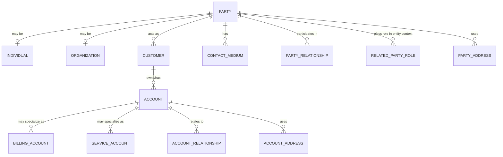
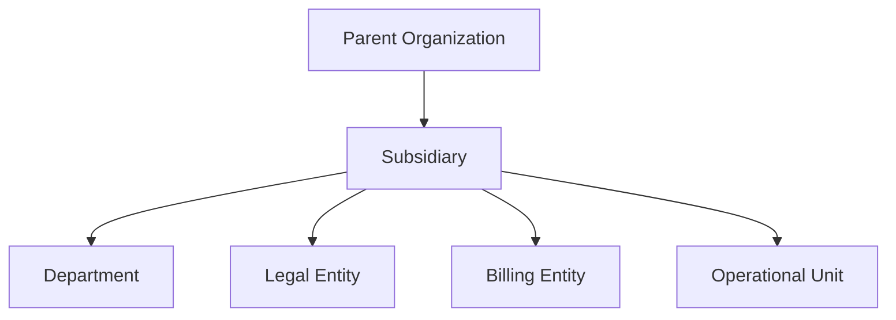
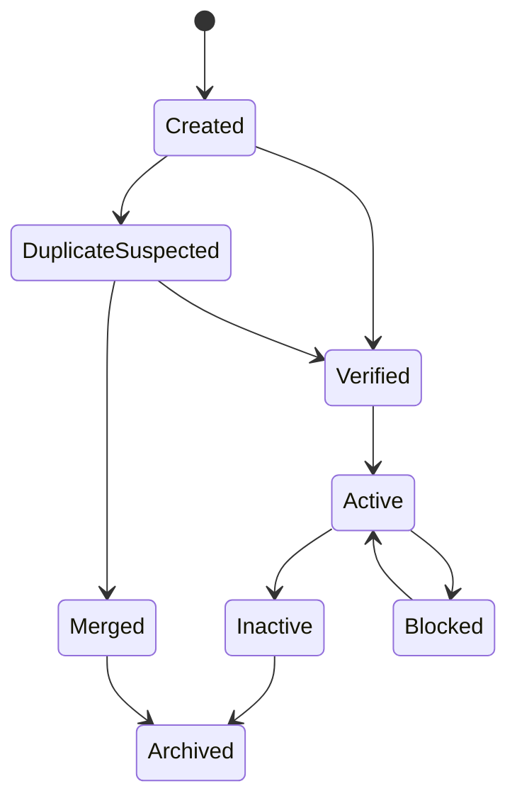
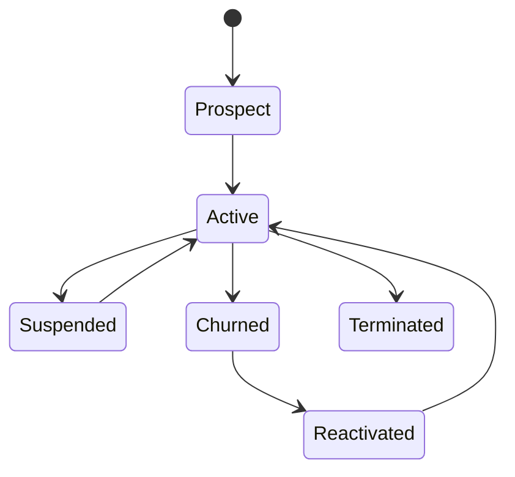

# Part 013 — Party, Customer, Account, and Contact Model

## 1. Core Idea

Dalam enterprise CPQ, Quote, Order, Catalog, Billing, dan Telco BSS/OSS system, **customer model bukan sekadar tabel `customer`**.

Biasanya ada beberapa konsep yang terlihat mirip, tetapi memiliki tanggung jawab berbeda:

- **Party**: entitas dasar yang merepresentasikan orang atau organisasi.
- **Individual**: party berupa manusia.
- **Organization**: party berupa perusahaan, grup, divisi, badan hukum, atau unit bisnis.
- **Customer**: party yang memiliki hubungan komersial sebagai pembeli/pelanggan.
- **Account**: container relasi operasional/komersial terhadap customer, sering dipakai untuk billing, service, ordering, ownership, atau reporting.
- **Billing Account**: account yang bertanggung jawab terhadap invoice, payment, tax, currency, dan billing cycle.
- **Service Account**: account atau grouping yang merepresentasikan penerima layanan/installed service.
- **Contact**: orang atau channel komunikasi yang bisa dihubungi untuk fungsi tertentu.
- **Contact Medium**: email, phone, address, portal account, atau channel komunikasi lain.
- **Address/Site/Location**: data lokasi dengan makna berbeda tergantung konteks: billing address, installation address, service address, legal address.
- **Related Party**: party yang memiliki role terhadap entity lain, misalnya buyer, approver, payer, service owner, contract signatory.

Kesalahan umum adalah menjadikan `customer` sebagai tempat semua hal:

```text
customer.name
customer.email
customer.phone
customer.billing_address
customer.service_address
customer.tax_id
customer.account_number
customer.contract_signer
customer.approver
customer.parent_customer_id
customer.contact_person
```

Model seperti itu cepat terlihat praktis, tetapi biasanya gagal saat sistem harus mendukung:

- enterprise B2B hierarchy,
- multi-account customer,
- multi-site quote,
- billing responsibility berbeda dari service owner,
- contact person lebih dari satu,
- legal entity berbeda dari operational buyer,
- acquisition/merger/customer restructure,
- migration dari CRM atau billing system,
- account-level permissions,
- quote/order ownership,
- audit dan compliance.

Mental model yang lebih benar:

> **Party adalah identitas. Customer adalah role komersial. Account adalah container relasi bisnis/operasional. Contact adalah cara berkomunikasi. Role menjelaskan kapasitas party terhadap entity tertentu.**

---

## 2. Why This Model Exists

Party/customer/account model ada karena enterprise system harus memisahkan beberapa pertanyaan yang berbeda:

| Pertanyaan | Model yang biasanya menjawab |
|---|---|
| Siapa orang atau organisasi sebenarnya? | Party / Individual / Organization |
| Apakah party ini pelanggan? | Customer |
| Siapa yang membeli? | Customer / Buyer related party |
| Siapa yang membayar? | Billing Account / Payer role |
| Siapa yang menerima service? | Service Account / Site / Product Inventory |
| Siapa yang boleh approve discount? | User / Role / Commercial Authority / Related Party |
| Siapa yang menandatangani kontrak? | Agreement related party / Signatory role |
| Alamat mana untuk invoice? | Billing address |
| Alamat mana untuk install/provisioning? | Service/installation address |
| Siapa yang dihubungi saat order fallout? | Contact with operational/support role |
| Siapa owner account di sales team? | Account owner / Sales rep role |

Jika semua pertanyaan ini dijawab oleh satu field `customer_id`, maka ambiguity akan muncul.

Contoh problem:

```text
Quote Q-100 dibuat untuk Organization A.
Invoice harus dikirim ke Billing Entity B.
Service dipasang di Site C.
Approver berasal dari Department D.
Contract ditandatangani oleh Legal Entity E.
Support contact adalah Person F.
```

Jika sistem hanya punya `quote.customer_id`, maka data model tidak cukup untuk menjawab:

- siapa yang bertanggung jawab membayar,
- siapa pemilik kontrak,
- siapa penerima service,
- siapa kontak operasional,
- siapa legal party,
- siapa yang boleh approve,
- siapa yang harus muncul di invoice,
- siapa yang harus dipakai dalam reporting revenue.

---

## 3. Conceptual Model

Secara konseptual, model dapat dipahami sebagai berikut:



Konsep penting:

1. **Party bukan selalu customer**. Vendor, partner, reseller, approver, contact person, dan organization unit bisa berupa party.
2. **Customer adalah role**. Party menjadi customer ketika ada commercial relationship.
3. **Account bukan identitas orang/perusahaan**. Account adalah container bisnis, billing, service, atau operational grouping.
4. **Contact medium bukan customer**. Email/phone/address adalah cara komunikasi, bukan identitas utama.
5. **Role selalu kontekstual**. Party bisa menjadi buyer pada quote, payer pada billing account, signatory pada agreement, dan service contact pada order.

---

## 4. Party vs Customer vs Account

### 4.1 Party

Party adalah entity paling dasar untuk identity modelling.

Contoh:

```text
Party P-001 = PT Alpha Telekomunikasi
Party P-002 = Jane Doe
Party P-003 = Alpha Subsidiary Singapore
```

Party menjawab:

- siapa entity-nya,
- apakah individual atau organization,
- apa identitas legal/basic-nya,
- apa relation-nya dengan party lain.

Party tidak selalu menjawab:

- apakah dia pelanggan aktif,
- billing cycle-nya apa,
- invoice dikirim ke mana,
- produk apa yang sedang aktif,
- siapa account owner,
- apa service address.

### 4.2 Individual

Individual adalah party manusia.

Contoh attribute:

- legal name,
- preferred name,
- salutation,
- date of birth jika relevan dan legal,
- identity reference jika diperlukan,
- employment/organization relation,
- contact mediums.

Dalam B2B CPQ, individual sering muncul sebagai:

- buyer,
- quote requester,
- approver,
- contract signatory,
- technical contact,
- billing contact,
- support contact.

### 4.3 Organization

Organization adalah party non-manusia.

Contoh:

- company,
- subsidiary,
- department,
- branch,
- government agency,
- legal entity,
- reseller,
- partner.

Organization sering membutuhkan hierarchy:



Hierarchy ini tidak selalu tree murni. Kadang ada multiple relationship type:

- parent/subsidiary,
- legal ownership,
- billing responsibility,
- operational reporting,
- contract coverage,
- reseller/partner relationship.

### 4.4 Customer

Customer adalah party yang memiliki commercial relationship.

Customer menjawab:

- sejak kapan party menjadi customer,
- segment customer,
- status customer,
- customer lifecycle,
- account relationship,
- commercial classification,
- CRM/customer master reference.

Customer bisa memiliki banyak account.

```text
Customer CUST-001
  Account ACC-SALES-001
  Billing Account BA-001
  Service Account SA-JAKARTA-001
  Service Account SA-SURABAYA-001
```

### 4.5 Account

Account adalah grouping operasional/komersial yang sering menjadi anchor untuk quote, order, billing, service, ownership, dan reporting.

Account dapat berupa:

- customer account,
- billing account,
- service account,
- sales account,
- contract account,
- parent account,
- child account.

Yang perlu dijaga:

> Account bukan selalu customer, dan customer bukan selalu account.

Dalam banyak sistem enterprise, `account` sering menjadi istilah CRM yang overloaded. Karena itu, internal verification sangat penting.

---

## 5. Billing Account vs Service Account

### 5.1 Billing Account

Billing account menjawab:

- invoice ditagihkan ke siapa,
- billing cycle apa,
- currency apa,
- tax profile apa,
- payment method apa,
- invoice preference apa,
- billing contact siapa,
- credit profile apa,
- legal/tax address mana.

Billing account harus stabil karena downstream billing dan invoice sangat sensitif terhadap perubahan.

Example fields:

```text
billing_account_id
customer_id
billing_account_number
billing_cycle_id
currency_code
tax_profile_id
payment_method_ref
invoice_delivery_method
billing_contact_party_id
billing_address_id
status
valid_from
valid_to
```

### 5.2 Service Account

Service account menjawab:

- service diberikan untuk siapa atau unit mana,
- site/location mana,
- installed product/service mana,
- operational contact siapa,
- support responsibility bagaimana,
- service hierarchy seperti apa.

Example fields:

```text
service_account_id
customer_id
account_number
site_id
service_contact_party_id
support_level
status
valid_from
valid_to
```

### 5.3 Failure Jika Keduanya Dicampur

Jika billing account dan service account dicampur:

- invoice bisa dikirim ke alamat install,
- service order bisa memakai tax/billing address yang salah,
- reporting revenue per site menjadi salah,
- payment responsibility menjadi ambigu,
- disconnect service bisa salah memengaruhi billing entity,
- audit dispute sulit dijawab.

---

## 6. Contact and Contact Medium Model

Contact sering terlihat sederhana, tetapi dalam enterprise system contact adalah sumber banyak bug.

### 6.1 Contact Medium

Contact medium adalah cara menghubungi party.

Contoh:

- email,
- mobile phone,
- office phone,
- postal address,
- portal account,
- messaging handle.

Contact medium perlu metadata:

```text
contact_medium_id
party_id
type
value
purpose
is_primary
valid_from
valid_to
verified_at
verification_status
privacy_classification
```

### 6.2 Contact Role

Satu contact bisa memiliki role berbeda:

- quote requester,
- billing contact,
- technical contact,
- legal contact,
- installation contact,
- escalation contact,
- approver,
- buyer,
- service owner.

Model yang lebih aman:

```text
related_party_role
  entity_type = QUOTE | ORDER | AGREEMENT | BILLING_ACCOUNT | SERVICE_ACCOUNT
  entity_id
  party_id
  role_type
  valid_from
  valid_to
```

Dengan begitu, party yang sama bisa punya role berbeda di konteks berbeda.

---

## 7. Related Party Pattern

Related party pattern digunakan saat sebuah entity perlu menyimpan relasi dengan party tanpa mengubah struktur entity utama.

Contoh pada quote:

```text
Quote Q-100
  related party:
    - Customer: PT Alpha
    - Buyer: Jane Doe
    - Sales Rep: John Smith
    - Approver: VP Sales
    - Billing Contact: Finance Team Alpha
```

Contoh pada agreement:

```text
Agreement A-200
  related party:
    - Contracting Party: PT Alpha
    - Provider: Telco Provider
    - Signatory: Legal Director
    - Commercial Owner: Account Manager
```

### 7.1 Benefit

Related party membuat model fleksibel:

- tidak perlu menambah kolom `buyer_id`, `approver_id`, `signatory_id`, `payer_id` di setiap table,
- role bisa versioned,
- role bisa effective-dated,
- historical role bisa diaudit,
- cocok untuk API model seperti TM Forum yang sering memakai related party references.

### 7.2 Risk

Related party juga punya risiko:

- role type terlalu bebas,
- tidak ada constraint role wajib,
- sulit query jika tidak diindeks,
- role semantics berbeda antar service,
- reporting perlu pivot/denormalization.

Karena itu related party harus punya controlled vocabulary dan validation rule.

---

## 8. Lifecycle Model

Party/customer/account/contact memiliki lifecycle masing-masing.

### 8.1 Party Lifecycle



Common states:

- created,
- verified,
- duplicate suspected,
- merged,
- active,
- inactive,
- blocked,
- archived.

### 8.2 Customer Lifecycle



Customer lifecycle dapat berbeda dari party lifecycle. Party bisa tetap ada meskipun customer sudah churned.

### 8.3 Account Lifecycle

Account states:

- draft,
- pending validation,
- active,
- suspended,
- closed,
- merged,
- archived.

Billing account lifecycle sangat sensitif karena invoice dan payment history tidak boleh hilang.

### 8.4 Contact Medium Lifecycle

Contact medium states:

- unverified,
- verified,
- invalid,
- expired,
- replaced,
- suppressed,
- deleted/removed if allowed.

---

## 9. Key Entities and Relationships

### 9.1 Conceptual Entity List

| Entity | Purpose |
|---|---|
| Party | Base identity for person or organization |
| Individual | Person-specific attributes |
| Organization | Company/unit/legal entity-specific attributes |
| Customer | Commercial customer role |
| Account | Business/operational grouping |
| Billing Account | Invoice/payment/tax responsibility |
| Service Account | Service ownership/location grouping |
| Contact Medium | Email/phone/address/channel |
| Address | Structured physical/geographic address |
| Party Relationship | Party-to-party relation |
| Account Relationship | Account-to-account relation |
| Related Party Role | Contextual role of party against another entity |

### 9.2 Logical Relationship Rules

Possible rules:

```text
Party may be Individual or Organization.
Customer must reference one Party.
Customer may have many Accounts.
Account must belong to one Customer or one Party depending on internal model.
BillingAccount specializes Account or references Account.
ServiceAccount specializes Account or references Account.
Party may have many ContactMedium entries.
RelatedPartyRole must reference a valid Party and valid entity context.
Address may be reused, but usage must specify purpose.
```

### 9.3 Role Relationship

Role is often more important than relationship alone.

```text
Party A related to Quote Q-100 as BUYER.
Party A related to Billing Account BA-001 as BILLING_CONTACT.
Party B related to Agreement AG-001 as SIGNATORY.
Party C related to Order O-001 as INSTALLATION_CONTACT.
```

The same party can play multiple roles.

---

## 10. Invariants

Important invariants:

### 10.1 Party Invariants

- A party must have exactly one party type: individual or organization.
- A party identifier must be stable.
- A merged party must retain traceability to original party IDs.
- A deleted party must not break audit, invoice, quote, order, or agreement history.

### 10.2 Customer Invariants

- A customer must reference a valid party.
- A customer cannot be active if required identity validation is missing.
- Customer status changes must be auditable.
- Customer segment changes must not silently rewrite historical quote/order reporting.

### 10.3 Account Invariants

- Billing account must have billing responsibility metadata.
- Active billing account must have billing cycle and currency.
- Service account must not be used as payer unless explicitly allowed.
- Closed account must not accept new quote/order unless reopening flow exists.

### 10.4 Contact Invariants

- Primary contact per purpose should be unique within context.
- Contact medium used for invoice delivery must be valid/verified according to policy.
- Expired contact must not be used for new communication.
- Sensitive contact data must follow privacy and access-control policy.

### 10.5 Cross-Entity Invariants

- Quote customer must be compatible with quote account.
- Order billing account must be compatible with order customer.
- Agreement party must be compatible with quote/order customer.
- Product inventory customer/account must trace back to source order.
- Billing account on installed product must not conflict with invoice account.

---

## 11. Conceptual, Logical, and Physical Modelling

### 11.1 Conceptual Model

Conceptual model focuses on meaning:

```text
Party represents identity.
Customer represents commercial relationship.
Account represents business grouping.
Billing Account represents payer responsibility.
Service Account represents service ownership/usage grouping.
Contact Medium represents communication channel.
Related Party Role represents contextual involvement.
```

### 11.2 Logical Model

Logical model introduces normalized entities:

```text
party
individual
organization
customer
account
billing_account
service_account
contact_medium
address
party_address
party_relationship
account_relationship
related_party_role
```

### 11.3 Physical PostgreSQL Model Example

Example simplified schema:

```sql
CREATE TABLE party (
    party_id UUID PRIMARY KEY,
    party_type TEXT NOT NULL CHECK (party_type IN ('INDIVIDUAL', 'ORGANIZATION')),
    display_name TEXT NOT NULL,
    status TEXT NOT NULL,
    external_ref TEXT,
    created_at TIMESTAMPTZ NOT NULL,
    updated_at TIMESTAMPTZ NOT NULL
);

CREATE TABLE individual (
    party_id UUID PRIMARY KEY REFERENCES party(party_id),
    given_name TEXT,
    family_name TEXT,
    preferred_name TEXT
);

CREATE TABLE organization (
    party_id UUID PRIMARY KEY REFERENCES party(party_id),
    legal_name TEXT NOT NULL,
    registration_number TEXT,
    organization_type TEXT
);

CREATE TABLE customer (
    customer_id UUID PRIMARY KEY,
    party_id UUID NOT NULL REFERENCES party(party_id),
    customer_number TEXT NOT NULL UNIQUE,
    status TEXT NOT NULL,
    segment TEXT,
    valid_from TIMESTAMPTZ,
    valid_to TIMESTAMPTZ,
    created_at TIMESTAMPTZ NOT NULL
);

CREATE TABLE account (
    account_id UUID PRIMARY KEY,
    customer_id UUID NOT NULL REFERENCES customer(customer_id),
    account_number TEXT NOT NULL UNIQUE,
    account_type TEXT NOT NULL,
    status TEXT NOT NULL,
    parent_account_id UUID REFERENCES account(account_id),
    created_at TIMESTAMPTZ NOT NULL
);

CREATE TABLE contact_medium (
    contact_medium_id UUID PRIMARY KEY,
    party_id UUID NOT NULL REFERENCES party(party_id),
    medium_type TEXT NOT NULL,
    medium_value TEXT NOT NULL,
    purpose TEXT,
    is_primary BOOLEAN NOT NULL DEFAULT FALSE,
    verification_status TEXT NOT NULL,
    valid_from TIMESTAMPTZ,
    valid_to TIMESTAMPTZ
);
```

This is illustrative, not an internal schema recommendation.

---

## 12. API Model Mapping

API model should not expose internal schema blindly.

### 12.1 Customer API Example

```json
{
  "id": "cust-123",
  "name": "PT Alpha Telekomunikasi",
  "status": "ACTIVE",
  "party": {
    "id": "party-001",
    "type": "ORGANIZATION"
  },
  "accounts": [
    {
      "id": "acc-001",
      "type": "BILLING",
      "status": "ACTIVE"
    }
  ]
}
```

### 12.2 Related Party API Example

```json
{
  "role": "BILLING_CONTACT",
  "party": {
    "id": "party-200",
    "name": "Finance Operations"
  },
  "contactMedium": {
    "type": "EMAIL",
    "value": "billing@example.com"
  }
}
```

### 12.3 API Contract Concern

Do not leak:

- internal surrogate IDs if public IDs should be used,
- internal status names if external contract uses different lifecycle,
- sensitive contact data,
- raw hierarchy implementation,
- internal merge/de-duplication metadata,
- billing/tax details to unauthorized clients.

---

## 13. Event Model Mapping

Events should represent meaningful business changes.

Example events:

```text
CustomerCreated
CustomerActivated
CustomerSuspended
CustomerMerged
AccountCreated
BillingAccountUpdated
ContactMediumVerified
RelatedPartyRoleAssigned
RelatedPartyRoleExpired
CustomerHierarchyChanged
```

### 13.1 Event Payload Example

```json
{
  "eventId": "evt-001",
  "eventType": "BillingAccountUpdated",
  "eventVersion": 1,
  "occurredAt": "2026-07-12T10:00:00Z",
  "aggregateId": "ba-001",
  "correlationId": "corr-123",
  "payload": {
    "billingAccountId": "ba-001",
    "customerId": "cust-123",
    "changedFields": ["billingCycle", "invoicePreference"],
    "effectiveFrom": "2026-08-01T00:00:00Z"
  }
}
```

### 13.2 Event Design Rules

- Use stable IDs.
- Include role/context when emitting related party changes.
- Avoid exposing PII unless required and approved.
- Version events.
- Include correlation and causation IDs.
- Make consumer assumptions explicit.

---

## 14. Java/JAX-RS Backend Impact

In Java/JAX-RS services, common mapping layers:

```text
JAX-RS Resource
  -> Request DTO
  -> Application Service
  -> Domain Model / Aggregate
  -> Repository
  -> Persistence Entity / Mapper
  -> PostgreSQL
```

For party/customer/account, avoid this anti-pattern:

```text
REST DTO == JPA Entity == Domain Object == Event Payload
```

Better:

- DTO controls external contract.
- Domain model controls behavior/invariant.
- Persistence model controls schema mapping.
- Event model controls integration semantics.
- Read model controls UI/reporting access pattern.

### 14.1 MyBatis/JPA/JDBC Concerns

With MyBatis:

- explicit SQL is good for complex account/hierarchy queries,
- mapper should not hide N+1 behavior,
- result maps must be reviewed carefully for nested account/contact graphs.

With JPA:

- avoid lazy-loading explosions on customer/account/contact graph,
- avoid exposing entity directly in JAX-RS response,
- be careful with cascade delete on customer/account/contact.

With JDBC:

- keep row mapping explicit,
- centralize status/role mapping,
- validate transaction boundaries for multi-table updates.

---

## 15. Kafka, RabbitMQ, Redis, and Camunda Impact

### 15.1 Kafka/RabbitMQ

Customer/account changes often feed:

- quote service,
- order service,
- billing service,
- reporting projections,
- CRM sync,
- search index,
- access-control cache.

Risks:

- stale customer data,
- out-of-order account updates,
- duplicate customer activation event,
- consumer misinterpreting role type,
- PII leakage in event payload.

### 15.2 Redis

Redis may cache:

- customer summary,
- account eligibility,
- billing account lookup,
- contact lookup,
- access-control data.

Use versioned cache keys when customer/account changes affect quote/order correctness.

### 15.3 Camunda

Workflow processes may reference:

- customer ID,
- account ID,
- quote requester,
- approver,
- billing contact,
- service contact.

Do not store full customer/account object as long-lived process variable unless you understand staleness and privacy risk.

---

## 16. Reporting and Analytics Impact

Reporting questions:

- quote volume by customer segment,
- order aging by account,
- revenue by billing account,
- churn by customer hierarchy,
- product inventory by service account,
- discount approval by sales team,
- multi-site quote performance,
- billing dispute by payer.

Operational reporting often needs denormalized read models:

```text
customer_summary_read_model
account_hierarchy_read_model
billing_account_report_dim
customer_contact_report_dim
```

Do not let reporting needs corrupt OLTP model. Build projections when needed.

---

## 17. Auditability Concerns

Audit must answer:

- who created customer/account,
- who changed billing contact,
- when billing account became active,
- why customer was suspended,
- what previous tax profile was,
- which quote used which customer snapshot,
- which order used which billing account,
- whether contact was valid at invoice time.

Important audit fields:

```text
created_by
created_at
updated_by
updated_at
change_reason
correlation_id
source_system
before_value
after_value
effective_from
effective_to
```

---

## 18. Security and Privacy Concerns

Sensitive data may include:

- personal name,
- email,
- phone,
- address,
- tax ID,
- company registration number,
- billing contact,
- contract signatory,
- customer hierarchy,
- commercial relationship,
- credit profile.

Security considerations:

- field-level masking,
- role-based visibility,
- tenant isolation,
- audit access,
- retention policy,
- data minimization in events,
- search index privacy,
- log redaction.

Do not publish contact payload broadly through Kafka if only one downstream system needs it.

---

## 19. Failure Modes

Common failure modes:

| Failure mode | Likely cause | Detection |
|---|---|---|
| Quote attached to wrong account | ambiguous customer/account selection | quote-account compatibility query |
| Invoice sent to wrong party | billing contact/address mismatch | billing account audit/reconciliation |
| Service installed at wrong site | address role confusion | order vs site validation |
| Duplicate customer | weak identity matching | duplicate detection job |
| Customer merge breaks orders | missing old-to-new party mapping | referential audit query |
| Contact expired but still used | missing validity check | contact validity scan |
| Billing account closed but order accepted | missing lifecycle guard | order validation rule |
| Reporting revenue under wrong hierarchy | hierarchy snapshot missing | reporting reconciliation |
| PII leaked in event | event payload overexposure | schema/security review |

---

## 20. Debugging Data Issues

When debugging customer/account/contact issue, ask:

1. What entity is wrong: party, customer, account, billing account, service account, contact, or role?
2. Was the wrong value copied as snapshot or referenced dynamically?
3. What was the effective date at quote/order/billing time?
4. Which system was source of truth?
5. Which API/event changed the data?
6. Was there an out-of-order event?
7. Was there a customer merge or account hierarchy change?
8. Did reporting use current hierarchy instead of historical hierarchy?
9. Was contact/address role interpreted incorrectly?
10. Is this data wrong in OLTP, read model, search index, or downstream billing?

Example diagnostic queries:

```sql
-- Active quotes referencing inactive accounts
SELECT q.quote_id, q.status, q.account_id, a.status AS account_status
FROM quote q
JOIN account a ON a.account_id = q.account_id
WHERE q.status IN ('DRAFT', 'SUBMITTED', 'APPROVED')
  AND a.status <> 'ACTIVE';

-- Billing accounts without active billing contact
SELECT ba.billing_account_id
FROM billing_account ba
LEFT JOIN related_party_role rpr
  ON rpr.entity_type = 'BILLING_ACCOUNT'
 AND rpr.entity_id = ba.billing_account_id
 AND rpr.role_type = 'BILLING_CONTACT'
 AND (rpr.valid_to IS NULL OR rpr.valid_to > now())
WHERE ba.status = 'ACTIVE'
  AND rpr.related_party_role_id IS NULL;
```

Adapt these to actual internal schema.

---

## 21. Trade-Offs

### Normalized Party Model

Pros:

- strong semantics,
- less duplication,
- better identity management,
- supports hierarchy and role modelling.

Cons:

- more joins,
- harder queries,
- requires strong glossary,
- reporting needs projections.

### Denormalized Customer Model

Pros:

- simpler early implementation,
- faster simple reads,
- easier UI forms.

Cons:

- ambiguity,
- duplication,
- weak audit,
- hard enterprise hierarchy,
- risky billing/contact handling.

### Related Party Pattern

Pros:

- flexible,
- reusable,
- role-based,
- aligns with integration models.

Cons:

- weaker compile-time structure,
- more validation needed,
- role explosion,
- query/report complexity.

---

## 22. PR Review Checklist

When reviewing changes involving party/customer/account/contact:

- Is party/customer/account distinction clear?
- Is billing account distinct from service account?
- Are roles explicit instead of implicit field naming?
- Are addresses purpose-specific?
- Is contact validity checked?
- Is hierarchy effective-dated if needed?
- Are customer/account changes audited?
- Are API DTOs separated from persistence schema?
- Are events privacy-safe?
- Are query paths indexed?
- Is customer/account compatibility validated in quote/order?
- Are reporting impacts considered?
- Is customer merge/deactivation handled?
- Are tenant/security rules enforced?

---

## 23. Internal Verification Checklist

Verify in internal CSG/team context:

- What is the authoritative source for customer data?
- Is customer mastered internally, in CRM, or external system?
- What is the difference between customer, party, and account in internal terminology?
- Does the system have billing account and service account separation?
- How are account hierarchies represented?
- How are contacts represented and validated?
- Are billing, legal, service, and installation addresses separated?
- How are related parties represented in quote/order/agreement?
- What fields are snapshots on quote/order?
- What fields are dynamic references?
- How are customer/account updates propagated to services?
- What Kafka/RabbitMQ events exist for customer/account/contact changes?
- Are events PII-safe?
- How are customer merges handled?
- How are closed/suspended customers prevented from new quotes/orders?
- How does reporting handle historical customer hierarchy?
- What incidents have happened due to wrong customer/account/contact data?
- Which senior engineer, solution architect, BA, DBA, or product owner owns the glossary?

---

## 24. Senior Engineer Mental Model

A senior engineer should not ask only:

> Which table stores customer?

Ask instead:

> Which concept does this data represent: identity, commercial relationship, billing responsibility, service ownership, contact channel, legal party, operational role, or reporting dimension?

The correctness of CPQ and quote-to-cash depends heavily on this distinction.

If party/customer/account/contact are modelled poorly, later parts of the system become fragile:

- quote approval becomes ambiguous,
- order ownership becomes unclear,
- billing account mapping breaks,
- service inventory cannot be reconciled,
- reporting hierarchy becomes misleading,
- audit cannot answer dispute questions,
- security/privacy leaks become likely.

Good customer modelling is not CRM decoration. It is a foundation for quote, order, billing, inventory, agreement, access control, reporting, and production support.

