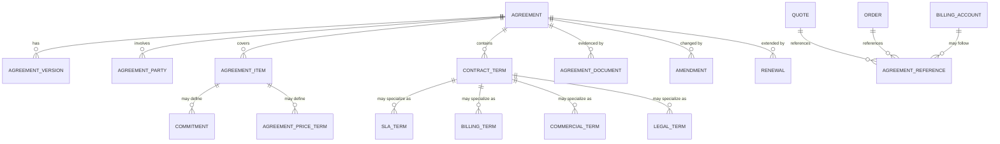
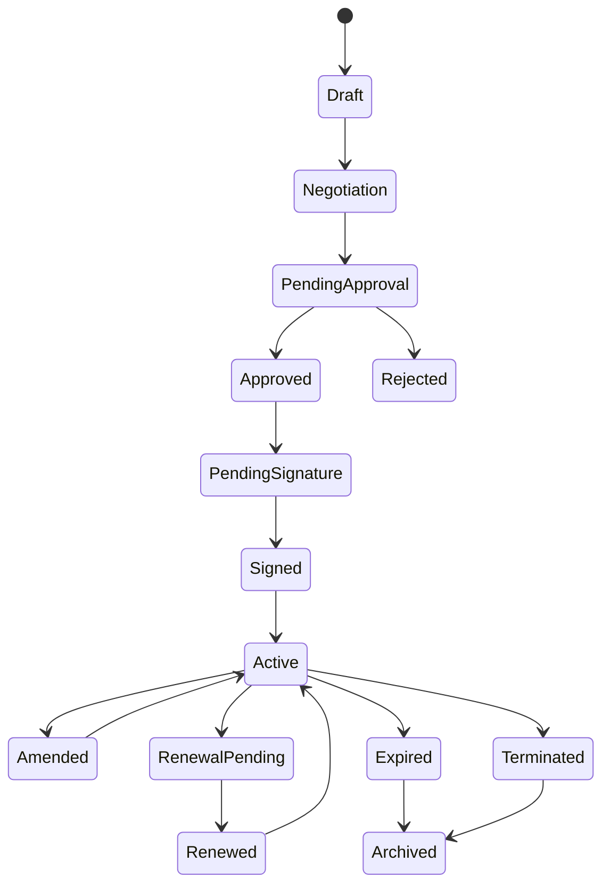
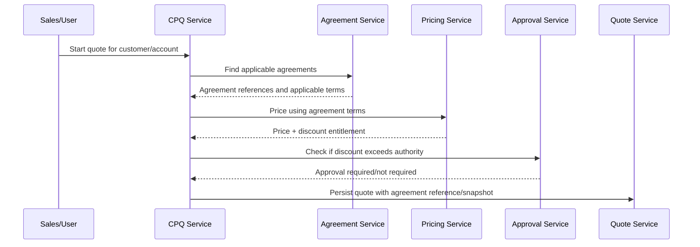
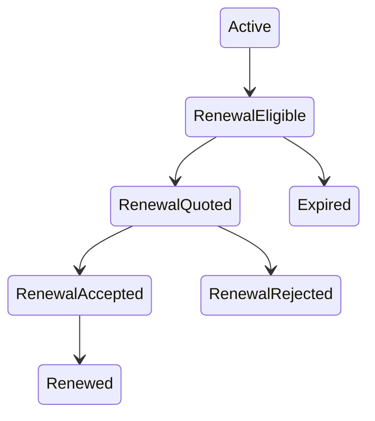

# Part 014 — Agreement and Contract Model

## 1. Core Idea

Dalam enterprise CPQ, Quote, Order, Billing, dan Telco BSS/OSS systems, **agreement/contract model adalah sumber commercial dan legal constraints**.

Agreement bukan sekadar attachment PDF atau nomor kontrak di quote.

Agreement dapat memengaruhi:

- product eligibility,
- price list selection,
- discount entitlement,
- billing term,
- contract term,
- renewal,
- minimum commitment,
- SLA,
- early termination penalty,
- service obligation,
- invoicing rule,
- approval rule,
- quote validity,
- order acceptance,
- revenue recognition awareness,
- audit evidence.

Mental model utama:

> **Quote adalah proposal. Order adalah instruksi eksekusi. Agreement/contract adalah governing commitment yang memberi batas komersial, legal, billing, dan service obligation.**

Jika agreement hanya dimodelkan sebagai `contract_number` string, sistem akan kesulitan menjawab:

- apakah customer masih dalam contract term,
- apakah discount boleh diberikan,
- apakah quote item harus mengikuti master agreement,
- apakah billing harus mengikuti special term,
- apakah renewal sudah jatuh tempo,
- apakah amendment mengubah price atau hanya term,
- apakah order boleh disconnect sebelum commitment selesai,
- apakah invoice dispute bisa ditelusuri ke agreement term,
- apakah quote snapshot sesuai kontrak yang berlaku saat accepted.

---

## 2. Agreement vs Contract

Istilah agreement dan contract sering digunakan bergantian, tetapi dalam modelling sebaiknya dibedakan secara konseptual.

### 2.1 Agreement

Agreement adalah hubungan atau kesepakatan komersial yang dapat memiliki banyak term, party, document, version, amendment, renewal, dan product coverage.

Agreement bisa berupa:

- master agreement,
- enterprise agreement,
- framework agreement,
- discount agreement,
- service agreement,
- reseller agreement,
- subscription agreement,
- statement of work,
- order form agreement.

### 2.2 Contract

Contract sering merujuk pada dokumen legal atau enforceable contract instance.

Dalam beberapa organisasi:

- `Agreement` = business-level relation,
- `Contract` = legal document,
- `Agreement Item` = covered product/service/commitment,
- `Contract Term` = binding clause/term.

Namun internal terminology bisa berbeda. Karena itu harus diverifikasi.

### 2.3 Practical Distinction

| Concept | Meaning |
|---|---|
| Agreement | Commercial/legal relationship container |
| Contract | Legal document or binding instrument |
| Contract Term | Specific obligation/condition |
| Agreement Item | Product/service/account coverage |
| Amendment | Change to existing agreement |
| Renewal | Extension or replacement of agreement period |
| Commitment | Minimum quantity/spend/term obligation |
| SLA | Service-level obligation |

---

## 3. Why Agreement Model Exists

Agreement model exists because quote-to-cash decisions depend on commitments made outside the current quote.

Example:

```text
Customer has Enterprise Agreement EA-2026.
EA gives 20% discount for product family X.
EA requires minimum 36-month term.
EA defines billing cycle as monthly in USD.
EA includes SLA Platinum for managed connectivity.
EA expires on 2027-12-31.
```

When a new quote is created, the system must know:

- which agreement applies,
- whether the product is covered,
- what price/discount rules apply,
- whether special approval is needed,
- what billing term applies,
- whether commitment is increased,
- whether new order amends an existing agreement,
- whether quote acceptance creates a new agreement or consumes an existing one.

---

## 4. Conceptual Model



Key idea:

- Agreement is a container.
- Terms define constraints.
- Items define scope/coverage.
- Parties define who is bound or involved.
- Versions/amendments define change over time.
- Quote/order/billing reference agreement for traceability.

---

## 5. Key Entity Definitions

### 5.1 Agreement

Agreement is the root or container.

Example attributes:

```text
agreement_id
agreement_number
agreement_type
name
status
customer_id
primary_party_id
effective_from
effective_to
signed_date
activation_date
expiry_date
renewal_policy
source_system
created_at
updated_at
```

Agreement types:

- master agreement,
- enterprise agreement,
- discount agreement,
- service agreement,
- subscription agreement,
- reseller agreement,
- order form agreement.

### 5.2 Agreement Party

Agreement party represents role of parties in agreement.

Roles:

- customer,
- provider,
- contracting party,
- legal entity,
- signatory,
- payer,
- beneficiary,
- reseller,
- account owner,
- billing contact.

Fields:

```text
agreement_party_id
agreement_id
party_id
role_type
valid_from
valid_to
signature_required
signed_at
```

### 5.3 Agreement Item

Agreement item defines what is covered.

Coverage can be:

- product offering,
- product family,
- product specification,
- account,
- site,
- geography,
- customer segment,
- service type,
- billing account.

Fields:

```text
agreement_item_id
agreement_id
coverage_type
covered_entity_id
product_family
product_offering_id
site_id
billing_account_id
status
effective_from
effective_to
```

### 5.4 Contract Term

Contract term defines obligation or rule.

Types:

- commercial term,
- legal term,
- billing term,
- service term,
- SLA term,
- discount term,
- commitment term,
- renewal term,
- termination term.

Fields:

```text
contract_term_id
agreement_id
term_type
term_code
description
value_type
value_json
effective_from
effective_to
version
```

### 5.5 Commitment

Commitment defines obligation over time.

Examples:

- minimum spend,
- minimum quantity,
- minimum term,
- minimum active services,
- usage commitment,
- volume commitment.

Fields:

```text
commitment_id
agreement_id
agreement_item_id
commitment_type
metric
minimum_value
period
start_date
end_date
measurement_rule
penalty_rule
```

### 5.6 SLA

SLA defines service-level obligation.

Fields:

```text
sla_term_id
agreement_id
service_specification_id
metric
threshold
measurement_window
penalty_rule
priority
```

### 5.7 Billing Term

Billing term defines how billing should work.

Examples:

- billing cycle,
- payment term,
- invoice grouping,
- currency,
- tax treatment,
- proration rule,
- advance/arrears billing,
- minimum billing period.

Fields:

```text
billing_term_id
agreement_id
billing_account_id
billing_cycle
payment_term
currency_code
invoice_grouping_rule
proration_rule
effective_from
effective_to
```

---

## 6. Agreement Lifecycle

Agreement has lifecycle distinct from quote/order.



Important distinction:

- Signed does not always mean active.
- Active does not always mean all terms are effective.
- Agreement may be active while specific item/term is expired.
- Amendment may create new version without replacing all historical terms.
- Expiry does not mean records can be deleted.

---

## 7. Agreement in CPQ Lifecycle

Agreement affects CPQ in several points.



Agreement can influence:

- allowed product offering,
- discount entitlement,
- price list,
- contract term length,
- quote validity,
- required approval,
- amendment vs new sale,
- renewal quote flow.

---

## 8. Agreement in Quote Model

Quote should usually store agreement information in two forms:

1. **Reference** to agreement/version/term.
2. **Snapshot** of critical commercial terms used in pricing/approval.

Why both?

- Reference supports traceability.
- Snapshot protects accepted quote from future agreement changes.

Example quote agreement reference:

```text
quote_agreement_reference
  quote_id
  agreement_id
  agreement_version_id
  referenced_term_ids
  applied_discount_agreement_id
  snapshot_json
  effective_at_quote_time
```

Avoid only storing:

```text
quote.contract_number = "EA-2026"
```

That is insufficient for pricing trace and dispute handling.

---

## 9. Agreement in Order Model

Order should know which agreement governs the fulfillment/commercial commitment.

Order can:

- execute under existing agreement,
- create new agreement,
- amend existing agreement,
- renew agreement,
- terminate part of agreement,
- consume commitment,
- activate billing term.

Order agreement reference fields:

```text
order_agreement_reference
  order_id
  agreement_id
  agreement_version_id
  action_type
  source_quote_id
  creates_new_agreement
  amends_agreement
  amendment_id
```

Order item may also reference agreement item/term if coverage differs per product.

---

## 10. Agreement in Billing Model

Billing needs agreement terms for:

- billing cycle,
- payment terms,
- discount application,
- invoice grouping,
- contract commitment,
- proration,
- tax treatment,
- early termination fee,
- minimum spend.

Billing integration should not rely on vague text terms.

Bad:

```text
billing_note = "special billing per contract"
```

Better:

```text
billing_term_id
billing_cycle = MONTHLY
payment_term = NET_30
currency = USD
invoice_grouping_rule = BY_BILLING_ACCOUNT
proration_rule = DAILY_PRORATION
commitment_id = COMMIT-001
```

---

## 11. Versioning and Amendment

Agreement versioning is critical.

### 11.1 Why Versioning Matters

Agreement terms change:

- discount updated,
- term extended,
- products added,
- billing cycle changed,
- SLA upgraded,
- party changed after corporate restructuring,
- commitment adjusted,
- contract renewed.

Historical quote/order/billing must still explain what was true at the time.

### 11.2 Common Patterns

#### Pattern A — Mutable Agreement + Audit History

Pros:

- simple current-state reads.

Cons:

- hard to reconstruct past state,
- risky for accepted quote/billing disputes.

#### Pattern B — Versioned Agreement

```text
agreement
agreement_version
agreement_term_version
agreement_item_version
```

Pros:

- historical reconstruction,
- good traceability,
- safer quote/order references.

Cons:

- more complex queries,
- requires effective dating.

#### Pattern C — Event-Sourced Agreement

Pros:

- full history,
- replay capability.

Cons:

- operational complexity,
- reporting requires projections,
- not always necessary.

### 11.3 Amendment Model

Amendment should record:

```text
amendment_id
agreement_id
previous_version_id
new_version_id
amendment_type
reason
requested_by
approved_by
effective_from
signed_at
status
```

Amendment types:

- add product coverage,
- remove product coverage,
- change price/discount,
- change billing term,
- change party,
- extend term,
- terminate early,
- change SLA.

---

## 12. Renewal and Expiry

Renewal should not be modelled as simply changing `effective_to` in-place without history.

Renewal may:

- extend existing agreement,
- create new agreement version,
- create replacement agreement,
- change price terms,
- reset commitment,
- carry forward some terms,
- require approval/signature.

Renewal states:



Expiry must consider:

- quote validity,
- in-flight orders,
- active subscriptions,
- billing obligations,
- product inventory,
- auto-renewal,
- grace period,
- notice period.

---

## 13. Invariants

### 13.1 Agreement Invariants

- Active agreement must have valid effective period.
- Active agreement must have at least one contracting party.
- Signed agreement must preserve signature evidence/reference.
- Expired agreement must not be used for new quote unless grace/renewal rule allows.
- Term effective dates must fall within or be compatible with agreement validity.
- Amendment must reference previous agreement version.
- Agreement version referenced by accepted quote/order must not be mutated.

### 13.2 Commercial Term Invariants

- Discount term must define scope and validity.
- Commitment must define metric, period, and measurement rule.
- Price override must identify source and approval.
- Product coverage must be resolvable to offering/specification/family/site/account.

### 13.3 Billing Term Invariants

- Billing term must be compatible with billing account currency.
- Billing cycle must be valid for the target billing account.
- Payment term changes must be effective-dated.
- Invoice grouping rule must be understood by billing integration.

### 13.4 Cross-Entity Invariants

- Quote customer must match or be covered by agreement party/coverage.
- Order source quote agreement must match order agreement reference unless explicit override exists.
- Billing account must be eligible under agreement billing term.
- Product ordered must be covered by agreement item if agreement-restricted.
- Inventory created under agreement must preserve source agreement trace.

---

## 14. Conceptual, Logical, and Physical Modelling

### 14.1 Conceptual Model

```text
Agreement governs commercial/legal relationship.
Agreement Party defines who is involved and in what role.
Agreement Item defines what products/accounts/sites are covered.
Contract Term defines obligations and constraints.
Amendment changes agreement over time.
Renewal extends or replaces agreement.
Quote/Order/Billing reference agreement for traceability and correctness.
```

### 14.2 Logical Model

Entities:

```text
agreement
agreement_version
agreement_party
agreement_item
contract_term
commercial_term
billing_term
sla_term
commitment
agreement_document
amendment
renewal
agreement_reference
```

### 14.3 Physical PostgreSQL Example

Illustrative schema:

```sql
CREATE TABLE agreement (
    agreement_id UUID PRIMARY KEY,
    agreement_number TEXT NOT NULL UNIQUE,
    agreement_type TEXT NOT NULL,
    name TEXT NOT NULL,
    status TEXT NOT NULL,
    customer_id UUID,
    effective_from TIMESTAMPTZ NOT NULL,
    effective_to TIMESTAMPTZ,
    signed_at TIMESTAMPTZ,
    source_system TEXT,
    created_at TIMESTAMPTZ NOT NULL,
    updated_at TIMESTAMPTZ NOT NULL
);

CREATE TABLE agreement_version (
    agreement_version_id UUID PRIMARY KEY,
    agreement_id UUID NOT NULL REFERENCES agreement(agreement_id),
    version_number INTEGER NOT NULL,
    status TEXT NOT NULL,
    effective_from TIMESTAMPTZ NOT NULL,
    effective_to TIMESTAMPTZ,
    created_reason TEXT,
    created_at TIMESTAMPTZ NOT NULL,
    UNIQUE (agreement_id, version_number)
);

CREATE TABLE agreement_party (
    agreement_party_id UUID PRIMARY KEY,
    agreement_version_id UUID NOT NULL REFERENCES agreement_version(agreement_version_id),
    party_id UUID NOT NULL,
    role_type TEXT NOT NULL,
    valid_from TIMESTAMPTZ,
    valid_to TIMESTAMPTZ
);

CREATE TABLE contract_term (
    contract_term_id UUID PRIMARY KEY,
    agreement_version_id UUID NOT NULL REFERENCES agreement_version(agreement_version_id),
    term_type TEXT NOT NULL,
    term_code TEXT NOT NULL,
    term_value JSONB NOT NULL,
    effective_from TIMESTAMPTZ,
    effective_to TIMESTAMPTZ
);

CREATE TABLE amendment (
    amendment_id UUID PRIMARY KEY,
    agreement_id UUID NOT NULL REFERENCES agreement(agreement_id),
    previous_version_id UUID NOT NULL REFERENCES agreement_version(agreement_version_id),
    new_version_id UUID REFERENCES agreement_version(agreement_version_id),
    amendment_type TEXT NOT NULL,
    status TEXT NOT NULL,
    reason TEXT,
    effective_from TIMESTAMPTZ,
    created_at TIMESTAMPTZ NOT NULL
);
```

This is not a recommended internal schema; it is a modelling illustration.

---

## 15. API Model Mapping

Agreement API should avoid exposing raw legal/internal structures unless needed.

### 15.1 Agreement Summary DTO

```json
{
  "id": "agr-001",
  "agreementNumber": "EA-2026-001",
  "type": "ENTERPRISE_AGREEMENT",
  "status": "ACTIVE",
  "validFor": {
    "startDateTime": "2026-01-01T00:00:00Z",
    "endDateTime": "2027-12-31T23:59:59Z"
  },
  "relatedParty": [
    {
      "role": "CONTRACTING_PARTY",
      "partyId": "party-001"
    }
  ]
}
```

### 15.2 Quote Agreement Reference DTO

```json
{
  "agreementRef": {
    "id": "agr-001",
    "version": 3,
    "agreementNumber": "EA-2026-001",
    "appliedTerms": ["DISCOUNT_20_PERCENT", "TERM_36_MONTHS"]
  }
}
```

### 15.3 API Stability Concern

Do not expose:

- raw contract clause text unless authorized,
- internal approval comments,
- legal document storage path,
- sensitive discount terms to unauthorized consumers,
- mutable current version when historical version is required.

---

## 16. Event Model Mapping

Agreement events:

```text
AgreementCreated
AgreementApproved
AgreementSigned
AgreementActivated
AgreementAmended
AgreementRenewed
AgreementExpired
AgreementTermUpdated
AgreementPartyChanged
AgreementCoverageChanged
AgreementTerminated
```

### 16.1 Event Payload Example

```json
{
  "eventId": "evt-agr-001",
  "eventType": "AgreementAmended",
  "eventVersion": 1,
  "occurredAt": "2026-07-12T10:00:00Z",
  "aggregateId": "agr-001",
  "correlationId": "corr-001",
  "payload": {
    "agreementId": "agr-001",
    "previousVersion": 2,
    "newVersion": 3,
    "amendmentType": "DISCOUNT_TERM_CHANGED",
    "effectiveFrom": "2026-08-01T00:00:00Z"
  }
}
```

### 16.2 Event Risks

- Publishing sensitive commercial/legal terms broadly.
- Consumers using current agreement instead of version in event.
- Missing effective date.
- No causation link to quote/order/amendment request.
- Event does not identify changed terms.

---

## 17. Java/JAX-RS Backend Impact

Agreement model tends to become complex. Keep layers separated:

```text
AgreementResource
  -> AgreementRequestDTO / AgreementResponseDTO
  -> AgreementApplicationService
  -> AgreementAggregate / AgreementDomainService
  -> AgreementRepository
  -> AgreementMapper / Persistence Entity
```

### 17.1 Domain Services

Useful domain services:

- `AgreementEligibilityService`
- `AgreementTermResolver`
- `AgreementPricingPolicyResolver`
- `AgreementBillingTermResolver`
- `AgreementAmendmentService`
- `AgreementRenewalService`
- `AgreementSnapshotService`

### 17.2 MyBatis/JPA/JDBC Concerns

With MyBatis:

- good for explicit term resolution queries,
- avoid duplicating dynamic SQL across services,
- test mapping for version/effective-date filtering.

With JPA:

- be careful with large agreement object graphs,
- avoid accidental cascade update of historical versions,
- avoid lazy load inside serialization.

With JDBC:

- explicit transaction boundaries for amendment/version creation,
- use optimistic locking if agreement edits are concurrent,
- centralize status transition checks.

---

## 18. PostgreSQL Considerations

### 18.1 Effective Dating

Agreement queries often need:

```sql
WHERE effective_from <= :business_time
  AND (effective_to IS NULL OR effective_to > :business_time)
```

Index accordingly:

```sql
CREATE INDEX idx_agreement_version_effective
ON agreement_version (agreement_id, effective_from, effective_to);
```

### 18.2 JSONB Term Value

`contract_term.term_value JSONB` can be useful for flexible terms, but be careful:

- validation must exist,
- query patterns must be known,
- reporting impact must be considered,
- schema/version of JSON must be controlled,
- critical billing/pricing terms may deserve structured columns.

### 18.3 Immutability

Historical agreement versions should be protected.

Possible strategies:

- application-level no-update rule,
- database trigger,
- status-based write guard,
- copy-on-write versioning,
- append-only amendment log.

---

## 19. Kafka, RabbitMQ, Redis, and Camunda Impact

### 19.1 Kafka/RabbitMQ

Agreement events may be consumed by:

- CPQ service,
- pricing service,
- quote service,
- order service,
- billing service,
- reporting service,
- search service.

Events must be versioned and privacy-safe.

### 19.2 Redis

Agreement term resolution may be cached:

- active agreements by customer,
- discount entitlement by product/customer,
- billing term by billing account,
- SLA term by service/product.

Cache keys should include agreement version or effective date when correctness depends on them.

Example:

```text
agreement:customer:{customerId}:effective:{yyyyMMdd}
agreement-term:{agreementId}:version:{version}
```

### 19.3 Camunda

Agreement workflows may include:

- negotiation approval,
- legal review,
- signature process,
- amendment approval,
- renewal workflow.

Do not use Camunda process state as the only agreement state. Domain state must remain explicit.

---

## 20. Reporting and Analytics Impact

Agreement reporting questions:

- active agreements by customer segment,
- agreements expiring in next 90 days,
- renewal pipeline,
- discount agreement utilization,
- commitment attainment,
- revenue under agreement,
- order volume under master agreement,
- SLA breach by agreement,
- amendment frequency,
- quote win rate by agreement type.

Reporting often needs dimensions:

```text
dim_agreement
dim_agreement_term
dim_contracting_party
fact_agreement_renewal
fact_agreement_utilization
fact_commitment_attainment
```

Do not rely only on current agreement state for historical reporting. Use version/effective-date aware reporting.

---

## 21. Auditability Concerns

Agreement audit must answer:

- who created agreement,
- who approved it,
- who signed it,
- what terms changed,
- why amendment was made,
- which version was active at quote acceptance,
- which billing term was used for invoice,
- which discount term was applied,
- whether order was allowed under agreement,
- whether termination complied with contract term.

Audit data:

```text
actor
business_action
technical_action
target_agreement_id
previous_version_id
new_version_id
changed_terms
reason
approval_reference
signature_reference
correlation_id
source_system
timestamp
```

---

## 22. Security and Privacy Concerns

Agreement data can be highly sensitive:

- negotiated discount,
- custom price terms,
- legal terms,
- penalty clauses,
- SLA commitments,
- customer identity,
- signatory data,
- payment terms,
- credit terms.

Security requirements:

- restrict access by role,
- mask sensitive commercial terms,
- avoid broad event publication,
- redact logs,
- control document access,
- audit reads if needed,
- tenant isolation,
- retention/legal hold policy.

---

## 23. Failure Modes

| Failure mode | Likely cause | Detection |
|---|---|---|
| Quote uses expired agreement | missing effective-date validation | quote agreement validation query |
| Discount applied outside coverage | weak agreement item mapping | price audit vs agreement coverage |
| Billing uses wrong payment term | billing term not carried over | invoice term reconciliation |
| Order references current agreement version instead of accepted version | mutable reference | quote/order agreement version audit |
| Amendment overwrites historical terms | no versioning | audit/history gap |
| Renewal duplicates agreement | weak renewal identity/link | duplicate active agreement query |
| Contract party mismatch | party/account hierarchy ambiguity | agreement-party vs quote customer validation |
| Early termination fee missed | termination term not modelled | disconnect order billing reconciliation |
| SLA not enforceable | SLA stored as free text | service assurance vs structured SLA term check |
| Sensitive agreement terms leaked | event/API overexposure | security review/event scan |

---

## 24. Debugging Agreement Issues

Questions to ask:

1. Which agreement/version was active at business time?
2. Which quote/order referenced it?
3. Was the agreement referenced or snapshotted?
4. Which term drove the disputed decision?
5. Was the term structured or free-text?
6. Was the customer/account/site/product covered?
7. Did an amendment happen after quote acceptance?
8. Did billing use current or historical term?
9. Was there a renewal or replacement agreement?
10. Is the issue in agreement source, quote snapshot, order mapping, billing handoff, or reporting projection?

Example diagnostic queries:

```sql
-- Quotes referencing expired agreements at quote acceptance time
SELECT q.quote_id, q.accepted_at, ar.agreement_id, a.effective_to
FROM quote q
JOIN quote_agreement_reference ar ON ar.quote_id = q.quote_id
JOIN agreement a ON a.agreement_id = ar.agreement_id
WHERE q.status = 'ACCEPTED'
  AND a.effective_to IS NOT NULL
  AND q.accepted_at > a.effective_to;

-- Orders referencing agreement without version
SELECT order_id, agreement_id
FROM order_agreement_reference
WHERE agreement_version_id IS NULL;
```

Adapt to actual internal schema.

---

## 25. Trade-Offs

### Agreement as Simple Reference

Pros:

- easy implementation,
- low schema complexity.

Cons:

- weak audit,
- weak pricing trace,
- weak billing trace,
- hard renewal/amendment,
- poor dispute handling.

### Agreement as Structured Term Model

Pros:

- pricing/billing/eligibility automation,
- stronger audit,
- better reporting,
- enforceable invariants.

Cons:

- more modelling effort,
- term taxonomy complexity,
- requires governance.

### Agreement as External Document Only

Pros:

- simple if system does not enforce terms.

Cons:

- cannot automate pricing/billing/eligibility,
- manual interpretation,
- high operational risk.

### Versioned Agreement Model

Pros:

- historical correctness,
- quote/order traceability,
- safer amendment.

Cons:

- more complex queries,
- more storage,
- more operational discipline.

---

## 26. PR Review Checklist

When reviewing agreement/contract changes:

- Is agreement distinct from quote/order?
- Is agreement versioned?
- Are effective dates explicit?
- Are agreement parties role-based?
- Are product/account/site coverage rules clear?
- Are commercial, legal, billing, and SLA terms separated?
- Are critical terms structured, not only free-text?
- Is quote/order reference version-specific?
- Are accepted quote snapshots protected from later agreement changes?
- Is amendment model append-only/copy-on-write?
- Are renewal semantics clear?
- Are billing terms carried to billing integration?
- Are sensitive terms protected in API/event/logs?
- Are audit records sufficient for dispute?
- Are reporting impacts considered?

---

## 27. Internal Verification Checklist

Verify in internal CSG/team context:

- What is the internal distinction between agreement, contract, order form, subscription, and commercial term?
- Is agreement mastered internally or in an external CLM/CRM/billing system?
- Are agreements stored as structured data, documents, references, or a mix?
- Does quote reference agreement? At header or item level?
- Does order reference agreement? At header or item level?
- Does billing receive agreement terms or only billing account/charge data?
- Are agreement terms versioned and effective-dated?
- Are amendments modelled explicitly?
- Are renewals linked to previous agreement?
- Are discount agreements separated from general contracts?
- Are billing terms structured?
- Are SLA terms structured and used downstream?
- Are agreement party roles explicit?
- How are signatories stored?
- How are contract documents stored and access-controlled?
- Which agreement fields are snapshotted on quote/order?
- What Kafka/RabbitMQ events exist for agreement changes?
- Are agreement events safe from sensitive commercial/legal leakage?
- What incidents/disputes involved wrong agreement/contract data?
- Who owns agreement glossary: product owner, BA, legal, sales ops, solution architect, or engineering?

---

## 28. Senior Engineer Mental Model

Do not treat agreement as an optional text field attached to quote.

In enterprise quote-to-cash, agreement is often the object that explains:

- why a price is allowed,
- why a discount exists,
- why a term is required,
- why billing behaves differently,
- why an order cannot be cancelled freely,
- why SLA applies,
- why a customer dispute is valid or invalid.

A senior engineer should ask:

> Is this agreement data being used as a reference, a rule source, a pricing input, a billing input, a legal evidence object, or a historical snapshot?

Each answer implies different modelling requirements.

Bad agreement modelling creates downstream ambiguity. Good agreement modelling makes commercial decisions explainable, billing traceable, and quote/order lifecycle defensible.

