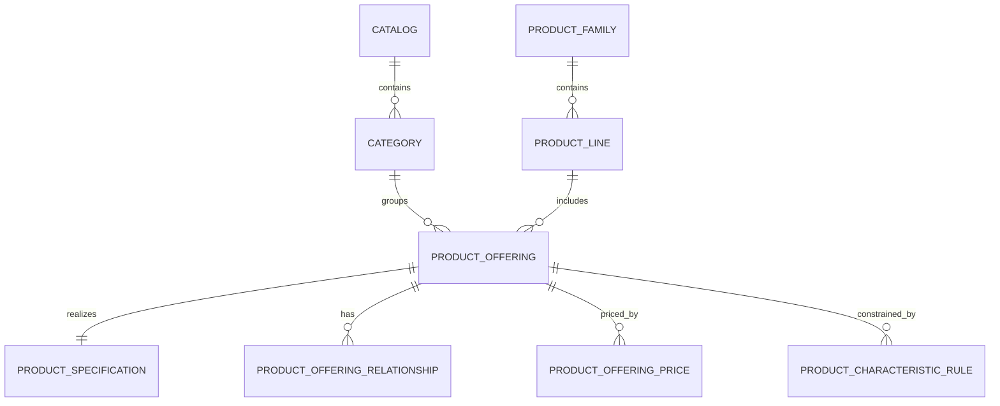
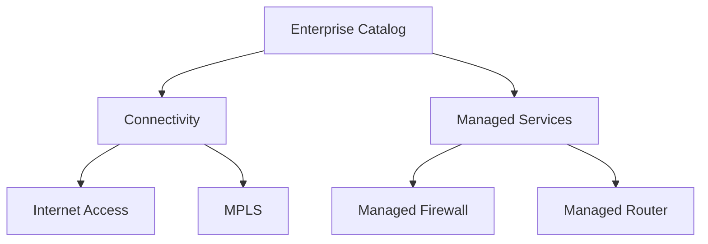
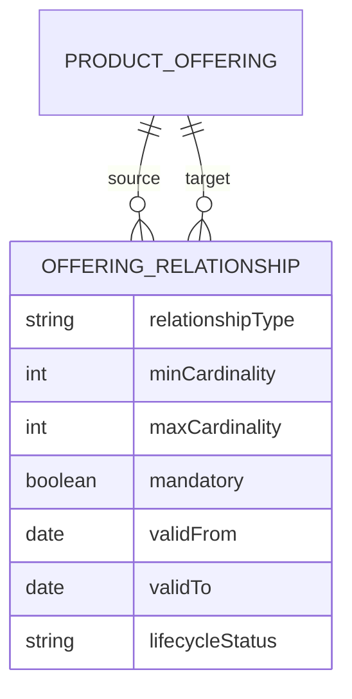
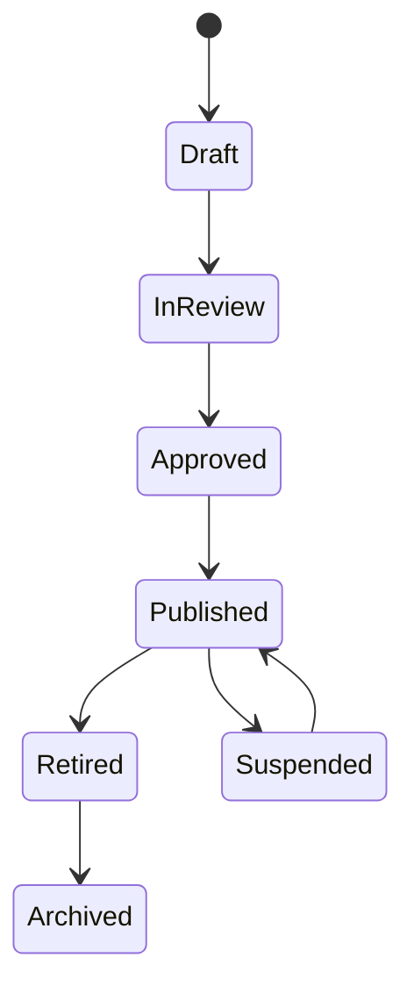

# Part 015 — Product Catalog Conceptual Model

## 1. Core Idea

Dalam CPQ, Quote, Order, Billing, dan Telco BSS/OSS systems, **product catalog adalah commercial source of truth untuk apa yang boleh dijual, bagaimana produk dikelompokkan, bagaimana produk saling berelasi, kapan produk valid, dan constraint apa yang harus dihormati saat konfigurasi, pricing, quote, order, fulfillment, dan billing**.

Product catalog bukan sekadar daftar produk.

Product catalog menjawab pertanyaan seperti:

- produk apa yang bisa dijual,
- produk mana yang sudah retired,
- produk mana yang hanya berlaku untuk segment/customer tertentu,
- produk mana yang bisa dijual bersama,
- produk mana yang incompatible,
- produk mana yang mandatory dalam bundle,
- produk mana yang add-on,
- produk mana yang butuh serviceability check,
- produk mana yang punya harga recurring, one-time, atau usage,
- versi catalog mana yang digunakan saat quote dibuat,
- apakah in-flight quote tetap valid saat catalog berubah,
- apakah order boleh dibuat dari quote yang memakai catalog lama,
- apakah installed product bisa dimodify dengan catalog version terbaru.

Mental model utama:

> **Catalog mendefinisikan commercial possibility. Quote memilih dan membekukan possibility tersebut. Order mengeksekusinya. Inventory membuktikan hasilnya. Billing menagih berdasarkan commercial dan activation evidence.**

Jika catalog model lemah, efeknya menyebar ke seluruh quote-to-cash lifecycle:

- quote bisa menjual offering yang sudah tidak valid,
- pricing memakai price version salah,
- order gagal karena product tidak punya technical mapping,
- billing menagih charge yang tidak sesuai quote,
- fulfillment tidak tahu service/resource apa yang harus dibuat,
- reporting tidak bisa membedakan product family/product line,
- audit tidak bisa membuktikan catalog state saat quote accepted.

---

## 2. Why Product Catalog Exists

Product catalog ada karena enterprise CPQ tidak bisa hardcode produk di codebase.

Produk enterprise berubah karena:

- campaign komersial,
- regulasi,
- market segment,
- geography,
- channel,
- pricing policy,
- technical capability,
- vendor dependency,
- service availability,
- contract-specific offering,
- customer-specific packaging,
- product retirement,
- bundle restructuring,
- migration dari legacy product ke new product.

Tanpa catalog-driven model, perubahan produk akan menjadi perubahan code, migration, deployment, dan regression risk.

Catalog-driven architecture memindahkan banyak variability dari code ke controlled data model.

Namun ini bukan berarti semua logic harus menjadi dynamic data. Terlalu banyak dynamic catalog logic dapat membuat sistem:

- sulit di-debug,
- sulit dites,
- lambat,
- tidak deterministik,
- sulit diaudit,
- sulit dilaporkan,
- rentan rule conflict.

Prinsip senior engineer:

> **Catalog harus cukup fleksibel untuk business variability, tetapi cukup eksplisit untuk correctness, audit, pricing, fulfillment, dan reporting.**

---

## 3. Catalog Conceptual Model

Secara konseptual, product catalog biasanya terdiri dari beberapa object utama.



Model ini bukan physical schema final. Ini conceptual map untuk memahami object dan hubungan utama.

---

## 4. Core Entities

### 4.1 Catalog

Catalog adalah container untuk offering yang dipublikasikan atau disiapkan untuk publication.

Contoh:

- Enterprise Connectivity Catalog,
- Mobile Product Catalog,
- Cloud Services Catalog,
- B2B SaaS Catalog,
- Partner Catalog,
- Regional Catalog.

Field konseptual:

- catalog id,
- catalog name,
- catalog type,
- version,
- lifecycle status,
- valid from,
- valid to,
- market/region,
- channel,
- tenant/customer segment,
- publication status,
- created/updated metadata.

Catalog harus menjawab:

- catalog ini berlaku untuk siapa,
- kapan catalog berlaku,
- apakah catalog masih draft atau sudah published,
- apakah quote boleh memakai catalog ini,
- apakah catalog ini menggantikan catalog sebelumnya,
- apakah catalog ini kompatibel dengan in-flight quote/order.

### 4.2 Category

Category mengelompokkan offering untuk browsing, UI, sales navigation, reporting, dan governance.

Category bukan selalu domain boundary.

Contoh category:

- Connectivity,
- Internet Access,
- Managed Security,
- Voice,
- Cloud Infrastructure,
- Add-ons,
- Professional Services.

Category dapat bersifat hierarchical:



Pitfall umum:

- category dipakai sebagai substitute untuk product family,
- category hierarchy dipakai untuk pricing logic terlalu banyak,
- category berubah karena UI tetapi memengaruhi billing/reporting,
- category tidak versioned padahal dipakai oleh quote logic.

Category sebaiknya diperlakukan sebagai classification layer, kecuali memang ada business rule eksplisit yang bergantung padanya.

### 4.3 Product Offering

Product Offering adalah sesuatu yang dijual secara komersial.

Contoh:

- Business Internet 100 Mbps,
- Premium Support Add-on,
- Managed Firewall Basic,
- Cloud Backup 1 TB,
- Mobile Business Plan X,
- Installation Service,
- Static IP Add-on.

Product offering biasanya punya:

- commercial name,
- description,
- lifecycle status,
- eligibility,
- channel availability,
- segment availability,
- valid period,
- relationship ke product specification,
- price association,
- characteristic/option structure,
- bundle relationship,
- tax/billing classification awareness,
- fulfillment mapping awareness.

Pembedaan penting:

> **Product offering adalah apa yang dijual. Product specification adalah apa yang mendefinisikan struktur/karakteristik produk. Product instance adalah apa yang sudah dimiliki customer.**

### 4.4 Product Specification

Product Specification mendefinisikan sifat produk yang direalisasikan oleh offering.

Contoh:

- Internet Access Specification,
- Managed Firewall Specification,
- Static IP Specification,
- Router Rental Specification.

Specification berisi:

- characteristic definitions,
- allowed values,
- validation requirements,
- configuration rules,
- technical mapping hints,
- relationship to service/resource specification,
- version.

Product offering dapat menjadi commercial packaging atas specification.

Misalnya:

- `Business Internet 100 Mbps` dan `Business Internet 500 Mbps` bisa sama-sama merealisasikan `Internet Access Specification`, tetapi dengan default bandwidth berbeda.

### 4.5 Product Family

Product Family adalah grouping strategis untuk produk yang sejenis.

Contoh:

- Connectivity,
- Security,
- Voice,
- Cloud,
- Professional Services.

Family sering dipakai untuk:

- portfolio governance,
- reporting,
- sales performance,
- product lifecycle management,
- product owner assignment,
- migration strategy.

Jangan memaksa product family menjadi category UI. Family lebih dekat ke product management/reporting, category lebih dekat ke navigation/classification.

### 4.6 Product Line

Product Line adalah subkelompok dalam family yang biasanya lebih dekat ke commercial portfolio.

Contoh:

- Internet Access,
- Dedicated Internet,
- Broadband,
- Managed Firewall,
- Endpoint Security.

Product line berguna untuk:

- revenue reporting,
- bundle eligibility,
- lifecycle management,
- migration campaign,
- product roadmap,
- sales compensation.

### 4.7 Product Bundle

Product Bundle adalah offering yang terdiri dari beberapa component offering.

Contoh:

- Business Internet + Router + Static IP + Installation,
- Managed Security Pack,
- Enterprise Connectivity Bundle.

Bundle dapat punya:

- mandatory component,
- optional component,
- min/max cardinality,
- default selected component,
- incompatible component,
- dependency rule,
- bundle-level price,
- component-level price,
- discount at bundle level,
- fulfillment decomposition rule.

Bundle adalah salah satu sumber complexity terbesar di CPQ.

Pertanyaan modelling penting:

- apakah bundle hanya UI grouping atau sellable product,
- apakah component bisa ditagih terpisah,
- apakah component bisa dimodify/disconnect sendiri,
- apakah component punya lifecycle sendiri di inventory,
- apakah harga dihitung di bundle atau component,
- apakah order item harus mengikuti tree bundle,
- apakah product inventory juga menyimpan tree yang sama.

### 4.8 Product Option

Product Option adalah pilihan dalam konfigurasi offering.

Contoh:

- bandwidth option,
- router model,
- contract term,
- SLA tier,
- static IP count,
- installation type,
- support tier.

Option dapat dimodelkan sebagai:

- characteristic allowed value,
- child offering,
- option group,
- rule-driven selection,
- configuration attribute.

Trade-off:

- option sebagai characteristic lebih sederhana,
- option sebagai child offering lebih kuat untuk pricing, billing, inventory, dan fulfillment,
- option group lebih baik untuk UI/selection logic,
- rule-driven option perlu traceability.

### 4.9 Add-on

Add-on adalah offering tambahan yang hanya valid jika ada base product atau bundle tertentu.

Contoh:

- Static IP,
- Premium Support,
- Advanced Reporting,
- Additional Bandwidth,
- Security Monitoring Add-on.

Add-on membutuhkan relationship:

- requires base offering,
- compatible with offering,
- incompatible with offering,
- maximum quantity,
- effective period,
- billing dependency,
- inventory dependency.

Add-on sering gagal dimodelkan jika hanya diberi flag `is_addon`. Flag tidak cukup untuk menjawab add-on ini valid untuk base product apa, di market apa, dan dalam lifecycle apa.

---

## 5. Product Relationship Model

Catalog harus mampu merepresentasikan hubungan antar offering/specification.

Jenis relationship umum:

| Relationship | Makna |
|---|---|
| `bundles` | Offering A terdiri dari Offering B/C |
| `requires` | Offering A membutuhkan Offering B |
| `excludes` | Offering A tidak boleh dipilih bersama Offering B |
| `replaces` | Offering A menggantikan Offering lama |
| `upgrades_to` | Offering A bisa upgrade ke Offering B |
| `downgrades_to` | Offering A bisa downgrade ke Offering B |
| `add_on_for` | Offering A adalah add-on untuk Offering B |
| `depends_on` | Fulfillment/pricing/configuration A bergantung pada B |
| `migrates_from` | Offering baru hasil migrasi dari offering lama |

Conceptual relationship model:



Relationship harus versioned/effective-dated jika dipakai oleh quote/order logic.

---

## 6. Eligibility and Compatibility

Eligibility menjawab:

> **Apakah offering boleh dijual kepada customer/context ini?**

Compatibility menjawab:

> **Apakah offering ini boleh dipilih bersama offering/configuration lain?**

Eligibility input dapat mencakup:

- customer segment,
- region,
- channel,
- account type,
- contract/agreement,
- installed base,
- site/location,
- serviceability,
- credit status,
- tenant,
- sales role,
- date/effective period.

Compatibility input dapat mencakup:

- selected offerings,
- selected options,
- existing product inventory,
- technical constraints,
- bundle cardinality,
- service/resource capacity,
- pricing package.

Catalog conceptual model harus tahu di mana rule ini hidup:

- di catalog rule table,
- di external rules engine,
- di CPQ configuration service,
- di serviceability service,
- di pricing service,
- di fulfillment decomposition service,
- atau kombinasi beberapa bounded context.

Senior engineer concern:

> Eligibility dan compatibility harus menghasilkan trace, bukan hanya boolean.

Minimal result model:

```text
RuleResult
- ruleId
- ruleVersion
- evaluatedAt
- inputContextHash
- result: eligible | ineligible | warning | unknown
- reasonCode
- reasonMessage
- blocking
- sourceSystem
```

Tanpa trace, sulit menjawab kenapa quote yang kemarin valid sekarang tidak valid.

---

## 7. Lifecycle Status

Product catalog entity harus punya lifecycle.

Lifecycle umum:



Status umum:

- `Draft`: sedang disiapkan, belum boleh dijual.
- `InReview`: sedang menunggu approval catalog governance.
- `Approved`: siap publish tetapi belum aktif.
- `Published`: aktif untuk CPQ/quote.
- `Suspended`: sementara tidak boleh dijual.
- `Retired`: tidak boleh dipakai untuk quote baru.
- `Archived`: hanya untuk history/audit/reporting.

Lifecycle invariant:

- Quote baru tidak boleh memakai offering `Draft` atau `Retired`.
- Quote existing boleh tetap menyimpan snapshot offering yang sekarang sudah retired.
- Order dari accepted quote lama mungkin tetap boleh berjalan jika policy memperbolehkan.
- Product inventory bisa tetap memiliki installed product dari offering retired.
- Reporting harus bisa melihat revenue produk retired.

---

## 8. Catalog in CPQ/Quote/Order/Billing Lifecycle

```mermaid
flowchart LR
  Catalog[Published Catalog] --> Config[Configuration]
  Config --> Price[Pricing]
  Price --> Quote[Quote]
  Quote --> Approval[Approval]
  Approval --> AcceptedQuote[Accepted Quote Snapshot]
  AcceptedQuote --> Order[Order]
  Order --> Fulfillment[Fulfillment]
  Fulfillment --> Inventory[Product Inventory]
  Inventory --> Billing[Billing Activation]
  Billing --> Invoice[Invoice]
```



Catalog memengaruhi:

### 8.1 CPQ Configuration

- available offering,
- option list,
- mandatory/optional component,
- valid characteristic values,
- eligibility,
- compatibility.

### 8.2 Pricing

- product offering price,
- charge type,
- price list,
- discount eligibility,
- promotion eligibility,
- tax classification.

### 8.3 Quote

- quote item product reference,
- configuration snapshot,
- price snapshot,
- catalog version reference,
- offering name/description snapshot,
- bundle tree.

### 8.4 Order

- quote item to order item mapping,
- action compatibility,
- decomposition rule,
- fulfillment mapping,
- billing trigger.

### 8.5 Billing

- billable charge definition,
- recurring vs one-time vs usage,
- billing frequency,
- tax category,
- revenue classification awareness.

### 8.6 Inventory

- installed product structure,
- product characteristic value,
- product relationship,
- modify/disconnect eligibility.

---

## 9. Conceptual vs Logical vs Physical Model

### 9.1 Conceptual Model

Conceptual model menjawab:

- entity bisnis apa yang ada,
- apa makna setiap entity,
- bagaimana hubungan antar entity,
- lifecycle apa yang penting,
- invariant apa yang harus dijaga.

Contoh conceptual statement:

> Product Offering adalah unit komersial yang bisa dijual kepada customer jika lifecycle, eligibility, compatibility, dan effective date terpenuhi.

### 9.2 Logical Model

Logical model mulai menguraikan attribute dan relationship.

Contoh logical entities:

- catalog,
- catalog_version,
- category,
- product_offering,
- product_specification,
- offering_relationship,
- product_family,
- product_line,
- offering_eligibility_rule,
- offering_compatibility_rule.

### 9.3 Physical Model

Physical model di PostgreSQL memperhatikan:

- primary key,
- business key,
- unique constraint,
- lifecycle status constraint,
- validity window,
- indexing,
- JSONB vs relational table,
- versioning,
- partitioning jika large history,
- migration strategy.

Contoh physical consideration:

```sql
-- Illustrative only, not internal CSG schema
CREATE TABLE product_offering (
  id UUID PRIMARY KEY,
  offering_code TEXT NOT NULL,
  version INTEGER NOT NULL,
  name TEXT NOT NULL,
  lifecycle_status TEXT NOT NULL,
  valid_from TIMESTAMPTZ NOT NULL,
  valid_to TIMESTAMPTZ,
  product_specification_id UUID NOT NULL,
  created_at TIMESTAMPTZ NOT NULL,
  updated_at TIMESTAMPTZ NOT NULL,
  UNIQUE (offering_code, version)
);
```

Catatan:

- `offering_code` bisa menjadi business key.
- `id` bisa menjadi surrogate key.
- `version` penting jika offering berubah.
- `valid_from/valid_to` penting untuk temporal correctness.
- `lifecycle_status` perlu constraint atau reference data.
- Jangan menganggap contoh ini sebagai schema internal mana pun.

---

## 10. PostgreSQL Implementation Considerations

### 10.1 Keys

Catalog entity biasanya butuh:

- internal ID untuk FK,
- business code untuk API/human reference,
- version untuk traceability,
- external ID jika sinkron dengan external catalog.

Pitfall:

- memakai name sebagai key,
- tidak versioning offering code,
- external ID berubah tetapi dipakai sebagai internal PK,
- quote menyimpan only current offering reference tanpa snapshot.

### 10.2 Constraints

Constraint yang sering berguna:

- unique `(offering_code, version)`,
- check lifecycle status,
- non-overlapping validity window per offering version,
- FK ke product specification,
- FK ke category/family jika mandatory,
- min/max cardinality checks untuk relationship.

Sebagian invariant tidak mudah ditegakkan DB:

- eligibility rule evaluation,
- compatibility antar banyak selected offering,
- valid offering for tenant/channel/customer,
- in-flight quote impact.

Ini biasanya butuh service-level validation plus audit trace.

### 10.3 Indexes

Index candidates:

- `(offering_code, version)`,
- `(lifecycle_status, valid_from, valid_to)`,
- `(catalog_id, lifecycle_status)`,
- `(category_id)`,
- `(product_specification_id)`,
- `(tenant_id, lifecycle_status, valid_from)`,
- relationship source/target indexes.

Index harus mengikuti query pattern:

- browse catalog,
- search product offering,
- validate quote item offering,
- resolve offering by code/version,
- list available add-ons,
- find replacement offering.

### 10.4 JSONB vs Relational

Catalog sering menggoda untuk memakai JSONB karena attribute flexible.

Gunakan JSONB dengan hati-hati untuk:

- metadata non-critical,
- UI display configuration,
- extension field,
- rarely queried attributes,
- imported external catalog blob.

Gunakan relational model untuk:

- lifecycle status,
- valid date,
- offering relationship,
- pricing link,
- quote/order mapping,
- eligibility-relevant field,
- reporting-relevant dimension,
- search/filter field,
- audit-critical field.

---

## 11. Java/JAX-RS Backend Implications

Dalam Java/JAX-RS backend, catalog model biasanya muncul sebagai:

- REST resource untuk browse/search offering,
- endpoint untuk retrieve offering detail,
- endpoint untuk validate configuration,
- DTO untuk product offering response,
- internal domain model untuk catalog rule evaluation,
- repository/mapper untuk catalog data access,
- service layer untuk lifecycle validation,
- event handler untuk catalog publication.

Prinsip penting:

> Jangan expose persistence model catalog langsung sebagai API model.

API model perlu stabil untuk client.
Persistence model perlu bebas berevolusi.
Domain model perlu menjaga invariant.

Contoh boundary:

```text
ProductOfferingEntity       -> physical DB mapping
ProductOfferingAggregate    -> domain behavior/invariant
ProductOfferingDto          -> external REST contract
ProductOfferingEventPayload -> integration event contract
ProductOfferingSearchDoc    -> search projection
```

Jika semua disatukan menjadi satu class, perubahan kecil di DB bisa merusak API/event/search.

---

## 12. MyBatis/JPA/JDBC Considerations

### 12.1 MyBatis

MyBatis cocok saat query catalog kompleks dan explicit SQL diperlukan.

Concern:

- nested result mapping untuk bundle tree,
- N+1 query saat load relationship,
- dynamic query untuk search/filter,
- result map drift saat schema berubah,
- explicit pagination.

### 12.2 JPA

JPA cocok untuk aggregate yang jelas, tetapi catalog graph bisa sangat kompleks.

Concern:

- lazy loading tidak terkontrol,
- deep object graph untuk bundle,
- cascade yang tidak aman untuk versioned catalog,
- accidental update pada published catalog,
- entity equality dengan versioned object.

### 12.3 JDBC

JDBC memberi kontrol penuh tetapi butuh disiplin mapping.

Concern:

- boilerplate,
- manual transaction handling,
- mapper consistency,
- lack of type safety jika tidak dibungkus baik.

Senior engineer stance:

> Untuk catalog, kejelasan query dan lifecycle immutability sering lebih penting daripada convenience ORM.

---

## 13. Event, Cache, and Search Implications

### 13.1 Event Model

Catalog event umum:

- `CatalogPublished`,
- `CatalogRetired`,
- `ProductOfferingCreated`,
- `ProductOfferingUpdated`,
- `ProductOfferingRetired`,
- `OfferingPriceChanged`,
- `OfferingRelationshipChanged`.

Event harus membawa:

- event id,
- event type,
- event version,
- catalog id/version,
- offering id/code/version,
- changed fields atau summary,
- effective date,
- actor/source,
- correlation id.

Jangan publish event terlalu detail jika consumer tidak butuh internal schema.

### 13.2 Redis Cache

Catalog sering dicache karena mostly-read.

Risiko:

- stale catalog,
- stale eligibility,
- stale price reference,
- inconsistent cache antar node,
- quote dibuat dari catalog version yang sudah retired.

Mitigation:

- versioned cache key,
- cache invalidation on publish,
- short TTL untuk volatile data,
- include catalog version in response,
- never use unversioned cache for quote snapshot source.

### 13.3 Search Model

Product search sering butuh denormalized document:

- offering name,
- category path,
- family,
- line,
- status,
- effective date,
- tags,
- channel,
- segment,
- searchable description.

Search model bukan source of truth. Search result harus di-resolve kembali ke authoritative catalog service saat quote/configuration.

---

## 14. Reporting and Analytics Implications

Catalog model memengaruhi reporting:

- revenue by product family,
- quote conversion by product line,
- order fallout by offering,
- discount by offering/category,
- product retirement impact,
- sales by channel/segment,
- installed base by product family,
- billing by charge type/product.

Jika family/line/category tidak stabil atau tidak historized, historical reporting bisa berubah saat catalog direorganisasi.

Reporting concern:

> Apakah report menggunakan current catalog classification atau classification saat transaksi terjadi?

Untuk audit dan historical analytics, quote/order/billing sering perlu snapshot classification:

- offering name at quote time,
- product family at order time,
- price version at accepted time,
- category path at transaction time.

---

## 15. Common Failure Modes

### 15.1 Stale Catalog

Quote memakai offering yang sudah retired atau suspended.

Detection:

- quote item offering status check,
- quote created_at vs offering valid_to,
- catalog version mismatch report.

### 15.2 Catalog-Price Mismatch

Offering valid tetapi price tidak valid.

Detection:

- offering without active price,
- price valid_from/valid_to outside offering validity,
- quote item with missing price snapshot.

### 15.3 Bundle Relationship Drift

Bundle component berubah setelah quote dibuat.

Detection:

- quote bundle snapshot vs current bundle definition,
- order item tree mismatch,
- component cardinality violation.

### 15.4 Eligibility Drift

Rule berubah, quote lama menjadi tampak invalid.

Detection:

- quote stores rule result trace,
- re-evaluate current rule only as diagnostic, not as historical truth.

### 15.5 Technical Mapping Missing

Offering bisa dijual tetapi tidak bisa dipenuhi.

Detection:

- published offering without service/resource mapping,
- order decomposition failure by offering,
- fulfillment fallout reason taxonomy.

### 15.6 Reporting Classification Drift

Product family/category berubah dan historical reports berubah.

Detection:

- report dimension slowly changing dimension check,
- quote/order snapshot missing category/family.

---

## 16. Debugging Data Issues

Saat ada issue catalog-related, jangan langsung cek table produk saja.

Gunakan alur diagnosis:

```text
1. Identify transaction
   - quote id
   - order id
   - billing account
   - product instance

2. Identify product reference
   - offering id/code/version
   - specification id/version
   - catalog id/version

3. Check lifecycle
   - offering status
   - catalog status
   - valid_from/valid_to
   - transaction date

4. Check relationships
   - bundle parent/child
   - add-on relationship
   - dependency/incompatibility

5. Check pricing
   - price id/version
   - price validity
   - quote price snapshot

6. Check rule trace
   - eligibility result
   - compatibility result
   - rule version

7. Check mapping
   - quote item mapping
   - order item mapping
   - service/resource mapping
   - billing charge mapping

8. Check events/cache/search
   - publication event
   - cache invalidation
   - search projection freshness

9. Check audit
   - who changed catalog
   - when published
   - approval evidence
   - correlation id
```

---

## 17. Trade-offs

| Decision | Benefit | Risk |
|---|---|---|
| Highly normalized catalog | Correctness, reuse, reporting clarity | Complex joins, harder UI retrieval |
| Denormalized catalog snapshot | Fast quote/order, audit stable | Duplication, larger storage |
| JSONB attributes | Flexible extension | Weak constraints, harder reporting |
| Rule-driven eligibility | Business flexibility | Debugging complexity |
| Hardcoded product logic | Simple for small systems | Slow business change, deployment coupling |
| Version every entity | Strong audit/history | Operational complexity |
| Reference current catalog | Simple model | Historical instability |
| Deep snapshot into quote | Strong evidence | Storage and mapping complexity |

---

## 18. Correctness Concerns

Senior engineer harus memastikan:

- offering cannot be sold outside validity window,
- retired offering cannot be used for new quote unless explicitly allowed,
- quote stores catalog/version evidence,
- bundle cardinality enforced,
- add-on requires valid base product,
- price validity aligns with offering validity,
- technical fulfillment mapping exists before publish,
- billing classification exists before order activation,
- catalog changes are auditable,
- in-flight quote/order impact is explicitly handled.

---

## 19. Performance Concerns

Catalog queries dapat berat karena relationship graph.

Performance concerns:

- recursive category tree,
- bundle tree loading,
- eligibility rule joins,
- channel/segment filters,
- effective date filtering,
- search by text,
- resolving add-ons for selected base product,
- loading all characteristic definitions.

Mitigation:

- read-optimized catalog projection,
- search index,
- versioned cache,
- precomputed bundle tree,
- explicit pagination,
- indexes on lifecycle/effective date/category,
- avoid loading full graph for listing page.

---

## 20. Security and Privacy Concerns

Catalog is usually not PII-heavy, but it can contain sensitive commercial data:

- customer-specific offering,
- confidential price package,
- negotiated bundle,
- partner-specific product,
- region-specific commercial policy,
- launch date not public,
- internal product margin/cost.

Access control concern:

- not every user can see every offering,
- not every channel can sell every offering,
- not every tenant/customer can access every catalog,
- margin/cost should not leak to sales UI/API unless authorized.

---

## 21. Auditability Concerns

Catalog audit must answer:

- who created offering,
- who changed lifecycle status,
- who approved publication,
- when offering became effective,
- what changed in relationship/pricing/characteristics,
- what quotes were affected,
- whether rollback happened,
- which event notified downstream systems.

Minimum audit fields:

- actor,
- action,
- target entity,
- old value,
- new value,
- timestamp,
- reason,
- source system,
- correlation id,
- approval reference.

---

## 22. Observability Concerns

Useful metrics:

- active offering count,
- published catalog count,
- offering without price count,
- offering without fulfillment mapping count,
- retired offering used in new quote count,
- quote catalog version mismatch count,
- catalog publication failure count,
- cache invalidation lag,
- search index freshness,
- eligibility evaluation error count.

Useful alerts:

- published offering missing active price,
- catalog publication event failed,
- search projection stale beyond SLA,
- quote created with retired offering,
- high eligibility unknown/error rate.

---

## 23. PR Review Checklist

Saat review PR yang menyentuh catalog model, tanyakan:

### Entity and Relationship

- Entity baru ini product offering, specification, option, add-on, category, atau relationship?
- Apakah relationship source-target jelas?
- Apakah cardinality jelas?
- Apakah relationship versioned/effective-dated?

### Lifecycle

- Apakah status lifecycle jelas?
- Apakah transition legal/illegal didefinisikan?
- Apa efek status terhadap quote/order/billing?

### Versioning and Snapshot

- Apakah quote menyimpan version/snapshot yang cukup?
- Apakah in-flight quote/order terdampak?
- Apakah rollback catalog mungkin?

### API/Event

- Apakah DTO mengekspos internal schema terlalu banyak?
- Apakah event contract backward compatible?
- Apakah consumer tahu version/effective date?

### Database

- Apakah constraint cukup?
- Apakah index sesuai query pattern?
- Apakah migration aman untuk data existing?
- Apakah nullable field benar-benar boleh null?

### Operations

- Bagaimana mendeteksi published offering yang invalid?
- Apakah audit trail cukup?
- Apakah cache/search invalidation aman?
- Apakah report terdampak?

---

## 24. Internal Verification Checklist

Verifikasi di internal codebase/team:

- Di mana catalog authoritative disimpan?
- Apakah catalog dimiliki oleh service khusus atau tersebar?
- Apa perbedaan internal antara catalog, category, offering, specification, option, add-on, dan bundle?
- Apakah product family dan product line ada sebagai field/domain entity?
- Apakah category dipakai untuk UI saja atau business rule juga?
- Bagaimana lifecycle status catalog/offering didefinisikan?
- Apakah offering versioned?
- Apakah catalog publication punya approval flow?
- Bagaimana effective date diterapkan?
- Bagaimana quote menyimpan catalog reference/snapshot?
- Bagaimana order membawa product offering/specification reference?
- Bagaimana product catalog mapping ke service/resource catalog?
- Bagaimana price list/product offering price dihubungkan ke offering?
- Bagaimana eligibility dan compatibility dievaluasi?
- Apakah rule evaluation punya trace?
- Apakah Redis cache dipakai untuk catalog?
- Bagaimana invalidation dilakukan?
- Apakah search index/catalog projection ada?
- Bagaimana reporting menyimpan product family/category historis?
- Apakah ada incident terkait stale catalog, wrong price, wrong bundle, atau missing fulfillment mapping?
- Siapa owner catalog model: product team, CPQ team, catalog service team, DBA, solution architect, atau platform team?

---

## 25. Key Takeaways

- Product catalog adalah commercial source of truth, bukan sekadar table produk.
- Product offering adalah yang dijual; product specification adalah definisi produk; product instance adalah yang dimiliki customer.
- Bundle/add-on/option harus dimodelkan eksplisit karena berdampak ke pricing, order, fulfillment, inventory, dan billing.
- Lifecycle, effective date, versioning, dan snapshot adalah syarat production correctness.
- Eligibility dan compatibility harus explainable lewat rule trace.
- Catalog change harus auditable dan observable.
- Catalog model yang buruk akan muncul sebagai quote mismatch, order fallout, billing mismatch, dan reporting inconsistency.
