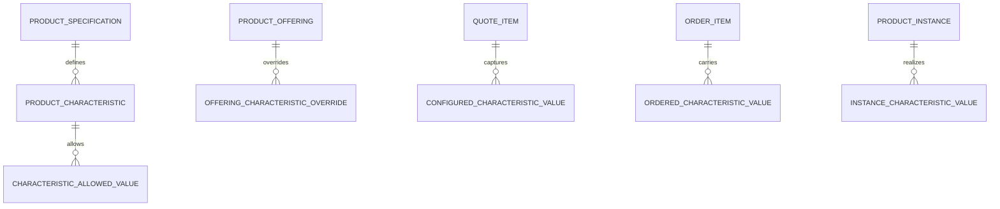
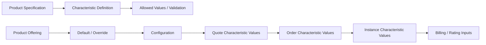

# Part 016 — Product Specification and Characteristic Model

## 1. Core Idea

Dalam enterprise CPQ, Quote, Order, Billing, dan Telco BSS/OSS systems, **product specification dan characteristic model mendefinisikan struktur, konfigurasi, validasi, dan semantic meaning dari produk yang dijual melalui product offering**.

Jika product offering menjawab:

> “Apa yang dijual?”

maka product specification menjawab:

> “Produk ini terdiri dari atribut/karakteristik apa, nilai apa yang valid, aturan apa yang berlaku, dan bagaimana konfigurasi ini dapat dibawa ke quote, order, fulfillment, inventory, dan billing?”

Characteristic model adalah pusat dari catalog-driven CPQ karena banyak variasi produk tidak layak menjadi column hardcoded.

Contoh characteristic:

- bandwidth,
- contract term,
- router type,
- SLA tier,
- number of static IPs,
- installation type,
- service address,
- billing frequency,
- data allowance,
- support level,
- firewall throughput,
- deployment region,
- cloud storage size.

Mental model utama:

> **Product specification defines configurable structure. Product offering commercializes it. Quote captures selected values. Order carries selected values. Inventory stores realized values. Billing may rate or charge using selected values.**

Jika characteristic model buruk, dampaknya:

- konfigurasi produk tidak tervalidasi,
- quote membawa nilai invalid,
- order gagal decomposition,
- billing salah charge,
- product inventory tidak merepresentasikan installed product,
- reporting sulit memfilter produk berdasarkan attribute,
- migration sulit karena attribute tidak punya semantic contract,
- API/event payload menjadi blob tanpa governance.

---

## 2. Product Specification vs Product Offering

Pemisahan ini kritikal.

| Concept | Purpose | Example |
|---|---|---|
| Product Specification | Definisi struktur produk | Internet Access Spec |
| Product Offering | Commercial sellable packaging | Business Internet 100 Mbps |
| Product Characteristic | Attribute yang mendefinisikan/configure produk | bandwidth, SLA tier |
| Characteristic Value | Nilai yang dipilih/default/allowed | 100 Mbps, Gold |
| Product Instance | Produk yang sudah dimiliki customer | Customer A Internet Service #123 |

Contoh:

```text
Product Specification: Internet Access
Characteristics:
- bandwidth
- access_type
- sla_tier
- static_ip_count
- installation_address

Product Offering: Business Internet 100 Mbps
Defaults:
- bandwidth = 100 Mbps
- sla_tier = Standard

Product Offering: Business Internet 500 Mbps Premium
Defaults:
- bandwidth = 500 Mbps
- sla_tier = Premium
```

Offering bisa override/default characteristic dari specification.

Specification memberi struktur reusable. Offering memberi packaging komersial.

---

## 3. Why Characteristic Model Exists

Enterprise product catalog tidak stabil seperti schema aplikasi sederhana.

Produk dapat memiliki attribute yang berbeda-beda:

- connectivity product butuh bandwidth dan access type,
- firewall product butuh throughput dan rule package,
- cloud storage product butuh size dan region,
- support product butuh SLA tier,
- professional service butuh service days,
- usage product butuh allowance dan overage policy.

Jika semua dijadikan column di satu table `product`, schema akan meledak:

```text
bandwidth
router_type
static_ip_count
firewall_throughput
cloud_region
storage_size
support_tier
service_days
installation_type
...
```

Masalahnya:

- banyak null,
- semantic tidak jelas,
- validasi tersebar,
- perubahan produk butuh migration,
- API berubah terus,
- reporting tidak konsisten,
- configuration engine sulit generik.

Characteristic model memberi abstraction untuk attribute yang berubah per specification/offering.

Namun karakteristik yang terlalu dynamic juga berbahaya.

Prinsip:

> **Dynamic attribute boleh fleksibel, tetapi semantic, validation, versioning, queryability, and auditability harus tetap eksplisit.**

---

## 4. Conceptual Model



Conceptual flow:



---

## 5. Core Entities

### 5.1 Product Specification

Product specification adalah definisi produk yang dapat direalisasikan secara commercial/technical.

Field konseptual:

- specification id,
- specification code,
- version,
- name,
- description,
- lifecycle status,
- product type,
- valid from,
- valid to,
- characteristic set,
- relationship to service/resource specification,
- created/updated metadata.

Specification dapat versioned karena characteristic berubah.

Contoh perubahan:

- menambahkan `sla_tier`,
- mengubah allowed bandwidth,
- mengubah default contract term,
- membuat field baru required,
- mengubah validation rule.

Jika specification berubah tanpa versioning, quote lama bisa kehilangan makna.

### 5.2 Product Characteristic

Product characteristic adalah definisi attribute.

Field konseptual:

- characteristic id,
- characteristic code,
- name,
- description,
- data type,
- required flag,
- configurable flag,
- visible flag,
- default value,
- allowed values,
- validation rule,
- unit of measure,
- cardinality,
- lifecycle status,
- valid from,
- valid to,
- version.

Contoh:

```text
characteristic_code: bandwidth
name: Bandwidth
data_type: integer
unit: Mbps
required: true
allowed_values: [100, 250, 500, 1000]
configurable: true
```

### 5.3 Characteristic Value

Characteristic value adalah nilai yang dipilih, diwariskan, dihitung, atau direalisasikan.

Nilai dapat muncul di beberapa tahap:

| Stage | Value Meaning |
|---|---|
| Catalog | default/allowed value |
| Configuration | selected candidate value |
| Quote | commercially proposed value |
| Order | ordered value to fulfill |
| Inventory | realized/installed value |
| Billing | value used for charge/rating |

Jangan menganggap value di semua tahap selalu sama.

Contoh:

- Quote memilih bandwidth 500 Mbps.
- Order membawa bandwidth 500 Mbps.
- Fulfillment hanya bisa provision 450 Mbps sementara.
- Inventory menyimpan realized bandwidth 450 Mbps atau pending correction.
- Billing harus tahu apakah charge tetap 500 atau prorated.

Ini bukan masalah attribute saja. Ini masalah lifecycle correctness.

### 5.4 Attribute Type

Attribute type menentukan bentuk dan validasi value.

Tipe umum:

- string,
- integer,
- decimal,
- boolean,
- date,
- datetime,
- enum,
- money,
- duration,
- quantity,
- reference,
- address,
- complex object,
- list.

Attribute type harus cukup kuat untuk validation dan serialization.

Pitfall:

- semua value disimpan sebagai string,
- enum tidak versioned,
- money tidak punya currency,
- quantity tidak punya unit,
- date tidak jelas timezone,
- reference tidak punya target type.

### 5.5 Required and Optional Attribute

`required` harus dipahami berdasarkan lifecycle.

Sebuah attribute bisa:

- optional saat browsing catalog,
- required saat configuration validation,
- required saat quote submission,
- required saat order submission,
- required sebelum fulfillment,
- required sebelum billing activation.

Contoh:

- `installation_address` mungkin optional saat initial quote draft,
- required sebelum quote submitted,
- mandatory sebelum order fulfillment.

Karena itu, model `required: true/false` saja sering tidak cukup.

Lebih kuat:

```text
RequiredCondition
- characteristicId
- requiredAtStage: CONFIGURATION | QUOTE_SUBMISSION | ORDER_SUBMISSION | FULFILLMENT | BILLING_ACTIVATION
- conditionExpression
- reasonCode
```

### 5.6 Default Value

Default value mempercepat configuration tetapi harus diaudit.

Default dapat berasal dari:

- product specification,
- product offering override,
- customer segment,
- contract/agreement,
- channel,
- region,
- tenant config,
- previous installed product,
- rule evaluation.

Quote harus tahu apakah value:

- user-selected,
- defaulted,
- system-derived,
- inherited,
- overridden,
- migrated.

Ini penting untuk audit dan dispute.

### 5.7 Allowed Value

Allowed value mendefinisikan nilai yang valid.

Contoh:

```text
bandwidth: 100, 250, 500, 1000 Mbps
sla_tier: Standard, Premium, Platinum
contract_term: 12, 24, 36 months
```

Allowed value bisa effective-dated.

Contoh:

- bandwidth 100 Mbps retired mulai 2026-01-01,
- SLA Platinum hanya untuk enterprise segment,
- contract term 36 months hanya untuk region tertentu.

Allowed value juga bisa punya metadata:

- display label,
- sort order,
- deprecated flag,
- default flag,
- eligibility rule,
- price impact,
- fulfillment impact.

---

## 6. Validation Rule Model

Validation rule menjawab:

> Apakah selected characteristic values valid dalam context ini?

Validation bisa bersifat:

- type validation,
- required validation,
- range validation,
- allowed value validation,
- cross-field validation,
- compatibility validation,
- customer eligibility validation,
- geography/serviceability validation,
- contract-based validation,
- inventory-based validation.

Contoh rule:

```text
IF access_type = fiber THEN bandwidth must be one of [100, 250, 500, 1000]
IF sla_tier = platinum THEN customer_segment must be enterprise
IF static_ip_count > 8 THEN approval_required = true
IF contract_term = 36 months THEN discount up to 20% allowed
```

Validation result harus explainable:

```text
ValidationResult
- characteristicCode
- value
- result
- severity
- ruleId
- ruleVersion
- reasonCode
- message
- blocking
```

Tanpa validation trace, user hanya melihat “invalid configuration” tanpa alasan operasional.

---

## 7. Dynamic Attribute Modelling Options

Ada beberapa strategi physical/logical modelling.

### 7.1 Explicit Columns

Contoh:

```sql
bandwidth_mbps INTEGER,
sla_tier TEXT,
static_ip_count INTEGER
```

Cocok untuk:

- field core,
- sering difilter,
- reporting critical,
- invariant critical,
- performance critical.

Risiko:

- schema sering berubah,
- banyak nullable columns,
- kurang fleksibel untuk tenant/product-specific attribute.

### 7.2 EAV Model

```text
entity_id | attribute_code | value
```

Cocok untuk:

- banyak attribute dinamis,
- attribute berbeda per product,
- configurability tinggi.

Risiko:

- query kompleks,
- type safety lemah,
- constraint sulit,
- reporting sulit,
- indexing rumit,
- validation harus kuat di application layer.

### 7.3 JSONB Model

```json
{
  "bandwidth": 500,
  "slaTier": "Premium",
  "staticIpCount": 8
}
```

Cocok untuk:

- flexible payload,
- extension fields,
- configuration snapshot,
- imported external structure,
- audit snapshot.

Risiko:

- schema implicit,
- DB constraint terbatas,
- field rename sulit,
- reporting sulit jika tidak diproyeksikan,
- index harus spesifik.

### 7.4 Relational Attribute Tables

```text
characteristic_definition
allowed_value
configured_characteristic_value
```

Cocok untuk:

- governed flexibility,
- validation,
- audit,
- versioning,
- multi-product configuration.

Risiko:

- lebih banyak join,
- lebih banyak mapping code,
- performance butuh read model/cache.

### 7.5 Hybrid Model

Banyak enterprise system akhirnya memakai hybrid:

- explicit columns untuk core searchable/reportable fields,
- relational characteristic tables untuk governed dynamic attributes,
- JSONB untuk snapshot/extension,
- search projection untuk UI discovery,
- reporting projection untuk analytics.

Senior engineer stance:

> Jangan pilih EAV/JSONB hanya karena fleksibel. Pilih berdasarkan lifecycle, query, reporting, validation, audit, dan integration contract.

---

## 8. Characteristic Across Lifecycle

### 8.1 Catalog Stage

Characteristic definition ada di specification/catalog.

Concern:

- data type,
- allowed values,
- default values,
- required rules,
- visibility,
- lifecycle,
- version.

### 8.2 Configuration Stage

User/system memilih value.

Concern:

- validation,
- compatibility,
- eligibility,
- defaulting,
- error state,
- draft configuration.

### 8.3 Quote Stage

Quote menyimpan proposed values.

Concern:

- snapshot,
- price impact,
- approval impact,
- audit trace,
- immutability after acceptance.

### 8.4 Order Stage

Order membawa ordered values untuk fulfillment.

Concern:

- mapping from quote item,
- technical decomposition,
- downstream payload,
- action-specific validity,
- amend/modify semantics.

### 8.5 Inventory Stage

Inventory menyimpan realized values.

Concern:

- installed characteristics,
- current vs historical values,
- modify/disconnect eligibility,
- source order trace.

### 8.6 Billing Stage

Billing memakai selected/realized values untuk charge/rating.

Concern:

- charge calculation,
- tiered pricing,
- usage allowance,
- invoice explanation,
- dispute trace.

---

## 9. Attribute Versioning

Characteristic definition berubah seiring waktu.

Contoh perubahan:

- allowed value baru ditambahkan,
- value lama deprecated,
- data type berubah,
- default berubah,
- required rule berubah,
- validation rule berubah,
- display label berubah,
- semantic berubah.

Perubahan semantic adalah yang paling berbahaya.

Contoh:

```text
bandwidth = 100
```

Apakah ini 100 Mbps, 100 Kbps, 100 units, atau 100 Mbps symmetrical?

Jika unit/meaning berubah tanpa versioning, data lama menjadi ambiguous.

Versioning strategy:

```text
CharacteristicDefinition
- characteristicCode
- version
- dataType
- unit
- validFrom
- validTo
- lifecycleStatus
```

Quote/order/inventory harus menyimpan reference ke characteristic version atau menyimpan enough snapshot.

---

## 10. Snapshot Strategy

Quote tidak boleh bergantung sepenuhnya pada current characteristic definition.

Saat quote accepted, minimal snapshot:

- characteristic code,
- characteristic name/label saat itu,
- selected value,
- display value,
- unit,
- data type,
- source/default/selected flag,
- validation result reference,
- definition version.

Contoh JSON snapshot:

```json
{
  "characteristicCode": "bandwidth",
  "definitionVersion": 3,
  "label": "Bandwidth",
  "value": 500,
  "displayValue": "500 Mbps",
  "unit": "Mbps",
  "source": "USER_SELECTED"
}
```

Ini bukan pengganti authoritative model, tetapi evidence untuk quote/order audit.

---

## 11. API Model Mapping

API tidak harus mengekspos internal characteristic schema mentah.

Contoh response untuk configurable offering:

```json
{
  "offeringCode": "BUSINESS_INTERNET_500",
  "configuration": {
    "characteristics": [
      {
        "code": "bandwidth",
        "label": "Bandwidth",
        "type": "integer",
        "unit": "Mbps",
        "required": true,
        "allowedValues": [100, 250, 500, 1000],
        "defaultValue": 500
      }
    ]
  }
}
```

Untuk quote submission:

```json
{
  "quoteItemId": "...",
  "characteristicValues": [
    {
      "code": "bandwidth",
      "value": 500,
      "unit": "Mbps"
    }
  ]
}
```

API concern:

- avoid leaking DB IDs where stable codes are better,
- include definition version if needed,
- validate unknown characteristic code,
- handle backward compatibility when adding optional characteristic,
- avoid breaking clients when display metadata changes,
- distinguish value from displayValue.

---

## 12. Event Model Mapping

Events carrying characteristic values must be stable.

Example event payload concept:

```json
{
  "eventType": "QuoteItemConfigured",
  "eventVersion": 2,
  "quoteId": "Q-123",
  "quoteItemId": "QI-456",
  "productOfferingCode": "BUSINESS_INTERNET_500",
  "characteristics": [
    {
      "code": "bandwidth",
      "definitionVersion": 3,
      "value": 500,
      "unit": "Mbps"
    }
  ]
}
```

Event concerns:

- characteristic code must be stable,
- event payload must be versioned,
- consumers should not infer semantic from display label,
- removed characteristic must be backward compatible,
- changed data type requires event version strategy,
- include correlation/causation IDs.

---

## 13. PostgreSQL Implementation Considerations

Illustrative model only:

```sql
CREATE TABLE product_characteristic_definition (
  id UUID PRIMARY KEY,
  specification_id UUID NOT NULL,
  characteristic_code TEXT NOT NULL,
  version INTEGER NOT NULL,
  name TEXT NOT NULL,
  data_type TEXT NOT NULL,
  unit TEXT,
  required BOOLEAN NOT NULL DEFAULT FALSE,
  configurable BOOLEAN NOT NULL DEFAULT TRUE,
  lifecycle_status TEXT NOT NULL,
  valid_from TIMESTAMPTZ NOT NULL,
  valid_to TIMESTAMPTZ,
  created_at TIMESTAMPTZ NOT NULL,
  updated_at TIMESTAMPTZ NOT NULL,
  UNIQUE (specification_id, characteristic_code, version)
);

CREATE TABLE characteristic_allowed_value (
  id UUID PRIMARY KEY,
  characteristic_definition_id UUID NOT NULL,
  value_code TEXT NOT NULL,
  value_json JSONB NOT NULL,
  display_value TEXT NOT NULL,
  sort_order INTEGER,
  lifecycle_status TEXT NOT NULL,
  valid_from TIMESTAMPTZ NOT NULL,
  valid_to TIMESTAMPTZ,
  UNIQUE (characteristic_definition_id, value_code)
);
```

For configured values:

```sql
CREATE TABLE quote_item_characteristic_value (
  id UUID PRIMARY KEY,
  quote_item_id UUID NOT NULL,
  characteristic_code TEXT NOT NULL,
  characteristic_definition_version INTEGER,
  value_json JSONB NOT NULL,
  display_value TEXT,
  unit TEXT,
  value_source TEXT NOT NULL,
  validation_status TEXT NOT NULL,
  created_at TIMESTAMPTZ NOT NULL
);
```

Design notes:

- `value_json` enables multiple data types but needs validation discipline.
- `characteristic_code` gives readable stable reference.
- `definition_version` supports audit.
- `display_value` preserves what user saw.
- `value_source` supports audit/defaulting trace.
- `validation_status` helps debugging quote configuration.

---

## 14. Java/JAX-RS Backend Implications

Characteristic model usually appears in code as:

- catalog configuration DTO,
- validation request/response,
- quote item characteristic values,
- order item characteristic values,
- inventory characteristic values,
- mapper between JSON/API and domain value object,
- rule evaluation input,
- event payload.

Avoid using `Map<String, Object>` everywhere without governance.

Better pattern:

```text
CharacteristicDefinition
CharacteristicValue
CharacteristicValueSet
CharacteristicValidationResult
ConfiguredProduct
```

Even if values are dynamic, create typed wrappers:

```text
CharacteristicCode
CharacteristicDataType
UnitOfMeasure
ValueSource
DefinitionVersion
```

This prevents accidental mistakes like:

- bandwidth passed as string in one API and integer in another,
- unit missing,
- unknown characteristic silently accepted,
- field rename breaking billing consumer,
- default value indistinguishable from user-selected value.

---

## 15. MyBatis/JPA/JDBC Considerations

### 15.1 MyBatis

Good for explicit dynamic queries and mapping.

Watch out for:

- mapping `JSONB` to Java object safely,
- validating characteristic data type before persistence,
- batch insert quote item values,
- avoiding N+1 loads of allowed values,
- query explosion for configurable product screen.

### 15.2 JPA

Can model characteristic definitions, but dynamic values can become awkward.

Watch out for:

- eager loading allowed values accidentally,
- cascade updates to published definitions,
- mutable embeddables in quote snapshot,
- dirty checking on JSON fields,
- large object graph for configuration.

### 15.3 JDBC

Works when performance and explicit control are needed.

Watch out for:

- manual JSON serialization consistency,
- repeated validation code,
- transaction boundary with quote/configuration updates.

---

## 16. Kafka/RabbitMQ/Redis/Camunda Implications

### 16.1 Kafka/RabbitMQ

Characteristic changes may drive events:

- `ProductSpecificationChanged`,
- `CharacteristicDefinitionChanged`,
- `OfferingConfigurationChanged`,
- `QuoteItemConfigured`,
- `OrderItemCharacteristicChanged`,
- `ProductInstanceCharacteristicUpdated`.

Event consumers need stable semantic codes.

### 16.2 Redis

Caching characteristic definitions is common.

Use:

- versioned cache keys,
- invalidation on catalog/specification publish,
- TTL aligned with catalog volatility,
- cache metrics.

Avoid:

- caching unversioned characteristic definition used for quote snapshot,
- caching rule result without input context hash,
- mixing tenant-specific and global characteristics.

### 16.3 Camunda

Workflow may depend on characteristic values.

Examples:

- static IP count > threshold triggers approval,
- installation type determines fulfillment path,
- SLA tier determines escalation timer,
- service address determines serviceability task.

Do not let Camunda process variables become the authoritative product configuration store.

Process variables may snapshot key values, but domain data should remain authoritative in domain service.

---

## 17. Reporting and Analytics Impact

Characteristic values are valuable for reporting:

- revenue by bandwidth,
- fallout by installation type,
- approval rate by discount-driving attribute,
- order cycle time by SLA tier,
- installed base by product option,
- billing disputes by configured term,
- churn by package/attribute.

If values live only in JSONB/EAV without curated projection, analytics becomes painful.

Recommended pattern:

- keep authoritative dynamic values,
- project high-value attributes to reporting columns/dimensions,
- version attribute semantics,
- document metric definitions.

Example reporting projection:

```text
fact_quote_item
- quote_item_id
- offering_code
- product_family
- bandwidth_mbps
- sla_tier
- contract_term_months
- recurring_charge_amount
```

Not every characteristic belongs in reporting fact table. Choose based on KPI/use case.

---

## 18. Microservice Data Ownership

Characteristic definitions may be owned by catalog service.

Characteristic values may be owned by different services depending on lifecycle:

| Data | Likely Owner |
|---|---|
| Characteristic definition | Catalog service |
| Allowed values | Catalog/configuration service |
| Configuration draft values | CPQ/configuration service |
| Quote item values | Quote service |
| Order item values | Order service |
| Realized product values | Inventory service |
| Billing/rating relevant values | Billing/charging service |

Do not let multiple services update the same characteristic value row.

Prefer ownership by lifecycle stage and publish events for downstream projections.

---

## 19. Invariants

Important invariants:

- A selected value must match characteristic data type.
- Required characteristics must exist before lifecycle transition requiring them.
- Value must be within allowed values unless override is explicitly authorized.
- Quote accepted snapshot must not change after acceptance.
- Order item characteristic values must be derived from accepted quote or approved amendment.
- Inventory characteristic values must reference source order/change.
- Billing-relevant values must be traceable to quote/order/inventory source.
- Characteristic code semantic must not change without versioning.
- Retired characteristic must not be used in new configuration unless compatibility policy allows.
- Unit of measure must be explicit for numeric quantities.

---

## 20. Failure Modes

### 20.1 Unknown Characteristic Code

API accepts `bandwith` typo instead of `bandwidth`.

Impact:

- validation bypass,
- billing ignores value,
- fulfillment misses required input.

Detection:

- reject unknown code,
- monitor unknown attribute attempts,
- contract tests.

### 20.2 Type Mismatch

Bandwidth stored as string in one service and integer in another.

Impact:

- rule evaluation fails,
- reporting cast errors,
- event consumer errors.

Detection:

- schema validation,
- event contract tests,
- data quality query.

### 20.3 Missing Required Value

Order submitted without service address or required technical parameter.

Impact:

- fulfillment fallout,
- manual correction,
- SLA breach.

Detection:

- lifecycle validation before submit,
- stuck order/fallout metrics.

### 20.4 Changed Allowed Values Break Old Quotes

Allowed value retired and quote revision fails.

Impact:

- in-flight quote disruption,
- sales friction,
- audit ambiguity.

Detection:

- quote stores definition version,
- compatibility policy for old versions,
- catalog change impact analysis.

### 20.5 JSONB Blob Without Governance

All configuration stored as arbitrary JSON.

Impact:

- no validation,
- no reporting,
- no contract stability,
- difficult migration.

Detection:

- schema drift scan,
- unknown fields report,
- missing characteristic definition mapping.

### 20.6 Value Source Lost

System cannot tell if value was defaulted or selected.

Impact:

- audit dispute,
- approval reasoning missing,
- poor UX for revision.

Detection:

- value_source required,
- audit event check.

---

## 21. Debugging Characteristic Issues

Use this flow:

```text
1. Identify object
   - product offering
   - specification
   - quote item
   - order item
   - product instance

2. Identify characteristic
   - code
   - definition version
   - data type
   - unit

3. Check lifecycle stage
   - configuration
   - quote
   - order
   - inventory
   - billing

4. Check value source
   - user selected
   - defaulted
   - rule derived
   - inherited
   - migrated

5. Check validation
   - required rule
   - allowed value
   - cross-field rule
   - eligibility rule

6. Check snapshot/reference
   - current definition
   - historical definition
   - quote snapshot
   - order carry-over

7. Check integration
   - event payload
   - downstream mapping
   - billing mapping
   - fulfillment mapping

8. Check audit
   - who changed definition
   - who selected/overrode value
   - approval if needed
```

---

## 22. Trade-offs

| Decision | Benefit | Risk |
|---|---|---|
| Explicit columns | Strong constraints, easy reporting | Low flexibility, frequent migration |
| EAV | Flexible, generic | Complex queries, weak type safety |
| JSONB | Flexible snapshot, easy payload storage | Governance/reporting/indexing complexity |
| Relational characteristic tables | Governed flexibility | More joins and mapper complexity |
| Version every characteristic | Audit correctness | Operational overhead |
| No versioning | Simpler | Historical ambiguity |
| Rule-driven required fields | Flexible lifecycle validation | Harder debugging |
| Static required flag | Simple | Insufficient for staged lifecycle |

---

## 23. Correctness Concerns

Check:

- Is every characteristic code stable?
- Is data type explicit?
- Is unit explicit for numeric values?
- Are allowed values versioned/effective-dated?
- Are required fields lifecycle-aware?
- Are quote values snapshotted?
- Are order values traceable to quote/amendment?
- Are inventory values traceable to fulfillment result?
- Are billing-relevant values identified?
- Are invalid/unknown values rejected?
- Are rule results auditable?

---

## 24. Performance Concerns

Characteristic-heavy models can be slow.

Risks:

- loading all definitions for product list,
- joining EAV values for search,
- filtering JSONB without indexes,
- repeated validation rule evaluation,
- N+1 allowed value queries,
- large quote item snapshot payload.

Mitigation:

- load detail only when needed,
- cache definitions by specification/version,
- precompute configuration metadata,
- project search/reporting fields,
- batch load allowed values,
- use JSONB indexes only for stable query patterns,
- limit snapshot payload to evidence required.

---

## 25. Security and Privacy Concerns

Characteristic values can contain sensitive data.

Examples:

- installation address,
- customer-specific configuration,
- security configuration,
- network details,
- private IP ranges,
- contract-specific term,
- commercially sensitive discount-driving attributes.

Security concerns:

- field-level masking,
- API exposure by role,
- audit access,
- retention policy,
- encryption/tokenization if required,
- avoid leaking technical config in sales-facing API.

---

## 26. Auditability Concerns

Audit must answer:

- what characteristic value was selected,
- who selected or changed it,
- whether it was defaulted or overridden,
- what definition version applied,
- what validation rules passed/failed,
- what value was sent to order/fulfillment/billing,
- whether realized inventory value differs from ordered value.

Audit should include:

- before/after value,
- actor,
- timestamp,
- source system,
- reason,
- correlation id,
- rule result reference,
- approval reference if override.

---

## 27. Observability Concerns

Useful metrics:

- invalid configuration count,
- missing required characteristic count,
- unknown characteristic code count,
- validation error rate,
- characteristic definition cache hit rate,
- stale definition cache count,
- quote/order characteristic mismatch count,
- order/inventory characteristic mismatch count,
- billing characteristic mapping error count.

Useful alerts:

- sudden spike in validation failures,
- published specification with missing required metadata,
- order fallout due to missing characteristic,
- billing error due to missing/range-invalid characteristic.

---

## 28. PR Review Checklist

Saat review perubahan specification/characteristic model:

### Semantic

- Apa makna characteristic ini?
- Apakah code stabil?
- Apakah berbeda dari existing characteristic?
- Apakah unit/data type jelas?

### Lifecycle

- Di stage mana attribute required?
- Apakah valid untuk quote draft, quote submit, order submit, fulfillment, atau billing?
- Apakah ada defaulting rule?

### Versioning

- Apakah perubahan ini butuh new version?
- Bagaimana nasib quote/order lama?
- Apakah allowed value effective-dated?

### API/Event

- Apakah field baru backward compatible?
- Apakah event consumer siap?
- Apakah unknown field handling jelas?

### Persistence

- JSONB, EAV, relational table, atau explicit column?
- Apakah query/reporting membutuhkan index/projection?
- Apakah migration/backfill perlu?

### Integration

- Apakah value dipakai fulfillment?
- Apakah value dipakai billing/rating?
- Apakah value dipakai approval/pricing?
- Apakah mapping downstream terdokumentasi?

### Audit and Ops

- Apakah value source disimpan?
- Apakah validation trace ada?
- Apakah data quality check perlu ditambah?
- Apakah observability metric perlu ditambah?

---

## 29. Internal Verification Checklist

Verifikasi di internal codebase/team:

- Di mana product specification disimpan?
- Apa beda internal antara product offering dan product specification?
- Apakah characteristic definition versioned?
- Apakah characteristic code stabil dan terdokumentasi?
- Bagaimana allowed values dimodelkan?
- Apakah allowed values effective-dated?
- Bagaimana required/optional ditentukan per lifecycle stage?
- Apakah default value punya source/trace?
- Apakah value source disimpan di quote/order/inventory?
- Apakah quote menyimpan characteristic snapshot?
- Apakah order membawa characteristic dari accepted quote atau re-resolve dari catalog?
- Bagaimana inventory menyimpan realized characteristic?
- Characteristic mana yang dipakai billing/rating?
- Characteristic mana yang dipakai fulfillment/decomposition?
- Characteristic mana yang dipakai approval/pricing?
- Apakah memakai JSONB, EAV, relational table, atau hybrid?
- Apakah ada reporting projection untuk high-value attributes?
- Apakah API DTO menggunakan characteristic code atau internal id?
- Apakah event payload versioned?
- Apakah validation error punya reason code?
- Apakah Redis cache dipakai untuk definition/allowed values?
- Apakah Camunda process variables menyimpan snapshot value?
- Apakah ada incident karena missing/invalid characteristic?
- Siapa owner semantic characteristic: catalog team, product owner, BA, solution architect, billing team, atau fulfillment team?

---

## 30. Key Takeaways

- Product specification mendefinisikan struktur produk; product offering menjualnya.
- Characteristic model adalah fondasi konfigurasi catalog-driven CPQ.
- Dynamic attribute harus tetap punya semantic, type, unit, validation, versioning, dan audit.
- Required/optional sering bergantung pada lifecycle stage, bukan boolean global.
- Quote/order/inventory/billing dapat membawa value yang berbeda dan semuanya butuh traceability.
- JSONB/EAV memberi fleksibilitas tetapi harus dikontrol dengan definition, validation, projection, dan tests.
- Characteristic tanpa versioning dapat menghancurkan historical correctness.
- Senior engineer harus mereview characteristic change sebagai contract change, bukan sekadar field tambahan.
