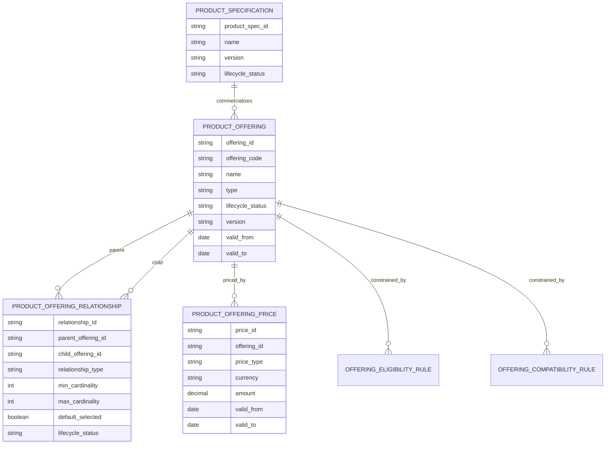
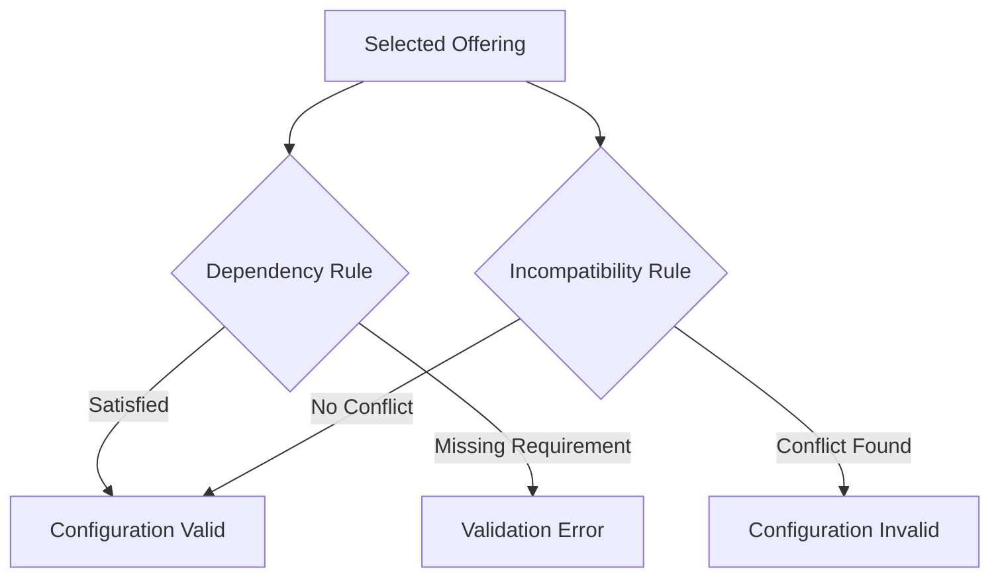
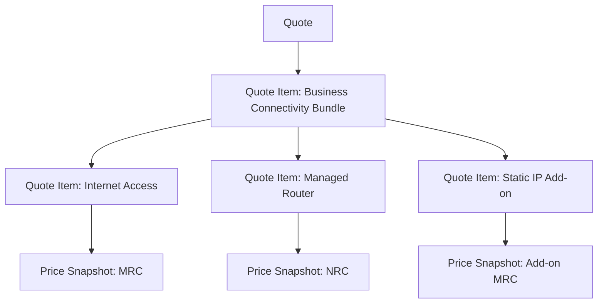
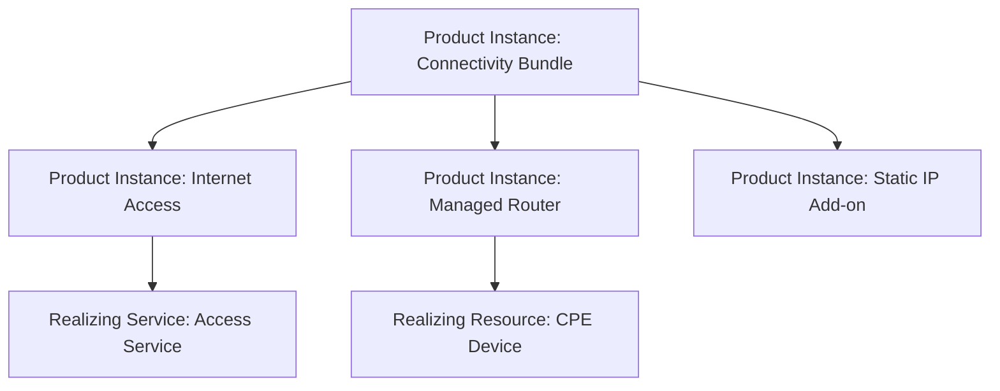

# Part 017 — Product Offering and Bundle Model

## 1. Core Idea

Dalam CPQ, Quote, Order, Catalog, Billing, dan Telco BSS/OSS systems, **product offering adalah bentuk commercial sellable dari product specification**.

Product specification menjelaskan struktur teknis/konseptual produk.

Product offering menjelaskan bagaimana produk itu dijual.

Bundle model menjelaskan bagaimana beberapa offering digabung menjadi satu commercial package yang dapat dikonfigurasi, dihargai, dikutip, diorder, dipenuhi, dan ditagih.

Mental model utama:

> **Product offering is the commercial contract of sellability. Bundle model is the controlled composition of sellable things.**

Offering menjawab:

- apa yang boleh dijual,
- kepada siapa boleh dijual,
- kapan boleh dijual,
- dengan harga apa,
- dalam kombinasi apa,
- dengan dependency apa,
- dengan quantity/cardinality apa,
- dengan lifecycle status apa,
- dan bagaimana offering itu berubah seiring waktu.

Bundle modelling menjadi sulit karena bundle bukan hanya parent-child table.

Bundle membawa semantic penting:

- komponen mandatory,
- komponen optional,
- dependency antar komponen,
- incompatibility antar komponen,
- cardinality minimum/maximum,
- default selection,
- add-on eligibility,
- pricing roll-up,
- quote line expansion,
- order item decomposition,
- billing charge grouping,
- product inventory relationship.

Jika bundle model buruk, dampaknya langsung ke production:

- quote dapat memilih kombinasi produk invalid,
- harga bundle salah dihitung,
- discount salah diterapkan,
- order decomposition gagal,
- fulfillment task tidak lengkap,
- product inventory tidak bisa merepresentasikan installed package,
- billing menagih komponen yang salah,
- customer menerima service yang tidak sesuai quote,
- catalog rollback merusak quote/order in-flight,
- reporting tidak bisa membedakan package revenue vs component revenue.

---

## 2. Product Offering vs Product Specification vs Product Instance

Pemisahan ini wajib jelas.

| Concept | Meaning | Example |
|---|---|---|
| Product Specification | Definisi struktur produk | Internet Access Specification |
| Product Offering | Produk yang dijual secara commercial | Business Internet 100 Mbps |
| Bundle Offering | Offering yang terdiri dari beberapa offering | Business Connectivity Bundle |
| Product Offering Price | Harga yang melekat ke offering | Monthly fee, installation fee |
| Quote Item | Offering yang dipilih dalam quote | Customer memilih Business Internet 100 Mbps |
| Order Item | Instruksi untuk fulfill offering | Add Internet 100 Mbps |
| Product Instance | Produk yang sudah aktif untuk customer | Installed Internet Service #123 |

Kesalahan umum:

> Menjadikan product specification sebagai sellable item langsung.

Dalam enterprise CPQ, biasanya yang dijual adalah **offering**, bukan specification mentah.

Specification adalah template struktur.

Offering adalah packaging commercial.

Quote menangkap selected offering.

Order mengeksekusi selected offering.

Inventory merekam realized product instance.

---

## 3. Simple Offering, Bundle Offering, and Composite Offering

### 3.1 Simple Offering

Simple offering adalah offering yang tidak memiliki child offering secara commercial.

Contoh:

- Business Internet 100 Mbps,
- Static IP Add-on,
- Managed Router,
- Cloud Backup 1 TB,
- Premium Support.

Simple tidak berarti teknisnya sederhana.

Satu simple offering dapat tetap didecompose menjadi banyak service/resource order di OSS.

### 3.2 Bundle Offering

Bundle offering adalah offering yang menjual beberapa offering sebagai satu package.

Contoh:

- Business Connectivity Bundle:
  - Internet Access,
  - Managed Router,
  - Static IP,
  - SLA Gold,
  - Premium Support.

Bundle biasanya memiliki:

- bundle header,
- component offering,
- relationship type,
- cardinality,
- dependency rule,
- compatibility rule,
- pricing rule,
- lifecycle/version.

### 3.3 Composite Offering

Composite offering dapat berarti offering yang memiliki structure internal, tapi tidak selalu dijual sebagai “bundle package” eksplisit.

Misalnya:

- SD-WAN solution,
- MPLS package,
- enterprise unified communication package.

Dalam beberapa organisasi, istilah bundle dan composite dipakai berbeda. Jangan berasumsi.

Gunakan `Internal verification checklist` untuk memastikan istilah internal.

---

## 4. Conceptual Model

Secara conceptual, model minimalnya seperti ini:



Model ini masih conceptual.

Di physical PostgreSQL, Anda perlu mempertimbangkan:

- key strategy,
- versioning,
- effective dating,
- uniqueness constraint,
- index untuk lookup catalog,
- rule storage,
- publication lifecycle,
- tenant/customer segment/channel-specific visibility,
- soft retirement,
- snapshot impact.

---

## 5. Core Entities

### 5.1 Product Offering

Product offering adalah entity utama yang merepresentasikan sesuatu yang bisa dijual.

Field umum:

- offering id,
- offering code,
- name,
- description,
- product specification reference,
- offering type,
- lifecycle status,
- version,
- valid from,
- valid to,
- sellable flag,
- channel eligibility,
- customer segment eligibility,
- catalog reference,
- tenant/reference context,
- created/updated metadata.

Correctness concern:

- offering code harus stabil untuk integration/reporting,
- offering version harus eksplisit,
- lifecycle status tidak boleh ambigu,
- effective date harus konsisten dengan price dan rule,
- retired offering tidak boleh dipakai untuk quote baru,
- existing quote/order mungkin masih boleh memakai offering lama via snapshot/reference-to-version.

### 5.2 Product Offering Relationship

Relationship merepresentasikan hubungan antar offering.

Contoh relationship:

- bundle contains component,
- requires,
- excludes,
- replaces,
- upgrades to,
- downgrades to,
- add-on of,
- optional component,
- mandatory component.

Field umum:

- relationship id,
- parent offering id,
- child offering id,
- relationship type,
- min cardinality,
- max cardinality,
- default selected,
- sequence/display order,
- rule reference,
- valid from,
- valid to,
- lifecycle status.

Correctness concern:

- jangan pakai satu relationship type generik tanpa semantic,
- requires dan contains bukan hal yang sama,
- excludes harus dievaluasi saat configuration,
- replaces/upgrades/downgrades penting untuk modify order,
- relationship juga perlu version/effective date.

### 5.3 Product Offering Price

Price melekat pada offering, tetapi hasil perhitungan harga pada quote harus menjadi snapshot.

Field umum:

- price id,
- offering id,
- price type,
- recurring/one-time/usage,
- amount,
- currency,
- billing frequency,
- charge period,
- valid from/to,
- price version,
- tax category,
- discount eligibility.

Correctness concern:

- price definition bukan invoice charge,
- quote price harus snapshot,
- price change tidak boleh mengubah accepted quote,
- bundle price bisa parent-level, component-level, atau hybrid.

### 5.4 Offering Rule

Rule dapat berupa:

- eligibility rule,
- compatibility rule,
- dependency rule,
- cardinality rule,
- pricing rule,
- discount rule,
- channel visibility rule,
- customer segment rule,
- location/serviceability rule.

Correctness concern:

- rule harus versioned,
- rule result harus traceable,
- rule evaluation harus deterministic untuk quote snapshot,
- rule change harus jelas dampaknya ke in-flight quote.

---

## 6. Bundle Cardinality

Cardinality adalah aturan berapa banyak child offering yang boleh atau wajib dipilih.

Contoh:

| Scenario | min | max | Meaning |
|---|---:|---:|---|
| Mandatory single router | 1 | 1 | Harus pilih tepat satu router |
| Optional add-on | 0 | 1 | Boleh tidak pilih, maksimal satu |
| Multiple static IP blocks | 0 | 10 | Boleh pilih beberapa |
| At least one connectivity option | 1 | n | Harus pilih minimal satu |

Cardinality harus dimodelkan sebagai data, bukan hardcoded di UI.

Kenapa?

Karena cardinality memengaruhi:

- CPQ validation,
- quote item tree,
- order item creation,
- billing line generation,
- inventory relationship,
- reporting package composition.

Failure mode:

- quote accepted tanpa mandatory component,
- UI mengizinkan lebih banyak add-on dari batas,
- order decomposition mengasumsikan child yang tidak ada,
- billing membuat charge untuk default component yang tidak benar-benar dipilih.

---

## 7. Mandatory vs Optional Components

Mandatory component adalah bagian bundle yang harus ada.

Optional component adalah bagian yang dapat dipilih berdasarkan kebutuhan, eligibility, dan compatibility.

Namun real system sering memiliki variasi:

- mandatory but replaceable,
- optional but default-selected,
- optional but required if another option selected,
- mandatory only for certain customer segment,
- mandatory only in certain region,
- mandatory for one sales channel but not another,
- optional during quote but mandatory before order submission.

Jangan modelkan mandatory sebagai boolean sederhana jika rule-nya conditional.

Model yang lebih baik:

- base relationship metadata,
- conditional rule reference,
- rule evaluation result,
- validation error model,
- configuration snapshot.

---

## 8. Dependency and Incompatibility

Dependency menjawab:

> “Jika offering A dipilih, offering B juga harus tersedia/dipilih/valid.”

Incompatibility menjawab:

> “Offering A tidak boleh digabung dengan offering B dalam konteks tertentu.”

Contoh dependency:

- Static IP requires Internet Access,
- Premium SLA requires eligible access product,
- Managed Router requires installation service,
- Cloud backup requires active subscription account.

Contoh incompatibility:

- Basic Support incompatible with Premium Support,
- Residential package incompatible with enterprise account,
- Legacy CPE incompatible with high bandwidth service,
- Discount package incompatible with promotional bundle.

Data modelling pattern:



Correctness concern:

- dependency rule harus dievaluasi dengan catalog version yang sama,
- rule result harus disimpan dalam configuration/quote validation snapshot,
- incompatible combination tidak boleh lolos sampai order creation,
- rule evaluation error harus dibedakan dari rule failure.

---

## 9. Add-on Model

Add-on adalah offering tambahan yang menempel pada parent/base offering.

Contoh:

- Static IP Add-on,
- Premium Support Add-on,
- Additional Bandwidth Add-on,
- Security Pack Add-on,
- Backup Storage Add-on.

Add-on modelling harus menjawab:

- add-on ini attach ke offering apa,
- apakah add-on bisa dibeli sendiri,
- apakah add-on bisa ditambah setelah product aktif,
- apakah add-on bisa dihapus,
- apakah add-on punya lifecycle sendiri,
- apakah add-on punya billing charge sendiri,
- apakah add-on direpresentasikan sebagai product instance terpisah.

Failure mode:

- add-on ditagih tanpa parent product,
- add-on tetap aktif setelah parent disconnected,
- modify order tidak bisa menemukan parent installed product,
- reporting revenue add-on bercampur dengan base revenue.

---

## 10. Package vs Bundle

Dalam beberapa enterprise, package dan bundle dipakai bergantian.

Namun secara modelling, bedakan dua kemungkinan:

| Concept | Meaning |
|---|---|
| Bundle | Composition rule antar offering |
| Package | Commercial packaging untuk market/customer segment/channel |
| Solution | Higher-level offering yang bisa mencakup product/service/resource plan |
| Promotion Package | Temporary commercial packaging dengan discount/validity |

Jangan berasumsi istilah internal sama dengan istilah umum.

Gunakan internal glossary sebagai source of truth.

---

## 11. Offering Version

Offering version penting karena offering berubah.

Yang bisa berubah:

- name/description,
- included components,
- cardinality,
- eligibility rule,
- compatibility rule,
- price reference,
- lifecycle status,
- effective date,
- channel visibility,
- customer segment mapping.

Versioning pattern:

| Pattern | Cocok untuk | Risk |
|---|---|---|
| Mutable current row | Draft/internal admin only | Quote lama bisa berubah diam-diam |
| Versioned row | Published catalog | Lebih kompleks tapi auditable |
| Effective-dated row | Time-based catalog | Harus kuat di timezone/date logic |
| Snapshot into quote | Accepted commercial evidence | Storage lebih besar |

Rule utama:

> Published offering yang sudah dipakai quote/order tidak boleh berubah secara destructive.

---

## 12. Quote Mapping

Saat offering dipilih dalam quote, quote tidak cukup menyimpan `offering_id` saja.

Quote perlu membawa:

- offering reference,
- offering version,
- catalog version,
- selected characteristics,
- selected child offerings,
- price snapshot,
- rule evaluation snapshot,
- eligibility result,
- compatibility result,
- effective date context,
- customer/account context,
- site/location context.

Contoh quote item tree:



Correctness concern:

- quote item tree harus merepresentasikan bundle selection,
- price roll-up harus traceable,
- bundle parent price dan child price harus jelas,
- accepted quote harus tidak berubah saat catalog berubah.

---

## 13. Order Mapping

Order item biasanya berasal dari quote item.

Namun mapping tidak selalu satu-ke-satu.

Kemungkinan:

- satu quote item menjadi satu order item,
- satu bundle quote item menjadi parent order item plus child order items,
- satu product offering menjadi beberapa service/resource fulfillment tasks,
- optional quote item yang tidak dipilih tidak menjadi order item,
- zero-price component tetap perlu order item karena perlu fulfillment,
- billing-only component mungkin tidak punya fulfillment task.

Order mapping harus menyimpan trace:

- source quote id,
- source quote item id,
- offering id/version,
- selected action,
- product configuration snapshot,
- dependency relation,
- fulfillment target,
- billing trigger.

Failure mode:

- quote item hilang saat conversion,
- bundle parent dibuat tanpa child,
- child order item tidak punya source quote item,
- billing trigger tidak tahu charge berasal dari component mana.

---

## 14. Billing Impact

Bundle pricing dapat dimodelkan beberapa cara:

### 14.1 Parent-Level Price

Bundle punya satu harga total.

Pros:

- sederhana untuk customer-facing quote,
- mudah untuk commercial package.

Cons:

- sulit split revenue per component,
- sulit billing jika component lifecycle berbeda,
- sulit partial cancellation.

### 14.2 Component-Level Price

Setiap component punya harga.

Pros:

- granular,
- cocok untuk billing line,
- cocok untuk revenue attribution.

Cons:

- customer-facing quote bisa terlihat kompleks,
- discount roll-up lebih sulit.

### 14.3 Hybrid Price

Bundle punya parent commercial price, component punya internal allocation.

Pros:

- customer-facing sederhana,
- internal reporting lebih kaya.

Cons:

- butuh allocation model,
- audit pricing lebih kompleks.

Internal verification wajib:

- apakah internal billing menerima parent charge, component charge, atau allocation,
- apakah quote price sama dengan billing charge,
- apakah discount diterapkan di parent, child, atau keduanya,
- apakah invoice line merepresentasikan package atau component.

---

## 15. Inventory Impact

Bundle yang dijual dapat menghasilkan inventory structure.

Contoh:



Inventory modelling harus menjawab:

- apakah bundle parent menjadi product instance,
- apakah component menjadi product instance,
- bagaimana parent-child product instance disimpan,
- apa yang terjadi jika child disconnected,
- apakah parent tetap active jika child failed,
- bagaimana modify order menemukan target product instance.

Failure mode:

- installed product tidak merepresentasikan bundle,
- disconnect parent tidak disconnect child,
- billing masih aktif untuk child yang sudah terminated,
- modify add-on tidak bisa menemukan parent.

---

## 16. PostgreSQL Implementation Considerations

Contoh logical-to-physical table split:

```sql
-- illustrative only, not internal schema
product_offering (
    id uuid primary key,
    offering_code text not null,
    version int not null,
    name text not null,
    offering_type text not null,
    product_specification_id uuid not null,
    lifecycle_status text not null,
    valid_from timestamptz not null,
    valid_to timestamptz,
    created_at timestamptz not null,
    updated_at timestamptz not null,
    unique (offering_code, version)
);

product_offering_relationship (
    id uuid primary key,
    parent_offering_id uuid not null,
    child_offering_id uuid not null,
    relationship_type text not null,
    min_cardinality int not null,
    max_cardinality int,
    default_selected boolean not null default false,
    valid_from timestamptz not null,
    valid_to timestamptz,
    check (min_cardinality >= 0),
    check (max_cardinality is null or max_cardinality >= min_cardinality)
);
```

Implementation concern:

- uniqueness `(offering_code, version)`,
- FK to versioned target jika version-specific,
- partial index untuk published/current offering,
- check constraint untuk cardinality,
- exclusion constraint awareness untuk overlapping validity window,
- index by catalog/version/status/channel/tenant,
- avoid circular bundle relationships,
- prevent self-reference relationship.

Possible constraints:

```sql
-- illustrative only
alter table product_offering_relationship
add constraint no_self_relationship
check (parent_offering_id <> child_offering_id);
```

Namun circular dependency antar banyak row biasanya perlu application-level validation atau recursive query validation.

---

## 17. Java/JAX-RS Backend Impact

Dalam Java/JAX-RS service, jangan expose persistence model mentah.

Pisahkan:

- catalog admin DTO,
- product offering domain model,
- quote configuration DTO,
- order conversion model,
- event payload,
- reporting projection.

Service design concern:

- `ProductOfferingService` untuk query published offering,
- `BundleValidationService` untuk cardinality/dependency,
- `CatalogVersionService` untuk effective date resolution,
- `PricingService` untuk price calculation,
- `QuoteConfigurationService` untuk selected options,
- `OrderMappingService` untuk quote item to order item conversion.

Jangan letakkan semua logic di mapper atau repository.

Repository mengambil data.

Domain/application service menjaga rule, lifecycle, dan invariant.

---

## 18. MyBatis/JPA/JDBC Considerations

### MyBatis

Cocok untuk:

- explicit SQL untuk catalog query,
- recursive bundle query,
- optimized joins,
- projection-specific query.

Risk:

- mapper menjadi tempat business logic,
- SQL duplikatif untuk effective dating,
- nested result mapping rumit untuk bundle tree.

### JPA

Cocok untuk:

- entity lifecycle sederhana,
- admin CRUD,
- relational mapping eksplisit.

Risk:

- lazy loading N+1 pada bundle tree,
- cascade yang tidak sengaja mengubah published catalog,
- mutable entity membuat versioning berbahaya.

### JDBC

Cocok untuk:

- high-control read model,
- batch publication,
- backfill/migration.

Risk:

- repetitive mapping,
- consistency rule tersebar.

Recommendation:

> Untuk bundle/catalog query yang kompleks, explicit SQL sering lebih aman daripada object graph magic.

---

## 19. API Model Considerations

API untuk offering harus jelas membedakan:

- catalog browsing,
- offering detail,
- configuration options,
- compatibility validation,
- pricing preview,
- quote item creation,
- catalog admin mutation.

Jangan satukan semua dalam satu DTO besar.

Contoh boundary:

| API Model | Purpose |
|---|---|
| ProductOfferingSummaryResponse | Search/list catalog |
| ProductOfferingDetailResponse | Show offering and components |
| ConfigurationOptionResponse | Show selectable options |
| ConfigurationValidationRequest | Validate selected bundle/options |
| QuoteItemCreateRequest | Persist selected offering into quote |
| CatalogAdminOfferingRequest | Create/update draft offering |

Backward compatibility concern:

- field baru jangan memaksa old client mengirim value,
- deprecated offering relationship type harus tetap bisa dibaca,
- quote created by old API harus tetap convertible jika valid.

---

## 20. Event Model Considerations

Event yang mungkin relevan:

- `ProductOfferingCreated`,
- `ProductOfferingVersionPublished`,
- `ProductOfferingRetired`,
- `BundleRelationshipChanged`,
- `CatalogPublicationCompleted`,
- `OfferingPriceChanged`,
- `QuoteItemConfigured`,
- `QuoteItemValidated`.

Event payload harus membawa:

- event id,
- event type,
- event version,
- offering id,
- offering code,
- offering version,
- catalog id/version,
- lifecycle status,
- effective date,
- correlation id,
- causation id,
- source system.

Important:

> Event should describe a business change, not leak internal table shape.

Consumer tidak seharusnya bergantung pada internal physical schema.

---

## 21. Reporting and Analytics Impact

Reporting sering butuh jawaban:

- revenue by bundle,
- revenue by component,
- attach rate add-on,
- most quoted offering,
- most converted bundle,
- failed configuration by component,
- discount by package,
- fulfillment fallout by offering,
- churn by installed product component.

Karena itu, quote/order/invoice/inventory harus menyimpan cukup reference untuk reporting:

- offering code,
- offering version,
- catalog version,
- parent-child relation,
- component role,
- package/bundle id,
- price component,
- discount allocation,
- lifecycle state.

Jika hanya menyimpan display name, reporting akan rapuh.

---

## 22. Auditability Concern

Audit bundle harus bisa menjawab:

- siapa mengubah bundle,
- kapan relationship berubah,
- apa before/after cardinality,
- rule apa yang berubah,
- offering version apa yang dipublish,
- quote mana yang terdampak,
- order mana yang memakai version lama,
- apakah price berubah bersamaan dengan bundle,
- apakah approval publication dilakukan.

Audit model perlu menangkap business action, bukan hanya row update.

Contoh action:

- `ADD_MANDATORY_COMPONENT`,
- `REMOVE_OPTIONAL_COMPONENT`,
- `CHANGE_CARDINALITY`,
- `RETIRE_ADDON`,
- `PUBLISH_BUNDLE_VERSION`,
- `ROLLBACK_CATALOG_VERSION`.

---

## 23. Failure Modes

### 23.1 Missing Mandatory Component

Quote accepted tanpa mandatory child.

Detection:

- compare quote item tree against catalog version rules,
- validation status not passed,
- missing child where min cardinality > 0.

### 23.2 Invalid Optional Component

Customer memilih add-on yang tidak compatible.

Detection:

- compatibility validation failure,
- rule trace mismatch,
- invalid combination in quote/order.

### 23.3 Price Roll-Up Mismatch

Bundle total tidak sama dengan sum/discounted component price.

Detection:

- quote price summary mismatch,
- child price missing,
- discount allocation mismatch.

### 23.4 Catalog Drift

Quote lama berubah hasilnya karena membaca current catalog, bukan snapshot/version.

Detection:

- accepted quote price differs after catalog update,
- quote references non-versioned offering,
- missing catalog snapshot.

### 23.5 Order Decomposition Gap

Order item tidak lengkap karena bundle mapping salah.

Detection:

- quote item count vs order item count mismatch,
- missing source quote item reference,
- fulfillment task missing for selected component.

### 23.6 Inventory Relationship Gap

Product instance child tidak terhubung ke parent bundle.

Detection:

- installed product orphan,
- active child under terminated parent,
- modify/disconnect order cannot resolve target.

### 23.7 Reporting Misattribution

Revenue package/component salah atribusi.

Detection:

- invoice line lacks offering code/version,
- revenue fact missing bundle parent,
- component allocation absent.

---

## 24. Design Review Questions

Saat mereview bundle/offering model, tanyakan:

1. Apa perbedaan offering, specification, quote item, order item, dan product instance?
2. Apakah relationship type cukup semantic?
3. Apakah cardinality dimodelkan sebagai data?
4. Apakah mandatory/optional bisa conditional?
5. Apakah dependency dan incompatibility versioned?
6. Apakah offering version immutable setelah publish?
7. Apakah quote menyimpan offering version/catalog version?
8. Apakah price snapshot cukup untuk accepted quote?
9. Apakah order conversion preserve parent-child structure?
10. Apakah billing tahu charge berasal dari bundle parent atau component?
11. Apakah inventory dapat merepresentasikan installed bundle?
12. Apakah reporting bisa menghitung revenue by bundle/component?
13. Apakah cache invalidation aman saat offering publish/retire?
14. Apakah API DTO tidak membocorkan schema internal?
15. Apakah event schema stabil untuk consumer?

---

## 25. Internal Verification Checklist

Cek di internal CSG/team:

### Catalog and Offering Model

- Apa definisi internal untuk product offering, product specification, bundle, package, add-on, dan solution?
- Apakah offering punya version eksplisit?
- Apakah offering code stabil lintas environment/release?
- Apakah lifecycle status offering documented?
- Apakah ada distinction draft vs published vs retired?

### Bundle Relationship

- Bagaimana parent-child offering disimpan?
- Apakah relationship type semantic atau generik?
- Apakah cardinality disimpan sebagai data?
- Apakah mandatory/optional conditional?
- Apakah dependency/incompatibility rule punya version?
- Apakah circular relationship dicegah?

### Configuration and Quote

- Bagaimana selected offering masuk ke quote item?
- Apakah quote item menyimpan offering version/catalog version?
- Apakah selected child offering disimpan eksplisit?
- Apakah configuration validation result tersimpan?
- Apakah accepted quote immutable terhadap catalog change?

### Pricing and Billing

- Apakah bundle price parent-level, child-level, atau hybrid?
- Apakah discount diterapkan ke bundle parent atau component?
- Apakah quote price snapshot cukup detail untuk audit?
- Apakah billing menerima component charge atau package charge?
- Apakah invoice line bisa ditrace ke offering/component?

### Order and Fulfillment

- Bagaimana quote item tree berubah menjadi order item tree?
- Apakah zero-price component tetap dibuat jika perlu fulfillment?
- Apakah dependency antar order item berasal dari bundle relationship?
- Apakah order decomposition punya source offering reference?

### Inventory and Reporting

- Apakah installed product menyimpan bundle parent-child relation?
- Apakah add-on lifecycle tied to parent product?
- Apakah revenue reporting bisa by bundle dan by component?
- Apakah historical report tetap benar setelah offering retired?

### Operations

- Apakah ada catalog publication event?
- Apakah cache invalidation by offering/catalog version?
- Apakah ada dashboard untuk invalid configuration/catalog drift?
- Apakah ada incident notes terkait bundle/configuration/pricing mismatch?

---

## 26. Senior Engineer Heuristic

Gunakan heuristic ini:

> **A bundle is not a tree. It is a versioned commercial composition with rules, prices, lifecycle, quote snapshot, order mapping, billing consequence, inventory consequence, and audit obligation.**

Jika sebuah desain hanya punya table `bundle_parent_child`, itu biasanya belum cukup untuk enterprise CPQ.

Pertanyaan paling penting:

> “Apa yang terjadi pada quote, order, billing, dan inventory jika bundle berubah besok?”

Jika jawabannya tidak jelas, model belum production-ready.
