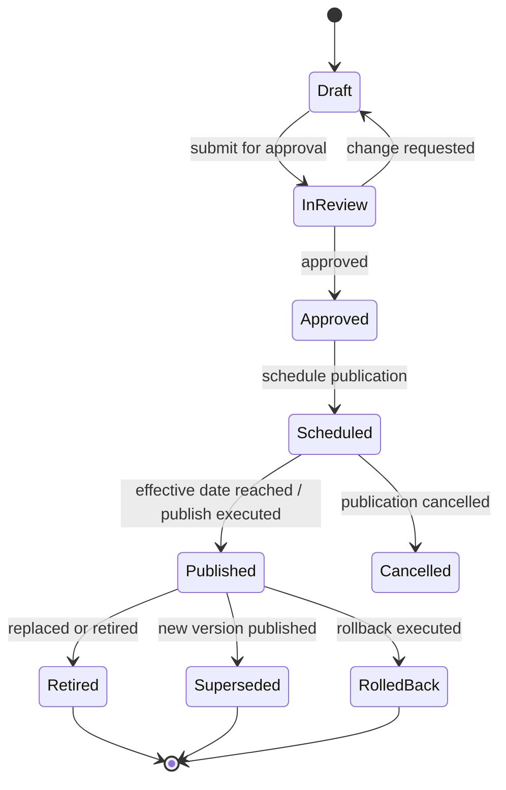
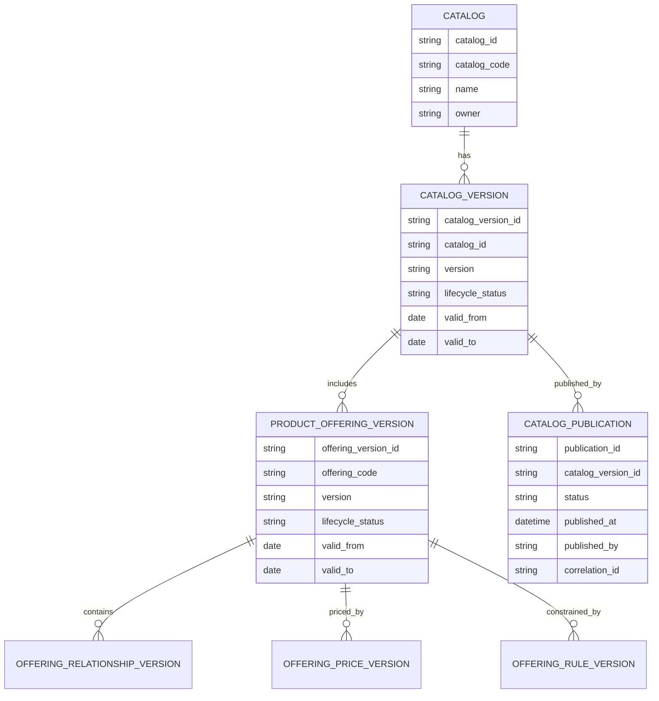
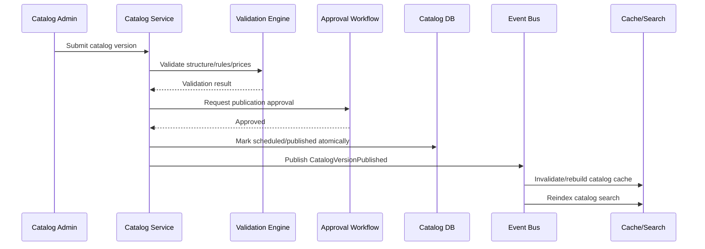

# Part 018 — Catalog Versioning and Publication

## 1. Core Idea

Dalam enterprise CPQ, Quote, Order, Billing, dan Telco BSS/OSS systems, **catalog tidak boleh diperlakukan sebagai static lookup table**.

Catalog adalah source of truth commercial yang berubah seiring waktu.

Perubahan catalog dapat memengaruhi:

- product offering availability,
- bundle composition,
- compatibility rule,
- eligibility rule,
- pricing,
- discount policy,
- quote validity,
- order conversion,
- fulfillment decomposition,
- billing activation,
- product inventory interpretation,
- reporting historical correctness.

Mental model utama:

> **Catalog versioning protects commercial truth across time. Catalog publication controls when that truth becomes usable in production.**

Tanpa versioning dan publication discipline, perubahan catalog akan menghasilkan bug yang sulit dideteksi:

- quote lama berubah harga,
- accepted quote menjadi tidak reproducible,
- order created dari quote memakai catalog version berbeda,
- billing menerima price yang tidak sama dengan quote,
- product inventory mereferensikan offering yang sudah berubah,
- reporting historis salah karena display name/category berubah,
- cache menyajikan catalog lama,
- rollback tidak jelas.

Catalog versioning bukan fitur admin UI saja.

Ini adalah production correctness mechanism.

---

## 2. Why Catalog Versioning Exists

Catalog berubah karena banyak alasan:

- produk baru diluncurkan,
- produk lama dipensiunkan,
- harga berubah,
- bundle diubah,
- add-on ditambahkan,
- compatibility rule diperbarui,
- eligibility region berubah,
- channel visibility berubah,
- regulatory requirement berubah,
- fulfillment mapping berubah,
- billing mapping berubah.

Masalahnya:

> Quote/order/billing adalah proses jangka panjang. Catalog bisa berubah saat proses itu masih berjalan.

Contoh:

1. Sales membuat quote pada 1 Januari menggunakan Catalog v10.
2. Catalog v11 publish pada 5 Januari dan mengubah harga router.
3. Customer menerima quote pada 10 Januari.
4. Quote dikonversi menjadi order pada 12 Januari.
5. Order fulfilled pada 20 Januari.
6. Billing activation terjadi pada 21 Januari.

Pertanyaan correctness:

- harga mana yang berlaku?
- bundle rule mana yang dipakai?
- apakah quote tetap valid?
- apakah order boleh memakai Catalog v11?
- apakah billing harus mengikuti snapshot quote atau current price?
- apakah reporting menggunakan nama offering v10 atau v11?

Jawaban harus ada di model, bukan di asumsi engineer.

---

## 3. Catalog Lifecycle

Catalog lifecycle umum:



Lifecycle status harus punya semantic yang jelas.

| Status | Meaning | Can be used for new quote? |
|---|---|---|
| Draft | Masih diedit | No |
| In Review | Menunggu approval | No |
| Approved | Siap dijadwalkan | Usually no, unless published |
| Scheduled | Akan publish pada effective date | No, kecuali preview |
| Published | Aktif untuk selling/configuration | Yes |
| Superseded | Digantikan versi baru | Usually no for new quote |
| Retired | Tidak dijual lagi | No |
| Rolled Back | Publication dibatalkan/dikembalikan | No for new quote |

Internal system mungkin memakai istilah berbeda.

Yang penting adalah semantic dan allowed usage-nya jelas.

---

## 4. Versioning Granularity

Catalog versioning bisa dilakukan pada beberapa level.

### 4.1 Whole Catalog Version

Seluruh catalog punya version.

Contoh:

- Enterprise Catalog v2026.01,
- Telco B2B Catalog Release 42.

Pros:

- mudah dipahami,
- quote bisa reference satu catalog version,
- publication atomic secara konseptual.

Cons:

- perubahan kecil membuat version besar,
- conflict antar tim catalog bisa meningkat,
- rollback granular sulit.

### 4.2 Offering-Level Version

Setiap offering punya version sendiri.

Pros:

- granular,
- cocok untuk large catalog,
- perubahan satu offering tidak memaksa release seluruh catalog.

Cons:

- quote harus menyimpan banyak version reference,
- compatibility antar offering version lebih kompleks,
- publication consistency perlu dijaga.

### 4.3 Rule-Level and Price-Level Version

Rule dan price punya version sendiri.

Pros:

- pricing/rule dapat berubah independen,
- audit lebih presisi.

Cons:

- quote reproducibility butuh snapshot lengkap,
- lebih banyak mapping dan validation.

### 4.4 Hybrid Versioning

Umumnya enterprise system memakai hybrid:

- catalog release version,
- offering version,
- price version,
- rule version,
- snapshot pada quote.

Heuristic:

> Jika perubahan dapat mengubah hasil quote/order/billing, perubahan itu harus versioned atau snapshotted.

---

## 5. Effective Dating and Validity Window

Catalog version biasanya memiliki waktu berlaku.

Field umum:

- valid from,
- valid to,
- effective date,
- publication timestamp,
- retirement timestamp,
- approval timestamp,
- created/updated timestamp.

Bedakan:

| Field | Meaning |
|---|---|
| created_at | kapan record dibuat secara teknis |
| updated_at | kapan record terakhir berubah |
| approved_at | kapan disetujui |
| published_at | kapan dipublish secara teknis |
| valid_from | kapan berlaku secara business |
| valid_to | kapan berhenti berlaku secara business |
| effective_date | tanggal business untuk mulai berlaku |

Common bug:

> Menggunakan `created_at` sebagai effective date.

Ini salah untuk catalog.

Catalog bisa dibuat hari ini, disetujui besok, dipublish minggu depan, dan effective bulan depan.

---

## 6. Business Time vs System Time

Catalog membutuhkan minimal dua dimensi waktu:

### 6.1 Business Time

Kapan catalog berlaku secara business.

Contoh:

- price valid from 2026-08-01,
- product available until 2026-12-31,
- promotion active during Q4.

### 6.2 System Time

Kapan data masuk/berubah di system.

Contoh:

- row inserted at 2026-07-20 10:12 UTC,
- publication job ran at 2026-07-21 00:00 UTC,
- rollback executed at 2026-07-21 02:00 UTC.

Untuk audit dan incident debugging, keduanya penting.

Bitemporal penuh mungkin tidak selalu perlu, tetapi awareness-nya wajib.

---

## 7. Conceptual Model



Model ini dapat dibuat lebih sederhana atau lebih kompleks tergantung arsitektur internal.

Yang tidak boleh hilang:

- version identity,
- lifecycle status,
- effective date,
- publication evidence,
- rollback/supersession trace,
- quote/order reference strategy.

---

## 8. Draft Catalog

Draft catalog adalah area kerja yang masih bisa berubah.

Ciri-ciri:

- mutable,
- belum boleh digunakan untuk quote production,
- boleh incomplete,
- boleh punya validation error,
- dapat digunakan untuk preview/testing,
- harus punya owner dan change reason.

Data modelling concern:

- draft perlu dipisahkan dari published catalog,
- draft mutation tidak boleh memengaruhi active quote,
- draft validation harus jelas,
- draft delete/cancel harus aman,
- draft harus bisa dibandingkan dengan published version.

Pattern:

| Pattern | Description |
|---|---|
| Separate draft tables | Draft terpisah dari published tables |
| Same table with status | Draft dan published satu table dengan lifecycle status |
| Copy-on-write version | Edit membuat version baru |
| Branch/release model | Catalog draft sebagai release branch |

Tidak ada satu pattern universal.

Yang penting invariant-nya:

> Draft changes must not alter production sellability until publication.

---

## 9. Published Catalog

Published catalog adalah catalog yang boleh dipakai untuk selling/configuration/quote.

Invariant published catalog:

- structurally valid,
- approved,
- effective date valid,
- no broken relationship,
- no invalid cardinality,
- no missing mandatory price/rule where required,
- no incompatible active components,
- no overlapping active version untuk same sellable context,
- auditable publication event exists.

Published catalog sebaiknya immutable secara destructive.

Artinya:

- jangan update row published langsung untuk perubahan business,
- buat version baru,
- publish version baru,
- retire/supersede version lama.

---

## 10. Retired and Superseded Catalog

Retired tidak sama dengan deleted.

Retired berarti tidak boleh dipakai untuk new quote, tetapi mungkin masih dibutuhkan untuk:

- accepted quote historical evidence,
- active order traceability,
- installed product reference,
- billing reference,
- reporting history,
- audit/legal evidence.

Superseded berarti digantikan version lebih baru.

Data harus menjawab:

- version mana menggantikan version mana,
- kapan diganti,
- apakah new quote harus memakai version baru,
- apakah quote lama masih boleh converted,
- apakah order lama masih boleh fulfilled.

Jangan hard delete catalog yang pernah dipakai transaksi.

---

## 11. Publication Process

Publication adalah business operation.

Bukan sekadar `UPDATE status = 'PUBLISHED'`.

Publication process ideal:



Publication must produce evidence:

- who published,
- what version,
- when,
- why/change reason,
- validation result,
- approval reference,
- correlation id,
- previous version,
- effective date,
- impacted offering/price/rule list.

---

## 12. Catalog Snapshot

Snapshot adalah salinan data catalog yang dipakai pada saat quote/order dibuat.

Snapshot dapat berupa:

- full deep snapshot,
- selected field snapshot,
- reference to versioned catalog records,
- hybrid reference + denormalized display fields.

### 12.1 Full Snapshot

Quote menyimpan semua relevant catalog data.

Pros:

- reproducible,
- aman dari catalog drift,
- audit kuat.

Cons:

- storage besar,
- schema evolusi kompleks,
- duplicated data.

### 12.2 Reference to Version

Quote menyimpan `catalog_version_id`, `offering_version_id`, `price_version_id`, `rule_version_id`.

Pros:

- storage lebih kecil,
- structured,
- mudah trace ke catalog.

Cons:

- harus menjamin version record immutable,
- read quote membutuhkan join/reference lookup,
- risk jika version record berubah/destructive delete.

### 12.3 Hybrid

Quote menyimpan reference ke version plus snapshot field penting:

- offering code,
- offering name,
- selected characteristic,
- price amount,
- currency,
- rule result,
- display label.

Ini sering paling praktis.

Heuristic:

> Quote needs enough snapshot to be commercially reproducible even if catalog is changed, retired, or inaccessible.

---

## 13. Backward Compatibility

Catalog versioning harus menjaga backward compatibility untuk transaksi in-flight.

Backward compatibility concern:

- old quote can still be viewed,
- old quote can still be revised if policy allows,
- accepted quote can still convert to order,
- order can still fulfill using old mapping,
- billing can still activate charges,
- inventory can still reference old offering,
- reports can still classify old data.

Breaking catalog changes:

- removing mandatory component,
- changing characteristic type,
- renaming code used by integration,
- deleting price version,
- changing rule semantics,
- changing billing mapping,
- changing fulfillment mapping,
- changing offering hierarchy destructively.

Safe pattern:

- create new version,
- keep old version readable,
- migrate only if business-approved,
- snapshot accepted quote,
- define conversion rule explicitly.

---

## 14. In-Flight Quote Impact

Catalog change affects quote differently depending on quote state.

| Quote State | Catalog Change Policy |
|---|---|
| Draft | May allow refresh/reprice depending policy |
| Configured | Need revalidation if catalog changed |
| Priced | Need explicit reprice if price changed |
| Submitted | Usually lock or require revision |
| Approved | Usually lock pricing/configuration |
| Accepted | Immutable commercial evidence |
| Expired | No new conversion unless renewed/revised |
| Converted | Order should use captured snapshot/mapping |

Important design question:

> Does draft quote automatically move to new catalog version, or does user explicitly refresh/revise?

Automatic refresh is dangerous for commercial correctness.

Better:

- detect stale catalog,
- show validation/reprice required,
- preserve old data until user action,
- audit refresh/reprice.

---

## 15. In-Flight Order Impact

Order should usually not depend on current catalog for core execution once created.

Order should carry enough data from quote/conversion:

- source quote id,
- quote item id,
- offering code/version,
- selected configuration,
- price snapshot or billing handoff data,
- decomposition mapping version,
- fulfillment target data,
- billing trigger data.

Catalog change after order creation should not silently alter order.

Potential exception:

- fulfillment mapping bug fix,
- regulatory correction,
- manual order repair,
- explicit migration.

But those must be explicit operations with audit trail.

---

## 16. Catalog Rollback

Rollback is not simple.

You need to distinguish:

### 16.1 Technical Rollback

Deployment/configuration failed.

Goal:

- restore previous active version,
- invalidate cache,
- stop new usage of faulty version.

### 16.2 Business Rollback

Catalog version was published but business wants to revert.

Goal:

- supersede/retire faulty version,
- define impact on quotes created during bad window,
- decide whether those quotes are valid,
- reconcile orders created during bad window.

Never assume rollback erases history.

Rollback must answer:

- which catalog version was active,
- during what time window,
- which quotes used it,
- which orders were created from it,
- which billing records were affected,
- what repair action is needed.

---

## 17. PostgreSQL Implementation Considerations

Illustrative table sketch:

```sql
-- illustrative only, not internal schema
catalog_version (
    id uuid primary key,
    catalog_id uuid not null,
    version text not null,
    lifecycle_status text not null,
    valid_from timestamptz not null,
    valid_to timestamptz,
    approved_at timestamptz,
    published_at timestamptz,
    retired_at timestamptz,
    previous_version_id uuid,
    created_by text not null,
    created_at timestamptz not null,
    unique (catalog_id, version)
);

catalog_publication (
    id uuid primary key,
    catalog_version_id uuid not null,
    publication_status text not null,
    effective_at timestamptz not null,
    published_at timestamptz,
    published_by text,
    approval_reference text,
    validation_summary jsonb,
    correlation_id text not null,
    created_at timestamptz not null
);
```

Useful constraints/indexes:

- unique `(catalog_id, version)`,
- index `(catalog_id, lifecycle_status)`,
- index `(valid_from, valid_to)`,
- index for current published catalog,
- FK from offering version to catalog version,
- FK from quote snapshot/reference to catalog version,
- no destructive cascade from catalog to quote/order.

Avoid:

- cascade delete from catalog to transactional data,
- mutable published rows,
- unversioned price/rule reference,
- nullable lifecycle status,
- timezone-naive effective dates.

---

## 18. Exclusion and Overlap Awareness

For effective-dated rows, overlapping active validity windows can create ambiguity.

Example bug:

- Product Offering A v1 valid 2026-01-01 to 2026-12-31.
- Product Offering A v2 valid 2026-06-01 to 2026-12-31.
- System asks: what version is active on 2026-07-01?
- Two rows match.

Possible controls:

- publication validator prevents overlap,
- database exclusion constraint if model fits,
- unique active version by context,
- explicit priority/version resolution rule,
- query requires catalog_version_id not date-only lookup.

For enterprise catalog, validation job is often more realistic than relying only on DB constraints.

---

## 19. API Model Considerations

Separate APIs by use case:

| API | Purpose |
|---|---|
| Catalog Admin API | Create/edit draft catalog |
| Catalog Validation API | Validate draft before publication |
| Catalog Publication API | Approve/schedule/publish/retire catalog |
| Catalog Query API | Retrieve active catalog for CPQ |
| Catalog Preview API | Preview scheduled/draft catalog |
| Quote Catalog Resolver | Resolve catalog version for quote |

API response should expose:

- catalog id,
- catalog version,
- lifecycle status,
- valid from/to,
- offering version,
- price version,
- rule version,
- publication metadata where relevant.

Do not expose internal physical table shape as API contract.

---

## 20. Event Model Considerations

Catalog publication should emit events.

Potential events:

- `CatalogVersionCreated`,
- `CatalogVersionSubmitted`,
- `CatalogVersionApproved`,
- `CatalogVersionScheduled`,
- `CatalogVersionPublished`,
- `CatalogVersionRetired`,
- `CatalogVersionRolledBack`,
- `ProductOfferingVersionPublished`,
- `ProductOfferingVersionRetired`,
- `CatalogValidationFailed`.

Event metadata:

- event id,
- event version,
- catalog id,
- catalog version,
- effective date,
- previous version,
- publication id,
- actor,
- correlation id,
- causation id,
- source system,
- impacted offering count/list if reasonable.

Consumers:

- CPQ configuration service,
- pricing service,
- search index,
- cache layer,
- reporting projection,
- downstream fulfillment mapping service,
- billing mapping service.

Correctness concern:

> Event consumers must be idempotent because publication events may be retried.

---

## 21. Cache and Search Impact

Catalog is often cached aggressively.

Cache risks:

- stale active catalog,
- stale price,
- stale compatibility rule,
- stale bundle tree,
- stale search index,
- mixed version cache values.

Cache key should usually include version context:

```text
catalog:{tenant}:{catalogCode}:{catalogVersion}:offering:{offeringCode}:{offeringVersion}
```

Bad cache key:

```text
offering:{offeringCode}
```

Because it cannot distinguish versions.

Publication must trigger:

- cache invalidation,
- cache warmup if needed,
- search reindex,
- readiness check,
- fallback behavior if cache rebuild fails.

---

## 22. Java/JAX-RS Backend Impact

Service responsibilities should be explicit:

- `CatalogDraftService`: manages mutable draft,
- `CatalogValidationService`: validates structural correctness,
- `CatalogPublicationService`: controls lifecycle transition,
- `CatalogResolverService`: resolves applicable catalog version,
- `QuoteCatalogSnapshotService`: creates quote snapshot/reference,
- `CatalogRollbackService`: handles rollback/supersession,
- `CatalogEventPublisher`: emits publication events.

Do not put publication logic inside controller.

JAX-RS resource should orchestrate request/response, not own lifecycle rules.

Example API boundary:

```text
POST /catalogs/{catalogId}/versions/{version}/submit
POST /catalogs/{catalogId}/versions/{version}/validate
POST /catalogs/{catalogId}/versions/{version}/publish
POST /catalogs/{catalogId}/versions/{version}/retire
GET  /catalogs/{catalogId}/versions/active?asOf=...
```

Internal API shape must follow team standards.

This is conceptual.

---

## 23. MyBatis/JPA/JDBC Considerations

### MyBatis

Good for:

- explicit active catalog resolution query,
- versioned offering lookup,
- bundle tree retrieval,
- validation queries,
- reporting projections.

Risk:

- effective-date filter duplicated across mappers,
- missing lifecycle predicate,
- query accidentally returns retired version.

### JPA

Good for:

- draft/admin lifecycle if aggregate is manageable,
- optimistic locking on draft edits.

Risk:

- accidental mutation of published entity,
- cascade update/delete touching versioned rows,
- lazy loading bundle tree inefficient.

### JDBC

Good for:

- publication batch,
- validation job,
- reindex/backfill,
- large catalog migration.

Risk:

- manual mapping bugs,
- duplicated lifecycle rule.

Recommendation:

> Centralize catalog version resolution. Do not let every repository invent its own `active catalog` query.

---

## 24. Reporting and Historical Correctness

Historical reporting must not depend on current catalog only.

Example questions:

- How many quotes used Catalog v10?
- What revenue came from offering version 3?
- Which orders were created during faulty catalog publication?
- Which customers have installed products from retired offering?
- What was the attach rate before/after bundle change?

Transactional records should preserve:

- catalog version,
- offering code,
- offering version,
- price version,
- rule version/result,
- display name snapshot if needed,
- parent-child bundle reference,
- publication id or effective context.

Without this, reporting becomes historically unstable.

---

## 25. Observability for Catalog Versioning

Useful metrics:

- active catalog version by tenant/channel,
- catalog publication success/failure count,
- catalog validation error count,
- stale quote count,
- quote reprice required count,
- cache rebuild duration,
- search reindex lag,
- quote/order count by catalog version,
- orders created from retired/superseded catalog,
- price mismatch after catalog publication,
- failed order decomposition due to missing catalog mapping.

Useful alerts:

- no active catalog for tenant/channel,
- overlapping active catalog versions,
- publication event not consumed,
- cache version does not match DB active version,
- quote conversion failing due to catalog reference missing,
- billing mapping missing for published offering.

---

## 26. Failure Modes

### 26.1 Catalog Drift

Quote reads current catalog instead of quote-time version/snapshot.

Detection:

- accepted quote changes after catalog publish,
- quote price recomputed differently,
- quote item display changes unexpectedly.

Prevention:

- reference versioned catalog,
- snapshot critical fields,
- immutable accepted quote.

### 26.2 Overlapping Validity

Two active catalog/offering versions match same date/context.

Detection:

- validation query finds overlapping windows,
- resolver returns multiple candidates.

Prevention:

- publication validation,
- unique active version by context,
- explicit version resolution rule.

### 26.3 Missing Catalog Version in Quote

Quote stores only offering id/code.

Detection:

- quote cannot reproduce configuration,
- order conversion uses current catalog.

Prevention:

- required catalog/offering/price version reference,
- quote snapshot creation.

### 26.4 Retired Catalog Used for New Quote

UI/API allows new quote with retired offering.

Detection:

- quote created date after offering valid_to,
- quote catalog version lifecycle not published.

Prevention:

- catalog resolver enforces lifecycle/effective date,
- API validation.

### 26.5 Rollback Without Impact Analysis

Catalog rolled back but affected quotes/orders not identified.

Detection:

- no publication window audit,
- no query by publication id/version.

Prevention:

- publication id stored,
- impacted transaction report,
- rollback runbook.

### 26.6 Cache Version Mismatch

Cache serves old/new mixed catalog data.

Detection:

- DB active version differs from cache active version,
- inconsistent bundle tree in quote configuration.

Prevention:

- versioned cache keys,
- publication event-driven invalidation,
- cache readiness check.

### 26.7 Billing Mapping Missing

Offering published without billing mapping.

Detection:

- order completes but billing activation fails,
- validation job finds missing charge mapping.

Prevention:

- publication validation includes billing mapping completeness.

---

## 27. Internal Verification Checklist

Cek di internal CSG/team:

### Versioning Semantics

- Apakah catalog punya version eksplisit?
- Apakah product offering punya version eksplisit?
- Apakah price/rule punya version eksplisit?
- Apakah version immutable setelah publish?
- Apakah ada concept catalog release?

### Lifecycle and Publication

- Apa status lifecycle catalog internal?
- Siapa boleh publish catalog?
- Apakah publication butuh approval?
- Apakah validation dijalankan sebelum publish?
- Apakah publication atomic atau bertahap?
- Apakah ada scheduled publication?

### Effective Dating

- Field mana yang berarti business effective date?
- Field mana yang berarti system timestamp?
- Apakah timezone policy UTC?
- Apakah valid_from/valid_to inclusive/exclusive?
- Bagaimana overlap validity dicegah?

### Quote and Order Impact

- Apakah quote menyimpan catalog version?
- Apakah quote item menyimpan offering version?
- Apakah quote menyimpan price snapshot?
- Apakah accepted quote immutable?
- Apakah order conversion memakai quote snapshot atau current catalog?
- Bagaimana draft quote direprice saat catalog berubah?

### Billing and Fulfillment Mapping

- Apakah catalog publication memvalidasi billing mapping?
- Apakah catalog publication memvalidasi fulfillment/decomposition mapping?
- Apakah mapping juga versioned?
- Apakah order tetap executable setelah catalog retired?

### Rollback and Operations

- Apakah ada rollback process?
- Apakah rollback menyimpan audit?
- Apakah bisa query quotes/orders affected by catalog version?
- Apakah publication event meng-invalidate Redis/cache/search index?
- Apakah ada observability untuk stale catalog/cache mismatch?

### Reporting and Audit

- Apakah reporting menyimpan catalog/offering version?
- Apakah audit mencatat before/after catalog relationship/rule/price?
- Apakah ada data dictionary untuk catalog fields?
- Apakah incident terkait catalog mismatch pernah terjadi?

---

## 28. PR Review Checklist

Saat mereview perubahan catalog versioning/publication, tanyakan:

1. Apakah perubahan ini mutable update atau version baru?
2. Apakah published data berubah destructive?
3. Apakah quote lama tetap reproducible?
4. Apakah accepted quote tetap immutable?
5. Apakah order conversion memakai captured version?
6. Apakah billing mapping tetap valid?
7. Apakah fulfillment mapping tetap valid?
8. Apakah cache/search invalidation jelas?
9. Apakah event publication idempotent?
10. Apakah rollback impact analysis bisa dilakukan?
11. Apakah reporting historis tetap benar?
12. Apakah effective date timezone-safe?
13. Apakah overlap validity dicegah?
14. Apakah migration/backfill diperlukan?
15. Apakah internal docs/glossary diperbarui?

---

## 29. Senior Engineer Heuristic

Gunakan heuristic ini:

> **Catalog is not current state only. Catalog is commercial truth across time.**

Desain catalog yang production-ready harus bisa menjawab:

- apa yang aktif sekarang,
- apa yang aktif saat quote dibuat,
- apa yang disetujui customer,
- apa yang dikonversi menjadi order,
- apa yang harus ditagih,
- apa yang diinstall,
- apa yang sudah retired,
- apa yang berubah dan siapa yang mengubah,
- apa dampak rollback.

Pertanyaan paling penting:

> “Jika catalog berubah hari ini, transaksi mana yang boleh berubah dan transaksi mana yang harus tetap sama?”

Jika jawaban ini tidak eksplisit di model, catalog belum aman untuk mission-critical CPQ/order/billing production system.
