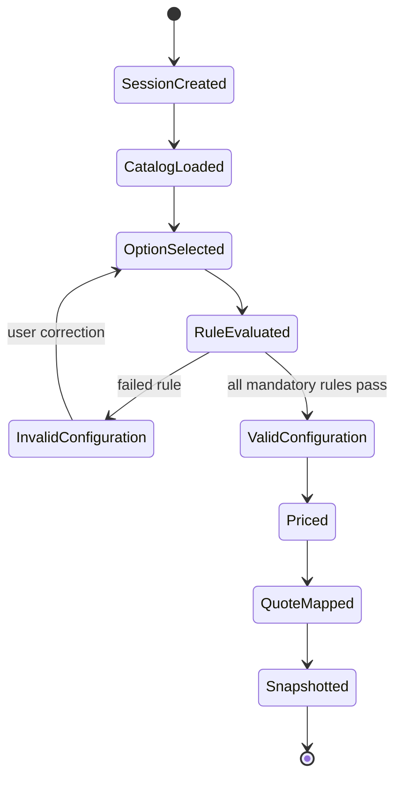
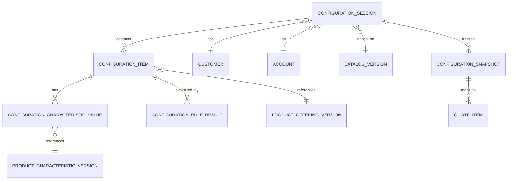

# Catalog-Driven Configuration Model

## 1. Core idea

Catalog-driven configuration adalah pola dimana konfigurasi produk tidak ditentukan secara hard-coded di aplikasi, tetapi dikendalikan oleh data catalog: product offering, product specification, characteristic, allowed value, relationship, eligibility rule, compatibility rule, dependency rule, cardinality, price applicability, dan lifecycle status.

Dalam CPQ, konfigurasi adalah jembatan antara catalog dan quote. User tidak sekadar memilih produk. User membentuk konfigurasi komersial yang harus valid terhadap catalog version tertentu, customer context tertentu, site tertentu, channel tertentu, agreement tertentu, dan effective date tertentu.

Mental model paling penting:

> Configuration is not just user input. Configuration is catalog-constrained commercial intent.

Konfigurasi yang benar harus bisa menjawab:

- product offering apa yang dipilih;
- catalog version mana yang menjadi referensi;
- option/characteristic apa yang dipilih;
- rule apa yang dievaluasi;
- rule mana yang passed, failed, overridden, atau membutuhkan approval;
- price mana yang applicable;
- discount mana yang allowed;
- quote item mana yang terbentuk dari konfigurasi;
- order item mana yang nanti dihasilkan;
- audit evidence apa yang menjelaskan kenapa konfigurasi dianggap valid.

Dalam sistem enterprise, konfigurasi yang tidak traceable akan menjadi sumber bug serius: quote bisa accepted dengan konfigurasi tidak valid, order bisa gagal didecompose, billing bisa salah charge, atau fulfillment menerima product structure yang tidak bisa diprovision.

---

## 2. Why catalog-driven configuration exists

Konfigurasi berbasis catalog ada karena enterprise product model jarang sederhana. Product sering memiliki:

- bundle dan add-on;
- mandatory component dan optional component;
- cardinality rule;
- compatibility rule;
- eligibility rule;
- customer segment rule;
- region/site availability;
- contract-specific offering;
- channel-specific offering;
- price version dan promotion;
- technical feasibility constraint;
- serviceability constraint;
- approval threshold;
- fulfillment dependency.

Tanpa model konfigurasi berbasis catalog, logic akan tersebar di UI, backend, pricing service, order service, dan workflow. Akibatnya, sistem menjadi sulit diaudit dan sulit diprediksi.

Catalog-driven configuration memindahkan banyak aturan menjadi data yang bisa:

- versioned;
- effective-dated;
- tested;
- published;
- rolled back;
- audited;
- reused oleh UI, API, quote, pricing, dan order decomposition.

Tetapi ada trade-off: semakin dinamis model konfigurasi, semakin besar kebutuhan terhadap validation, indexing, rule traceability, dan test data.

---

## 3. Configuration lifecycle in CPQ

Lifecycle konfigurasi biasanya berjalan seperti ini:



Penjelasan lifecycle:

1. **SessionCreated**  
   User atau API mulai konfigurasi untuk customer/channel/site/effective date tertentu.

2. **CatalogLoaded**  
   Sistem mengambil catalog version yang applicable. Ini tidak boleh ambiguous.

3. **OptionSelected**  
   User memilih offering, bundle component, characteristic value, quantity, site, atau term.

4. **RuleEvaluated**  
   Eligibility, compatibility, dependency, cardinality, validation, dan pricing applicability dievaluasi.

5. **InvalidConfiguration**  
   Ada rule yang gagal, mandatory option belum dipilih, characteristic invalid, atau offering tidak eligible.

6. **ValidConfiguration**  
   Konfigurasi valid untuk konteks bisnis tertentu.

7. **Priced**  
   Pricing engine menghitung price item, discount eligibility, tax awareness, dan margin-related data.

8. **QuoteMapped**  
   Konfigurasi diproyeksikan menjadi quote item/quote line.

9. **Snapshotted**  
   Data konfigurasi yang digunakan untuk quote disimpan sebagai evidence agar tidak berubah diam-diam saat catalog berubah.

---

## 4. Key domain concepts

### 4.1 Configurable product

Configurable product adalah product offering yang memiliki variasi pilihan. Variasi bisa datang dari:

- child offering;
- product characteristic;
- option group;
- quantity;
- term;
- location;
- service level;
- feature flag;
- pricing plan;
- technical attribute.

Configurable product berbeda dari simple product. Simple product bisa langsung dikutip tanpa pilihan tambahan. Configurable product memerlukan validation state.

### 4.2 Configuration session

Configuration session adalah working state selama user memilih dan memvalidasi produk.

Session biasanya mutable. Tetapi hasilnya harus bisa dipersist sebagai snapshot ketika masuk quote.

Common fields:

- `configuration_session_id`;
- `customer_id`;
- `account_id`;
- `channel`;
- `site_id`;
- `catalog_version_id`;
- `effective_date`;
- `currency`;
- `status`;
- `validation_status`;
- `created_by`;
- `created_at`;
- `updated_at`.

### 4.3 Selected option

Selected option merepresentasikan pilihan user terhadap offering/component/characteristic.

Contoh:

- selected bandwidth = 1 Gbps;
- selected contract term = 24 months;
- selected add-on = static IP;
- selected service level = premium support;
- selected site = Jakarta branch;
- selected quantity = 10.

Selected option harus menunjuk ke catalog element yang versioned, bukan hanya label text.

### 4.4 Characteristic value

Characteristic value adalah nilai atribut konfigurasi.

Contoh:

- `bandwidth = 100Mbps`;
- `ip_type = static`;
- `service_level = gold`;
- `contract_term_months = 24`;
- `installation_type = onsite`.

Dalam data model, characteristic value harus punya metadata:

- characteristic definition reference;
- selected value;
- data type;
- unit of measure;
- source;
- validation status;
- snapshot label;
- catalog version reference.

### 4.5 Rule evaluation

Rule evaluation adalah hasil evaluasi business rule terhadap konfigurasi.

Rule evaluation bukan sekadar boolean. Dalam enterprise CPQ, rule result harus explainable.

Fields yang sering dibutuhkan:

- `rule_id`;
- `rule_version`;
- `rule_type`;
- `input_context_hash`;
- `result`;
- `severity`;
- `message`;
- `blocking`;
- `override_allowed`;
- `evaluated_at`;
- `evaluated_by_system`;
- `trace_payload`.

### 4.6 Eligibility rule

Eligibility menentukan apakah customer/context boleh membeli offering tertentu.

Eligibility dapat bergantung pada:

- customer segment;
- account type;
- geography;
- sales channel;
- contract/agreement;
- installed product;
- serviceability;
- tenant;
- effective date;
- regulatory constraints.

### 4.7 Compatibility rule

Compatibility menentukan apakah dua pilihan boleh muncul bersama.

Contoh:

- add-on A hanya bisa dipilih jika base product B dipilih;
- feature X tidak compatible dengan feature Y;
- bandwidth tertentu hanya valid untuk access technology tertentu;
- product family tertentu tidak boleh digabung dengan legacy package.

### 4.8 Dependency rule

Dependency menentukan pilihan yang harus ada sebelum pilihan lain valid.

Contoh:

- static IP add-on membutuhkan internet access product;
- premium support membutuhkan enterprise plan;
- managed router membutuhkan installation service;
- billing add-on membutuhkan billing account tertentu.

### 4.9 Configuration validity

Configuration validity adalah status akhir apakah konfigurasi boleh dipakai untuk quote.

Status minimal:

- `DRAFT`;
- `VALIDATING`;
- `VALID`;
- `INVALID`;
- `STALE`;
- `SNAPSHOTTED`;
- `EXPIRED`.

`STALE` penting ketika catalog version atau rule version berubah setelah konfigurasi dibuat.

### 4.10 Configuration snapshot

Snapshot adalah frozen representation dari konfigurasi saat dipakai quote.

Snapshot harus cukup kaya untuk menjawab:

- apa yang dipilih;
- berdasarkan catalog version apa;
- rule apa yang evaluated;
- price apa yang calculated;
- message/error/override apa yang terjadi;
- siapa yang membuat perubahan;
- kapan konfigurasi dianggap valid.

---

## 5. Conceptual model



Conceptual model menekankan bahwa configuration session adalah working state, sementara configuration snapshot adalah evidence untuk quote.

---

## 6. Logical model

### 6.1 Configuration session

Suggested logical fields:

| Field | Meaning |
|---|---|
| `configuration_session_id` | Internal surrogate ID |
| `public_configuration_id` | Public/reference ID untuk API/UI |
| `tenant_id` | Tenant boundary jika SaaS multi-tenant |
| `customer_id` | Customer context |
| `account_id` | Account context |
| `site_id` | Location/site context |
| `catalog_version_id` | Catalog version yang dipakai |
| `effective_date` | Business effective date |
| `currency_code` | Currency untuk pricing |
| `channel_code` | Sales channel |
| `status` | Draft, valid, invalid, stale, snapshotted |
| `validation_status` | Detailed validation status |
| `last_evaluated_at` | Waktu rule evaluation terakhir |
| `created_by` | Actor pembuat |
| `created_at` | Timestamp create |
| `updated_at` | Timestamp update |
| `version` | Optimistic lock/version |

### 6.2 Configuration item

| Field | Meaning |
|---|---|
| `configuration_item_id` | Internal ID |
| `configuration_session_id` | Parent session |
| `parent_configuration_item_id` | Untuk bundle/tree |
| `product_offering_version_id` | Offering version yang dipilih |
| `product_specification_version_id` | Specification version jika relevan |
| `item_role` | Base, add-on, component, option |
| `quantity` | Quantity |
| `action` | Add, modify, disconnect, etc. jika configuration untuk existing product |
| `site_id` | Site-specific item |
| `sequence_no` | Ordering dalam bundle/tree |
| `validation_status` | Valid/invalid/warning |
| `state` | Draft/selected/removed/snapshotted |

### 6.3 Configuration characteristic value

| Field | Meaning |
|---|---|
| `configuration_characteristic_value_id` | Internal ID |
| `configuration_item_id` | Parent item |
| `characteristic_version_id` | Characteristic definition version |
| `value_text` | Text value |
| `value_number` | Numeric value |
| `value_boolean` | Boolean value |
| `value_json` | Complex value jika diperlukan |
| `unit_of_measure` | Unit |
| `value_source` | User, default, rule, inherited, external |
| `validation_status` | Valid/invalid/warning |
| `display_label_snapshot` | Label snapshot untuk audit/UI |

### 6.4 Configuration rule result

| Field | Meaning |
|---|---|
| `configuration_rule_result_id` | Internal ID |
| `configuration_session_id` | Session |
| `configuration_item_id` | Item jika item-specific |
| `rule_id` | Rule reference |
| `rule_version` | Rule version evaluated |
| `rule_type` | Eligibility, compatibility, dependency, validation, pricing |
| `result` | PASS, FAIL, WARNING, OVERRIDDEN, SKIPPED |
| `severity` | INFO, WARNING, BLOCKING |
| `message_code` | Stable error/message code |
| `message_text_snapshot` | Human-readable snapshot |
| `input_hash` | Hash of evaluation context |
| `trace_json` | Optional detailed trace |
| `evaluated_at` | Timestamp |

### 6.5 Configuration snapshot

| Field | Meaning |
|---|---|
| `configuration_snapshot_id` | Snapshot ID |
| `configuration_session_id` | Source session |
| `quote_id` | Quote reference jika sudah mapped |
| `snapshot_version` | Snapshot revision |
| `catalog_version_id` | Catalog version frozen |
| `rule_set_version_id` | Rule set version frozen |
| `snapshot_json` | Frozen representation |
| `created_by` | Actor/system |
| `created_at` | Timestamp |

---

## 7. Physical modelling in PostgreSQL

### 7.1 Normalized tables vs JSON snapshot

Untuk configuration, pola yang sering sehat adalah kombinasi:

- normalized tables untuk current working state dan queryable fields;
- JSONB snapshot untuk immutable evidence;
- audit table untuk change history;
- rule result table untuk explainability.

Normalized tables cocok untuk:

- query item by offering;
- validation dashboard;
- quote mapping;
- detecting stale configuration;
- reporting common dimensions.

JSONB snapshot cocok untuk:

- preserving original shape;
- regulatory/commercial evidence;
- comparing revisions;
- avoiding complex joins for historical quote evidence.

### 7.2 Example table sketch

```sql
CREATE TABLE cpq_configuration_session (
  configuration_session_id BIGINT GENERATED ALWAYS AS IDENTITY PRIMARY KEY,
  public_configuration_id UUID NOT NULL UNIQUE,
  tenant_id BIGINT NOT NULL,
  customer_id BIGINT,
  account_id BIGINT,
  site_id BIGINT,
  catalog_version_id BIGINT NOT NULL,
  effective_date DATE NOT NULL,
  currency_code CHAR(3) NOT NULL,
  channel_code TEXT NOT NULL,
  status TEXT NOT NULL,
  validation_status TEXT NOT NULL,
  last_evaluated_at TIMESTAMPTZ,
  created_by TEXT NOT NULL,
  created_at TIMESTAMPTZ NOT NULL DEFAULT now(),
  updated_at TIMESTAMPTZ NOT NULL DEFAULT now(),
  version BIGINT NOT NULL DEFAULT 0,
  CONSTRAINT chk_configuration_status
    CHECK (status IN ('DRAFT', 'VALIDATING', 'VALID', 'INVALID', 'STALE', 'SNAPSHOTTED', 'EXPIRED'))
);
```

```sql
CREATE TABLE cpq_configuration_item (
  configuration_item_id BIGINT GENERATED ALWAYS AS IDENTITY PRIMARY KEY,
  configuration_session_id BIGINT NOT NULL REFERENCES cpq_configuration_session(configuration_session_id),
  parent_configuration_item_id BIGINT REFERENCES cpq_configuration_item(configuration_item_id),
  product_offering_version_id BIGINT NOT NULL,
  product_specification_version_id BIGINT,
  item_role TEXT NOT NULL,
  action TEXT NOT NULL DEFAULT 'ADD',
  quantity NUMERIC(18, 4) NOT NULL DEFAULT 1,
  site_id BIGINT,
  sequence_no INTEGER NOT NULL DEFAULT 0,
  validation_status TEXT NOT NULL,
  state TEXT NOT NULL,
  created_at TIMESTAMPTZ NOT NULL DEFAULT now(),
  updated_at TIMESTAMPTZ NOT NULL DEFAULT now(),
  CONSTRAINT chk_configuration_quantity_positive CHECK (quantity > 0)
);
```

```sql
CREATE TABLE cpq_configuration_rule_result (
  configuration_rule_result_id BIGINT GENERATED ALWAYS AS IDENTITY PRIMARY KEY,
  configuration_session_id BIGINT NOT NULL REFERENCES cpq_configuration_session(configuration_session_id),
  configuration_item_id BIGINT REFERENCES cpq_configuration_item(configuration_item_id),
  rule_id TEXT NOT NULL,
  rule_version TEXT NOT NULL,
  rule_type TEXT NOT NULL,
  result TEXT NOT NULL,
  severity TEXT NOT NULL,
  message_code TEXT,
  message_text_snapshot TEXT,
  input_hash TEXT,
  trace_json JSONB,
  evaluated_at TIMESTAMPTZ NOT NULL DEFAULT now()
);
```

### 7.3 Indexing considerations

Common indexes:

```sql
CREATE INDEX idx_cfg_session_customer
  ON cpq_configuration_session (tenant_id, customer_id, updated_at DESC);

CREATE INDEX idx_cfg_session_status
  ON cpq_configuration_session (tenant_id, status, updated_at DESC);

CREATE INDEX idx_cfg_item_session
  ON cpq_configuration_item (configuration_session_id, sequence_no);

CREATE INDEX idx_cfg_item_offering
  ON cpq_configuration_item (product_offering_version_id);

CREATE INDEX idx_cfg_rule_result_session
  ON cpq_configuration_rule_result (configuration_session_id, result, severity);

CREATE INDEX idx_cfg_rule_trace_gin
  ON cpq_configuration_rule_result USING GIN (trace_json);
```

Be careful dengan GIN index pada JSONB. Gunakan hanya jika query benar-benar membutuhkan field di dalam JSONB.

---

## 8. Configuration to quote mapping

Konfigurasi tidak selalu sama dengan quote item. Mapping-nya harus eksplisit.

Possible mapping patterns:

1. **One configuration item to one quote item**  
   Simple product.

2. **One bundle configuration item to many quote items**  
   Bundle dipecah menjadi parent quote item dan child quote item.

3. **Many configuration values to one quote item**  
   Characteristic menjadi attribute pada quote line.

4. **One configuration item to non-billable quote item**  
   Item hanya untuk fulfillment, tidak muncul sebagai charge.

5. **Configuration error blocks quote mapping**  
   Invalid configuration tidak boleh menghasilkan quote item yang submitted.

Mapping table dapat berguna:

| Field | Meaning |
|---|---|
| `configuration_item_id` | Source configuration item |
| `quote_item_id` | Target quote item |
| `mapping_type` | DIRECT, BUNDLE_PARENT, BUNDLE_CHILD, DERIVED |
| `created_at` | Mapping timestamp |

Invariants:

- quote item submitted harus berasal dari valid configuration atau explicitly manual item yang allowed;
- quote item harus menyimpan catalog/configuration reference yang cukup untuk audit;
- accepted quote tidak boleh bergantung pada mutable configuration session;
- perubahan configuration setelah quote snapshot tidak boleh mengubah accepted quote secara diam-diam.

---

## 9. API model implications for Java/JAX-RS

REST API untuk configuration sebaiknya membedakan command, query, dan validation.

Example resource shape:

```http
POST /configurations
GET /configurations/{id}
PATCH /configurations/{id}/items/{itemId}
POST /configurations/{id}/validate
POST /configurations/{id}/price
POST /configurations/{id}/snapshot
POST /quotes/{quoteId}/configuration:import
```

Important API design rules:

- jangan expose internal database IDs sebagai satu-satunya identifier public;
- gunakan idempotency key untuk create/update yang bisa di-retry;
- validate request terhadap catalog version, bukan hanya JSON schema;
- pisahkan validation response dari persistence response;
- jangan menjadikan API DTO sama dengan DB entity;
- include `configurationVersion` atau `etag` untuk optimistic concurrency;
- response harus menyertakan validation errors dengan stable `messageCode`.

Example validation response:

```json
{
  "configurationId": "a4f1e4d4-7f90-4b9e-8b81-39b8e7a5c801",
  "status": "INVALID",
  "catalogVersion": "catalog-2026-07",
  "errors": [
    {
      "code": "COMPATIBILITY_FAILED",
      "severity": "BLOCKING",
      "itemRef": "item-002",
      "message": "Static IP requires Internet Access base offering.",
      "ruleRef": "rule-static-ip-base-access:v3"
    }
  ]
}
```

---

## 10. MyBatis/JPA/JDBC implications

### 10.1 MyBatis

MyBatis cocok jika query configuration cukup kompleks, tree-based, dan performance-sensitive.

Recommended practice:

- gunakan mapper eksplisit untuk session, item, characteristic, rule result;
- hindari giant join untuk seluruh configuration jika tidak perlu;
- load tree dengan query terkontrol;
- gunakan batch insert untuk item/characteristic values;
- handle optimistic locking secara eksplisit.

### 10.2 JPA

JPA bisa digunakan, tetapi hati-hati dengan:

- lazy loading tree yang memicu N+1;
- cascade delete yang terlalu agresif;
- orphan removal yang tidak sesuai audit requirement;
- entity graph terlalu besar;
- dirty checking pada object graph besar.

Untuk model configuration yang kompleks, JPA entity sebaiknya tidak langsung menjadi API DTO.

### 10.3 JDBC

JDBC berguna untuk:

- batch processing;
- backfill;
- validation query;
- projection rebuild;
- high-volume insert rule results.

---

## 11. Event model implications

Events yang mungkin muncul:

- `ConfigurationSessionCreated`;
- `ConfigurationItemSelected`;
- `ConfigurationValidated`;
- `ConfigurationInvalidated`;
- `ConfigurationPriced`;
- `ConfigurationSnapshotted`;
- `ConfigurationImportedToQuote`.

Event payload tidak harus berisi seluruh configuration detail. Pilih berdasarkan consumer need.

Example event envelope:

```json
{
  "eventId": "9fdcce6e-1ff7-4061-8cd1-2f07dc1f2155",
  "eventType": "ConfigurationValidated",
  "eventVersion": 1,
  "aggregateType": "ConfigurationSession",
  "aggregateId": "a4f1e4d4-7f90-4b9e-8b81-39b8e7a5c801",
  "occurredAt": "2026-07-12T10:15:30Z",
  "correlationId": "corr-123",
  "payload": {
    "tenantId": "tenant-001",
    "status": "VALID",
    "catalogVersion": "catalog-2026-07",
    "ruleSetVersion": "rules-42",
    "blockingErrorCount": 0,
    "warningCount": 2
  }
}
```

Correctness concerns:

- event harus dipublish setelah DB commit melalui outbox pattern;
- consumer harus idempotent;
- event version harus backward-compatible;
- jangan mengandalkan event ordering global;
- gunakan aggregate ID sebagai ordering key jika perlu.

---

## 12. Redis/cache implications

Configuration sering butuh cache untuk:

- catalog lookup;
- rule metadata;
- allowed values;
- compatibility matrix;
- product offering tree;
- pricing applicability.

Tetapi cache dapat menyebabkan stale configuration.

Cache key harus versioned:

```text
catalog:{tenantId}:{catalogVersionId}:offering-tree:{offeringId}
rules:{tenantId}:{ruleSetVersion}:compatibility:{offeringId}
price-applicability:{tenantId}:{priceVersion}:{offeringId}:{channel}:{currency}
```

Avoid key seperti:

```text
catalog:current:offering:{offeringId}
```

Karena `current` bisa berubah saat user masih membuat quote.

---

## 13. Camunda/workflow implications

Configuration biasanya bukan workflow utama, tetapi bisa menjadi input untuk workflow approval.

Camunda integration sebaiknya menyimpan:

- `configuration_snapshot_id`;
- `quote_id`;
- `approval_request_id`;
- `process_instance_id`;
- `business_key`;
- validation result summary;
- pricing summary;
- approval-relevant rule result.

Jangan menyimpan seluruh mutable configuration session sebagai process variable jika ukurannya besar dan sering berubah. Gunakan reference ke snapshot atau compact summary.

---

## 14. Reporting and analytics impact

Configuration data berguna untuk:

- most selected options;
- invalid configuration rate;
- rule failure frequency;
- product bundle attach rate;
- configuration-to-quote conversion rate;
- quote abandonment rate;
- pricing recalculation frequency;
- catalog stale configuration count;
- manual override frequency.

Reporting model sebaiknya tidak langsung query nested JSON snapshot untuk semua kebutuhan. Gunakan projection untuk metric umum:

- `fact_configuration_session`;
- `fact_configuration_rule_result`;
- `dim_product_offering`;
- `dim_catalog_version`;
- `dim_customer_segment`;
- `dim_channel`;
- `dim_site`.

---

## 15. Microservices ownership

Possible ownership split:

| Data | Likely owner |
|---|---|
| Catalog definition | Catalog service |
| Rule definition | Catalog/rule service or policy service |
| Configuration session | CPQ/configuration service |
| Quote item | Quote service |
| Price calculation | Pricing service |
| Product inventory | Inventory service |
| Serviceability | Serviceability/network service |
| Approval | Approval/workflow service |

Important rule:

> Configuration service may reference catalog data, but should not become owner of catalog definitions.

Use replicated read model if configuration needs fast lookup of catalog data. Do not write directly to catalog tables from CPQ configuration logic.

---

## 16. Invariants

Configuration invariants:

1. A valid configuration must reference a known catalog version.
2. A selected option must be allowed under the selected offering version.
3. Mandatory components must be selected before configuration is valid.
4. Cardinality constraints must be satisfied.
5. Incompatible options cannot coexist unless an explicit override is allowed and audited.
6. Characteristic values must match data type and allowed value rules.
7. A quote item submitted from configuration must reference a configuration snapshot, not only a mutable session.
8. Accepted quote must not change if catalog changes later.
9. Rule results used for approval must be traceable to rule version.
10. Stale configuration must be revalidated before pricing or quote submission.

---

## 17. Failure modes

### 17.1 Stale catalog

Configuration created against catalog version A, then catalog version B is published. If system silently uses B during pricing, quote may contain inconsistent product/price.

Detection:

- compare session `catalog_version_id` with pricing catalog version;
- count configurations with status `STALE`;
- audit recalculation events.

### 17.2 Invalid bundle accepted

Mandatory child missing but quote accepted.

Detection:

- query accepted quote items where bundle parent has missing mandatory children;
- compare quote item tree with catalog bundle rule snapshot.

### 17.3 Rule result not persisted

Approval or rejection cannot be explained later.

Detection:

- accepted/submitted quote without validation rule results;
- approval request without pricing/eligibility trace.

### 17.4 JSON-only configuration becomes unqueryable

All configuration values stored as JSONB without projection, making validation/reporting slow.

Detection:

- slow reports extracting JSON fields;
- repeated application-side scanning;
- lack of indexable dimensions.

### 17.5 UI and backend rule drift

UI allows selection that backend rejects, or backend accepts option UI hides.

Detection:

- compare UI rule source and backend rule source;
- monitor validation failure after UI success;
- contract test catalog/rule endpoints.

### 17.6 Price mismatch

Configuration priced with different selected options than quote snapshot.

Detection:

- compare configuration snapshot hash and pricing input hash;
- store pricing input trace;
- reconcile quote price items against configuration item IDs.

---

## 18. Debugging data issues

When debugging configuration issues, ask:

1. Which catalog version was used?
2. Which rule set version was used?
3. Was configuration status valid at quote submission time?
4. Was there any stale flag?
5. Were all mandatory options selected?
6. Were compatibility/dependency rules evaluated?
7. Was pricing based on the same configuration snapshot?
8. Was the quote mapped from mutable session or immutable snapshot?
9. Was there an override? Who approved it?
10. Did downstream order decomposition use the quote snapshot or re-read catalog current state?

Useful diagnostic queries:

```sql
SELECT status, validation_status, catalog_version_id, last_evaluated_at, updated_at
FROM cpq_configuration_session
WHERE public_configuration_id = :configurationId;
```

```sql
SELECT rule_type, result, severity, message_code, rule_id, rule_version, evaluated_at
FROM cpq_configuration_rule_result
WHERE configuration_session_id = :sessionId
ORDER BY evaluated_at DESC;
```

```sql
SELECT i.configuration_item_id,
       i.parent_configuration_item_id,
       i.product_offering_version_id,
       i.item_role,
       i.validation_status,
       i.state
FROM cpq_configuration_item i
WHERE i.configuration_session_id = :sessionId
ORDER BY i.parent_configuration_item_id NULLS FIRST, i.sequence_no;
```

---

## 19. Trade-offs

### 19.1 Normalized model vs JSONB snapshot

| Option | Strength | Weakness |
|---|---|---|
| Normalized model | Queryable, constrained, reportable | More tables, harder schema evolution |
| JSONB model | Flexible, preserves shape | Harder constraints, indexing/reporting risk |
| Hybrid | Balanced | Requires discipline and clear boundary |

### 19.2 Dynamic rules vs hard-coded validation

| Option | Strength | Weakness |
|---|---|---|
| Dynamic rules | Business configurable, versionable | Rule engine complexity |
| Hard-coded rules | Simple, type-safe | Slow to change, scattered logic |
| Hybrid | Stable invariants in code, variable rules in data | Requires governance |

### 19.3 Mutable session vs immutable snapshot

| Option | Strength | Weakness |
|---|---|---|
| Mutable session | Good UX, easy editing | Unsafe as quote evidence |
| Immutable snapshot | Audit-safe | Needs copy/version strategy |

---

## 20. Review checklist

Use this checklist when reviewing catalog-driven configuration changes:

- Does configuration reference a specific catalog version?
- Are rule results persisted with rule version?
- Are mandatory/optional/cardinality rules explicit?
- Is compatibility/dependency validation backend-enforced?
- Is quote submission blocked for invalid/stale configuration?
- Is accepted quote based on immutable snapshot?
- Is pricing input trace linked to configuration snapshot?
- Are JSONB fields queryable where reporting needs them?
- Are cache keys versioned?
- Is optimistic locking used for concurrent edits?
- Are API DTO, DB entity, event payload, and snapshot separated?
- Are validation errors stable and user-actionable?
- Are override paths auditable?
- Is stale catalog handling defined?
- Are migration/backfill needs considered for characteristic changes?

---

## 21. Internal verification checklist

Verify in your internal CSG/team context:

- Where configuration session is stored.
- Whether configuration is persisted before quote creation or only embedded in quote.
- Whether product configuration uses normalized tables, JSON, or hybrid model.
- How catalog version is selected during configuration.
- How stale configuration is detected when catalog changes.
- How eligibility, compatibility, dependency, and cardinality rules are represented.
- Whether rule results are persisted and auditable.
- Whether UI and backend share rule source or can drift.
- How configuration maps to quote item and quote line.
- Whether quote stores configuration snapshot.
- Whether accepted quote is immutable.
- How pricing input is linked to configuration.
- How order decomposition uses configuration/quote snapshot.
- How Redis/cache stores catalog/rule/configuration data.
- Whether Kafka/RabbitMQ events are emitted for configuration changes.
- Whether configuration validation has metrics and dashboards.
- Which incidents involved invalid configuration, stale catalog, or price mismatch.
- Which senior engineer, solution architect, BA, or product owner owns configuration semantics.

---

## 22. Senior engineer mental model

A senior engineer should not treat configuration as a UI form. Configuration is a lifecycle object that mediates catalog, pricing, quote, approval, order, fulfillment, and billing.

Strong configuration modelling has these properties:

- catalog-version aware;
- rule-version aware;
- validation-state aware;
- snapshot-based for quote evidence;
- explainable for approval and audit;
- queryable enough for reporting and debugging;
- cache-aware but not cache-dependent for correctness;
- protected by backend invariants;
- isolated by ownership boundaries;
- observable in production.

Weak configuration modelling usually has these smells:

- selected options stored only as unstructured JSON;
- no catalog version reference;
- UI-only validation;
- no rule evaluation trace;
- quote recalculates against current catalog instead of snapshot;
- accepted quote can change when catalog changes;
- no stale configuration state;
- no mapping from configuration item to quote item;
- no way to explain why an option was allowed or rejected.

---

## 23. Key takeaway

Catalog-driven configuration is the mechanism that turns catalog definitions into valid commercial intent. In CPQ systems, it is one of the highest-risk data modelling areas because it sits before quote, price, approval, order, fulfillment, and billing.

The correctness question is not only:

> Can the user select this option?

The real enterprise question is:

> Can we prove, months later, that this configuration was valid for this customer, this catalog version, this effective date, this agreement, this price, this quote, and this order?
