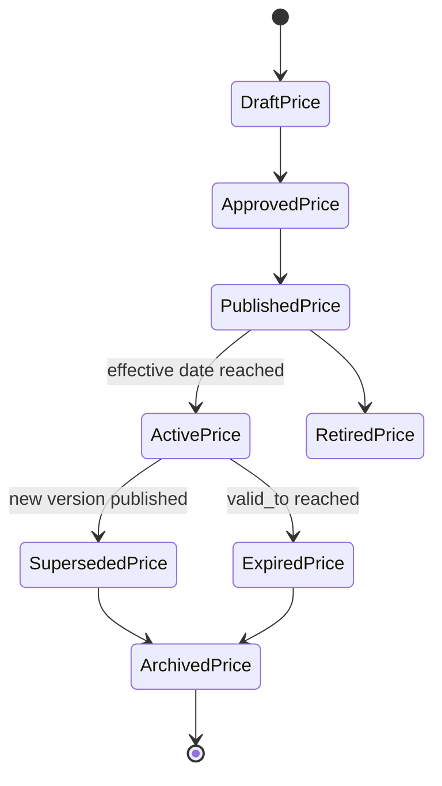
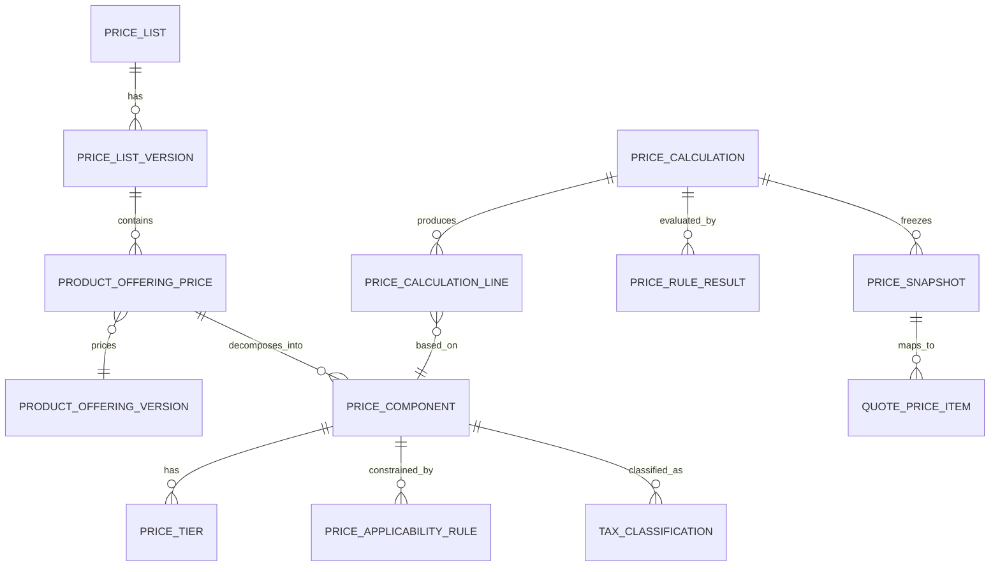
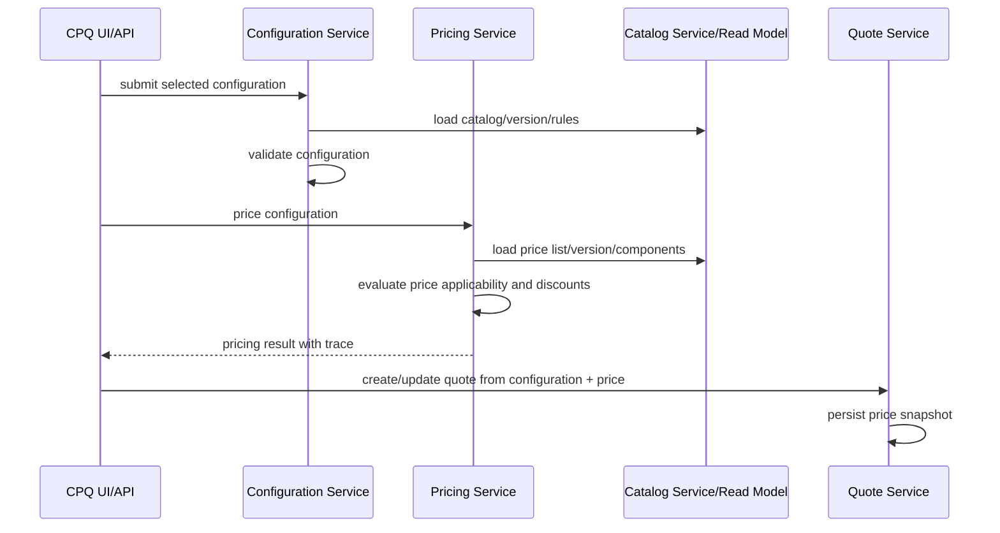
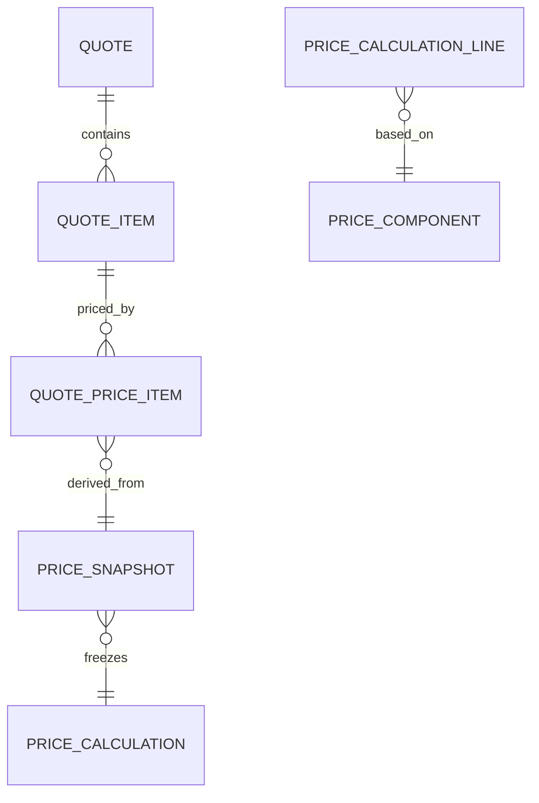

# Pricing Data Model

## 1. Core idea

Pricing data model adalah struktur data yang menjelaskan bagaimana harga didefinisikan, kapan berlaku, untuk produk apa, untuk customer/channel/currency/site/agreement mana, bagaimana harga dihitung, bagaimana discount diterapkan, bagaimana tax diperhitungkan, dan bagaimana hasil pricing disimpan sebagai snapshot pada quote dan billing handoff.

Dalam CPQ, pricing bukan sekadar angka. Pricing adalah keputusan komersial yang harus:

- valid terhadap catalog;
- valid terhadap effective date;
- valid terhadap currency;
- valid terhadap customer/account/agreement;
- traceable terhadap rule dan price version;
- explainable kepada approval workflow;
- stable setelah quote accepted;
- compatible dengan billing;
- auditable saat terjadi dispute.

Mental model utama:

> Price definition is reusable commercial policy. Price calculation is contextual. Price snapshot is evidence.

Jangan mencampur tiga hal ini:

1. **Price definition**  
   Harga yang didefinisikan di catalog atau price list.

2. **Price calculation**  
   Proses menghitung harga untuk customer/context/configuration tertentu.

3. **Price snapshot**  
   Hasil harga yang dibekukan pada quote/order/billing evidence.

---

## 2. Why pricing data model exists

Pricing menjadi kompleks karena enterprise product tidak hanya punya satu harga.

Harga dapat bergantung pada:

- product offering;
- product option;
- bundle composition;
- quantity;
- term length;
- currency;
- geography;
- sales channel;
- customer segment;
- agreement;
- promotion;
- discount approval;
- effective date;
- price list version;
- tax jurisdiction;
- billing frequency;
- usage volume;
- tenant/customer-specific override.

Jika pricing tidak dimodelkan dengan benar, failure mode-nya serius:

- quote price berbeda dari billing charge;
- discount tidak bisa dijelaskan;
- accepted quote berubah karena price list update;
- renewal memakai harga salah;
- invoice dispute tidak bisa ditrace;
- approval threshold salah;
- revenue leakage;
- regulatory/commercial audit gagal.

---

## 3. Price lifecycle



Lifecycle pricing harus dipisahkan dari lifecycle quote.

Price bisa berubah setelah quote dibuat. Karena itu quote harus menyimpan price snapshot atau reference ke immutable price version.

---

## 4. Key pricing concepts

### 4.1 Price list

Price list adalah kumpulan price definitions untuk konteks tertentu.

Price list bisa dibedakan berdasarkan:

- market;
- region;
- channel;
- customer segment;
- tenant;
- currency;
- agreement;
- effective period.

Common fields:

- `price_list_id`;
- `price_list_code`;
- `name`;
- `currency_code`;
- `market_code`;
- `channel_code`;
- `status`;
- `valid_from`;
- `valid_to`;
- `version`.

### 4.2 Product offering price

Product offering price adalah harga yang melekat ke product offering atau option.

Satu product offering bisa punya banyak price components:

- one-time charge;
- recurring charge;
- usage charge;
- installation charge;
- termination charge;
- equipment charge;
- discountable component;
- tax applicable component.

### 4.3 One-time charge

One-time charge dikenakan sekali.

Contoh:

- activation fee;
- installation fee;
- setup fee;
- equipment purchase;
- migration fee.

Important fields:

- amount;
- currency;
- charge timing;
- tax category;
- discount eligibility;
- billing trigger.

### 4.4 Recurring charge

Recurring charge dikenakan per periode.

Contoh:

- monthly subscription;
- annual license;
- support fee;
- managed service fee.

Important fields:

- amount;
- billing frequency;
- proration rule;
- contract term;
- start condition;
- end condition;
- renewal behavior.

### 4.5 Usage charge

Usage charge bergantung pada usage/rating.

Contoh:

- per GB;
- per minute;
- per transaction;
- per API call;
- overage fee.

Important fields:

- unit of measure;
- rating unit;
- aggregation period;
- allowance;
- tier rule;
- rounding rule.

### 4.6 Tiered price

Tiered price adalah harga berdasarkan bracket.

Contoh:

| Quantity | Unit price |
|---:|---:|
| 1–10 | 100 |
| 11–50 | 90 |
| 51+ | 80 |

Perlu jelas apakah pricing bersifat:

- tiered cumulative;
- volume-based;
- block-based;
- graduated;
- stepped.

### 4.7 Volume price

Volume price biasanya menentukan harga berdasarkan total quantity atau usage volume.

Failure mode umum: sistem salah membedakan volume pricing dan tiered pricing.

### 4.8 Discount

Discount dapat berupa:

- percentage discount;
- fixed amount discount;
- recurring discount;
- one-time discount;
- bundle discount;
- agreement discount;
- promotional discount;
- manual discount;
- approval-based discount.

Discount model akan dibahas lebih dalam di part berikutnya, tetapi pricing model harus menyediakan extension point.

### 4.9 Promotion

Promotion biasanya memiliki:

- campaign code;
- eligibility period;
- customer segment;
- channel;
- product applicability;
- stacking rule;
- usage limit;
- discount effect;
- audit evidence.

### 4.10 Tax awareness

Pricing model tidak selalu menghitung tax final, tetapi harus tax-aware.

Minimal harus menyimpan:

- tax category;
- tax inclusive/exclusive flag;
- jurisdiction reference;
- taxable amount basis;
- exemption indicator jika relevan.

### 4.11 Currency

Currency bukan label. Currency memengaruhi:

- precision;
- rounding;
- conversion;
- price list selection;
- quote total;
- billing handoff;
- reporting.

Jangan menyimpan amount tanpa currency.

### 4.12 Price validity

Price validity menentukan kapan harga bisa digunakan.

Fields penting:

- `valid_from`;
- `valid_to`;
- `effective_from`;
- `effective_to`;
- `published_at`;
- `retired_at`.

Business time dan system time dapat berbeda. Harga bisa dipublish hari ini tetapi berlaku bulan depan.

### 4.13 Price version

Price version wajib untuk traceability.

Tanpa price version, accepted quote tidak bisa membuktikan harga mana yang dipakai saat quote dibuat.

### 4.14 Pricing rule

Pricing rule menentukan applicability dan calculation logic.

Contoh:

- price applies only if term >= 24 months;
- discount applies only for enterprise segment;
- installation fee waived for promo campaign;
- price component applies only for site type X;
- usage overage starts after allowance.

---

## 5. Conceptual pricing model



Important distinction:

- `PRICE_COMPONENT` adalah definition.
- `PRICE_CALCULATION_LINE` adalah result calculation.
- `QUOTE_PRICE_ITEM` adalah quote-level persisted price evidence.

---

## 6. Logical model

### 6.1 Price list version

| Field | Meaning |
|---|---|
| `price_list_version_id` | Version ID |
| `price_list_id` | Parent price list |
| `version_code` | Business version |
| `currency_code` | Currency |
| `market_code` | Market/region |
| `channel_code` | Channel if applicable |
| `status` | Draft, approved, published, active, retired |
| `valid_from` | Business validity start |
| `valid_to` | Business validity end |
| `published_at` | Publication timestamp |
| `created_by` | Actor |
| `created_at` | Timestamp |

### 6.2 Product offering price

| Field | Meaning |
|---|---|
| `product_offering_price_id` | Price definition ID |
| `price_list_version_id` | Price list version |
| `product_offering_version_id` | Offering version |
| `price_code` | Stable business code |
| `name` | Human-readable name |
| `price_type` | One-time, recurring, usage |
| `status` | Active/inactive |
| `valid_from` | Price validity start |
| `valid_to` | Price validity end |
| `tax_category_code` | Tax classification |
| `discountable` | Whether discount can apply |

### 6.3 Price component

| Field | Meaning |
|---|---|
| `price_component_id` | Component ID |
| `product_offering_price_id` | Parent price |
| `component_type` | Base, setup, recurring, usage, discount, tax-estimate |
| `charge_type` | OTC, RC, UC |
| `amount` | Monetary amount |
| `currency_code` | Currency |
| `billing_frequency` | Monthly, yearly, once, usage-based |
| `unit_of_measure` | Unit if usage/quantity-based |
| `rounding_mode` | Rounding rule |
| `proration_rule_code` | Proration handling |
| `sequence_no` | Calculation/display order |

### 6.4 Price tier

| Field | Meaning |
|---|---|
| `price_tier_id` | Tier ID |
| `price_component_id` | Parent component |
| `tier_start` | Inclusive lower bound |
| `tier_end` | Upper bound nullable |
| `unit_price` | Price for tier |
| `tier_mode` | Volume, graduated, block |
| `minimum_charge` | Optional minimum |

### 6.5 Price calculation

| Field | Meaning |
|---|---|
| `price_calculation_id` | Calculation ID |
| `configuration_session_id` | Source configuration |
| `quote_id` | Quote if already attached |
| `price_list_version_id` | Price version used |
| `catalog_version_id` | Catalog version used |
| `currency_code` | Currency |
| `status` | Calculated, failed, stale |
| `input_hash` | Hash of pricing input |
| `result_hash` | Hash of result |
| `calculated_at` | Timestamp |
| `calculated_by` | System/service |

### 6.6 Price calculation line

| Field | Meaning |
|---|---|
| `price_calculation_line_id` | Result line ID |
| `price_calculation_id` | Parent calculation |
| `configuration_item_id` | Source configuration item |
| `product_offering_price_id` | Price definition |
| `price_component_id` | Component definition |
| `charge_type` | OTC, RC, UC |
| `quantity` | Quantity |
| `unit_price` | Unit price |
| `discount_amount` | Discount result |
| `tax_estimate_amount` | Tax estimate if relevant |
| `net_amount` | Amount after discount before/after tax depending convention |
| `currency_code` | Currency |
| `billing_frequency` | Billing frequency |
| `trace_json` | Calculation trace |

### 6.7 Price snapshot

| Field | Meaning |
|---|---|
| `price_snapshot_id` | Snapshot ID |
| `price_calculation_id` | Source calculation |
| `quote_id` | Quote reference |
| `snapshot_version` | Version |
| `price_list_version_id` | Price list version frozen |
| `catalog_version_id` | Catalog version frozen |
| `snapshot_json` | Full pricing evidence |
| `total_one_time_amount` | Summary |
| `total_recurring_amount` | Summary |
| `total_usage_estimate_amount` | Summary |
| `currency_code` | Currency |
| `created_at` | Timestamp |

---

## 7. Price definition vs quote price item

This is one of the most important distinctions.

### Price definition

Reusable. Owned by catalog/pricing domain. Changes over time.

Example:

- Product A monthly recurring charge = 100 USD/month for price list v3.

### Quote price item

Contextual and frozen. Owned by quote domain.

Example:

- For Quote Q-123, Product A monthly recurring charge = 100 USD/month, discount = 15 USD/month, net = 85 USD/month, price list version = v3, calculated on date X.

Do not make quote price item simply reference current price definition without snapshot. That creates historical instability.

---

## 8. Physical modelling in PostgreSQL

### 8.1 Money representation

Avoid floating point types for money.

Use `NUMERIC(18, 4)` or a precision aligned with internal policy.

```sql
amount NUMERIC(18, 4) NOT NULL,
currency_code CHAR(3) NOT NULL
```

For high-volume rating, precision may need domain-specific tuning.

### 8.2 Price component sketch

```sql
CREATE TABLE pricing_price_component (
  price_component_id BIGINT GENERATED ALWAYS AS IDENTITY PRIMARY KEY,
  product_offering_price_id BIGINT NOT NULL,
  component_type TEXT NOT NULL,
  charge_type TEXT NOT NULL,
  amount NUMERIC(18, 4) NOT NULL,
  currency_code CHAR(3) NOT NULL,
  billing_frequency TEXT,
  unit_of_measure TEXT,
  rounding_mode TEXT NOT NULL DEFAULT 'HALF_UP',
  proration_rule_code TEXT,
  sequence_no INTEGER NOT NULL DEFAULT 0,
  valid_from DATE NOT NULL,
  valid_to DATE,
  created_at TIMESTAMPTZ NOT NULL DEFAULT now(),
  CONSTRAINT chk_charge_type CHECK (charge_type IN ('ONE_TIME', 'RECURRING', 'USAGE')),
  CONSTRAINT chk_amount_non_negative CHECK (amount >= 0)
);
```

### 8.3 Price calculation sketch

```sql
CREATE TABLE pricing_calculation (
  price_calculation_id BIGINT GENERATED ALWAYS AS IDENTITY PRIMARY KEY,
  public_calculation_id UUID NOT NULL UNIQUE,
  tenant_id BIGINT NOT NULL,
  configuration_session_id BIGINT,
  quote_id BIGINT,
  price_list_version_id BIGINT NOT NULL,
  catalog_version_id BIGINT NOT NULL,
  currency_code CHAR(3) NOT NULL,
  status TEXT NOT NULL,
  input_hash TEXT NOT NULL,
  result_hash TEXT,
  calculated_at TIMESTAMPTZ NOT NULL DEFAULT now(),
  calculated_by TEXT NOT NULL,
  CONSTRAINT chk_price_calc_status CHECK (status IN ('CALCULATED', 'FAILED', 'STALE'))
);
```

```sql
CREATE TABLE pricing_calculation_line (
  price_calculation_line_id BIGINT GENERATED ALWAYS AS IDENTITY PRIMARY KEY,
  price_calculation_id BIGINT NOT NULL REFERENCES pricing_calculation(price_calculation_id),
  configuration_item_id BIGINT,
  product_offering_price_id BIGINT,
  price_component_id BIGINT,
  charge_type TEXT NOT NULL,
  quantity NUMERIC(18, 4) NOT NULL DEFAULT 1,
  unit_price NUMERIC(18, 4) NOT NULL,
  gross_amount NUMERIC(18, 4) NOT NULL,
  discount_amount NUMERIC(18, 4) NOT NULL DEFAULT 0,
  tax_estimate_amount NUMERIC(18, 4) NOT NULL DEFAULT 0,
  net_amount NUMERIC(18, 4) NOT NULL,
  currency_code CHAR(3) NOT NULL,
  billing_frequency TEXT,
  trace_json JSONB,
  created_at TIMESTAMPTZ NOT NULL DEFAULT now(),
  CONSTRAINT chk_price_line_quantity_positive CHECK (quantity > 0)
);
```

### 8.4 Indexing

```sql
CREATE INDEX idx_price_component_offering
  ON pricing_price_component (product_offering_price_id, charge_type, valid_from, valid_to);

CREATE INDEX idx_price_calc_quote
  ON pricing_calculation (tenant_id, quote_id, calculated_at DESC);

CREATE INDEX idx_price_calc_config
  ON pricing_calculation (tenant_id, configuration_session_id, calculated_at DESC);

CREATE INDEX idx_price_calc_status
  ON pricing_calculation (tenant_id, status, calculated_at DESC);

CREATE INDEX idx_price_line_calc
  ON pricing_calculation_line (price_calculation_id);
```

---

## 9. Pricing calculation flow



Correctness point:

- Pricing must use the same catalog/configuration basis as validation.
- Quote must persist pricing result, not rely on recalculating later from current catalog.

---

## 10. Price applicability

A price component may not always apply.

Applicability conditions:

- product offering selected;
- specific characteristic value selected;
- site/geography eligible;
- channel eligible;
- customer segment eligible;
- agreement eligible;
- term length eligible;
- quantity threshold satisfied;
- effective date within price validity;
- currency matches;
- tax context available.

Applicability result should be traceable.

Example applicability result:

```json
{
  "priceComponentId": "pc-1001",
  "applies": true,
  "ruleVersion": "price-rule-v7",
  "reasons": [
    "CHANNEL_MATCH",
    "TERM_24_MONTHS_MATCH",
    "CUSTOMER_SEGMENT_ENTERPRISE_MATCH"
  ]
}
```

---

## 11. Price snapshot design

Price snapshot should capture enough data to resolve disputes.

A good snapshot contains:

- product offering reference;
- product offering label snapshot;
- configuration item reference;
- price list version;
- price component reference;
- charge type;
- quantity;
- unit price;
- gross amount;
- discount amount;
- net amount;
- tax estimate if relevant;
- billing frequency;
- validity/effective date;
- currency;
- rule result summary;
- calculation timestamp;
- input hash;
- result hash.

Snapshot can be stored as:

- normalized quote price item rows;
- JSONB full calculation evidence;
- both.

Recommended hybrid:

- quote price item rows for operational query/reporting;
- JSONB snapshot for full audit evidence.

---

## 12. Mapping to quote model

Quote price item should be linked to quote item.



Quote price item fields:

| Field | Meaning |
|---|---|
| `quote_price_item_id` | ID |
| `quote_item_id` | Parent quote item |
| `price_snapshot_id` | Snapshot reference |
| `charge_type` | OTC/RC/UC |
| `price_name_snapshot` | Display label |
| `quantity` | Quantity |
| `unit_price` | Unit price |
| `gross_amount` | Gross |
| `discount_amount` | Discount |
| `net_amount` | Net |
| `currency_code` | Currency |
| `billing_frequency` | Frequency |
| `tax_category_code` | Tax classification |
| `source_price_component_id` | Definition reference |
| `source_price_version` | Price version |

Invariants:

- quote total must equal aggregation of quote price items according to defined formula;
- currency must be consistent within quote unless multi-currency quote is explicitly supported;
- accepted quote price items must be immutable;
- quote price item must not depend on current price definition for historical display;
- discounts must not exceed allowed thresholds unless approved.

---

## 13. Billing handoff

Billing usually does not want CPQ internal calculation complexity. It needs billable charge instructions.

Billing handoff may include:

- billing account;
- product instance/order item reference;
- charge type;
- amount;
- currency;
- billing frequency;
- start date;
- end date;
- proration rule;
- tax category;
- discount details;
- source quote/order reference;
- source price snapshot reference.

Important distinction:

- Quote price is commercial proposal.
- Order price is committed commercial instruction.
- Billing charge is executable billing instruction.
- Invoice line is billing output.

Do not assume these are the same table or same lifecycle.

---

## 14. API model implications for Java/JAX-RS

Pricing APIs should be deterministic and traceable.

Example endpoints:

```http
POST /pricing/calculate
GET /pricing/calculations/{calculationId}
POST /quotes/{quoteId}/price
GET /quotes/{quoteId}/price-summary
POST /pricing/validate-price-list
```

Command request example:

```json
{
  "configurationId": "a4f1e4d4-7f90-4b9e-8b81-39b8e7a5c801",
  "catalogVersion": "catalog-2026-07",
  "priceListVersion": "pl-enterprise-usd-v12",
  "currency": "USD",
  "effectiveDate": "2026-07-12",
  "customerRef": "cust-123",
  "channel": "DIRECT"
}
```

Response should include:

- calculation ID;
- price version;
- totals;
- line breakdown;
- warnings;
- rule trace reference;
- stale indicator;
- input hash/result hash.

Do not expose implementation-specific table names or internal IDs as external contract.

---

## 15. MyBatis/JPA/JDBC implications

### 15.1 MyBatis

Pricing often benefits from MyBatis because:

- price selection queries can be explicit;
- tier/rule queries need precise SQL;
- calculation result writes can be batched;
- reporting-style read queries can be optimized.

Avoid mapper methods that silently load current price without effective date/version parameter.

Bad smell:

```java
Price findPriceByOfferingId(Long offeringId);
```

Better:

```java
PriceComponent findApplicablePriceComponent(
    Long offeringVersionId,
    Long priceListVersionId,
    LocalDate effectiveDate,
    String currencyCode,
    String channelCode
);
```

### 15.2 JPA

JPA can model price list and price component, but be careful with:

- large object graphs;
- lazy loading during calculation;
- unintended update to historical price rows;
- cascade changes to versioned records;
- equality semantics for money/value objects.

### 15.3 JDBC

JDBC is useful for:

- bulk price import;
- price list publication;
- price validation jobs;
- backfill quote price snapshots;
- reconciliation queries.

---

## 16. Event model implications

Possible events:

- `PriceListPublished`;
- `PriceListRetired`;
- `PriceComponentChanged`;
- `PricingCalculated`;
- `PricingFailed`;
- `QuotePriced`;
- `QuotePriceSnapshotted`;
- `BillingChargePrepared`.

Event design concern:

- `PriceListPublished` may be consumed by cache/projection services.
- `QuotePriced` may be consumed by approval/reporting.
- `BillingChargePrepared` may be consumed by billing integration.

Example:

```json
{
  "eventId": "3ef93177-22f2-4463-a6f9-1a118a0c8222",
  "eventType": "QuotePriceSnapshotted",
  "eventVersion": 1,
  "aggregateType": "Quote",
  "aggregateId": "Q-2026-000123",
  "occurredAt": "2026-07-12T12:00:00Z",
  "payload": {
    "quoteId": "Q-2026-000123",
    "priceSnapshotId": "ps-9981",
    "priceListVersion": "pl-enterprise-usd-v12",
    "currency": "USD",
    "totalOneTimeAmount": "500.0000",
    "totalRecurringAmount": "1200.0000"
  }
}
```

Events carrying money should represent amount as string or decimal-safe encoding, not floating point.

---

## 17. Redis/cache implications

Pricing cache is high risk.

Cache candidates:

- price list version metadata;
- offering price components;
- tier tables;
- applicability rule metadata;
- currency precision;
- tax category metadata.

Never cache price result without context key.

Bad key:

```text
price:{offeringId}
```

Better key:

```text
price:{tenantId}:{priceListVersion}:{offeringVersionId}:{currency}:{effectiveDate}:{channel}:{customerSegment}:{term}:{quantityHash}
```

Even then, be careful: customer/agreement-specific discounts may make caching unsafe.

---

## 18. Camunda/approval implications

Pricing output often drives approval workflow.

Approval may depend on:

- discount percentage;
- margin;
- total contract value;
- monthly recurring revenue;
- non-standard price;
- promotion override;
- manual adjustment;
- floor price violation.

Approval workflow should reference price snapshot or calculation ID, not recalculate current price during approval.

If approval recalculates price after price list changed, decision evidence becomes unstable.

---

## 19. Reporting and analytics impact

Pricing data supports:

- average discount;
- quoted MRR/ARR;
- one-time revenue;
- price override rate;
- approval rate by discount band;
- margin distribution;
- price list adoption;
- stale price usage;
- quote-to-order price variance;
- order-to-billing charge variance.

Reporting model may include:

- `fact_quote_price`;
- `fact_order_charge`;
- `fact_discount`;
- `dim_price_list_version`;
- `dim_product_offering`;
- `dim_customer_segment`;
- `dim_channel`;
- `dim_currency`.

Important: analytics should know whether amount is gross, net, tax-inclusive, tax-exclusive, recurring, one-time, or usage estimate.

---

## 20. Microservices ownership

Possible ownership:

| Data | Owner |
|---|---|
| Product offering price definition | Catalog/pricing service |
| Price list version | Pricing service |
| Pricing calculation | Pricing service |
| Quote price snapshot | Quote service |
| Discount approval | Approval/quote service depending boundary |
| Billing charge instruction | Order/billing integration service |
| Invoice line | Billing system |

Correctness rule:

> The service that owns mutable price definition is not necessarily the service that owns historical quote price evidence.

Do not let quote display depend on pricing service current state for accepted quotes.

---

## 21. Invariants

Pricing invariants:

1. Every monetary amount must have currency.
2. Quote price must reference price version or store equivalent snapshot.
3. Accepted quote price must be immutable.
4. Price calculation must use a specific effective date.
5. Price calculation must use a specific price list version.
6. Price line must map to quote item/configuration item where applicable.
7. Discount must not exceed policy unless approved.
8. Total amount must equal sum of component amounts according to formula.
9. Price validity window must not overlap ambiguously for same applicability key unless priority is defined.
10. Billing handoff must not lose charge type, frequency, currency, tax category, or source reference.

---

## 22. Failure modes

### 22.1 Quote-billing mismatch

Quote says recurring charge is 100, billing charges 120.

Possible causes:

- billing read current price instead of quote/order snapshot;
- price version not passed to billing;
- discount not carried over;
- currency conversion mismatch;
- proration rule mismatch;
- tax-inclusive/exclusive mismatch.

Detection:

- reconcile quote price snapshot vs billing charge instruction;
- compare source price version;
- compare charge type/frequency/currency.

### 22.2 Stale price list

User priced quote using price list v10 after v11 became active.

Could be valid or invalid depending business rules.

Detection:

- compare quote effective date with price list validity;
- identify quote price snapshots using retired/superseded price lists;
- check grace period policy.

### 22.3 Duplicate price applicability

Two active price components apply to same offering/context, causing double charge.

Detection:

```sql
SELECT product_offering_price_id, currency_code, valid_from, valid_to, COUNT(*)
FROM pricing_price_component
WHERE charge_type = 'RECURRING'
GROUP BY product_offering_price_id, currency_code, valid_from, valid_to
HAVING COUNT(*) > 1;
```

Actual duplicate detection needs applicability dimensions too.

### 22.4 Missing currency

Amount stored without currency creates reporting and billing ambiguity.

Detection:

```sql
SELECT *
FROM pricing_calculation_line
WHERE currency_code IS NULL;
```

### 22.5 Floating point money bug

Using double/float creates rounding inconsistencies.

Detection:

- inspect Java DTO/entity types;
- ensure `BigDecimal`, not `double`;
- verify JSON serialization preserves decimal precision.

### 22.6 Repricing accepted quote

Accepted quote display changes after price list update.

Detection:

- compare accepted quote total over time;
- audit quote price item update after acceptance;
- check UI uses quote snapshot not pricing recalculation endpoint.

---

## 23. Debugging pricing issues

Ask these questions:

1. Which quote/configuration/order is affected?
2. Which price list version was used?
3. Which catalog version was used?
4. What was the effective date?
5. What was the currency?
6. Which price components applied?
7. Which discounts applied?
8. Was there a promotion?
9. Was there manual override?
10. Was approval required and granted?
11. Was quote accepted before or after price list change?
12. What price snapshot was handed to billing?
13. Did billing use the same charge type/frequency/currency?
14. Was tax included or excluded?
15. Was there proration?

Useful queries:

```sql
SELECT price_calculation_id, price_list_version_id, catalog_version_id,
       currency_code, status, input_hash, result_hash, calculated_at
FROM pricing_calculation
WHERE quote_id = :quoteId
ORDER BY calculated_at DESC;
```

```sql
SELECT charge_type, quantity, unit_price, gross_amount,
       discount_amount, tax_estimate_amount, net_amount,
       currency_code, billing_frequency
FROM pricing_calculation_line
WHERE price_calculation_id = :calculationId
ORDER BY price_calculation_line_id;
```

```sql
SELECT quote_item_id, charge_type, unit_price, gross_amount,
       discount_amount, net_amount, currency_code, source_price_version
FROM quote_price_item
WHERE quote_id = :quoteId;
```

---

## 24. Trade-offs

### 24.1 Price as catalog data vs pricing service data

| Option | Strength | Weakness |
|---|---|---|
| Catalog owns price | Simpler product/offering publication | Pricing complexity can bloat catalog |
| Pricing service owns price | Clear commercial calculation boundary | Needs strong catalog integration |
| Hybrid | Catalog references price definitions, pricing calculates | Needs governance |

### 24.2 Store formula vs calculated result

| Option | Strength | Weakness |
|---|---|---|
| Store formula only | Recalculable | Historical instability |
| Store result only | Stable evidence | Harder to explain |
| Store result + trace | Audit-safe and explainable | More storage and design discipline |

### 24.3 Recalculate on display vs snapshot on quote

| Option | Strength | Weakness |
|---|---|---|
| Recalculate | Always current | Breaks accepted quote immutability |
| Snapshot | Stable evidence | Needs explicit repricing flow |

---

## 25. Security and privacy concerns

Pricing data can be commercially sensitive.

Protect:

- discount thresholds;
- floor price;
- margin/cost;
- customer-specific pricing;
- agreement-specific pricing;
- approval authority;
- promotion strategy.

Access control should distinguish:

- view list price;
- view discounted price;
- view margin;
- override price;
- approve discount;
- publish price list;
- export pricing data.

Audit price changes and manual overrides.

---

## 26. Observability

Useful pricing metrics:

- pricing calculation count;
- pricing failure count;
- stale price calculation count;
- average pricing latency;
- price list cache hit rate;
- invalid price applicability count;
- quote-billing mismatch count;
- manual override count;
- approval-triggering discount count;
- accepted quote repricing attempt count.

Alerts:

- sudden increase in pricing failures;
- pricing latency spike;
- missing price for active offering;
- duplicate active price components;
- accepted quote price mutation;
- billing mismatch above threshold.

---

## 27. Review checklist

Use this checklist for pricing data model PRs:

- Does every amount have currency?
- Is money represented with decimal-safe type?
- Is price version explicit?
- Is effective date explicit?
- Is price list version explicit?
- Are validity windows non-ambiguous?
- Are quote price items snapshotted?
- Are accepted quote prices immutable?
- Are discounts traceable?
- Are pricing rule results persisted?
- Is billing handoff using snapshot or committed charge instruction?
- Are charge type and billing frequency preserved?
- Are tax category and tax inclusive/exclusive semantics clear?
- Are cache keys versioned and context-aware?
- Are API DTOs separated from DB entities?
- Are event payloads decimal-safe?
- Are reporting fields clear: gross/net/tax/discount/recurring/one-time?
- Are sensitive price/margin fields access-controlled?

---

## 28. Internal verification checklist

Verify in your internal CSG/team context:

- Where product offering prices are defined.
- Whether price is owned by catalog service, pricing service, quote service, or external system.
- How price list versions are represented.
- How effective date and validity windows are handled.
- Whether quote stores price snapshot.
- Whether accepted quote price is immutable.
- How discount and manual override are represented.
- Whether pricing rule results are persisted.
- Whether pricing output includes trace/explanation.
- Whether Java uses `BigDecimal` for money.
- Whether database uses `NUMERIC`, not float/double.
- How quote price maps to billing charge.
- Whether billing receives source quote/order/price snapshot reference.
- Whether Redis caches price definitions or price results.
- Whether pricing events are published through Kafka/RabbitMQ.
- How stale price list situations are detected.
- How price mismatch incidents are investigated.
- Which dashboards show pricing failure or quote-billing mismatch.
- Which senior engineer, BA, product owner, solution architect, or billing expert owns pricing semantics.

---

## 29. Senior engineer mental model

Strong pricing data modelling separates:

- definition from calculation;
- calculation from snapshot;
- snapshot from billing charge;
- commercial price from tax;
- discount from approval;
- list price from customer-specific price;
- current price from historical evidence.

Weak pricing models show these smells:

- amount without currency;
- `double` for money;
- quote display recalculates from current price;
- no price version;
- no effective date;
- no price calculation trace;
- discount not linked to approval;
- billing derives price independently;
- price list update changes existing accepted quote;
- promotion logic hidden in code without audit.

---

## 30. Key takeaway

Pricing is not just arithmetic. In enterprise CPQ and quote-to-cash, pricing is versioned commercial evidence.

The core correctness question is not:

> What is the price of this product?

The production-grade question is:

> For this customer, this configuration, this catalog version, this price list version, this effective date, this currency, this agreement, this discount policy, and this billing context, what price was calculated, why, by which rules, and what exactly was committed into the quote?
