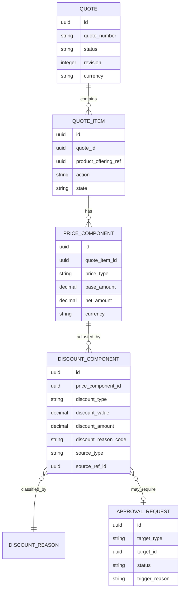
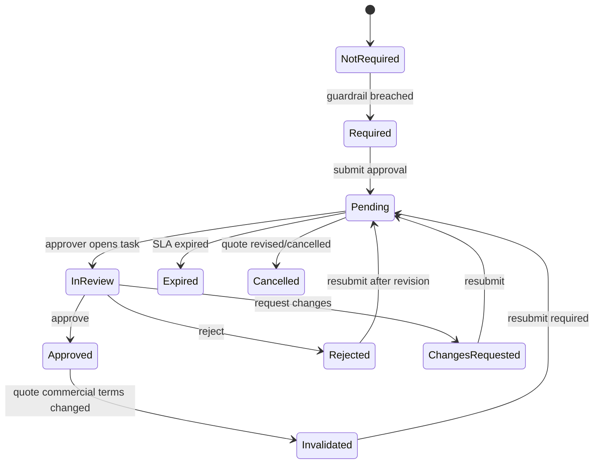

# Discount, Margin, and Approval Model

> Fokus part ini: bagaimana memodelkan **discount**, **margin**, dan **approval** agar CPQ/Quote system tidak hanya bisa menghitung harga, tetapi juga bisa membuktikan **kenapa sebuah commercial decision valid, siapa yang menyetujui, berdasarkan aturan apa, dan apakah keputusan itu masih defensible ketika diaudit**.

Dalam enterprise CPQ, discount bukan sekadar angka negatif di price line. Discount adalah **commercial decision**. Margin bukan sekadar hasil kalkulasi. Margin adalah **guardrail**. Approval bukan sekadar tombol approve/reject. Approval adalah **control mechanism** yang menghubungkan pricing, authority, risk, audit, dan revenue governance.

Kalau model discount/approval lemah, sistem bisa tetap terlihat berjalan, tetapi correctness-nya rapuh:

- quote bisa berisi discount melebihi otoritas sales;
- approval bisa hilang setelah quote direvisi;
- margin bisa dihitung dari cost version yang salah;
- accepted quote bisa tidak punya evidence approval yang cukup;
- billing bisa menerima charge yang secara commercial tidak valid;
- audit tidak bisa menjawab kenapa deal disetujui.

Part ini membahas data model untuk mencegah kondisi tersebut.

---

## 1. Core Mental Model

Discount, margin, dan approval harus dipisahkan secara konseptual:

| Area | Pertanyaan utama | Contoh data |
|---|---|---|
| Discount | Berapa pengurangan harga yang diberikan? | discount type, amount, percentage, reason |
| Margin | Apakah deal masih menguntungkan? | cost, net price, margin amount, margin percentage |
| Approval | Siapa yang berhak menyetujui exception? | approval request, step, approver, decision |
| Guardrail | Kapan approval diperlukan? | threshold, policy, rule, delegation |
| Evidence | Bagaimana keputusan dibuktikan? | approval history, actor, timestamp, reason |

Kesalahan umum adalah mencampur semuanya menjadi satu kolom seperti:

```text
discount_percent
approved_by
approval_status
```

Model seperti itu mungkin cukup untuk demo, tetapi tidak cukup untuk enterprise CPQ karena tidak menjawab:

- discount ini berlaku untuk item mana?
- discount ini manual atau rule-based?
- discount ini absolute atau percentage?
- approval diperlukan karena threshold apa?
- approval dilakukan sebelum atau setelah quote revision?
- apakah approval masih valid setelah price recalculation?
- apakah approver punya authority pada waktu approval?
- apakah margin dihitung sebelum atau setelah tax?
- cost source mana yang dipakai?

Enterprise model harus menyimpan **decision structure**, bukan hanya final value.

---

## 2. Discount as Commercial Data

Discount adalah adjustment terhadap price. Dalam CPQ, discount bisa berada di beberapa level:

- quote-level discount;
- quote item-level discount;
- product offering-level discount;
- bundle-level discount;
- customer agreement discount;
- promotion discount;
- manual sales discount;
- retention discount;
- approval-based exception discount.

Secara data modelling, minimal perlu dibedakan:

```text
Price Definition  -> base price dari catalog/pricing engine
Price Calculation -> hasil kalkulasi untuk quote context
Discount          -> adjustment terhadap price
Net Price         -> price setelah discount
Approval          -> control untuk discount exception
Snapshot          -> evidence final pada quote version tertentu
```

Discount sebaiknya tidak dimodelkan sebagai field tunggal di quote item. Ia lebih aman sebagai **child entity** atau **price component**.

Contoh logical model sederhana:



---

## 3. Discount Type

Discount type menjelaskan mekanisme discount, bukan alasan bisnisnya.

Contoh discount type:

| Type | Meaning | Example |
|---|---|---|
| `PERCENTAGE` | Diskon berdasarkan persentase | 10% off monthly recurring charge |
| `ABSOLUTE_AMOUNT` | Pengurangan nominal tetap | $100 off setup fee |
| `PRICE_OVERRIDE` | Harga diganti dengan angka baru | price changed from $1,000 to $850 |
| `FREE_PERIOD` | Gratis beberapa periode | first 3 months free |
| `WAIVER` | Charge dihapus | installation fee waived |
| `PROMOTION` | Discount dari campaign/promotion | launch discount |
| `AGREEMENT_BASED` | Discount dari agreement/contract | enterprise agreement discount |
| `MANUAL_EXCEPTION` | Exception manual oleh user | sales discount requiring approval |

Jangan mencampur `discount_type` dengan `discount_reason`.

Contoh buruk:

```text
discount_type = "VIP customer"
```

Contoh lebih baik:

```text
discount_type = "PERCENTAGE"
discount_reason_code = "STRATEGIC_CUSTOMER_RETENTION"
source_type = "MANUAL_EXCEPTION"
```

---

## 4. Discount Reason

Discount reason menjelaskan **kenapa** discount diberikan.

Reason penting untuk:

- audit;
- approval routing;
- sales analytics;
- margin leakage analysis;
- compliance;
- dispute handling;
- pricing governance;
- product profitability review.

Contoh reason:

```text
COMPETITIVE_MATCH
STRATEGIC_CUSTOMER
RENEWAL_INCENTIVE
VOLUME_COMMITMENT
SERVICE_CREDIT
RETENTION_OFFER
PROMOTIONAL_CAMPAIGN
MANUAL_EXCEPTION
CONTRACTUAL_COMMITMENT
```

Reason sebaiknya reference data yang governed, bukan free text murni. Free text tetap bisa ada sebagai comment, tetapi jangan menjadi classification utama.

Contoh fields:

```text
discount_reason_code
discount_reason_description
user_comment
policy_reference
campaign_reference
agreement_reference
```

---

## 5. Discount Source

Salah satu pertanyaan penting dalam CPQ adalah: **discount ini berasal dari mana?**

Discount source dapat berupa:

- pricing rule;
- promotion;
- agreement;
- manual sales input;
- approval exception;
- migration/import;
- customer entitlement;
- retention policy;
- system correction.

Model source penting karena menentukan traceability.

Contoh:

```text
source_type:
  PRICING_RULE
  PROMOTION
  AGREEMENT
  MANUAL
  APPROVAL_EXCEPTION
  MIGRATION
  CORRECTION

source_ref_id:
  references rule/promotion/agreement/request/etc
```

Kalau discount source tidak disimpan, audit hanya melihat final discount, bukan alasan sistem menghasilkan discount itu.

---

## 6. Discount Scope

Discount bisa berlaku pada level berbeda:

| Scope | Description | Example |
|---|---|---|
| Quote | Berlaku untuk seluruh quote | enterprise deal discount |
| Quote item | Berlaku untuk satu line | 20% off one product |
| Price component | Berlaku untuk charge tertentu | waive installation fee |
| Bundle | Berlaku untuk bundle/package | package discount |
| Term | Berlaku untuk periode tertentu | 3 months free |
| Usage tier | Berlaku untuk usage block | discounted overage |

Model discount harus menyimpan target scope dengan jelas.

Contoh:

```text
target_type = QUOTE | QUOTE_ITEM | PRICE_COMPONENT | BUNDLE | TERM | USAGE_TIER
target_id
```

Atau, dalam model yang lebih normalized, discount ditempatkan sebagai child langsung dari price component/item yang relevan.

Trade-off:

| Approach | Kelebihan | Risiko |
|---|---|---|
| Generic `target_type/target_id` | fleksibel | weak referential integrity |
| Separate tables per target | strong constraints | lebih banyak table/mapping |
| Price component model | cocok untuk pricing breakdown | butuh discipline mapping |

Untuk enterprise CPQ, price component model sering lebih defensible karena discount melekat pada komponen harga yang jelas.

---

## 7. Margin Model

Margin adalah selisih antara revenue dan cost.

Minimal:

```text
margin_amount = net_revenue - cost
margin_percent = margin_amount / net_revenue
```

Namun di enterprise system, definisinya bisa berbeda tergantung konteks:

- gross margin;
- net margin;
- contribution margin;
- product margin;
- bundle margin;
- quote margin;
- recurring margin;
- one-time margin;
- term-adjusted margin;
- first-year margin;
- lifetime margin.

Karena itu, margin model harus menyimpan:

- basis revenue;
- basis cost;
- calculation version;
- currency;
- exchange rate if applicable;
- cost source;
- calculation timestamp;
- quote version/revision;
- whether margin is estimated or final.

Contoh logical entity:

```text
MARGIN_CALCULATION
- id
- quote_id
- quote_revision
- quote_item_id nullable
- revenue_amount
- cost_amount
- margin_amount
- margin_percent
- currency
- margin_type
- cost_source_type
- cost_source_ref
- calculation_version
- calculated_at
- calculated_by
```

---

## 8. Cost Model Awareness

Margin tidak bisa dipercaya jika cost source tidak jelas.

Cost dapat berasal dari:

- product catalog cost;
- cost table;
- vendor cost;
- network cost;
- operational cost;
- manual estimate;
- financial system;
- imported cost baseline;
- negotiated cost;
- default cost fallback.

Failure mode umum:

- cost null dianggap zero;
- cost version tidak sama dengan price version;
- cost currency beda dari quote currency;
- cost effective date tidak cocok dengan quote effective date;
- cost disimpan hanya sebagai derived number tanpa source;
- margin dihitung ulang setelah approval tetapi approval tidak di-reset.

Untuk correctness, margin calculation harus menjawab:

```text
margin ini dihitung dari revenue apa,
cost apa,
versi cost mana,
versi price mana,
pada waktu kapan,
untuk quote revision mana.
```

---

## 9. Commercial Guardrail

Commercial guardrail adalah rule yang menentukan kapan deal boleh langsung jalan dan kapan perlu approval.

Contoh guardrail:

- discount > 10% requires manager approval;
- discount > 20% requires director approval;
- margin < 30% requires finance approval;
- waived installation fee requires commercial approval;
- contract term below minimum requires legal approval;
- strategic customer exception requires VP approval;
- non-standard payment term requires finance approval;
- product bundle discount cannot exceed threshold.

Guardrail bisa dimodelkan sebagai rule data:

```text
APPROVAL_RULE
- id
- rule_code
- rule_type
- applies_to
- condition_expression
- threshold_value
- threshold_unit
- required_approval_level
- effective_from
- effective_to
- status
- version
```

Atau sebagai policy/config yang dievaluasi oleh rule engine.

Yang penting: approval request harus menyimpan **hasil evaluasi rule**, bukan hanya status akhir.

---

## 10. Approval Request Model

Approval request adalah representasi formal bahwa sebuah quote/item/discount/margin exception perlu keputusan.

Contoh fields:

```text
APPROVAL_REQUEST
- id
- request_number
- target_type
- target_id
- quote_id
- quote_revision
- status
- trigger_type
- trigger_reason
- requested_by
- requested_at
- current_step
- required_level
- decision_summary
- completed_at
```

Target bisa berupa:

- quote;
- quote item;
- discount component;
- price override;
- margin exception;
- non-standard term;
- contract exception.

Approval request harus version-aware. Approval untuk quote revision 3 tidak otomatis valid untuk revision 4 jika commercial terms berubah.

---

## 11. Approval Step Model

Approval sering multi-step:

- sales manager;
- regional manager;
- finance;
- legal;
- product owner;
- executive approver.

Model step:

```text
APPROVAL_STEP
- id
- approval_request_id
- step_order
- step_type
- required_role
- required_level
- assigned_approver_id
- assigned_group_id
- status
- due_at
- escalated_at
- completed_at
```

Status step:

```text
PENDING
IN_REVIEW
APPROVED
REJECTED
SKIPPED
DELEGATED
ESCALATED
CANCELLED
EXPIRED
```

Step perlu immutable history. Jangan overwrite approver lama ketika delegation terjadi. Buat event/history.

---

## 12. Approval Decision Model

Decision adalah evidence final dari approver.

Contoh:

```text
APPROVAL_DECISION
- id
- approval_step_id
- decision
- decided_by
- decided_at
- reason_code
- comment
- delegated_from
- authority_snapshot
- decision_context_snapshot
```

Decision values:

```text
APPROVE
REJECT
REQUEST_CHANGES
DELEGATE
ESCALATE
CANCEL
```

Decision context snapshot penting karena authority/role approver bisa berubah setelah approval.

Contoh authority snapshot:

```json
{
  "approverId": "u-123",
  "role": "Regional Sales Director",
  "discountAuthorityPercent": 25,
  "marginFloorPercent": 20,
  "effectiveAtDecisionTime": "2026-07-12T10:15:00Z"
}
```

---

## 13. Approval Lifecycle

Approval lifecycle harus terhubung dengan quote lifecycle.



Key invariant:

```text
Accepted quote with approval-required commercial exceptions must have valid approval evidence for the exact quote revision being accepted.
```

---

## 14. Approval Invalidation

Approval tidak selalu bertahan setelah quote berubah.

Perubahan yang biasanya harus meng-invalidasi approval:

- discount percentage naik;
- net price turun;
- margin turun;
- product mix berubah;
- contract term berubah;
- billing term berubah;
- customer/account berubah;
- currency berubah;
- validity period berubah;
- quote revision baru dibuat;
- price recalculation terjadi.

Perubahan yang mungkin tidak perlu invalidation:

- typo di description;
- internal note;
- non-commercial metadata;
- attachment tambahan;
- contact phone update.

Model perlu menyimpan invalidation reason:

```text
APPROVAL_INVALIDATION
- id
- approval_request_id
- quote_id
- previous_revision
- new_revision
- invalidation_reason
- invalidated_by
- invalidated_at
```

---

## 15. Discount and Approval State Coupling

Quote state dan approval state saling terkait, tetapi jangan disamakan.

Contoh buruk:

```text
quote.status = APPROVED
```

Lalu sistem menganggap semua approval selesai.

Lebih baik:

```text
quote.status = SUBMITTED | APPROVED | ACCEPTED
quote.approval_status = NOT_REQUIRED | REQUIRED | PENDING | APPROVED | REJECTED | INVALIDATED
```

Alasannya:

- quote lifecycle adalah lifecycle commercial proposal;
- approval lifecycle adalah lifecycle control decision;
- approval bisa invalidated walaupun quote masih draft/revised;
- quote bisa submitted dengan approval pending;
- quote bisa approved secara business state tetapi belum accepted customer.

---

## 16. Data Invariants

Beberapa invariant penting:

### Discount invariant

```text
Discount amount must not exceed applicable base price unless explicitly modelled as credit/waiver policy.
```

### Price component invariant

```text
Net amount = base amount + adjustments - discounts, according to calculation version.
```

### Margin invariant

```text
Margin calculation must reference the quote revision, cost source, price source, and currency used.
```

### Approval required invariant

```text
If discount/margin breaches active guardrail, quote cannot be accepted without valid approval.
```

### Approval revision invariant

```text
Approval is valid only for the quote revision and commercial context evaluated.
```

### Authority invariant

```text
Approver must have sufficient authority at decision time.
```

### Audit invariant

```text
Approval decision must preserve actor, timestamp, target, decision, reason, and evaluated rule context.
```

---

## 17. PostgreSQL Modelling Considerations

Possible tables:

```text
quote_discount
quote_item_discount
price_component
margin_calculation
approval_rule
approval_request
approval_step
approval_decision
approval_history
approval_invalidation
```

Common constraints:

```sql
-- example only
CHECK (discount_amount >= 0)
CHECK (margin_percent >= -100)
CHECK (status IN ('PENDING', 'APPROVED', 'REJECTED', 'INVALIDATED'))
UNIQUE (quote_id, quote_revision, rule_code) WHERE status = 'APPROVED'
```

Useful indexes:

```text
approval_request(status, created_at)
approval_request(quote_id, quote_revision)
approval_step(assigned_approver_id, status)
approval_step(assigned_group_id, status)
discount_component(price_component_id)
margin_calculation(quote_id, quote_revision)
```

Be careful with money fields:

- use `numeric`, not floating point;
- always store currency;
- define precision/scale deliberately;
- do not mix tax-inclusive and tax-exclusive values silently;
- store calculation version if pricing algorithm can change.

---

## 18. Java/JAX-RS Backend Impact

In Java/JAX-RS service, discount and approval model affects:

- request validation;
- quote recalculation endpoint;
- submit-for-approval endpoint;
- approval decision endpoint;
- quote revision endpoint;
- quote acceptance endpoint;
- audit event publishing;
- concurrency control.

Example API boundary:

```http
POST /quotes/{quoteId}/approval-requests
POST /approval-requests/{requestId}/decisions
GET  /quotes/{quoteId}/approval-status
POST /quotes/{quoteId}/recalculate-price
POST /quotes/{quoteId}/revisions
```

Do not expose database approval tables directly as DTOs. API model should be task-oriented:

- submit approval;
- approve;
- reject;
- request changes;
- list pending approvals;
- inspect approval trace.

---

## 19. MyBatis/JPA/JDBC Considerations

### MyBatis

Good for explicit pricing/approval queries:

- approval queue;
- quote approval trace;
- margin threshold search;
- dashboard queries.

But be careful with manual joins and duplicated mapping logic.

### JPA

Can model aggregate relationships, but approval history and price components can become heavy object graphs.

Avoid loading full quote + all items + all price components + all approval history for simple approval queue screen.

### JDBC

Useful for batch jobs:

- approval SLA escalation;
- invalidation scan;
- migration/backfill;
- data quality checks.

---

## 20. Event-Driven Impact

Relevant domain/integration events:

```text
DiscountApplied
DiscountRemoved
MarginCalculated
ApprovalRequired
ApprovalRequested
ApprovalStepAssigned
ApprovalDecisionRecorded
ApprovalRejected
ApprovalInvalidated
QuoteCommercialTermsChanged
QuoteApproved
QuoteApprovalExpired
```

Event metadata should include:

- event id;
- aggregate id;
- quote id;
- quote revision;
- correlation id;
- actor;
- source system;
- decision timestamp;
- rule version if applicable.

Do not publish sensitive margin/cost data to broad consumers unless contractually allowed.

---

## 21. Reporting and Analytics Impact

Discount/margin/approval data supports:

- average discount by product;
- discount leakage;
- approval SLA;
- rejection rate;
- margin floor breach;
- manual exception frequency;
- discount by sales channel;
- discount by customer segment;
- quote win/loss by discount level;
- approval bottleneck by role/team;
- commercial policy effectiveness.

Reporting model should distinguish:

```text
requested discount
approved discount
final accepted discount
billed discount
```

These are not always the same.

---

## 22. Security and Privacy Concerns

Discount and margin data are commercially sensitive.

Access control should consider:

- who can see margin;
- who can edit discount;
- who can approve exception;
- who can see cost;
- who can export quote data;
- who can view approval comments;
- who can see rejected commercial reasoning.

Margin and cost should often be more restricted than price.

---

## 23. Failure Modes

| Failure mode | Symptom | Likely data cause |
|---|---|---|
| Discount exceeds authority | quote accepted with excessive discount | approval guard not enforced |
| Approval lost after revision | accepted quote has no valid approval | approval not revision-aware |
| Margin mismatch | dashboard margin differs from quote | cost/price version mismatch |
| Stale approval | old approval used for changed quote | invalidation missing |
| Wrong approver | approval by unauthorized user | authority not snapshotted |
| Duplicate approval | multiple active approval requests | missing uniqueness/idempotency |
| Billing mismatch | billed amount differs from approved quote | price snapshot not carried over |
| Audit gap | cannot explain decision | missing rule/decision trace |

---

## 24. Debugging Data Issues

When debugging discount/approval issue, ask:

1. Which quote revision is affected?
2. Which price calculation version was used?
3. Which discount components exist?
4. Are discount source and reason clear?
5. Was margin calculated after final discount?
6. Which guardrail rule was evaluated?
7. Was approval required?
8. Was approval request created?
9. Which approver decided?
10. Did approver have sufficient authority at decision time?
11. Was quote changed after approval?
12. Was approval invalidated or reused?
13. Was final accepted price copied to order/billing?
14. Are events/API/read models consistent?

---

## 25. PR Review Checklist

Use this checklist when reviewing changes related to discount, margin, or approval:

- Is discount represented as structured data, not just one field?
- Is discount scope explicit?
- Is discount source traceable?
- Is discount reason governed?
- Is margin calculation versioned?
- Is cost source captured?
- Is currency handled correctly?
- Are approval rules versioned/effective-dated?
- Is approval request tied to quote revision?
- Is approval invalidated on commercial changes?
- Is approval history immutable?
- Is approver authority captured or reconstructable?
- Are API DTOs separated from persistence model?
- Are events safe for sensitive commercial data?
- Are dashboard/read model implications considered?
- Are PostgreSQL constraints/indexes sufficient?
- Are security permissions enforced for margin/cost?
- Are data quality checks defined?

---

## 26. Internal Verification Checklist

Verify with internal codebase/team:

- Where are discounts stored: quote-level, item-level, price component-level, or mixed?
- Is discount type separated from discount reason?
- Are manual discounts distinguishable from rule/promotion/agreement discounts?
- Is there a pricing trace explaining each discount?
- How is margin calculated?
- What is the authoritative source of cost?
- Are cost and margin stored, recalculated, or both?
- Does approval depend on discount threshold, margin threshold, product, customer, or contract term?
- Are approval rules configurable or hardcoded?
- Is approval tied to quote revision/version?
- What invalidates an approval?
- Can an accepted quote exist without valid approval evidence?
- Are approval decisions immutable?
- Is approver authority snapshotted or reconstructable?
- What events are published for approval and pricing decisions?
- What data is sent to billing?
- Are margin/cost fields restricted by permission?
- Are there historical incidents related to discount, margin, or approval mismatch?

---

## 27. Key Takeaways

Discount, margin, and approval are not peripheral CPQ features. They are part of the **commercial correctness model**.

A production-grade model must preserve:

- what discount was applied;
- why it was applied;
- where it came from;
- what margin resulted;
- what rule was breached;
- who approved it;
- whether they had authority;
- which quote revision was approved;
- whether the approval remained valid;
- whether the approved commercial terms reached order and billing unchanged.

If the model cannot answer those questions, the system may calculate prices, but it cannot defend commercial decisions.
