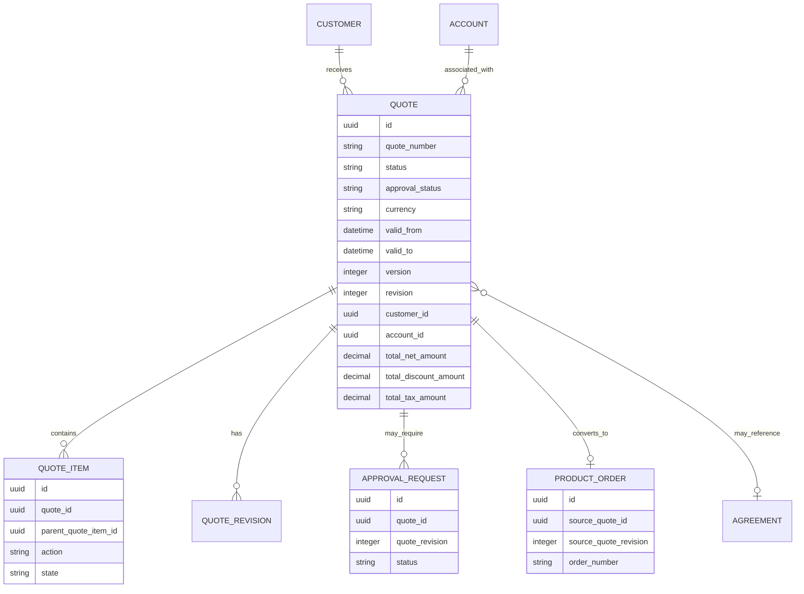

# Quote Header Model

> Fokus part ini: bagaimana memodelkan **quote header** sebagai container commercial proposal yang mengikat customer, account, channel, owner, status, validity, currency, price summary, approval status, version/revision, dan lifecycle metadata.

Quote header sering terlihat sederhana: nomor quote, customer, status, total price. Tetapi dalam enterprise CPQ, quote header adalah **anchor** untuk seluruh commercial lifecycle.

Quote header menghubungkan:

- customer/account;
- sales opportunity/channel;
- quote item tree;
- product configuration;
- price summary;
- discount and approval;
- agreement reference;
- validity/expiry;
- revision/version;
- quote-to-order conversion;
- audit and reporting.

Kalau quote header model lemah, semua data turunannya ikut rapuh.

---

## 1. What Is Quote Header?

Quote header adalah entity tingkat atas yang merepresentasikan commercial proposal kepada customer.

Secara konseptual:

```text
Quote = commercial proposal container
Quote Item = sellable product/service line inside quote
Price Component = calculated charge/discount/tax detail
Approval = control/evidence for commercial exception
Snapshot = frozen commercial evidence at revision/version boundary
```

Quote header tidak seharusnya menyimpan semua detail line item. Ia menyimpan **identity, ownership, lifecycle, summary, and references**.

---

## 2. Quote Header Responsibilities

Quote header bertanggung jawab untuk:

- quote identity;
- business number;
- customer/account association;
- sales ownership;
- channel/source;
- high-level lifecycle state;
- validity period;
- currency;
- price summary;
- approval summary;
- version/revision identity;
- quote expiry;
- conversion reference;
- audit metadata.

Quote header tidak ideal untuk menyimpan:

- every characteristic value;
- every price component;
- every discount detail;
- every approval step;
- every fulfillment task;
- every invoice line;
- mutable external DTO blob without structure.

---

## 3. Conceptual Model



---

## 4. Quote Identity

Quote biasanya membutuhkan lebih dari satu identifier.

| Identifier | Purpose | Example |
|---|---|---|
| Internal ID | Primary key internal DB/service | UUID/sequence |
| Quote number | Business-readable identifier | `Q-2026-000123` |
| External ID | Reference from CRM/partner/channel | opportunity/CRM quote id |
| Correlation ID | Trace request/event flow | request correlation |
| Version/revision | Tracks commercial changes | revision 3 |
| Public ID | Safe ID exposed via API | non-sequential opaque id |

Jangan mengandalkan satu ID untuk semua kebutuhan.

Common pattern:

```text
id              -> internal primary key
quote_number    -> business key displayed to users
external_ref    -> source CRM/partner reference
public_id       -> API-safe identifier if needed
revision        -> commercial revision
version         -> optimistic locking / data version
```

---

## 5. Quote Number

Quote number adalah business identifier. Ia sering muncul di UI, PDF proposal, email, audit, sales discussion, and support ticket.

Design consideration:

- globally unique atau tenant/customer scoped?
- sequential atau non-sequential?
- generated at draft creation atau first submission?
- includes year/channel/region?
- stable across revision atau new per revision?
- visible externally?
- reused after cancellation? Usually no.

Quote number sebaiknya stabil untuk quote family. Revision bisa ditampilkan sebagai suffix:

```text
Q-2026-000123 Rev 3
```

Bukan:

```text
Q-2026-000123-3 as completely unrelated quote
```

kecuali business process memang menganggap revision sebagai quote baru.

---

## 6. Customer and Account Reference

Quote header harus menyimpan customer/account reference dengan jelas.

Minimal:

```text
customer_id
account_id
billing_account_id nullable
service_account_id nullable
related_party references
```

Namun, tergantung domain, customer/account data bisa berubah selama quote lifecycle. Maka perlu menentukan apakah quote menyimpan:

- reference only;
- partial snapshot;
- full customer snapshot;
- reference + selected snapshot fields.

Common strategy:

| Data | Strategy |
|---|---|
| customer_id/account_id | reference |
| customer name at proposal time | snapshot |
| billing account id | reference + validate at conversion |
| contact email | snapshot or contact reference depending process |
| legal entity name | snapshot if proposal evidence requires it |

Quote untuk commercial evidence biasanya perlu snapshot minimal agar proposal tetap dapat direkonstruksi walau customer master berubah.

---

## 7. Opportunity Reference

Dalam banyak CPQ system, quote terhubung dengan CRM opportunity.

Possible fields:

```text
opportunity_ref_id
opportunity_number
opportunity_source_system
sales_stage_at_quote_time
crm_account_ref
```

Jangan membuat quote lifecycle sepenuhnya tergantung CRM stage kecuali ownership-nya jelas. CRM opportunity dan CPQ quote punya lifecycle berbeda.

Failure mode:

- opportunity closed tetapi quote masih active;
- quote accepted tetapi CRM tidak tersinkronisasi;
- CRM account berubah tetapi quote account snapshot tidak ikut;
- duplicate quote dibuat dari same opportunity;
- quote number tidak bisa direkonsiliasi dengan CRM.

---

## 8. Sales Channel and Source

Quote bisa berasal dari:

- direct sales;
- partner;
- self-service portal;
- call center;
- API integration;
- migration;
- renewal process;
- amendment process;
- retention workflow.

Fields:

```text
channel_code
source_system
source_process
created_by_user_id
created_by_actor_type
sales_team_id
owner_user_id
```

Channel memengaruhi:

- allowed products;
- pricing rules;
- discount authority;
- approval routing;
- quote validity;
- template/proposal rendering;
- reporting segmentation.

Jangan jadikan channel sekadar string bebas tanpa governance.

---

## 9. Owner and Responsibility

Quote owner bukan sekadar creator.

Possible roles:

- creator;
- owner;
- sales representative;
- account manager;
- approver;
- last modifier;
- submitted by;
- accepted by customer contact;
- converted by;
- cancelled by.

Model header biasanya menyimpan owner/current responsible party, sementara action history disimpan di audit/history.

Example:

```text
created_by
owner_user_id
sales_rep_id
sales_team_id
submitted_by
submitted_at
last_modified_by
```

Approval-specific actors jangan dipadatkan ke quote header; simpan di approval model.

---

## 10. Quote Status

Quote status adalah high-level lifecycle state.

Common statuses:

```text
DRAFT
CONFIGURED
PRICED
SUBMITTED
APPROVAL_PENDING
APPROVED
REJECTED
ACCEPTED
EXPIRED
CANCELLED
REVISED
CONVERTED_TO_ORDER
```

Namun hati-hati: status quote, pricing status, validation status, approval status, and conversion status tidak selalu sama.

Better model:

```text
quote_status
pricing_status
validation_status
approval_status
conversion_status
```

Contoh:

```text
quote_status = SUBMITTED
pricing_status = CALCULATED
validation_status = VALID
approval_status = PENDING
conversion_status = NOT_STARTED
```

Ini lebih jelas daripada satu status besar yang mencoba memuat semua dimensi.

---

## 11. Validity Period and Expiry

Quote punya validity period:

```text
valid_from
valid_to
expires_at
```

Business meaning:

- sampai kapan harga ditawarkan valid;
- kapan customer harus menerima;
- kapan quote otomatis expired;
- apakah expiry timezone-aware;
- apakah expiry memperhitungkan business day;
- apakah quote bisa diperpanjang;
- apakah extension perlu approval.

Invariant:

```text
Accepted quote must be accepted before expiry unless explicit override/extension exists.
```

Quote expiry harus menggunakan time policy yang konsisten. Jangan campur local time browser, database timezone, dan UTC tanpa aturan.

---

## 12. Currency

Quote header biasanya punya primary currency.

Fields:

```text
currency_code
tax_currency_code nullable
exchange_rate_id nullable
exchange_rate_snapshot nullable
```

Invariants:

```text
All monetary components in quote summary must be either in quote currency or explicitly convertible with stored exchange rate evidence.
```

Failure mode:

- item price dalam currency berbeda tetapi total dihitung sebagai satu currency;
- discount amount salah karena currency conversion;
- approval threshold currency tidak dikonversi;
- billing currency berbeda dari quote currency tanpa mapping.

---

## 13. Price Summary

Quote header sering menyimpan summary untuk performance dan display.

Example summary fields:

```text
subtotal_amount
total_discount_amount
total_tax_amount
total_net_amount
total_recurring_amount
total_one_time_amount
total_usage_estimate_amount
total_contract_value
annual_recurring_revenue
monthly_recurring_revenue
```

Derived fields harus punya strategy:

| Strategy | Meaning |
|---|---|
| calculated on read | always fresh, slower |
| stored summary | faster, risk stale |
| stored with recalculation version | traceable |
| projection/read model | scalable for reporting |

Untuk CPQ, stored summary sering dibutuhkan, tetapi harus ada invalidation/recalculation discipline.

Invariant:

```text
Quote header summary must equal aggregation of active quote item price components for the same quote revision and calculation version.
```

---

## 14. Approval Status on Header

Quote header boleh menyimpan approval summary, tetapi bukan detail approval.

Fields:

```text
approval_status
approval_required_flag
latest_approval_request_id
approved_at
approved_by_summary nullable
```

Detail tetap berada di approval tables.

Approval status examples:

```text
NOT_REQUIRED
REQUIRED
PENDING
APPROVED
REJECTED
INVALIDATED
EXPIRED
```

Approval status harus revision-aware.

---

## 15. Version and Revision

Perlu membedakan:

| Concept | Meaning |
|---|---|
| DB row version | optimistic locking/concurrency |
| Quote revision | commercial revision visible to business |
| Quote version | sometimes same as revision, sometimes technical version |
| Snapshot version | frozen state for accepted/submitted quote |
| API version | external contract version |

Recommended clarity:

```text
row_version       -> optimistic locking
revision_number   -> business/commercial revision
snapshot_id       -> frozen snapshot reference
api_version       -> contract version if needed
```

Do not use one `version` field for everything without clear semantics.

---

## 16. Quote Revision Semantics

Revision usually means commercial terms changed.

Revision-triggering changes:

- product item added/removed;
- quantity changed;
- price recalculated;
- discount changed;
- configuration changed;
- validity extended;
- agreement term changed;
- customer/account changed;
- billing term changed.

Non-revision changes:

- internal note;
- UI metadata;
- attachment update;
- comment;
- assignment change, depending process;
- read model refresh.

The system should define this explicitly.

---

## 17. Created/Updated Metadata

Standard metadata:

```text
created_at
created_by
updated_at
updated_by
row_version
source_system
correlation_id
```

For enterprise audit, also consider:

```text
submitted_at
submitted_by
accepted_at
accepted_by
expired_at
cancelled_at
cancelled_by
converted_at
converted_by
```

Do not rely only on `updated_at` to reconstruct lifecycle.

---

## 18. Quote Header Logical Schema Example

Example only, not CSG-specific:

```text
QUOTE
- id uuid pk
- quote_number varchar unique
- public_id varchar unique nullable
- customer_id uuid not null
- account_id uuid nullable
- billing_account_id uuid nullable
- opportunity_ref varchar nullable
- source_system varchar nullable
- channel_code varchar not null
- owner_user_id uuid nullable
- sales_team_id uuid nullable
- quote_status varchar not null
- pricing_status varchar not null
- validation_status varchar not null
- approval_status varchar not null
- conversion_status varchar not null
- currency_code char(3) not null
- valid_from timestamptz nullable
- valid_to timestamptz nullable
- expires_at timestamptz nullable
- subtotal_amount numeric(19,4) nullable
- total_discount_amount numeric(19,4) nullable
- total_tax_amount numeric(19,4) nullable
- total_net_amount numeric(19,4) nullable
- total_recurring_amount numeric(19,4) nullable
- total_one_time_amount numeric(19,4) nullable
- revision_number integer not null
- row_version integer not null
- snapshot_id uuid nullable
- created_at timestamptz not null
- created_by uuid nullable
- updated_at timestamptz not null
- updated_by uuid nullable
```

---

## 19. PostgreSQL Considerations

### Constraints

```sql
-- examples only
CHECK (revision_number >= 1)
CHECK (total_net_amount IS NULL OR total_net_amount >= 0)
CHECK (valid_to IS NULL OR valid_from IS NULL OR valid_to > valid_from)
CHECK (currency_code ~ '^[A-Z]{3}$')
```

### Indexes

Common access patterns:

- lookup by quote number;
- list quotes by customer;
- list quotes by account;
- list active quotes by owner;
- approval queue;
- expiring quotes job;
- conversion lookup;
- reporting by status/date/channel.

Possible indexes:

```text
unique(quote_number)
index(customer_id, created_at desc)
index(account_id, created_at desc)
index(owner_user_id, quote_status, updated_at desc)
index(approval_status, updated_at desc)
index(expires_at) where quote_status in ('DRAFT', 'SUBMITTED', 'APPROVED')
index(channel_code, created_at desc)
```

### Optimistic locking

Quote header should usually use row version or equivalent concurrency control.

Failure mode without locking:

- user A changes discount;
- user B changes customer/account;
- pricing recalculation overwrites summary;
- approval status becomes stale;
- accepted quote contains mixed state.

---

## 20. Java/JAX-RS API Impact

Quote header appears in several API shapes:

### Create quote

```http
POST /quotes
```

Request should include minimal creation context, not every derived field.

### Get quote summary

```http
GET /quotes/{quoteId}
```

May return header + summary + links.

### Search quotes

```http
GET /quotes?customerId=&status=&ownerId=&createdFrom=&createdTo=
```

Should be backed by query/read model designed for filtering.

### Submit quote

```http
POST /quotes/{quoteId}/submit
```

Should validate quote items, pricing, approval requirement, expiry, and revision consistency.

### Accept quote

```http
POST /quotes/{quoteId}/accept
```

Should check approval validity, expiry, customer acceptance, and immutable snapshot.

### Convert quote

```http
POST /quotes/{quoteId}/convert-to-order
```

Should be idempotent.

---

## 21. DTO Boundary

Do not expose persistence model directly.

Possible DTO split:

```text
QuoteCreateRequest
QuoteSummaryResponse
QuoteDetailResponse
QuoteSearchResult
QuoteStatusResponse
QuoteSubmitRequest
QuoteAcceptRequest
QuoteConversionResponse
```

Header response can include calculated summary, but API should clarify whether values are:

- current calculation;
- last calculated;
- snapshot;
- estimated;
- tax-inclusive;
- tax-exclusive.

---

## 22. MyBatis/JPA/JDBC Considerations

### MyBatis

Good for quote search and dashboard queries:

```text
findQuotesByCustomer
findQuotesByOwnerAndStatus
findExpiringQuotes
findApprovalPendingQuotes
```

### JPA

Be careful not to load entire quote item tree for list screens.

Avoid:

```text
Quote -> QuoteItems -> PriceComponents -> Discounts -> ApprovalHistory
```

for every search result.

### JDBC

Useful for:

- expiry job;
- bulk status update;
- backfill summary fields;
- reconciliation queries;
- migration validation.

---

## 23. Event Model Impact

Quote header changes can emit events:

```text
QuoteCreated
QuoteUpdated
QuoteSubmitted
QuotePriced
QuoteApprovalRequired
QuoteApproved
QuoteRejected
QuoteAccepted
QuoteExpired
QuoteCancelled
QuoteRevised
QuoteConvertedToOrder
```

Event payload should not blindly dump entire quote header table.

Recommended event metadata:

```text
event_id
quote_id
quote_number
revision_number
event_type
event_version
occurred_at
actor_id
correlation_id
causation_id
source_system
```

For integration events, include stable references and necessary business fields only.

---

## 24. Redis/Cache Impact

Quote header caching is risky because quote state changes frequently.

Cache candidates:

- read-only quote summary after accepted snapshot;
- quote search result projection;
- user quote count by status;
- static status metadata.

Avoid caching mutable draft quote header without strict invalidation.

Stale cache failure:

- UI shows quote approved but DB says invalidated;
- conversion endpoint uses stale approved status;
- expiry job misses quote because cache says already expired;
- approval queue hides pending quote.

---

## 25. Reporting Impact

Quote header supports reporting dimensions:

- quote created date;
- quote submitted date;
- quote accepted date;
- quote expired date;
- quote status;
- approval status;
- sales channel;
- owner/team;
- customer/account;
- currency;
- total value;
- discount total;
- quote revision count;
- conversion status.

Important reporting metrics:

```text
quote volume
quote aging
quote conversion rate
average quote value
approval pending aging
expired quote rate
accepted quote value
quote-to-order conversion lag
revision count per quote
```

Do not compute all of these from operational tables under production load if volume is high. Use projection/read model if needed.

---

## 26. Auditability Concerns

Quote header audit should answer:

- who created quote;
- who changed customer/account;
- who changed owner;
- who submitted quote;
- who accepted/cancelled/expired quote;
- when status changed;
- what revision was active;
- what price summary changed;
- what approval state changed;
- what caused conversion.

Quote status transition history should not be inferred only from current status.

Recommended:

```text
QUOTE_STATUS_HISTORY
- id
- quote_id
- from_status
- to_status
- reason
- actor_id
- occurred_at
- correlation_id
```

---

## 27. Failure Modes

| Failure mode | Symptom | Likely cause |
|---|---|---|
| Duplicate quote number | support/reporting confusion | weak uniqueness/generation |
| Quote accepted after expiry | invalid commercial commitment | expiry guard missing |
| Approval status stale | quote accepted without valid approval | approval invalidation missing |
| Summary mismatch | header total differs from items | recalculation/invalidation bug |
| Wrong customer/account | quote linked to wrong legal/billing entity | weak party/account modelling |
| Lost revision evidence | cannot reconstruct accepted quote | no snapshot/version model |
| Concurrent overwrite | user changes lost | missing optimistic locking |
| Conversion duplicated | two orders for one quote | no idempotency/conversion status |
| Reporting mismatch | BI quote count differs | unclear lifecycle timestamps/status semantics |

---

## 28. Debugging Quote Header Issues

Ask:

1. What is the quote ID and quote number?
2. Which revision is affected?
3. What is the current quote status?
4. What is the approval status?
5. Is pricing status current?
6. Does header summary match item aggregation?
7. Is quote expired?
8. Is customer/account reference correct?
9. Did customer/account change during lifecycle?
10. Was quote submitted/accepted/converted?
11. Is there status transition history?
12. Is there an immutable snapshot?
13. Were events published for state changes?
14. Did conversion create one order or more?
15. Are read models/cache/search index stale?

---

## 29. PR Review Checklist

When reviewing quote header changes:

- Is quote identity strategy clear?
- Is quote number uniqueness enforced?
- Are customer/account/billing references clear?
- Is quote status separated from approval/pricing/conversion status?
- Are validity and expiry semantics clear?
- Is timezone handled consistently?
- Is currency stored and validated?
- Are summary fields derived safely?
- Is revision/version semantics clear?
- Is optimistic locking present?
- Is approval status revision-aware?
- Is conversion idempotency considered?
- Are audit/status history records written?
- Are API DTOs separated from DB schema?
- Are search/reporting access patterns indexed or projected?
- Are sensitive values protected?
- Is migration/backfill plan safe?

---

## 30. Internal Verification Checklist

Verify internally:

- What is the authoritative quote header table/entity?
- Is quote number generated by CPQ, CRM, database, or external service?
- Is quote number unique globally, per tenant, per customer, or per channel?
- Is quote revision business-visible?
- What changes create a new revision?
- Is accepted quote immutable?
- Does quote header store customer snapshot fields?
- How are customer/account/billing account/service account represented?
- What statuses exist for quote, pricing, validation, approval, and conversion?
- Are statuses documented as state machine?
- How is quote expiry implemented?
- Is timezone policy documented?
- Are price summary fields stored or calculated?
- How is stale summary detected?
- How is approval status synchronized?
- What prevents conversion duplication?
- What events are emitted from quote lifecycle changes?
- Are quote search/read models separate from OLTP table?
- Are there known incidents around duplicate quote, stale status, or wrong total?

---

## 31. Key Takeaways

Quote header is not just a parent row. It is the **commercial anchor** of quote-to-cash.

A strong quote header model must make these things explicit:

- identity;
- customer/account context;
- ownership;
- channel/source;
- lifecycle status;
- pricing status;
- approval status;
- validity/expiry;
- currency;
- summary values;
- revision/version;
- audit metadata;
- conversion state.

The safest model avoids one overloaded `status`, one overloaded `version`, and one overloaded `total`. Instead, it separates lifecycle dimensions so the system can remain correct under revision, approval, recalculation, expiry, conversion, and reporting pressure.
