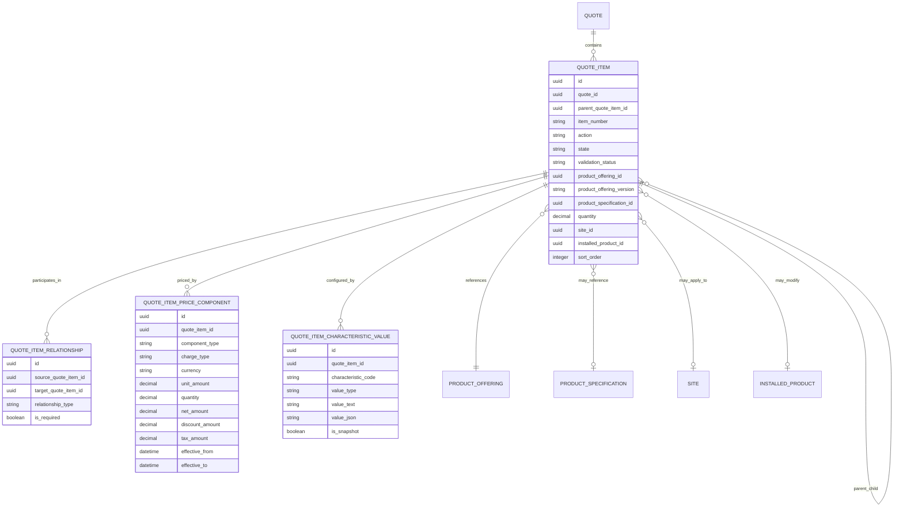
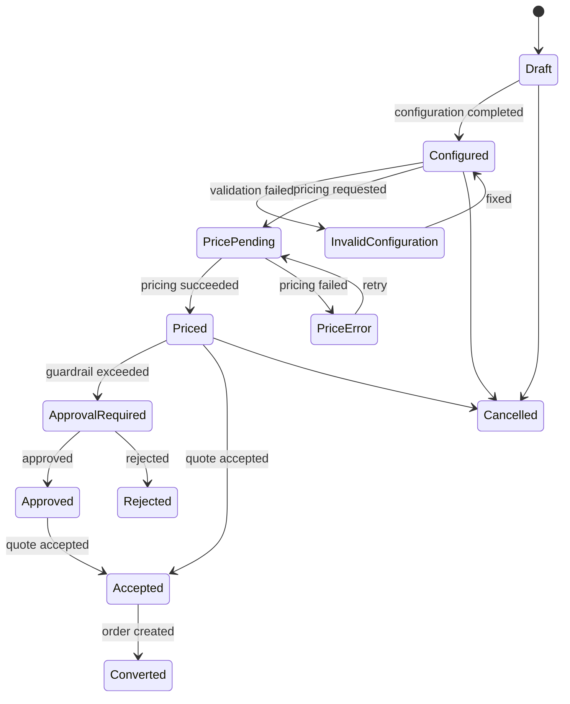

# Quote Item and Quote Line Model

> Fokus part ini: bagaimana memodelkan **quote item** dan **quote line** sebagai unit commercial detail di dalam quote: product offering, configuration, bundle hierarchy, quantity, site/location, price item, discount item, tax item, action, state, validation, relationship, invariant, audit, reporting, dan failure mode production.

Quote header menjawab: **proposal ini milik siapa, statusnya apa, berlaku sampai kapan, dan summary nilainya berapa**.

Quote item menjawab: **apa yang sebenarnya dijual, bagaimana dikonfigurasi, berapa quantity-nya, di lokasi mana, harga/discount/tax-nya bagaimana, dan apa yang nanti dikonversi menjadi order item**.

Dalam CPQ enterprise, quote item adalah tempat paling banyak bug data muncul:

- bundle parent-child tidak konsisten;
- item price tidak sesuai price summary;
- configuration berubah setelah price dihitung;
- product offering sudah retired tetapi masih dipakai;
- quote item action tidak valid terhadap installed product;
- tax/discount line hilang saat conversion;
- order item mapping gagal karena quote item tidak punya stable identity;
- reporting salah karena line model terlalu fleksibel tetapi tidak queryable.

---

## 1. What Is Quote Item?

Quote item adalah entity detail dalam quote yang merepresentasikan satu commercial line.

Secara konseptual:

```text
Quote Header
  └── Quote Item
        ├── Product reference
        ├── Configuration snapshot/reference
        ├── Quantity and site/location
        ├── Action
        ├── Validation state
        ├── Price components
        ├── Discount components
        ├── Tax components
        └── Relationship to other quote items
```

Quote item bukan sekadar baris tampilan UI. Ia adalah **commercial unit of commitment** yang akan menjadi input untuk:

- approval;
- quote versioning;
- quote acceptance;
- quote-to-order conversion;
- order item creation;
- fulfillment decomposition;
- billing activation;
- operational reporting.

---

## 2. Quote Item vs Quote Line

Dalam banyak sistem, istilah `quote item`, `quote line`, dan `line item` sering dipakai bergantian. Untuk model enterprise, lebih aman membuat distinction eksplisit.

| Concept | Meaning | Typical Usage |
|---|---|---|
| Quote item | Domain unit dalam quote | Parent-child item, action, state, product reference |
| Quote line | Commercial/pricing-visible row | UI line, price rollup, reporting |
| Price component | Detail charge/discount/tax | MRC, NRC, usage, tax, promotion |
| Configuration node | Technical/commercial selected option | Characteristic values, options, rule result |
| Order item candidate | Quote item yang bisa dikonversi | Mapping quote item to order item |

Prinsipnya: **quote item adalah domain entity; quote line adalah representasi komersial/read model yang bisa derived dari quote item tree**.

Kalau sistem menyamakan semuanya, hati-hati terhadap risiko:

- bundle parent line diperlakukan sama dengan sellable child line;
- discount header sulit dialokasikan ke item;
- tax line sulit dikaitkan ke taxable item;
- order conversion tidak tahu item mana yang harus menjadi order item;
- reporting count salah karena parent bundle dan child component dihitung dobel.

---

## 3. Core Responsibilities

Quote item bertanggung jawab untuk menyimpan:

- reference ke quote header;
- stable quote item identity;
- parent-child hierarchy;
- product offering reference;
- product specification reference jika dibutuhkan;
- product configuration reference/snapshot;
- action: add, modify, disconnect, renew, upgrade, downgrade, dan sebagainya;
- quantity;
- site/location;
- item state;
- validation status;
- price breakdown;
- discount breakdown;
- tax breakdown;
- relationship/dependency ke item lain;
- source catalog/price version;
- audit metadata;
- conversion mapping candidate.

Quote item tidak seharusnya menjadi tempat semua hal berikut tanpa struktur:

- raw UI form blob tanpa semantic field;
- pricing result opaque tanpa breakdown;
- external API payload mentah sebagai source of truth;
- free-form JSON yang tidak bisa divalidasi;
- fulfillment state detail yang semestinya milik order/fulfillment domain;
- invoice line yang semestinya milik billing domain.

---

## 4. Conceptual Model



Model ini memisahkan empat hal yang sering tercampur:

1. **structure**: parent-child item;
2. **commercial reference**: offering/specification/version;
3. **configuration**: characteristic values;
4. **monetization**: price components.

---

## 5. Quote Item Identity

Quote item harus punya identity stabil, karena akan dipakai untuk:

- audit trail;
- approval evidence;
- price recalculation trace;
- quote revision diff;
- quote-to-order mapping;
- event payload;
- reporting line-level funnel;
- troubleshooting incident.

Rekomendasi umum:

```text
id                  = internal immutable identifier
quote_id            = parent quote identifier
item_number         = human-readable line number inside quote
external_item_id    = optional external source reference
parent_item_id      = hierarchy reference
revision_id         = optional quote revision boundary
```

Hindari menjadikan `item_number` sebagai primary key. Line number bisa berubah karena sorting, insertion, deletion, bundle expansion, atau UI regrouping.

---

## 6. Parent-Child Item Hierarchy

Bundle dan composite product membutuhkan hierarchy.

Contoh:

```text
Quote Q-1001
  Item 1: Enterprise Connectivity Bundle
    Item 1.1: Internet Access
    Item 1.2: Managed Router
    Item 1.3: Static IP Add-on
  Item 2: Professional Installation
```

Modelling decision:

| Decision | Safer Option |
|---|---|
| Parent item price | Explicit rollup or zero-priced container, not ambiguous |
| Child item quantity | Independent but constrained by parent cardinality |
| Bundle mandatory child | Enforced by configuration rule and validation result |
| Optional add-on | Separate child item with relationship to parent |
| Display ordering | Use sort_order, not ID order |
| Deletion | Prefer state/removal marker for revision trace |

Critical invariant:

```text
A child quote item must belong to the same quote as its parent.
```

Dalam PostgreSQL, invariant ini tidak mudah ditegakkan hanya dengan FK biasa jika parent-child self-reference tidak memuat composite key. Bisa memakai composite FK `(quote_id, parent_quote_item_id)` ke `(quote_id, id)` atau enforce di application layer dengan test kuat.

---

## 7. Product Offering Reference

Quote item harus mereferensikan product offering yang dipilih.

Minimal fields:

```text
product_offering_id
product_offering_code
product_offering_name_snapshot
product_offering_version
catalog_id
catalog_version
catalog_effective_date
```

Kenapa snapshot name sering diperlukan?

Karena nama offering bisa berubah setelah quote dibuat. Reporting dan audit commercial proposal sering perlu menampilkan nama saat quote dibuat/accepted, bukan nama terbaru.

Prinsip:

- gunakan ID/version untuk machine correctness;
- gunakan snapshot label untuk audit/display historical correctness;
- jangan hanya menyimpan display name tanpa stable reference;
- jangan hanya menyimpan current reference tanpa snapshot jika quote harus menjadi evidence.

---

## 8. Product Specification Reference

Product offering adalah commercial sellable object. Product specification menjelaskan struktur/karakteristik produk.

Quote item bisa menyimpan reference ke specification jika:

- configuration validation bergantung pada specification;
- quote-to-order decomposition membutuhkan specification;
- reporting perlu group by technical product type;
- billing activation perlu product classification.

Namun hati-hati: tidak semua quote item perlu expose specification ke API external. Untuk API, offering sering cukup sebagai commercial boundary, sedangkan specification bisa internal.

---

## 9. Quantity Model

Quantity terlihat sederhana, tetapi punya banyak edge case:

- integer quantity untuk physical item;
- decimal quantity untuk usage block, bandwidth, volume, seat fraction;
- min/max cardinality dari catalog;
- quantity override approval;
- bundle child quantity derived dari parent quantity;
- quantity yang memengaruhi tiered pricing;
- quantity yang berbeda antara sellable unit dan billing unit.

Rekomendasi field:

```text
quantity
quantity_unit
billing_quantity
billing_unit
quantity_source        -- USER_INPUT, DERIVED, DEFAULTED, IMPORTED
```

Invariant contoh:

```text
quantity must be positive for ADD action.
quantity may be zero only for explicit no-charge or placeholder item, never silently.
child item quantity must satisfy bundle cardinality rule.
```

---

## 10. Site and Location Association

Dalam enterprise B2B/telco, quote item sering site-specific.

Contoh:

- connectivity untuk Site A;
- router untuk Site A;
- cloud service global tanpa site;
- billing add-on berlaku di billing account, bukan installation site;
- multi-site quote dengan pricing berbeda per location.

Field umum:

```text
site_id
service_address_id
installation_address_id
billing_address_id
geographic_area_id
serviceability_result_id
```

Jangan campur semua address menjadi satu `address_id` tanpa role. Address role memengaruhi eligibility, tax, fulfillment, dan billing.

---

## 11. Quote Item Action

Quote item action menjelaskan intent terhadap product/customer state.

Common actions:

| Action | Meaning |
|---|---|
| ADD | Menambahkan produk baru |
| MODIFY | Mengubah existing installed product |
| DISCONNECT | Mengakhiri produk existing |
| SUSPEND | Suspend service/product |
| RESUME | Resume service/product |
| RENEW | Memperpanjang contract/subscription |
| UPGRADE | Naik paket atau capability |
| DOWNGRADE | Turun paket atau capability |
| MOVE | Pindah site/location |

Untuk action selain ADD, quote item biasanya harus punya reference ke existing installed product.

Invariant:

```text
MODIFY/DISCONNECT/SUSPEND/RESUME/RENEW actions require installed_product_id or equivalent inventory reference.
ADD action must not require existing installed_product_id.
```

---

## 12. Quote Item State

Quote item state tidak selalu sama dengan quote header state.

Contoh item-level states:

```text
DRAFT
CONFIGURED
INVALID_CONFIGURATION
PRICE_PENDING
PRICED
PRICE_ERROR
APPROVAL_REQUIRED
APPROVED
REJECTED
ACCEPTED
CONVERTED
CANCELLED
EXPIRED
```

Quote header bisa `PRICED`, tetapi satu item mungkin `PRICE_ERROR`. Sistem harus punya aturan agregasi.

Contoh aggregation rule:

```text
Quote is PRICED only if all sellable quote items are PRICED and no blocking validation error exists.
Quote requires approval if any item has approval_required = true or header-level commercial threshold is exceeded.
Quote cannot be accepted if any item is INVALID_CONFIGURATION, PRICE_ERROR, or REJECTED.
```

---

## 13. Validation Status

Pisahkan `state` dan `validation_status`.

`state` menjelaskan lifecycle.
`validation_status` menjelaskan correctness hasil validasi.

Contoh:

```text
validation_status:
  NOT_VALIDATED
  VALID
  WARNING
  ERROR
  EXPIRED_REFERENCE
  RULE_CONFLICT
```

Validation result sebaiknya punya detail table/object:

```text
quote_item_validation_result
  id
  quote_item_id
  severity
  code
  message
  rule_id
  rule_version
  source
  created_at
```

Tanpa validation detail, user hanya melihat “invalid” tanpa bisa memperbaiki.

---

## 14. Configuration Data

Quote item configuration dapat dimodelkan dengan beberapa cara:

1. normalized characteristic value table;
2. JSONB snapshot;
3. hybrid: normalized searchable keys + JSONB full snapshot;
4. reference ke configuration aggregate.

Pattern umum:

| Pattern | Strength | Risk |
|---|---|---|
| Normalized characteristic table | Queryable, reportable, constrainable | More joins, migration complexity |
| JSONB snapshot | Flexible, preserves shape | Harder validation/reporting/indexing |
| Hybrid | Balance flexibility and queryability | More mapping discipline needed |
| Reference to configuration aggregate | Clean ownership | Requires snapshot for accepted quote |

Untuk CPQ production, hybrid sering realistis:

```text
quote_item_configuration_snapshot
  quote_item_id
  configuration_version
  configuration_json
  selected_option_count
  validation_status
  rule_trace_id

quote_item_characteristic_value
  quote_item_id
  characteristic_code
  value
  value_type
  display_value
  is_reportable
```

---

## 15. Price Components

Jangan hanya simpan total price di quote item.

Quote item perlu breakdown:

- base price;
- one-time charge;
- recurring charge;
- usage charge;
- discount;
- promotion;
- tax;
- fee;
- cost/margin if applicable;
- adjustment;
- override.

Contoh component type:

```text
BASE_PRICE
RECURRING_CHARGE
ONE_TIME_CHARGE
USAGE_CHARGE
DISCOUNT
PROMOTION
TAX
FEE
MANUAL_ADJUSTMENT
```

Field penting:

```text
component_type
charge_type
price_source
price_list_id
price_version
currency
unit_amount
quantity
gross_amount
discount_amount
net_amount
tax_amount
effective_from
effective_to
```

Invariant:

```text
quote_item.net_amount = sum(price components net amount that are included in item rollup)
quote_header.total_net_amount = sum(root/item rollup according to pricing policy)
```

Harus jelas apakah parent bundle price dihitung dari parent, child, atau keduanya. Jika tidak, double counting hampir pasti terjadi.

---

## 16. Discount and Tax Items

Discount bisa berada di:

- header level;
- item level;
- price component level;
- agreement level;
- promotion level;
- manual override level.

Tax bisa dihitung berdasarkan:

- customer tax profile;
- billing address;
- service address;
- product tax category;
- jurisdiction;
- billing period;
- charge type.

Quote item model harus bisa menjawab:

```text
Discount ini diberikan untuk item mana?
Tax ini dihitung dari charge mana?
Apakah discount memengaruhi margin approval?
Apakah tax ikut dikonversi ke order/billing atau dihitung ulang downstream?
```

Jika tax final dihitung di billing, quote tetap bisa menyimpan estimated tax dengan source/flag eksplisit.

---

## 17. Item Relationships Beyond Parent-Child

Parent-child tidak cukup untuk semua dependency.

Relationship types:

```text
DEPENDS_ON
REQUIRES
EXCLUDES
REPLACES
UPGRADES_FROM
DOWNGRADES_FROM
BUNDLED_WITH
ADD_ON_OF
MIGRATES_FROM
CO_TERMINATES_WITH
```

Gunakan relationship table terpisah untuk dependency graph non-hierarchical.

Contoh:

```sql
create table quote_item_relationship (
  id uuid primary key,
  quote_id uuid not null,
  source_quote_item_id uuid not null,
  target_quote_item_id uuid not null,
  relationship_type text not null,
  is_required boolean not null default true,
  created_at timestamptz not null default now(),
  constraint uq_quote_item_relationship unique (
    source_quote_item_id,
    target_quote_item_id,
    relationship_type
  )
);
```

---

## 18. Logical Model

Minimal logical entities:

```text
QuoteItem
QuoteItemRelationship
QuoteItemCharacteristicValue
QuoteItemConfigurationSnapshot
QuoteItemPriceComponent
QuoteItemValidationResult
QuoteItemAuditEvent
QuoteItemOrderMappingCandidate
```

Jangan mulai dari table. Mulai dari pertanyaan:

- Apa item ini menjual apa?
- Apa action-nya?
- Apa configuration-nya?
- Apa price breakdown-nya?
- Apa validation result-nya?
- Apa relationship/dependency-nya?
- Apa yang harus dibekukan saat accepted?
- Apa yang dikonversi menjadi order item?

---

## 19. Physical Model in PostgreSQL

Contoh physical shape yang cukup aman:

```sql
create table quote_item (
  id uuid primary key,
  quote_id uuid not null,
  parent_quote_item_id uuid null,
  item_number text not null,
  action text not null,
  state text not null,
  validation_status text not null,
  product_offering_id uuid not null,
  product_offering_code text not null,
  product_offering_name_snapshot text not null,
  product_offering_version text not null,
  product_specification_id uuid null,
  catalog_id uuid not null,
  catalog_version text not null,
  quantity numeric(18, 6) not null,
  quantity_unit text not null,
  site_id uuid null,
  installed_product_id uuid null,
  sort_order integer not null,
  created_at timestamptz not null,
  created_by text not null,
  updated_at timestamptz not null,
  updated_by text not null,
  version integer not null default 0,
  constraint fk_quote_item_quote foreign key (quote_id) references quote(id),
  constraint fk_quote_item_parent foreign key (parent_quote_item_id) references quote_item(id),
  constraint uq_quote_item_number unique (quote_id, item_number),
  constraint chk_quote_item_quantity_positive check (quantity > 0)
);

create index idx_quote_item_quote on quote_item (quote_id);
create index idx_quote_item_parent on quote_item (parent_quote_item_id);
create index idx_quote_item_state on quote_item (state);
create index idx_quote_item_product_offering on quote_item (product_offering_id, product_offering_version);
```

Untuk production, pertimbangkan composite FK untuk memastikan parent quote item berada dalam quote yang sama.

---

## 20. Price Component Physical Shape

```sql
create table quote_item_price_component (
  id uuid primary key,
  quote_item_id uuid not null references quote_item(id),
  component_type text not null,
  charge_type text not null,
  price_source text not null,
  price_list_id uuid null,
  price_version text null,
  currency char(3) not null,
  unit_amount numeric(19, 4) not null,
  quantity numeric(18, 6) not null,
  gross_amount numeric(19, 4) not null,
  discount_amount numeric(19, 4) not null default 0,
  net_amount numeric(19, 4) not null,
  tax_amount numeric(19, 4) not null default 0,
  effective_from timestamptz null,
  effective_to timestamptz null,
  is_included_in_rollup boolean not null default true,
  created_at timestamptz not null default now()
);

create index idx_quote_item_price_component_item
  on quote_item_price_component (quote_item_id);

create index idx_quote_item_price_component_type
  on quote_item_price_component (component_type, charge_type);
```

Money field harus memakai `numeric`, bukan floating point.

---

## 21. Java/JAX-RS API Model

API model jangan expose database shape mentah.

Contoh request model:

```java
public record QuoteItemRequest(
    UUID parentQuoteItemId,
    String action,
    UUID productOfferingId,
    String productOfferingVersion,
    BigDecimal quantity,
    String quantityUnit,
    UUID siteId,
    UUID installedProductId,
    List<CharacteristicValueRequest> characteristics
) {}
```

Contoh response model:

```java
public record QuoteItemResponse(
    UUID id,
    String itemNumber,
    String action,
    String state,
    String validationStatus,
    ProductOfferingRef productOffering,
    BigDecimal quantity,
    String quantityUnit,
    MoneySummary priceSummary,
    List<QuoteItemResponse> children,
    List<ValidationMessage> validationMessages
) {}
```

Prinsip:

- request DTO boleh simple;
- domain command harus explicit;
- response DTO boleh hierarchical;
- persistence entity boleh normalized;
- event payload harus stable dan versioned.

---

## 22. MyBatis/JPA/JDBC Considerations

Quote item tree dan price components sering membuat ORM mapping rawan.

### MyBatis

Cocok jika:

- query shape explicit;
- butuh control join;
- butuh read model khusus;
- performance penting.

Perhatikan:

- hindari N+1 saat load item tree;
- gunakan batch query untuk price components;
- map hierarchy di application layer;
- pastikan optimistic locking saat update item.

### JPA

Bisa dipakai, tetapi hati-hati:

- recursive parent-child lazy loading;
- cascade delete yang tidak diinginkan;
- orphanRemoval pada quote item revision;
- implicit flush saat recalculation;
- entity graph yang terlalu besar.

### JDBC

Cocok untuk:

- high-control write path;
- batch price component insert;
- migration/backfill;
- snapshot creation.

---

## 23. Event Model

Quote item changes bisa menghasilkan domain event.

Contoh event:

```json
{
  "eventId": "...",
  "eventType": "QuoteItemConfigured",
  "eventVersion": 1,
  "aggregateType": "Quote",
  "aggregateId": "quote-id",
  "quoteItemId": "quote-item-id",
  "correlationId": "...",
  "occurredAt": "2026-07-12T10:00:00Z",
  "payload": {
    "action": "ADD",
    "productOfferingId": "...",
    "productOfferingVersion": "v5",
    "validationStatus": "VALID"
  }
}
```

Event yang mungkin:

- `QuoteItemAdded`;
- `QuoteItemConfigured`;
- `QuoteItemValidated`;
- `QuoteItemPriced`;
- `QuoteItemDiscountApplied`;
- `QuoteItemRemoved`;
- `QuoteItemConvertedToOrderItem`.

Event payload tidak harus membawa seluruh DB row. Bawa data yang dibutuhkan consumer dan link ke aggregate.

---

## 24. Lifecycle



Tidak semua organisasi membutuhkan semua state. Yang penting adalah transition dan guard-nya jelas.

---

## 25. Core Invariants

Contoh invariant quote item:

```text
1. Every quote item belongs to exactly one quote.
2. Every child quote item belongs to the same quote as its parent.
3. Every sellable quote item references a valid product offering version.
4. Every priced quote item has currency aligned with quote currency unless multi-currency is explicitly supported.
5. A quote cannot be accepted if any blocking quote item validation error exists.
6. MODIFY/DISCONNECT actions require installed product reference.
7. Price summary must equal included price component rollup.
8. Accepted quote item must not be mutated directly.
9. Removed item in a revision must remain traceable.
10. Quote-to-order conversion must preserve quote item identity mapping.
```

---

## 26. Failure Modes

| Failure Mode | Symptom | Likely Cause |
|---|---|---|
| Orphan quote item | Item exists without valid quote | Missing FK or bad migration |
| Cross-quote parent | Child points to parent from another quote | Weak self-reference constraint |
| Double-counted bundle | Total too high | Parent and child both included in rollup incorrectly |
| Missing child item | Bundle incomplete | Rule evaluation not persisted or not enforced |
| Price mismatch | Header total differs from item sum | Recalculation race or rounding mismatch |
| Invalid action | MODIFY without installed product | Action invariant missing |
| Stale offering | Quote item points to retired catalog version | Missing effective-date validation |
| Lost discount | Discount not carried to order/billing | Weak mapping model |
| Tax ambiguity | Wrong estimated tax | Address role/product tax category unclear |
| Order conversion gap | Order item cannot be traced | Missing quote_item_id mapping |

---

## 27. Detection Queries

Example: orphan quote items.

```sql
select qi.id, qi.quote_id
from quote_item qi
left join quote q on q.id = qi.quote_id
where q.id is null;
```

Example: child item parent belongs to different quote.

```sql
select child.id as child_item_id,
       child.quote_id as child_quote_id,
       parent.id as parent_item_id,
       parent.quote_id as parent_quote_id
from quote_item child
join quote_item parent on parent.id = child.parent_quote_item_id
where child.quote_id <> parent.quote_id;
```

Example: item total mismatch.

```sql
select qi.id,
       qi.quote_id,
       sum(pc.net_amount) as component_net_amount
from quote_item qi
join quote_item_price_component pc on pc.quote_item_id = qi.id
where pc.is_included_in_rollup = true
group by qi.id, qi.quote_id;
```

In real system, compare result against stored item summary if one exists.

---

## 28. Debugging Playbook

Saat ada quote total mismatch:

1. Ambil quote header total.
2. Ambil semua quote item.
3. Pisahkan root item dan child item.
4. Cek `is_included_in_rollup` di price components.
5. Cek rounding policy.
6. Cek currency.
7. Cek discount allocation.
8. Cek tax estimated/final flag.
9. Cek last pricing run/correlation ID.
10. Cek apakah ada concurrent update setelah pricing.

Saat ada order conversion gagal:

1. Cek accepted quote revision.
2. Cek quote item identity.
3. Cek item action.
4. Cek product offering version.
5. Cek installed product reference untuk modify/disconnect.
6. Cek configuration snapshot.
7. Cek price carry-over policy.
8. Cek mapping table quote item to order item.
9. Cek idempotency key.
10. Cek integration event/outbox.

---

## 29. Reporting and Analytics Impact

Quote item adalah basis untuk:

- quote line count;
- product mix;
- quote funnel by product;
- discount by product/offering;
- approval rate by product family;
- quote value by site;
- expired quote value;
- conversion rate by quote item action;
- average MRC/NRC per offering;
- bundle attach rate;
- stale catalog exposure.

Reporting membutuhkan field yang queryable:

```text
quote_id
quote_item_id
root_quote_item_id
product_offering_id
product_family
action
state
validation_status
currency
net_amount
mrc_amount
nrc_amount
discount_amount
tax_amount
site_id
created_at
accepted_at
converted_at
```

Jangan berharap analytics bisa mudah dari JSONB configuration mentah tanpa curated projection.

---

## 30. Auditability

Audit quote item harus menjawab:

- siapa menambah item;
- siapa mengubah quantity;
- siapa mengganti configuration;
- harga dihitung dari price version apa;
- discount diberikan oleh siapa dan alasannya apa;
- rule apa yang menyebabkan item invalid;
- kapan item menjadi accepted;
- order item mana yang berasal dari item ini.

Audit event minimum:

```text
actor
business_action
technical_action
target_quote_item_id
before_value
after_value
reason
correlation_id
causation_id
source_system
created_at
```

---

## 31. Security and Privacy

Quote item bisa mengandung sensitive data:

- commercial price;
- discount;
- margin/cost;
- customer-specific configuration;
- site address;
- contract term;
- approval reason;
- competitive pricing notes.

Access control perlu membedakan:

- user boleh melihat quote;
- user boleh melihat price;
- user boleh melihat margin;
- user boleh memberi discount;
- user boleh approve;
- user boleh export/report.

Jangan asumsikan access ke quote header otomatis berarti access ke semua detail quote item.

---

## 32. Production Review Checklist

Gunakan checklist ini saat review PR yang menyentuh quote item:

- Apakah item identity stabil?
- Apakah parent-child hierarchy aman?
- Apakah bundle rollup tidak double-count?
- Apakah action valid terhadap installed product?
- Apakah product offering version disimpan?
- Apakah configuration tersnapshot atau bisa berubah diam-diam?
- Apakah price component breakdown lengkap?
- Apakah discount/tax source jelas?
- Apakah quote item state dan validation status dipisah?
- Apakah accepted quote item immutable?
- Apakah mapping ke order item eksplisit?
- Apakah API DTO tidak bocor sebagai DB schema?
- Apakah event payload versioned?
- Apakah query/index cukup untuk lifecycle dashboard?
- Apakah audit trail menjawab before/after dan reason?

---

## 33. Internal Verification Checklist

Verifikasi di internal codebase/team:

- nama entity/table untuk quote item dan quote line;
- apakah quote item dan quote line dibedakan;
- parent-child modelling untuk bundle;
- product offering reference dan catalog version;
- product specification reference;
- quote item action enum;
- quote item state enum;
- validation result structure;
- configuration storage: normalized, JSONB, external aggregate, atau hybrid;
- price component model;
- discount/tax allocation model;
- site/location association;
- installed product reference untuk modify/disconnect;
- quote item to order item mapping;
- audit/history table;
- API DTO mapping;
- event schema terkait quote item;
- query/index untuk quote item list, pricing, approval, conversion;
- known incident terkait price mismatch, stale catalog, invalid configuration, atau failed conversion.

---

## 34. Key Takeaways

Quote item adalah pusat detail commercial CPQ. Desainnya harus mampu membawa product, configuration, quantity, action, price, discount, tax, validation, relationship, dan conversion mapping secara traceable.

Mental model utama:

```text
Quote header = commercial proposal container
Quote item = commercial line entity
Configuration = selected product shape
Price component = monetization detail
Relationship = dependency/structure
Snapshot = evidence boundary
Order mapping = execution bridge
```

Kalau quote item model benar, quote-to-order conversion, approval, audit, reporting, dan debugging menjadi jauh lebih kuat. Kalau quote item model lemah, hampir semua lifecycle downstream akan membawa data debt yang mahal diperbaiki.
