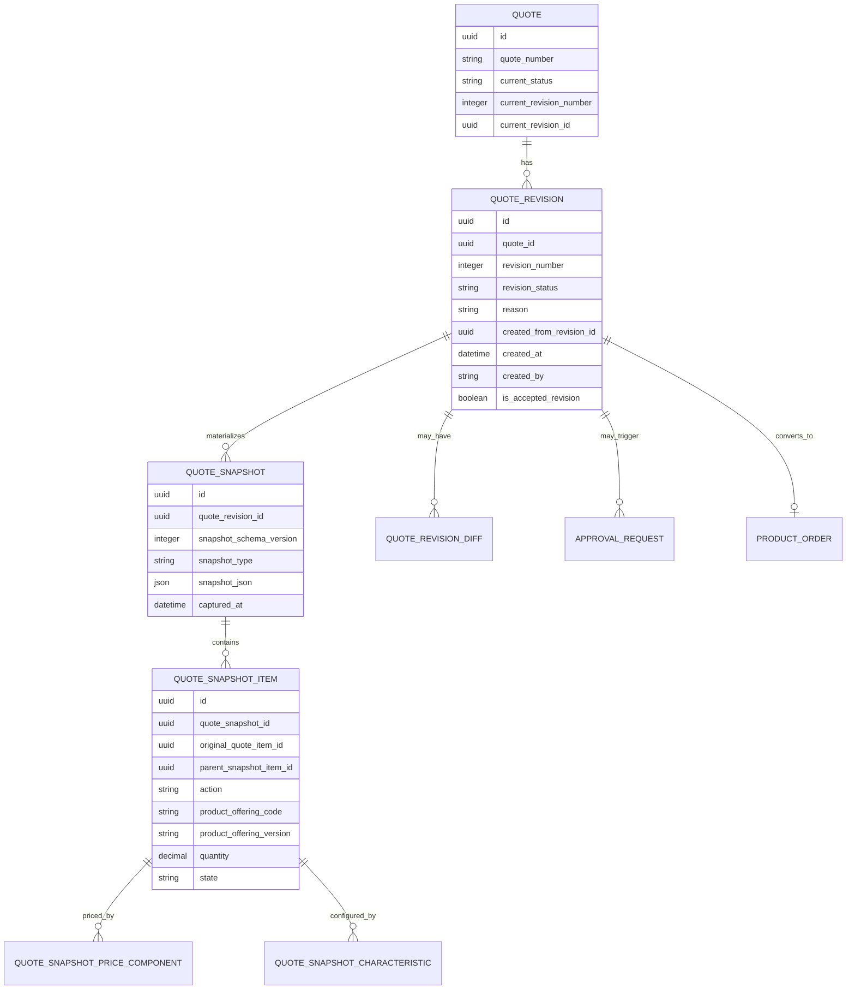
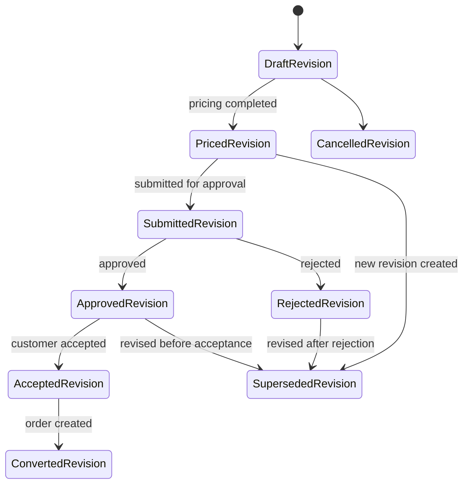

# Quote Versioning, Snapshot, and Immutability

> Fokus part ini: bagaimana memodelkan **quote versioning, revision, snapshot, dan immutability** agar quote yang sudah disubmit, approved, accepted, atau converted tetap menjadi commercial evidence yang benar, traceable, dan aman di production.

Quote adalah proposal komersial. Selama draft, quote boleh berubah. Setelah accepted, quote berubah menjadi bukti komitmen komersial.

Karena itu, quote model harus menjawab:

```text
Apa yang berubah?
Kapan berubah?
Siapa yang mengubah?
Versi mana yang customer terima?
Harga dihitung dari price version apa?
Catalog apa yang dipakai?
Configuration apa yang disetujui?
Agreement/customer/account snapshot mana yang berlaku?
Order dibuat dari revision yang mana?
```

Tanpa versioning dan snapshot yang disiplin, sistem akan mengalami bug serius:

- accepted quote berubah setelah customer menerima;
- order dibuat dari data quote yang berbeda dari yang di-approve;
- price mismatch karena price list terbaru dipakai saat conversion;
- audit tidak bisa membuktikan siapa menyetujui apa;
- quote revision diff tidak bisa dijelaskan;
- reporting historical salah karena reference menunjuk data current, bukan data saat quote dibuat.

---

## 1. Why Quote Versioning Exists

Quote versioning ada karena quote bukan hanya data entry form. Quote adalah lifecycle object.

Quote melewati fase:

```text
Draft → Configured → Priced → Submitted → Approved → Accepted → Converted
```

Pada tiap fase, mutability berbeda.

| Phase | Mutability | Reason |
|---|---|---|
| Draft | High | User masih membangun proposal |
| Configured | Medium | Product shape sudah mulai valid |
| Priced | Controlled | Harga sudah dihitung dan perlu trace |
| Submitted | Restricted | Approval evidence mulai dibangun |
| Approved | Very restricted | Approved commercial terms harus stabil |
| Accepted | Immutable | Customer commitment/evidence |
| Converted | Immutable + mapped | Order harus traceable ke accepted revision |

Versioning membuat perubahan eksplisit, bukan diam-diam.

---

## 2. Version vs Revision

Istilah `version` dan `revision` sering rancu. Tetapkan semantics sejak awal.

Rekomendasi mental model:

| Term | Meaning | Example |
|---|---|---|
| Entity version | Optimistic locking/version column | `version = 7` |
| Quote revision | Business revision visible to user/customer | `Rev 3` |
| Quote version | Major commercial version or API-level version, depending convention | `V2` |
| Snapshot version | Frozen data capture version | `snapshot_version = 1` |
| Event version | Schema version of emitted event | `eventVersion = 2` |

Untuk seri ini:

```text
entity_version = technical concurrency control
quote_revision = business-visible quote change boundary
snapshot = immutable copy of relevant data at revision boundary
```

Internal system boleh punya definisi berbeda. Yang penting: jangan biarkan field `version` bermakna ganda tanpa dokumentasi.

---

## 3. Snapshot as Evidence Boundary

Snapshot adalah frozen representation dari data penting pada waktu tertentu.

Quote snapshot bukan hanya backup. Ia adalah **evidence boundary**.

Snapshot harus menjawab:

- quote header saat revision dibuat;
- quote item tree saat revision dibuat;
- configuration saat revision dibuat;
- price breakdown saat revision dibuat;
- discount/approval state saat revision dibuat;
- catalog/offering/price version yang dipakai;
- customer/account/agreement label/reference saat revision dibuat;
- timestamp dan actor;
- reason perubahan.

---

## 4. What Should Be Snapshotted?

Tidak semua data harus deep-copied. Tetapi semua data yang memengaruhi commercial commitment harus bisa direkonstruksi.

| Data | Snapshot Need | Reason |
|---|---|---|
| Quote header | Yes | Proposal identity, validity, owner, currency, summary |
| Quote items | Yes | Products/actions/quantity/site |
| Product offering reference | Yes: ID + version + label | Catalog may change |
| Product configuration | Yes | Customer accepted specific configuration |
| Price components | Yes | Price list/rules may change |
| Discount decision | Yes | Approval/audit evidence |
| Tax estimate | Usually yes, with estimate/final flag | Customer-facing quote may show tax |
| Customer/account reference | Reference + display snapshot | Customer data may change |
| Agreement reference | Reference + term snapshot if material | Contract terms may change |
| Approval trail | Yes | Evidence |
| Audit events | Yes/log-linked | Traceability |

Prinsip:

```text
If changing the referenced current record would change the meaning of an accepted quote, snapshot it or reference an immutable version.
```

---

## 5. Reference vs Snapshot vs Immutable Version

Tiga pattern utama:

### 5.1 Reference to Current

```text
quote_item.product_offering_id -> product_offering.id
```

Kelebihan:

- simple;
- storage kecil;
- selalu melihat data terbaru.

Risiko:

- historical quote berubah makna;
- accepted quote tidak stabil;
- audit lemah.

Cocok untuk:

- non-material reference;
- lookup yang tidak mengubah meaning;
- data yang immutable by design.

### 5.2 Reference to Immutable Version

```text
quote_item.product_offering_id
quote_item.product_offering_version
```

Kelebihan:

- lebih stabil;
- storage efisien;
- audit cukup kuat jika catalog version immutable.

Risiko:

- bergantung pada discipline catalog versioning;
- kalau version record bisa berubah, tetap rapuh.

### 5.3 Deep Snapshot

```text
quote_snapshot.snapshot_json
quote_snapshot_item.product_offering_name_snapshot
quote_snapshot_item.configuration_json
quote_snapshot_price_component...
```

Kelebihan:

- strongest evidence;
- bisa reconstruct quote persis saat itu;
- tahan terhadap perubahan reference data.

Risiko:

- storage besar;
- migration lebih rumit;
- duplicate data;
- butuh schema/versioning snapshot.

---

## 6. Conceptual Model



---

## 7. Revision Lifecycle



Quote bisa punya banyak revision, tetapi hanya satu current working revision dan, biasanya, satu accepted revision untuk conversion path tertentu.

---

## 8. Mutable Draft vs Immutable Accepted Quote

Pisahkan mutable working data dan immutable evidence.

Pattern umum:

```text
quote / quote_item tables = current working model
quote_revision / quote_snapshot tables = historical/evidence model
```

Saat quote masih draft:

- update quote item diperbolehkan;
- recalculation diperbolehkan;
- validation diperbolehkan;
- item addition/removal diperbolehkan.

Saat quote accepted:

- accepted revision tidak boleh diubah;
- price snapshot tidak boleh dihitung ulang sebagai replacement;
- configuration snapshot tidak boleh diganti;
- order conversion harus memakai accepted revision;
- perubahan harus lewat new revision/amendment flow.

Invariant:

```text
Accepted quote revision is immutable.
Order must reference the accepted quote revision used for conversion.
```

---

## 9. Snapshot Granularity

Ada tiga level snapshot:

### Header Snapshot

Menyimpan:

- quote number;
- customer/account display;
- status;
- validity;
- currency;
- price summary;
- approval summary.

### Item Snapshot

Menyimpan:

- item tree;
- product reference/version/label;
- action;
- quantity;
- site/location;
- installed product reference;
- validation status.

### Detail Snapshot

Menyimpan:

- configuration values;
- price components;
- discount decisions;
- tax estimates;
- rule traces;
- approval trail.

Semakin detail snapshot, semakin kuat auditability, tetapi semakin besar storage dan migration cost.

---

## 10. Snapshot Trigger Points

Tidak semua perubahan perlu membuat snapshot penuh.

Typical trigger:

| Trigger | Snapshot Type |
|---|---|
| Quote submitted | Submission snapshot |
| Quote approved | Approval snapshot |
| Quote accepted | Acceptance snapshot |
| Quote converted | Conversion snapshot/reference |
| Quote revised | Previous revision frozen + new working revision |
| Price recalculated | Pricing snapshot or pricing run record |
| Approval decision | Approval audit snapshot |

Untuk production-grade CPQ, **acceptance snapshot** adalah paling kritikal.

---

## 11. PostgreSQL Logical/Physical Shape

Contoh table revision:

```sql
create table quote_revision (
  id uuid primary key,
  quote_id uuid not null references quote(id),
  revision_number integer not null,
  revision_status text not null,
  created_from_revision_id uuid null references quote_revision(id),
  reason text null,
  is_current boolean not null default false,
  is_accepted boolean not null default false,
  accepted_at timestamptz null,
  accepted_by text null,
  created_at timestamptz not null default now(),
  created_by text not null,
  constraint uq_quote_revision_number unique (quote_id, revision_number)
);

create unique index uq_quote_current_revision
  on quote_revision (quote_id)
  where is_current = true;

create unique index uq_quote_accepted_revision
  on quote_revision (quote_id)
  where is_accepted = true;
```

Partial unique index sangat berguna untuk enforce satu current/accepted revision per quote, jika business rule memang begitu.

---

## 12. Snapshot Table Shape

```sql
create table quote_snapshot (
  id uuid primary key,
  quote_revision_id uuid not null references quote_revision(id),
  snapshot_type text not null,
  snapshot_schema_version integer not null,
  quote_number text not null,
  customer_id uuid not null,
  customer_name_snapshot text not null,
  account_id uuid null,
  account_name_snapshot text null,
  currency char(3) not null,
  total_net_amount numeric(19, 4) not null,
  total_discount_amount numeric(19, 4) not null,
  total_tax_amount numeric(19, 4) not null,
  valid_from timestamptz null,
  valid_to timestamptz null,
  snapshot_json jsonb null,
  captured_at timestamptz not null default now(),
  captured_by text not null,
  constraint uq_quote_snapshot_revision_type unique (quote_revision_id, snapshot_type)
);

create index idx_quote_snapshot_revision
  on quote_snapshot (quote_revision_id);

create index idx_quote_snapshot_customer
  on quote_snapshot (customer_id);
```

Hybrid model: simpan important searchable fields sebagai columns, dan full reconstruction payload di `snapshot_json`.

---

## 13. Snapshot Item Shape

```sql
create table quote_snapshot_item (
  id uuid primary key,
  quote_snapshot_id uuid not null references quote_snapshot(id),
  original_quote_item_id uuid not null,
  parent_snapshot_item_id uuid null references quote_snapshot_item(id),
  item_number text not null,
  action text not null,
  state text not null,
  validation_status text not null,
  product_offering_id uuid not null,
  product_offering_code text not null,
  product_offering_name_snapshot text not null,
  product_offering_version text not null,
  catalog_id uuid not null,
  catalog_version text not null,
  quantity numeric(18, 6) not null,
  quantity_unit text not null,
  site_id uuid null,
  site_name_snapshot text null,
  installed_product_id uuid null,
  configuration_json jsonb null,
  sort_order integer not null
);

create index idx_quote_snapshot_item_snapshot
  on quote_snapshot_item (quote_snapshot_id);

create index idx_quote_snapshot_item_original
  on quote_snapshot_item (original_quote_item_id);
```

`original_quote_item_id` penting untuk diff dan conversion trace.

---

## 14. Snapshot Price Component Shape

```sql
create table quote_snapshot_price_component (
  id uuid primary key,
  quote_snapshot_item_id uuid not null references quote_snapshot_item(id),
  original_price_component_id uuid null,
  component_type text not null,
  charge_type text not null,
  price_source text not null,
  price_list_id uuid null,
  price_version text null,
  currency char(3) not null,
  unit_amount numeric(19, 4) not null,
  quantity numeric(18, 6) not null,
  gross_amount numeric(19, 4) not null,
  discount_amount numeric(19, 4) not null,
  net_amount numeric(19, 4) not null,
  tax_amount numeric(19, 4) not null,
  is_included_in_rollup boolean not null
);
```

Price snapshot harus cukup detail untuk menjawab:

```text
Harga ini berasal dari price list/version/rule apa?
Apakah angka yang customer terima bisa dihitung ulang secara audit?
Apakah order/billing menggunakan angka ini atau menghitung ulang?
```

---

## 15. Revision Diff Model

Revision diff membantu user dan approver memahami perubahan.

Diff bisa computed on demand atau persisted.

Persisted diff berguna jika:

- quote besar;
- approval butuh evidence cepat;
- audit/compliance penting;
- customer-facing revision comparison diperlukan.

Contoh diff table:

```sql
create table quote_revision_diff (
  id uuid primary key,
  quote_id uuid not null references quote(id),
  from_revision_id uuid not null references quote_revision(id),
  to_revision_id uuid not null references quote_revision(id),
  diff_type text not null,
  target_type text not null,
  target_id uuid null,
  field_name text null,
  before_value jsonb null,
  after_value jsonb null,
  severity text not null,
  created_at timestamptz not null default now()
);
```

Diff types:

```text
ITEM_ADDED
ITEM_REMOVED
ITEM_CHANGED
PRICE_CHANGED
DISCOUNT_CHANGED
CONFIGURATION_CHANGED
CUSTOMER_CHANGED
VALIDITY_CHANGED
APPROVAL_REQUIRED_CHANGED
```

---

## 16. Copy-on-Write Pattern

Saat user membuat revision baru dari accepted/approved quote:

```text
1. Freeze old revision.
2. Copy old revision into new working revision.
3. Allow edits only on new revision.
4. Preserve original item identity mapping if needed.
5. Revalidate and reprice.
6. Require reapproval if commercial guardrails changed.
```

Copy-on-write mencegah accepted evidence berubah.

Risk jika tidak copy-on-write:

- accepted quote item berubah;
- approval evidence tidak cocok dengan current item;
- order conversion memakai data campuran;
- audit tidak bisa membedakan before/after.

---

## 17. API Model

API harus eksplisit tentang revision.

Contoh endpoint shape:

```text
GET /quotes/{quoteId}
GET /quotes/{quoteId}/revisions
GET /quotes/{quoteId}/revisions/{revisionId}
GET /quotes/{quoteId}/revisions/{revisionId}/diff?compareTo={previousRevisionId}
POST /quotes/{quoteId}/revisions
POST /quotes/{quoteId}/submit
POST /quotes/{quoteId}/accept
POST /quotes/{quoteId}/convert-to-order
```

Acceptance request harus menyebut revision:

```json
{
  "quoteRevisionId": "...",
  "acceptedBy": "customer-or-user-ref",
  "acceptanceChannel": "PORTAL",
  "acceptanceTimestamp": "2026-07-12T10:00:00Z"
}
```

Jangan accept quote hanya berdasarkan `quote_id` jika ada kemungkinan current revision berubah akibat race condition.

---

## 18. Java/JAX-RS Implementation Considerations

Command model:

```java
public record AcceptQuoteCommand(
    UUID quoteId,
    UUID quoteRevisionId,
    String acceptedBy,
    Instant acceptedAt,
    String acceptanceChannel,
    String idempotencyKey
) {}
```

Service invariant:

```java
if (!revision.isCurrentApprovedRevision()) {
    throw new InvalidQuoteRevisionException();
}

if (revision.isExpired(clock.instant())) {
    throw new QuoteExpiredException();
}

snapshotService.captureAcceptanceSnapshot(revision.id());
quoteRepository.markAccepted(revision.id(), command.acceptedBy(), command.acceptedAt());
outbox.publish(new QuoteAccepted(...));
```

Implementation concerns:

- use transaction boundary around status update + snapshot + outbox;
- use optimistic locking on quote/revision;
- use idempotency key for accept/convert;
- never rebuild accepted snapshot from mutable current tables after commit without guarding version;
- ensure mapper does not silently omit price/configuration child rows.

---

## 19. Event Model

Important events:

```text
QuoteRevisionCreated
QuoteRevisionPriced
QuoteSubmitted
QuoteApproved
QuoteRejected
QuoteAccepted
QuoteSnapshotCaptured
QuoteRevisionSuperseded
QuoteConvertedToOrder
```

Example:

```json
{
  "eventId": "...",
  "eventType": "QuoteAccepted",
  "eventVersion": 1,
  "aggregateType": "Quote",
  "aggregateId": "quote-id",
  "quoteRevisionId": "revision-id",
  "snapshotId": "snapshot-id",
  "correlationId": "...",
  "occurredAt": "2026-07-12T10:00:00Z",
  "payload": {
    "quoteNumber": "Q-1001",
    "revisionNumber": 3,
    "currency": "USD",
    "totalNetAmount": "12500.00",
    "validTo": "2026-08-12T23:59:59Z"
  }
}
```

Event harus membawa revision/snapshot reference. Kalau hanya membawa quote ID, consumer bisa membaca revision yang salah.

---

## 20. Quote-to-Order Conversion Dependency

Conversion harus memakai accepted revision.

Correct model:

```text
product_order.source_quote_id
product_order.source_quote_revision_id
product_order.source_quote_snapshot_id
order_item.source_quote_item_id
order_item.source_quote_snapshot_item_id
```

Invariant:

```text
Order must be created from an accepted, non-superseded quote revision.
Order item must be traceable to the quote item/snapshot item used during conversion.
```

Jika order dibuat dari mutable current quote, production debugging akan sulit: “order ini sebenarnya berasal dari quote revision yang mana?”

---

## 21. Expiry Model

Quote expiry harus mempertimbangkan revision.

Fields:

```text
valid_from
valid_to
expiry_policy
expired_at
expired_by_job_id
expiry_reason
```

Important rules:

- quote cannot be accepted after `valid_to` unless explicit override exists;
- revision creation may extend validity only through controlled process;
- expiry job must be idempotent;
- accepted quote usually should not expire retroactively;
- expired draft/approved quote may be revised into a new revision.

Audit expiry event:

```text
QuoteExpired
  quote_id
  quote_revision_id
  valid_to
  expired_at
  source = SYSTEM_JOB
```

---

## 22. Audit Trail

Versioning dan snapshot tidak menggantikan audit trail. Keduanya saling melengkapi.

Snapshot menjawab:

```text
Apa keadaan quote pada titik waktu tertentu?
```

Audit trail menjawab:

```text
Siapa melakukan apa, kapan, dari mana, kenapa, dan akibatnya apa?
```

Audit event penting:

- revision created;
- item added/removed;
- configuration changed;
- price recalculated;
- discount applied;
- quote submitted;
- approval decision;
- quote accepted;
- quote expired;
- quote converted;
- revision superseded.

---

## 23. Reporting Impact

Versioning memengaruhi reporting.

Pertanyaan reporting yang harus dijawab:

- berapa nilai quote latest revision;
- berapa nilai accepted quote;
- berapa nilai quote sebelum dan sesudah discount;
- berapa banyak quote yang revised setelah approval;
- berapa conversion rate per revision count;
- berapa average time from first draft to accepted revision;
- berapa expired quote value;
- produk mana yang paling sering berubah antar revision;
- discount apa yang berubah setelah reapproval.

Reporting table bisa punya fields:

```text
quote_id
quote_number
revision_id
revision_number
revision_status
is_current
is_accepted
created_at
submitted_at
approved_at
accepted_at
converted_at
currency
total_net_amount
total_discount_amount
revision_count
source_channel
customer_id
account_id
```

---

## 24. Failure Modes

| Failure Mode | Symptom | Root Cause |
|---|---|---|
| Accepted quote mutated | Customer accepted terms no longer reproducible | No immutable snapshot/copy-on-write |
| Order from wrong revision | Order price/config differs from approved quote | Conversion used quote_id/current revision only |
| Price mismatch after catalog update | Historical quote shows new price | Reference-to-current instead of version/snapshot |
| Approval evidence mismatch | Approved amount differs from accepted amount | Reprice after approval without reapproval |
| Lost revision diff | User cannot see what changed | No diff model or audit field-level history |
| Duplicate accepted revisions | Multiple accepted revisions for one quote | Missing partial unique constraint/business rule |
| Expired quote accepted | Acceptance after valid_to | Missing guard/race condition |
| Snapshot incomplete | Cannot reconstruct quote | Snapshot omitted configuration/price/tax/discount |
| Event consumer reads wrong data | Consumer fetches current quote after event | Event lacks revision/snapshot ID |
| Migration corrupts history | Old snapshots unreadable | Snapshot schema version missing |

---

## 25. Detection Queries

Find quotes with multiple accepted revisions:

```sql
select quote_id, count(*)
from quote_revision
where is_accepted = true
group by quote_id
having count(*) > 1;
```

Find accepted revisions without acceptance snapshot:

```sql
select qr.id, qr.quote_id, qr.revision_number
from quote_revision qr
left join quote_snapshot qs
  on qs.quote_revision_id = qr.id
 and qs.snapshot_type = 'ACCEPTANCE'
where qr.is_accepted = true
  and qs.id is null;
```

Find orders missing source quote revision:

```sql
select id, order_number, source_quote_id
from product_order
where source_quote_id is not null
  and source_quote_revision_id is null;
```

Find accepted revisions modified after acceptance if mutable table stores update timestamp:

```sql
select qr.id, qr.quote_id, qr.accepted_at, qi.updated_at
from quote_revision qr
join quote_item qi on qi.quote_id = qr.quote_id
where qr.is_accepted = true
  and qi.updated_at > qr.accepted_at;
```

Real interpretation depends on whether current working tables are separate from snapshot tables.

---

## 26. Debugging Playbook

Saat customer mengatakan accepted quote berbeda dari order:

1. Cari order.
2. Ambil `source_quote_id`, `source_quote_revision_id`, dan `source_quote_snapshot_id`.
3. Ambil acceptance snapshot.
4. Bandingkan snapshot item dengan order item.
5. Bandingkan price components dengan order/billing charge.
6. Cek conversion event/outbox.
7. Cek idempotency record.
8. Cek apakah ada revision baru setelah acceptance.
9. Cek approval snapshot.
10. Cek audit trail untuk reprice/discount/config changes.

Saat approval amount tidak cocok:

1. Ambil revision submitted.
2. Ambil approval request reference.
3. Ambil price snapshot saat submit.
4. Cek apakah quote direpriced setelah approval.
5. Cek apakah reapproval guard jalan.
6. Cek audit event untuk discount/price override.

---

## 27. Storage and Performance Concerns

Snapshot bisa besar. Trade-off:

| Concern | Mitigation |
|---|---|
| Large JSONB snapshot | Store searchable fields in columns, full payload compressed/archived if needed |
| Many price components | Partition/history table if volume high |
| Slow diff | Persist diff for important revision transitions |
| Large quote item tree | Load snapshot items in batch, assemble tree in memory |
| Reporting cost | Build quote revision fact/read model |
| Retention | Define quote retention and archive policy |

Index penting:

```text
quote_revision(quote_id, revision_number)
quote_revision(quote_id) where is_current = true
quote_revision(quote_id) where is_accepted = true
quote_snapshot(quote_revision_id, snapshot_type)
quote_snapshot_item(quote_snapshot_id)
quote_snapshot_item(original_quote_item_id)
```

---

## 28. Security and Privacy

Snapshots bisa menyimpan data sensitif historis:

- customer name;
- address/site;
- price;
- discount;
- margin/cost if included;
- approval reason;
- contract terms;
- custom configuration.

Security implications:

- masking current customer data tidak otomatis masking snapshot;
- deletion/privacy request harus mempertimbangkan retention/legal basis;
- snapshot export harus access-controlled;
- audit reader tidak selalu boleh melihat price/margin;
- snapshot JSONB bisa menyimpan PII tersembunyi.

Internal policy harus menentukan apakah snapshot adalah legal/commercial record yang disimpan sesuai retention tertentu.

---

## 29. Migration Concerns

Snapshot schema akan berubah.

Karena itu, gunakan:

```text
snapshot_schema_version
snapshot_type
captured_at
producer_service_version
```

Migration strategies:

- keep old snapshots readable;
- write adapter/deserializer per schema version;
- avoid destructive migration of historical snapshot unless required;
- build validation query after migration;
- never backfill accepted snapshots from current mutable records without marking source/limitation.

---

## 30. Internal Verification Checklist

Verifikasi di internal codebase/team:

- definisi `version` vs `revision`;
- apakah quote punya business revision number;
- apakah ada current revision dan accepted revision;
- apakah accepted quote immutable;
- apakah quote item accepted bisa berubah setelah acceptance;
- snapshot trigger point: submit, approve, accept, convert;
- data apa saja yang disnapshot;
- apakah price/configuration/catalog/customer/agreement disnapshot atau hanya reference;
- apakah catalog/price version immutable;
- apakah order menyimpan `source_quote_revision_id`;
- apakah order item menyimpan `source_quote_item_id` atau snapshot item ID;
- apakah event membawa revision/snapshot ID;
- apakah approval memakai revision tertentu;
- apakah reprice setelah approval memicu reapproval;
- apakah expiry guard memakai revision validity;
- apakah snapshot schema version ada;
- apakah ada revision diff;
- apakah reporting memakai current quote atau accepted revision;
- apakah snapshot mengandung PII/sensitive commercial data;
- apakah retention/archive policy jelas;
- incident historis terkait quote berubah, price mismatch, atau conversion mismatch.

---

## 31. PR Review Checklist

Saat review perubahan quote versioning/snapshot:

- Apakah semantics version/revision jelas?
- Apakah accepted revision immutable?
- Apakah snapshot dibuat dalam transaction boundary yang aman?
- Apakah snapshot cukup untuk reconstruct quote?
- Apakah order conversion memakai accepted revision?
- Apakah event membawa revision/snapshot ID?
- Apakah reprice setelah approval dicegah atau memicu reapproval?
- Apakah expiry guard race-safe?
- Apakah optimistic locking digunakan?
- Apakah snapshot schema versioned?
- Apakah snapshot fields cukup untuk reporting?
- Apakah sensitive fields dalam snapshot dikontrol?
- Apakah migration/backfill snapshot punya validation query?
- Apakah duplicate accepted revision dicegah oleh DB/business constraint?
- Apakah audit trail mencatat reason dan actor?

---

## 32. Key Takeaways

Quote versioning adalah cara sistem menjaga perbedaan antara **working proposal** dan **commercial evidence**.

Mental model utama:

```text
Draft quote = mutable working data
Revision = business change boundary
Snapshot = frozen evidence
Accepted revision = immutable commitment
Order conversion = execution from accepted evidence
Audit trail = who/what/when/why trace
```

Aturan paling penting:

```text
Never let accepted commercial evidence depend only on mutable current records.
```

Kalau quote accepted bisa berubah diam-diam, sistem kehilangan defensibility. Kalau accepted revision dan snapshot kuat, quote-to-order, approval, billing, audit, reporting, dan incident debugging menjadi jauh lebih aman.
