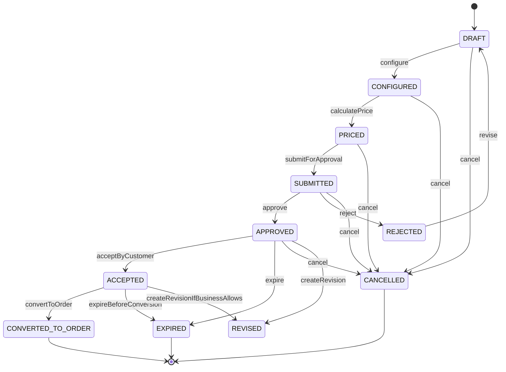
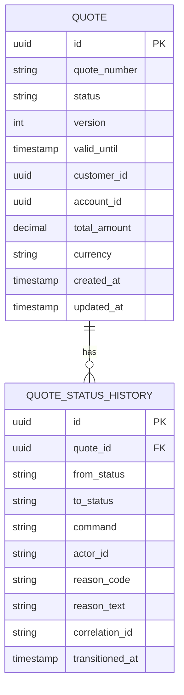
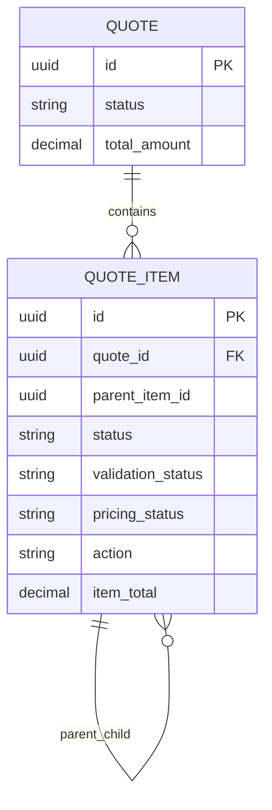

# Quote Lifecycle State Machine

## 1. Core Idea

Quote lifecycle bukan sekadar kolom `status`.

Dalam sistem CPQ / Quote Management / Quote-to-Cash, quote adalah **commercial proposal** yang bergerak melalui beberapa fase:

1. dibuat,
2. dikonfigurasi,
3. dihitung harga,
4. divalidasi,
5. dikirim untuk approval,
6. disetujui atau ditolak,
7. diterima customer,
8. expired atau cancelled,
9. dikonversi menjadi order.

Setiap fase memiliki konsekuensi data.

Kesalahan umum adalah memperlakukan lifecycle quote sebagai enum bebas yang bisa diubah oleh endpoint apa pun. Ini berbahaya karena status quote biasanya mengontrol:

- apakah item masih boleh diubah,
- apakah harga boleh dihitung ulang,
- apakah discount masih boleh diedit,
- apakah approval harus diulang,
- apakah quote masih valid secara waktu,
- apakah quote boleh dikirim ke customer,
- apakah quote boleh dikonversi menjadi order,
- apakah accepted quote harus menjadi immutable evidence.

Mental model yang benar:

> Quote lifecycle adalah state machine yang mengontrol allowed command, guard condition, side effect, immutable boundary, dan audit trail.

---

## 2. Why Quote Lifecycle Exists

Quote lifecycle ada karena quote memiliki beban bisnis yang lebih berat daripada shopping cart.

Quote bisa menjadi dasar:

- commercial commitment,
- approval decision,
- customer acceptance,
- order creation,
- billing activation,
- dispute evidence,
- audit trace,
- revenue forecast,
- sales pipeline reporting.

Tanpa lifecycle yang eksplisit, sistem akan rawan:

- quote dikonversi sebelum approved,
- harga berubah setelah customer accepted,
- quote expired tetap dipakai membuat order,
- discount dinaikkan setelah approval,
- quote item berubah tanpa reapproval,
- dua order dibuat dari satu accepted quote,
- quote revised tetapi order memakai versi lama tanpa trace,
- reporting pipeline menghitung quote yang salah status.

Lifecycle state machine adalah mekanisme untuk menjaga **business correctness**.

---

## 3. Common Quote States

State aktual harus diverifikasi di sistem internal. Namun secara konseptual, quote lifecycle enterprise sering memiliki state berikut.

| State | Makna |
|---|---|
| `DRAFT` | Quote baru dibuat dan masih bisa diedit bebas. |
| `CONFIGURED` | Quote item sudah dikonfigurasi tetapi belum tentu priced/final. |
| `PRICED` | Harga sudah dihitung dan price breakdown tersedia. |
| `SUBMITTED` | Quote dikirim untuk review/approval. |
| `APPROVED` | Quote disetujui secara commercial authority. |
| `REJECTED` | Quote ditolak approval. |
| `ACCEPTED` | Customer menerima quote. |
| `EXPIRED` | Quote melewati validity period. |
| `CANCELLED` | Quote dibatalkan sebelum menjadi order. |
| `REVISED` | Quote digantikan revision baru. |
| `CONVERTED_TO_ORDER` | Quote sudah menghasilkan order. |

Tidak semua sistem memakai semua state ini. Beberapa sistem menyatukan `CONFIGURED` dan `PRICED`; beberapa memisahkan `PENDING_APPROVAL`, `APPROVAL_IN_PROGRESS`, `APPROVED_WITH_EXCEPTION`, atau `CUSTOMER_PRESENTED`.

Yang penting bukan nama enum, tetapi:

- apa arti state,
- command apa yang legal,
- field apa yang mutable,
- invariant apa yang harus benar,
- side effect apa yang muncul saat transition,
- audit apa yang harus disimpan.

---

## 4. State Machine Sketch



Diagram ini hanya conceptual. Internal implementation bisa berbeda.

---

## 5. State Is Not Enough

Kolom `quote.status` tidak cukup. Lifecycle yang sehat biasanya membutuhkan:

| Data | Tujuan |
|---|---|
| Current state | Menjawab posisi quote sekarang. |
| Previous state | Debugging dan transition validation sederhana. |
| Transition history | Audit lengkap perubahan state. |
| Actor | Siapa yang memicu transition. |
| Command | Aksi bisnis yang memicu transition. |
| Reason | Alasan approval/rejection/cancellation/revision. |
| Timestamp | Kapan transition terjadi. |
| Correlation ID | Menghubungkan request, event, workflow, log, dan integration. |
| Version/lock | Menghindari concurrent transition. |
| Guard result | Evidence kenapa transition diizinkan/ditolak. |
| Side effect reference | Event, approval request, order, atau workflow yang dibuat. |

Minimal production-grade model:



---

## 6. Command-Based Transition

State transition sebaiknya tidak dieksekusi dengan generic update seperti:

```http
PATCH /quotes/{id}
{
  "status": "APPROVED"
}
```

Itu berbahaya karena status berubah tanpa semantic command.

Lebih baik lifecycle dikendalikan command eksplisit:

```http
POST /quotes/{id}/submit-for-approval
POST /quotes/{id}/approve
POST /quotes/{id}/reject
POST /quotes/{id}/accept
POST /quotes/{id}/cancel
POST /quotes/{id}/convert-to-order
```

Atau satu endpoint command-driven:

```http
POST /quotes/{id}/commands
{
  "command": "SUBMIT_FOR_APPROVAL",
  "reason": "Discount exceeds standard threshold",
  "idempotencyKey": "..."
}
```

Keuntungan command-driven model:

- transition punya intent bisnis,
- guard condition bisa spesifik,
- audit lebih jelas,
- API contract lebih stabil,
- event yang diterbitkan lebih meaningful,
- authorization bisa command-specific,
- reporting bisa membedakan cause of transition.

---

## 7. Transition Guard Conditions

Guard condition adalah aturan yang harus benar sebelum transition dilakukan.

Contoh guard per transition:

| Transition | Guard |
|---|---|
| `DRAFT -> CONFIGURED` | Quote memiliki customer/account; minimal satu item valid; catalog reference valid. |
| `CONFIGURED -> PRICED` | Configuration valid; required attributes lengkap; priceable offering tersedia. |
| `PRICED -> SUBMITTED` | Total price calculated; discount reason lengkap; margin threshold dievaluasi. |
| `SUBMITTED -> APPROVED` | Actor punya authority; approval steps completed; no stale price/catalog. |
| `SUBMITTED -> REJECTED` | Actor authorized; rejection reason wajib. |
| `APPROVED -> ACCEPTED` | Quote belum expired; approval masih valid; acceptance evidence tersedia. |
| `ACCEPTED -> CONVERTED_TO_ORDER` | Quote immutable; belum converted; conversion idempotency valid. |
| `ANY_NON_TERMINAL -> CANCELLED` | Tidak ada order aktif; actor authorized; cancellation reason tersedia. |

Guard condition tidak hanya validasi field. Guard bisa melibatkan:

- current lifecycle state,
- item validation state,
- quote version,
- approval state,
- price freshness,
- catalog version,
- customer/account validity,
- agreement validity,
- tenant isolation,
- user authority,
- concurrent update lock,
- external workflow state.

---

## 8. Illegal Transitions

Illegal transition harus dianggap sebagai data correctness signal, bukan sekadar bad request biasa.

Contoh illegal transition:

| From | To | Kenapa ilegal |
|---|---|---|
| `DRAFT` | `APPROVED` | Belum configured/priced/submitted. |
| `PRICED` | `ACCEPTED` | Approval belum selesai. |
| `EXPIRED` | `CONVERTED_TO_ORDER` | Quote tidak valid lagi. |
| `CONVERTED_TO_ORDER` | `DRAFT` | Terminal state tidak boleh dibuka ulang. |
| `CANCELLED` | `APPROVED` | Cancelled adalah terminal state. |
| `ACCEPTED` | `PRICED` | Accepted quote seharusnya immutable. |

Implementation rule:

> Jangan hanya menyimpan allowed state. Simpan allowed transition.

Contoh table-driven transition:

```sql
quote_status_transition_rule
- from_status
- command
- to_status
- requires_reason
- requires_authority
- terminal_source_allowed
- active_from
- active_to
```

Namun hati-hati: semua guard kompleks tidak harus dipindahkan ke table. Beberapa invariant lebih aman di domain service.

---

## 9. Side Effects Per Transition

Transition biasanya menghasilkan side effect.

| Transition | Side effect |
|---|---|
| `DRAFT -> CONFIGURED` | Simpan configuration snapshot atau validation result. |
| `CONFIGURED -> PRICED` | Simpan price breakdown dan pricing trace. |
| `PRICED -> SUBMITTED` | Buat approval request atau workflow instance. |
| `SUBMITTED -> APPROVED` | Simpan approval decision dan publish quote approved event. |
| `SUBMITTED -> REJECTED` | Simpan rejection reason dan notify owner. |
| `APPROVED -> ACCEPTED` | Freeze accepted snapshot dan publish quote accepted event. |
| `ACCEPTED -> CONVERTED_TO_ORDER` | Buat order, mapping quote-order, publish conversion event. |
| `ANY -> CANCELLED` | Simpan cancellation reason dan publish cancellation event. |
| `ANY -> EXPIRED` | Expiry job update state dan publish quote expired event. |

Side effect harus atomic atau recoverable.

Jika update status sukses tetapi event gagal, system bisa inconsistency. Pattern umum:

- update quote state,
- insert status history,
- insert outbox event,
- commit transaction,
- async publisher mengirim event.

---

## 10. Quote State and Item State

Quote header state dan quote item state tidak selalu sama.

Contoh:

- Quote header `PRICED`, tetapi satu item `PRICE_ERROR`.
- Quote header `SUBMITTED`, tetapi satu item `VALIDATION_WARNING`.
- Quote header `APPROVED`, tetapi beberapa item membutuhkan fulfillment feasibility check.
- Quote header `ACCEPTED`, semua accepted item harus immutable.

Model umum:



Invariant contoh:

- Quote tidak boleh `PRICED` jika ada item `pricing_status = FAILED`.
- Quote tidak boleh `SUBMITTED` jika ada item required configuration missing.
- Quote tidak boleh `ACCEPTED` jika approval state bukan approved.
- Quote tidak boleh `CONVERTED_TO_ORDER` jika ada accepted item yang tidak punya mapping rule.

---

## 11. Mutability Rules by State

State menentukan field mana yang bisa berubah.

| State | Mutability |
|---|---|
| `DRAFT` | Customer/account mungkin masih bisa diubah tergantung policy; item bebas diedit. |
| `CONFIGURED` | Configuration bisa diedit; pricing mungkin harus invalidated. |
| `PRICED` | Discount mungkin bisa diedit; price recalculation diperlukan. |
| `SUBMITTED` | Item/price/discount tidak boleh berubah tanpa withdrawal/revision. |
| `APPROVED` | Perubahan commercial material harus reapproval. |
| `ACCEPTED` | Quote snapshot harus immutable. |
| `CONVERTED_TO_ORDER` | Quote tidak boleh diubah kecuali metadata non-material. |
| `EXPIRED` | Tidak boleh dikonversi; mungkin boleh revised. |
| `CANCELLED` | Terminal; hanya metadata audit/support yang boleh ditambah. |

Rule penting:

> Setiap perubahan yang memengaruhi price, configuration, term, agreement, customer, atau item structure harus mengubah lifecycle atau membuat revision.

---

## 12. Revision vs State Reversal

Jangan menyelesaikan perubahan dengan “turunkan status kembali”.

Contoh buruk:

```text
APPROVED -> DRAFT
```

Ini sering menghapus meaning approval.

Lebih baik:

```text
APPROVED quote Q-100 v3
create revision Q-100 v4 in DRAFT
mark v3 as REVISED or SUPERSEDED
```

Dengan begitu:

- approval lama tetap auditable,
- customer-facing history tetap jelas,
- accepted/approved snapshot tidak rusak,
- order conversion bisa tahu versi mana yang valid.

---

## 13. Expiry Modelling

Quote expiry biasanya berdasarkan `valid_until`.

Hal yang harus jelas:

- `valid_until` timezone,
- apakah inclusive atau exclusive,
- apakah expiry dihitung dari created date, priced date, approved date, atau sent date,
- apakah quote bisa diperpanjang,
- apakah extension butuh approval ulang,
- apakah expired quote bisa revised,
- apakah accepted quote bisa expired sebelum conversion,
- job apa yang menandai quote sebagai expired.

Contoh invariant:

```text
A quote cannot transition to ACCEPTED if now > valid_until.
A quote cannot transition to CONVERTED_TO_ORDER if status = EXPIRED.
Extending validity after approval requires audit reason and possibly reapproval.
```

---

## 14. Concurrency Concern

Quote lifecycle rentan race condition.

Contoh race:

1. User A approve quote.
2. User B edit discount hampir bersamaan.
3. User C accept quote dari UI lama.
4. Expiry job mencoba expire quote.
5. Conversion job mencoba create order dua kali karena retry.

Teknik mitigasi:

- optimistic locking via `version`,
- transition compare-and-set,
- idempotency key untuk command,
- unique constraint untuk conversion,
- transactional outbox,
- explicit terminal state handling,
- audit transition attempt untuk rejected command penting.

Contoh update aman:

```sql
update quote
set status = :to_status,
    version = version + 1,
    updated_at = now()
where id = :quote_id
  and status = :expected_from_status
  and version = :expected_version;
```

Jika row affected = 0, berarti stale write atau illegal transition karena state sudah berubah.

---

## 15. PostgreSQL Modelling Considerations

### 15.1 Quote table

Field umum:

```sql
quote (
  id uuid primary key,
  quote_number text not null unique,
  customer_id uuid not null,
  account_id uuid,
  status text not null,
  version integer not null default 0,
  currency char(3) not null,
  total_amount numeric(18,2),
  approval_status text,
  valid_from timestamptz,
  valid_until timestamptz,
  accepted_at timestamptz,
  converted_order_id uuid,
  created_at timestamptz not null,
  updated_at timestamptz not null
)
```

### 15.2 Constraints

Contoh constraint konseptual:

```sql
check (valid_until is null or valid_from is null or valid_until > valid_from)
```

Unique conversion guard:

```sql
create unique index uq_quote_converted_order
on quote (converted_order_id)
where converted_order_id is not null;
```

Namun jangan paksakan semua invariant ke constraint. Cross-entity invariant seperti “semua item sudah priced” biasanya ada di domain service atau materialized validation table.

### 15.3 Status history

```sql
quote_status_history (
  id uuid primary key,
  quote_id uuid not null references quote(id),
  from_status text,
  to_status text not null,
  command text not null,
  actor_id text,
  reason_code text,
  reason_text text,
  correlation_id text,
  metadata jsonb,
  transitioned_at timestamptz not null
)
```

Index penting:

```sql
create index idx_quote_status_customer
on quote (customer_id, status, updated_at desc);

create index idx_quote_status_history_quote_time
on quote_status_history (quote_id, transitioned_at desc);

create index idx_quote_valid_until
on quote (valid_until)
where status in ('APPROVED', 'ACCEPTED');
```

---

## 16. Java/JAX-RS Backend Implications

Quote lifecycle logic sebaiknya tidak tersebar di controller.

Struktur sehat:

```text
QuoteResource
  -> QuoteCommandService
      -> QuoteRepository
      -> QuoteTransitionPolicy
      -> QuoteInvariantChecker
      -> ApprovalGateway
      -> OutboxPublisher
```

Controller hanya menerima command dan mengembalikan response.

Domain/application service bertanggung jawab untuk:

- load quote aggregate,
- validate command,
- evaluate transition guard,
- apply transition,
- write status history,
- write outbox event,
- return updated representation.

Contoh pseudo-code:

```java
public Quote approveQuote(QuoteId quoteId, ApproveQuoteCommand command) {
    Quote quote = quoteRepository.getForUpdateOrVersionCheck(quoteId);

    transitionPolicy.assertAllowed(
        quote.status(),
        QuoteCommand.APPROVE,
        command.actor()
    );

    invariantChecker.assertApprovalCanBeCompleted(quote, command);

    quote.transitionToApproved(command.actor(), command.reason());

    quoteRepository.save(quote);
    quoteStatusHistoryRepository.append(quote.lastTransition());
    outboxRepository.append(QuoteApprovedEvent.from(quote));

    return quote;
}
```

---

## 17. MyBatis/JPA/JDBC Implications

### MyBatis

MyBatis cocok untuk lifecycle yang membutuhkan SQL eksplisit:

- conditional update,
- status history insert,
- lock-aware query,
- projection query,
- complex reporting query.

Pastikan mapper tidak menyediakan generic update status yang melewati transition service.

### JPA

JPA bisa dipakai, tetapi hati-hati:

- lazy loading quote items pada validation,
- dirty checking yang mengubah field tanpa command,
- optimistic locking wajib,
- lifecycle callback jangan dipakai untuk business transition utama,
- enum migration perlu hati-hati.

### JDBC

JDBC cocok untuk command transaction yang eksplisit dan predictable. Trade-off-nya boilerplate lebih tinggi.

Rule umum:

> Apa pun data access layer-nya, lifecycle transition harus lewat satu application service yang mengontrol guard, invariant, history, dan event.

---

## 18. Event Model

Transition penting sebaiknya menghasilkan event.

Contoh event:

- `QuoteConfigured`
- `QuotePriced`
- `QuoteSubmittedForApproval`
- `QuoteApproved`
- `QuoteRejected`
- `QuoteAccepted`
- `QuoteExpired`
- `QuoteCancelled`
- `QuoteConvertedToOrder`

Event payload minimal:

```json
{
  "eventId": "uuid",
  "eventType": "QuoteApproved",
  "eventVersion": 1,
  "occurredAt": "2026-07-12T10:00:00Z",
  "correlationId": "corr-123",
  "aggregateId": "quote-id",
  "quoteNumber": "Q-10001",
  "quoteVersion": 3,
  "fromStatus": "SUBMITTED",
  "toStatus": "APPROVED",
  "customerId": "customer-id",
  "accountId": "account-id",
  "actorId": "user-id"
}
```

Event bukan pengganti database state. Event adalah integration fact.

---

## 19. Reporting and Analytics Impact

Quote lifecycle memengaruhi KPI:

- quote created count,
- configured quote count,
- priced quote count,
- submitted quote count,
- approval aging,
- approval rejection rate,
- accepted quote conversion rate,
- quote expiration rate,
- quote-to-order conversion latency,
- discount approval cycle time,
- win/loss analysis,
- pipeline value by state.

Reporting model harus jelas:

- menggunakan current status atau historical transition,
- menghitung latest quote revision atau semua revision,
- menghitung accepted quote amount atau approved quote amount,
- menghitung expired quote berdasarkan status atau valid_until,
- mengecualikan cancelled/revised quote atau tidak.

---

## 20. Observability and Debugging

Metric penting:

- quote stuck in submitted,
- quote approval aging,
- quote priced but not submitted,
- quote accepted but not converted,
- quote conversion failed,
- quote expired but status not expired,
- invalid status transition count,
- concurrent transition conflict count,
- quote without status history,
- quote total mismatch with item total,
- approval status mismatch with quote status.

Diagnostic queries:

```sql
-- Accepted quote not converted after threshold
select id, quote_number, accepted_at, status
from quote
where status = 'ACCEPTED'
  and accepted_at < now() - interval '24 hours'
  and converted_order_id is null;

-- Quote current status without history evidence
select q.id, q.quote_number, q.status
from quote q
left join quote_status_history h on h.quote_id = q.id
where h.id is null;

-- Expired quote still approved
select id, quote_number, status, valid_until
from quote
where status in ('APPROVED', 'ACCEPTED')
  and valid_until < now();
```

---

## 21. Failure Modes

| Failure mode | Symptom | Likely cause | Prevention |
|---|---|---|---|
| Approved quote modified | Price/discount changes after approval | No immutability by state | Mutability matrix and revision model |
| Expired quote converted | Order created from invalid quote | Missing expiry guard | Guard before conversion |
| Double conversion | Two orders for one quote | Retry without idempotency | Unique quote-order mapping |
| Missing audit trail | Cannot explain who approved | Status update bypassed history | Command-only transition |
| Stuck submitted quote | Approval not progressing | Workflow mismatch | Approval/workflow reconciliation |
| Status mismatch | Header approved but approval rejected | Separate states unsynchronized | State derivation/invariant checks |
| Race condition | User sees accepted but DB cancelled | Concurrent transition | Optimistic locking |
| Invalid reporting | Conversion rate wrong | Revision counted incorrectly | Reporting semantic definition |

---

## 22. PR Review Checklist

Use these questions when reviewing quote lifecycle changes:

- What command triggers this transition?
- Is the transition allowed from current state?
- What guard conditions are evaluated?
- What fields become immutable after this transition?
- Does this transition require audit history?
- Does it publish an event?
- Is event publication transactional or outbox-based?
- Does it interact with approval workflow?
- Does it affect quote version/revision?
- Does it affect price/catalog/configuration snapshot?
- Can concurrent requests cause inconsistent status?
- Is idempotency required?
- What happens if downstream side effect fails?
- Does reporting depend on this status?
- Are migration/backfill changes needed for existing quotes?
- Are illegal transitions observable?

---

## 23. Internal Verification Checklist

Verify these in the internal CSG/team context:

- Actual quote status enum and lifecycle diagram.
- Whether quote lifecycle is implemented as state machine, workflow, or ad hoc status update.
- Whether quote transition is command-driven or generic patch-driven.
- Where transition guard logic lives.
- Whether accepted/approved quote is immutable.
- Whether quote revision creates new version or mutates existing quote.
- Whether quote item state influences quote header state.
- Whether approval state is separate from quote status.
- Whether expiry is handled by scheduler, workflow timer, or query-time rule.
- Whether conversion to order is idempotent.
- Whether conversion writes quote-order mapping.
- Whether status history table exists.
- Whether audit contains actor, reason, before/after, correlation ID.
- Whether transition events are published through outbox.
- Whether UI/API allows illegal status patching.
- Whether MyBatis/JPA repositories expose unsafe update methods.
- Whether reporting uses current state or transition history.
- Whether incident notes mention quote lifecycle inconsistency.

---

## 24. Summary

Quote lifecycle state machine is a correctness boundary.

A production-grade quote model must define:

- explicit states,
- explicit commands,
- allowed transitions,
- guard conditions,
- mutability rules,
- terminal states,
- transition history,
- audit evidence,
- event publication,
- concurrency protection,
- reporting semantics,
- failure recovery.

The most important rule:

> Never treat quote status as a passive enum. Treat it as a controlled business state machine that protects commercial correctness.
