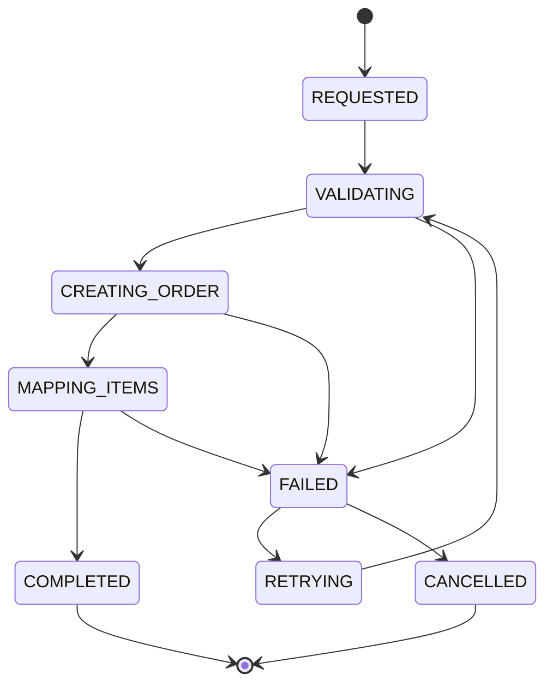
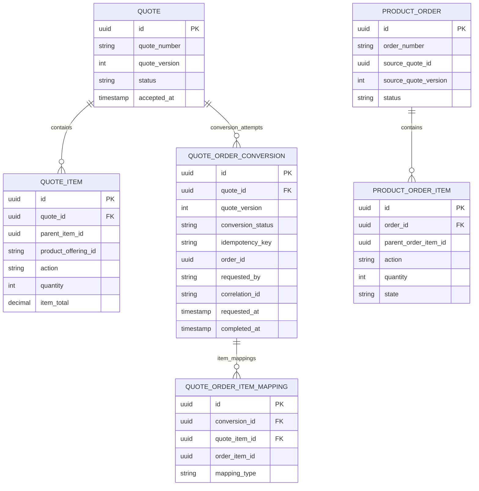
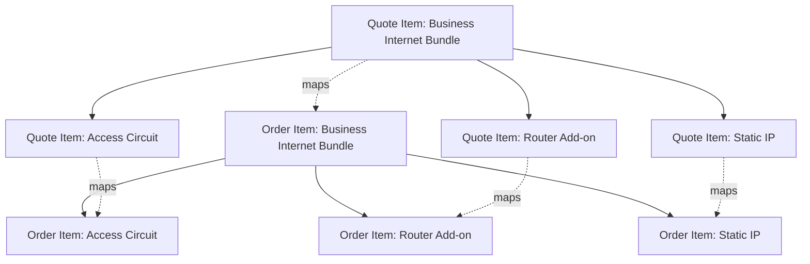
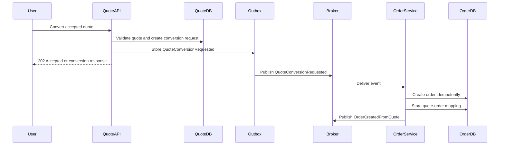

# Quote-to-Order Conversion Model

## 1. Core Idea

Quote-to-order conversion adalah titik perubahan dari **commercial proposal** menjadi **execution instruction**.

Quote menjawab:

> Apa yang ditawarkan, kepada siapa, dengan konfigurasi, harga, discount, term, dan validity apa?

Order menjawab:

> Apa yang harus dieksekusi, dengan action apa, untuk customer/account mana, di site mana, dengan dependency, fulfillment, dan billing trigger apa?

Kesalahan umum adalah menganggap conversion sebagai copy sederhana:

```text
quote -> order
quote_item -> order_item
```

Padahal conversion adalah proses transformasi yang harus menjaga:

- accepted quote immutability,
- quote version correctness,
- price carry-over,
- configuration carry-over,
- catalog version trace,
- customer/account carry-over,
- agreement carry-over,
- order action mapping,
- idempotency,
- audit trail,
- event publication,
- recovery saat partial failure.

Mental model yang benar:

> Quote-to-order conversion adalah controlled, idempotent, auditable domain transformation dari accepted commercial snapshot menjadi executable order model.

---

## 2. Why Conversion Model Exists

Conversion model ada untuk mencegah gap antara apa yang disetujui customer dan apa yang dijalankan sistem fulfillment/billing.

Tanpa conversion model yang eksplisit, sistem rawan:

- order dibuat dari quote yang belum accepted,
- order memakai harga terbaru, bukan harga yang accepted,
- order memakai catalog version berbeda,
- configuration berubah saat conversion,
- satu quote menghasilkan dua order karena retry,
- order item kehilangan parent-child relationship,
- discount/approval evidence tidak ikut terbawa,
- billing activation tidak tahu charge mana yang disetujui,
- audit tidak bisa membuktikan order berasal dari quote mana,
- downstream fulfillment menerima item yang tidak eligible.

Conversion adalah boundary penting dalam quote-to-cash.

---

## 3. Conversion Preconditions

Sebelum conversion, beberapa condition harus benar.

| Area | Guard |
|---|---|
| Quote status | Quote harus `ACCEPTED` atau state internal yang setara. |
| Quote validity | Quote belum expired atau business rule memperbolehkan accepted quote melewati validity. |
| Quote version | Versi quote yang dikonversi adalah accepted version. |
| Immutability | Accepted quote snapshot tidak boleh berubah selama conversion. |
| Approval | Approval state valid dan belum invalidated oleh perubahan material. |
| Price | Price snapshot lengkap dan konsisten dengan item total/header total. |
| Configuration | Semua required configuration valid. |
| Catalog | Catalog reference/snapshot tersedia. |
| Customer/account | Customer, account, billing account valid. |
| Agreement | Agreement/contract reference valid jika dibutuhkan. |
| Idempotency | Belum ada successful order untuk conversion key yang sama. |
| Authorization | Actor/system authorized menjalankan conversion. |

Precondition harus dicek di service layer sebelum order dibuat.

---

## 4. Conversion Trigger

Conversion bisa dipicu oleh beberapa sumber:

| Trigger | Contoh |
|---|---|
| User command | Sales/user klik “Create Order”. |
| Customer acceptance | Customer menerima quote di portal lalu auto-convert. |
| Workflow transition | Approval/acceptance workflow menyelesaikan task. |
| Integration request | External CRM/CPQ mengirim command convert. |
| Batch/job | Accepted quote tertentu diproses asynchronous. |

Apa pun trigger-nya, conversion harus melewati command yang sama secara semantic.

Contoh API:

```http
POST /quotes/{quoteId}/convert-to-order
Idempotency-Key: quote-123-v4-conversion

{
  "requestedDate": "2026-07-15",
  "channel": "SALES_PORTAL",
  "conversionReason": "CUSTOMER_ACCEPTED",
  "correlationId": "corr-abc"
}
```

---

## 5. Conversion State Model

Untuk production-grade system, conversion process sering perlu status sendiri, bukan hanya update quote ke `CONVERTED_TO_ORDER`.

Contoh conceptual state:



Conversion state berguna untuk:

- retry,
- diagnosing partial failure,
- avoiding duplicate order,
- tracing actor/correlation,
- reporting conversion failures,
- reconciliation.

---

## 6. Core Entities

Minimal model:



---

## 7. Quote Header to Order Header Mapping

Header mapping harus eksplisit.

| Quote field | Order field | Mapping concern |
|---|---|---|
| `quote.id` | `order.source_quote_id` | Traceability. |
| `quote.quote_number` | `order.source_quote_number` | Human debugging/reporting. |
| `quote.version` | `order.source_quote_version` | Accepted version correctness. |
| `quote.customer_id` | `order.customer_id` | Customer identity continuity. |
| `quote.account_id` | `order.account_id` | Commercial account continuity. |
| `quote.billing_account_id` | `order.billing_account_id` | Billing responsibility. |
| `quote.currency` | `order.currency` | Pricing consistency. |
| `quote.accepted_at` | `order.accepted_quote_at` | Audit/reference. |
| `quote.channel` | `order.source_channel` | Reporting. |
| `quote.owner` | `order.owner` or `created_by` | Operational ownership. |

Do not rely only on foreign key to quote. Some fields may need snapshot/copy because order must remain understandable even if quote service is unavailable or data is archived.

---

## 8. Quote Item to Order Item Mapping

Quote item mapping is harder than header mapping.

A quote item can map to:

- one order item,
- multiple order items,
- no order item if informational/non-orderable,
- parent order item plus child order items,
- product order item plus service order item later during decomposition.

Mapping factors:

| Quote item concept | Order item concept |
|---|---|
| Product offering | Product reference/offering/specification. |
| Quantity | Order item quantity. |
| Action | Add/modify/disconnect/etc. |
| Configuration | Product characteristic/order characteristic. |
| Price item | Charge/billing instruction reference. |
| Discount item | Commercial/billing discount reference. |
| Site/location | Fulfillment location. |
| Parent quote item | Parent order item. |
| Dependency | Order item dependency. |
| Validation result | Conversion guard, not usually copied as operational state. |

Important:

> Preserve quote item to order item mapping as first-class data.

Without mapping, debugging becomes painful:

- Which accepted quote line created this order line?
- Which order item failed fulfillment?
- Which quote line caused billing mismatch?
- Which price snapshot produced this charge?
- Which bundle component was dropped?

---

## 9. Bundle Conversion

Bundle conversion must preserve hierarchy and cardinality meaning.

Example:



Bundle mapping concerns:

- mandatory component must not be dropped,
- optional component must reflect customer selection,
- cardinality must be preserved,
- parent-child relationship must be recreated,
- price allocation must remain traceable,
- decomposition should understand bundle/service structure,
- billing should know bundle-level vs component-level charges.

---

## 10. Price Carry-Over

Order should not recalculate accepted commercial price unless business rules explicitly require it.

Conversion should carry:

- price snapshot,
- charge type,
- recurring amount,
- one-time amount,
- usage price reference,
- discount amount/percentage,
- promotion reference,
- tax treatment reference or tax snapshot depending policy,
- currency,
- billing frequency,
- effective date,
- price version,
- pricing trace reference.

Dangerous pattern:

```text
Order conversion calls pricing engine again and accepts the new result silently.
```

This can produce price mismatch between accepted quote and order/billing.

Safer pattern:

```text
Order carries accepted price snapshot.
If repricing is required, system creates explicit delta/reapproval/revision.
```

---

## 11. Configuration Carry-Over

Configuration must be carried as accepted.

Examples:

- selected bandwidth,
- contract term,
- device type,
- installation option,
- service address,
- add-on selection,
- feature flags,
- product characteristic values.

Possible strategies:

| Strategy | Use case |
|---|---|
| Deep copy configuration snapshot | Best for audit and accepted quote evidence. |
| Reference quote configuration | Simpler, but risky if quote archived/unavailable. |
| Transform to order characteristic table | Useful for fulfillment and decomposition. |
| Transform to downstream payload only | Risky unless persisted elsewhere. |

Recommended approach:

- keep quote accepted configuration snapshot,
- create order item characteristic representation,
- keep mapping back to quote item/configuration snapshot.

---

## 12. Catalog Version Carry-Over

Order needs to know which catalog version generated the accepted offer.

Carry:

- catalog ID,
- catalog version,
- product offering ID,
- product offering version,
- product specification ID,
- product specification version,
- relationship version,
- rule version if applicable.

Why this matters:

- catalog may change after quote acceptance,
- order decomposition may depend on offering/spec,
- billing may require price/product mapping,
- support/debugging needs to know what was sold,
- reconciliation needs stable reference.

Potential invariant:

```text
Order item generated from quote item must reference the same accepted product offering version or an explicitly mapped successor.
```

If successor mapping is allowed, record it.

---

## 13. Agreement Carry-Over

If quote references agreement/contract, order must carry enough data to enforce terms.

Carry:

- agreement ID,
- agreement version,
- contract term,
- commitment,
- SLA reference,
- discount agreement reference,
- renewal/cancellation term,
- billing term,
- legal entity/contracting party.

Do not copy legal text blindly into order unless required. But the order should retain enough reference/snapshot to prove which terms governed the accepted quote.

---

## 14. Customer and Account Carry-Over

Customer/account mapping needs precision.

A quote may involve:

- buyer party,
- customer,
- account,
- billing account,
- service account,
- payer,
- contracting entity,
- related party/contact,
- installation site,
- billing address,
- service address.

Conversion must not collapse these into one `customer_id`.

Examples of bad modelling:

```text
order.customer_id = quote.customer_id
```

Only this field is not enough if billing account, service account, payer, and contracting entity differ.

Better:

```text
order.customer_id
order.account_id
order.billing_account_id
order.service_account_id
order.contracting_party_id
order.primary_contact_id
order.installation_site_id
order.billing_address_id or snapshot
```

Actual internal fields must be verified.

---

## 15. Idempotency Model

Conversion must be idempotent.

Why?

- user double-clicks,
- API client retries,
- gateway timeout,
- message redelivery,
- async worker restarts,
- transaction commits but response fails,
- event consumer processes same event twice.

Idempotency key options:

| Key | Use case |
|---|---|
| `quote_id + quote_version` | One order per accepted quote version. |
| Client-provided idempotency key | External API command safety. |
| Conversion request ID | Async workflow tracking. |
| Acceptance event ID | Event-driven conversion. |

Recommended constraints:

```sql
create unique index uq_conversion_idempotency
on quote_order_conversion (idempotency_key);

create unique index uq_successful_quote_conversion
on quote_order_conversion (quote_id, quote_version)
where conversion_status = 'COMPLETED';
```

Also consider unique constraint in order:

```sql
create unique index uq_order_source_quote_version
on product_order (source_quote_id, source_quote_version);
```

Whether this is exactly valid depends on business rule. Some businesses allow multiple orders from one quote, but that must be explicit and modelled.

---

## 16. Transaction Boundary

Ideal simple case:

```text
Begin transaction
  validate quote
  create order header
  create order items
  create mapping rows
  update quote status to CONVERTED_TO_ORDER
  insert conversion record
  insert audit records
  insert outbox events
Commit
```

But real systems may split across services.

### Same service / same database

If quote and order live in same service/database, a single transaction can protect consistency.

### Different services / database-per-service

If quote service and order service are separate, distributed transaction is usually avoided.

Possible design:

1. Quote service marks conversion requested and emits `QuoteConversionRequested`.
2. Order service consumes event and creates order idempotently.
3. Order service emits `OrderCreatedFromQuote`.
4. Quote service records conversion completed.
5. Reconciliation job detects stuck conversions.

This requires:

- idempotent consumers,
- outbox/inbox,
- correlation ID,
- retry/DLQ,
- reconciliation.

---

## 17. Event-Driven Conversion Flow



If synchronous user experience is required, the API can wait for order creation only if the operation is bounded and reliable. Otherwise use async status endpoint.

---

## 18. Conversion Audit

Audit must answer:

- who triggered conversion,
- when conversion was requested,
- which quote and version were converted,
- whether quote was accepted and by whom,
- which order was created,
- which quote item became which order item,
- what price/configuration/catalog snapshots were used,
- whether conversion was retried,
- why conversion failed if it failed,
- which correlation ID links logs/events/workflows,
- whether any manual repair happened.

Audit data sources:

- quote status history,
- conversion table,
- item mapping table,
- order creation audit,
- outbox event,
- integration logs,
- workflow/task records,
- error/retry table.

---

## 19. Failure Handling

Conversion can fail at different points.

| Failure point | Example | Handling |
|---|---|---|
| Pre-validation | Quote not accepted | Reject command; no order. |
| Snapshot read | Missing price snapshot | Fail conversion; data repair/reprice/revision. |
| Order header creation | DB constraint error | Retry if transient; fail if data bug. |
| Order item mapping | Unknown offering/action | Fail and preserve conversion attempt. |
| Event publish | Broker unavailable | Outbox retry. |
| Response timeout | Client retries | Idempotency returns existing result. |
| Partial remote order creation | Order service created order but quote service not updated | Reconciliation using source quote/version. |

Do not hide conversion failure by leaving quote `ACCEPTED` with no conversion record. That creates invisible stuck business process.

---

## 20. Conversion Reconciliation

Reconciliation queries:

```sql
-- Accepted quotes without conversion request
select q.id, q.quote_number, q.quote_version, q.accepted_at
from quote q
left join quote_order_conversion c
  on c.quote_id = q.id
 and c.quote_version = q.quote_version
where q.status = 'ACCEPTED'
  and c.id is null
  and q.accepted_at < now() - interval '1 hour';

-- Completed conversion without order reference
select c.id, c.quote_id, c.quote_version, c.conversion_status
from quote_order_conversion c
where c.conversion_status = 'COMPLETED'
  and c.order_id is null;

-- Order created but quote not marked converted
select o.id, o.order_number, o.source_quote_id, o.source_quote_version, q.status
from product_order o
join quote q on q.id = o.source_quote_id
where q.status <> 'CONVERTED_TO_ORDER';
```

In microservice architecture, reconciliation may need cross-service reporting store or operational query API.

---

## 21. PostgreSQL Modelling Considerations

### Conversion table

```sql
create table quote_order_conversion (
  id uuid primary key,
  quote_id uuid not null,
  quote_version integer not null,
  idempotency_key text not null,
  conversion_status text not null,
  order_id uuid,
  requested_by text,
  requested_at timestamptz not null,
  completed_at timestamptz,
  failed_at timestamptz,
  failure_code text,
  failure_message text,
  correlation_id text,
  created_at timestamptz not null,
  updated_at timestamptz not null
);
```

### Mapping table

```sql
create table quote_order_item_mapping (
  id uuid primary key,
  conversion_id uuid not null references quote_order_conversion(id),
  quote_item_id uuid not null,
  order_item_id uuid not null,
  mapping_type text not null,
  created_at timestamptz not null
);
```

### Useful indexes

```sql
create unique index uq_quote_order_conversion_idempotency
on quote_order_conversion (idempotency_key);

create index idx_quote_order_conversion_quote
on quote_order_conversion (quote_id, quote_version);

create index idx_quote_order_conversion_status
on quote_order_conversion (conversion_status, updated_at);

create index idx_quote_order_item_mapping_quote_item
on quote_order_item_mapping (quote_item_id);

create index idx_quote_order_item_mapping_order_item
on quote_order_item_mapping (order_item_id);
```

### Failure table option

For complex retries, separate attempt table may be cleaner:

```sql
quote_order_conversion_attempt (
  id uuid primary key,
  conversion_id uuid not null,
  attempt_number integer not null,
  status text not null,
  error_code text,
  error_message text,
  started_at timestamptz not null,
  finished_at timestamptz
)
```

---

## 22. Java/JAX-RS Backend Implications

A clean conversion service often looks like:

```text
QuoteConversionResource
  -> QuoteConversionService
      -> QuoteRepository
      -> QuoteSnapshotRepository
      -> QuoteConversionRepository
      -> OrderFactory
      -> OrderRepository or OrderClient
      -> MappingRepository
      -> OutboxRepository
      -> AuditRepository
```

Pseudo-code for same-service conversion:

```java
public ConvertQuoteResult convert(QuoteId quoteId, ConvertQuoteCommand command) {
    Quote quote = quoteRepository.findByIdForUpdate(quoteId);

    conversionPolicy.assertConvertible(quote, command);

    Optional<QuoteOrderConversion> existing =
        conversionRepository.findByIdempotencyKey(command.idempotencyKey());

    if (existing.isPresent()) {
        return resultFrom(existing.get());
    }

    QuoteSnapshot snapshot = snapshotRepository.loadAcceptedSnapshot(
        quote.id(),
        quote.version()
    );

    ProductOrder order = orderFactory.fromAcceptedQuote(snapshot, command);

    QuoteOrderConversion conversion =
        QuoteOrderConversion.requested(quote, command);

    orderRepository.save(order);
    mappingRepository.saveAll(order.mappings());
    conversion.markCompleted(order.id());
    conversionRepository.save(conversion);

    quote.markConvertedToOrder(order.id(), command.actor());
    quoteRepository.save(quote);

    outboxRepository.append(OrderCreatedFromQuoteEvent.from(order, quote));
    auditRepository.append(QuoteConvertedAudit.from(quote, order, command));

    return ConvertQuoteResult.completed(order.id(), order.orderNumber());
}
```

Critical design point:

> Conversion service must not call random quote/order setters. It should use explicit factory and domain commands.

---

## 23. MyBatis/JPA/JDBC Implications

### MyBatis

Good for explicit mapping SQL:

- load accepted quote snapshot,
- load quote item tree,
- insert order header,
- batch insert order items,
- insert mapping rows,
- conditional quote status update.

Potential risk:

- mapper sprawl causing conversion logic duplicated in multiple services.

### JPA

Good if aggregate is well-designed, but be careful:

- cascading order item creation can hide failure boundaries,
- lazy loaded quote item tree can cause performance issues,
- entity reuse between QuoteItem and OrderItem is dangerous,
- optimistic locking must be enforced.

### JDBC

Good for deterministic conversion transaction. Useful for high-volume conversion where batch insert matters.

Regardless of tool:

- conversion must have one orchestrating service,
- idempotency must be database-backed,
- mapping must be persisted,
- event publication must be outbox-backed.

---

## 24. Kafka/RabbitMQ Integration Impact

Events involved:

- `QuoteAccepted`
- `QuoteConversionRequested`
- `OrderCreatedFromQuote`
- `QuoteConvertedToOrder`
- `QuoteConversionFailed`

Message design concerns:

- event ID,
- quote ID/version,
- conversion ID,
- order ID,
- idempotency key,
- correlation ID,
- causation ID,
- event version,
- source service,
- tenant ID if multi-tenant,
- item mapping summary or reference.

For Kafka:

- key by `quote_id` or `conversion_id` if order matters per quote,
- use schema versioning,
- use outbox to avoid lost event,
- consumer idempotency required.

For RabbitMQ:

- routing key can represent domain event type,
- retry/DLQ strategy needed,
- idempotency still required because redelivery can happen.

---

## 25. Redis/Cache Impact

Do not use cache as source of truth during conversion.

Dangerous:

- reading quote price from Redis,
- reading stale catalog offering from cache without version,
- using cached approval status,
- using cached customer/account without validation.

Safe patterns:

- cache only for acceleration,
- accepted quote snapshot from DB/source of truth,
- cache keys include catalog/price version,
- invalidate quote cache after conversion,
- do not cache idempotency result unless backed by DB.

---

## 26. Camunda/Workflow Impact

If conversion is part of workflow:

- domain state remains in quote/order tables,
- process state remains in workflow engine,
- business key should include quote/conversion/order reference,
- workflow incident must map to conversion failure,
- message correlation must use stable business key,
- manual task must not mutate order outside conversion service.

Example:

```text
businessKey = quote:{quoteId}:version:{quoteVersion}:conversion:{conversionId}
```

Workflow should orchestrate, not become the only data source for conversion truth.

---

## 27. Reporting Impact

Conversion feeds important KPIs:

- accepted quote count,
- converted quote count,
- quote-to-order conversion rate,
- conversion latency,
- conversion failure rate,
- average time accepted-to-order,
- order value from accepted quotes,
- conversion by channel,
- conversion by sales team,
- conversion by product family,
- conversion fallout by failure reason.

Important reporting question:

> Is conversion counted when order is created, when quote status becomes converted, or when order reaches submitted/completed state?

Define this explicitly.

---

## 28. Security and Privacy Concerns

Conversion carries sensitive data:

- customer/account identity,
- pricing,
- discount,
- margin evidence,
- contract/agreement reference,
- site/address,
- contact details,
- billing account/payment-related metadata.

Security considerations:

- actor authorization for conversion,
- field-level access for commercial data,
- audit access control,
- masking in logs/events,
- payload retention policy,
- tenant isolation,
- no PII leakage in event payload unless required.

---

## 29. Failure Modes

| Failure mode | Symptom | Root cause | Prevention |
|---|---|---|---|
| Duplicate order | Same quote creates multiple orders | Missing idempotency/unique constraint | DB-backed idempotency key |
| Price mismatch | Order/billing price differs from accepted quote | Repricing at conversion | Carry accepted price snapshot |
| Missing item | Quote item not in order | Mapping logic skipped optional/child item incorrectly | Persist item mapping and validate counts |
| Wrong catalog version | Order references current catalog | Missing catalog version carry-over | Copy accepted catalog version |
| Lost audit | Cannot prove who converted | Conversion bypassed command service | Conversion audit table/history |
| Stuck accepted quote | Quote accepted but no order | Async conversion failed silently | Conversion status + reconciliation |
| Partial conversion | Header created, items missing | Transaction boundary broken | Atomic transaction or recoverable saga |
| Invalid account | Billing account wrong/missing | Collapsed customer/account model | Explicit account carry-over |
| Downstream rejection | Fulfillment rejects order | Incomplete configuration/action mapping | Pre-conversion validation |
| Event duplicate | Consumer creates duplicate order | Non-idempotent consumer | Inbox/idempotency in order service |

---

## 30. PR Review Checklist

When reviewing conversion changes, ask:

- What states allow conversion?
- Is accepted quote immutable before conversion?
- Which quote version is converted?
- Is conversion idempotent?
- What unique constraint prevents duplicate order?
- How is quote item mapped to order item?
- Are bundle parent-child relationships preserved?
- Are price snapshots carried or recalculated?
- Are catalog versions carried?
- Are configuration values carried?
- Are agreement/contract references carried?
- Are customer/account/billing account roles preserved?
- What happens if order creation partially fails?
- Is there conversion status table?
- Is there item mapping table?
- Is audit written?
- Are events outbox-backed?
- Is reconciliation possible?
- Does reporting know conversion semantics?
- Are sensitive fields protected in logs/events?

---

## 31. Internal Verification Checklist

Verify these in the internal CSG/team context:

- Actual condition that allows quote conversion.
- Whether quote must be `ACCEPTED`, `APPROVED`, or another internal state.
- Whether conversion is synchronous, asynchronous, workflow-driven, or event-driven.
- Whether quote and order are in same service/database.
- Whether conversion uses idempotency key.
- Whether DB unique constraint prevents duplicate order per quote/version.
- Whether quote-order conversion table exists.
- Whether quote item to order item mapping is persisted.
- Whether accepted quote price is copied or repriced.
- Whether configuration snapshot is copied into order.
- Whether catalog version/offering version/spec version is carried.
- Whether agreement/contract references are carried.
- Whether billing account/service account/site/address are carried correctly.
- Whether order action is derived from quote item action or inventory state.
- Whether conversion writes audit history.
- Whether conversion publishes events through outbox.
- Whether conversion failure is visible in dashboard/logs.
- Whether reconciliation job exists for stuck conversion.
- Whether incident notes mention duplicate order, missing order item, or price mismatch.
- Whether test coverage includes retry, duplicate request, stale quote, expired quote, and partial failure.

---

## 32. Summary

Quote-to-order conversion is a production-critical transformation.

A strong conversion model must guarantee:

- only accepted/valid quote can convert,
- accepted version is stable,
- price/configuration/catalog/agreement are carried correctly,
- customer/account/billing responsibility is preserved,
- item hierarchy and mapping are explicit,
- duplicate order is prevented,
- failure is visible and recoverable,
- audit evidence exists,
- events are reliable,
- reporting semantics are clear.

The key principle:

> Conversion must preserve the commercial truth of the accepted quote while creating an executable order model that fulfillment and billing can trust.
