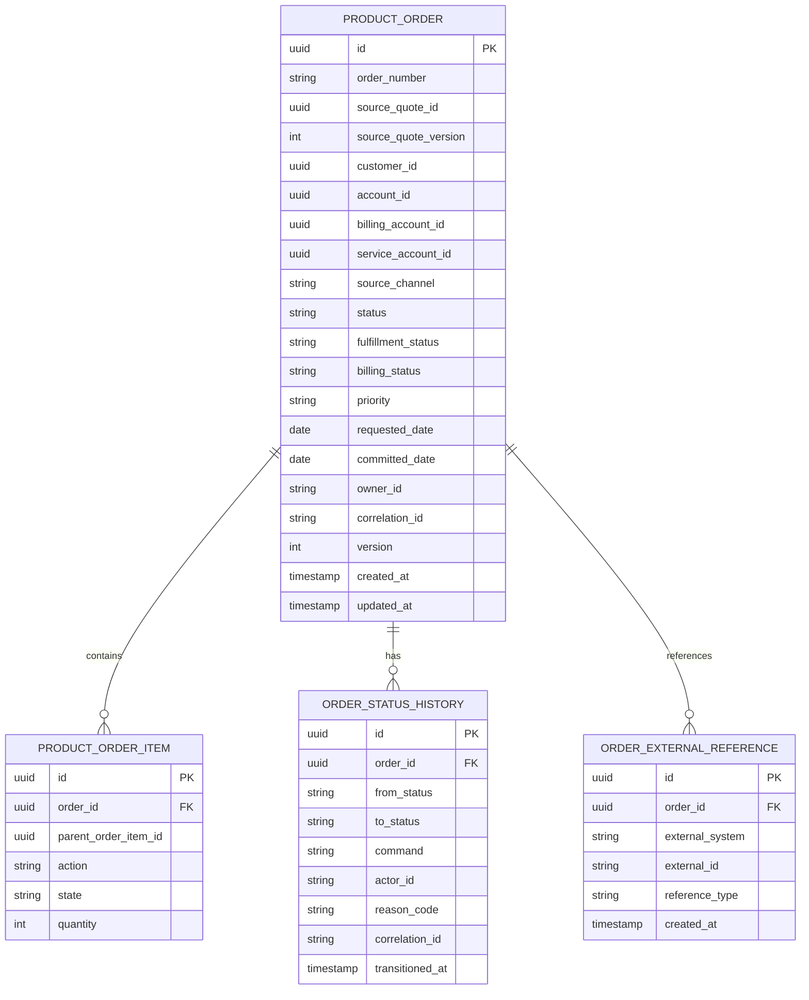
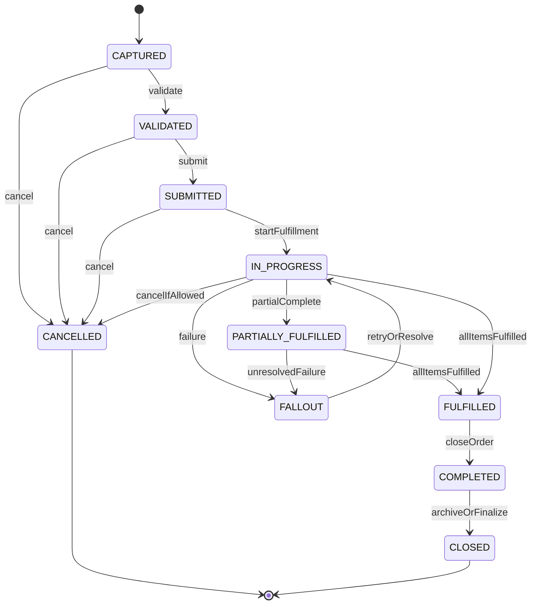
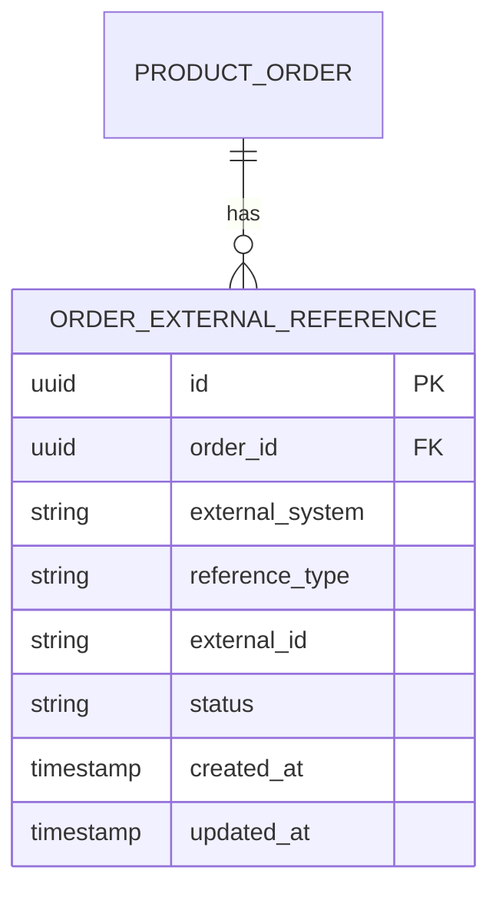

# Order Header Model

## 1. Core Idea

Order header adalah **container eksekusi** untuk commercial commitment yang sudah diterima, dibuat dari quote, order capture, API integration, CRM, atau channel lain.

Quote menjawab:

> Apa yang disetujui secara commercial?

Order menjawab:

> Apa yang harus dieksekusi, dipenuhi, diaktifkan, ditagihkan, dipantau, dan direkonsiliasi?

Order header bukan hanya record administratif. Dalam enterprise CPQ / Order Management / Quote-to-Cash, order header menjadi anchor untuk:

- order identity,
- source quote traceability,
- customer/account context,
- channel and ownership,
- requested/committed dates,
- lifecycle state,
- fulfillment summary,
- billing readiness,
- priority/escalation,
- audit trail,
- external system correlation,
- reporting and operational dashboards.

Mental model:

> Order header is the executable business transaction envelope that coordinates order items, fulfillment, billing, audit, and integration state.

---

## 2. Why Order Header Exists

Order header ada karena order item saja tidak cukup untuk mengelola business transaction end-to-end.

Tanpa order header yang kuat, sistem akan kesulitan menjawab:

- order ini berasal dari quote mana?
- customer/account/billing account mana yang bertanggung jawab?
- order ini dibuat dari channel apa?
- order ini sedang berada di lifecycle state apa?
- apakah semua order item sudah validated?
- apakah fulfillment sudah selesai?
- apakah billing boleh diaktifkan?
- siapa owner operational order ini?
- apakah order ini urgent?
- kapan customer meminta layanan aktif?
- kapan system berkomitmen menyelesaikan order?
- apakah order ini stuck, failed, cancelled, amended, atau completed?
- event apa saja yang sudah diterbitkan?
- external system mana yang sudah menerima order ini?
- apakah ada reconciliation mismatch?

Order header adalah titik koordinasi untuk keseluruhan order.

---

## 3. Order Header vs Quote Header

Quote header dan order header terlihat mirip, tetapi maknanya berbeda.

| Aspect | Quote Header | Order Header |
|---|---|---|
| Nature | Commercial proposal | Execution transaction |
| Mutability | Bisa berubah sampai accepted | Lebih ketat setelah submitted/in progress |
| Main question | Apa yang ditawarkan? | Apa yang harus dieksekusi? |
| Price | Proposed/accepted commercial price | Execution/billing reference price |
| Lifecycle | Draft, priced, approved, accepted, converted | Captured, validated, submitted, in progress, completed |
| Evidence | Approval and customer acceptance | Fulfillment, activation, billing trigger |
| Relationship | Source for order | Result of quote or direct order capture |
| Failure mode | Price/approval/config mismatch | Fulfillment/billing/order state mismatch |

Jangan memodelkan order sebagai “quote dengan status berbeda”. Order memiliki lifecycle, failure mode, dan ownership yang berbeda.

---

## 4. Core Fields

Field order header umum:

| Field | Purpose |
|---|---|
| `id` | Internal stable primary key. |
| `order_number` | Human-readable business identifier. |
| `source_quote_id` | Trace ke quote asal jika order dibuat dari quote. |
| `source_quote_version` | Trace accepted quote version. |
| `source_channel` | Sales portal, API, CRM, migration, batch, partner, etc. |
| `customer_id` | Customer commercial context. |
| `account_id` | Account context. |
| `billing_account_id` | Billing responsibility. |
| `service_account_id` | Optional service ownership context. |
| `status` | Current order lifecycle state. |
| `fulfillment_status` | Summary fulfillment state. |
| `billing_status` | Summary billing readiness/activation state. |
| `priority` | Operational priority. |
| `requested_date` | Customer/requested effective date. |
| `committed_date` | Date committed by system/business. |
| `owner_id` | Operational/sales owner. |
| `tenant_id` | Multi-tenant boundary if applicable. |
| `correlation_id` | Traceability across API/event/workflow. |
| `created_at` / `updated_at` | Technical timestamps. |

Actual internal fields must be verified. The conceptual rule is:

> Order header must carry enough context to understand, execute, audit, and reconcile the order without relying on fragile cross-service joins.

---

## 5. Conceptual ERD



This is conceptual, not an instruction to copy schema blindly.

---

## 6. Order Identity

Order needs multiple identifiers.

| Identifier | Purpose |
|---|---|
| Internal ID | Stable database identity, usually UUID/sequence. |
| Order number | Human-facing and business-facing reference. |
| External order ID | ID from CRM/partner/downstream system. |
| Source quote ID/version | Trace to accepted quote. |
| Correlation ID | Trace request/event/log/workflow. |
| Idempotency key | Prevent duplicate order creation. |

Bad pattern:

```text
order_number as primary key everywhere
```

Why risky:

- business format can change,
- external systems may impose different keys,
- manual order numbers can collide,
- order number may be generated later,
- internal joins need stable key.

Recommended pattern:

- internal `id` for persistence,
- immutable `order_number` for business reference,
- external references in separate table,
- source quote mapping as explicit fields,
- idempotency key stored for create command.

---

## 7. Source Quote Traceability

For quote-originated order, traceability is mandatory.

Minimum fields:

```text
source_quote_id
source_quote_number
source_quote_version
source_quote_accepted_at
source_quote_conversion_id
```

Why both ID and number?

- ID supports system lookup.
- Number supports support/debugging/reporting.
- Version prevents ambiguity.
- Conversion ID links to conversion audit.
- Accepted timestamp supports lifecycle reporting.

Important invariant:

```text
If order.source_quote_id is not null, then order.source_quote_version must reference the accepted quote version used for conversion.
```

In microservices, this may be a logical invariant rather than a database FK.

---

## 8. Customer, Account, Billing Account, Service Account

Order header must not collapse all parties/accounts into one field.

Common roles:

| Role | Meaning |
|---|---|
| Customer | Commercial customer buying/owning relationship. |
| Account | Account context under customer. |
| Billing account | Entity/account responsible for invoice. |
| Service account | Entity/account receiving service. |
| Contracting party | Legal party under agreement. |
| Related party | Contact, buyer, approver, partner, sales rep. |

Bad model:

```text
order.customer_id only
```

This is insufficient for enterprise B2B/telco because one customer can have:

- multiple billing accounts,
- multiple service accounts,
- multiple sites,
- multiple contracts,
- multiple legal entities,
- different buyer and payer,
- different installation and billing addresses.

Order header should capture the minimum account context needed by fulfillment and billing.

---

## 9. Source Channel

`source_channel` is not cosmetic. It impacts:

- validation rules,
- allowed order types,
- audit expectation,
- external reference requirement,
- SLA,
- reporting,
- fraud/risk checks,
- escalation path,
- data ownership.

Examples:

- `SALES_PORTAL`
- `CRM`
- `PARTNER_API`
- `BATCH_MIGRATION`
- `CUSTOMER_PORTAL`
- `BACKOFFICE`
- `SYSTEM_RETRY`
- `MANUAL_REPAIR`

Internal enum values must be verified.

Potential invariant:

```text
Partner API orders must have external reference and idempotency key.
Migration orders must have migration batch reference.
Manual repair orders must have reason and approval/audit evidence.
```

---

## 10. Requested Date vs Committed Date

These dates are often confused.

| Field | Meaning |
|---|---|
| `requested_date` | When customer/business wants the order effective or completed. |
| `committed_date` | Date the provider/system commits to after validation/capacity. |
| `submitted_at` | When order was formally submitted. |
| `completed_at` | When order reached completed state. |
| `activated_at` | When service/product was activated. |
| `billing_start_date` | When billing should start. |

Do not overload one field for all of these.

Example failure:

```text
Billing starts from requested_date even though fulfillment completed later.
```

This can cause incorrect invoice.

Better:

- requested date drives planning,
- committed date drives SLA,
- activation date drives product inventory,
- billing start date drives billing,
- each transition writes evidence.

---

## 11. Order Status vs Fulfillment Status vs Billing Status

One `status` field is not always enough.

Order header may need summary states:

| State dimension | Example |
|---|---|
| Order lifecycle status | `CAPTURED`, `VALIDATED`, `SUBMITTED`, `IN_PROGRESS`, `COMPLETED`, `CANCELLED`. |
| Fulfillment status | `NOT_STARTED`, `PENDING`, `IN_PROGRESS`, `PARTIAL`, `FULFILLED`, `FALLOUT`. |
| Billing status | `NOT_READY`, `READY`, `ACTIVATED`, `FAILED`, `RECONCILED`. |
| Integration status | `PENDING_SEND`, `SENT`, `ACKED`, `FAILED`. |

Avoid mixing them into one mega-status unless the state machine is explicitly designed.

Bad pattern:

```text
order.status = BILLING_FAILED
```

This hides whether order fulfillment completed, whether billing retry is possible, and whether order itself is terminal.

Better:

```text
order.status = COMPLETED
order.fulfillment_status = FULFILLED
order.billing_status = BILLING_FAILED
```

or domain-specific equivalent.

---

## 12. Order Header Lifecycle

Conceptual lifecycle:



Actual internal states may differ. What matters:

- state meaning must be explicit,
- transition command must be controlled,
- item states must aggregate correctly,
- terminal states must be protected,
- fallout/retry path must be auditable.

---

## 13. Header State Derived from Item State

Order header state may be:

1. explicitly stored,
2. derived from item states,
3. hybrid: stored with validation against item states.

For large systems, hybrid is common.

Examples:

```text
Header COMPLETED requires all mandatory order items terminal-success.
Header PARTIALLY_FULFILLED requires at least one item fulfilled and at least one item not terminal-success.
Header FALLOUT requires at least one blocking item in fallout.
```

Potential pitfalls:

- header says `COMPLETED`, but item still `IN_PROGRESS`,
- item says `FULFILLED`, but header stuck `IN_PROGRESS`,
- header says `CANCELLED`, but downstream fulfillment continues,
- item fallout not reflected in header dashboard,
- billing activated before mandatory item completion.

Use reconciliation queries to detect mismatch.

---

## 14. Priority and Escalation

`priority` can be operationally meaningful.

Examples:

- standard,
- expedited,
- executive escalation,
- regulatory deadline,
- customer-critical,
- outage recovery,
- manual repair.

Priority should not be an uncontrolled text field if it affects processing order.

Model considerations:

- who can set priority,
- when priority can change,
- whether priority changes are audited,
- whether priority affects fulfillment queue,
- whether SLA derives from priority,
- whether reporting groups by priority,
- whether abuse/misclassification matters.

Potential invariant:

```text
Priority escalation requires actor authority and reason.
```

---

## 15. Ownership

Order owner can mean different things:

- sales owner,
- order manager,
- fulfillment owner,
- support owner,
- customer success owner,
- system owner,
- service owner.

Avoid one ambiguous `owner_id` unless the meaning is clear.

Possible model:

```text
sales_owner_id
order_owner_id
fulfillment_owner_group
support_owner_group
created_by
last_updated_by
```

Or use related party model:

```text
order_related_party
- order_id
- party_id/user_id/group_id
- role
- valid_from
- valid_to
```

For enterprise systems, role-based related party is often more extensible.

---

## 16. External References

Orders often interact with many external systems.

Examples:

- CRM opportunity/order ID,
- CPQ quote ID,
- billing order ID,
- provisioning order ID,
- service order ID,
- partner order ID,
- ticket/incident ID,
- workflow process instance ID,
- migration batch ID.

Model external references separately:



Do not add endless nullable columns to order header for every external system unless there is a stable, high-value reason.

---

## 17. Auditability

Order header audit should answer:

- who created the order,
- from what quote/source/channel,
- what version of quote,
- when it was submitted,
- who changed priority/status/date,
- why cancellation/amendment happened,
- which system updated fulfillment/billing state,
- what external reference was created,
- which correlation ID links events/logs/workflow,
- whether the order was manually repaired.

Audit model:

```text
order_status_history
order_change_history
order_external_reference_history
order_integration_attempt
order_audit_event
```

At minimum, status history should not be lost.

---

## 18. Event Model

Order header events:

- `ProductOrderCreated`
- `ProductOrderValidated`
- `ProductOrderSubmitted`
- `ProductOrderFulfillmentStarted`
- `ProductOrderPartiallyFulfilled`
- `ProductOrderFulfilled`
- `ProductOrderCompleted`
- `ProductOrderCancelled`
- `ProductOrderFalloutRaised`
- `ProductOrderBillingReady`
- `ProductOrderBillingActivated`

Event payload should include:

```json
{
  "eventId": "uuid",
  "eventType": "ProductOrderCreated",
  "eventVersion": 1,
  "occurredAt": "2026-07-12T10:00:00Z",
  "aggregateId": "order-id",
  "orderNumber": "O-10001",
  "sourceQuoteId": "quote-id",
  "sourceQuoteVersion": 4,
  "customerId": "customer-id",
  "accountId": "account-id",
  "billingAccountId": "billing-account-id",
  "status": "CAPTURED",
  "correlationId": "corr-123",
  "tenantId": "tenant-id"
}
```

Events should be stable external/integration contracts, not database row dumps.

---

## 19. PostgreSQL Physical Design

Conceptual table:

```sql
create table product_order (
  id uuid primary key,
  order_number text not null unique,
  source_quote_id uuid,
  source_quote_number text,
  source_quote_version integer,
  source_quote_conversion_id uuid,
  customer_id uuid not null,
  account_id uuid,
  billing_account_id uuid,
  service_account_id uuid,
  source_channel text not null,
  status text not null,
  fulfillment_status text,
  billing_status text,
  priority text,
  requested_date date,
  committed_date date,
  submitted_at timestamptz,
  completed_at timestamptz,
  cancelled_at timestamptz,
  owner_id text,
  tenant_id uuid,
  correlation_id text,
  idempotency_key text,
  version integer not null default 0,
  created_by text,
  updated_by text,
  created_at timestamptz not null,
  updated_at timestamptz not null
);
```

Potential constraints:

```sql
alter table product_order
add constraint chk_order_dates
check (
  committed_date is null
  or requested_date is null
  or committed_date >= requested_date
);
```

Be careful: this date constraint may not always be valid in every business. Sometimes committed date can be earlier than requested date if provider can deliver earlier. Verify internally.

Useful indexes:

```sql
create index idx_product_order_customer_status
on product_order (customer_id, status, updated_at desc);

create index idx_product_order_account_status
on product_order (account_id, status, updated_at desc);

create index idx_product_order_billing_status
on product_order (billing_status, updated_at desc);

create index idx_product_order_fulfillment_status
on product_order (fulfillment_status, updated_at desc);

create index idx_product_order_source_quote
on product_order (source_quote_id, source_quote_version);

create unique index uq_product_order_idempotency
on product_order (idempotency_key)
where idempotency_key is not null;
```

---

## 20. Java/JAX-RS Implications

Order header should be manipulated through commands, not generic update.

Example commands:

```http
POST /orders
POST /orders/{id}/submit
POST /orders/{id}/cancel
POST /orders/{id}/amend
POST /orders/{id}/start-fulfillment
POST /orders/{id}/mark-billing-ready
```

Avoid:

```http
PATCH /orders/{id}
{
  "status": "COMPLETED"
}
```

Unless the API is strictly internal and still routes to command validation.

Service structure:

```text
OrderResource
  -> OrderCommandService
      -> OrderRepository
      -> OrderTransitionPolicy
      -> OrderInvariantChecker
      -> OrderItemRepository
      -> OutboxRepository
      -> AuditRepository
```

Order header changes must enforce:

- lifecycle transition rules,
- item-state aggregation,
- billing readiness guard,
- fulfillment status guard,
- authorization,
- audit history,
- optimistic locking.

---

## 21. MyBatis/JPA/JDBC Implications

### MyBatis

Good for explicit order dashboard and queue queries:

- order by customer/status,
- fulfillment queue,
- billing-ready queue,
- stuck order query,
- source quote lookup,
- order header with item summary.

Ensure mapper methods do not allow unsafe status mutation.

### JPA

Useful for aggregate modelling, but watch:

- lazy loading of large order item trees,
- accidental dirty updates,
- cascade operations that hide item creation,
- optimistic locking,
- enum migration.

### JDBC

Useful when order creation/conversion requires explicit transaction and batch insert of items.

Whichever data access style is used:

> Order lifecycle transition must be centralized in application/domain service.

---

## 22. Reporting Impact

Order header drives operational reporting:

- orders by status,
- order aging,
- order backlog,
- order fallout count,
- order completion rate,
- order cycle time,
- quote-to-order conversion rate,
- fulfillment SLA,
- billing readiness lag,
- orders by channel,
- orders by customer/account,
- orders by product family,
- cancelled/amended order rate.

Reporting semantic must define:

- current status vs transition history,
- header status vs item status,
- order created date vs submitted date,
- completed date vs fulfilled date,
- billing-ready date vs billing-activated date,
- cancelled before or after fulfillment start.

---

## 23. Data Quality Checks

Example diagnostic queries:

```sql
-- Order completed but has non-terminal items
select o.id, o.order_number, o.status
from product_order o
where o.status = 'COMPLETED'
  and exists (
    select 1
    from product_order_item i
    where i.order_id = o.id
      and i.state not in ('FULFILLED', 'CANCELLED', 'NOT_APPLICABLE')
  );

-- Order from quote but missing source quote version
select id, order_number, source_quote_id, source_quote_version
from product_order
where source_quote_id is not null
  and source_quote_version is null;

-- Order billing activated before fulfillment completed
select id, order_number, status, fulfillment_status, billing_status
from product_order
where billing_status = 'ACTIVATED'
  and fulfillment_status not in ('FULFILLED', 'PARTIALLY_FULFILLED');
```

The exact values depend on internal enum semantics.

---

## 24. Failure Modes

| Failure mode | Symptom | Likely cause | Prevention |
|---|---|---|---|
| Order without source trace | Cannot trace to quote/customer acceptance | Missing conversion mapping | Store source quote/version/conversion ID |
| Duplicate order | Same quote/order request creates multiple orders | Missing idempotency | Unique idempotency key |
| Header completed but item open | Dashboard says completed but fulfillment still running | Weak aggregation logic | Item-header invariant/reconciliation |
| Wrong billing account | Invoice to wrong account | Collapsed account model | Explicit billing account mapping |
| Billing starts too early | Invoice before activation | Confused requested/billing date | Separate billing start date |
| Stuck order | Order remains in progress forever | No aging monitor/fallout handling | Status aging observability |
| External ID overwritten | Lost trace to downstream system | Single nullable external ID field | External reference table |
| Manual status patch | Audit gap and invalid lifecycle | Generic update endpoint | Command-driven transitions |
| Reporting mismatch | KPI differs across teams | Ambiguous order date/status | Define semantic data dictionary |

---

## 25. PR Review Checklist

When reviewing order header changes, ask:

- What is the order source?
- Is source quote/version preserved?
- Is idempotency handled?
- Are customer/account/billing account roles explicit?
- What lifecycle status is being introduced or changed?
- Is fulfillment status separate from order status?
- Is billing status separate from order status?
- What command changes the status?
- Is transition history written?
- Is optimistic locking used?
- Are external references modelled cleanly?
- Does this change affect reporting?
- Does this change affect billing readiness?
- Does this change affect order item aggregation?
- Does this change require migration/backfill?
- Are new nullable fields truly optional or missing required data?
- Are indexes aligned with query patterns?
- Are events updated/versioned?
- Are sensitive fields protected in logs/events?

---

## 26. Internal Verification Checklist

Verify these in the internal CSG/team context:

- Actual order header table/entity names.
- Actual order status enum and lifecycle diagram.
- Whether order status, fulfillment status, billing status are separate.
- Whether order header stores source quote ID and quote version.
- Whether quote-order conversion ID exists.
- Whether order number generation is centralized.
- Whether idempotency key exists for order creation.
- Whether order creation can happen without quote.
- Whether source channel is stored and used.
- Whether billing account/service account/customer/account are distinct.
- Whether requested date, committed date, activation date, billing start date are distinct.
- Whether order owner means sales owner, fulfillment owner, or operational owner.
- Whether external references are stored in a separate table.
- Whether order header transition history exists.
- Whether lifecycle transition is command-driven.
- Whether unsafe generic status updates exist.
- Whether order status is derived from item status or stored independently.
- Whether stuck order dashboard exists.
- Whether order events are outbox-backed.
- Whether MyBatis/JPA/JDBC layer can bypass lifecycle service.
- Whether incident notes mention order status mismatch, duplicate order, wrong billing account, or missing source quote.

---

## 27. Summary

Order header is the coordination anchor for execution.

A strong order header model must preserve:

- identity,
- source quote traceability,
- customer/account/billing responsibility,
- lifecycle state,
- fulfillment summary,
- billing readiness,
- ownership,
- requested/committed dates,
- external references,
- audit history,
- idempotency,
- reporting semantics,
- operational observability.

The key principle:

> Do not treat order header as a passive container. Treat it as the execution envelope that protects quote-to-cash correctness from order creation through fulfillment, billing, and closure.
