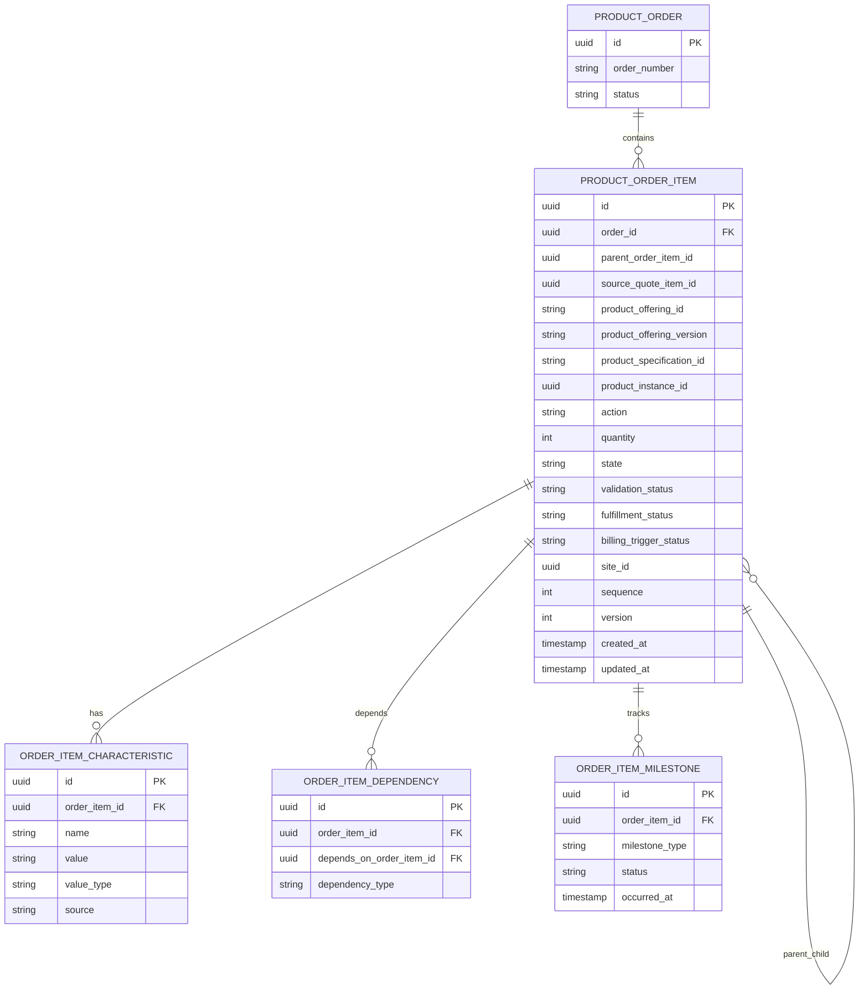
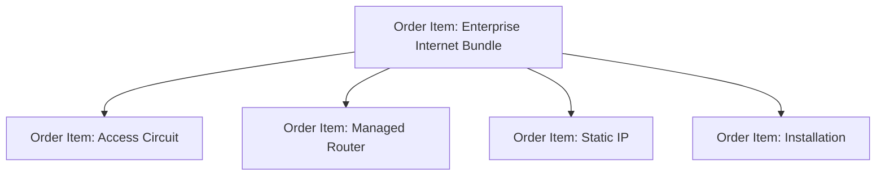
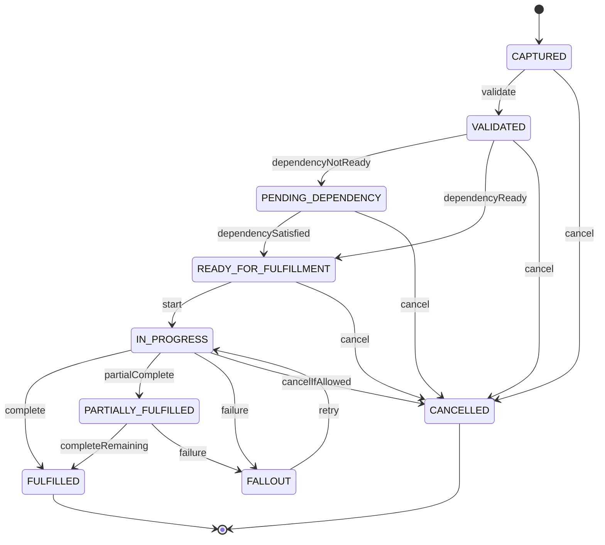
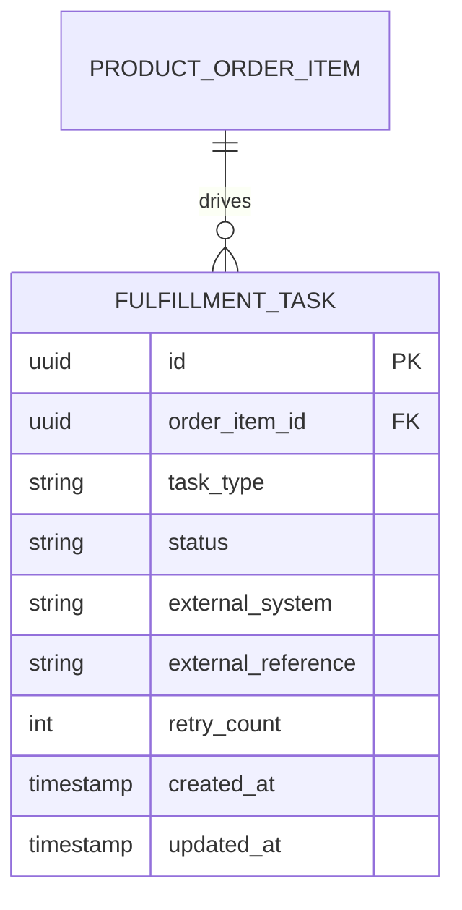

# Order Item Model

## 1. Core Idea

Order item adalah **unit eksekusi** dalam product order.

Jika order header adalah envelope, maka order item adalah daftar pekerjaan dan perubahan yang harus dilakukan terhadap product/customer/service world.

Order item menjawab:

> Item apa yang harus ditambahkan, dimodifikasi, dihentikan, dipindahkan, disuspend, diresume, dipenuhi, atau ditagihkan?

Dalam CPQ / Order Management / Telco BSS/OSS, order item biasanya membawa:

- product offering/reference,
- product specification,
- action,
- quantity,
- configuration/characteristic,
- parent-child hierarchy,
- site/location,
- dependency,
- item state,
- milestone,
- fulfillment task reference,
- billing trigger,
- source quote item mapping,
- product inventory reference,
- service/resource decomposition reference.

Mental model:

> Order item is the executable line-level instruction derived from accepted commercial intent and used to drive fulfillment, inventory, and billing.

---

## 2. Why Order Item Exists

Order item ada karena order header terlalu kasar untuk menjalankan fulfillment dan billing.

Contoh satu order:

```text
Customer buys "Enterprise Internet Bundle"
- Access Circuit
- Managed Router
- Static IP Add-on
- Installation Service
- SLA Package
```

Order header hanya mengatakan:

```text
Order O-10001 for Customer A is in progress.
```

Order item menjawab detail:

- access circuit harus disediakan,
- router harus dikirim,
- static IP harus dialokasikan,
- installation harus dijadwalkan,
- SLA package harus diaktifkan,
- billing recurring charge mulai setelah activation,
- managed router bergantung pada access circuit,
- static IP bergantung pada access service,
- installation item bisa memiliki work order,
- each item can fail independently.

Tanpa order item model yang kuat, sistem tidak bisa menangani partial fulfillment, fallout, dependency, billing trigger, amend, cancel, dan reconciliation dengan benar.

---

## 3. Order Item vs Quote Item

Quote item dan order item berhubungan, tetapi tidak sama.

| Aspect | Quote Item | Order Item |
|---|---|---|
| Purpose | Commercial line/proposal | Execution line/instruction |
| State | Configuration/pricing/validation state | Fulfillment/order item state |
| Price | Proposed/accepted price | Billing/execution charge reference |
| Product ref | Product offering/configuration | Product offering/spec/product instance target |
| Action | Proposed action | Executable action |
| Relationship | Commercial bundle/option hierarchy | Fulfillment/dependency hierarchy |
| Failure | Invalid configuration/price/approval | Fallout/provisioning/billing failure |
| Mutability | Mutable until accepted/revision | Controlled after submitted/in progress |

Do not reuse quote item entity as order item entity. They have different lifecycle and invariant.

---

## 4. Core Fields

Common order item fields:

| Field | Purpose |
|---|---|
| `id` | Internal order item identity. |
| `order_id` | Parent order header. |
| `parent_order_item_id` | Bundle/component hierarchy. |
| `source_quote_item_id` | Trace to accepted quote line. |
| `product_offering_id` | Commercial offering reference. |
| `product_offering_version` | Catalog version correctness. |
| `product_specification_id` | Product spec reference. |
| `product_instance_id` | Existing product target for modify/disconnect/etc. |
| `action` | Add, modify, disconnect, suspend, resume, etc. |
| `quantity` | Quantity to execute. |
| `state` | Item lifecycle state. |
| `validation_status` | Item validation state. |
| `fulfillment_status` | Fulfillment progress. |
| `billing_trigger_status` | Billing readiness/trigger state. |
| `site_id` / `location_id` | Execution location. |
| `requested_date` | Item-level requested date. |
| `completion_date` | Item-level completion date. |
| `sequence` | Display/execution ordering. |
| `version` | Optimistic locking. |

Actual internal model may use different names. The core concept is stable.

---

## 5. Conceptual ERD



---

## 6. Parent-Child Hierarchy

Order item hierarchy represents bundle/component structure and sometimes execution decomposition.

Example:



Hierarchy concerns:

- parent item may not be directly fulfilled,
- child item may have separate fulfillment task,
- parent completion may depend on child completion,
- billing can be parent-level, child-level, or mixed,
- cancellation/amendment may cascade,
- quote bundle hierarchy should map cleanly to order hierarchy,
- reporting must avoid double-counting parent and child prices.

Potential invariant:

```text
A parent bundle item cannot be completed until all mandatory child order items are terminal-success or terminal-not-applicable.
```

---

## 7. Source Quote Item Mapping

Each order item created from quote should preserve `source_quote_item_id`.

But sometimes mapping is not one-to-one.

Cases:

| Conversion | Example |
|---|---|
| One quote item -> one order item | Simple product line. |
| One quote item -> many order items | Bundle decomposed into multiple executable items. |
| Many quote items -> one order item | Consolidated shipment/provisioning item. |
| Quote item -> no order item | Informational or non-orderable line. |
| System-generated order item | Required technical item not visible in quote. |

Therefore, separate mapping table may be needed:

```text
quote_order_item_mapping
- conversion_id
- quote_item_id
- order_item_id
- mapping_type
```

Do not rely only on nullable `source_quote_item_id` if mapping can be many-to-many.

---

## 8. Product Offering, Product Specification, Product Instance

Order item may reference different product concepts.

| Reference | Meaning |
|---|---|
| Product offering | What was commercially sold. |
| Product offering version | Which catalog version was accepted. |
| Product specification | What product structure/attributes define the item. |
| Product instance | Existing installed product affected by action. |
| Product inventory reference | Created/updated product instance after fulfillment. |

For `ADD`, product instance may not exist yet.

For `MODIFY`, `DISCONNECT`, `SUSPEND`, or `RESUME`, product instance should normally exist.

Example invariant:

```text
Order item with action MODIFY/DISCONNECT/SUSPEND/RESUME must reference an existing product instance unless it is part of a migration/repair exception.
```

---

## 9. Order Item Action

Action defines what the item does.

Common actions:

- `ADD`
- `MODIFY`
- `DISCONNECT`
- `SUSPEND`
- `RESUME`
- `CANCEL`
- `AMEND`
- `MOVE`
- `CHANGE_PLAN`
- `UPGRADE`
- `DOWNGRADE`
- `CHANGE_OWNER`

Action is not just text. It controls:

- validation,
- required references,
- inventory impact,
- billing impact,
- fulfillment path,
- allowed state transitions,
- decomposition rule,
- compatibility with current product state.

Example:

| Action | Required data |
|---|---|
| `ADD` | Product offering/spec, configuration, site, billing account. |
| `MODIFY` | Existing product instance, delta configuration. |
| `DISCONNECT` | Existing active product instance, disconnect date/reason. |
| `SUSPEND` | Active product instance, suspension reason. |
| `RESUME` | Suspended product instance. |
| `MOVE` | Existing product instance, old site, new site. |
| `CHANGE_PLAN` | Existing product instance, target offering/spec. |

---

## 10. Quantity

Quantity looks simple but is often dangerous.

Questions:

- Is quantity allowed for this offering?
- Does quantity create multiple instances or one instance with quantity?
- Does quantity multiply recurring charges?
- Does quantity affect provisioning?
- Does quantity affect inventory records?
- Can quantity be changed after submission?
- Does quantity need per-site allocation?
- Does quantity apply to parent bundle or child component?

Examples:

```text
10 SIM cards -> likely 10 product/resource instances.
10 licenses -> may be one subscription with quantity 10.
10 Mbps -> not quantity; it may be a characteristic value.
```

Do not model all numeric product attributes as quantity.

---

## 11. Site and Location

Order item often needs site/location because fulfillment is location-specific.

Examples:

- installation address,
- service address,
- shipping address,
- billing address,
- site ID,
- geographic coverage area,
- network location,
- customer premise.

For multi-site order:

```text
Order header = customer-wide order
Order item = site-specific execution line
```

Potential invariant:

```text
Serviceable product order item must have valid service site or installation address.
```

Also consider site-specific pricing and eligibility. The site used in quote must be traceable in order.

---

## 12. Item State

Order item state should represent line-level execution.

Conceptual states:

| State | Meaning |
|---|---|
| `CAPTURED` | Item created but not fully validated. |
| `VALIDATED` | Item passed validation. |
| `PENDING_DEPENDENCY` | Waiting for another item. |
| `READY_FOR_FULFILLMENT` | Can be sent/executed. |
| `IN_PROGRESS` | Fulfillment started. |
| `FULFILLED` | Item fulfilled successfully. |
| `PARTIALLY_FULFILLED` | Some sub-work completed. |
| `FALLOUT` | Blocking failure. |
| `CANCELLED` | Item cancelled. |
| `NOT_APPLICABLE` | Item intentionally skipped. |
| `FAILED` | Terminal or unresolved failure depending semantics. |

Internal states must be verified. Avoid using item state as arbitrary downstream text.

---

## 13. Item State Machine



Important: item state machine must coordinate with order header state machine.

---

## 14. Dependency Model

Dependencies represent execution order.

Examples:

- router shipment depends on site validation,
- static IP assignment depends on access service,
- billing activation depends on product activation,
- installation depends on equipment availability,
- SLA package depends on base service,
- add-on depends on parent product.

Dependency model:

```text
order_item_dependency
- order_item_id
- depends_on_order_item_id
- dependency_type
- blocking
- condition
- status
```

Dependency types:

- `MUST_COMPLETE_BEFORE`
- `MUST_START_BEFORE`
- `REQUIRES_SUCCESS`
- `REQUIRES_ACTIVATION`
- `BILLING_DEPENDS_ON`
- `FULFILLMENT_DEPENDS_ON`
- `CANCELLATION_DEPENDS_ON`

Potential invariant:

```text
An order item cannot move to READY_FOR_FULFILLMENT while blocking dependencies are not satisfied.
```

---

## 15. Milestone Model

Milestones capture progress within item lifecycle.

Examples:

- validation completed,
- decomposition completed,
- sent to downstream,
- downstream acknowledged,
- provisioning started,
- installation scheduled,
- installation completed,
- activation completed,
- billing ready,
- billing activated.

Milestones are not always states. State is current lifecycle position; milestone is evidence of an event.

```text
order_item_milestone
- order_item_id
- milestone_type
- status
- occurred_at
- source_system
- external_reference
- correlation_id
```

Milestones help debugging:

- item stuck after downstream sent,
- downstream ack missing,
- activation completed but billing not triggered,
- manual intervention happened.

---

## 16. Fulfillment Task Reference

Order item may produce fulfillment tasks.

Examples:

- work order,
- provisioning request,
- service order,
- resource reservation,
- shipment task,
- installation appointment,
- activation task.

Do not stuff all fulfillment data into order item if fulfillment has its own lifecycle.

Better:

```text
order_item -> fulfillment_task reference(s)
fulfillment_task -> external provisioning/work order references
```

Potential relationship:



---

## 17. Billing Trigger

Order item is often the source of billing readiness.

Billing trigger can be:

- item fulfilled,
- product instance activated,
- service activated,
- installation completed,
- customer acceptance complete,
- billing milestone received,
- manual billing approval,
- effective date reached.

Do not assume billing starts when order is created.

Model options:

| Strategy | Description |
|---|---|
| Billing flag on item | Simple but limited. |
| Billing trigger table | Better for traceability. |
| Billing event | Good for event-driven billing integration. |
| Billing instruction object | Useful for complex charge schedules. |

Example:

```text
order_item_billing_trigger
- order_item_id
- trigger_type
- trigger_status
- billing_account_id
- charge_reference
- effective_date
- triggered_at
- event_id
```

Potential invariant:

```text
Recurring charge billing cannot be triggered before product/service activation unless explicitly allowed by commercial policy.
```

---

## 18. Characteristics and Configuration

Order item should carry accepted configuration needed for fulfillment.

Examples:

- bandwidth,
- device model,
- contract term,
- service address,
- IP allocation,
- installation option,
- redundancy option,
- SLA tier,
- feature flags.

Options:

| Storage | Trade-off |
|---|---|
| Relational characteristic table | Queryable, validated, more schema work. |
| JSONB snapshot | Flexible, less queryable unless indexed carefully. |
| Both | Snapshot for audit, extracted fields for operations. |

Common pattern:

```text
order_item_characteristic
- name
- value
- value_type
- source
- characteristic_spec_id
- product_specification_version
```

Avoid relying only on current catalog characteristic definitions. The order item must preserve accepted characteristic values.

---

## 19. Validation Status

Validation can be separate from item state.

Examples:

- configuration validation,
- product eligibility,
- serviceability,
- inventory availability,
- account/billing validation,
- action validity,
- dependency validation,
- pricing/billing validation.

Model:

```text
order_item_validation_result
- order_item_id
- validation_type
- status
- error_code
- message
- source_system
- evaluated_at
```

Why separate?

- one item can have multiple validation checks,
- validation can be re-run,
- validation result is useful for audit,
- validation failure may not equal item failure yet.

---

## 20. Inventory Impact

Order item should indicate intended effect on product inventory.

| Action | Inventory effect |
|---|---|
| `ADD` | Create product instance after fulfillment. |
| `MODIFY` | Update existing product instance/characteristics. |
| `DISCONNECT` | Terminate product instance. |
| `SUSPEND` | Change product status to suspended. |
| `RESUME` | Change product status back to active. |
| `MOVE` | Change service/site relationship. |
| `CHANGE_PLAN` | Supersede or modify product instance. |

Order item may reference:

- target product instance,
- resulting product instance,
- previous product instance,
- superseded product instance,
- inventory update event.

Potential model:

```text
order_item_inventory_effect
- order_item_id
- effect_type
- target_product_instance_id
- resulting_product_instance_id
- effective_date
- status
```

---

## 21. PostgreSQL Physical Design

Conceptual table:

```sql
create table product_order_item (
  id uuid primary key,
  order_id uuid not null references product_order(id),
  parent_order_item_id uuid references product_order_item(id),
  source_quote_item_id uuid,
  product_offering_id text,
  product_offering_version text,
  product_specification_id text,
  product_specification_version text,
  product_instance_id uuid,
  action text not null,
  quantity numeric(18,4) not null default 1,
  state text not null,
  validation_status text,
  fulfillment_status text,
  billing_trigger_status text,
  site_id uuid,
  location_id uuid,
  requested_date date,
  completion_date timestamptz,
  sequence_no integer,
  version integer not null default 0,
  created_at timestamptz not null,
  updated_at timestamptz not null
);
```

Potential constraints:

```sql
alter table product_order_item
add constraint chk_order_item_quantity_positive
check (quantity > 0);
```

This may need exception if negative quantity is used for correction. Prefer explicit correction model over negative quantity if possible.

Useful indexes:

```sql
create index idx_order_item_order
on product_order_item (order_id, sequence_no);

create index idx_order_item_parent
on product_order_item (parent_order_item_id);

create index idx_order_item_state
on product_order_item (state, updated_at);

create index idx_order_item_fulfillment_status
on product_order_item (fulfillment_status, updated_at);

create index idx_order_item_product_instance
on product_order_item (product_instance_id);

create index idx_order_item_source_quote_item
on product_order_item (source_quote_item_id);
```

---

## 22. Java/JAX-RS Backend Implications

Order item commands should be explicit:

```http
POST /orders/{orderId}/items
POST /orders/{orderId}/items/{itemId}/validate
POST /orders/{orderId}/items/{itemId}/start-fulfillment
POST /orders/{orderId}/items/{itemId}/mark-fulfilled
POST /orders/{orderId}/items/{itemId}/raise-fallout
POST /orders/{orderId}/items/{itemId}/retry
POST /orders/{orderId}/items/{itemId}/cancel
```

Do not expose raw patch for state unless it routes through transition rules.

Application service responsibilities:

- validate item action,
- validate parent-child relationship,
- validate dependencies,
- validate inventory reference,
- validate billing trigger,
- update item state,
- update header aggregate state,
- write item history,
- publish event,
- update/read model projection.

---

## 23. MyBatis/JPA/JDBC Implications

### MyBatis

Useful for:

- batch insert item tree during conversion,
- recursive/hierarchical queries,
- item dashboard queries,
- dependency checks,
- fulfillment queue queries.

Be careful with recursive parent-child relationships. PostgreSQL recursive CTE may be useful, but avoid overusing it in hot paths.

### JPA

Be careful with:

- self-referencing parent-child entity,
- cascading large trees,
- N+1 item characteristic loading,
- accidental mutation of accepted/copied data,
- optimistic locking per item.

### JDBC

Useful for high-volume batch inserts and explicit transaction order.

General rule:

> Treat order item tree creation and update as a controlled domain operation, not a generic persistence mapping exercise.

---

## 24. Event Model

Order item events:

- `OrderItemCreated`
- `OrderItemValidated`
- `OrderItemReadyForFulfillment`
- `OrderItemFulfillmentStarted`
- `OrderItemFulfilled`
- `OrderItemPartiallyFulfilled`
- `OrderItemFalloutRaised`
- `OrderItemCancelled`
- `OrderItemBillingReady`
- `OrderItemBillingTriggered`

Event payload:

```json
{
  "eventId": "uuid",
  "eventType": "OrderItemFulfilled",
  "eventVersion": 1,
  "occurredAt": "2026-07-12T10:00:00Z",
  "orderId": "order-id",
  "orderNumber": "O-10001",
  "orderItemId": "order-item-id",
  "parentOrderItemId": "parent-item-id",
  "sourceQuoteItemId": "quote-item-id",
  "productOfferingId": "offering-id",
  "action": "ADD",
  "fromState": "IN_PROGRESS",
  "toState": "FULFILLED",
  "correlationId": "corr-123"
}
```

Do not publish every internal field. Publish stable contract fields.

---

## 25. Reporting Impact

Order item supports:

- fulfillment pipeline,
- item aging,
- product-specific fallout rate,
- dependency bottleneck analysis,
- billing trigger lag,
- item completion rate,
- product family order volume,
- site-level fulfillment status,
- action mix: add/modify/disconnect,
- order decomposition analysis,
- item-level SLA.

Reporting must avoid double counting:

- parent bundle and child components,
- commercial items and technical generated items,
- cancelled/not-applicable items,
- quantity vs instance count,
- one quote item mapped to many order items.

Define whether metrics count:

- order header,
- commercial order item,
- executable order item,
- fulfillment task,
- product instance.

---

## 26. Data Quality Checks

Example queries:

```sql
-- Order items with missing required parent reference consistency
select child.id, child.order_id, child.parent_order_item_id
from product_order_item child
left join product_order_item parent
  on parent.id = child.parent_order_item_id
where child.parent_order_item_id is not null
  and parent.id is null;

-- Items for modify/disconnect without product instance
select id, order_id, action, product_instance_id
from product_order_item
where action in ('MODIFY', 'DISCONNECT', 'SUSPEND', 'RESUME')
  and product_instance_id is null;

-- Items in fulfillment-ready state with unsatisfied dependency
select i.id, i.order_id
from product_order_item i
where i.state = 'READY_FOR_FULFILLMENT'
  and exists (
    select 1
    from order_item_dependency d
    join product_order_item dep on dep.id = d.depends_on_order_item_id
    where d.order_item_id = i.id
      and d.blocking = true
      and dep.state not in ('FULFILLED', 'NOT_APPLICABLE')
  );
```

Actual enum values and table names must be adjusted internally.

---

## 27. Failure Modes

| Failure mode | Symptom | Likely cause | Prevention |
|---|---|---|---|
| Missing order item | Quote line accepted but not fulfilled | Broken conversion mapping | Persist quote-order item mapping |
| Orphan child item | Child item without valid parent | Bad tree creation/migration | FK/self-reference validation |
| Wrong action | Modify treated as add | Poor action derivation | Action compatibility checks |
| Missing product instance | Disconnect cannot execute | Missing inventory reference | Validate action requirements |
| Dependency ignored | Fulfillment starts too early | Dependency not modelled/enforced | Blocking dependency table |
| Header/item mismatch | Header completed while item open | Bad aggregation logic | Reconciliation query |
| Billing trigger early | Billing before activation | Trigger tied to order creation | Explicit billing trigger model |
| Bundle double-counted | Revenue/reporting inflated | Parent and child counted together | Reporting item classification |
| Stale configuration | Fulfillment uses current catalog defaults | Missing accepted characteristic snapshot | Carry order item characteristics |
| Fallout not traceable | Cannot debug provisioning failure | No milestone/task reference | Milestone and fulfillment task model |

---

## 28. PR Review Checklist

When reviewing order item changes, ask:

- Is this a commercial item, executable item, or technical generated item?
- Is source quote item mapping preserved?
- Is parent-child hierarchy correct?
- Does the action require existing product instance?
- Is quantity semantics clear?
- Are site/location requirements enforced?
- Are dependencies modelled?
- Is item state transition controlled?
- Does item state aggregate correctly to order header?
- Are fulfillment tasks referenced?
- Is billing trigger explicit?
- Are characteristics copied from accepted quote snapshot?
- Are catalog/offering/spec versions preserved?
- Are validation results stored or observable?
- Is audit/history written for state changes?
- Are events versioned and outbox-backed?
- Are indexes aligned with fulfillment/billing queries?
- Does reporting avoid double counting?
- Are migration/backfill implications handled?

---

## 29. Internal Verification Checklist

Verify these in the internal CSG/team context:

- Actual order item table/entity names.
- Actual order item state enum.
- Actual order item action enum.
- Whether order item maps one-to-one or many-to-many with quote item.
- Whether quote-order item mapping table exists.
- Whether parent-child order item hierarchy exists.
- Whether bundle parent item is executable or informational.
- Whether system-generated technical items exist.
- Whether product offering/specification versions are stored.
- Whether product instance reference is required for modify/disconnect/suspend/resume.
- Whether item-level site/location is stored.
- Whether order item dependencies are explicitly modelled.
- Whether milestones are stored.
- Whether fulfillment task references are stored.
- Whether billing trigger is item-level or order-level.
- Whether item characteristics are relational, JSONB, or external.
- Whether validation results are persisted.
- Whether order item state updates are command-driven.
- Whether item status history exists.
- Whether item events are published.
- Whether reporting distinguishes parent bundle, child component, and technical generated item.
- Whether known incidents mention orphan order item, wrong action, missing billing trigger, or item/header status mismatch.

---

## 30. Summary

Order item is the executable unit of order management.

A strong order item model must define:

- source quote item traceability,
- product offering/specification/version reference,
- product instance reference for existing products,
- action semantics,
- quantity semantics,
- parent-child hierarchy,
- dependencies,
- item lifecycle state,
- fulfillment task reference,
- billing trigger,
- characteristics/configuration snapshot,
- milestones,
- audit/history,
- event model,
- reporting classification,
- data quality checks.

The key principle:

> Do not treat order item as just a line row. Treat it as a lifecycle-bearing instruction that connects commercial intent to fulfillment, inventory, billing, and operational evidence.
