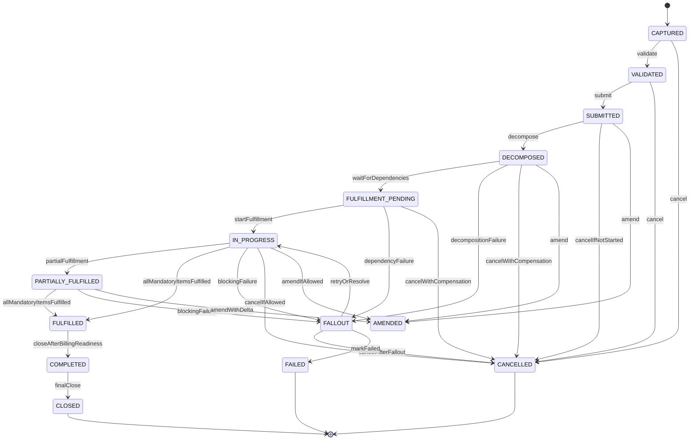
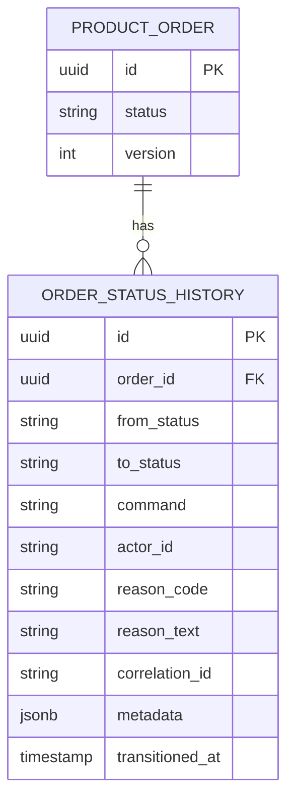

# Order Lifecycle State Machine

## 1. Core Idea

Order lifecycle state machine mengontrol perjalanan order dari captured sampai completed, cancelled, fallout, atau closed.

Order lifecycle bukan hanya `status` pada header. Ia adalah mekanisme correctness yang mengatur:

- command apa yang boleh dilakukan,
- item state apa yang harus terpenuhi,
- kapan fulfillment boleh dimulai,
- kapan order boleh di-submit,
- kapan billing boleh di-trigger,
- kapan cancel masih legal,
- kapan amend harus dibuat sebagai delta,
- kapan fallout harus diangkat,
- kapan order bisa dianggap completed,
- audit evidence apa yang wajib ada,
- event apa yang harus dipublikasikan.

Mental model:

> Order lifecycle is the production control plane for quote-to-cash execution.

---

## 2. Why Order Lifecycle Exists

Order membawa konsekuensi lebih besar daripada quote.

Order dapat:

- membuat product instance,
- mengubah installed base,
- memicu provisioning,
- mengirim work order ke downstream system,
- memulai billing,
- menghentikan billing,
- mengubah inventory,
- memengaruhi SLA,
- menghasilkan invoice,
- memicu dispute jika salah.

Tanpa lifecycle yang jelas, sistem rawan:

- fulfillment mulai sebelum validation selesai,
- billing aktif sebelum service aktif,
- order completed walau item masih failed,
- cancel dilakukan setelah downstream irreversible,
- duplicate retry menghasilkan duplicate product,
- amendment menimpa original order tanpa trace,
- fallout tidak terlihat di dashboard,
- external system status tidak sinkron,
- reporting salah menghitung backlog/completion.

Order lifecycle menjaga eksekusi tetap traceable, recoverable, dan auditable.

---

## 3. Common Order States

State aktual harus diverifikasi internal. Conceptual states:

| State | Meaning |
|---|---|
| `CAPTURED` | Order dibuat tetapi belum fully validated/submitted. |
| `VALIDATED` | Data order lulus validasi awal. |
| `SUBMITTED` | Order formal masuk pipeline eksekusi. |
| `DECOMPOSED` | Order sudah dipecah menjadi fulfillment/service/resource tasks. |
| `FULFILLMENT_PENDING` | Menunggu fulfillment dimulai atau dependency selesai. |
| `IN_PROGRESS` | Fulfillment sedang berjalan. |
| `PARTIALLY_FULFILLED` | Sebagian item selesai, sebagian belum. |
| `FULFILLED` | Semua mandatory item fulfilled. |
| `COMPLETED` | Order closed secara business/operational setelah fulfillment/billing checks. |
| `FAILED` | Failure terminal atau hard failure tergantung semantics. |
| `FALLOUT` | Blocking exception yang butuh retry/manual intervention. |
| `CANCELLED` | Order dibatalkan. |
| `AMENDED` | Order digantikan/dimodifikasi oleh amendment/delta. |
| `CLOSED` | Order finalized/archived setelah no more action. |

Tidak semua organisasi memisahkan `FULFILLED` dan `COMPLETED`. Dalam sistem billing-sensitive, pemisahan ini sering berguna:

- `FULFILLED`: work selesai,
- `COMPLETED`: semua business closure, billing readiness, audit, reconciliation minimum selesai.

---

## 4. Lifecycle Sketch



This is a conceptual lifecycle. Internal implementation may use different states and workflows.

---

## 5. Lifecycle as Command-Driven State Machine

Avoid generic status update:

```http
PATCH /orders/{id}
{
  "status": "COMPLETED"
}
```

Better:

```http
POST /orders/{id}/validate
POST /orders/{id}/submit
POST /orders/{id}/decompose
POST /orders/{id}/start-fulfillment
POST /orders/{id}/raise-fallout
POST /orders/{id}/resolve-fallout
POST /orders/{id}/cancel
POST /orders/{id}/amend
POST /orders/{id}/complete
POST /orders/{id}/close
```

Command-driven lifecycle gives:

- business intent,
- authorization boundary,
- specific guard logic,
- audit reason,
- side-effect control,
- event semantics,
- idempotency handling,
- safer PR review.

---

## 6. Transition Guard Conditions

Examples:

| Transition | Guard |
|---|---|
| `CAPTURED -> VALIDATED` | Required header/item fields present; customer/account valid; item actions valid. |
| `VALIDATED -> SUBMITTED` | No blocking validation errors; idempotency OK; actor/channel allowed. |
| `SUBMITTED -> DECOMPOSED` | Order has executable items; decomposition rule available. |
| `DECOMPOSED -> FULFILLMENT_PENDING` | Fulfillment tasks created; dependencies known. |
| `FULFILLMENT_PENDING -> IN_PROGRESS` | Blocking dependencies satisfied or work can start. |
| `IN_PROGRESS -> PARTIALLY_FULFILLED` | At least one mandatory item fulfilled; not all complete. |
| `IN_PROGRESS -> FULFILLED` | All mandatory items fulfilled. |
| `FULFILLED -> COMPLETED` | Billing readiness checked; no blocking reconciliation issue. |
| `ANY_ACTIVE -> FALLOUT` | Blocking failure raised. |
| `FALLOUT -> IN_PROGRESS` | Fallout resolved or retry accepted. |
| `ANY_ACTIVE -> CANCELLED` | Cancellation legal based on fulfillment progress. |
| `ANY_ACTIVE -> AMENDED` | Amendment allowed and delta order created. |

Guard conditions must not be scattered. Keep them in transition policy or workflow orchestration layer with domain validation.

---

## 7. Header State vs Item State

Order header state should not contradict order item states.

Common aggregation rules:

```text
Header CAPTURED:
  items may be CAPTURED/VALIDATION_PENDING.

Header VALIDATED:
  all mandatory items pass validation.

Header IN_PROGRESS:
  at least one executable item in progress.

Header PARTIALLY_FULFILLED:
  at least one mandatory item fulfilled and at least one mandatory item not fulfilled.

Header FULFILLED:
  all mandatory executable items fulfilled or not applicable.

Header FALLOUT:
  at least one blocking item/task in fallout.

Header COMPLETED:
  fulfilled + billing readiness + closure checks done.
```

Important:

> Header state may be stored, but it should be reconciled against item state.

Data quality check should detect mismatch.

---

## 8. Fulfilled vs Completed

A subtle but important distinction:

| State | Meaning |
|---|---|
| `FULFILLED` | Operational work completed. |
| `COMPLETED` | Business transaction closed after post-fulfillment checks. |

Post-fulfillment checks may include:

- product inventory updated,
- service inventory updated,
- resource inventory reconciled,
- billing trigger emitted,
- billing account valid,
- charge activation acknowledged,
- downstream systems acknowledged,
- audit written,
- no blocking fallout,
- reporting projection updated.

If your internal system does not distinguish these states, still understand the conceptual difference.

Failure mode:

```text
Order marked completed because provisioning succeeded, but billing activation failed.
```

This may require separate `billing_status` even if order status is completed.

---

## 9. Fallout vs Failed

`FALLOUT` and `FAILED` should not be casually merged.

| Concept | Meaning |
|---|---|
| Fallout | Blocking exception that may be resolved by retry/manual intervention. |
| Failed | Terminal or hard failure depending business semantics. |

Example:

```text
Provisioning timeout -> FALLOUT
Invalid product mapping -> FALLOUT or FAILED depending recoverability
Customer cancelled after repeated fallout -> CANCELLED
Irrecoverable downstream rejection -> FAILED
```

Production systems need fallout because many order failures are recoverable.

A fallout state should capture:

- reason code,
- source system,
- failed step,
- retryability,
- manual intervention requirement,
- owner group,
- SLA/aging,
- resolution action,
- audit trail.

---

## 10. Cancel Semantics

Cancellation depends on order progress.

| Stage | Cancellation complexity |
|---|---|
| `CAPTURED` | Simple cancellation. |
| `VALIDATED` | Simple or minor cleanup. |
| `SUBMITTED` | Need stop pipeline. |
| `DECOMPOSED` | Need cancel generated tasks. |
| `IN_PROGRESS` | May require downstream cancel/compensation. |
| `PARTIALLY_FULFILLED` | May require reversal/disconnect/adjustment. |
| `FULFILLED` | Usually no cancel; use disconnect/reversal/correction. |
| `COMPLETED` | Usually no cancel; use new order/action. |

Never assume cancel means delete.

Cancellation should write:

- cancellation reason,
- requested by,
- effective time,
- affected items,
- downstream cancel status,
- compensation actions,
- billing impact,
- audit event.

---

## 11. Amendment Semantics

Amendment modifies an in-flight order.

Do not silently mutate submitted/in-progress order without audit.

Options:

| Approach | Description | Risk |
|---|---|---|
| Direct mutation | Change original order/items | Loses history, hard to audit. |
| Revision | New order revision supersedes previous | Good for traceability, more complex. |
| Delta order | Additional order expresses changes | Strong for in-flight changes. |
| Amendment record | Separate amendment object linked to order | Good if implemented with clear mapping. |

Amendment must define:

- what can be changed,
- at what state,
- which items are affected,
- whether downstream tasks need cancel/recreate,
- whether billing needs adjustment,
- whether approval is required,
- how reporting counts original vs amendment,
- whether original order becomes `AMENDED`.

---

## 12. Decomposition State

Order decomposition transforms product order into executable work.

Decomposition can create:

- service order,
- resource order,
- fulfillment task,
- provisioning request,
- shipping task,
- installation task,
- billing instruction.

State `DECOMPOSED` means:

> The system has derived executable work from order items.

It does not mean fulfillment completed.

Decomposition failure can happen due to:

- missing product mapping,
- invalid catalog version,
- unsupported action,
- missing service spec,
- missing resource rule,
- incompatible configuration,
- downstream routing unavailable.

Decomposition output should be auditable.

---

## 13. Fulfillment Pending and Dependency Wait

`FULFILLMENT_PENDING` is useful when order is valid but cannot start immediately.

Reasons:

- waiting for dependency item,
- waiting for appointment,
- waiting for inventory/resource reservation,
- waiting for external acknowledgement,
- waiting for activation date,
- waiting for manual task,
- waiting for serviceability result.

Do not mark order as failed just because it is waiting. Track pending reason and aging.

---

## 14. Billing Readiness Boundary

Billing should usually not be triggered simply by `SUBMITTED`.

Possible billing readiness conditions:

- mandatory order items fulfilled,
- product inventory created/updated,
- service activation confirmed,
- billing account valid,
- charge snapshot available,
- effective date reached,
- no blocking fallout,
- external billing integration ready.

Possible state design:

```text
order.status = FULFILLED
order.billing_status = READY
```

Then:

```text
order.status = COMPLETED
order.billing_status = ACTIVATED
```

or equivalent.

The important part is explicit semantics.

---

## 15. State History Model

Minimum lifecycle history:



History should capture:

- from/to state,
- command,
- actor/system,
- reason,
- correlation ID,
- source system,
- optional metadata,
- timestamp.

Do not rely only on application logs for state history.

---

## 16. Side Effects by Transition

| Transition | Side effects |
|---|---|
| `CAPTURED -> VALIDATED` | Store validation results. |
| `VALIDATED -> SUBMITTED` | Publish order submitted event; lock mutable fields. |
| `SUBMITTED -> DECOMPOSED` | Create decomposition records/tasks. |
| `DECOMPOSED -> FULFILLMENT_PENDING` | Create dependencies and queues. |
| `FULFILLMENT_PENDING -> IN_PROGRESS` | Send tasks to downstream. |
| `IN_PROGRESS -> FALLOUT` | Create fallout record, alert owner. |
| `FALLOUT -> IN_PROGRESS` | Create retry attempt/resolution audit. |
| `IN_PROGRESS -> FULFILLED` | Update inventory readiness and fulfillment summary. |
| `FULFILLED -> COMPLETED` | Trigger billing/readiness event and closure audit. |
| `ANY -> CANCELLED` | Cancel downstream task, create compensation if needed. |
| `ANY -> AMENDED` | Create amendment/delta record. |

Side effects must be transactional or recoverable through outbox/reconciliation.

---

## 17. Concurrency and Race Conditions

Order lifecycle has many concurrent actors:

- user,
- workflow engine,
- fulfillment worker,
- billing integration,
- downstream event consumer,
- retry job,
- cancellation command,
- amendment command,
- reconciliation job.

Race examples:

- cancel while fulfillment completes,
- billing trigger while order enters fallout,
- retry while manual resolution occurs,
- amend while downstream task is acknowledged,
- item fulfilled while header cancelled,
- duplicate submitted event consumed twice.

Mitigation:

- optimistic locking,
- command idempotency,
- transition compare-and-set,
- item/header reconciliation,
- outbox/inbox pattern,
- per-order event ordering key,
- explicit terminal state protection.

Example update:

```sql
update product_order
set status = :to_status,
    version = version + 1,
    updated_at = now()
where id = :order_id
  and status = :expected_from_status
  and version = :expected_version;
```

---

## 18. PostgreSQL Modelling Considerations

Conceptual transition history:

```sql
create table order_status_history (
  id uuid primary key,
  order_id uuid not null references product_order(id),
  from_status text,
  to_status text not null,
  command text not null,
  actor_id text,
  source_system text,
  reason_code text,
  reason_text text,
  correlation_id text,
  metadata jsonb,
  transitioned_at timestamptz not null
);
```

Transition rule table if rules are partly data-driven:

```sql
create table order_status_transition_rule (
  from_status text not null,
  command text not null,
  to_status text not null,
  requires_reason boolean not null default false,
  requires_authority boolean not null default false,
  active boolean not null default true,
  primary key (from_status, command, to_status)
);
```

Indexes:

```sql
create index idx_order_status_updated
on product_order (status, updated_at);

create index idx_order_fulfillment_status_updated
on product_order (fulfillment_status, updated_at);

create index idx_order_billing_status_updated
on product_order (billing_status, updated_at);

create index idx_order_status_history_order_time
on order_status_history (order_id, transitioned_at desc);
```

---

## 19. Java/JAX-RS Backend Implications

Lifecycle transition should be centralized.

Structure:

```text
OrderResource
  -> OrderLifecycleService
      -> OrderRepository
      -> OrderItemRepository
      -> OrderTransitionPolicy
      -> OrderInvariantChecker
      -> FulfillmentGateway
      -> BillingGateway
      -> OutboxRepository
      -> AuditRepository
```

Pseudo-code:

```java
public Order submitOrder(OrderId orderId, SubmitOrderCommand command) {
    Order order = orderRepository.getForUpdateOrVersionCheck(orderId);

    transitionPolicy.assertAllowed(order.status(), OrderCommand.SUBMIT);
    invariantChecker.assertSubmittable(order);

    order.transitionToSubmitted(command.actor(), command.reason());

    orderRepository.save(order);
    orderStatusHistoryRepository.append(order.lastTransition());
    outboxRepository.append(ProductOrderSubmittedEvent.from(order));

    return order;
}
```

Do not let resource/controller directly set `order.status`.

---

## 20. Workflow/Camunda Implications

If Camunda or workflow engine orchestrates order:

- domain state remains in order tables,
- process state remains in workflow engine,
- workflow task completion calls domain command,
- process variables are not source of truth for order data,
- business key links workflow to order,
- incidents must map to fallout records,
- timers must respect lifecycle guard.

Bad pattern:

```text
Camunda process variable "status" is the only order status.
```

Better:

```text
Camunda orchestrates steps.
Order service owns lifecycle state.
Workflow events/commands transition order through domain service.
```

---

## 21. Event-Driven Implications

Order lifecycle events:

- `ProductOrderCaptured`
- `ProductOrderValidated`
- `ProductOrderSubmitted`
- `ProductOrderDecomposed`
- `ProductOrderFulfillmentPending`
- `ProductOrderInProgress`
- `ProductOrderPartiallyFulfilled`
- `ProductOrderFulfilled`
- `ProductOrderCompleted`
- `ProductOrderFalloutRaised`
- `ProductOrderFalloutResolved`
- `ProductOrderCancelled`
- `ProductOrderAmended`
- `ProductOrderClosed`

Event metadata:

```json
{
  "eventId": "uuid",
  "eventType": "ProductOrderSubmitted",
  "eventVersion": 1,
  "aggregateId": "order-id",
  "orderNumber": "O-10001",
  "fromStatus": "VALIDATED",
  "toStatus": "SUBMITTED",
  "occurredAt": "2026-07-12T10:00:00Z",
  "correlationId": "corr-123",
  "causationId": "event-or-command-id",
  "sourceSystem": "order-service"
}
```

Use outbox for reliable publication. Use inbox/idempotency for consumers.

---

## 22. Reporting and Analytics Impact

Lifecycle status drives:

- order backlog,
- order aging,
- fallout aging,
- order completion rate,
- order cancellation rate,
- order amendment rate,
- fulfillment cycle time,
- time in state,
- SLA breach,
- billing readiness lag,
- quote-to-order-to-completion funnel.

Important reporting definitions:

- when is order counted as created?
- when is order counted as submitted?
- when is order counted as completed?
- does completed require billing activation?
- are cancelled orders included in backlog?
- are amended orders counted once or multiple times?
- is partially fulfilled counted as in progress?
- is fallout a failure or recoverable backlog?

Without lifecycle semantics, KPI will be disputed.

---

## 23. Observability

Operational monitors:

- orders stuck in `CAPTURED`,
- orders stuck in `VALIDATED`,
- orders submitted but not decomposed,
- orders decomposed but no fulfillment tasks,
- orders in fulfillment pending too long,
- orders in progress beyond SLA,
- orders in fallout by reason/source,
- fulfilled orders not billing-ready,
- billing-ready orders not billing-activated,
- completed orders with open items,
- cancelled orders with active downstream tasks.

Example queries:

```sql
-- Submitted but not decomposed
select id, order_number, status, updated_at
from product_order
where status = 'SUBMITTED'
  and updated_at < now() - interval '1 hour';

-- Fulfilled but not completed
select id, order_number, status, fulfillment_status, billing_status
from product_order
where status = 'FULFILLED'
  and updated_at < now() - interval '24 hours';

-- Completed order with non-terminal item
select o.id, o.order_number
from product_order o
where o.status = 'COMPLETED'
  and exists (
    select 1
    from product_order_item i
    where i.order_id = o.id
      and i.state not in ('FULFILLED', 'CANCELLED', 'NOT_APPLICABLE')
  );
```

---

## 24. Failure Modes

| Failure mode | Symptom | Likely cause | Prevention |
|---|---|---|---|
| Order stuck submitted | No decomposition/fulfillment | Missing event/worker failure | State aging alert |
| Completed with open items | Header state wrong | Bad aggregation | Header-item invariant |
| Billing before fulfillment | Customer charged early | Billing trigger too early | Billing readiness guard |
| Cancel after irreversible fulfillment | Data conflict | Weak cancel guard | State/action policy |
| Fallout invisible | Order stuck in progress | No fallout model | Fallout state and records |
| Duplicate fulfillment | Same order sent twice | Non-idempotent event consumer | Outbox/inbox/idempotency |
| Amendment overwrites original | Audit gap | Direct mutation | Amendment/delta model |
| Workflow/order mismatch | Camunda says done, order says in progress | Split source of truth | Reconciliation and command integration |
| Reporting dispute | Different teams count statuses differently | No lifecycle dictionary | Data dictionary and transition semantics |

---

## 25. State Dictionary

For every internal state, document:

```text
State:
Meaning:
Allowed incoming transitions:
Allowed outgoing transitions:
Mutable fields:
Required invariant:
Side effects on entry:
Side effects on exit:
Terminal or non-terminal:
Retryable:
Manual intervention possible:
Reporting classification:
SLA clock behavior:
```

This prevents status enum from becoming tribal knowledge.

---

## 26. PR Review Checklist

When reviewing order lifecycle changes, ask:

- What new state or transition is introduced?
- What command triggers it?
- What guard conditions are required?
- What item states allow this header transition?
- Does transition require reason/audit?
- Does transition publish event?
- Does transition affect billing readiness?
- Does transition affect fulfillment tasks?
- Does transition interact with workflow/Camunda?
- Does transition need idempotency?
- What happens on retry?
- What happens if downstream side effect fails?
- Is transition safe under concurrency?
- Are terminal states protected?
- Does reporting need semantic update?
- Are reconciliation queries updated?
- Are migration/backfill changes needed?
- Are tests covering illegal transitions?

---

## 27. Internal Verification Checklist

Verify these in the internal CSG/team context:

- Actual order lifecycle states.
- Actual order item lifecycle states.
- Whether order header state is derived, stored, or hybrid.
- Whether fulfillment status and billing status are separate from order status.
- Whether state transition diagram exists.
- Whether transition history table exists.
- Whether order lifecycle is command-driven or generic update-driven.
- Whether Camunda/workflow state is separate from domain order state.
- Whether order status is updated by asynchronous workers.
- Whether outbox/inbox is used for lifecycle events.
- Whether cancellation has compensation logic.
- Whether amendment is mutation, revision, or delta order.
- Whether fallout is first-class state/entity.
- Whether billing readiness guard exists.
- Whether completed requires all mandatory items fulfilled.
- Whether stuck order dashboard exists.
- Whether incident notes mention order state mismatch, stuck order, duplicate fulfillment, billing-before-activation, or cancellation inconsistency.
- Whether MyBatis/JPA/JDBC layer can bypass lifecycle service.
- Whether lifecycle enum changes require reporting update.

---

## 28. Summary

Order lifecycle state machine is the control mechanism for order execution.

A production-grade order lifecycle must define:

- explicit states,
- explicit commands,
- allowed transitions,
- guard conditions,
- item/header aggregation,
- fulfillment boundary,
- billing readiness boundary,
- fallout and retry semantics,
- cancel/amend semantics,
- audit history,
- event publication,
- concurrency control,
- observability,
- reporting semantics.

The key principle:

> Order status is not a cosmetic field. It is the execution contract that protects fulfillment, billing, inventory, audit, and customer-facing correctness.
