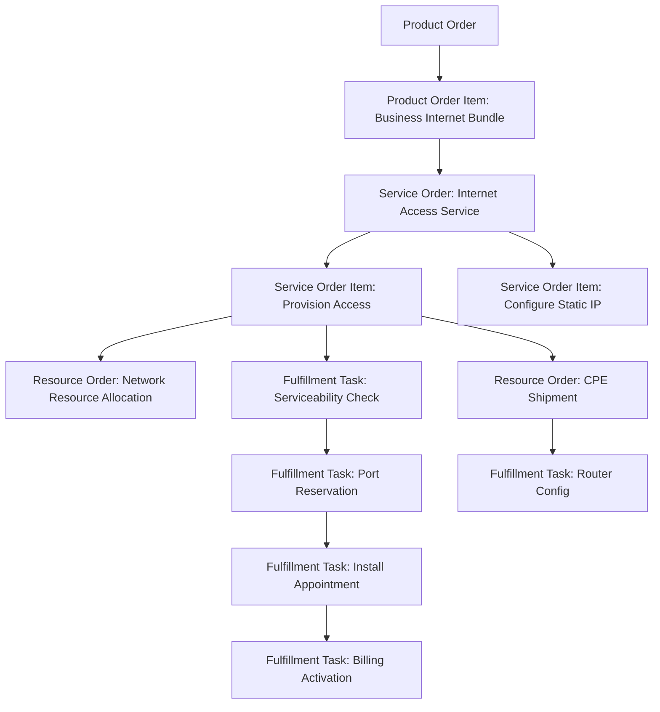
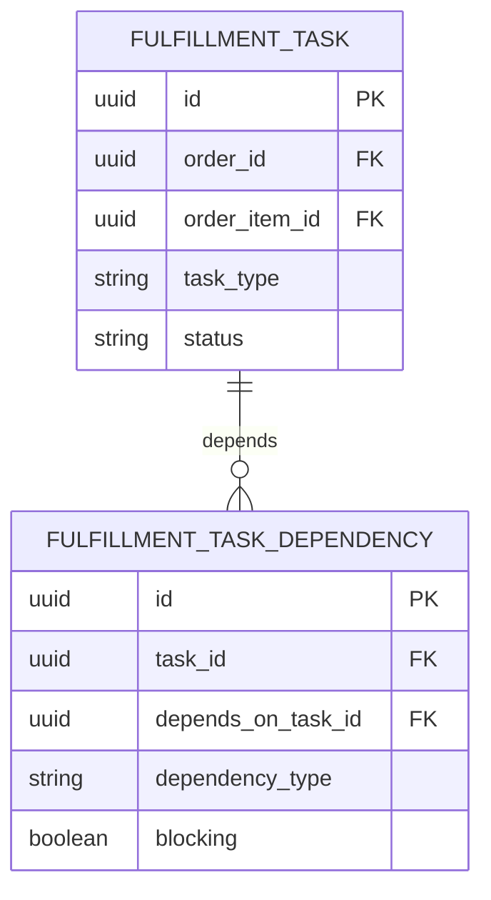

# Order Decomposition Model

## 1. Core Idea

Order decomposition adalah proses mengubah **commercial/product order** menjadi unit kerja teknis dan operasional yang bisa dieksekusi oleh fulfillment, OSS, provisioning, billing, inventory, dan downstream systems.

Product order menjawab:

> Produk apa yang customer beli/ubah/hentikan?

Decomposition menjawab:

> Work apa saja yang harus dibuat agar product order itu benar-benar terjadi?

Dalam telco BSS/OSS dan enterprise quote-to-cash, satu order item commercial bisa menghasilkan:

- service order,
- resource order,
- provisioning request,
- work order,
- installation appointment,
- shipping task,
- billing instruction,
- inventory update,
- external system call,
- manual task,
- orchestration step.

Mental model:

> Decomposition is the transformation from commercial intent into executable operational graph.

---

## 2. Why Decomposition Exists

Tanpa decomposition, order management akan mencoba menjalankan fulfillment langsung dari quote/order item commercial. Itu biasanya gagal untuk produk kompleks.

Contoh:

```text
Order item:
  ADD Enterprise Internet Bundle
```

Di balik itu mungkin perlu:

- validate serviceability,
- reserve access resource,
- create access circuit service order,
- ship router,
- schedule installation,
- configure router,
- allocate static IP,
- update service inventory,
- update product inventory,
- trigger recurring billing,
- notify customer.

Satu commercial line bisa berubah menjadi banyak work items.

Decomposition diperlukan agar:

- fulfillment bisa diparalelkan,
- dependency bisa dieksekusi dengan benar,
- failure bisa diisolasi,
- retry bisa dilakukan per task,
- downstream contract bisa spesifik,
- billing trigger bisa menunggu activation,
- inventory bisa direkonsiliasi,
- order progress bisa dimonitor dengan akurat.

---

## 3. Product Order vs Service Order vs Resource Order

Dalam telco-style architecture, pemisahan ini penting.

| Layer | Meaning | Example |
|---|---|---|
| Product order | Customer/commercial-facing order | Customer buys "Business Internet 500 Mbps". |
| Service order | Service-facing instruction | Provision broadband access service. |
| Resource order | Resource/network/device-facing instruction | Allocate port, IP, CPE, SIM, circuit resource. |
| Fulfillment task | Operational unit of work | Create provisioning request, schedule install, ship router. |

Product order adalah BSS/commercial. Service/resource order lebih dekat ke OSS/technical execution.

Jangan mencampur semua sebagai satu `order_item` tanpa layer/context jika domain menuntut separation.

---

## 4. Decomposition Inputs

Decomposition membutuhkan input data yang stabil.

| Input | Why needed |
|---|---|
| Order header | Customer/account/channel/priority/context. |
| Order items | Action, product, quantity, hierarchy. |
| Product offering/spec | Commercial and structural reference. |
| Catalog version | Avoid using current changed catalog accidentally. |
| Configuration/characteristics | Fulfillment-specific values. |
| Site/location | Serviceability and installation. |
| Product inventory | Required for modify/disconnect/suspend/resume. |
| Service/resource inventory | Required for technical change. |
| Agreement/SLA | May affect fulfillment priority/path. |
| Billing account/charge snapshot | Billing instruction and activation trigger. |
| Rule version | Trace decomposition decision. |

Dangerous pattern:

```text
Decomposition reads current catalog/rules without considering accepted order catalog version.
```

That can create work different from what customer accepted.

---

## 5. Decomposition Outputs

Outputs can include:

- service order,
- service order item,
- resource order,
- fulfillment task,
- orchestration step,
- dependency edge,
- external request envelope,
- inventory effect,
- billing trigger instruction,
- manual task,
- milestone expectation,
- reconciliation expectation.

Conceptual output graph:



---

## 6. Decomposition Rule

Decomposition rule defines how product/order item becomes executable work.

Rule can be:

- catalog-driven,
- product-spec-driven,
- action-driven,
- customer segment-driven,
- site/location-driven,
- serviceability-driven,
- technology-driven,
- downstream-system-driven,
- manually configured,
- hard-coded in service,
- external rule engine based.

Rule data might include:

```text
decomposition_rule
- rule_id
- product_offering_id
- product_offering_version
- product_specification_id
- action
- condition
- output_type
- output_template
- dependency_template
- rule_version
- effective_from
- effective_to
```

Do not assume every system stores rules in database. Some use code/config/BPMN/rule engine. The important thing is traceability:

> For each generated task, the system should be able to explain which rule/version created it.

---

## 7. Action-Aware Decomposition

The same product may decompose differently depending on action.

Example: Managed Router

| Action | Decomposition |
|---|---|
| `ADD` | Ship router, configure router, activate service. |
| `MODIFY` | Push configuration update. |
| `DISCONNECT` | Retrieve router or deactivate device, release assignment. |
| `SUSPEND` | Disable service policy, keep resource. |
| `RESUME` | Re-enable service policy. |
| `MOVE` | Update site, possibly ship/install at new site. |

Therefore, decomposition key is not only product offering. It should consider:

```text
product + action + current inventory state + target configuration + site + rule version
```

Failure mode:

```text
DISCONNECT decomposes like ADD because rule only checks product type.
```

---

## 8. Dependency Graph

Decomposition often produces a dependency graph, not a simple list.

Dependency examples:

- provision access before static IP activation,
- install router before service activation,
- serviceability check before resource reservation,
- resource reservation before provisioning request,
- product inventory update before billing activation,
- billing activation after fulfillment completion,
- customer appointment before installation task,
- manual approval before expensive provisioning.

Graph model:



Important graph constraints:

- no cycles unless explicitly modelled as loop/retry,
- every blocking dependency must eventually resolve or fail,
- dependency status must be observable,
- graph generation must be idempotent.

---

## 9. Parallel vs Sequential Tasks

Decomposition should distinguish:

| Execution type | Example |
|---|---|
| Sequential | Serviceability → reserve resource → provision. |
| Parallel | Ship router and reserve network resource can happen together. |
| Conditional | If fiber available, use fiber path; otherwise manual feasibility. |
| Manual gate | Wait for appointment confirmation. |
| Timer-based | Activate on requested date. |
| Event-driven | Wait for downstream acknowledgment. |

Data model should support dependency edges instead of relying on implicit sequence numbers only.

A `sequence_no` can help display/order, but dependency graph controls execution.

---

## 10. Parent-Child Order Item and Decomposition

Order item hierarchy may influence decomposition.

Example:

```text
Bundle item
  Access service item
  Router item
  Static IP item
```

Decomposition choices:

1. Parent bundle item creates orchestration container.
2. Child items create executable tasks.
3. Some child items are informational/billing-only.
4. Some technical tasks are generated beyond quote-visible items.

Important classification:

| Item type | Role |
|---|---|
| Commercial item | Visible in quote/order commercial structure. |
| Executable item | Drives fulfillment work. |
| Technical generated item | Created by decomposition, not directly sold. |
| Billing-only item | Drives charge, not fulfillment. |
| Informational item | For display/contract, not execution. |

Without classification, reporting and fulfillment can double-count or execute wrong items.

---

## 11. Downstream System Model

Decomposition routes work to downstream systems.

Examples:

- provisioning platform,
- billing system,
- inventory system,
- shipping/logistics,
- field service,
- CRM,
- partner API,
- network resource management,
- workflow engine,
- notification service.

Model:

```text
downstream_task_route
- task_type
- target_system
- operation
- payload_schema_version
- retry_policy
- timeout_policy
- reconciliation_policy
```

Or store route per task:

```text
fulfillment_task
- target_system
- external_operation
- external_reference
- payload_version
```

Route decision should be auditable.

---

## 12. Orchestration Step

A decomposition output may be represented as orchestration step.

Fields:

```text
orchestration_step
- id
- order_id
- order_item_id
- step_type
- step_name
- sequence_no
- status
- target_system
- input_payload
- output_payload_reference
- retry_count
- started_at
- completed_at
- failed_at
```

Be careful storing payloads:

- avoid leaking PII/secrets,
- define retention,
- store reference/hash if payload is large,
- encrypt/mask sensitive values,
- include schema version.

---

## 13. Decomposition Status

Decomposition itself needs status.

Possible states:

| State | Meaning |
|---|---|
| `NOT_STARTED` | No decomposition attempted. |
| `IN_PROGRESS` | Decomposition running. |
| `COMPLETED` | Decomposition graph/tasks created. |
| `PARTIAL` | Some items decomposed, some failed. |
| `FAILED` | Decomposition failed. |
| `RETRY_PENDING` | Waiting retry. |
| `SUPERSEDED` | Replaced by amendment/redecomposition. |

Store decomposition result:

```text
order_decomposition
- id
- order_id
- decomposition_version
- status
- rule_version
- started_at
- completed_at
- failed_at
- failure_reason
- correlation_id
```

This avoids invisible failures.

---

## 14. Decomposition Versioning

Orders may be amended or decomposition rules may change.

Questions:

- If an order is amended, do you regenerate whole decomposition?
- Do you create delta decomposition?
- If rule changes while order is in progress, do in-flight tasks use old rule?
- Can decomposition be rolled back?
- Can generated tasks be superseded?

Recommended principle:

> Decomposition output should be versioned or traceable to the rule/catalog version used at generation time.

Fields:

```text
decomposition_version
rule_version
catalog_version
source_order_version
superseded_by_decomposition_id
```

This prevents ambiguity when debugging old orders.

---

## 15. Decomposition Failure

Decomposition can fail before downstream execution.

Common causes:

- missing product-to-service mapping,
- unsupported product action,
- invalid product characteristic,
- stale catalog reference,
- missing service specification,
- missing resource specification,
- missing site/serviceability data,
- ambiguous bundle relationship,
- no route to downstream system,
- rule engine unavailable,
- invalid payload mapping.

Failure model should capture:

```text
decomposition_failure
- order_id
- order_item_id
- failure_code
- failure_message
- rule_id
- rule_version
- product_offering_id
- action
- retryable
- owner_group
- correlation_id
```

This is essential for support and root cause analysis.

---

## 16. Idempotency

Decomposition must be idempotent.

Why?

- order submitted event redelivered,
- decomposition worker retried,
- workflow step retried,
- API timeout,
- manual retry,
- deployment restart.

Idempotency strategies:

- unique key by `order_id + decomposition_version`,
- unique generated task key by `order_item_id + task_type + rule_id`,
- task natural key based on downstream operation,
- idempotency key stored in downstream request.

Example constraint:

```sql
create unique index uq_fulfillment_task_generation
on fulfillment_task (order_item_id, task_type, decomposition_version);
```

This may need adjustment if multiple tasks of same type are valid.

---

## 17. Transaction Boundary

### Same service/database

If decomposition and task creation happen in same service/database:

```text
Begin transaction
  mark decomposition in progress
  generate tasks
  generate dependencies
  write audit
  insert outbox events
  mark decomposition completed
Commit
```

### Distributed microservices

If decomposition is split:

```text
Order service emits ProductOrderSubmitted
Fulfillment orchestration service consumes
Orchestrator creates decomposition graph
Task executors consume task events
Order service receives progress events
```

Requires:

- idempotent consumer,
- outbox/inbox,
- correlation ID,
- reconciliation,
- event ordering per order,
- explicit ownership of decomposition data.

---

## 18. Event Model

Decomposition events:

- `OrderDecompositionRequested`
- `OrderDecompositionStarted`
- `OrderDecompositionCompleted`
- `OrderDecompositionFailed`
- `FulfillmentTaskCreated`
- `FulfillmentDependencyCreated`
- `ServiceOrderCreatedFromProductOrder`
- `ResourceOrderCreatedFromServiceOrder`

Event payload example:

```json
{
  "eventId": "uuid",
  "eventType": "OrderDecompositionCompleted",
  "eventVersion": 1,
  "occurredAt": "2026-07-12T10:00:00Z",
  "orderId": "order-id",
  "orderNumber": "O-10001",
  "decompositionId": "decomposition-id",
  "decompositionVersion": 1,
  "taskCount": 5,
  "ruleVersion": "2026.07",
  "correlationId": "corr-123"
}
```

Events should not contain huge generated graphs unless consumers truly need them. Prefer references for large graphs.

---

## 19. PostgreSQL Physical Design

Conceptual tables:

```sql
create table order_decomposition (
  id uuid primary key,
  order_id uuid not null,
  decomposition_version integer not null,
  status text not null,
  rule_version text,
  catalog_version text,
  source_order_version integer,
  started_at timestamptz,
  completed_at timestamptz,
  failed_at timestamptz,
  failure_code text,
  failure_message text,
  correlation_id text,
  created_at timestamptz not null,
  updated_at timestamptz not null
);
```

```sql
create table fulfillment_task (
  id uuid primary key,
  decomposition_id uuid not null references order_decomposition(id),
  order_id uuid not null,
  order_item_id uuid,
  task_type text not null,
  task_name text,
  target_system text,
  status text not null,
  retry_count integer not null default 0,
  external_reference text,
  idempotency_key text,
  created_at timestamptz not null,
  updated_at timestamptz not null
);
```

```sql
create table fulfillment_task_dependency (
  id uuid primary key,
  task_id uuid not null references fulfillment_task(id),
  depends_on_task_id uuid not null references fulfillment_task(id),
  dependency_type text not null,
  blocking boolean not null default true
);
```

Useful indexes:

```sql
create unique index uq_order_decomposition_version
on order_decomposition (order_id, decomposition_version);

create index idx_fulfillment_task_order_status
on fulfillment_task (order_id, status, updated_at);

create index idx_fulfillment_task_item
on fulfillment_task (order_item_id);

create index idx_task_dependency_task
on fulfillment_task_dependency (task_id);

create index idx_task_dependency_depends_on
on fulfillment_task_dependency (depends_on_task_id);
```

---

## 20. Java/JAX-RS Backend Implications

Decomposition should be a service-level operation.

Structure:

```text
OrderDecompositionResource
  -> OrderDecompositionService
      -> OrderRepository
      -> OrderItemRepository
      -> CatalogSnapshotClient
      -> InventoryClient
      -> DecompositionRuleEngine
      -> FulfillmentTaskRepository
      -> DependencyGraphValidator
      -> OutboxRepository
      -> AuditRepository
```

Pseudo-code:

```java
public DecompositionResult decompose(OrderId orderId, DecomposeOrderCommand command) {
    Order order = orderRepository.loadWithItems(orderId);

    decompositionPolicy.assertDecomposable(order);

    DecompositionContext context = contextFactory.from(order);
    DecompositionPlan plan = ruleEngine.generatePlan(context);

    graphValidator.assertAcyclic(plan.dependencies());
    graphValidator.assertAllMandatoryItemsCovered(order, plan);

    OrderDecomposition decomposition =
        decompositionRepository.create(order, plan.metadata());

    fulfillmentTaskRepository.saveAll(plan.tasks(decomposition.id()));
    taskDependencyRepository.saveAll(plan.dependencies(decomposition.id()));

    decomposition.markCompleted();
    decompositionRepository.save(decomposition);

    outboxRepository.append(OrderDecompositionCompletedEvent.from(decomposition));

    return DecompositionResult.from(decomposition);
}
```

Do not hide decomposition inside a controller or persistence mapper.

---

## 21. MyBatis/JPA/JDBC Implications

### MyBatis

Useful for:

- loading order item tree,
- inserting task batches,
- dependency graph queries,
- stuck task queries,
- decomposition status dashboards.

### JPA

Be careful:

- large graph persistence can become heavy,
- cascade on graph creation may hide errors,
- recursive relationships can cause N+1 issues,
- optimistic locking needed for decomposition retries.

### JDBC

Useful for deterministic batch insert of tasks/dependencies.

Key rule:

> The decomposition graph is data with lifecycle, not temporary runtime structure only.

---

## 22. Camunda / Workflow Implications

If Camunda orchestrates decomposition:

- BPMN can represent orchestration flow,
- domain DB should still store order/decomposition/task references,
- process instance ID should be linked to order/decomposition,
- process variables should not be the only record of decomposition output,
- incidents should map to fallout/decomposition failure,
- message correlation should use order/decomposition business key.

Example business key:

```text
order:{orderId}:decomposition:{decompositionVersion}
```

Workflow is orchestration. Data model is evidence and source for operational queries.

---

## 23. Reporting Impact

Decomposition enables metrics:

- decomposition success rate,
- decomposition failure rate by product/action,
- average time from submitted to decomposed,
- task count by product,
- downstream task volume,
- dependency wait time,
- product/action causing most fulfillment tasks,
- decomposition fallout reason,
- orders stuck before fulfillment.

Be clear whether reports count:

- product order items,
- service order items,
- resource order items,
- fulfillment tasks,
- generated technical tasks.

---

## 24. Observability

Key monitors:

- submitted orders with no decomposition,
- decomposition in progress too long,
- decomposition failed by reason,
- generated task count unusually high/low,
- tasks with missing dependencies,
- dependency cycles detected,
- tasks without target system,
- product/action with no decomposition rule,
- decomposition completed but no fulfillment task,
- downstream route unavailable.

Example queries:

```sql
-- Submitted orders without decomposition
select o.id, o.order_number, o.status, o.updated_at
from product_order o
left join order_decomposition d on d.order_id = o.id
where o.status = 'SUBMITTED'
  and d.id is null
  and o.updated_at < now() - interval '30 minutes';

-- Failed decomposition by reason
select failure_code, count(*)
from order_decomposition
where status = 'FAILED'
group by failure_code
order by count(*) desc;

-- Fulfillment tasks with missing target system
select id, order_id, order_item_id, task_type
from fulfillment_task
where target_system is null
  and status not in ('CANCELLED', 'NOT_APPLICABLE');
```

---

## 25. Failure Modes

| Failure mode | Symptom | Likely cause | Prevention |
|---|---|---|---|
| No decomposition | Order submitted but no tasks | Missing event/worker/rule | Submitted-without-decomposition monitor |
| Wrong decomposition | Incorrect downstream work | Wrong rule/action/catalog version | Rule version trace and tests |
| Duplicate tasks | Retry creates repeated work | No idempotency | Unique task generation keys |
| Missing dependency | Task starts too early | Dependency graph incomplete | Graph validation |
| Dependency cycle | Tasks wait forever | Bad rule graph | Acyclic graph validation |
| Unsupported action | Decomposition fails | Rule does not handle action | Action coverage matrix |
| Stale catalog | Work generated from new catalog | No catalog version carry-over | Accepted catalog snapshot |
| Hidden failure | Order stuck in progress | Decomposition failure not first-class | Decomposition status/failure table |
| Billing task too early | Charge triggered before activation | Wrong dependency | Billing trigger dependency |
| Reporting double count | Inflated work volume | Commercial and technical tasks mixed | Task/item classification |

---

## 26. PR Review Checklist

When reviewing decomposition changes, ask:

- What product/action does this decomposition handle?
- Which catalog/rule version is used?
- Is the decomposition idempotent?
- Are generated tasks persisted?
- Are dependencies explicit?
- Can dependency cycles occur?
- What happens if decomposition partially fails?
- How is failure visible?
- Is source order item trace preserved?
- Are generated technical tasks classified?
- Does decomposition respect accepted quote/catalog snapshot?
- Does it use current inventory state correctly?
- Does it create service/resource order records?
- Does it route to correct downstream system?
- Are event contracts updated?
- Are reporting definitions affected?
- Are tests covering product/action combinations?
- Are reconciliation queries available?

---

## 27. Internal Verification Checklist

Verify these in the internal CSG/team context:

- Whether product order decomposition exists as explicit component/service.
- Whether order decomposition is synchronous, asynchronous, workflow-driven, or event-driven.
- Whether product order, service order, and resource order are distinct models.
- Whether decomposition output is persisted.
- Whether decomposition has status/history.
- Whether decomposition rules are catalog-driven, config-driven, BPMN-driven, rule-engine-driven, or code-driven.
- Whether rule version is recorded.
- Whether catalog version is carried into decomposition.
- Whether order action affects decomposition.
- Whether parent-child order item hierarchy affects generated tasks.
- Whether dependency graph is explicit.
- Whether graph cycle validation exists.
- Whether generated tasks have target system and external operation.
- Whether idempotency prevents duplicate tasks.
- Whether decomposition failure is visible in dashboard.
- Whether manual retry is supported.
- Whether Camunda process instance is linked to decomposition/order.
- Whether billing trigger is part of decomposition or later fulfillment.
- Whether incident notes mention missing rule, duplicate tasks, wrong downstream payload, or stuck decomposition.

---

## 28. Summary

Order decomposition is the bridge between commercial order and operational execution.

A strong decomposition model must define:

- input snapshot,
- product/action-aware rules,
- service/resource/task outputs,
- dependency graph,
- parallel/sequential execution,
- decomposition version,
- generated task traceability,
- idempotency,
- failure handling,
- event publication,
- workflow linkage,
- reporting classification,
- reconciliation and observability.

The key principle:

> Do not treat decomposition as hidden code. Treat it as auditable production data that explains how a commercial order becomes executable work.
