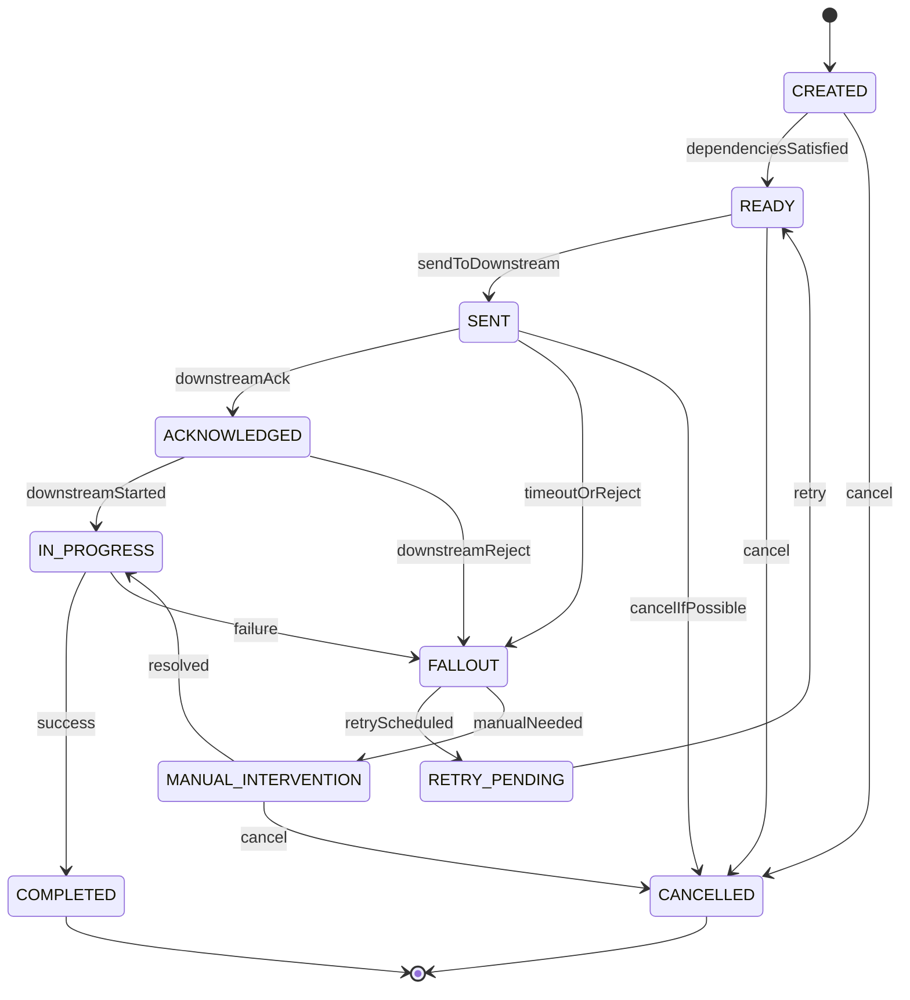
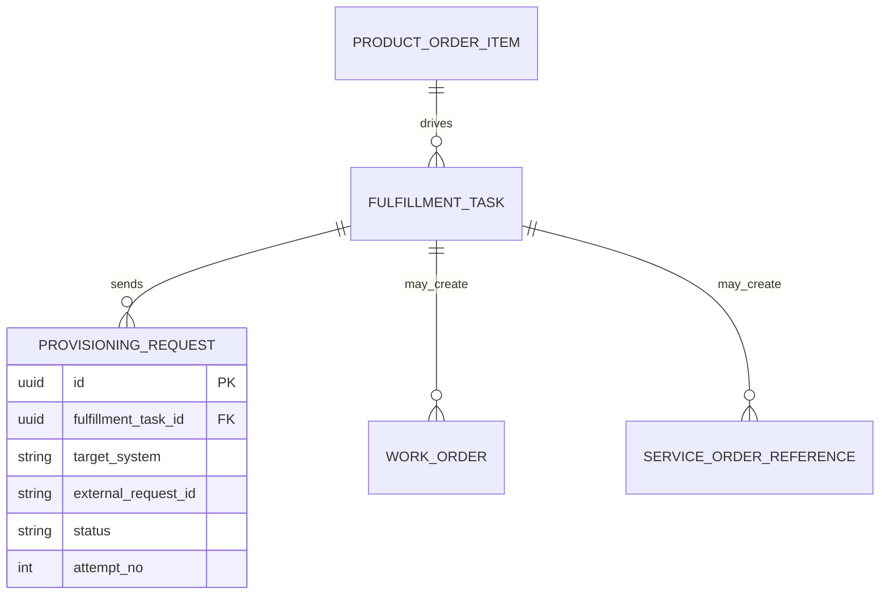

# Fulfillment and Fallout Data Model

## 1. Core Idea

Fulfillment adalah proses mengeksekusi order menjadi real-world product/service/resource state.

Fallout adalah kondisi ketika fulfillment tidak bisa lanjut secara normal karena failure, mismatch, missing data, downstream rejection, timeout, atau kondisi manual yang harus diselesaikan.

Dalam enterprise CPQ / Order Management / Telco BSS/OSS, fulfillment bukan hanya "status completed". Ia terdiri dari:

- fulfillment task,
- service order,
- resource order,
- work order,
- provisioning request,
- milestone,
- dependency,
- retry attempt,
- manual intervention,
- fallout reason,
- resolution,
- reconciliation,
- completion proof,
- inventory update,
- billing activation.

Mental model:

> Fulfillment data model is the operational evidence layer that proves how an order was executed, where it failed, how it was repaired, and when it became safe for inventory and billing.

---

## 2. Why Fulfillment and Fallout Modelling Matters

Order systems fail in production not only because data is wrong, but because failure is not modelled.

Without fulfillment/fallout model:

- order stuck with no visible reason,
- downstream provisioning fails but header remains in progress,
- retry creates duplicate external work,
- manual fix is not auditable,
- billing starts without activation proof,
- customer sees completed but service is not active,
- service active but product inventory not updated,
- support cannot tell where the order is blocked,
- reconciliation cannot match source/target systems,
- incident team reads logs manually to reconstruct state.

A strong fulfillment model makes operational reality queryable.

---

## 3. Fulfillment Task

Fulfillment task is a unit of operational execution.

Examples:

- check serviceability,
- reserve resource,
- create service order,
- send provisioning request,
- configure service,
- allocate IP,
- ship device,
- schedule installation,
- complete field work,
- update inventory,
- trigger billing,
- notify customer.

Core fields:

```text
fulfillment_task
- id
- order_id
- order_item_id
- task_type
- task_name
- status
- target_system
- external_reference
- retry_count
- priority
- owner_group
- due_at
- created_at
- updated_at
```

A task should be linked to order/order item and downstream system when applicable.

---

## 4. Fulfillment Task State Machine

Conceptual task lifecycle:



State names may differ internally. The principle:

> Task status should distinguish created, ready, sent, acknowledged, in progress, completed, fallout, retry, manual, and cancelled if operationally meaningful.

---

## 5. Work Order, Service Order, Provisioning Request

Different systems use different execution abstractions.

| Concept | Meaning |
|---|---|
| Fulfillment task | Internal executable unit. |
| Work order | Human/field/service work unit. |
| Service order | Service-facing order, often OSS aligned. |
| Resource order | Resource-facing allocation/deallocation. |
| Provisioning request | Technical request to activate/configure/deactivate service. |
| External job/ticket | Downstream tracking object. |

Do not force them all into one table if they have different lifecycle. But preserve relationship.

Example:



---

## 6. Milestone Model

Milestones are business/operational evidence points.

Examples:

- decomposition completed,
- task created,
- task sent,
- downstream acknowledged,
- appointment scheduled,
- technician dispatched,
- installation completed,
- provisioning completed,
- service activated,
- inventory updated,
- billing ready,
- billing activated.

Milestone table:

```text
fulfillment_milestone
- id
- order_id
- order_item_id
- fulfillment_task_id
- milestone_type
- milestone_status
- occurred_at
- source_system
- external_reference
- correlation_id
- metadata
```

Milestone should not replace task state; it complements it.

---

## 7. Dependency Model

Fulfillment depends on task ordering.

Examples:

- billing activation depends on product activation,
- product activation depends on provisioning completion,
- provisioning depends on resource reservation,
- installation depends on appointment schedule,
- router configuration depends on router shipment,
- static IP assignment depends on base service.

Dependency fields:

```text
fulfillment_task_dependency
- task_id
- depends_on_task_id
- dependency_type
- blocking
- satisfaction_condition
- status
```

A task should not be marked ready if blocking dependencies are unresolved.

---

## 8. Fallout Model

Fallout is first-class data.

Fields:

```text
fallout
- id
- order_id
- order_item_id
- fulfillment_task_id
- fallout_type
- fallout_reason_code
- fallout_reason_message
- source_system
- severity
- retryable
- owner_group
- status
- detected_at
- resolved_at
- resolution_code
- resolution_note
- correlation_id
```

Fallout should answer:

- what failed,
- where it failed,
- why it failed,
- whether it is retryable,
- who owns it,
- how long it has aged,
- what resolution was applied,
- whether customer/billing/inventory is impacted.

---

## 9. Fallout Reason Taxonomy

A useful taxonomy prevents random error strings.

Example categories:

| Category | Examples |
|---|---|
| Data error | Missing characteristic, invalid address, unknown product mapping. |
| Catalog/rule error | No decomposition rule, stale catalog version, incompatible product. |
| Inventory error | Resource unavailable, product instance missing, duplicate assignment. |
| Downstream rejection | OSS rejected payload, billing system rejected account. |
| Timeout | No response from external system. |
| Integration error | Authentication, schema mismatch, network error. |
| Manual dependency | Waiting appointment, permit, customer confirmation. |
| Business rule block | Contract restriction, credit hold, approval missing. |
| System error | Internal exception, database failure, worker crash. |

Store normalized reason code plus raw external error reference.

Do not rely only on free-text message.

---

## 10. Retry Model

Retry must be explicit and idempotent.

Fields:

```text
fulfillment_retry_attempt
- id
- fulfillment_task_id
- fallout_id
- attempt_no
- retry_reason
- retry_strategy
- status
- requested_by
- started_at
- finished_at
- external_request_id
- error_code
- error_message
```

Retry policy:

- max attempts,
- backoff,
- retryable errors,
- non-retryable errors,
- manual approval required,
- idempotency key,
- downstream duplicate handling,
- DLQ handling.

Important:

> Retry should not create duplicate external work unless the downstream operation is designed for it.

---

## 11. Manual Intervention Model

Some fallout cannot be resolved automatically.

Manual intervention data:

```text
manual_intervention
- id
- fallout_id
- task_id
- assigned_group
- assigned_user
- required_action
- status
- due_at
- started_at
- completed_at
- resolution_note
- evidence_reference
```

Examples:

- verify address,
- fix missing catalog mapping,
- contact customer,
- schedule technician,
- manually correct downstream data,
- approve exception,
- release stuck resource,
- trigger manual billing activation.

Manual intervention must be auditable because it can change customer-facing state.

---

## 12. Resolution Model

Fallout resolution should be structured.

Resolution fields:

```text
fallout_resolution
- id
- fallout_id
- resolution_type
- resolution_code
- resolution_note
- resolved_by
- resolved_at
- follow_up_action
- retry_attempt_id
- correction_reference
- evidence_reference
```

Resolution types:

- retry succeeded,
- data corrected,
- manual override,
- downstream fixed,
- customer cancelled,
- order amended,
- task skipped/not applicable,
- compensation created,
- escalated,
- marked non-retryable.

Avoid simply setting `fallout.status = CLOSED` without resolution evidence.

---

## 13. Completion Proof

Fulfillment completion should be backed by evidence.

Completion proof examples:

- downstream success response,
- service activation event,
- product inventory created,
- service inventory active,
- installation completion confirmation,
- technician proof,
- billing activation acknowledgement,
- resource assignment confirmation,
- external order status complete,
- reconciliation match.

Data model:

```text
completion_proof
- id
- order_id
- order_item_id
- fulfillment_task_id
- proof_type
- source_system
- external_reference
- proof_payload_reference
- proof_hash
- completed_at
- correlation_id
```

Proof does not need to store full payload if sensitive/large. A reference/hash may be enough.

---

## 14. Fulfillment and Product Inventory

Fulfillment should update or trigger update to inventory.

Examples:

| Fulfillment outcome | Inventory effect |
|---|---|
| Add completed | Create product instance. |
| Modify completed | Update product instance characteristics. |
| Disconnect completed | Set product instance terminated. |
| Suspend completed | Set product instance suspended. |
| Resume completed | Set product instance active. |
| Move completed | Update site/service relationship. |

Inventory update should be traceable to:

- order,
- order item,
- fulfillment task,
- action,
- completion proof,
- effective date.

Failure mode:

```text
Provisioning completed but product inventory not updated.
```

This causes modify/disconnect/reconciliation issues later.

---

## 15. Fulfillment and Billing

Billing should be triggered based on reliable fulfillment evidence.

Possible billing trigger sources:

- order item fulfilled,
- service activated milestone,
- product inventory active event,
- completion proof,
- manual billing approval.

Billing trigger model:

```text
billing_trigger
- id
- order_id
- order_item_id
- fulfillment_task_id
- trigger_type
- status
- billing_account_id
- charge_reference
- effective_date
- triggered_at
- acknowledged_at
- failure_code
```

Billing should not infer activation from order submission unless product/business explicitly supports upfront billing.

---

## 16. Reconciliation Model

Fulfillment reconciliation compares expected vs actual state.

Reconciliation questions:

- Did every expected task get created?
- Did every sent task get acknowledged?
- Did completed provisioning create inventory?
- Did active inventory trigger billing?
- Does downstream status match local status?
- Are there external orders with no local order?
- Are there local orders with no external reference?
- Did manual repair align all systems?

Reconciliation fields:

```text
fulfillment_reconciliation
- id
- order_id
- order_item_id
- fulfillment_task_id
- source_system
- target_system
- reconciliation_type
- expected_status
- actual_status
- result
- mismatch_code
- checked_at
- repair_action
```

---

## 17. State Aggregation

Fulfillment task states aggregate into order item/order header states.

Example:

```text
If any blocking task is FALLOUT:
  order_item.fulfillment_status = FALLOUT
  order.status may become FALLOUT

If all mandatory tasks completed:
  order_item.fulfillment_status = FULFILLED

If some completed and some in progress:
  order_item.fulfillment_status = PARTIAL or IN_PROGRESS
```

Aggregation rules must be explicit.

Common bug:

```text
One optional task fails and marks entire order failed.
```

Solution:

- classify task as mandatory/optional,
- classify dependency as blocking/non-blocking,
- define aggregation rules per task type.

---

## 18. SLA and Aging

Fulfillment model should support SLA tracking.

Fields:

- created_at,
- ready_at,
- sent_at,
- acknowledged_at,
- started_at,
- completed_at,
- failed_at,
- due_at,
- owner_group,
- severity,
- priority.

Metrics:

- time to decompose,
- time to send,
- downstream response time,
- time in fallout,
- manual intervention aging,
- task completion time,
- order completion time,
- SLA breach count.

Do not rely only on logs for SLA. Store timestamps.

---

## 19. PostgreSQL Physical Design

Conceptual fallout table:

```sql
create table fulfillment_fallout (
  id uuid primary key,
  order_id uuid not null,
  order_item_id uuid,
  fulfillment_task_id uuid,
  fallout_type text not null,
  reason_code text not null,
  reason_message text,
  source_system text,
  severity text,
  retryable boolean not null default false,
  owner_group text,
  status text not null,
  detected_at timestamptz not null,
  resolved_at timestamptz,
  resolution_code text,
  resolution_note text,
  correlation_id text,
  created_at timestamptz not null,
  updated_at timestamptz not null
);
```

Retry attempt table:

```sql
create table fulfillment_retry_attempt (
  id uuid primary key,
  fulfillment_task_id uuid not null,
  fallout_id uuid,
  attempt_no integer not null,
  retry_strategy text,
  status text not null,
  requested_by text,
  started_at timestamptz,
  finished_at timestamptz,
  external_request_id text,
  error_code text,
  error_message text
);
```

Milestone table:

```sql
create table fulfillment_milestone (
  id uuid primary key,
  order_id uuid not null,
  order_item_id uuid,
  fulfillment_task_id uuid,
  milestone_type text not null,
  milestone_status text not null,
  occurred_at timestamptz not null,
  source_system text,
  external_reference text,
  correlation_id text,
  metadata jsonb
);
```

Useful indexes:

```sql
create index idx_fallout_status_owner
on fulfillment_fallout (status, owner_group, detected_at);

create index idx_fallout_order
on fulfillment_fallout (order_id, detected_at desc);

create index idx_retry_task_attempt
on fulfillment_retry_attempt (fulfillment_task_id, attempt_no);

create index idx_milestone_order_type
on fulfillment_milestone (order_id, milestone_type, occurred_at desc);
```

---

## 20. Java/JAX-RS Backend Implications

Fulfillment APIs can expose operational commands:

```http
POST /fulfillment/tasks/{taskId}/start
POST /fulfillment/tasks/{taskId}/complete
POST /fulfillment/tasks/{taskId}/fail
POST /fulfillment/tasks/{taskId}/retry
POST /fulfillment/fallouts/{falloutId}/assign
POST /fulfillment/fallouts/{falloutId}/resolve
POST /fulfillment/fallouts/{falloutId}/escalate
```

Service responsibilities:

- validate task state transition,
- validate dependency readiness,
- send downstream request idempotently,
- record external reference,
- raise fallout on failure,
- create retry attempt,
- create manual intervention,
- record milestone,
- update item/header aggregate state,
- publish events through outbox.

Do not let downstream callback directly update order header to completed without task-level validation.

---

## 21. Event Model

Fulfillment events:

- `FulfillmentTaskCreated`
- `FulfillmentTaskReady`
- `FulfillmentTaskSent`
- `FulfillmentTaskAcknowledged`
- `FulfillmentTaskCompleted`
- `FulfillmentTaskFailed`
- `FulfillmentFalloutRaised`
- `FulfillmentFalloutResolved`
- `FulfillmentRetryScheduled`
- `FulfillmentRetryCompleted`
- `ManualInterventionRequired`
- `CompletionProofRecorded`

Event payload example:

```json
{
  "eventId": "uuid",
  "eventType": "FulfillmentFalloutRaised",
  "eventVersion": 1,
  "occurredAt": "2026-07-12T10:00:00Z",
  "orderId": "order-id",
  "orderItemId": "order-item-id",
  "taskId": "task-id",
  "falloutId": "fallout-id",
  "reasonCode": "DOWNSTREAM_TIMEOUT",
  "sourceSystem": "OSS_PROVISIONING",
  "retryable": true,
  "ownerGroup": "fulfillment-ops",
  "correlationId": "corr-123"
}
```

Events should support operations and integration without exposing unnecessary sensitive details.

---

## 22. Kafka/RabbitMQ Implications

Fulfillment event processing needs:

- idempotent consumers,
- per-order or per-task ordering key,
- DLQ for non-retryable failures,
- retry topics/queues,
- poison message handling,
- correlation ID propagation,
- schema versioning,
- downstream response matching.

Kafka key options:

- `order_id` to preserve order-level sequencing,
- `task_id` for task-level sequencing,
- `product_instance_id` for inventory-affecting events.

RabbitMQ route options:

- by task type,
- by target system,
- by fallout severity,
- by owner group.

---

## 23. Camunda / Workflow Implications

Workflow can orchestrate fulfillment, but fulfillment data must remain queryable.

Recommended linkage:

```text
process_instance_id
business_key
order_id
order_item_id
fulfillment_task_id
fallout_id
```

Camunda incident should not be the only fallout record. Create domain fallout record when a process incident blocks order execution.

Manual tasks in workflow should map to manual intervention records.

Timers should update or be reflected in fulfillment task SLA/aging fields.

---

## 24. Reporting Impact

Fulfillment/fallout supports:

- order fallout rate,
- fallout by reason,
- fallout by product/action,
- fallout by downstream system,
- retry success rate,
- manual intervention volume,
- average time in fallout,
- task completion SLA,
- provisioning success rate,
- installation delay,
- activation-to-billing lag,
- reconciliation mismatch count.

Define:

- whether fallout is counted per order, item, task, or incident,
- whether repeated retry failures count once or many,
- whether resolved fallout remains in historical KPI,
- whether manual wait counts against SLA.

---

## 25. Observability

Critical monitors:

- tasks stuck in created/ready/sent,
- sent tasks without acknowledgment,
- acknowledged tasks with no progress,
- tasks in fallout by severity,
- fallout aging by owner group,
- retry attempts exceeding threshold,
- manual interventions overdue,
- completed fulfillment without completion proof,
- inventory update missing after fulfillment,
- billing trigger missing after activation,
- external system status mismatch.

Example queries:

```sql
-- Sent tasks with no acknowledgement
select id, order_id, order_item_id, target_system, updated_at
from fulfillment_task
where status = 'SENT'
  and updated_at < now() - interval '30 minutes';

-- Open fallout aging
select owner_group, reason_code, count(*), min(detected_at) as oldest
from fulfillment_fallout
where status not in ('RESOLVED', 'CANCELLED')
group by owner_group, reason_code
order by oldest;

-- Completed tasks without completion milestone/proof
select t.id, t.order_id, t.order_item_id
from fulfillment_task t
left join fulfillment_milestone m
  on m.fulfillment_task_id = t.id
 and m.milestone_type = 'COMPLETION_PROOF'
where t.status = 'COMPLETED'
  and m.id is null;
```

---

## 26. Failure Modes

| Failure mode | Symptom | Likely cause | Prevention |
|---|---|---|---|
| Invisible fallout | Order stuck in progress | Failure logged but not modelled | First-class fallout table |
| Duplicate provisioning | Same request sent twice | Retry without idempotency | Task/request idempotency key |
| Billing before activation | Customer charged early | Billing trigger not tied to proof | Completion proof/billing readiness guard |
| Service active but inventory missing | Later modify/disconnect fails | Inventory update not reconciled | Fulfillment-inventory reconciliation |
| Manual fix not auditable | Cannot explain production repair | No manual intervention model | Manual task/resolution audit |
| Retry storm | Downstream overloaded | No retry policy/backoff | Retry strategy and max attempts |
| Downstream reject ignored | Local task remains sent | Callback not handled | Response matching and timeout monitor |
| Optional task blocks order | Order stuck unnecessarily | No mandatory/optional classification | Task criticality model |
| Fallout reason chaos | KPI unusable | Free-text errors only | Reason taxonomy |
| Completion without proof | Support cannot verify activation | No proof model | Completion proof record |

---

## 27. PR Review Checklist

When reviewing fulfillment/fallout changes, ask:

- What fulfillment task is created or changed?
- What order item/action does it belong to?
- Is the task mandatory or optional?
- What dependencies must complete first?
- What target system receives it?
- Is downstream request idempotent?
- Where is external reference stored?
- What states can the task transition through?
- What counts as completion proof?
- How is fallout raised?
- Is fallout reason normalized?
- Is retry policy explicit?
- Is manual intervention auditable?
- Does task completion update inventory?
- Does task completion trigger billing?
- Are events outbox-backed?
- Are timeouts monitored?
- Are reconciliation checks available?
- Are sensitive payloads retained safely?

---

## 28. Internal Verification Checklist

Verify these in the internal CSG/team context:

- Actual fulfillment task/work order/service order model.
- Whether fulfillment task is first-class data or hidden in workflow/downstream system.
- Whether order item maps to fulfillment task.
- Whether service order/resource order are distinct.
- Whether task dependencies are explicit.
- Whether task state machine exists.
- Whether fallout is first-class entity.
- Whether fallout reason taxonomy exists.
- Whether retry attempt table/log exists.
- Whether manual intervention is modelled.
- Whether completion proof is stored.
- Whether downstream external reference is stored.
- Whether fulfillment updates product/service/resource inventory.
- Whether billing trigger depends on fulfillment proof.
- Whether Camunda incidents map to fallout records.
- Whether Kafka/RabbitMQ retry/DLQ is linked to fulfillment records.
- Whether dashboards show stuck tasks/fallout aging.
- Whether reconciliation checks service active vs inventory vs billing.
- Whether incident notes mention invisible fallout, duplicate provisioning, billing-before-activation, or missing completion proof.

---

## 29. Summary

Fulfillment and fallout modelling turns operational execution into reliable data.

A strong model must define:

- fulfillment tasks,
- downstream references,
- task states,
- dependencies,
- milestones,
- fallout records,
- normalized reason codes,
- retry attempts,
- manual intervention,
- resolution evidence,
- completion proof,
- inventory impact,
- billing trigger,
- reconciliation,
- observability.

The key principle:

> If fulfillment failure is only in logs, the order system is not production-ready. Failure must be queryable, auditable, retryable, and reconcilable as data.
