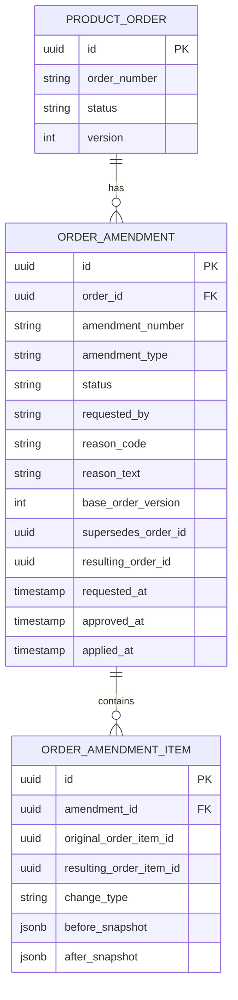
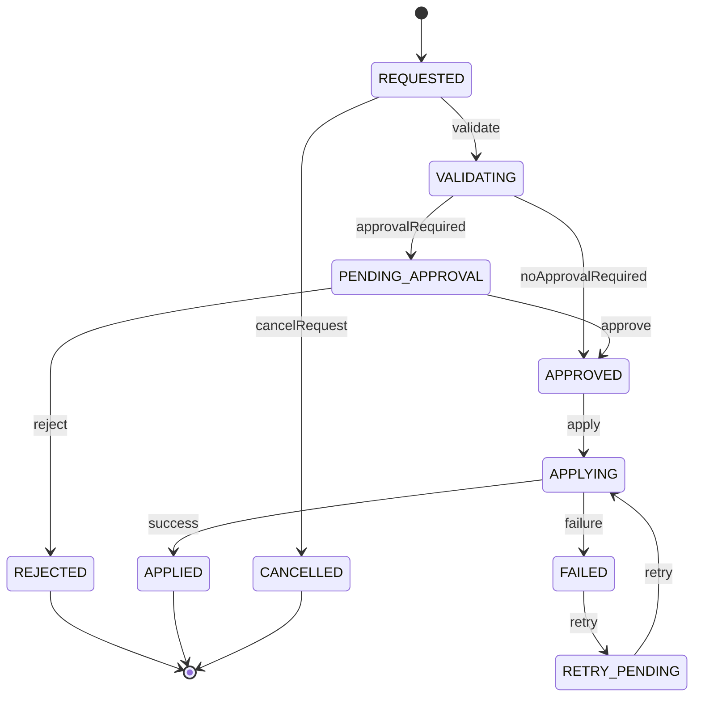
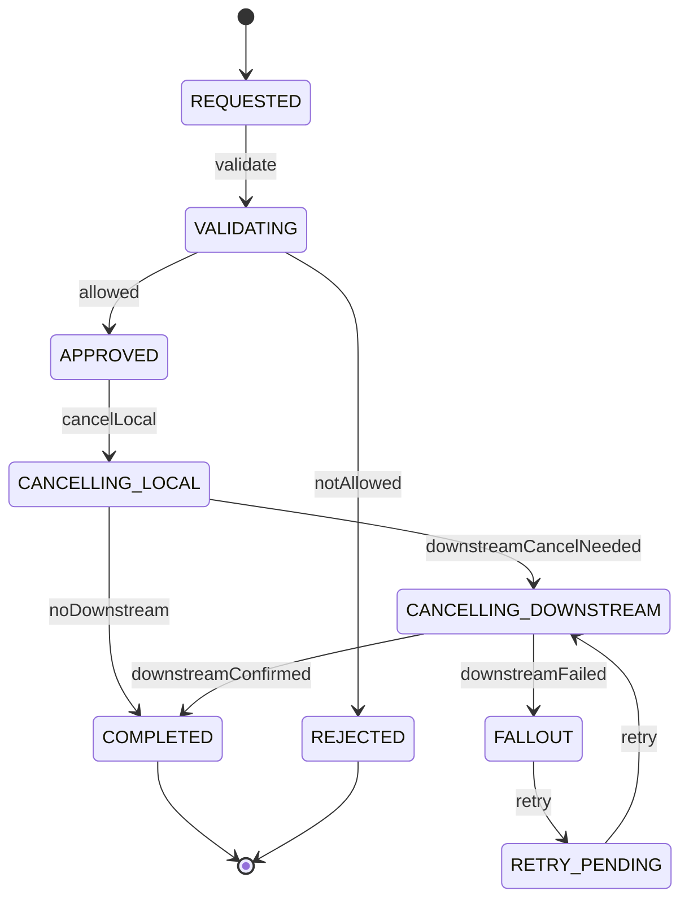

# Amend, Cancel, Retry, and Reconciliation Model

## 1. Core Idea

Real production order flow is not linear.

In diagrams, an order often looks simple:

```text
Quote accepted -> Order created -> Fulfillment completed -> Billing activated
```

In production, order flow often looks like this:

```text
Quote accepted
  -> Order created
  -> Fulfillment started
  -> Downstream timeout
  -> Retry
  -> Partial fulfillment
  -> Customer requests change
  -> Amendment
  -> One task cancelled
  -> New task created
  -> Billing mismatch
  -> Reconciliation
  -> Manual correction
  -> Completion
```

This part covers the data model for non-happy-path order control:

- amendment,
- cancellation,
- retry,
- compensation,
- reversal,
- correction,
- reconciliation,
- superseded order,
- delta order,
- conflict detection,
- partial state,
- audit evidence.

Mental model:

> Amend, cancel, retry, and reconciliation are not exception handling only. They are first-class production data models for controlled recovery.

---

## 2. Why This Model Exists

Enterprise quote-to-cash systems must handle change and failure safely.

Without explicit models:

- an in-flight order is modified directly and loses audit history,
- cancellation stops local status but downstream provisioning continues,
- retry creates duplicate external work,
- partial fulfillment leaves inventory and billing inconsistent,
- manual repair changes data without reason/evidence,
- support cannot explain what happened,
- reporting counts amended/cancelled orders incorrectly,
- billing mismatch cannot be traced to source order item,
- compensation is done by ad hoc SQL update,
- incident recovery creates more inconsistency.

The purpose of this model is to make production correction **explicit, auditable, idempotent, and reconcilable**.

---

## 3. Core Concepts

| Concept | Meaning |
|---|---|
| Amendment | Controlled change to submitted/in-progress order. |
| Cancellation | Stop an order/order item before intended effect completes. |
| Retry | Re-attempt a failed or uncertain operation. |
| Compensation | Apply a counter-operation to offset partial effect. |
| Reversal | Undo a completed or partially completed effect where possible. |
| Correction | Fix incorrect data/state with audit. |
| Reconciliation | Compare expected vs actual state across systems. |
| Superseded order | Original order replaced by revised/amended order. |
| Delta order | New order representing only the difference/change. |
| Partial state | Some parts completed, some failed/cancelled/pending. |
| Conflict detection | Prevent incompatible concurrent changes. |

These are separate concepts. Do not collapse all of them into `status = FAILED` or `status = CANCELLED`.

---

## 4. Cancel vs Disconnect vs Reversal

These terms are often confused.

| Concept | Applies to | Meaning |
|---|---|---|
| Cancel | In-flight order/order item | Stop intended effect before completion. |
| Disconnect | Existing active product/service | Terminate active customer product/service. |
| Reversal | Completed/partial effect | Undo or offset effect already applied. |
| Compensation | Partial/inconsistent effect | Add corrective operation to restore business consistency. |
| Correction | Data/system mismatch | Repair wrong data with evidence. |

Example:

```text
Customer ordered new internet service. Installation has not started.
=> Cancel order item.

Customer has active internet service and wants to terminate it.
=> Create DISCONNECT order item.

System accidentally activated service twice.
=> Correction/compensation/reversal, depending actual effect.
```

A serious data model must not represent all of these as `cancelled`.

---

## 5. Amendment Model

Amendment is a controlled change to an already submitted or in-progress order.

Amendment may be needed when:

- customer changes site,
- customer changes quantity,
- customer removes add-on,
- customer upgrades before fulfillment completes,
- serviceability result changes configuration,
- fulfillment team needs technical substitution,
- billing account changes before activation,
- legal/commercial term changes,
- product mapping needs correction.

### 5.1 Amendment strategies

| Strategy | Description | Risk |
|---|---|---|
| Direct mutation | Update existing order/order item rows. | Simple but weak audit; dangerous after downstream work starts. |
| Revision | Create new order revision that supersedes previous. | Good audit, more complexity. |
| Delta order | Create additional order representing difference. | Good for in-flight changes; requires strong mapping. |
| Amendment entity | Store amendment request and apply controlled changes. | Good if state/approval/audit are explicit. |
| Compensation + new action | Reverse previous effect then apply new instruction. | Useful for partial fulfillment. |

For enterprise systems, direct mutation after submission should be rare and heavily controlled.

---

## 6. Amendment Entity

Conceptual model:



Important fields:

- base order version,
- requested by,
- reason,
- affected items,
- before/after snapshot,
- approval status,
- application status,
- resulting order/order item references.

---

## 7. Amendment State Machine



Amendment state is different from order state. A failed amendment does not necessarily mean the order itself failed.

---

## 8. Delta Order Model

Delta order is useful when original order is already in progress.

Example:

```text
Original order:
  ADD Business Internet 100 Mbps

Amendment:
  Change to 500 Mbps before activation

Delta order:
  MODIFY pending service configuration from 100 to 500 Mbps
```

Delta order fields:

```text
product_order
- id
- order_number
- order_type = DELTA / AMENDMENT
- previous_order_id
- base_order_id
- amendment_id
- source_reason
```

Delta order item fields:

```text
order_item
- action = MODIFY / CANCEL / ADD / REMOVE / CHANGE_PLAN
- target_original_order_item_id
- target_product_instance_id if applicable
- before_snapshot
- after_snapshot
```

Delta order makes execution explicit and avoids mutating original historical data.

---

## 9. Superseded Order Model

A superseded order occurs when a new order/revision replaces previous order.

Fields:

```text
order_relationship
- source_order_id
- target_order_id
- relationship_type = SUPERSEDED_BY / REPLACES / AMENDS / CORRECTS
- reason_code
- effective_at
```

This helps answer:

- which order is current?
- which order was replaced?
- why was it replaced?
- what version was used for fulfillment?
- which order should reporting count?

Reporting must decide whether to count superseded orders, latest-only orders, or all order attempts.

---

## 10. Cancellation Model

Cancellation is a controlled stop of order/order item execution.

Cancellation scope:

| Scope | Meaning |
|---|---|
| Full order cancellation | Stop entire order. |
| Item cancellation | Stop one order item. |
| Task cancellation | Stop one fulfillment task. |
| Downstream cancellation | Request external system to cancel work. |
| Cancellation request | Business request pending validation/execution. |

Conceptual entity:

```text
order_cancellation
- id
- order_id
- order_item_id nullable
- cancellation_scope
- status
- requested_by
- reason_code
- reason_text
- requested_at
- approved_at
- applied_at
- compensation_required
- billing_impact
- correlation_id
```

Cancellation should not be represented only by setting `order.status = CANCELLED`.

---

## 11. Cancellation State Machine



Cancellation complexity increases with fulfillment progress.

---

## 12. Cancellation Guard by Fulfillment Stage

| Order/item stage | Cancellation behavior |
|---|---|
| Captured | Simple cancel. |
| Validated | Simple cancel with audit. |
| Submitted but not decomposed | Stop pipeline. |
| Decomposed but not sent downstream | Cancel generated tasks. |
| Sent downstream | Send downstream cancel request. |
| In progress | Cancel if reversible; otherwise compensate. |
| Partially fulfilled | Cancel remaining and compensate fulfilled parts if needed. |
| Fulfilled | Usually not cancel; create reversal/disconnect/correction. |
| Completed | Usually not cancel; create new order/action. |

Important rule:

> Cancellation must be evaluated against actual fulfillment/task state, not only order header state.

---

## 13. Retry Model

Retry is re-attempting an operation after failure/uncertainty.

Retry targets:

- quote-to-order conversion,
- order decomposition,
- external API call,
- provisioning request,
- billing activation,
- inventory update,
- event publication,
- read model projection,
- reconciliation repair.

Retry fields:

```text
retry_attempt
- id
- target_type
- target_id
- attempt_no
- idempotency_key
- status
- retry_reason
- retry_strategy
- requested_by
- started_at
- finished_at
- error_code
- error_message
- external_reference
```

Retry must preserve original intent. It must not create a new unrelated operation unless explicitly modelled.

---

## 14. Retryability

Not every failure is retryable.

| Failure | Retryable? | Example |
|---|---|---|
| Timeout | Usually yes | Downstream did not respond. |
| Temporary network error | Usually yes | HTTP 503. |
| Auth/config error | Usually no until fixed | Invalid credential. |
| Validation error | No until data changes | Missing required field. |
| Duplicate external request | Usually handle idempotently | Existing external reference. |
| Business rejection | Usually no | Customer not eligible. |
| Deadlock/DB transient | Yes | Retry transaction. |
| Unknown outcome | Retry carefully with status check | External timeout after possible commit. |

A retry model should include `retryable`, `max_attempts`, `backoff`, and `next_retry_at`.

---

## 15. Idempotent Retry

Retry must use stable idempotency.

Example:

```text
target_type = PROVISIONING_REQUEST
target_id = task-123
idempotency_key = order-item-456-provision-v1
```

On retry:

- check existing external reference,
- check if downstream already completed,
- reuse same idempotency key,
- do not create duplicate task unless previous task is explicitly superseded.

Common failure:

```text
Retry timeout creates second active service.
```

Prevention:

- idempotency key,
- external status check before retry,
- unique local execution key,
- reconciliation after ambiguous result.

---

## 16. Compensation Model

Compensation offsets partial effects.

Examples:

- service activated but order cancelled → disconnect/reverse activation.
- billing activated but fulfillment failed → stop billing and credit.
- product inventory created twice → terminate duplicate/correct inventory.
- resource reserved but order failed → release resource.
- device shipped but order cancelled → return/recover shipment.

Compensation entity:

```text
compensation_action
- id
- source_order_id
- source_order_item_id
- source_task_id
- compensation_type
- status
- reason_code
- target_entity_type
- target_entity_id
- requested_at
- completed_at
- evidence_reference
```

Compensation should be linked to original effect.

---

## 17. Reversal vs Compensation

| Concept | Meaning |
|---|---|
| Reversal | Undo same effect if possible. |
| Compensation | Apply offsetting operation if exact undo is not possible. |

Example:

```text
Exact reversal:
  Cancel pending provisioning request before activation.

Compensation:
  Service already activated and billed.
  Create disconnect + credit adjustment.
```

The model must preserve both original and corrective actions.

---

## 18. Correction Model

Correction fixes incorrect data or state.

Examples:

- wrong billing account on order,
- wrong product instance status,
- missing source quote mapping,
- duplicate order item,
- incorrect external reference,
- wrong lifecycle state,
- missing audit entry,
- incorrect charge effective date.

Correction must be controlled.

Fields:

```text
data_correction
- id
- correction_type
- target_entity_type
- target_entity_id
- before_snapshot
- after_snapshot
- reason_code
- incident_reference
- requested_by
- approved_by
- applied_by
- applied_at
- verification_status
```

Do not perform production data correction only through manual SQL without persistent business audit.

---

## 19. Reconciliation Model

Reconciliation compares expected state with actual state.

Example comparisons:

| Source | Target | Check |
|---|---|---|
| Order | Fulfillment task | Every executable item has task. |
| Fulfillment | Inventory | Fulfilled item has product/service instance. |
| Inventory | Billing | Active billable product has charge. |
| Billing | Order | Billing activation corresponds to fulfilled order item. |
| Local task | External system | Local status matches downstream status. |
| Quote | Order | Accepted quote converted once. |
| Order item | Product inventory | Modify/disconnect affected correct product instance. |

Reconciliation record:

```text
reconciliation_result
- id
- reconciliation_type
- source_system
- target_system
- source_entity_type
- source_entity_id
- target_entity_type
- target_entity_id
- expected_status
- actual_status
- result
- mismatch_code
- severity
- repair_action
- checked_at
```

---

## 20. Matching Keys

Reconciliation depends on stable keys.

Common keys:

- quote ID/version,
- order ID/order number,
- order item ID,
- source quote item ID,
- product instance ID,
- service instance ID,
- external reference,
- billing account ID,
- charge reference,
- correlation ID,
- idempotency key.

Bad reconciliation often comes from weak matching keys.

Example failure:

```text
Matching by order_number only, but downstream splits order into multiple service orders.
```

Better:

```text
order_id + order_item_id + external_reference + target_system
```

---

## 21. Conflict Detection

Before amendment/cancel/retry, detect conflicts.

Conflict examples:

- pending disconnect exists for product instance,
- modify requested while previous modify in progress,
- cancellation requested while completion event arrived,
- retry requested while task already completed,
- amendment changes item already fulfilled,
- billing correction conflicts with active invoice run,
- two users amend same order version.

Conflict fields:

```text
conflict_detection_result
- target_entity_type
- target_entity_id
- conflict_type
- blocking
- detected_at
- conflicting_entity_type
- conflicting_entity_id
- recommended_action
```

Optimistic locking handles technical conflict. Domain conflict detection handles business conflict.

---

## 22. Partial State Model

Partial state is normal.

Examples:

- one order item fulfilled, another in fallout,
- billing active for one item, pending for another,
- service inventory updated, product inventory pending,
- cancellation applied locally but downstream cancel pending,
- compensation completed for one task but not another.

Do not force order into a false single state.

Model partial state using:

- item-level state,
- task-level state,
- billing trigger state,
- inventory effect state,
- reconciliation result,
- header aggregate state.

Header may say `PARTIALLY_FULFILLED` or `FALLOUT`, but detail must live below.

---

## 23. PostgreSQL Physical Design

### 23.1 Amendment

```sql
create table order_amendment (
  id uuid primary key,
  order_id uuid not null,
  amendment_number text not null,
  amendment_type text not null,
  status text not null,
  base_order_version integer not null,
  reason_code text,
  reason_text text,
  requested_by text,
  approved_by text,
  requested_at timestamptz not null,
  approved_at timestamptz,
  applied_at timestamptz,
  correlation_id text,
  created_at timestamptz not null,
  updated_at timestamptz not null
);
```

### 23.2 Cancellation

```sql
create table order_cancellation (
  id uuid primary key,
  order_id uuid not null,
  order_item_id uuid,
  cancellation_scope text not null,
  status text not null,
  reason_code text not null,
  reason_text text,
  compensation_required boolean not null default false,
  requested_by text,
  requested_at timestamptz not null,
  applied_at timestamptz,
  correlation_id text
);
```

### 23.3 Retry attempt

```sql
create table retry_attempt (
  id uuid primary key,
  target_type text not null,
  target_id uuid not null,
  attempt_no integer not null,
  idempotency_key text,
  status text not null,
  retry_reason text,
  retry_strategy text,
  started_at timestamptz,
  finished_at timestamptz,
  error_code text,
  error_message text
);
```

### 23.4 Reconciliation result

```sql
create table reconciliation_result (
  id uuid primary key,
  reconciliation_type text not null,
  source_system text not null,
  target_system text not null,
  source_entity_type text not null,
  source_entity_id text not null,
  target_entity_type text,
  target_entity_id text,
  expected_status text,
  actual_status text,
  result text not null,
  mismatch_code text,
  severity text,
  repair_action text,
  checked_at timestamptz not null
);
```

---

## 24. Java/JAX-RS Backend Implications

Expose explicit operational commands:

```http
POST /orders/{orderId}/amendments
POST /orders/{orderId}/cancellations
POST /retry-attempts
POST /reconciliation-runs
POST /corrections
POST /compensations
```

Avoid:

```http
PATCH /orders/{id}
{
  "status": "CANCELLED"
}
```

Service structure:

```text
OrderRecoveryResource
  -> AmendmentService
  -> CancellationService
  -> RetryService
  -> CompensationService
  -> ReconciliationService
  -> CorrectionService
```

Each service should enforce:

- domain guard,
- authorization,
- conflict detection,
- idempotency,
- audit,
- event publication,
- reconciliation after repair.

---

## 25. Event Model

Events:

- `OrderAmendmentRequested`
- `OrderAmendmentApplied`
- `OrderCancellationRequested`
- `OrderCancellationCompleted`
- `RetryAttemptStarted`
- `RetryAttemptCompleted`
- `CompensationActionCreated`
- `CompensationActionCompleted`
- `DataCorrectionApplied`
- `ReconciliationMismatchDetected`
- `ReconciliationRepairCompleted`

Payload should include:

```json
{
  "eventId": "uuid",
  "eventType": "OrderCancellationRequested",
  "eventVersion": 1,
  "occurredAt": "2026-07-12T10:00:00Z",
  "orderId": "order-id",
  "orderItemId": "order-item-id",
  "reasonCode": "CUSTOMER_REQUEST",
  "requestedBy": "user-id",
  "correlationId": "corr-123"
}
```

Use outbox. Retry/correction events are operationally sensitive and must not leak unnecessary PII/pricing data.

---

## 26. Reporting Impact

These models support:

- amendment rate,
- cancellation rate,
- retry success rate,
- compensation volume,
- correction volume,
- fallout recovery time,
- reconciliation mismatch count,
- manual repair rate,
- orders requiring recovery,
- failure by product/action/system,
- revenue impact of cancellation/amendment,
- operational quality trend.

Reporting definitions must decide:

- whether amended order counts as new order,
- whether cancelled order counts as lost sale,
- whether retry attempts count as failures,
- whether resolved mismatch remains in historical DQ metric,
- whether compensation is negative order/revenue adjustment.

---

## 27. Observability

Monitors:

- amendments pending approval too long,
- cancellations stuck downstream,
- retries exceeding max attempts,
- retryable failures not retried,
- compensation pending after partial fulfillment,
- reconciliation mismatch by severity,
- correction without verification,
- duplicate active action for same product instance,
- cancelled order with active fulfillment task,
- completed order with open reconciliation mismatch.

Example queries:

```sql
-- Cancellation stuck
select id, order_id, order_item_id, status, requested_at
from order_cancellation
where status not in ('COMPLETED', 'REJECTED')
  and requested_at < now() - interval '2 hours';

-- Retry attempts exceeding threshold
select target_type, target_id, count(*) as attempts
from retry_attempt
where status in ('FAILED', 'COMPLETED')
group by target_type, target_id
having count(*) > 3;

-- Open reconciliation mismatches
select reconciliation_type, mismatch_code, severity, count(*)
from reconciliation_result
where result = 'MISMATCH'
group by reconciliation_type, mismatch_code, severity
order by count(*) desc;
```

---

## 28. Failure Modes

| Failure mode | Symptom | Likely cause | Prevention |
|---|---|---|---|
| Amendment overwrites original | Cannot reconstruct old order | Direct mutation | Amendment/delta/supersede model |
| Cancel does not stop downstream | External provisioning continues | No downstream cancel tracking | Cancellation task/external reference |
| Retry duplicates work | Two services/products created | Missing idempotency | Stable retry idempotency key |
| Compensation missing | Partial effect remains | Failure not modelled | Compensation action model |
| Reconciliation impossible | Cannot match systems | Weak matching keys | Persist external references |
| Manual correction hidden | Audit gap | Direct SQL repair | Correction entity and approval |
| Partial state misreported | Header says complete | No item/task aggregation | Partial state model |
| Conflict missed | Two concurrent amendments | No version/conflict check | Optimistic lock + domain conflict detection |
| Reporting inflated | Superseded order counted as active | No relationship semantics | Order relationship model |
| Billing mismatch persists | No repair loop | Reconciliation without action | Repair action workflow |

---

## 29. PR Review Checklist

When reviewing recovery/correction changes, ask:

- Is this amendment, cancel, retry, compensation, reversal, or correction?
- Is the concept modelled explicitly?
- What is the source entity and target entity?
- Is original state preserved?
- Is before/after captured?
- Is reason required?
- Is approval required?
- Is idempotency enforced?
- Is conflict detection performed?
- Is downstream state checked?
- Is fulfillment progress considered?
- Is billing impact modelled?
- Is product inventory impact modelled?
- Is reconciliation possible after the operation?
- Is audit written?
- Is event published?
- Are reporting definitions affected?
- Are operational dashboards updated?
- Are tests covering partial failure and retry?

---

## 30. Internal Verification Checklist

Verify these in the internal CSG/team context:

- Whether amendment is direct mutation, order revision, delta order, or amendment entity.
- Whether cancellation has its own entity/status/history.
- Whether cancel and disconnect are semantically distinct.
- Whether retry attempts are persisted.
- Whether retry idempotency key exists.
- Whether downstream cancellation is tracked.
- Whether compensation/reversal/correction are modelled.
- Whether data correction requires approval/audit.
- Whether reconciliation jobs exist for quote/order/fulfillment/billing/inventory.
- Whether matching keys are stable and persisted.
- Whether conflict detection checks pending orders/actions for same product instance.
- Whether partial state is represented at item/task/billing/inventory level.
- Whether manual production repair is traceable.
- Whether events exist for amendment/cancel/retry/reconciliation.
- Whether dashboards show stuck cancellation, retry exhaustion, and open mismatches.
- Whether incidents mention duplicate provisioning, failed cancellation, hidden manual fix, or unreconciled billing mismatch.

---

## 31. Summary

Production order flow needs controlled recovery models.

A mature enterprise data model must support:

- amendment without destroying history,
- cancellation without ignoring downstream work,
- retry without duplication,
- compensation for partial effects,
- reversal where possible,
- correction with audit,
- reconciliation with matching keys,
- conflict detection,
- partial-state visibility,
- operational monitoring.

The key principle:

> In enterprise quote-to-cash, failure recovery is part of the domain model. If recovery is not modelled as data, production correctness depends on tribal knowledge and manual SQL.
