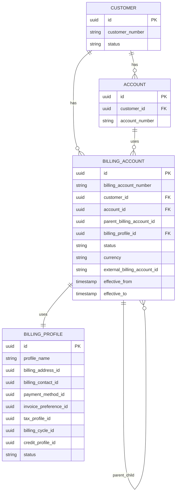

# Billing Account and Billing Profile Model

## 1. Core Idea

Billing account adalah data model yang menjawab:

> Siapa yang bertanggung jawab membayar, dengan aturan invoice, tax, currency, payment, billing cycle, contact, and billing hierarchy apa?

Dalam enterprise CPQ / Quote-to-Cash, customer, account, service account, and billing account are not always the same.

A customer may:

- buy under one legal entity,
- receive service at multiple sites,
- pay through a different billing account,
- use different invoice preferences per product group,
- have multiple billing cycles,
- require different tax profiles,
- have parent-child billing hierarchy,
- use different payment methods,
- have credit limits or billing holds.

Mental model:

> Billing account is the payer-side control model that connects commercial order, charges, invoice generation, payment, tax, and billing responsibility.

---

## 2. Why Billing Account Exists

Without explicit billing account model, systems often misuse `customer_id` for billing. This fails in enterprise B2B and telco.

Problems caused by weak billing account modelling:

- invoice sent to wrong payer,
- charge posted to wrong account,
- tax calculated from wrong address/profile,
- service activated without valid billing profile,
- recurring charge starts on wrong cycle,
- customer with multiple accounts receives consolidated incorrectly,
- credit hold not enforced,
- product order references service account but billing needs payer account,
- billing system rejects activation due to missing billing data,
- dispute cannot identify billing responsibility.

Billing account is not just a customer field. It is a financial and operational boundary.

---

## 3. Customer vs Account vs Billing Account vs Service Account

| Concept | Meaning |
|---|---|
| Party | Legal/person/organization identity. |
| Customer | Party in customer role. |
| Account | Commercial/account management container. |
| Billing account | Payer/invoice responsibility container. |
| Service account | Service ownership/usage container. |
| Contracting party | Legal entity bound by agreement. |
| Contact | Person/channel for communication. |

Example:

```text
Parent organization: GlobalCorp
Customer account: GlobalCorp Enterprise Account
Service account: GlobalCorp Jakarta Office
Billing account: GlobalCorp APAC Billing
Billing contact: finance-apac@globalcorp.example
Installation contact: site-manager-jakarta@example
```

A model that uses only `customer_id` cannot represent this accurately.

---

## 4. Billing Account Core Fields

Common billing account fields:

| Field | Purpose |
|---|---|
| `id` | Internal billing account identity. |
| `billing_account_number` | Human/business reference. |
| `customer_id` | Customer relationship. |
| `account_id` | Commercial account relationship. |
| `parent_billing_account_id` | Billing hierarchy/consolidation. |
| `billing_profile_id` | Invoice/payment/tax preference set. |
| `status` | Active, suspended, closed, credit hold, etc. |
| `currency` | Billing currency. |
| `billing_cycle_id` | Billing cycle assignment. |
| `tax_profile_id` | Tax calculation context. |
| `invoice_preference_id` | Invoice delivery/consolidation rules. |
| `payment_method_id` | Default payment method/reference. |
| `credit_profile_id` | Credit limit/hold/risk context. |
| `billing_address_id` | Billing address or snapshot. |
| `billing_contact_id` | Finance/billing contact. |
| `effective_from/to` | Temporal validity. |
| `external_billing_account_id` | Billing system reference. |

Actual fields depend on internal architecture and billing system.

---

## 5. Conceptual ERD



This is conceptual. Do not copy blindly into internal schema.

---

## 6. Billing Profile

Billing profile groups billing configuration.

A billing profile may include:

- billing address,
- billing contact,
- invoice preference,
- payment method,
- billing cycle,
- tax profile,
- currency,
- credit profile,
- invoice language,
- delivery method,
- consolidation rule,
- dunning preference,
- purchase order requirement.

Why separate billing profile from billing account?

- multiple billing accounts may share profile,
- profile can be versioned/effective-dated,
- profile changes need audit,
- some profile data is integration-specific,
- billing account remains identity/responsibility container.

However, in some systems billing account directly owns all profile fields. Verify internal model.

---

## 7. Billing Address

Billing address may differ from:

- service address,
- installation address,
- shipping address,
- legal address,
- tax registration address.

Billing address affects:

- invoice delivery,
- tax calculation,
- legal compliance,
- currency/region,
- payment terms,
- dispute handling.

Address modelling options:

| Option | Use |
|---|---|
| Reference address record | Good for normalized customer master. |
| Snapshot billing address | Good for invoice/audit evidence. |
| Both reference + snapshot | Strongest for traceability. |

For invoices, snapshot is often required because the address at invoice time must remain stable.

---

## 8. Billing Contact

Billing contact is not necessarily the buyer, approver, or service contact.

Billing contact fields:

- contact name,
- role,
- email,
- phone,
- preferred channel,
- effective dates,
- consent/preferences,
- related party reference.

Failure mode:

```text
Invoice sent to technical installation contact instead of finance contact.
```

Do not infer billing contact from order creator.

---

## 9. Payment Method

Payment method data can be sensitive.

Options:

- tokenized card/payment reference,
- bank transfer instruction,
- direct debit mandate,
- invoice/manual payment,
- external payment method ID,
- purchase order reference,
- payment terms.

Security concerns:

- do not store raw card/bank sensitive data unless system is designed/compliant,
- prefer token/reference from payment provider/billing system,
- mask in logs/events/API,
- audit changes,
- restrict access.

Payment method may be stored externally. Internal billing profile may only store reference.

---

## 10. Invoice Preference

Invoice preference controls invoice behavior.

Examples:

- consolidated invoice,
- separate invoice per account/site/product,
- email delivery,
- paper delivery,
- billing portal only,
- invoice language,
- invoice format,
- purchase order required,
- invoice grouping rule,
- tax invoice requirement,
- billing period display preference.

Invoice preference affects reporting and customer experience.

Potential model:

```text
invoice_preference
- id
- delivery_method
- grouping_rule
- format
- language
- po_required
- consolidation_level
- active
```

---

## 11. Billing Cycle

Billing cycle controls recurring billing schedule.

Examples:

- monthly on day 1,
- monthly on anniversary date,
- quarterly,
- annual upfront,
- custom enterprise cycle,
- prepaid,
- postpaid.

Billing cycle fields:

```text
billing_cycle
- id
- cycle_type
- frequency
- bill_day
- timezone
- proration_policy
- invoice_generation_offset
- payment_due_offset
```

Important temporal issues:

- timezone,
- daylight saving if applicable,
- inclusive/exclusive period,
- activation date vs billing start date,
- proration,
- first bill behavior,
- contract term alignment.

---

## 12. Tax Profile

Tax profile may include:

- tax registration number,
- tax exemption status,
- tax jurisdiction,
- billing address jurisdiction,
- service location jurisdiction,
- product tax category,
- customer tax category,
- reverse charge rules,
- VAT/GST/SST handling,
- tax engine reference.

Tax calculation can depend on billing address, service address, product type, and legal entity.

Do not assume tax is a simple percentage on price.

Tax profile should be versioned/auditable if it affects invoice.

---

## 13. Currency

Currency can exist at:

- quote level,
- order level,
- billing account level,
- price list level,
- charge level,
- invoice level,
- payment level.

Potential invariant:

```text
Order currency must be compatible with billing account currency unless explicit multi-currency billing rule exists.
```

Beware:

- FX conversion,
- multi-currency customer,
- currency change over time,
- invoice currency vs payment currency,
- reporting currency.

Currency should use ISO 4217 code, not free text.

---

## 14. Credit Profile

Credit profile controls risk and billing eligibility.

Fields:

```text
credit_profile
- id
- credit_limit
- credit_status
- risk_category
- credit_hold
- dunning_status
- last_credit_check_at
- external_credit_reference
```

Credit profile can affect:

- quote approval,
- order submission,
- fulfillment hold,
- billing activation,
- payment terms,
- suspension/disconnect.

Potential guard:

```text
Order cannot be submitted or activated for billing account on credit hold unless override approved.
```

Credit data may be owned by billing/finance system. Internal model may store reference/status snapshot.

---

## 15. Billing Responsibility

Billing responsibility defines who pays for which product/service/charge.

A billing account may be:

- default for customer,
- default for account,
- specific to order,
- specific to site,
- specific to product,
- specific to subscription,
- specific to charge.

Model levels:

```text
customer -> default billing account
account -> default billing account
order -> billing account
order item -> billing account override
product instance -> billing account
charge -> billing account
invoice -> billing account
```

Be explicit about precedence.

Example precedence:

```text
charge.billing_account_id
  else product_instance.billing_account_id
  else order_item.billing_account_id
  else order.billing_account_id
  else account.default_billing_account_id
```

Do not let each service invent precedence independently.

---

## 16. Billing Account Hierarchy

Enterprise customers may need billing hierarchy:

```text
Parent billing account
  Child billing account A
  Child billing account B
  Child billing account C
```

Use cases:

- consolidated invoice,
- parent pays for children,
- child receives separate invoice,
- spend reporting by subsidiary,
- tax/legal split,
- regional billing,
- account-level credit control.

Hierarchy fields:

```text
parent_billing_account_id
hierarchy_role
consolidation_rule
effective_from
effective_to
```

Avoid recursive hierarchy without cycle prevention.

Data quality check:

```text
Billing account hierarchy must not contain cycles.
```

---

## 17. Billing Account Lifecycle

Possible statuses:

| Status | Meaning |
|---|---|
| `DRAFT` | Created but incomplete. |
| `ACTIVE` | Can receive charges/invoices. |
| `SUSPENDED` | Temporarily blocked or on hold. |
| `CREDIT_HOLD` | Blocked due to credit/risk. |
| `CLOSED` | No new charges allowed. |
| `TERMINATED` | Ended relationship. |
| `MERGED` | Superseded by another billing account. |

Billing account lifecycle affects order:

- quote can reference active billing account,
- order can submit only if account billable,
- charge can post only if account open,
- invoice generation depends on account status,
- payment method may be required before activation.

---

## 18. Temporal Validity

Billing profiles change over time.

Examples:

- billing address changed,
- invoice preference changed,
- payment method changed,
- billing cycle changed,
- tax exemption starts/ends,
- currency changed,
- credit hold applied/released.

Do not overwrite critical billing data without history.

Options:

- effective-dated profile versions,
- audit history table,
- snapshot at invoice/charge/order,
- event-sourced billing profile changes.

For invoice correctness, the invoice should preserve the billing profile used at generation time.

---

## 19. Quote and Order Mapping

Quote/order should reference billing account clearly.

Quote:

```text
quote.billing_account_id
quote_item.billing_account_id optional override
```

Order:

```text
order.billing_account_id
order_item.billing_account_id optional override
billing_trigger.billing_account_id
charge.billing_account_id
```

Conversion must carry accepted billing account context.

Failure mode:

```text
Quote accepted with Billing Account A, but order defaults to Billing Account B because customer default changed.
```

Prevention:

- snapshot/carry billing account at quote acceptance/conversion,
- do not recompute payer from current default silently.

---

## 20. Billing Integration

External billing systems may own billing account master.

Internal model may store:

- external billing account ID,
- status snapshot,
- profile snapshot,
- last sync time,
- sync status,
- error reason,
- billing system source,
- reconciliation result.

Integration states:

```text
NOT_SYNCED
SYNC_PENDING
SYNCED
SYNC_FAILED
STALE
RECONCILIATION_REQUIRED
```

Do not assume local billing account is authoritative if billing system owns it. Mark ownership clearly.

---

## 21. Event Model

Billing account events:

- `BillingAccountCreated`
- `BillingAccountUpdated`
- `BillingAccountActivated`
- `BillingAccountSuspended`
- `BillingAccountClosed`
- `BillingProfileChanged`
- `BillingCycleChanged`
- `PaymentMethodUpdated`
- `TaxProfileChanged`
- `CreditHoldApplied`
- `CreditHoldReleased`

Payload example:

```json
{
  "eventId": "uuid",
  "eventType": "BillingProfileChanged",
  "eventVersion": 1,
  "occurredAt": "2026-07-12T10:00:00Z",
  "billingAccountId": "billing-account-id",
  "customerId": "customer-id",
  "profileVersion": 5,
  "changedFields": ["billingAddress", "invoicePreference"],
  "effectiveFrom": "2026-08-01T00:00:00Z",
  "correlationId": "corr-123"
}
```

Do not publish raw payment details or sensitive tax data unless strictly required and secured.

---

## 22. PostgreSQL Physical Design

Conceptual tables:

```sql
create table billing_account (
  id uuid primary key,
  billing_account_number text not null unique,
  customer_id uuid not null,
  account_id uuid,
  parent_billing_account_id uuid references billing_account(id),
  billing_profile_id uuid,
  status text not null,
  currency char(3) not null,
  external_billing_account_id text,
  effective_from timestamptz,
  effective_to timestamptz,
  version integer not null default 0,
  created_at timestamptz not null,
  updated_at timestamptz not null
);
```

```sql
create table billing_profile (
  id uuid primary key,
  profile_name text,
  billing_address_id uuid,
  billing_contact_id uuid,
  payment_method_id uuid,
  invoice_preference_id uuid,
  tax_profile_id uuid,
  billing_cycle_id uuid,
  credit_profile_id uuid,
  status text not null,
  effective_from timestamptz,
  effective_to timestamptz,
  version integer not null default 0,
  created_at timestamptz not null,
  updated_at timestamptz not null
);
```

Useful indexes:

```sql
create index idx_billing_account_customer
on billing_account (customer_id, status);

create index idx_billing_account_account
on billing_account (account_id, status);

create index idx_billing_account_parent
on billing_account (parent_billing_account_id);

create index idx_billing_account_external
on billing_account (external_billing_account_id)
where external_billing_account_id is not null;

create index idx_billing_profile_status
on billing_profile (status, updated_at);
```

---

## 23. Java/JAX-RS Backend Implications

APIs should avoid exposing payment-sensitive data directly.

Example endpoints:

```http
GET /billing-accounts/{id}
GET /customers/{customerId}/billing-accounts
POST /billing-accounts
PATCH /billing-accounts/{id}/profile
POST /billing-accounts/{id}/activate
POST /billing-accounts/{id}/apply-credit-hold
POST /billing-accounts/{id}/release-credit-hold
```

Command service should enforce:

- account/customer relationship,
- status transition,
- payment method safety,
- tax profile validation,
- effective dating,
- audit history,
- external billing sync,
- event publication.

---

## 24. MyBatis/JPA/JDBC Implications

### MyBatis

Useful for:

- billing account lookup by customer/account,
- hierarchy traversal,
- effective profile query,
- billing readiness validation,
- reconciliation queries.

### JPA

Be careful with:

- recursive billing account hierarchy,
- lazy loading billing profile components,
- accidental overwrite of payment/tax fields,
- effective-dated versions.

### JDBC

Useful for deterministic billing sync and validation queries.

Regardless of access layer:

> Billing account selection logic must be centralized. Do not duplicate payer resolution rules across services.

---

## 25. Billing Readiness Validation

Before order submission or billing trigger, validate:

- billing account exists,
- billing account is active/billable,
- billing profile complete,
- billing address valid,
- billing contact available if required,
- currency compatible,
- tax profile valid,
- billing cycle assigned,
- payment method/payment terms valid,
- no blocking credit hold,
- external billing account synced if required.

Example validation result:

```text
billing_readiness_result
- order_id
- billing_account_id
- status
- blocking_errors
- warnings
- evaluated_at
```

This is useful for audit and debugging.

---

## 26. Reporting Impact

Billing account supports:

- revenue by billing account,
- invoice aging,
- account hierarchy revenue,
- credit hold exposure,
- billing cycle distribution,
- payment method distribution,
- billing failure rate,
- order billing readiness failure,
- revenue by currency,
- tax profile exceptions,
- customer account consolidation.

Reporting must distinguish:

- customer revenue,
- billing account revenue,
- service account revenue,
- legal entity revenue,
- product instance revenue.

---

## 27. Security and Privacy

Billing profile can contain sensitive data:

- payment method reference,
- billing address,
- billing contact,
- tax registration,
- credit status,
- invoice preference,
- financial risk data.

Controls:

- mask sensitive fields in logs,
- do not publish raw payment data in events,
- restrict API access by role,
- audit profile changes,
- encrypt/tokenize sensitive references as required,
- define retention,
- protect exports/reporting.

---

## 28. Data Quality Checks

Example queries:

```sql
-- Active billing account without profile
select id, billing_account_number
from billing_account
where status = 'ACTIVE'
  and billing_profile_id is null;

-- Billing account hierarchy cycle detection requires recursive query; example pattern only
with recursive hierarchy as (
  select id, parent_billing_account_id, id as root_id, array[id] as path
  from billing_account
  where parent_billing_account_id is not null

  union all

  select b.id, b.parent_billing_account_id, h.root_id, h.path || b.id
  from billing_account b
  join hierarchy h on b.id = h.parent_billing_account_id
  where not b.id = any(h.path)
)
select *
from hierarchy
where parent_billing_account_id = any(path);

-- Orders with inactive billing account
select o.id, o.order_number, o.billing_account_id, ba.status
from product_order o
join billing_account ba on ba.id = o.billing_account_id
where ba.status not in ('ACTIVE');
```

Adjust enum values and schema names internally.

---

## 29. Failure Modes

| Failure mode | Symptom | Likely cause | Prevention |
|---|---|---|---|
| Invoice to wrong payer | Customer dispute | Customer/account/billing account collapsed | Explicit billing account |
| Wrong tax | Tax dispute/rejection | Wrong billing/tax profile | Tax profile validation/snapshot |
| Billing activation rejected | Order fulfilled but not billed | External billing account not synced | Billing readiness check |
| Wrong currency | Invoice mismatch | Quote/order/billing currency mismatch | Currency compatibility guard |
| Billing cycle error | First invoice wrong | Cycle/proration not explicit | Billing cycle model |
| Credit hold ignored | Risk exposure | Credit profile not checked | Credit hold guard |
| Payment data leak | Security incident | Raw payment data in logs/events | Tokenization/masking |
| Hierarchy cycle | Reporting/invoice recursion issue | No hierarchy validation | Cycle detection |
| Stale default account | Order bills wrong account | Recomputed after quote acceptance | Carry billing account snapshot |
| Missing audit | Cannot explain profile change | Direct profile update | Profile change history |

---

## 30. PR Review Checklist

When reviewing billing account/profile changes, ask:

- Is billing account distinct from customer/account/service account?
- What entity owns billing account data?
- Is external billing account reference stored?
- Is billing profile versioned/effective-dated?
- Is billing address snapshotted where needed?
- Is billing contact distinct from service/contact owner?
- Is payment method tokenized/referenced safely?
- Is invoice preference explicit?
- Is billing cycle explicit?
- Is tax profile explicit?
- Is currency compatibility enforced?
- Is credit hold checked before order/billing?
- Are billing account hierarchy cycles prevented?
- Does quote-to-order conversion carry billing account?
- Does billing readiness validation exist?
- Are profile changes audited?
- Are events safe and versioned?
- Are reporting definitions updated?

---

## 31. Internal Verification Checklist

Verify these in the internal CSG/team context:

- Actual distinction between customer, account, billing account, service account.
- Whether billing account is owned internally or by external billing system.
- Whether order header stores billing account ID.
- Whether order item can override billing account.
- Whether quote stores accepted billing account.
- Whether quote-to-order conversion carries billing account or recomputes it.
- Whether billing profile is separate or embedded.
- Whether billing address is reference, snapshot, or both.
- Whether invoice preference exists.
- Whether billing cycle exists and where it is owned.
- Whether tax profile exists and where tax calculation happens.
- Whether payment method is stored, tokenized, or external-only.
- Whether credit profile/credit hold is checked during order flow.
- Whether external billing account sync status exists.
- Whether billing readiness validation is persisted.
- Whether billing profile changes are audited.
- Whether billing account events exist.
- Whether reporting distinguishes customer/account/billing account revenue.
- Whether incidents mention wrong billing account, rejected billing activation, wrong invoice address, tax mismatch, or currency mismatch.

---

## 32. Summary

Billing account and billing profile are payer-side correctness models.

A strong model must define:

- payer identity,
- billing responsibility,
- account hierarchy,
- invoice preference,
- billing cycle,
- billing address/contact,
- payment method reference,
- tax profile,
- currency,
- credit profile,
- external billing reference,
- lifecycle status,
- temporal validity,
- audit history,
- billing readiness validation.

The key principle:

> Do not let customer_id become a billing shortcut. Billing responsibility is a separate data model that must be explicit, traceable, secure, and stable across quote, order, charge, invoice, and payment.
