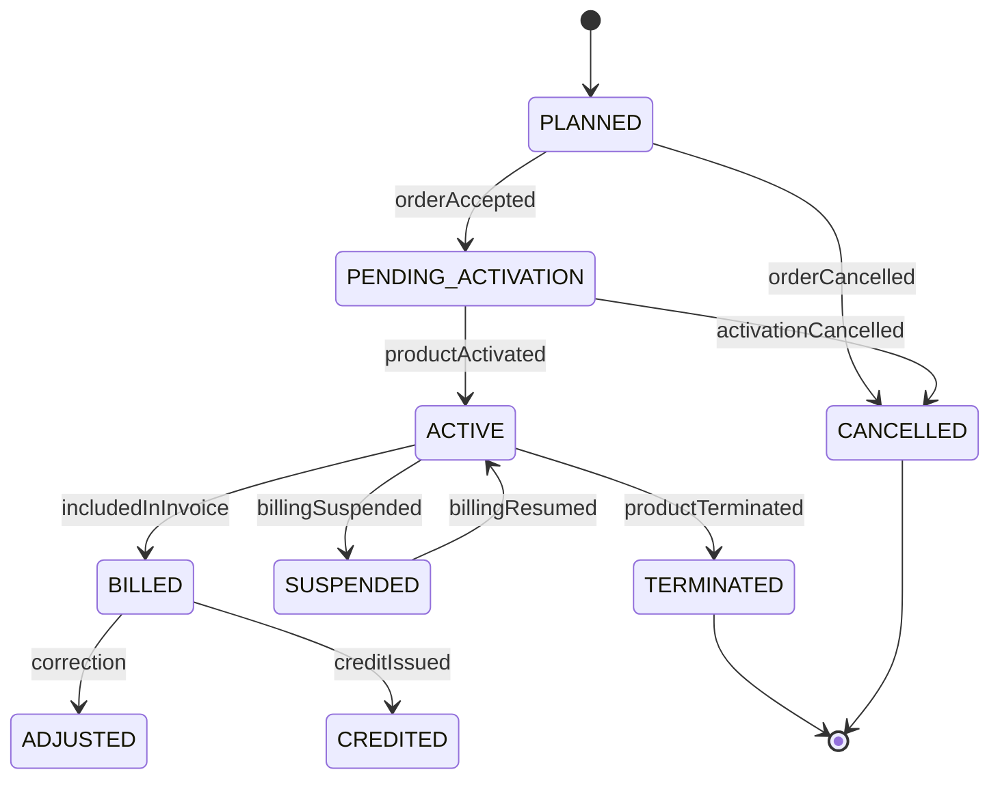
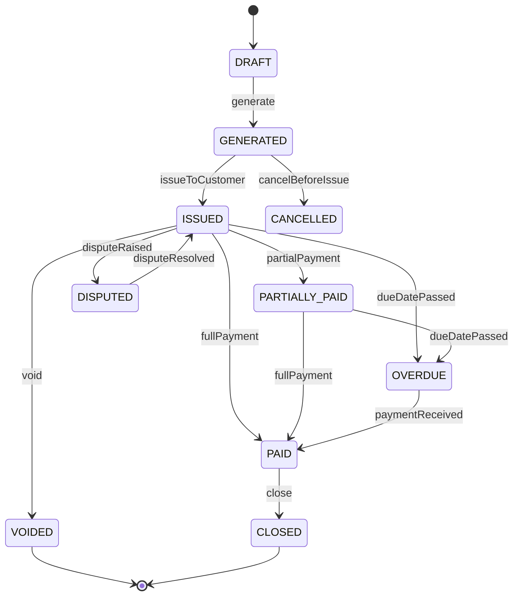
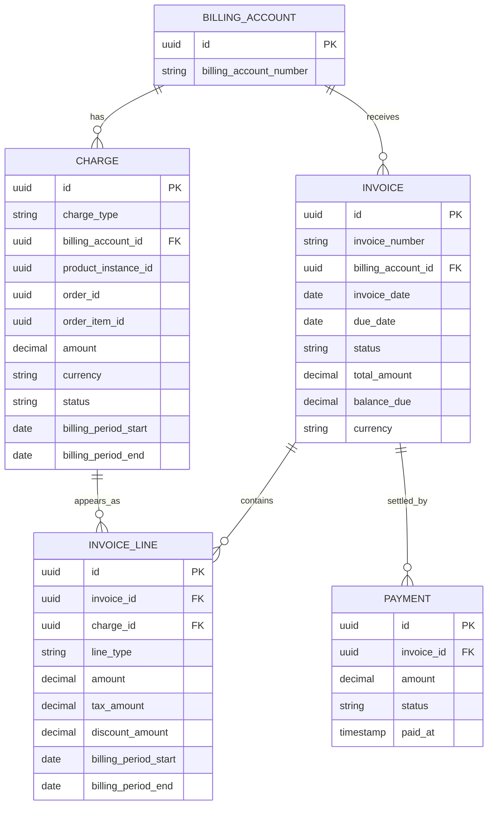

# Charge and Invoice Model

## 1. Core Idea

Charge and invoice modelling adalah bagian dari quote-to-cash yang mengubah commercial price dan fulfilled order menjadi financial billing artifact.

Quote price menjawab:

> Berapa harga yang ditawarkan dan disetujui?

Order/fulfillment menjawab:

> Apa yang benar-benar dieksekusi dan diaktifkan?

Charge menjawab:

> Apa yang harus ditagihkan, untuk periode apa, kepada billing account mana, berdasarkan produk/order/usage apa?

Invoice menjawab:

> Dokumen tagihan resmi apa yang dikirim ke payer, berisi line apa saja, total berapa, due date kapan, dan payment status apa?

Mental model:

> Price is commercial intent, charge is billable obligation, invoice is customer-facing billing document.

---

## 2. Why Charge and Invoice Modelling Matters

Banyak bug quote-to-cash terjadi karena sistem mencampur price, charge, invoice line, dan payment.

Contoh kesalahan:

- quote price dianggap invoice line,
- recurring charge dibuat sebelum activation,
- tax dihitung dari address yang salah,
- discount diterapkan dua kali,
- usage charge duplicate karena event retry,
- invoice line tidak bisa ditrace ke order item,
- payment status disimpan di order status,
- invoice total tidak sama dengan sum invoice lines,
- billing correction dilakukan tanpa credit/debit note,
- one-time charge muncul setiap billing cycle,
- cancelled order tetap menghasilkan invoice.

Charge and invoice model harus menjaga financial correctness, auditability, and reconciliation.

---

## 3. Price vs Charge vs Invoice Line

| Concept | Meaning | Lifecycle |
|---|---|---|
| Price | Commercial value defined in catalog/pricing/quote. | Before order/billing. |
| Charge | Billable obligation generated from product/order/usage. | Billing lifecycle. |
| Invoice line | Line item on a generated invoice. | Invoice document lifecycle. |
| Payment | Settlement against invoice/account. | Finance/payment lifecycle. |

Example:

```text
Catalog price:
  Business Internet recurring price = $100/month

Quote price snapshot:
  Customer accepted $90/month after discount

Charge:
  Recurring charge $90/month for product instance P-123, billing account BA-001

Invoice line:
  Invoice INV-001 line: $90 for 2026-08-01 to 2026-08-31

Payment:
  Customer paid invoice INV-001 on 2026-09-05
```

Do not collapse these into one table unless your domain is extremely simple.

---

## 4. Charge Types

Common charge types:

| Charge type | Meaning |
|---|---|
| One-time charge | Non-recurring charge, e.g. setup fee, installation fee. |
| Recurring charge | Periodic charge, e.g. monthly subscription. |
| Usage charge | Charge based on metered usage. |
| Tax charge | Tax/VAT/GST/SST/etc. |
| Discount charge | Discount as separate negative line or adjustment. |
| Credit | Amount reducing customer balance. |
| Debit | Additional amount increasing customer balance. |
| Penalty/fee | Early termination fee, late fee, service fee. |
| Adjustment | Manual/system correction. |

Charges should be typed because billing behavior differs.

---

## 5. Charge Lifecycle

Conceptual lifecycle:



Charge lifecycle must reflect product/order/billing lifecycle.

Important distinction:

- charge definition can be active over time,
- invoice line is a generated occurrence,
- payment is settlement after invoice.

---

## 6. Invoice Lifecycle

Conceptual invoice lifecycle:



Actual invoice lifecycle may be owned by external billing system. Internal system may only store references/status snapshots.

---

## 7. Core Charge Fields

Common fields:

| Field | Purpose |
|---|---|
| `id` | Internal charge ID. |
| `charge_number` | Business reference if needed. |
| `charge_type` | One-time, recurring, usage, tax, adjustment, etc. |
| `billing_account_id` | Payer responsibility. |
| `customer_id` | Customer context. |
| `product_instance_id` | Installed product related to charge. |
| `order_id` / `order_item_id` | Source order trace. |
| `quote_id` / `quote_item_id` | Accepted commercial trace if needed. |
| `price_snapshot_id` | Source price evidence. |
| `amount` | Charge amount. |
| `currency` | Billing currency. |
| `tax_profile_id` | Tax context. |
| `billing_period_start/end` | Period covered by charge. |
| `effective_from/to` | Validity of charge. |
| `status` | Planned, active, billed, cancelled, etc. |
| `external_charge_id` | Billing system reference. |
| `created_at` / `updated_at` | Technical timestamps. |

---

## 8. Core Invoice Fields

Common fields:

| Field | Purpose |
|---|---|
| `id` | Internal invoice ID. |
| `invoice_number` | Customer-facing invoice reference. |
| `billing_account_id` | Payer. |
| `customer_id` | Customer context. |
| `invoice_date` | Date invoice generated/issued. |
| `due_date` | Payment due date. |
| `billing_period_start/end` | Period covered. |
| `currency` | Invoice currency. |
| `subtotal_amount` | Amount before tax/adjustments depending semantics. |
| `tax_amount` | Total tax. |
| `discount_amount` | Total discount. |
| `total_amount` | Invoice total. |
| `amount_paid` | Settled amount. |
| `balance_due` | Outstanding amount. |
| `status` | Draft, issued, paid, overdue, voided, etc. |
| `external_invoice_id` | Billing system reference. |

Invoice total must be derived/reconciled from invoice lines. Avoid arbitrary manual total without line evidence.

---

## 9. Core Invoice Line Fields

Invoice line connects invoice to charge.

```text
invoice_line
- id
- invoice_id
- charge_id
- line_type
- description
- product_instance_id
- order_id
- order_item_id
- quantity
- unit_amount
- amount
- tax_amount
- discount_amount
- billing_period_start
- billing_period_end
- currency
```

Invoice line should support traceability:

```text
invoice line -> charge -> product instance -> order item -> quote item -> price snapshot
```

This trace is critical for disputes and reconciliation.

---

## 10. Conceptual ERD



---

## 11. One-Time Charge

One-time charge examples:

- setup fee,
- installation fee,
- activation fee,
- equipment fee,
- migration fee,
- cancellation fee,
- early termination fee.

Important fields:

- source order item,
- trigger event,
- effective date,
- bill once flag,
- external charge reference,
- billing account,
- tax category,
- status.

Critical invariant:

```text
A one-time charge must not be billed more than once for the same source event unless explicitly adjusted.
```

Use idempotency key:

```text
one_time_charge_key = order_item_id + charge_type + trigger_event
```

---

## 12. Recurring Charge

Recurring charge examples:

- monthly subscription fee,
- annual license fee,
- managed service fee,
- recurring add-on fee.

Recurring charge needs:

- start date,
- end date,
- billing frequency,
- billing cycle,
- proration policy,
- amount,
- currency,
- product instance,
- billing account,
- suspension behavior,
- cancellation behavior,
- renewal behavior.

A recurring charge is not the same as each invoice line. One recurring charge can generate many invoice lines over time.

---

## 13. Usage Charge

Usage charge is based on metered usage.

Data flow:

```text
Usage event -> mediation/aggregation -> rating -> rated usage -> usage charge -> invoice line
```

Usage charge needs:

- usage event reference,
- usage period,
- meter type,
- quantity/units,
- rating rule,
- rated amount,
- allowance/overage,
- aggregation key,
- duplicate detection key.

Usage is covered deeply in part 037, but charge model must reserve a place for usage charges.

---

## 14. Tax Modelling

Tax can be modelled as:

1. included in charge amount,
2. separate tax charge,
3. tax fields on invoice line,
4. tax summary table,
5. external tax engine reference.

Tax depends on:

- billing account,
- billing address,
- service address,
- product tax category,
- customer tax profile,
- jurisdiction,
- invoice date,
- tax exemption,
- legal entity.

Do not hard-code tax as a simple percent field unless domain guarantees it.

Tax evidence should be auditable.

---

## 15. Discount on Invoice

Discount can appear as:

- price already net of discount,
- separate negative charge,
- invoice line discount amount,
- promotion adjustment,
- credit note,
- billing system adjustment.

Important question:

> Is discount applied during quote pricing, charge generation, invoice generation, or payment settlement?

For traceability, preserve:

- discount reason,
- approval reference,
- promotion/agreement reference,
- quote price snapshot,
- charge discount,
- invoice line discount.

Avoid double discount.

---

## 16. Credit and Debit

Credit and debit are financial adjustments.

Credit examples:

- billing error refund,
- service outage credit,
- goodwill credit,
- overpayment adjustment,
- cancellation credit.

Debit examples:

- underbilling correction,
- late fee,
- penalty,
- manual adjustment.

Model:

```text
billing_adjustment
- id
- adjustment_type = CREDIT / DEBIT
- billing_account_id
- invoice_id nullable
- charge_id nullable
- amount
- currency
- reason_code
- approval_reference
- status
- created_at
```

Do not edit old invoice lines silently to correct financial outcome. Use adjustment/credit/debit where required by billing policy.

---

## 17. Billing Period

Billing period must be explicit.

Fields:

```text
billing_period_start
billing_period_end
```

Define:

- inclusive or exclusive end,
- timezone,
- date vs timestamp,
- proration rule,
- partial period handling,
- first invoice period,
- final invoice period,
- usage period vs invoice period.

Common rule:

```text
[start, end)
```

Meaning start inclusive, end exclusive. But verify internally.

Failure mode:

```text
Customer billed for one extra day due to inclusive/exclusive ambiguity.
```

---

## 18. Due Date and Payment Terms

Due date is derived from invoice date and payment terms.

Examples:

- due on receipt,
- net 15,
- net 30,
- net 45,
- custom enterprise term,
- due by fixed day of month.

Payment term may come from:

- billing profile,
- agreement,
- customer segment,
- invoice preference,
- external billing system.

Do not hard-code due date calculation in multiple services.

---

## 19. Payment Status

Payment status belongs to invoice/payment model, not order lifecycle.

Common statuses:

- unpaid,
- partially paid,
- paid,
- overdue,
- disputed,
- written off,
- refunded,
- voided.

Payment record fields:

```text
payment
- id
- invoice_id
- billing_account_id
- amount
- currency
- payment_method_reference
- status
- paid_at
- external_payment_id
```

If payment is owned by external billing/finance system, internal model may only store status snapshot/reference.

---

## 20. Charge Generation from Order

Charge generation should be linked to order fulfillment and product inventory.

Possible triggers:

- order item fulfilled,
- product instance activated,
- service activated,
- billing readiness event,
- manual billing trigger,
- billing cycle job,
- usage rating completion.

Charge generation must know:

- billing account,
- product instance,
- source order item,
- charge type,
- accepted price snapshot,
- tax context,
- billing period,
- effective date.

Do not generate charges only because quote was accepted unless business supports pre-billing.

---

## 21. Charge and Product Inventory

Charge should usually reference product instance for recurring service.

Why:

- customer modifies product,
- customer disconnects product,
- recurring billing stops,
- invoice dispute references active product,
- revenue by installed product,
- reconciliation active product vs active charge.

Potential invariant:

```text
Active recurring charge must reference an active or billable product instance unless it is a non-product account-level charge.
```

---

## 22. External Billing System Ownership

In many enterprise systems, invoice and payment are owned by external billing system.

Internal application may store:

- billing request,
- charge instruction,
- billing activation event,
- external charge ID,
- external invoice ID,
- invoice status snapshot,
- payment status snapshot,
- last sync time,
- reconciliation result.

Be clear on ownership:

| Data | Possible owner |
|---|---|
| Accepted price | CPQ/quote service. |
| Billing instruction | Order/billing integration service. |
| Charge master | Billing system. |
| Invoice | Billing system. |
| Payment | Finance/payment system. |
| Billing account | Billing system or customer/account service. |

Do not pretend internal system owns invoice if it only mirrors it.

---

## 23. Event Model

Events:

- `ChargePlanned`
- `ChargeActivated`
- `ChargeSuspended`
- `ChargeTerminated`
- `ChargeBilled`
- `InvoiceGenerated`
- `InvoiceIssued`
- `InvoicePaid`
- `InvoiceOverdue`
- `CreditIssued`
- `DebitIssued`
- `BillingMismatchDetected`

Event payload example:

```json
{
  "eventId": "uuid",
  "eventType": "ChargeActivated",
  "eventVersion": 1,
  "occurredAt": "2026-07-12T10:00:00Z",
  "chargeId": "charge-id",
  "billingAccountId": "billing-account-id",
  "productInstanceId": "product-instance-id",
  "orderId": "order-id",
  "orderItemId": "order-item-id",
  "chargeType": "RECURRING",
  "amount": "90.00",
  "currency": "USD",
  "effectiveFrom": "2026-08-01",
  "correlationId": "corr-123"
}
```

Be careful with financial/PII data in events. Publish only what consumers need.

---

## 24. PostgreSQL Physical Design

Conceptual charge table:

```sql
create table charge (
  id uuid primary key,
  charge_number text,
  charge_type text not null,
  billing_account_id uuid not null,
  customer_id uuid,
  product_instance_id uuid,
  order_id uuid,
  order_item_id uuid,
  quote_id uuid,
  quote_item_id uuid,
  price_snapshot_id uuid,
  amount numeric(18, 4) not null,
  currency char(3) not null,
  status text not null,
  billing_period_start date,
  billing_period_end date,
  effective_from timestamptz,
  effective_to timestamptz,
  external_charge_id text,
  idempotency_key text,
  created_at timestamptz not null,
  updated_at timestamptz not null
);
```

Invoice table:

```sql
create table invoice (
  id uuid primary key,
  invoice_number text not null unique,
  billing_account_id uuid not null,
  customer_id uuid,
  invoice_date date not null,
  due_date date,
  billing_period_start date,
  billing_period_end date,
  currency char(3) not null,
  subtotal_amount numeric(18, 4) not null,
  tax_amount numeric(18, 4) not null default 0,
  discount_amount numeric(18, 4) not null default 0,
  total_amount numeric(18, 4) not null,
  amount_paid numeric(18, 4) not null default 0,
  balance_due numeric(18, 4) not null,
  status text not null,
  external_invoice_id text,
  created_at timestamptz not null,
  updated_at timestamptz not null
);
```

Invoice line:

```sql
create table invoice_line (
  id uuid primary key,
  invoice_id uuid not null references invoice(id),
  charge_id uuid,
  line_type text not null,
  description text,
  product_instance_id uuid,
  order_id uuid,
  order_item_id uuid,
  quantity numeric(18, 4),
  unit_amount numeric(18, 4),
  amount numeric(18, 4) not null,
  tax_amount numeric(18, 4) not null default 0,
  discount_amount numeric(18, 4) not null default 0,
  billing_period_start date,
  billing_period_end date,
  currency char(3) not null
);
```

Useful indexes:

```sql
create index idx_charge_billing_account_status
on charge (billing_account_id, status, updated_at);

create index idx_charge_product_instance
on charge (product_instance_id, status);

create index idx_charge_order_item
on charge (order_item_id);

create unique index uq_charge_idempotency
on charge (idempotency_key)
where idempotency_key is not null;

create index idx_invoice_billing_account_status
on invoice (billing_account_id, status, invoice_date desc);

create index idx_invoice_line_charge
on invoice_line (charge_id);
```

---

## 25. Java/JAX-RS Backend Implications

Billing/charge APIs should be command-oriented:

```http
POST /charges
POST /charges/{id}/activate
POST /charges/{id}/terminate
POST /billing-triggers
GET /billing-accounts/{id}/charges
GET /billing-accounts/{id}/invoices
POST /billing-adjustments
```

Application service responsibilities:

- validate billing account,
- validate product/order linkage,
- enforce idempotency,
- compute or carry amount correctly,
- preserve accepted price snapshot,
- create charge/invoice references,
- write audit,
- publish events,
- reconcile external billing system.

Do not let order service create invoice lines directly if billing system owns invoice generation.

---

## 26. MyBatis/JPA/JDBC Implications

### MyBatis

Useful for:

- billing reconciliation queries,
- invoice line trace queries,
- charge lookup by product instance,
- billing account aging queries,
- batch charge activation.

### JPA

Be careful with:

- money precision,
- lazy loading invoice lines,
- accidental update of issued invoice,
- entity lifecycle callbacks generating financial side effects.

### JDBC

Useful for deterministic financial/billing integration writes and reconciliation jobs.

General rule:

> Financial data changes should be explicit commands with audit, not incidental entity mutation.

---

## 27. Reporting Impact

Charge/invoice model supports:

- monthly recurring revenue,
- one-time revenue,
- usage revenue,
- invoice aging,
- unpaid balance,
- overdue invoices,
- revenue by product,
- revenue by billing account,
- charge activation lag,
- billing error rate,
- credit/debit adjustments,
- tax reporting,
- churn/disconnect revenue impact.

Define carefully:

- booked vs billed vs collected revenue,
- charge amount vs invoice amount,
- net vs gross,
- tax included vs excluded,
- recurring vs one-time,
- invoice date vs service period,
- customer vs billing account revenue.

---

## 28. Reconciliation

Important reconciliations:

| Source | Target | Check |
|---|---|---|
| Fulfilled order item | Charge | Every billable fulfilled item has charge. |
| Active product instance | Active recurring charge | Active billable product is billed. |
| Terminated product instance | Recurring charge | Charge stopped at correct date. |
| Charge | Invoice line | Billed charges appear on invoice. |
| Invoice | Payment | Payment status matches finance system. |
| Billing account | Invoice | Invoice assigned to correct payer. |
| Quote price | Charge amount | Accepted price carried correctly. |

Example query:

```sql
-- Active recurring product without active charge
select pi.id as product_instance_id
from product_instance pi
left join charge c
  on c.product_instance_id = pi.id
 and c.charge_type = 'RECURRING'
 and c.status = 'ACTIVE'
where pi.status = 'ACTIVE'
  and c.id is null;
```

Adjust table names internally.

---

## 29. Data Quality Checks

```sql
-- Invoice total mismatch
select i.id, i.invoice_number, i.total_amount, sum(il.amount + il.tax_amount - il.discount_amount) as line_total
from invoice i
join invoice_line il on il.invoice_id = i.id
group by i.id, i.invoice_number, i.total_amount
having i.total_amount <> sum(il.amount + il.tax_amount - il.discount_amount);

-- Charge without billing account
select id, charge_type, order_id, order_item_id
from charge
where billing_account_id is null;

-- One-time charge duplicate by idempotency
select idempotency_key, count(*)
from charge
where charge_type = 'ONE_TIME'
  and idempotency_key is not null
group by idempotency_key
having count(*) > 1;
```

---

## 30. Security and Privacy

Charge/invoice data can be sensitive:

- customer billing information,
- pricing,
- discounts,
- tax details,
- payment references,
- invoice documents,
- billing address,
- commercial terms.

Controls:

- restrict access to invoice/charge APIs,
- mask payment references,
- avoid sensitive payload in events/logs,
- encrypt document storage if needed,
- audit invoice/adjustment access,
- define retention,
- handle legal hold.

---

## 31. Failure Modes

| Failure mode | Symptom | Likely cause | Prevention |
|---|---|---|---|
| Duplicate charge | Customer billed twice | Retry without idempotency | Charge idempotency key |
| Missing charge | Fulfilled product not billed | Billing trigger lost | Reconciliation active product vs charge |
| Wrong payer | Invoice to wrong account | Billing account not carried | Billing account snapshot |
| Wrong amount | Charge differs from accepted quote | Repricing or mapping error | Price snapshot carry-over |
| Tax mismatch | Invoice rejected/disputed | Wrong tax profile/address | Tax profile snapshot/validation |
| Billing period error | Over/under billing | Inclusive/exclusive ambiguity | Period semantics |
| Discount double applied | Revenue leakage | Discount applied at price and invoice | Discount trace |
| Invoice total mismatch | Financial report error | Line/total inconsistency | DB checks/reconciliation |
| Payment status wrong | Collection process wrong | External sync issue | Payment reconciliation |
| Silent correction | Audit gap | Manual update invoice/charge | Credit/debit/adjustment model |

---

## 32. PR Review Checklist

When reviewing charge/invoice changes, ask:

- Is this price, charge, invoice line, or payment?
- What is the source order/order item/product instance?
- What billing account owns the charge?
- Is accepted price snapshot preserved?
- Is charge type explicit?
- Is billing period explicit?
- Is charge idempotent?
- Is tax profile/address clear?
- Is discount applied once?
- Is one-time charge protected from duplicate billing?
- Is recurring charge lifecycle tied to product lifecycle?
- Is invoice line traceable to charge?
- Is payment status owned internally or externally?
- Are financial corrections modelled as credit/debit?
- Are events safe and versioned?
- Are reconciliation queries possible?
- Are money types and precision correct?
- Are issued invoices immutable or correction-controlled?

---

## 33. Internal Verification Checklist

Verify these in the internal CSG/team context:

- Whether charge, invoice, and payment are internally owned or external billing-owned.
- Whether order service creates charges or only billing instructions.
- Whether charge links to order item and product instance.
- Whether accepted quote price snapshot is carried to charge.
- Whether one-time/recurring/usage charge types are distinct.
- Whether billing period semantics are documented.
- Whether tax is calculated internally or externally.
- Whether invoice line is stored internally or mirrored from billing system.
- Whether invoice total reconciliation exists.
- Whether payment status is synced and how often.
- Whether credit/debit adjustments are modelled.
- Whether billing account is copied from quote/order or recalculated.
- Whether charge activation is triggered by fulfillment proof.
- Whether duplicate charge idempotency exists.
- Whether invoice/charge changes are audited.
- Whether billing events are outbox-backed.
- Whether incidents mention duplicate billing, missing charge, wrong tax, wrong payer, or invoice mismatch.

---

## 34. Summary

Charge and invoice modelling protects financial correctness.

A strong model must distinguish:

- price,
- charge,
- invoice line,
- payment,
- credit/debit,
- tax,
- billing period,
- billing account,
- product/order source,
- external billing ownership,
- lifecycle state,
- reconciliation evidence.

The key principle:

> Do not treat invoice as just a formatted order. Billing needs its own traceable, auditable, period-aware, financially correct data model.
