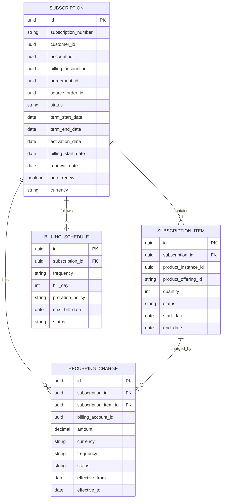
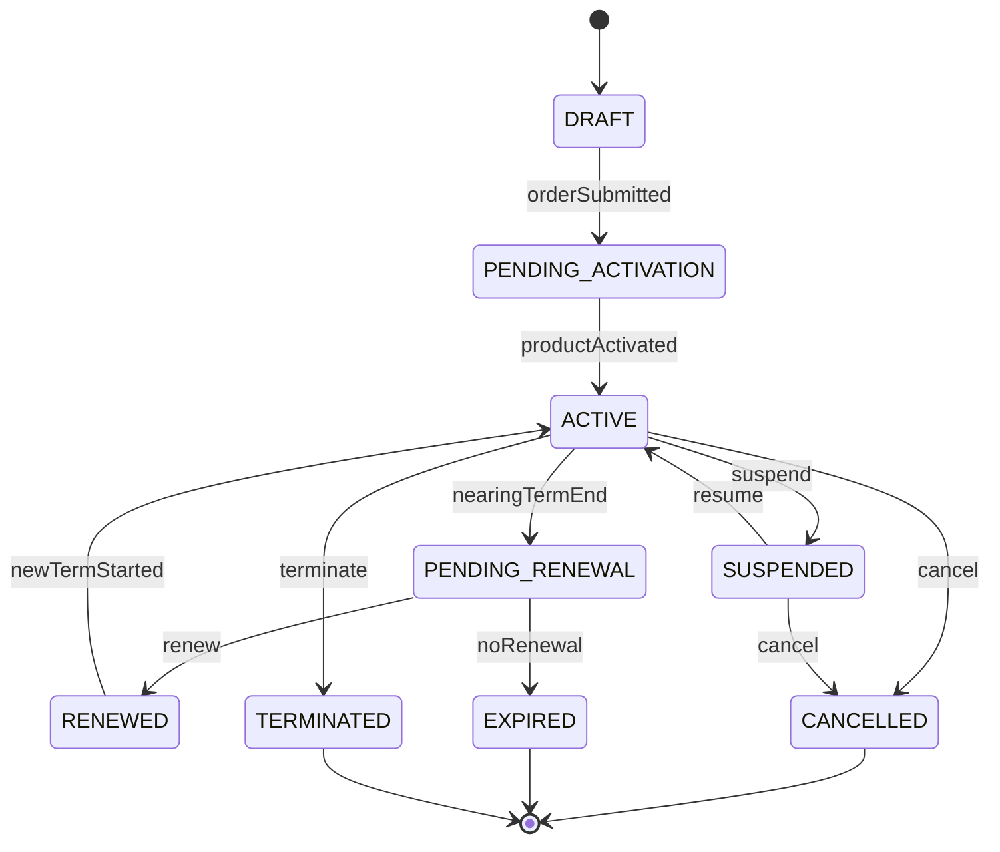

# Subscription and Recurring Revenue Model

## 1. Core Idea

Subscription is a long-lived commercial/product relationship that produces recurring billing and lifecycle obligations over time.

In CPQ / Quote-to-Cash / SaaS / Telco, a sale often does not end at order completion. It creates an ongoing subscription-like relationship:

- product/service remains active,
- customer is billed periodically,
- product may be modified,
- subscription may renew,
- customer may suspend/resume,
- customer may cancel,
- charges may be prorated,
- revenue must be reported over time,
- billing schedule must align with contract term and activation.

Mental model:

> Subscription is the recurring commercial lifecycle that connects product instance, contract term, recurring charge, billing schedule, renewal, cancellation, and revenue reporting.

---

## 2. Why Subscription Modelling Matters

Without explicit subscription model, recurring revenue systems become fragile.

Common failure modes:

- recurring charge continues after cancellation,
- subscription active but product terminated,
- product active but subscription not billed,
- renewal date missed,
- auto-renewal applied incorrectly,
- suspension does not pause service/billing correctly,
- cancellation date differs between order, product, and billing,
- contract term not enforced,
- revenue reporting counts one-time sales as recurring revenue,
- subscription quantity changes without billing adjustment,
- downgrade effective date misapplied,
- billing cycle not aligned to activation.

Subscription model creates a stable backbone for long-running commercial relationships.

---

## 3. Product Instance vs Subscription

Product instance and subscription are related but not always identical.

| Concept | Meaning |
|---|---|
| Product instance | Installed/active product owned/used by customer. |
| Subscription | Commercial recurring relationship and term/billing lifecycle. |
| Recurring charge | Billable recurring obligation. |
| Agreement/contract | Legal/commercial terms. |
| Billing schedule | Timing of invoice/charge generation. |

Example:

```text
Product instance:
  Business Internet Service at Jakarta Office

Subscription:
  24-month commercial subscription for that service

Recurring charge:
  $500/month

Billing schedule:
  monthly, invoice on day 1, due net 30
```

Some products are not subscription-based. Some subscriptions include multiple product instances. Verify internal semantics.

---

## 4. Core Subscription Fields

Common fields:

| Field | Purpose |
|---|---|
| `id` | Internal subscription ID. |
| `subscription_number` | Business reference. |
| `customer_id` | Customer context. |
| `account_id` | Account context. |
| `billing_account_id` | Payer. |
| `agreement_id` | Contract/agreement reference. |
| `source_order_id` | Order that created subscription. |
| `source_order_item_id` | Order item source. |
| `product_instance_id` | Product instance associated. |
| `status` | Draft, active, suspended, cancelled, expired, etc. |
| `term_start_date` | Contract/subscription term start. |
| `term_end_date` | Contract/subscription term end. |
| `activation_date` | When product/service became active. |
| `billing_start_date` | When recurring billing starts. |
| `renewal_date` | Renewal checkpoint. |
| `auto_renew` | Whether subscription renews automatically. |
| `currency` | Billing currency. |
| `quantity` | Subscription quantity if applicable. |
| `created_at` / `updated_at` | Technical timestamps. |

---

## 5. Subscription Item

Subscription may have items.

Examples:

- base product,
- add-on,
- seat/license quantity,
- usage allowance,
- support package,
- SLA package,
- optional feature.

Fields:

```text
subscription_item
- id
- subscription_id
- product_instance_id
- product_offering_id
- product_specification_id
- quantity
- status
- start_date
- end_date
- recurring_charge_id
- source_order_item_id
```

Why item model matters:

- add-on can start/end independently,
- quantity can change,
- plan can upgrade/downgrade,
- billing can be per item,
- product bundle can have recurring components,
- cancellation may be partial.

---

## 6. Conceptual ERD



---

## 7. Subscription Lifecycle

Conceptual lifecycle:



Internal states may differ. The important part is state meaning and billing effect.

---

## 8. Start Date Semantics

Many dates exist. Do not collapse them.

| Date | Meaning |
|---|---|
| Order date | Order was created/submitted. |
| Activation date | Product/service actually activated. |
| Term start date | Contract/subscription term begins. |
| Billing start date | Recurring billing begins. |
| Service start date | Service entitlement begins. |
| Invoice start date | First invoice period begins. |

These dates can differ.

Example:

```text
Order submitted: July 1
Service activated: July 10
Term starts: July 10
Billing starts: July 15 due promotion
First invoice: August 1
```

If one `start_date` field is used for all, billing and reporting will become wrong.

---

## 9. End Date Semantics

Likewise:

| Date | Meaning |
|---|---|
| Term end date | Contract term expires. |
| Cancellation requested date | Customer requested cancellation. |
| Cancellation effective date | Service/billing should end. |
| Termination date | Product/subscription ended. |
| Billing end date | Last billable date. |
| Service end date | Service entitlement ends. |

Cancellation effective date may be end of term, immediate, end of billing cycle, or custom date.

Define inclusive/exclusive period semantics.

---

## 10. Contract Term

Subscription term may come from:

- quote,
- agreement,
- product offering,
- pricing rule,
- promotion,
- manual sales input,
- renewal policy.

Fields:

```text
term_length
term_unit
term_start_date
term_end_date
minimum_commitment
early_termination_policy
renewal_policy
```

Term affects:

- price,
- discount,
- early termination fee,
- renewal,
- cancellation,
- revenue reporting,
- upgrade/downgrade eligibility.

---

## 11. Renewal Model

Renewal types:

| Type | Meaning |
|---|---|
| Auto-renewal | Subscription renews automatically unless cancelled. |
| Manual renewal | User/customer must renew. |
| Contract renewal | New agreement/term required. |
| Evergreen | Continues indefinitely until cancelled. |
| Fixed term no renewal | Ends at term end. |

Renewal fields:

```text
renewal_policy
auto_renew
renewal_notice_date
renewal_date
renewal_term_length
renewal_status
renewed_from_subscription_id
renewed_to_subscription_id
```

Renewal should be auditable because it affects commercial commitment and billing.

---

## 12. Auto-Renewal

Auto-renewal requires clear rules:

- when renewal is evaluated,
- who can disable it,
- whether notice is required,
- whether price changes,
- whether terms change,
- whether billing account remains same,
- whether customer must accept,
- whether regulatory/legal constraints apply.

Potential invariant:

```text
Auto-renewal cannot extend subscription if billing account is inactive or agreement prohibits renewal.
```

Do not implement auto-renewal as a blind date extension job.

---

## 13. Cancellation Model

Subscription cancellation differs from order cancellation.

Order cancellation stops an in-flight order.

Subscription cancellation ends an active recurring relationship.

Cancellation fields:

```text
subscription_cancellation
- id
- subscription_id
- requested_by
- reason_code
- requested_at
- effective_date
- cancellation_type
- status
- early_termination_fee_applicable
- billing_stop_date
- product_disconnect_order_id
```

Cancellation may trigger:

- disconnect order,
- charge termination,
- final invoice,
- credit/debit adjustment,
- product inventory termination,
- service deprovisioning.

---

## 14. Suspension and Resume

Suspension temporarily changes service/billing behavior.

Suspension fields:

```text
subscription_suspension
- id
- subscription_id
- reason_code
- status
- suspend_start_date
- expected_resume_date
- actual_resume_date
- billing_policy
- service_policy
```

Suspension policy options:

| Policy | Meaning |
|---|---|
| Service suspended, billing continues | Customer still pays. |
| Service suspended, billing paused | No recurring charge during suspension. |
| Service suspended, billing reduced | Discounted suspended rate. |
| Service suspended, term extends | Term end date pushed out. |
| Service suspended, term unchanged | Original term remains. |

Do not assume suspension means no billing.

---

## 15. Recurring Charge Model

Recurring charge fields:

```text
recurring_charge
- id
- subscription_id
- subscription_item_id
- billing_account_id
- product_instance_id
- amount
- currency
- frequency
- effective_from
- effective_to
- status
- price_snapshot_id
- discount_reference
- proration_policy
```

Recurring charge lifecycle should align with subscription/product lifecycle.

Possible statuses:

- planned,
- active,
- suspended,
- terminated,
- superseded,
- cancelled.

When plan changes, do not overwrite old recurring charge without history. Create new effective-dated charge or version.

---

## 16. Billing Schedule

Billing schedule determines when charges become invoice lines.

Fields:

```text
billing_schedule
- id
- subscription_id
- billing_account_id
- frequency
- bill_day
- timezone
- next_bill_date
- last_billed_date
- proration_policy
- invoice_in_advance
- status
```

Billing schedule may come from:

- billing account,
- agreement,
- subscription product,
- customer preference,
- billing system.

Make precedence explicit.

---

## 17. Proration

Proration handles partial periods.

Scenarios:

- subscription starts mid-cycle,
- subscription cancels mid-cycle,
- upgrade mid-cycle,
- downgrade mid-cycle,
- suspension mid-cycle,
- resume mid-cycle,
- billing cycle change.

Proration policy fields:

```text
proration_policy
- method
- rounding_rule
- minimum_charge
- apply_to_upgrade
- apply_to_downgrade
- apply_to_cancellation
```

Common methods:

- daily proration,
- monthly standard days,
- actual days,
- no proration,
- next-cycle effective,
- immediate charge/credit.

This must be explicit. Proration bugs create billing disputes.

---

## 18. Upgrade and Downgrade

Subscription modification can change recurring revenue.

Upgrade may:

- start new higher recurring charge immediately,
- prorate difference,
- reset term,
- preserve term,
- require approval,
- require fulfillment.

Downgrade may:

- take effect next billing cycle,
- be blocked during minimum term,
- create credit,
- reduce future recurring charge,
- require cancellation of add-ons.

Model:

```text
subscription_change
- id
- subscription_id
- change_type
- source_order_id
- effective_date
- before_snapshot
- after_snapshot
- billing_impact
- status
```

Do not simply overwrite subscription amount.

---

## 19. Quantity Changes

Quantity can affect recurring revenue.

Examples:

- SaaS seats,
- licenses,
- SIM cards,
- devices,
- service units.

Quantity change needs:

- previous quantity,
- new quantity,
- effective date,
- proration,
- source order,
- billing impact,
- audit.

Potential invariant:

```text
Subscription quantity change must create effective-dated recurring charge change or billing adjustment.
```

---

## 20. Revenue Recognition Awareness

Revenue recognition may be owned by finance/ERP, but data model should not block it.

Awareness points:

- one-time vs recurring revenue,
- billed vs earned revenue,
- service period,
- contract term,
- performance obligation,
- activation date,
- cancellation/refund,
- credit/debit adjustments,
- deferred revenue.

Do not claim to implement accounting rules unless system owns them. But preserve data needed by finance systems:

- service period,
- charge type,
- contract term,
- billing period,
- product/service classification,
- invoice date,
- effective dates.

---

## 21. Subscription and Product Inventory

Subscription should align with product inventory.

Possible relationships:

| Relationship | Meaning |
|---|---|
| One subscription -> one product instance | Simple recurring product. |
| One subscription -> many product instances | Bundle or multi-site. |
| One product instance -> one subscription item | Itemized billing. |
| Product instance without subscription | One-time product or non-recurring asset. |

Reconciliation:

```text
Active subscription item should have active product instance if service has been activated.
Terminated product instance should not have active recurring subscription charge unless policy allows.
```

---

## 22. Subscription and Agreement

Subscription may reference agreement/contract.

Agreement provides:

- term,
- renewal policy,
- cancellation policy,
- price protection,
- discount,
- SLA,
- legal entity,
- commitment,
- early termination fee.

Subscription should not duplicate all agreement text, but should carry enough reference/snapshot to enforce lifecycle and billing.

---

## 23. Event Model

Events:

- `SubscriptionCreated`
- `SubscriptionActivated`
- `SubscriptionSuspended`
- `SubscriptionResumed`
- `SubscriptionCancelled`
- `SubscriptionTerminated`
- `SubscriptionRenewalPending`
- `SubscriptionRenewed`
- `SubscriptionExpired`
- `SubscriptionQuantityChanged`
- `SubscriptionPlanChanged`
- `RecurringChargeActivated`
- `RecurringChargeTerminated`

Payload example:

```json
{
  "eventId": "uuid",
  "eventType": "SubscriptionActivated",
  "eventVersion": 1,
  "occurredAt": "2026-07-12T10:00:00Z",
  "subscriptionId": "subscription-id",
  "subscriptionNumber": "SUB-10001",
  "customerId": "customer-id",
  "billingAccountId": "billing-account-id",
  "productInstanceId": "product-instance-id",
  "termStartDate": "2026-08-01",
  "termEndDate": "2028-07-31",
  "billingStartDate": "2026-08-01",
  "correlationId": "corr-123"
}
```

---

## 24. PostgreSQL Physical Design

Subscription table:

```sql
create table subscription (
  id uuid primary key,
  subscription_number text not null unique,
  customer_id uuid not null,
  account_id uuid,
  billing_account_id uuid not null,
  agreement_id uuid,
  source_order_id uuid,
  source_order_item_id uuid,
  product_instance_id uuid,
  status text not null,
  term_start_date date,
  term_end_date date,
  activation_date date,
  billing_start_date date,
  cancellation_effective_date date,
  renewal_date date,
  auto_renew boolean not null default false,
  currency char(3) not null,
  quantity numeric(18,4),
  version integer not null default 0,
  created_at timestamptz not null,
  updated_at timestamptz not null
);
```

Subscription item:

```sql
create table subscription_item (
  id uuid primary key,
  subscription_id uuid not null references subscription(id),
  product_instance_id uuid,
  product_offering_id text,
  product_offering_version text,
  product_specification_id text,
  quantity numeric(18,4) not null default 1,
  status text not null,
  start_date date,
  end_date date,
  source_order_item_id uuid,
  created_at timestamptz not null,
  updated_at timestamptz not null
);
```

Recurring charge:

```sql
create table recurring_charge (
  id uuid primary key,
  subscription_id uuid not null references subscription(id),
  subscription_item_id uuid references subscription_item(id),
  billing_account_id uuid not null,
  product_instance_id uuid,
  amount numeric(18,4) not null,
  currency char(3) not null,
  frequency text not null,
  status text not null,
  effective_from date not null,
  effective_to date,
  price_snapshot_id uuid,
  proration_policy text,
  created_at timestamptz not null,
  updated_at timestamptz not null
);
```

Billing schedule:

```sql
create table billing_schedule (
  id uuid primary key,
  subscription_id uuid not null references subscription(id),
  billing_account_id uuid not null,
  frequency text not null,
  bill_day integer,
  timezone text,
  next_bill_date date,
  last_billed_date date,
  proration_policy text,
  invoice_in_advance boolean,
  status text not null,
  created_at timestamptz not null,
  updated_at timestamptz not null
);
```

Useful indexes:

```sql
create index idx_subscription_customer_status
on subscription (customer_id, status, updated_at);

create index idx_subscription_billing_account_status
on subscription (billing_account_id, status);

create index idx_subscription_renewal_date
on subscription (renewal_date)
where status in ('ACTIVE', 'PENDING_RENEWAL');

create index idx_subscription_product_instance
on subscription (product_instance_id);

create index idx_recurring_charge_subscription_status
on recurring_charge (subscription_id, status);

create index idx_billing_schedule_next_bill
on billing_schedule (next_bill_date, status);
```

---

## 25. Java/JAX-RS Backend Implications

Example APIs:

```http
GET /subscriptions/{id}
GET /customers/{customerId}/subscriptions
POST /subscriptions/{id}/activate
POST /subscriptions/{id}/suspend
POST /subscriptions/{id}/resume
POST /subscriptions/{id}/cancel
POST /subscriptions/{id}/renew
POST /subscriptions/{id}/change-plan
POST /subscriptions/{id}/change-quantity
```

Command service responsibilities:

- validate lifecycle transition,
- validate billing account,
- validate agreement term,
- validate product inventory status,
- compute effective dates,
- update recurring charge version,
- update billing schedule,
- write audit/history,
- publish events,
- trigger billing integration.

Avoid generic patch for status/amount/date changes.

---

## 26. MyBatis/JPA/JDBC Implications

### MyBatis

Useful for:

- renewal candidate queries,
- billing schedule jobs,
- active subscription lookup,
- effective-dated recurring charge query,
- reconciliation queries.

### JPA

Be careful with:

- effective-dated child collections,
- accidental mutation of old recurring charge,
- lazy loading subscription items/charges,
- optimistic locking on subscription changes.

### JDBC

Useful for billing cycle jobs and batch renewal/expiration processing.

General rule:

> Subscription lifecycle changes should be explicit commands that create history/effective-dated records, not silent updates.

---

## 27. Reporting Impact

Subscription model supports:

- monthly recurring revenue,
- annual recurring revenue,
- active subscriptions,
- churn,
- renewal rate,
- cancellation rate,
- suspension rate,
- expansion revenue,
- contraction revenue,
- upgrade/downgrade rate,
- average revenue per account,
- product recurring revenue,
- billing schedule forecast,
- renewal pipeline.

Define:

- active subscription,
- billable subscription,
- suspended subscription,
- churn date,
- renewal date,
- expansion/contraction,
- MRR calculation,
- gross vs net recurring revenue.

---

## 28. Reconciliation

Important reconciliations:

| Source | Target | Check |
|---|---|---|
| Subscription | Product inventory | Active subscription has active product/service if activated. |
| Subscription | Recurring charge | Active subscription has active recurring charge. |
| Recurring charge | Invoice line | Active charge is billed per schedule. |
| Cancellation | Charge | Cancelled subscription stops charge correctly. |
| Suspension | Billing | Suspended subscription billing follows policy. |
| Renewal | Agreement | Renewal term agrees with contract. |
| Product termination | Subscription | Terminated product stops subscription. |

Example:

```sql
-- Active subscriptions without active recurring charge
select s.id, s.subscription_number
from subscription s
left join recurring_charge rc
  on rc.subscription_id = s.id
 and rc.status = 'ACTIVE'
where s.status = 'ACTIVE'
  and rc.id is null;

-- Cancelled subscriptions with active recurring charge
select s.id, s.subscription_number, rc.id as recurring_charge_id
from subscription s
join recurring_charge rc on rc.subscription_id = s.id
where s.status in ('CANCELLED', 'TERMINATED')
  and rc.status = 'ACTIVE';
```

---

## 29. Data Quality Checks

```sql
-- Active subscription past term end without renewal/evergreen semantics
select id, subscription_number, term_end_date, status
from subscription
where status = 'ACTIVE'
  and term_end_date < current_date
  and auto_renew = false;

-- Subscription billing start before activation
select id, subscription_number, activation_date, billing_start_date
from subscription
where activation_date is not null
  and billing_start_date is not null
  and billing_start_date < activation_date;

-- Recurring charge effective period invalid
select id, subscription_id, effective_from, effective_to
from recurring_charge
where effective_to is not null
  and effective_to <= effective_from;
```

These are examples; internal business rules may allow exceptions.

---

## 30. Security and Privacy

Subscription data can expose:

- customer/account relationship,
- contract term,
- pricing/discount,
- billing account,
- product usage entitlement,
- cancellation reason,
- credit/billing status.

Controls:

- role-based access,
- audit subscription changes,
- avoid sensitive event payload,
- protect cancellation/reason data,
- protect pricing and recurring revenue fields,
- define retention/history policy.

---

## 31. Failure Modes

| Failure mode | Symptom | Likely cause | Prevention |
|---|---|---|---|
| Active subscription not billed | Revenue leakage | Missing recurring charge | Reconciliation |
| Cancelled subscription still billed | Customer dispute | Charge not terminated | Cancellation-charge linkage |
| Product active but subscription inactive | Reporting/billing mismatch | Activation sync failure | Product-subscription reconciliation |
| Renewal missed | Subscription expires unexpectedly | No renewal job/monitor | Renewal schedule and alerts |
| Auto-renewal wrong | Customer dispute | Weak policy model | Explicit renewal policy |
| Suspension billing wrong | Over/under billing | Billing policy unclear | Suspension policy model |
| Plan change overwrites history | Cannot audit old amount | Mutable recurring charge | Effective-dated charge |
| Quantity change not billed | Revenue leakage | No charge update | Quantity-change command |
| Wrong MRR | Executive reporting wrong | Poor recurring definition | Reporting semantic dictionary |
| Term date ambiguity | Contract/billing mismatch | Collapsed date fields | Separate term/billing/service dates |

---

## 32. PR Review Checklist

When reviewing subscription changes, ask:

- Is this product instance, subscription, charge, or invoice concern?
- What creates the subscription?
- What activates it?
- What date starts term, service, and billing?
- Is billing account explicit?
- Is agreement/contract reference carried?
- Are subscription items needed?
- Is recurring charge effective-dated?
- Is billing schedule explicit?
- Is proration policy explicit?
- How does cancellation stop billing?
- How does suspension affect service and billing?
- How does renewal work?
- Is auto-renewal guarded?
- Are upgrade/downgrade/quantity changes versioned?
- Are events outbox-backed?
- Are reconciliation checks available?
- Are MRR/reporting definitions updated?

---

## 33. Internal Verification Checklist

Verify these in the internal CSG/team context:

- Whether subscription is a first-class entity or derived from product inventory/billing.
- Whether subscription item exists.
- Whether product instance maps one-to-one or one-to-many to subscription.
- Whether recurring charge is stored internally or external billing-owned.
- Whether billing schedule is stored internally or external billing-owned.
- Whether term start, activation date, billing start, and service start are distinct.
- Whether cancellation effective date and billing stop date are distinct.
- Whether suspension/resume exist and how they affect billing.
- Whether renewal policy exists.
- Whether auto-renewal exists and is audited.
- Whether recurring charge changes are effective-dated.
- Whether plan/quantity changes preserve history.
- Whether subscription references agreement/contract.
- Whether revenue/MRR reporting is based on subscription, charge, invoice, or external billing.
- Whether reconciliation exists between subscription, product inventory, charge, invoice.
- Whether incidents mention recurring charge not stopped, missed renewal, active product not billed, or wrong MRR.

---

## 34. Summary

Subscription model is the backbone for recurring commercial relationships.

A strong model must define:

- subscription identity,
- subscription item,
- product instance relationship,
- billing account,
- agreement/term,
- activation date,
- billing start date,
- renewal policy,
- auto-renewal,
- cancellation,
- suspension/resume,
- recurring charge,
- billing schedule,
- proration,
- effective-dated changes,
- reconciliation,
- recurring revenue reporting.

The key principle:

> Do not model recurring revenue as repeated invoices only. Model the subscription lifecycle that explains why recurring charges exist, when they start, when they stop, and how they change over time.
