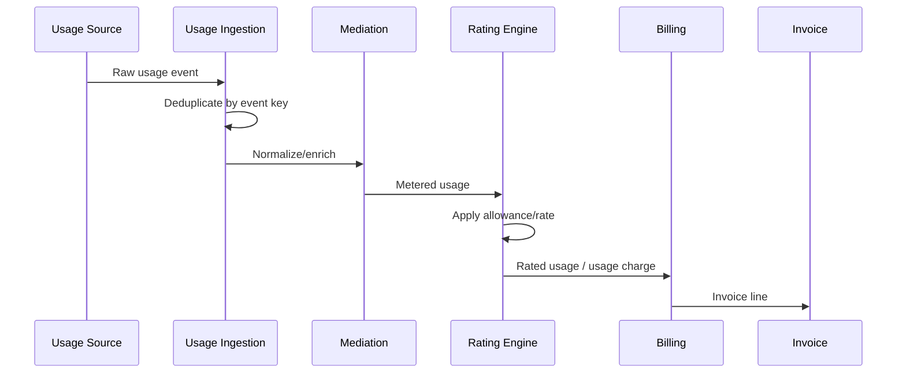

# Usage and Rating Data Model

## 1. Core Idea

Usage and rating modelling menjawab pertanyaan:

> Bagaimana raw consumption event berubah menjadi billable usage charge yang benar, traceable, non-duplicate, period-aware, dan bisa direkonsiliasi?

Dalam CPQ / Billing / Telco BSS / SaaS usage-based billing, tidak semua revenue berasal dari fixed recurring charge. Banyak produk memiliki komponen usage:

- API calls,
- data usage,
- SMS/voice minutes,
- bandwidth burst,
- storage consumption,
- transaction count,
- seats used,
- device events,
- metered feature usage,
- overage above allowance,
- pay-as-you-go service.

Usage data biasanya bergerak melalui beberapa tahap:

```text
Raw usage event
  -> mediation/normalization
  -> deduplication
  -> aggregation
  -> rating
  -> rated usage
  -> usage charge
  -> invoice line
```

Mental model:

> Usage event is evidence of consumption. Rating turns consumption into money. Billing turns rated usage into invoice obligation.

---

## 2. Why Usage and Rating Modelling Matters

Usage-based billing is correctness-sensitive.

Common failure modes:

- duplicate usage billed twice,
- missing usage not billed,
- wrong billing period,
- wrong customer/product mapping,
- stale price/rating rule,
- allowance not applied,
- overage calculated incorrectly,
- usage event arrives late,
- rating rerun creates duplicate charge,
- timezone boundary shifts usage into wrong invoice,
- usage correction lacks audit,
- invoice dispute cannot trace usage source.

Usage data can be high volume and often arrives asynchronously. It needs stronger idempotency, period semantics, and reconciliation than ordinary order data.

---

## 3. Core Concepts

| Concept | Meaning |
|---|---|
| Usage event | Raw event representing consumption. |
| Metered usage | Normalized measured consumption. |
| Mediation | Cleaning, normalization, enrichment, deduplication. |
| Aggregation | Grouping usage by period/product/customer/billing key. |
| Rating | Applying price/rate/allowance to usage. |
| Rated usage | Usage after monetary calculation. |
| Usage charge | Billable charge generated from rated usage. |
| Allowance | Included usage quantity before overage. |
| Overage | Usage beyond allowance. |
| Usage period | Time interval covered by usage. |
| Rating error | Failure to rate due to missing data/rule/mapping. |

Do not collapse all into one "usage" table unless the product is very simple.

---

## 4. Usage Event vs Rated Usage vs Usage Charge

| Layer | Purpose | Example |
|---|---|---|
| Usage event | Records consumption fact | Customer used 1 GB at timestamp X. |
| Metered usage | Normalized/validated usage | 1.000 GB data usage for product P. |
| Aggregated usage | Period/group total | 125 GB for billing period July. |
| Rated usage | Monetary calculation | 25 GB over allowance x $2 = $50. |
| Usage charge | Billable object | Charge $50 to billing account BA-001. |
| Invoice line | Customer-facing line | July data overage: $50. |

Separation gives traceability and re-rating ability.

---

## 5. Usage-to-Billing Flow



Each step should produce auditable state or at least durable event/checkpoint.

---

## 6. Usage Event Model

Core fields:

| Field | Purpose |
|---|---|
| `id` | Internal event ID. |
| `source_event_id` | External/source idempotency key. |
| `source_system` | Where usage originated. |
| `customer_id` | Customer context if known. |
| `account_id` | Account context if known. |
| `billing_account_id` | Payer if known/resolved. |
| `product_instance_id` | Installed product using the service. |
| `subscription_id` | Subscription context if applicable. |
| `meter_type` | What is measured. |
| `quantity` | Measured amount. |
| `unit_of_measure` | GB, call, minute, request, seat, etc. |
| `usage_timestamp` | When usage happened. |
| `received_at` | When system received event. |
| `usage_period_start/end` | Period if event is already aggregated. |
| `status` | Received, mediated, rated, rejected, duplicate, etc. |
| `correlation_id` | Traceability. |
| `raw_payload_reference` | Optional raw payload reference. |

Do not assume usage timestamp equals received timestamp.

---

## 7. Source Event Identity and Deduplication

Usage ingestion must prevent duplicate billing.

Deduplication keys can include:

- source system,
- source event ID,
- product instance ID,
- meter type,
- usage timestamp,
- sequence number,
- file batch ID + line number,
- idempotency key,
- hash of normalized payload.

Recommended:

```text
dedupe_key = source_system + source_event_id
```

If source has no reliable event ID, create deterministic hash carefully.

PostgreSQL example:

```sql
create unique index uq_usage_event_source
on usage_event (source_system, source_event_id)
where source_event_id is not null;
```

Be careful with reprocessing. Reprocessing should not create duplicate billable records.

---

## 8. Mediation Awareness

Mediation transforms raw usage into trusted metered usage.

Mediation can include:

- schema validation,
- unit conversion,
- timezone normalization,
- customer/product enrichment,
- duplicate detection,
- missing field repair,
- filtering non-billable events,
- mapping source service ID to product instance,
- splitting aggregated records,
- normalizing event type,
- error routing.

Mediation result should be persisted or traceable.

Conceptual entity:

```text
metered_usage
- id
- usage_event_id
- product_instance_id
- subscription_id
- billing_account_id
- meter_type
- normalized_quantity
- unit_of_measure
- usage_timestamp
- usage_period_start
- usage_period_end
- mediation_status
- mediation_rule_version
```

---

## 9. Usage Period

Usage period determines which invoice/billing cycle gets the usage.

Fields:

```text
usage_period_start
usage_period_end
```

Define:

- start inclusive or exclusive,
- end inclusive or exclusive,
- timezone,
- billing cycle alignment,
- late-arriving usage policy,
- correction window,
- rerating window.

Recommended convention:

```text
[start, end)
```

But verify internally.

Failure mode:

```text
Usage at midnight billed in wrong month due to timezone conversion.
```

Store timestamps in UTC and preserve source timezone if needed.

---

## 10. Late-Arriving Usage

Usage can arrive after invoice generation.

Policies:

| Policy | Meaning |
|---|---|
| Bill in next invoice | Late usage is billed later. |
| Reopen invoice | Rare and complex. |
| Create adjustment | Credit/debit adjustment. |
| Reject after cutoff | Usage beyond window not billed. |
| Hold invoice until cutoff | Wait before invoice generation. |

Model fields:

```text
received_at
usage_timestamp
billing_cutoff_at
late_usage_flag
late_usage_policy
adjustment_reference
```

Late usage must be auditable because it can cause customer disputes.

---

## 11. Aggregation Model

Aggregation groups usage before rating or billing.

Aggregation keys may include:

- billing account,
- product instance,
- subscription,
- meter type,
- usage period,
- rating plan,
- product offering,
- tenant,
- currency,
- allowance bucket.

Conceptual table:

```text
usage_aggregation
- id
- aggregation_key
- billing_account_id
- product_instance_id
- subscription_id
- meter_type
- period_start
- period_end
- total_quantity
- unit_of_measure
- status
- source_event_count
- created_at
```

Aggregation should be deterministic and rerunnable.

---

## 12. Rating Model

Rating applies commercial rule to metered/aggregated usage.

Inputs:

- rated quantity,
- unit,
- product/price plan,
- rating rule,
- allowance,
- discount,
- tier/volume rule,
- currency,
- billing account,
- usage period,
- subscription term,
- effective date,
- tax context if applicable.

Output:

- rated amount,
- chargeable quantity,
- allowance consumed,
- overage quantity,
- rate applied,
- rating rule version,
- rating trace.

Rating must use the correct effective price/rule, not just the latest rule.

---

## 13. Rating Rule Version

Rating rule should be versioned/effective-dated.

Fields:

```text
rating_rule_id
rating_rule_version
effective_from
effective_to
meter_type
unit_rate
tier_definition
allowance_policy
currency
```

Rated usage should record:

```text
rating_rule_id
rating_rule_version
price_snapshot_id
rated_at
```

This is critical for disputes and rerating.

---

## 14. Rated Usage Model

```text
rated_usage
- id
- metered_usage_id nullable
- aggregation_id nullable
- billing_account_id
- product_instance_id
- subscription_id
- meter_type
- rated_quantity
- allowance_quantity
- overage_quantity
- unit_rate
- rated_amount
- currency
- rating_rule_id
- rating_rule_version
- rating_status
- rated_at
```

Rated usage may be per event or per aggregate depending volume and billing design.

For high-volume systems, rating per aggregate is common.

---

## 15. Allowance Model

Allowance defines included quantity.

Examples:

- 100 GB/month included,
- 1000 API calls/day included,
- unlimited within fair use,
- pooled allowance across accounts,
- rollover allowance,
- shared family/team allowance.

Allowance fields:

```text
allowance_bucket
- id
- subscription_id
- product_instance_id
- billing_account_id
- meter_type
- period_start
- period_end
- included_quantity
- consumed_quantity
- remaining_quantity
- unit_of_measure
- status
```

Allowance consumption must be concurrency-safe.

Possible failure:

```text
Two rating workers consume same allowance simultaneously and undercharge/overcharge.
```

Use locking, partitioning, or deterministic aggregation.

---

## 16. Overage Model

Overage is chargeable usage beyond allowance.

Fields:

```text
overage_usage
- rated_usage_id
- allowance_bucket_id
- overage_quantity
- unit_rate
- amount
```

Overage policies:

- immediate billing,
- end-of-cycle billing,
- capped overage,
- throttling instead of billing,
- tiered overage,
- notification threshold.

Overage should be traceable to allowance bucket and rating rule.

---

## 17. Tiered and Volume Rating

Rating may use:

- flat rate,
- tiered rate,
- volume rate,
- stepped pricing,
- included allowance + overage,
- minimum commitment,
- maximum cap,
- blended rate.

Example tier:

```text
0-100 GB included
101-500 GB = $2/GB
501+ GB = $1.50/GB
```

Rated usage should preserve rating breakdown if dispute is possible.

Conceptual entity:

```text
rated_usage_breakdown
- rated_usage_id
- tier_start
- tier_end
- quantity
- unit_rate
- amount
```

---

## 18. Usage Charge Generation

Rated usage becomes usage charge.

Charge fields should link back:

```text
charge
- charge_type = USAGE
- rated_usage_id
- aggregation_id
- billing_account_id
- product_instance_id
- amount
- currency
- billing_period_start
- billing_period_end
- idempotency_key
```

Idempotency key example:

```text
usage_charge_key = billing_account_id + product_instance_id + meter_type + period_start + period_end + rating_run_id
```

Be careful if rerating can replace prior usage charge. Use adjustment/supersede model.

---

## 19. Rating Error Model

Rating can fail.

Reasons:

- missing product instance mapping,
- missing billing account,
- missing rating rule,
- invalid unit,
- invalid currency,
- no active subscription,
- usage outside service period,
- allowance bucket missing,
- duplicate event,
- negative quantity not allowed,
- malformed source payload.

Rating error table:

```text
usage_rating_error
- id
- usage_event_id
- metered_usage_id
- aggregation_id
- error_code
- error_message
- retryable
- status
- owner_group
- detected_at
- resolved_at
```

Do not silently drop unrated usage.

---

## 20. Rerating

Rerating recalculates usage due to:

- corrected rating rule,
- corrected usage event,
- late usage,
- wrong allowance,
- wrong product mapping,
- customer dispute,
- billing correction.

Rerating must avoid duplicate charge.

Strategies:

| Strategy | Meaning |
|---|---|
| Supersede rated usage | Mark old rated usage superseded, create new. |
| Adjustment charge | Keep old invoice, create credit/debit. |
| Reopen billing period | Complex; depends billing system. |
| Reprocess before invoice | Safe if invoice not issued. |

Fields:

```text
rating_run
- id
- run_type
- period_start
- period_end
- status
- reason_code
- supersedes_run_id
```

---

## 21. Conceptual ERD

```mermaid
erDiagram
    USAGE_EVENT {
        uuid id PK
        string source_system
        string source_event_id
        string meter_type
        decimal quantity
        string unit_of_measure
        timestamp usage_timestamp
        timestamp received_at
        string status
    }

    METERED_USAGE {
        uuid id PK
        uuid usage_event_id FK
        uuid product_instance_id
        uuid subscription_id
        uuid billing_account_id
        string meter_type
        decimal normalized_quantity
        string unit_of_measure
        timestamp usage_period_start
        timestamp usage_period_end
        string mediation_status
    }

    USAGE_AGGREGATION {
        uuid id PK
        uuid billing_account_id
        uuid product_instance_id
        string meter_type
        timestamp period_start
        timestamp period_end
        decimal total_quantity
        string status
    }

    RATED_USAGE {
        uuid id PK
        uuid aggregation_id FK
        decimal rated_quantity
        decimal allowance_quantity
        decimal overage_quantity
        decimal rated_amount
        string currency
        string rating_rule_version
        string status
    }

    CHARGE {
        uuid id PK
        uuid rated_usage_id FK
        string charge_type
        decimal amount
        string currency
        string status
    }

    USAGE_EVENT ||--o{ METERED_USAGE : normalizes_to
    METERED_USAGE ||--o{ USAGE_AGGREGATION : aggregates_into
    USAGE_AGGREGATION ||--o{ RATED_USAGE : rated_as
    RATED_USAGE ||--o{ CHARGE : generates
```



---

## 22. PostgreSQL Physical Design

Usage event:

```sql
create table usage_event (
  id uuid primary key,
  source_system text not null,
  source_event_id text,
  customer_id uuid,
  account_id uuid,
  billing_account_id uuid,
  product_instance_id uuid,
  subscription_id uuid,
  meter_type text not null,
  quantity numeric(24, 8) not null,
  unit_of_measure text not null,
  usage_timestamp timestamptz not null,
  received_at timestamptz not null,
  usage_period_start timestamptz,
  usage_period_end timestamptz,
  status text not null,
  correlation_id text,
  raw_payload_reference text,
  created_at timestamptz not null
);
```

Metered usage:

```sql
create table metered_usage (
  id uuid primary key,
  usage_event_id uuid references usage_event(id),
  billing_account_id uuid,
  product_instance_id uuid,
  subscription_id uuid,
  meter_type text not null,
  normalized_quantity numeric(24, 8) not null,
  unit_of_measure text not null,
  usage_period_start timestamptz not null,
  usage_period_end timestamptz not null,
  mediation_status text not null,
  mediation_rule_version text,
  created_at timestamptz not null
);
```

Rated usage:

```sql
create table rated_usage (
  id uuid primary key,
  aggregation_id uuid,
  billing_account_id uuid not null,
  product_instance_id uuid,
  subscription_id uuid,
  meter_type text not null,
  rated_quantity numeric(24, 8) not null,
  allowance_quantity numeric(24, 8),
  overage_quantity numeric(24, 8),
  unit_rate numeric(18, 8),
  rated_amount numeric(18, 4) not null,
  currency char(3) not null,
  rating_rule_id text,
  rating_rule_version text,
  rating_status text not null,
  rated_at timestamptz not null
);
```

Useful indexes:

```sql
create unique index uq_usage_source_event
on usage_event (source_system, source_event_id)
where source_event_id is not null;

create index idx_usage_event_timestamp
on usage_event (usage_timestamp);

create index idx_metered_usage_product_period
on metered_usage (product_instance_id, usage_period_start, usage_period_end);

create index idx_rated_usage_billing_period
on rated_usage (billing_account_id, rated_at);

create index idx_rated_usage_product_meter
on rated_usage (product_instance_id, meter_type, rated_at);
```

For high-volume usage, partitioning by time is often necessary.

---

## 23. Java/JAX-RS Backend Implications

Usage APIs and services should separate ingestion from rating.

Possible APIs:

```http
POST /usage-events
POST /usage-batches
POST /rating-runs
GET /billing-accounts/{id}/rated-usage
GET /usage-events/{id}/trace
POST /rated-usage/{id}/rerate
```

Service structure:

```text
UsageIngestionResource
  -> UsageIngestionService
      -> DeduplicationPolicy
      -> UsageEventRepository
      -> OutboxRepository

MediationWorker
  -> MediationService
      -> ProductMappingClient
      -> BillingAccountResolver
      -> MeteredUsageRepository

RatingWorker
  -> RatingService
      -> RatingRuleRepository
      -> AllowanceService
      -> RatedUsageRepository
      -> ChargeRepository
```

Keep ingestion idempotent and rating reproducible.

---

## 24. Event Model

Events:

- `UsageEventReceived`
- `UsageEventDeduplicated`
- `UsageMediated`
- `UsageMediationFailed`
- `UsageAggregated`
- `UsageRated`
- `UsageRatingFailed`
- `UsageChargeGenerated`
- `UsageRerated`
- `LateUsageDetected`

Payload example:

```json
{
  "eventId": "uuid",
  "eventType": "UsageRated",
  "eventVersion": 1,
  "occurredAt": "2026-07-12T10:00:00Z",
  "ratedUsageId": "rated-usage-id",
  "billingAccountId": "billing-account-id",
  "productInstanceId": "product-instance-id",
  "meterType": "DATA_GB",
  "periodStart": "2026-07-01T00:00:00Z",
  "periodEnd": "2026-08-01T00:00:00Z",
  "ratedAmount": "50.00",
  "currency": "USD",
  "ratingRuleVersion": "2026.07",
  "correlationId": "corr-123"
}
```

Avoid sending full raw usage payload unless consumers require it.

---

## 25. Reporting Impact

Usage/rating supports:

- usage volume by product,
- overage revenue,
- usage revenue,
- allowance consumption,
- top usage customers,
- rating error count,
- late usage volume,
- usage-to-billing lag,
- duplicate usage count,
- unrated usage backlog,
- usage dispute analysis.

Define:

- raw vs mediated vs rated usage,
- event count vs quantity,
- usage period vs invoice period,
- billed usage vs unbilled usage,
- late usage handling,
- rerated usage reporting.

---

## 26. Reconciliation

Key reconciliations:

| Source | Target | Check |
|---|---|---|
| Source usage feed | Usage event | All source records ingested. |
| Usage event | Metered usage | All valid events mediated. |
| Metered usage | Rated usage | All billable usage rated. |
| Rated usage | Charge | All rated billable usage charged. |
| Charge | Invoice line | Charges appear on invoice. |
| Product inventory | Usage event | Usage belongs to active product. |
| Subscription allowance | Rated usage | Allowance consumed correctly. |

Example checks:

```sql
-- Valid usage events not mediated
select e.id, e.source_system, e.source_event_id
from usage_event e
left join metered_usage m on m.usage_event_id = e.id
where e.status = 'RECEIVED'
  and m.id is null
  and e.received_at < now() - interval '1 hour';

-- Rated usage without charge
select r.id, r.billing_account_id, r.rated_amount
from rated_usage r
left join charge c on c.rated_usage_id = r.id
where r.rating_status = 'RATED'
  and r.rated_amount <> 0
  and c.id is null;
```

---

## 27. Security and Privacy

Usage data may reveal sensitive behavior.

Examples:

- location/time patterns,
- product usage intensity,
- customer operations,
- service identifiers,
- device identifiers,
- commercial consumption.

Controls:

- minimize raw payload retention,
- mask identifiers in logs,
- access control by customer/tenant,
- encrypt sensitive payload references,
- define retention,
- aggregate where possible,
- avoid leaking usage details in events.

---

## 28. Failure Modes

| Failure mode | Symptom | Likely cause | Prevention |
|---|---|---|---|
| Duplicate billing | Same usage charged twice | No dedupe/idempotency | Source event unique key |
| Missing usage revenue | Usage not rated/charged | Mediation/rating failure hidden | Error queues and reconciliation |
| Wrong period | Usage billed in wrong month | Timezone/period bug | UTC and period semantics |
| Wrong account | Charge to wrong payer | Product-to-billing mapping error | Resolver trace and validation |
| Wrong rate | Customer dispute | Latest rule used instead of effective rule | Rule version snapshot |
| Allowance overused | Under/over billing | Concurrent allowance consumption | Locking/aggregation |
| Late usage dispute | Usage appears on later invoice | Late usage policy unclear | Explicit late usage policy |
| Rerating duplicate | Old and new charges both active | No supersede/adjustment model | Rating run/version model |
| Dropped errors | Usage silently lost | Error not modelled | Rating error table |
| High-volume slowdown | Billing jobs late | No partitioning/indexing | Time partition and batch design |

---

## 29. PR Review Checklist

When reviewing usage/rating changes, ask:

- What is the source usage identity?
- Is ingestion idempotent?
- Are raw and mediated usage separated?
- What is the usage period semantics?
- How is timezone handled?
- How is product/subscription/billing account resolved?
- Is rating rule version stored?
- Is allowance model concurrency-safe?
- Is overage traceable?
- Is rated usage linked to charge?
- Can rerating happen safely?
- Are late-arriving events handled?
- Are rating errors persisted?
- Are high-volume indexes/partitions considered?
- Are events safe and versioned?
- Are reconciliation checks available?
- Are usage details protected as sensitive data?

---

## 30. Internal Verification Checklist

Verify these in the internal CSG/team context:

- Whether usage-based billing exists in current product scope.
- Usage event source systems.
- Whether raw usage events are stored.
- Whether source event ID/deduplication exists.
- Whether mediation is separate from rating.
- Whether rating is internal or external billing-owned.
- Whether usage period boundaries are documented.
- Whether timezone policy is UTC or source-local.
- Whether usage maps to product instance/subscription/billing account.
- Whether allowance and overage are modelled.
- Whether rating rule version/effective date is recorded.
- Whether late usage policy exists.
- Whether rerating exists and how duplicate charges are avoided.
- Whether usage charge links to rated usage.
- Whether rating errors are queryable.
- Whether reconciliation exists from source feed to invoice line.
- Whether usage tables are partitioned/indexed for volume.
- Whether incidents mention duplicate usage, missing usage, wrong billing period, allowance error, or rating mismatch.

---

## 31. Summary

Usage and rating modelling protects consumption-based billing correctness.

A strong model must define:

- source event identity,
- deduplication,
- mediation,
- normalized usage,
- period semantics,
- aggregation,
- rating rule version,
- allowance,
- overage,
- rated usage,
- usage charge,
- rerating,
- late usage,
- rating errors,
- reconciliation,
- high-volume physical design.

The key principle:

> Do not let usage billing be a black box. Every billed usage amount must be traceable back to consumption evidence, rating rule, allowance calculation, and billing period.
