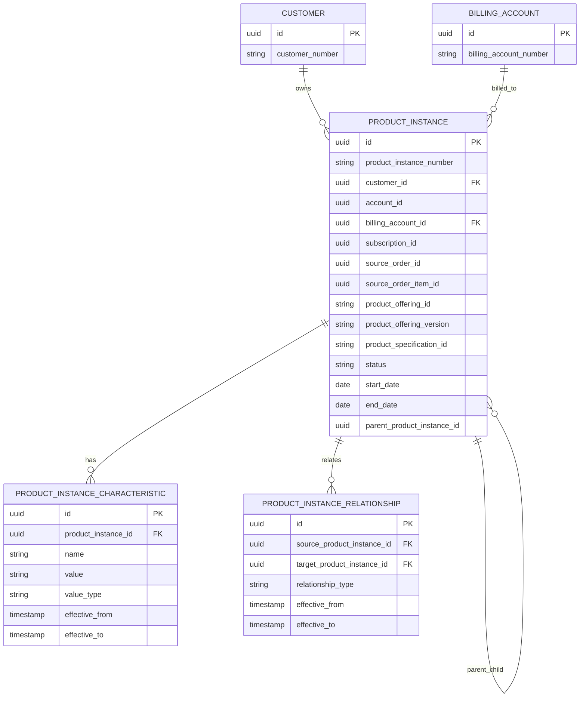
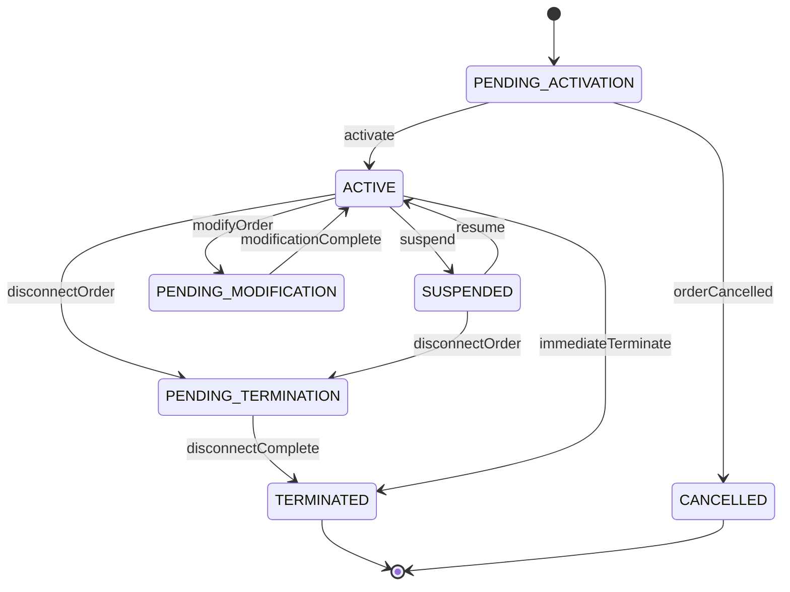
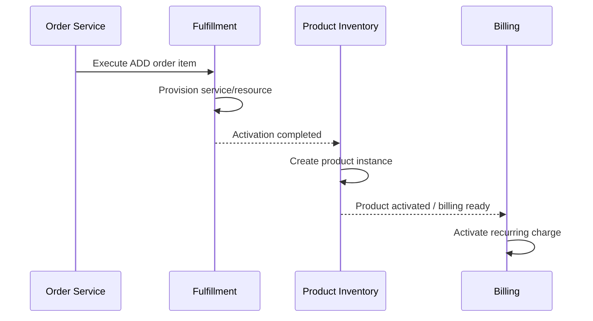

# Product Inventory Model

## 1. Core Idea

Product inventory adalah catatan tentang **produk yang benar-benar dimiliki/digunakan customer** setelah order dipenuhi.

Product catalog menjawab:

> Produk apa yang bisa dijual?

Quote menjawab:

> Produk apa yang ditawarkan dan disetujui?

Order menjawab:

> Produk apa yang harus dibuat/diubah/dihentikan?

Product inventory menjawab:

> Produk apa yang saat ini atau pernah aktif untuk customer, dengan status, configuration, relationship, billing account, source order, and lifecycle history apa?

Mental model:

> Product inventory is the installed commercial product truth used for modify, disconnect, billing, support, reporting, and reconciliation.

---

## 2. Why Product Inventory Matters

Tanpa product inventory yang kuat, sistem tidak tahu installed base customer.

Akibatnya:

- modify order tidak tahu product instance mana yang diubah,
- disconnect order tidak tahu apa yang harus dihentikan,
- billing tidak tahu produk mana yang aktif,
- subscription tidak sinkron dengan activation,
- customer support tidak tahu produk customer,
- renewal/churn reporting salah,
- duplicate product instance tercipta,
- service/resource inventory tidak bisa dimapping,
- fulfillment sukses tetapi inventory tidak terupdate,
- order history tidak bisa menunjukkan current state.

Product inventory adalah hasil dari order fulfillment dan input untuk future order actions.

---

## 3. Product Offering vs Product Instance

| Concept | Meaning |
|---|---|
| Product offering | Sellable catalog object. |
| Product specification | Definition/structure of product. |
| Quote item | Commercial proposal line. |
| Order item | Execution instruction. |
| Product instance | Product actually installed/active for customer. |
| Installed product | Common business term for product instance. |

Example:

```text
Product offering:
  Business Internet 500 Mbps

Quote item:
  Customer accepted Business Internet 500 Mbps for Jakarta office

Order item:
  ADD Business Internet 500 Mbps at Jakarta office

Product instance:
  Customer now has active Business Internet 500 Mbps at Jakarta office
```

Do not treat product offering as customer-owned product.

---

## 4. Core Product Instance Fields

Common fields:

| Field | Purpose |
|---|---|
| `id` | Internal product instance ID. |
| `product_instance_number` | Business/support reference. |
| `customer_id` | Customer owner. |
| `account_id` | Account context. |
| `billing_account_id` | Payer for recurring charges. |
| `subscription_id` | Subscription relationship if applicable. |
| `source_order_id` | Order that created/changed instance. |
| `source_order_item_id` | Order item source. |
| `product_offering_id` | Offering sold. |
| `product_offering_version` | Catalog version sold. |
| `product_specification_id` | Product definition. |
| `status` | Active, pending, suspended, terminated, etc. |
| `start_date` | Product/service start. |
| `end_date` | Product/service end. |
| `activation_date` | When activated. |
| `termination_date` | When ended. |
| `site_id` / `location_id` | Installed/service location. |
| `parent_product_instance_id` | Bundle hierarchy. |
| `version` | Optimistic/effective version. |
| `created_at` / `updated_at` | Technical timestamps. |

Actual internal schema must be verified.

---

## 5. Conceptual ERD



---

## 6. Product Instance Lifecycle

Conceptual lifecycle:



Internal statuses may differ. The point is:

- product lifecycle is different from order lifecycle,
- status must reflect installed product reality,
- order action causes product inventory transition,
- billing/subscription should align with product lifecycle.

---

## 7. Product Status Semantics

Common statuses:

| Status | Meaning |
|---|---|
| `PENDING_ACTIVATION` | Order exists but product not active yet. |
| `ACTIVE` | Product/service is active and usable/billable. |
| `SUSPENDED` | Temporarily disabled. |
| `PENDING_MODIFICATION` | Change in progress. |
| `PENDING_TERMINATION` | Disconnect in progress. |
| `TERMINATED` | Product ended. |
| `CANCELLED` | Product creation cancelled before activation. |
| `SUPERSEDED` | Replaced by another product instance/version. |

Do not mix product status with order item state or service provisioning state.

Example:

```text
Order item state = FULFILLED
Product instance status = ACTIVE
Billing charge status = ACTIVE
Service instance status = ACTIVE
```

These should align but remain separate.

---

## 8. Source Order Traceability

Product instance should preserve source order.

Why:

- support asks why product exists,
- billing disputes require accepted quote/order trace,
- modify/disconnect needs original order data,
- reconciliation connects fulfillment to inventory,
- audit proves activation source,
- reporting attributes install base to sales/channel.

Fields:

```text
source_quote_id
source_quote_item_id
source_order_id
source_order_item_id
activation_task_id
completion_proof_id
```

At minimum, source order/order item should be traceable.

---

## 9. Product Characteristics

Product instance characteristics represent actual configured values.

Examples:

- bandwidth,
- plan/tier,
- contract term,
- device model,
- static IP count,
- service address,
- feature flags,
- SLA level,
- license quantity,
- access technology.

Product characteristic differs from catalog characteristic:

| Catalog characteristic | Product instance characteristic |
|---|---|
| Defines allowed/configurable fields | Stores actual value for customer product |
| Versioned by catalog | Versioned/effective-dated by product lifecycle |
| Used during quote/order | Used during support/billing/modify/disconnect |

Model options:

- relational characteristic table,
- JSONB snapshot,
- effective-dated characteristic history,
- hybrid extracted fields + snapshot.

For product inventory, effective history often matters.

---

## 10. Characteristic History

If product can be modified, characteristic history is needed.

Example:

```text
Bandwidth:
  100 Mbps from Jan 1 to Mar 31
  500 Mbps from Apr 1 onward
```

Model:

```text
product_instance_characteristic
- product_instance_id
- characteristic_name
- characteristic_value
- effective_from
- effective_to
- source_order_item_id
```

Avoid overwriting current value without history if it affects billing, service, or audit.

---

## 11. Parent-Child Product Relationship

Bundles and add-ons create product hierarchy.

Examples:

```text
Enterprise Internet Bundle
  Access Service
  Managed Router
  Static IP Add-on
  SLA Package
```

Relationship types:

- parent-child,
- bundled-with,
- depends-on,
- add-on-to,
- replaces,
- supersedes,
- migrated-from,
- realized-by-service,
- billed-with.

Model:

```text
product_instance_relationship
- source_product_instance_id
- target_product_instance_id
- relationship_type
- effective_from
- effective_to
```

Do not rely only on parent ID if many relationship types exist.

---

## 12. Realizing Service and Resource

Product instance may be realized by service/resource inventory.

Example:

```text
Product instance: Business Internet 500 Mbps
Realizing service: Broadband access service
Realizing resource: Fiber port, CPE device, IP address
```

Relationship:

```text
product_instance_realization
- product_instance_id
- service_instance_id
- resource_instance_id
- relationship_type
- effective_from
- effective_to
```

Product inventory is commercial-facing. Service/resource inventory is technical-facing.

This separation is central to telco BSS/OSS modelling.

---

## 13. Billing Account Relationship

Product instance should usually know billing account for recurring billing.

Fields:

```text
billing_account_id
billing_start_date
billing_end_date
billing_status
recurring_charge_id
```

Billing account can change over time. If so, use effective-dated relationship.

Example:

```text
Product P billed to BA-001 from Jan to Jun
Product P billed to BA-002 from Jul onward
```

Do not recompute billing account from customer default for historical charges.

---

## 14. Subscription Relationship

Product instance may be linked to subscription.

Possible models:

| Relationship | Meaning |
|---|---|
| Product instance owns subscription | Simple product-subscription link. |
| Subscription owns product instances | Bundle/multi-product subscription. |
| Subscription item maps to product instance | Best for itemized recurring billing. |

Product inventory and subscription should be reconcilable:

```text
Active subscription item should usually map to active product instance.
Terminated product should terminate or update subscription/recurring charge.
```

---

## 15. Modify Action Impact

Modify order changes product inventory.

Possible approaches:

| Approach | Description |
|---|---|
| Update same product instance | Current product continues with changed characteristics. |
| Create new version row | Better history and temporal correctness. |
| Supersede old product instance | Useful for plan change/migration. |
| Add child relationship | Useful for add-ons/features. |

Choice depends on domain.

Example:

```text
Upgrade bandwidth from 100 to 500 Mbps
```

Could be:

- characteristic update,
- plan change,
- superseded product instance,
- new subscription item,
- billing charge version.

Design must align inventory, subscription, and billing.

---

## 16. Disconnect Action Impact

Disconnect should terminate product inventory.

Fields:

```text
termination_date
termination_reason
source_disconnect_order_id
source_disconnect_order_item_id
billing_end_date
service_deactivation_reference
```

Potential invariant:

```text
Terminated product instance should not have active recurring charge after billing_end_date unless explicit policy/adjustment exists.
```

Disconnect must coordinate:

- service deprovisioning,
- resource release,
- billing stop,
- product status,
- subscription cancellation/termination,
- invoice finalization.

---

## 17. Suspend and Resume Impact

Suspension changes product status but may preserve product relationship.

Suspension fields:

```text
suspension_reason
suspended_at
resume_expected_at
resumed_at
billing_policy
source_order_item_id
```

Product inventory status:

```text
ACTIVE -> SUSPENDED -> ACTIVE
```

Billing may:

- continue,
- pause,
- reduce,
- adjust,
- resume later.

Do not infer billing behavior only from product status. Use policy.

---

## 18. Product Instance Versioning

Product instance can be mutable current-state record plus history, or versioned records.

Options:

| Strategy | Description |
|---|---|
| Current row + history table | Common operational pattern. |
| Effective-dated rows | Strong temporal model. |
| Event history | Strong audit/replay, more complexity. |
| Snapshot per order change | Good order traceability. |

For enterprise systems, current row + effective-dated history is often practical.

History table examples:

```text
product_instance_status_history
product_instance_characteristic_history
product_instance_relationship_history
```

---

## 19. Temporal Modelling

Important dates:

| Date | Meaning |
|---|---|
| `start_date` | Product relationship starts. |
| `activation_date` | Service/product actually activated. |
| `billing_start_date` | Billing starts. |
| `suspension_date` | Product suspended. |
| `resume_date` | Product resumed. |
| `termination_date` | Product ended. |
| `billing_end_date` | Billing stops. |
| `effective_from/to` | Relationship/characteristic validity. |

Avoid one overloaded date field.

---

## 20. Product Inventory and Order Actions

Mapping:

| Order action | Product inventory effect |
|---|---|
| `ADD` | Create product instance. |
| `MODIFY` | Update characteristic/version/status. |
| `DISCONNECT` | Terminate product instance. |
| `SUSPEND` | Set status suspended. |
| `RESUME` | Set status active. |
| `MOVE` | Update site/service relationship. |
| `CHANGE_PLAN` | Modify/supersede product instance. |
| `UPGRADE` | Plan/version/charge change. |
| `DOWNGRADE` | Plan/version/charge change. |

Order item should reference target product instance for existing-product actions.

---

## 21. Conceptual Creation Flow



Inventory should update based on reliable fulfillment proof, not just order submission.

---

## 22. Inventory Reconciliation

Important reconciliations:

| Source | Target | Check |
|---|---|---|
| Fulfilled ADD order item | Product instance | Product instance created. |
| Fulfilled MODIFY order item | Product instance | Characteristics updated. |
| Fulfilled DISCONNECT order item | Product instance | Product terminated. |
| Active product instance | Recurring charge | Active billable product has active charge. |
| Active product instance | Service inventory | Realizing service active. |
| Terminated product instance | Service/resource | Service/resource deactivated/released. |
| Subscription | Product instance | Subscription active aligns with product active. |

Reconciliation is essential because inventory is often updated asynchronously.

---

## 23. Product Inventory and Reporting

Product inventory supports:

- installed base,
- active products by customer,
- churn,
- product penetration,
- add-on attach rate,
- active recurring revenue base,
- product lifecycle reporting,
- upgrade/downgrade analysis,
- disconnect trend,
- inventory aging,
- customer support view,
- service assurance correlation.

Define:

- active product,
- billable product,
- suspended product,
- terminated product,
- current product version,
- installed product count,
- parent/child counting rules.

Avoid double-counting bundle parent and child components.

---

## 24. PostgreSQL Physical Design

Product instance table:

```sql
create table product_instance (
  id uuid primary key,
  product_instance_number text not null unique,
  customer_id uuid not null,
  account_id uuid,
  billing_account_id uuid,
  subscription_id uuid,
  source_quote_id uuid,
  source_quote_item_id uuid,
  source_order_id uuid,
  source_order_item_id uuid,
  product_offering_id text not null,
  product_offering_version text,
  product_specification_id text,
  product_specification_version text,
  status text not null,
  start_date date,
  activation_date timestamptz,
  end_date date,
  termination_date timestamptz,
  site_id uuid,
  location_id uuid,
  parent_product_instance_id uuid references product_instance(id),
  version integer not null default 0,
  created_at timestamptz not null,
  updated_at timestamptz not null
);
```

Characteristic table:

```sql
create table product_instance_characteristic (
  id uuid primary key,
  product_instance_id uuid not null references product_instance(id),
  characteristic_name text not null,
  characteristic_value text,
  value_type text,
  effective_from timestamptz not null,
  effective_to timestamptz,
  source_order_item_id uuid,
  created_at timestamptz not null
);
```

Relationship table:

```sql
create table product_instance_relationship (
  id uuid primary key,
  source_product_instance_id uuid not null references product_instance(id),
  target_product_instance_id uuid not null references product_instance(id),
  relationship_type text not null,
  effective_from timestamptz not null,
  effective_to timestamptz,
  source_order_item_id uuid,
  created_at timestamptz not null
);
```

Status history:

```sql
create table product_instance_status_history (
  id uuid primary key,
  product_instance_id uuid not null references product_instance(id),
  from_status text,
  to_status text not null,
  source_order_id uuid,
  source_order_item_id uuid,
  reason_code text,
  correlation_id text,
  transitioned_at timestamptz not null
);
```

Useful indexes:

```sql
create index idx_product_instance_customer_status
on product_instance (customer_id, status, updated_at);

create index idx_product_instance_billing_account_status
on product_instance (billing_account_id, status);

create index idx_product_instance_order_item
on product_instance (source_order_item_id);

create index idx_product_instance_parent
on product_instance (parent_product_instance_id);

create index idx_product_characteristic_instance_name
on product_instance_characteristic (product_instance_id, characteristic_name, effective_from desc);

create index idx_product_relationship_source
on product_instance_relationship (source_product_instance_id, relationship_type);

create index idx_product_relationship_target
on product_instance_relationship (target_product_instance_id, relationship_type);
```

---

## 25. Java/JAX-RS Backend Implications

Product inventory APIs:

```http
GET /customers/{customerId}/product-instances
GET /product-instances/{id}
GET /product-instances/{id}/history
POST /product-instances/{id}/suspend
POST /product-instances/{id}/resume
POST /product-instances/{id}/terminate
```

Usually product inventory should be changed by order/fulfillment commands, not arbitrary CRUD.

Better pattern:

```text
Order/Fulfillment event -> Inventory command -> Product instance transition
```

Avoid:

```http
PATCH /product-instances/{id}
{
  "status": "TERMINATED"
}
```

unless this is a controlled correction endpoint with audit.

---

## 26. MyBatis/JPA/JDBC Implications

### MyBatis

Useful for:

- installed base lookup,
- customer product tree,
- current characteristic query,
- modify/disconnect validation,
- reconciliation queries.

### JPA

Be careful with:

- parent-child product tree loading,
- effective-dated characteristic collection,
- accidental overwrite of historical characteristics,
- optimistic locking for concurrent modify/disconnect.

### JDBC

Useful for deterministic inventory transition and reconciliation jobs.

General rule:

> Product inventory update should be command/state-transition based, not blind row update.

---

## 27. Event Model

Product inventory events:

- `ProductInstanceCreated`
- `ProductInstanceActivated`
- `ProductInstanceModified`
- `ProductInstanceSuspended`
- `ProductInstanceResumed`
- `ProductInstanceTerminated`
- `ProductCharacteristicChanged`
- `ProductRelationshipCreated`
- `ProductBillingAccountChanged`
- `ProductInstanceSuperseded`

Payload example:

```json
{
  "eventId": "uuid",
  "eventType": "ProductInstanceActivated",
  "eventVersion": 1,
  "occurredAt": "2026-07-12T10:00:00Z",
  "productInstanceId": "product-instance-id",
  "productInstanceNumber": "PI-10001",
  "customerId": "customer-id",
  "billingAccountId": "billing-account-id",
  "sourceOrderId": "order-id",
  "sourceOrderItemId": "order-item-id",
  "productOfferingId": "offering-id",
  "status": "ACTIVE",
  "activationDate": "2026-07-12T09:59:00Z",
  "correlationId": "corr-123"
}
```

Events can feed billing, support, analytics, and assurance.

---

## 28. Product Inventory and Cache/Search

Installed product lookup is often user-facing and operational.

Search model may include:

- product instance number,
- customer,
- account,
- billing account,
- status,
- product offering,
- site,
- activation date,
- termination date,
- service ID,
- external reference.

Cache risks:

- stale active/suspended/terminated status,
- stale billing account,
- stale characteristic,
- stale product relationship.

Do not use stale cache for modify/disconnect validation unless versioned and safe.

---

## 29. Data Quality Checks

```sql
-- Active product without billing account
select id, product_instance_number
from product_instance
where status = 'ACTIVE'
  and billing_account_id is null;

-- Product created from fulfilled order item missing source
select id, product_instance_number
from product_instance
where source_order_item_id is null
  and status in ('ACTIVE', 'SUSPENDED', 'TERMINATED');

-- Terminated product with no termination date
select id, product_instance_number
from product_instance
where status = 'TERMINATED'
  and termination_date is null;

-- Product characteristic with overlapping effective periods
select c1.product_instance_id, c1.characteristic_name, c1.id, c2.id
from product_instance_characteristic c1
join product_instance_characteristic c2
  on c1.product_instance_id = c2.product_instance_id
 and c1.characteristic_name = c2.characteristic_name
 and c1.id <> c2.id
where c1.effective_from < coalesce(c2.effective_to, 'infinity')
  and c2.effective_from < coalesce(c1.effective_to, 'infinity');
```

Adjust for internal schema and allowed exceptions.

---

## 30. Security and Privacy

Product inventory can expose sensitive customer operations:

- active services,
- locations,
- devices,
- service configuration,
- IP/resource identifiers,
- contract/subscription links,
- billing account.

Controls:

- restrict customer/product inventory access,
- mask sensitive characteristics,
- protect service/resource identifiers,
- audit inventory changes,
- avoid leaking sensitive details in events/logs,
- enforce tenant/customer boundary,
- define retention/history policy.

---

## 31. Failure Modes

| Failure mode | Symptom | Likely cause | Prevention |
|---|---|---|---|
| Missing product instance | Modify/disconnect impossible | Fulfillment did not update inventory | Fulfillment-inventory reconciliation |
| Duplicate product instance | Customer has duplicate active product | Retry without idempotency | Source order item uniqueness |
| Active product not billed | Revenue leakage | Billing not linked to inventory | Active product vs charge reconciliation |
| Terminated product billed | Customer dispute | Charge not stopped | Termination billing trigger |
| Wrong characteristic | Service/billing mismatch | Modification overwritten incorrectly | Effective-dated characteristic history |
| Product status mismatch | Support sees wrong status | Order/service/inventory not synchronized | State reconciliation |
| Add-on orphan | Add-on active without parent | Relationship missing | Parent/relationship invariant |
| Wrong billing account | Invoice to wrong payer | Default recomputed incorrectly | Billing account snapshot/history |
| Service active but product inactive | Assurance mismatch | Product/service sync failure | Product-service reconciliation |
| Reporting double count | Installed base inflated | Bundle parent/child counted together | Product classification rules |

---

## 32. PR Review Checklist

When reviewing product inventory changes, ask:

- Is this catalog product or installed product?
- What order/action creates or changes this product instance?
- Is source order item trace preserved?
- Is billing account explicit?
- Is product offering/specification version preserved?
- Is product status lifecycle controlled?
- Are characteristics effective-dated?
- Are parent-child relationships explicit?
- Are add-ons tied to parent product?
- Is product linked to subscription/recurring charge?
- Is product linked to realizing service/resource?
- How does modify/disconnect/suspend/resume affect it?
- Is inventory update idempotent?
- Are events outbox-backed?
- Are reconciliation checks available?
- Are support/reporting views affected?
- Are sensitive characteristics protected?

---

## 33. Internal Verification Checklist

Verify these in the internal CSG/team context:

- Actual product inventory/product instance entity/table.
- Whether product inventory is internal or external system-owned.
- Whether installed product is distinct from catalog product offering.
- Whether product instance stores source order/order item.
- Whether product instance stores source quote/quote item.
- Whether billing account is stored on product instance.
- Whether subscription relationship exists.
- Whether product characteristic values are stored relationally, JSONB, or externally.
- Whether characteristic history/effective dating exists.
- Whether parent-child product relationships exist.
- Whether add-on relationship is modelled.
- Whether product instance maps to service/resource inventory.
- Whether fulfillment completion creates/updates product inventory.
- Whether modify/disconnect/suspend/resume orders require product instance reference.
- Whether product status history exists.
- Whether active product vs charge reconciliation exists.
- Whether product-service-resource reconciliation exists.
- Whether incidents mention missing installed product, duplicate product, stale status, or billing after termination.

---

## 34. Summary

Product inventory is the installed commercial truth.

A strong product inventory model must define:

- product instance identity,
- customer/account/billing context,
- source order trace,
- catalog/offering/spec version,
- lifecycle status,
- activation/termination dates,
- characteristics,
- parent-child relationship,
- subscription and charge linkage,
- realizing service/resource linkage,
- order action effects,
- status/history,
- reconciliation,
- reporting and support semantics.

The key principle:

> Product inventory is not catalog. It is the customer-specific installed product state that future orders, billing, support, and reconciliation depend on.
