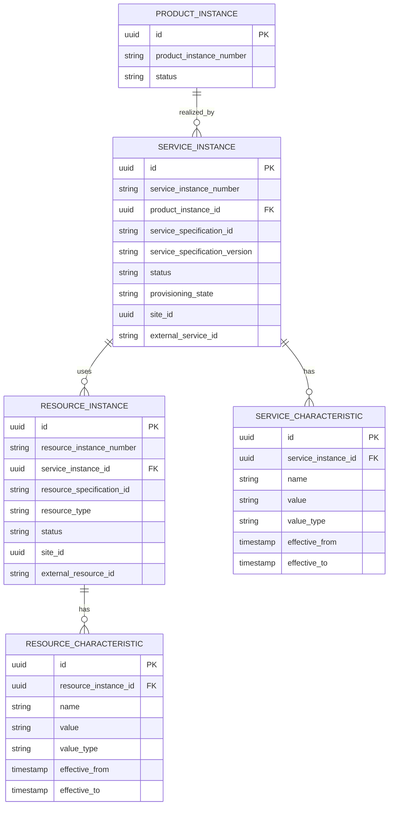
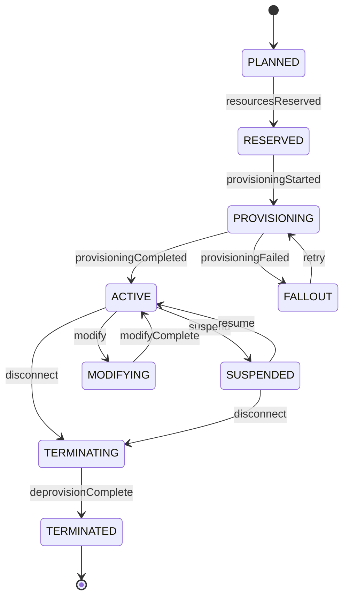
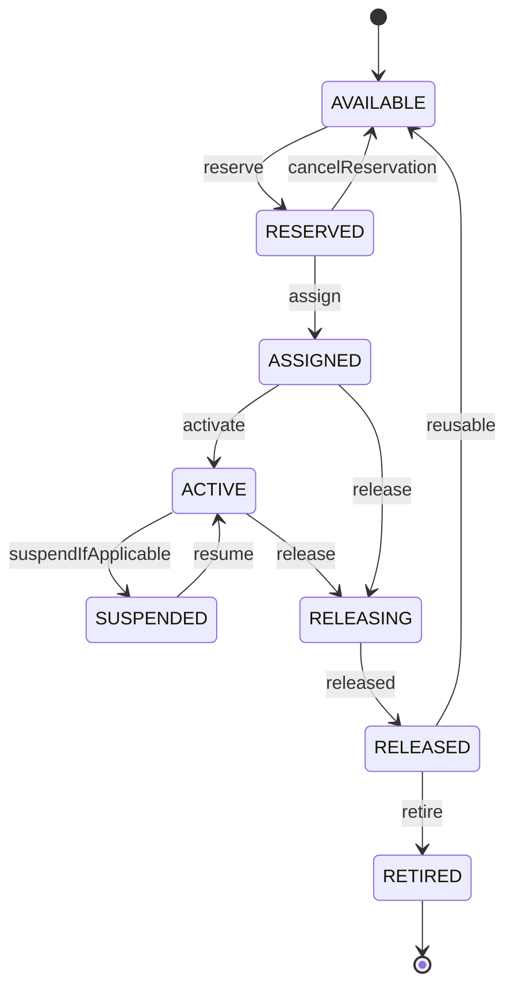

# Service and Resource Inventory Model

## 1. Core Idea

Service inventory dan resource inventory adalah layer teknis yang merealisasikan product inventory.

Product inventory menjawab:

> Produk commercial apa yang aktif untuk customer?

Service inventory menjawab:

> Service teknis apa yang aktif untuk merealisasikan produk tersebut?

Resource inventory menjawab:

> Resource fisik/logis apa yang dialokasikan untuk menjalankan service tersebut?

Dalam telco BSS/OSS, pemisahan ini sangat penting:

```text
Product instance
  -> realized by service instance
      -> realized by resource instance
```

Contoh:

```text
Product instance:
  Business Internet 500 Mbps

Service instance:
  Internet access service for site Jakarta

Resource instances:
  Fiber circuit
  Network port
  CPE router
  Static IP block
  VLAN
```

Mental model:

> Product is what the customer bought. Service is how the product is delivered. Resource is what is allocated to implement the service.

---

## 2. Why Service and Resource Inventory Matter

Tanpa service/resource inventory yang jelas, order management dan assurance akan kabur.

Failure yang sering muncul:

- product active tetapi service tidak aktif,
- service aktif tetapi resource belum dialokasikan,
- billing aktif tetapi provisioning gagal,
- disconnect product tetapi resource tidak dilepas,
- modify order tidak tahu service mana yang harus diubah,
- resource dipakai dua customer,
- service assurance tidak bisa mapping alarm ke product/customer,
- fulfillment completed tetapi OSS inventory tidak sinkron,
- support hanya melihat product, bukan technical realization,
- reconciliation tidak bisa membandingkan BSS vs OSS.

Product inventory cukup untuk commercial view. Service/resource inventory dibutuhkan untuk technical execution and assurance.

---

## 3. Product vs Service vs Resource

| Layer | Example | Owned by |
|---|---|---|
| Product | Business Internet 500 Mbps | BSS / product inventory / commercial system |
| Service | Broadband access service | OSS / service inventory / provisioning |
| Resource | Fiber port, CPE, IP address | OSS / resource inventory / network/resource system |

A single product may map to many services/resources.

A single service may use many resources.

A resource may be shared, dedicated, pooled, reserved, active, or released.

Do not flatten all three into one "installed product" table if technical lifecycle matters.

---

## 4. Core Service Instance Fields

Common service instance fields:

| Field | Purpose |
|---|---|
| `id` | Internal service instance ID. |
| `service_instance_number` | Business/support reference. |
| `service_specification_id` | Technical service definition. |
| `service_specification_version` | Version used for provisioning. |
| `product_instance_id` | Commercial product realized by this service. |
| `source_order_id` / `source_order_item_id` | Order trace. |
| `customer_id` / `account_id` | Context for support/reconciliation. |
| `site_id` / `location_id` | Service location. |
| `status` | Planned, active, suspended, terminated, etc. |
| `provisioning_state` | Provisioning-specific state. |
| `activation_date` | When service became active. |
| `termination_date` | When service ended. |
| `external_service_id` | OSS/downstream reference. |
| `version` | Optimistic/effective version. |

Actual internal fields depend on OSS integration.

---

## 5. Core Resource Instance Fields

Common resource instance fields:

| Field | Purpose |
|---|---|
| `id` | Internal resource instance ID. |
| `resource_instance_number` | Support/technical reference. |
| `resource_specification_id` | Resource type/specification. |
| `resource_specification_version` | Version used. |
| `resource_type` | CPE, IP, circuit, port, SIM, VLAN, etc. |
| `status` | Available, reserved, assigned, active, released, retired. |
| `service_instance_id` | Service using the resource. |
| `product_instance_id` | Optional commercial trace. |
| `site_id` / `location_id` | Physical/logical location. |
| `external_resource_id` | Network/resource system reference. |
| `reservation_id` | Reservation trace. |
| `assigned_at` / `released_at` | Allocation lifecycle. |
| `attributes` | Resource-specific attributes. |

Resource inventory can be huge and highly specialized. Do not force all resource attributes into fixed columns.

---

## 6. Conceptual ERD



This is conceptual. Internal systems may store service/resource inventory in external OSS.

---

## 7. Service Specification vs Service Instance

| Concept | Meaning |
|---|---|
| Service specification | Definition/template of technical service. |
| Service instance | Actual service provisioned for customer/product. |

Example:

```text
Service specification:
  Broadband Access Service

Service instance:
  Broadband Access Service instance for Customer A at Jakarta site
```

Service specification can define:

- valid service characteristics,
- required resources,
- provisioning template,
- lifecycle behavior,
- compatibility rules,
- service relationships.

Service instance stores actual values and state.

---

## 8. Resource Specification vs Resource Instance

| Concept | Meaning |
|---|---|
| Resource specification | Type/template of resource. |
| Resource instance | Actual allocated resource. |

Example:

```text
Resource specification:
  Static IPv4 Address

Resource instance:
  203.0.113.10 assigned to service S-123
```

Resource specification may define:

- attribute schema,
- allocation rules,
- capacity model,
- lifecycle constraints,
- location restrictions,
- compatibility with service.

Resource instance stores actual allocated resource and state.

---

## 9. Service Lifecycle

Conceptual service lifecycle:



Service lifecycle is technical. It should align with product lifecycle, but not be identical.

---

## 10. Resource Lifecycle

Conceptual resource lifecycle:



Some resources are reusable; others are consumed or retired.

Examples:

- IP address can be released and reused.
- SIM can be reassigned depending policy.
- physical port can be freed.
- CPE may be returned/refurbished/retired.
- circuit may have long decommissioning lifecycle.

---

## 11. Product-Service-Resource Mapping

Mapping should be explicit.

Conceptual relationship:

```text
product_instance_realization
- product_instance_id
- service_instance_id
- relationship_type
- effective_from
- effective_to

service_resource_assignment
- service_instance_id
- resource_instance_id
- assignment_type
- effective_from
- effective_to
```

Relationship types:

- realizes,
- depends on,
- primary service,
- backup service,
- access service,
- bearer service,
- component service,
- assigned resource,
- reserved resource,
- shared resource,
- dedicated resource.

Explicit mapping enables:

- assurance impact analysis,
- billing reconciliation,
- disconnect cleanup,
- support troubleshooting,
- product-to-network trace.

---

## 12. Provisioning State

Provisioning state is more specific than service status.

Examples:

| Provisioning state | Meaning |
|---|---|
| `NOT_STARTED` | No provisioning request sent. |
| `REQUESTED` | Request created. |
| `SENT` | Sent to OSS/downstream. |
| `ACKNOWLEDGED` | Downstream accepted. |
| `IN_PROGRESS` | Provisioning executing. |
| `COMPLETED` | Provisioning completed. |
| `FAILED` | Provisioning failed. |
| `FALLOUT` | Requires manual/retry resolution. |
| `CANCELLED` | Provisioning cancelled. |

Service status might be `ACTIVE` only after provisioning state completed.

Do not set product active simply because provisioning request was sent.

---

## 13. Resource Reservation

Before activation, resources may be reserved.

Reservation fields:

```text
resource_reservation
- id
- resource_instance_id nullable
- resource_pool_id
- service_instance_id
- order_id
- order_item_id
- reservation_status
- reserved_from
- reserved_until
- expires_at
- released_at
```

Resource reservation prevents double allocation.

Failure mode:

```text
Two orders allocate the same port/IP because reservation is not enforced.
```

Use unique constraints or allocation service guarantees for scarce resources.

---

## 14. Service Characteristic Model

Service characteristic examples:

- bandwidth,
- VLAN,
- access technology,
- QoS profile,
- IP mode,
- routing profile,
- service class,
- service address,
- activation parameters.

These are technical values, not necessarily the same as product characteristics.

Mapping example:

```text
Product characteristic:
  bandwidth = 500 Mbps

Service characteristic:
  downstreamBandwidth = 500 Mbps
  upstreamBandwidth = 100 Mbps
  qosProfile = BUSINESS_GOLD
```

Store source/mapping if traceability matters.

---

## 15. Resource Characteristic Model

Resource characteristics are resource-specific.

Examples:

- IP address,
- MAC address,
- serial number,
- port ID,
- circuit ID,
- SIM ICCID,
- device model,
- capacity,
- location rack/shelf/slot,
- VLAN ID.

Resource characteristics may be sensitive. Mask and secure accordingly.

---

## 16. Modify Impact

A modify order can affect service/resource inventory.

Examples:

- bandwidth change modifies service characteristic,
- static IP add-on assigns IP resource,
- router upgrade changes CPE resource,
- plan change changes service profile,
- site move changes service/resource relationships.

Modify must preserve history:

```text
old service characteristic effective_to = change time
new service characteristic effective_from = change time
```

Do not overwrite without history if assurance/billing/dispute depends on it.

---

## 17. Disconnect Impact

Disconnect should:

- deactivate service,
- release resources,
- terminate product instance,
- stop billing,
- record completion proof,
- preserve historical inventory.

Do not hard-delete service/resource records. Historical trace is needed for audit, disputes, and reconciliation.

Potential invariant:

```text
Terminated product instance should not have active realizing service.
Terminated service should not have active dedicated resources unless release is pending.
```

---

## 18. Suspension and Resume Impact

Suspension may affect service but not release resources.

Example:

```text
Product status = SUSPENDED
Service status = SUSPENDED
Resource status = ASSIGNED or ACTIVE_HELD
Billing status = depends on policy
```

Resource may remain assigned to customer to allow resume.

Do not release resource on suspension unless domain policy says so.

---

## 19. Shared vs Dedicated Resources

Resource can be:

| Type | Meaning |
|---|---|
| Dedicated | Assigned to one service/customer. |
| Shared | Used by multiple services/customers. |
| Pooled | Allocated from pool. |
| Consumable | Used once or capacity-reducing. |
| Logical | IP/VLAN/profile. |
| Physical | Device/port/circuit. |

Dedicated resources usually need strong uniqueness.

Shared resources need capacity tracking.

Example:

```text
resource_capacity
- resource_id
- total_capacity
- allocated_capacity
- available_capacity
- unit
```

---

## 20. External OSS Ownership

Service/resource inventory may be owned by external OSS.

Internal system may store:

- local reference,
- external ID,
- status snapshot,
- last sync time,
- reconciliation result,
- provisioning request reference,
- event source.

Ownership must be clear.

If OSS is source of truth, internal data is projection/cache. Do not mutate it directly except through sync/correction process.

---

## 21. Event Model

Events:

- `ServiceInstanceCreated`
- `ServiceProvisioningStarted`
- `ServiceActivated`
- `ServiceModified`
- `ServiceSuspended`
- `ServiceResumed`
- `ServiceTerminated`
- `ResourceReserved`
- `ResourceAssigned`
- `ResourceActivated`
- `ResourceReleased`
- `ServiceResourceMismatchDetected`

Payload example:

```json
{
  "eventId": "uuid",
  "eventType": "ServiceActivated",
  "eventVersion": 1,
  "occurredAt": "2026-07-12T10:00:00Z",
  "serviceInstanceId": "service-instance-id",
  "productInstanceId": "product-instance-id",
  "orderId": "order-id",
  "orderItemId": "order-item-id",
  "serviceSpecificationId": "broadband-access",
  "status": "ACTIVE",
  "externalServiceId": "oss-service-123",
  "correlationId": "corr-123"
}
```

---

## 22. PostgreSQL Physical Design

Service instance:

```sql
create table service_instance (
  id uuid primary key,
  service_instance_number text not null unique,
  product_instance_id uuid,
  customer_id uuid,
  account_id uuid,
  source_order_id uuid,
  source_order_item_id uuid,
  service_specification_id text not null,
  service_specification_version text,
  status text not null,
  provisioning_state text,
  site_id uuid,
  location_id uuid,
  external_service_id text,
  activation_date timestamptz,
  termination_date timestamptz,
  version integer not null default 0,
  created_at timestamptz not null,
  updated_at timestamptz not null
);
```

Resource instance:

```sql
create table resource_instance (
  id uuid primary key,
  resource_instance_number text not null unique,
  service_instance_id uuid,
  product_instance_id uuid,
  resource_specification_id text not null,
  resource_specification_version text,
  resource_type text not null,
  status text not null,
  site_id uuid,
  location_id uuid,
  external_resource_id text,
  reservation_id uuid,
  assigned_at timestamptz,
  released_at timestamptz,
  version integer not null default 0,
  created_at timestamptz not null,
  updated_at timestamptz not null
);
```

Mapping table:

```sql
create table product_service_realization (
  id uuid primary key,
  product_instance_id uuid not null,
  service_instance_id uuid not null,
  relationship_type text not null,
  effective_from timestamptz not null,
  effective_to timestamptz,
  source_order_item_id uuid
);
```

Service-resource assignment:

```sql
create table service_resource_assignment (
  id uuid primary key,
  service_instance_id uuid not null,
  resource_instance_id uuid not null,
  assignment_type text not null,
  effective_from timestamptz not null,
  effective_to timestamptz,
  source_order_item_id uuid
);
```

Useful indexes:

```sql
create index idx_service_product_status
on service_instance (product_instance_id, status);

create index idx_service_external
on service_instance (external_service_id)
where external_service_id is not null;

create index idx_resource_service_status
on resource_instance (service_instance_id, status);

create index idx_resource_external
on resource_instance (external_resource_id)
where external_resource_id is not null;

create index idx_product_service_realization_product
on product_service_realization (product_instance_id, effective_from desc);

create index idx_service_resource_assignment_service
on service_resource_assignment (service_instance_id, effective_from desc);
```

---

## 23. Java/JAX-RS Backend Implications

Service/resource inventory APIs are usually read-heavy and controlled-write.

Examples:

```http
GET /product-instances/{id}/realizing-services
GET /service-instances/{id}
GET /service-instances/{id}/resources
GET /resource-instances/{id}
POST /service-instances/{id}/reconcile
POST /resource-reservations
```

Writes should usually happen through fulfillment/provisioning commands:

```text
Fulfillment completed -> Service activated -> Resource assigned -> Product inventory updated
```

Avoid arbitrary CRUD mutation unless it is correction-controlled and audited.

---

## 24. MyBatis/JPA/JDBC Implications

### MyBatis

Useful for:

- product-to-service-resource trace,
- service/resource search,
- reconciliation queries,
- assurance impact queries,
- active resource allocation checks.

### JPA

Be careful with:

- many-to-many relationship explosion,
- recursive service/resource relationship,
- effective-dated relationship loading,
- stale projections from OSS.

### JDBC

Useful for batch sync from OSS and reconciliation.

General rule:

> Service/resource inventory should be modelled for traceability and reconciliation, not just UI display.

---

## 25. Reporting and Assurance Impact

Service/resource inventory supports:

- active services by product/customer,
- resource utilization,
- provisioning success rate,
- service assurance impact,
- outage impact analysis,
- resource exhaustion forecast,
- product-service mismatch report,
- active service without product,
- active product without service,
- disconnect cleanup report,
- resource leakage report.

Assurance use case:

```text
Network alarm on resource R
  -> resource instance
  -> service instance
  -> product instance
  -> customer/account/billing impact
```

Without mapping, impact analysis becomes manual.

---

## 26. Reconciliation

Key reconciliations:

| Source | Target | Check |
|---|---|---|
| Product inventory | Service inventory | Active product has active realizing service. |
| Service inventory | Resource inventory | Active service has required resources. |
| Fulfillment task | Service inventory | Completed provisioning created service. |
| OSS | Local projection | Status/external reference match. |
| Disconnect order | Resource inventory | Dedicated resources released. |
| Billing | Product/service | Billable active service has active charge. |

Example queries:

```sql
-- Active product without active service realization
select pi.id, pi.product_instance_number
from product_instance pi
left join product_service_realization psr
  on psr.product_instance_id = pi.id
 and psr.effective_to is null
left join service_instance si
  on si.id = psr.service_instance_id
 and si.status = 'ACTIVE'
where pi.status = 'ACTIVE'
  and si.id is null;

-- Terminated service with active resource assignment
select si.id as service_id, ri.id as resource_id
from service_instance si
join service_resource_assignment sra
  on sra.service_instance_id = si.id
 and sra.effective_to is null
join resource_instance ri
  on ri.id = sra.resource_instance_id
where si.status = 'TERMINATED'
  and ri.status in ('ASSIGNED', 'ACTIVE');
```

---

## 27. Data Quality Checks

Checks:

- resource assigned to multiple services when dedicated,
- active service without product realization,
- active product without service realization,
- resource reserved past expiry,
- terminated product with active service,
- terminated service with active resource,
- missing external OSS reference,
- stale projection from OSS,
- service/resource characteristic overlap.

Example:

```sql
-- Dedicated resource assigned to more than one active service
select resource_instance_id, count(*)
from service_resource_assignment
where effective_to is null
group by resource_instance_id
having count(*) > 1;
```

Only valid if resource type is dedicated. Shared resources need capacity model.

---

## 28. Security and Privacy

Service/resource inventory may reveal sensitive infrastructure:

- IP addresses,
- network topology,
- device IDs,
- location,
- customer-service mapping,
- resource capacity,
- technical configuration.

Controls:

- restrict access to resource details,
- mask sensitive network identifiers in events/logs,
- separate support view from engineering view,
- enforce tenant/customer boundary,
- audit manual changes,
- secure exports,
- define retention.

---

## 29. Failure Modes

| Failure mode | Symptom | Likely cause | Prevention |
|---|---|---|---|
| Product active, service inactive | Customer sold but not provisioned | Missing provisioning update | Product-service reconciliation |
| Service active, product inactive | OSS drift | BSS/OSS sync failure | OSS projection reconciliation |
| Resource double assigned | Service conflict/outage | Weak reservation/assignment constraint | Resource allocation control |
| Resource leak | Resource remains assigned after disconnect | Missing release step | Disconnect-resource reconciliation |
| Wrong service mapping | Support troubleshoots wrong service | Missing product-service relationship | Explicit realization mapping |
| Billing active, service inactive | Customer dispute | Billing trigger too early | Billing readiness proof |
| Service modified without history | Cannot audit technical change | Overwrite characteristics | Effective-dated characteristics |
| External ID missing | Cannot reconcile OSS | Integration response not stored | External reference model |
| Stale OSS projection | UI shows wrong state | Sync lag hidden | last_sync/status freshness |
| Shared resource over capacity | Degraded service | No capacity model | Capacity allocation model |

---

## 30. PR Review Checklist

When reviewing service/resource inventory changes, ask:

- Is this product, service, or resource layer?
- Who owns the data: local system or external OSS?
- Is product-service mapping explicit?
- Is service-resource mapping explicit?
- Is source order/order item trace preserved?
- Is service specification version stored?
- Is resource specification/type stored?
- Are service/resource statuses distinct from product status?
- Is provisioning state separate if needed?
- Are characteristics effective-dated?
- Are resources dedicated, shared, pooled, or consumable?
- Is reservation/allocation idempotent?
- Is disconnect releasing resources?
- Are external references stored?
- Are events outbox-backed?
- Are reconciliation checks available?
- Are sensitive resource details protected?

---

## 31. Internal Verification Checklist

Verify these in the internal CSG/team context:

- Whether service inventory is modelled internally or external OSS-owned.
- Whether resource inventory is modelled internally or external OSS-owned.
- Whether product instance maps to service instance.
- Whether service instance maps to resource instance.
- Whether service/resource IDs from OSS are stored.
- Whether service specification/resource specification are represented.
- Whether service/resource status enums exist.
- Whether provisioning state is separate from service status.
- Whether resource reservation exists.
- Whether dedicated/shared resource semantics are known.
- Whether service/resource characteristics are stored and versioned.
- Whether fulfillment completion updates service/resource inventory.
- Whether disconnect releases resources.
- Whether product-service-resource reconciliation exists.
- Whether assurance/support uses product-service-resource mapping.
- Whether incidents mention resource leak, duplicate assignment, OSS/BSS mismatch, or active billing without service activation.

---

## 32. Summary

Service and resource inventory are the technical realization layers behind product inventory.

A strong model must define:

- service instance,
- resource instance,
- service/resource specification,
- product-service-resource mapping,
- lifecycle status,
- provisioning state,
- characteristics,
- reservation/allocation,
- external OSS reference,
- source order trace,
- reconciliation,
- assurance impact,
- security controls.

The key principle:

> Product inventory tells what the customer has. Service and resource inventory tell how it is technically delivered and what must be reconciled when fulfillment, assurance, or billing goes wrong.
