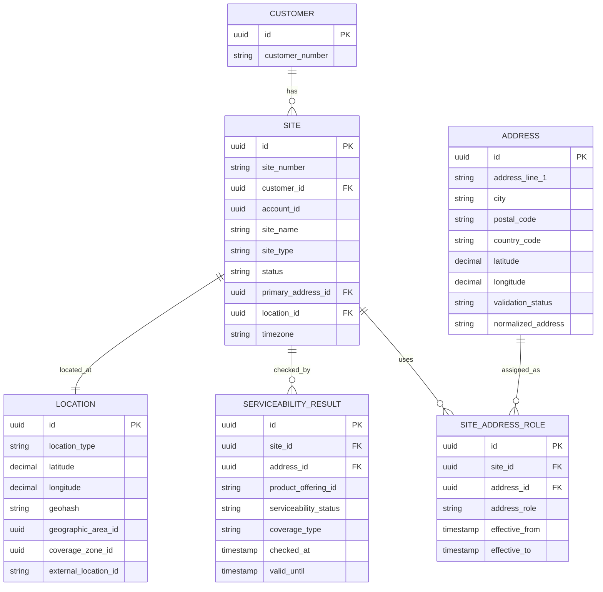

# Address, Site, Location, and Serviceability Model

## 1. Core Idea

Address, site, location, and serviceability data determine where a product/service can be sold, installed, delivered, billed, taxed, and supported.

In CPQ / Quote / Order / Billing / Telco BSS/OSS, location data is not just contact information.

It affects:

- product eligibility,
- serviceability,
- coverage,
- pricing,
- tax,
- installation,
- fulfillment routing,
- SLA,
- resource availability,
- billing address,
- shipping address,
- customer hierarchy,
- multi-site quote,
- reporting.

Mental model:

> Address identifies a place. Site gives business meaning to a place. Location gives spatial/technical representation. Serviceability determines what can be sold or delivered at that place.

---

## 2. Why This Model Matters

Weak location modelling causes serious production issues:

- quote offers unavailable product,
- service order fails because address is not serviceable,
- installation dispatched to wrong address,
- billing tax calculated from wrong jurisdiction,
- shipping goes to billing address instead of installation site,
- multi-site quote loses site-level configuration,
- product active at wrong location,
- service inventory cannot map to geography,
- address duplicate creates duplicate customer sites,
- coverage result changes but quote does not preserve snapshot,
- site-specific price not carried to order/billing.

Location data is both commercial and operational.

---

## 3. Address vs Site vs Location

| Concept | Meaning |
|---|---|
| Address | Human-readable postal/physical address. |
| Site | Business/customer-specific place where service/product is used. |
| Location | Spatial/technical representation: coordinates, building, region, network area. |
| Service address | Address where service is delivered. |
| Billing address | Address used for invoice/legal/tax contact. |
| Installation address | Address where installation work happens. |
| Shipping address | Address where equipment is delivered. |
| Tax address | Address used for tax jurisdiction. |

A single site can have multiple addresses. A single address can be used by multiple customers/sites. A location can be more precise or more technical than address.

---

## 4. Core Address Fields

Common address fields:

| Field | Purpose |
|---|---|
| `id` | Internal address ID. |
| `address_line_1/2` | Street/building/unit information. |
| `city` | City. |
| `state/province` | Region. |
| `postal_code` | Postal/ZIP code. |
| `country_code` | ISO country code. |
| `latitude/longitude` | Geospatial coordinates if available. |
| `normalized_address` | Standardized address string. |
| `validation_status` | Validated, unverified, failed, partial. |
| `source_system` | CRM, user input, address service, external reference. |
| `external_address_id` | Address validation provider/reference. |
| `effective_from/to` | Validity if address changes. |

Avoid storing all address input as one free-text field when serviceability/tax depends on structured data.

---

## 5. Core Site Fields

Site is customer/business context around address/location.

Fields:

| Field | Purpose |
|---|---|
| `id` | Internal site ID. |
| `site_number` | Business/support reference. |
| `customer_id` | Customer owning/using site. |
| `account_id` | Account context. |
| `site_name` | Human-readable name, e.g. Jakarta HQ. |
| `site_type` | Office, branch, data center, home, warehouse. |
| `primary_address_id` | Main physical/service address. |
| `billing_address_id` | Optional site-level billing address. |
| `status` | Active, inactive, pending validation, closed. |
| `parent_site_id` | Site hierarchy if relevant. |
| `timezone` | Operational timezone. |
| `geographic_area_id` | Coverage/sales/region reference. |
| `created_at/updated_at` | Technical timestamps. |

Site is often more stable than address text because customers refer to "Jakarta HQ", not only street string.

---

## 6. Core Location Fields

Location may represent spatial/technical geography.

Fields:

```text
location
- id
- location_type
- latitude
- longitude
- geohash
- building_id
- floor
- unit
- region_id
- network_area_id
- service_area_id
- coverage_zone_id
- external_location_id
```

Location can be:

- geocoded point,
- building,
- floor/unit,
- network service area,
- coverage polygon,
- region/territory,
- exchange area,
- cell coverage area,
- postal area.

For telco/fulfillment, location may need technical network area, not just postal address.

---

## 7. Conceptual ERD



---

## 8. Address Roles

An address can play different roles.

Common roles:

- service address,
- installation address,
- billing address,
- shipping address,
- legal address,
- tax address,
- contact address,
- emergency address,
- correspondence address.

Model:

```text
site_address_role
- site_id
- address_id
- address_role
- effective_from
- effective_to
```

Do not duplicate address columns everywhere unless snapshot is required.

For invoice/legal artifacts, snapshot may be required.

---

## 9. Address Normalization

Address normalization converts user-entered address into standardized form.

Examples:

```text
Raw:
  Jl Sudirman no. 1, Jakarta

Normalized:
  Jalan Jenderal Sudirman No. 1, Jakarta Pusat, DKI Jakarta, ID
```

Normalization can affect:

- duplicate detection,
- serviceability lookup,
- tax jurisdiction,
- shipping,
- geocoding,
- customer site matching.

Store:

- raw address,
- normalized address,
- validation provider,
- validation status,
- confidence score,
- external address ID,
- normalized components.

Do not discard raw address if legal/customer-provided wording matters.

---

## 10. Address Validation

Validation statuses:

| Status | Meaning |
|---|---|
| `UNVERIFIED` | User entered but not validated. |
| `VALIDATED` | Confirmed by provider/source. |
| `PARTIAL` | Some fields validated, some uncertain. |
| `FAILED` | Invalid/unrecognized. |
| `OVERRIDDEN` | User/manual override accepted. |
| `STALE` | Previously valid but may need revalidation. |

Validation result should include:

```text
address_validation_result
- address_id
- provider
- status
- confidence_score
- normalized_address_id
- error_code
- checked_at
```

Manual override must be audited.

---

## 11. Geocoding

Geocoding maps address to coordinates.

Fields:

- latitude,
- longitude,
- accuracy,
- provider,
- geocode_status,
- geocoded_at,
- geohash,
- spatial reference.

Why it matters:

- coverage lookup,
- distance-based pricing,
- technician dispatch,
- region assignment,
- nearest resource/service area,
- tax/geographic rules.

Be careful with precision. Coordinates can be sensitive.

---

## 12. Geographic Area

Geographic area can represent:

- sales region,
- service region,
- tax jurisdiction,
- coverage zone,
- network area,
- market,
- country/state/city,
- field service territory,
- regulatory region.

Geographic area model:

```text
geographic_area
- id
- area_type
- name
- code
- parent_area_id
- boundary_reference
- effective_from
- effective_to
```

Hierarchy matters:

```text
Country -> Province -> City -> District -> Service Area
```

Avoid hard-coding region logic in product/pricing code.

---

## 13. Serviceability

Serviceability answers:

> Can this product/service be delivered at this site/location?

Serviceability depends on:

- product offering,
- service specification,
- address/location,
- coverage,
- resource availability,
- technology availability,
- customer segment,
- distance,
- regulatory constraint,
- installation capacity,
- existing service,
- network area,
- date.

Result fields:

```text
serviceability_result
- id
- site_id
- address_id
- location_id
- product_offering_id
- product_specification_id
- serviceability_status
- coverage_type
- technology
- reason_code
- checked_at
- valid_until
- source_system
- external_reference
```

Serviceability result should be snapshotted into quote/order if it affects eligibility.

---

## 14. Serviceability Status

Common statuses:

| Status | Meaning |
|---|---|
| `SERVICEABLE` | Product can be delivered. |
| `NOT_SERVICEABLE` | Product cannot be delivered. |
| `CONDITIONALLY_SERVICEABLE` | Requires extra checks/work. |
| `MANUAL_CHECK_REQUIRED` | Human/network planning needed. |
| `UNKNOWN` | No reliable result. |
| `STALE` | Result expired. |

Do not treat unknown as serviceable.

Potential guard:

```text
Quote item for serviceable product cannot be submitted unless serviceability status is SERVICEABLE or approved exception.
```

---

## 15. Coverage Model

Coverage can be:

- fiber coverage,
- mobile coverage,
- fixed wireless coverage,
- service region coverage,
- partner coverage,
- support coverage,
- installation coverage.

Coverage fields:

```text
coverage
- id
- coverage_type
- geographic_area_id
- technology
- status
- effective_from
- effective_to
- source_system
```

Coverage can change over time. Quote should preserve coverage/serviceability result used.

---

## 16. Serviceability Snapshot in Quote

If serviceability affects quote eligibility, snapshot it.

Quote item should preserve:

```text
site_id
service_address_snapshot
serviceability_result_id
serviceability_status
coverage_type
checked_at
valid_until
reason_code
```

Why:

- serviceability can change after quote,
- customer dispute needs evidence,
- order conversion should use accepted result or revalidate explicitly,
- product availability must be traceable.

Do not silently use current serviceability result during order if quote was accepted based on earlier result, unless policy requires recheck.

---

## 17. Serviceability Recheck in Order

Order may need recheck before fulfillment.

Reasons:

- serviceability result expired,
- address changed,
- product changed,
- resource availability changed,
- coverage changed,
- manual feasibility required,
- quote validity period exceeded.

Policy options:

| Policy | Meaning |
|---|---|
| Trust quote snapshot | Use accepted serviceability. |
| Revalidate at order | Check again before submission/fulfillment. |
| Revalidate if expired | Use valid_until. |
| Manual exception | Allow override with approval. |

Model must record which policy was applied.

---

## 18. Site-Specific Pricing

Pricing may vary by site/location.

Examples:

- installation fee by distance,
- tax by jurisdiction,
- region-based price,
- coverage-based price,
- resource scarcity surcharge,
- multi-site discount,
- local regulatory fee,
- shipping fee,
- onsite support fee.

Price snapshot should preserve site/location input.

Fields:

```text
price_snapshot
- site_id
- service_address_id
- geographic_area_id
- pricing_region
- tax_jurisdiction
- serviceability_result_id
```

Failure mode:

```text
Quote priced using Jakarta site, order bills using customer default billing address.
```

---

## 19. Multi-Site Quote

Enterprise quotes often contain multiple sites.

Example:

```text
Quote for Customer A:
  Site Jakarta HQ: Business Internet
  Site Bandung Branch: Business Internet
  Site Surabaya DC: Managed Firewall
```

Model:

```text
quote_site
- quote_id
- site_id
- site_snapshot
- serviceability_summary
```

Quote item:

```text
quote_item.site_id
quote_item.service_address_id
quote_item.location_id
```

Order item should preserve site mapping.

Do not store site only at quote header if quote has multiple sites.

---

## 20. Multi-Site Order and Fulfillment

Multi-site order can decompose differently per site.

Example:

- Jakarta uses fiber,
- Bandung requires manual feasibility,
- Surabaya uses partner last-mile.

Order item site affects:

- decomposition rule,
- target OSS system,
- field service team,
- installation appointment,
- resource reservation,
- billing/tax,
- SLA.

Order item should carry site/location, not rely only on order header.

---

## 21. Address and Billing

Billing address affects:

- invoice delivery,
- tax,
- legal entity,
- customer finance contact,
- dunning,
- payment terms.

Billing address should be distinct from service address.

For invoices, billing address usually needs snapshot.

Example:

```text
billing_address_snapshot on invoice
```

because customer may change address later, but old invoice must remain historically correct.

---

## 22. Address and Tax

Tax may depend on:

- billing address,
- service address,
- ship-to address,
- legal entity address,
- tax registration address,
- product tax category,
- jurisdiction.

Do not assume billing address is always tax address.

Model tax address role explicitly or let tax engine return jurisdiction/evidence.

---

## 23. Address and Fulfillment

Fulfillment may need:

- installation address,
- access instructions,
- site contact,
- appointment window,
- building/floor/unit,
- equipment room,
- latitude/longitude,
- field service territory,
- nearest network node,
- shipping address.

Avoid storing fulfillment-specific details in generic billing address.

Model:

```text
site_access_detail
- site_id
- access_instruction
- contact_id
- appointment_required
- security_requirement
```

Sensitive access details must be protected.

---

## 24. Address and Product Inventory

Product instance should preserve installed/service site.

Fields:

```text
product_instance.site_id
product_instance.service_address_id
product_instance.location_id
```

If product moves, preserve history:

```text
product_location_history
- product_instance_id
- site_id
- address_id
- effective_from
- effective_to
- source_order_item_id
```

Move order should update product/service/resource location carefully.

---

## 25. Address Versioning and Snapshot

Address changes over time.

Questions:

- Is address corrected because typo?
- Is site moved?
- Is billing address changed?
- Should historical order/invoice change?
- Should active service location change?
- Does tax need recalculation?
- Does serviceability need recheck?

Use different operations:

| Operation | Meaning |
|---|---|
| Correct address | Fix wrong data, may update current reference with audit. |
| Change address | New effective address for future. |
| Move service | Order action changing service location. |
| Snapshot address | Preserve historical value. |

Do not treat all address updates as simple overwrite.

---

## 26. External Address / GIS / Coverage Systems

Location data may be owned by:

- CRM,
- address validation provider,
- GIS system,
- network inventory,
- coverage engine,
- tax engine,
- field service system.

Store external references:

```text
external_address_id
external_location_id
coverage_result_id
gis_reference
tax_jurisdiction_id
network_area_id
```

Clearly mark source and last sync time.

---

## 27. Event Model

Events:

- `AddressCreated`
- `AddressValidated`
- `AddressValidationFailed`
- `SiteCreated`
- `SiteUpdated`
- `SiteAddressChanged`
- `ServiceabilityChecked`
- `ServiceabilityChanged`
- `CoverageChanged`
- `ProductLocationChanged`

Payload example:

```json
{
  "eventId": "uuid",
  "eventType": "ServiceabilityChecked",
  "eventVersion": 1,
  "occurredAt": "2026-07-12T10:00:00Z",
  "siteId": "site-id",
  "addressId": "address-id",
  "productOfferingId": "offering-id",
  "serviceabilityStatus": "SERVICEABLE",
  "coverageType": "FIBER",
  "validUntil": "2026-08-12T00:00:00Z",
  "correlationId": "corr-123"
}
```

Do not leak sensitive address details to events unless necessary.

---

## 28. PostgreSQL Physical Design

Address table:

```sql
create table address (
  id uuid primary key,
  address_line_1 text,
  address_line_2 text,
  city text,
  state_province text,
  postal_code text,
  country_code char(2) not null,
  latitude numeric(10, 7),
  longitude numeric(10, 7),
  normalized_address text,
  validation_status text not null,
  source_system text,
  external_address_id text,
  created_at timestamptz not null,
  updated_at timestamptz not null
);
```

Site table:

```sql
create table site (
  id uuid primary key,
  site_number text not null unique,
  customer_id uuid not null,
  account_id uuid,
  site_name text,
  site_type text,
  status text not null,
  primary_address_id uuid references address(id),
  location_id uuid,
  timezone text,
  geographic_area_id uuid,
  parent_site_id uuid references site(id),
  created_at timestamptz not null,
  updated_at timestamptz not null
);
```

Site address role:

```sql
create table site_address_role (
  id uuid primary key,
  site_id uuid not null references site(id),
  address_id uuid not null references address(id),
  address_role text not null,
  effective_from timestamptz not null,
  effective_to timestamptz
);
```

Serviceability result:

```sql
create table serviceability_result (
  id uuid primary key,
  site_id uuid,
  address_id uuid,
  location_id uuid,
  product_offering_id text,
  product_specification_id text,
  serviceability_status text not null,
  coverage_type text,
  technology text,
  reason_code text,
  checked_at timestamptz not null,
  valid_until timestamptz,
  source_system text,
  external_reference text,
  correlation_id text
);
```

Useful indexes:

```sql
create index idx_address_external
on address (external_address_id)
where external_address_id is not null;

create index idx_address_postal_country
on address (country_code, postal_code);

create index idx_site_customer_status
on site (customer_id, status);

create index idx_site_address_role_site
on site_address_role (site_id, address_role, effective_from desc);

create index idx_serviceability_site_product
on serviceability_result (site_id, product_offering_id, checked_at desc);

create index idx_serviceability_address_product
on serviceability_result (address_id, product_offering_id, checked_at desc);
```

For geospatial queries, PostGIS may be relevant if available internally. Do not assume it is installed.

---

## 29. Java/JAX-RS Backend Implications

Example APIs:

```http
POST /addresses/validate
GET /customers/{customerId}/sites
POST /customers/{customerId}/sites
GET /sites/{siteId}
POST /sites/{siteId}/addresses
POST /serviceability-checks
GET /sites/{siteId}/serviceability
```

Service responsibilities:

- normalize/validate address,
- preserve raw input and normalized result,
- manage site/address roles,
- enforce address role semantics,
- call serviceability/coverage provider,
- snapshot serviceability result into quote/order,
- protect sensitive address/location data,
- publish safe events.

Avoid scattering address validation logic across quote/order/billing services.

---

## 30. MyBatis/JPA/JDBC Implications

### MyBatis

Useful for:

- customer site lookup,
- multi-site quote queries,
- effective address role query,
- serviceability latest-result query,
- duplicate address detection.

### JPA

Be careful with:

- address/site effective-dated roles,
- parent site hierarchy,
- lazy loading large site/address graphs,
- accidental update of historical address snapshot.

### JDBC

Useful for batch normalization, migration, and reconciliation.

General rule:

> Address and site should be treated as domain data with roles and lifecycle, not free-text fields copied across tables.

---

## 31. Reporting Impact

Address/site/location supports:

- revenue by region,
- serviceability conversion rate,
- coverage gap analysis,
- multi-site quote pipeline,
- installation SLA by region,
- tax jurisdiction reporting,
- order fallout by geography,
- product penetration by area,
- field service workload,
- active products by site,
- churn by location.

Reporting must know which address role is used:

- service address for installed base,
- billing address for invoice/tax,
- installation address for fulfillment,
- customer legal address for compliance.

---

## 32. Reconciliation

Important reconciliations:

| Source | Target | Check |
|---|---|---|
| Quote item | Site/serviceability | Serviceable result exists and valid. |
| Order item | Site/location | Fulfillment has address/site. |
| Product instance | Site | Active product linked to active site. |
| Billing account | Billing address | Active billing account has valid billing address. |
| Invoice | Address snapshot | Issued invoice has historical billing address. |
| Service inventory | Location | Active service has technical location. |
| Coverage system | Serviceability result | Result not stale. |

Example queries:

```sql
-- Quote/order item without site where serviceable product requires site
-- Conceptual only; adjust to internal schema.
select id, order_id, product_offering_id
from product_order_item
where site_id is null
  and action = 'ADD';

-- Active site without primary address
select id, site_number
from site
where status = 'ACTIVE'
  and primary_address_id is null;

-- Expired serviceability result still referenced by active quote item
select sr.id, sr.valid_until
from serviceability_result sr
where sr.valid_until < now()
  and sr.serviceability_status = 'SERVICEABLE';
```

---

## 33. Security and Privacy

Address/location data is sensitive.

Risks:

- physical customer location exposure,
- high-value enterprise site exposure,
- network/service area inference,
- installation access details,
- billing address PII,
- coordinates leaked in logs/events,
- tenant/customer boundary breach.

Controls:

- role-based access,
- mask address in logs,
- avoid full address in broad events,
- protect geolocation precision,
- audit access/changes,
- encrypt sensitive access details,
- tenant-aware filtering,
- retention policy.

---

## 34. Failure Modes

| Failure mode | Symptom | Likely cause | Prevention |
|---|---|---|---|
| Product sold where unavailable | Fulfillment failure | No serviceability guard | Serviceability check/snapshot |
| Wrong installation address | Technician dispatch failure | Address role confusion | Explicit address roles |
| Wrong tax | Invoice dispute | Billing/service/tax address confusion | Tax address model |
| Duplicate site | Customer view fragmented | No normalization/dedupe | Address normalization |
| Stale serviceability | Order fails after quote | Expired result reused | valid_until/recheck policy |
| Wrong site pricing | Price mismatch | Site not carried to quote/order | Site-specific price snapshot |
| Product at wrong location | Support/billing issue | Move/address update mishandled | Product location history |
| Billing to service address | Invoice error | Address role collapsed | Separate billing address |
| Sensitive location leak | Security issue | Full address in logs/events | Masking/access control |
| Multi-site quote broken | Items assigned to wrong site | Site only at header | Item-level site mapping |

---

## 35. PR Review Checklist

When reviewing address/site/location changes, ask:

- Is this address, site, or location?
- What address role is involved?
- Is raw and normalized address preserved?
- Is validation status stored?
- Is manual override audited?
- Is site linked to customer/account?
- Is site required at quote item or order item level?
- Does product require serviceability?
- Is serviceability result snapshotted?
- Is serviceability result expiry handled?
- Is site-specific pricing/tax affected?
- Is billing address separate from service address?
- Is product inventory location history affected?
- Are geolocation/security concerns handled?
- Are events safe and versioned?
- Are reconciliation checks available?

---

## 36. Internal Verification Checklist

Verify these in the internal CSG/team context:

- Whether address is normalized/validated internally or externally.
- Whether raw and normalized address are both stored.
- Whether site is separate from address.
- Whether location/geocode/network area is represented.
- Whether address roles are explicit.
- Whether billing/service/installation/shipping/tax addresses are distinct.
- Whether quote item stores site/address.
- Whether order item stores site/address.
- Whether product instance stores site/location.
- Whether serviceability check exists.
- Whether serviceability result is snapshotted in quote/order.
- Whether serviceability result has expiry.
- Whether coverage/geographic area model exists.
- Whether site-specific pricing exists.
- Whether tax uses billing address, service address, or tax address.
- Whether multi-site quote/order is supported.
- Whether address changes are effective-dated or overwritten.
- Whether incidents mention wrong installation address, unavailable service sold, wrong tax jurisdiction, duplicate site, or stale serviceability.

---

## 37. Summary

Address, site, location, and serviceability modelling protect commercial, operational, and billing correctness.

A strong model must define:

- structured address,
- normalized/validated address,
- site as customer business location,
- location/geography,
- address roles,
- serviceability result,
- coverage,
- multi-site quote/order mapping,
- site-specific pricing,
- tax/billing address separation,
- fulfillment address,
- product location history,
- serviceability snapshot and recheck policy,
- privacy/security controls.

The key principle:

> Location data is not just contact data. It is eligibility, pricing, fulfillment, tax, billing, and service assurance data.
