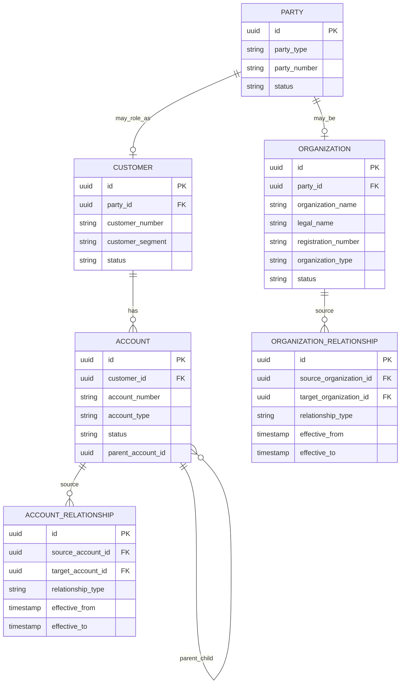

# Organization Hierarchy and Enterprise B2B Model

## 1. Core Idea

Enterprise B2B data model harus mampu merepresentasikan organisasi yang tidak flat.

Di dunia consumer/B2C, customer sering bisa dimodelkan sebagai satu orang atau satu akun sederhana. Di dunia enterprise B2B, customer bisa berupa:

- parent organization,
- subsidiary,
- legal entity,
- department,
- branch,
- regional entity,
- buyer group,
- billing entity,
- contracting entity,
- service-consuming entity,
- multi-account customer,
- multi-site customer.

Satu perusahaan bisa membeli melalui satu entitas hukum, membayar melalui entitas lain, menggunakan layanan di banyak site, dan memiliki approval/billing hierarchy yang berbeda dari organization chart.

Mental model:

> Enterprise B2B model is not just “customer has account”. It is a role-based hierarchy of organizations, accounts, legal responsibilities, billing responsibilities, contracting responsibilities, sites, and users.

---

## 2. Why Organization Hierarchy Matters

Organization hierarchy memengaruhi banyak area:

- quote ownership,
- price eligibility,
- contract applicability,
- discount entitlement,
- approval authority,
- billing responsibility,
- invoice consolidation,
- service account ownership,
- multi-site fulfillment,
- customer support access,
- reporting roll-up,
- revenue attribution,
- tax/legal responsibility,
- data privacy/access control.

Tanpa hierarchy yang jelas, sistem rawan:

- quote dibuat untuk wrong subsidiary,
- contract parent dipakai anak perusahaan yang tidak eligible,
- invoice dikirim ke billing entity salah,
- approval dilakukan oleh user yang tidak punya authority,
- revenue roll-up salah,
- site milik account lain muncul di quote,
- discount enterprise diterapkan ke customer yang tidak berhak,
- data customer bocor antar subsidiary,
- order fulfilment menggunakan service account yang salah.

---

## 3. Party, Organization, Customer, and Account

Pemisahan konsep dasar:

| Concept | Meaning |
|---|---|
| Party | General legal/person/organization identity. |
| Organization | Party berbentuk organisasi/perusahaan/unit. |
| Customer | Party yang berperan sebagai customer. |
| Account | Container commercial/operational untuk customer relationship. |
| Billing account | Payer/invoice responsibility container. |
| Service account | Entity/account receiving or using services. |
| Legal entity | Entity hukum yang dapat menandatangani kontrak. |
| Contracting entity | Entity yang menjadi pihak pada agreement. |

Jangan menyamakan semua menjadi `customer`.

Contoh:

```text
Party:
  GlobalCorp Ltd.

Organization:
  GlobalCorp APAC

Customer:
  GlobalCorp as customer in CRM

Account:
  GlobalCorp Enterprise Account

Billing Account:
  GlobalCorp APAC Billing

Service Account:
  GlobalCorp Jakarta Data Center

Contracting Entity:
  GlobalCorp Singapore Pte Ltd.
```

---

## 4. Enterprise Hierarchy Patterns

Common patterns:

### 4.1 Parent-subsidiary

```text
GlobalCorp
  GlobalCorp APAC
    GlobalCorp Indonesia
    GlobalCorp Singapore
  GlobalCorp EMEA
```

### 4.2 Account hierarchy

```text
Enterprise Account
  Regional Account
    Country Account
      Site Account
```

### 4.3 Billing hierarchy

```text
Parent Billing Account
  Child Billing Account A
  Child Billing Account B
```

### 4.4 Site hierarchy

```text
Customer HQ
  Branch Office
  Warehouse
  Data Center
```

### 4.5 Role-based relationship

```text
Organization A buys
Organization B pays
Organization C receives service
Organization D signs contract
```

Do not assume one hierarchy handles all use cases. Enterprise systems often need multiple relationship types.

---

## 5. Conceptual ERD



This is conceptual. Internal systems may use different master data models.

---

## 6. Organization Relationship Types

Relationship should be typed.

Examples:

| Relationship type | Meaning |
|---|---|
| `PARENT_OF` | Parent organization relationship. |
| `SUBSIDIARY_OF` | Subsidiary relationship. |
| `DEPARTMENT_OF` | Department belongs to organization. |
| `DIVISION_OF` | Business division relationship. |
| `LEGAL_ENTITY_OF` | Legal entity belongs to larger group. |
| `BILLING_ENTITY_FOR` | Organization pays for another. |
| `CONTRACTING_ENTITY_FOR` | Organization signs contract for another. |
| `SERVICE_CONSUMER_FOR` | Organization consumes service. |
| `MANAGED_BY` | Managed by another organization/partner. |
| `RESELLER_FOR` | Reseller/partner relationship. |

Avoid a generic `parent_id` if relationship semantics matter.

---

## 7. Account Hierarchy

Account hierarchy is not always organization hierarchy.

Example:

```text
Organization hierarchy:
  GlobalCorp
    GlobalCorp Indonesia
    GlobalCorp Singapore

Account hierarchy:
  GlobalCorp Enterprise Account
    GlobalCorp Regional Sales Account
      GlobalCorp Telecom Services Account
```

Account hierarchy can be commercial/operational, not legal.

Account hierarchy affects:

- quote account selection,
- price book assignment,
- sales territory,
- owner assignment,
- reporting,
- billing default,
- service account relationship,
- product inventory grouping.

Fields:

```text
account_relationship
- source_account_id
- target_account_id
- relationship_type
- effective_from
- effective_to
```

---

## 8. Legal Entity vs Billing Entity vs Contracting Entity

These are often different.

| Entity role | Meaning |
|---|---|
| Legal entity | Entity recognized legally/tax-wise. |
| Contracting entity | Entity signing agreement. |
| Billing entity | Entity receiving/paying invoice. |
| Service-consuming entity | Entity using product/service. |
| Buyer | Entity/user making purchase decision. |
| Approver | Entity/user authorizing commercial terms. |

Example:

```text
Contract signed by:
  GlobalCorp Singapore Pte Ltd.

Invoice paid by:
  GlobalCorp APAC Finance

Service consumed by:
  GlobalCorp Indonesia Jakarta Office

Support contact:
  GlobalCorp Indonesia IT Operations
```

A correct model must allow these roles to differ.

---

## 9. Role-Based Party Relationship

A flexible pattern:

```text
entity_related_party
- subject_type
- subject_id
- party_id
- role
- effective_from
- effective_to
```

Example for quote:

```text
quote_related_party
- quote_id
- party_id
- role = BUYER / APPROVER / CONTRACTING_PARTY / BILLING_CONTACT / SALES_REP
```

Example for order:

```text
order_related_party
- order_id
- party_id
- role = CUSTOMER / PAYER / SERVICE_RECIPIENT / INSTALLATION_CONTACT
```

Role-based modelling avoids adding many nullable columns for every role.

But roles must be governed. Free-text roles become data chaos.

---

## 10. Multi-Account Customer

A single enterprise customer may have multiple accounts.

Examples:

- one account per region,
- one account per product line,
- one account per business unit,
- one account per billing entity,
- one account per service portfolio,
- one account per sales team,
- one account per legal entity.

Quote/order must specify correct account.

Failure mode:

```text
Quote header has customer_id but account_id is null or defaulted incorrectly.
```

This can lead to wrong price book, contract, billing account, sales owner, and reporting.

---

## 11. Multi-Site Customer

Enterprise customers often have many sites.

```text
GlobalCorp
  Jakarta HQ
  Bandung Branch
  Surabaya Data Center
  Bali Retail Store
```

Site hierarchy and account hierarchy may differ.

Site affects:

- serviceability,
- pricing,
- tax,
- fulfillment,
- product inventory,
- service/resource inventory,
- support routing,
- field service assignment.

Quote/order item should carry site when products are site-specific.

---

## 12. Enterprise Agreement Applicability

Agreements may apply at different hierarchy levels.

Examples:

- parent master agreement applies to all subsidiaries,
- discount agreement applies only to one region,
- SLA applies only to data center sites,
- billing terms apply to one billing account,
- promotion applies to specific account segment.

Model agreement applicability:

```text
agreement_applicability
- agreement_id
- target_type
- target_id
- applicability_role
- effective_from
- effective_to
```

Target could be customer, account, organization, billing account, site, product family, or legal entity.

Do not assume `agreement.customer_id` is enough.

---

## 13. Pricing and Discount Entitlement

Hierarchy affects commercial entitlement.

Examples:

- enterprise discount applies to parent account,
- regional subsidiary has negotiated price,
- department has special budget/approval,
- customer segment determines price book,
- site region determines installation fee,
- legal entity determines tax.

Price/discount engine may need:

- customer hierarchy,
- account hierarchy,
- agreement applicability,
- billing account,
- site,
- product family,
- sales channel.

If hierarchy is not modelled well, pricing correctness suffers.

---

## 14. Approval and Commercial Authority

Approval authority may depend on organization/account hierarchy.

Examples:

- sales manager approves discount for their accounts,
- regional director approves discount for APAC subsidiaries,
- finance approver approves billing term exception,
- legal approver approves contract clause,
- customer approver must belong to buyer organization.

This overlaps with part 042, but organization hierarchy provides the scope:

```text
approver has authority over account subtree or organization subtree.
```

Authority without scope is dangerous.

---

## 15. Access Control and Data Privacy

Enterprise hierarchy affects data access.

Scenarios:

- user from subsidiary A should not see subsidiary B quotes,
- parent organization user may see consolidated view,
- partner/reseller may see managed customer only,
- billing contact may see invoices but not technical service details,
- site admin may see site products but not enterprise contract.

Access should not rely only on customer ID if hierarchy is complex.

Possible access model:

```text
user_scope
- user_id
- scope_type = ORGANIZATION / ACCOUNT / BILLING_ACCOUNT / SITE
- scope_id
- role
- effective_from
- effective_to
```

Actual access model may be identity-provider-driven. Verify internally.

---

## 16. Temporal Hierarchy

Organization and account relationships change.

Examples:

- subsidiary sold,
- account merged,
- billing entity changed,
- department reorganized,
- site closed,
- customer acquired another company,
- legal entity renamed,
- parent account changed.

Do not overwrite hierarchy without history if reporting, contracts, invoices, or audit depend on historical structure.

Use:

```text
effective_from
effective_to
```

for relationship rows.

Important question:

> Should historical quote/order/invoice reflect hierarchy at the time, or current hierarchy?

Usually financial/legal artifacts need historical snapshot.

---

## 17. Merge and Split

Enterprise master data changes include merges and splits.

### Merge

```text
Account A + Account B -> Account C
```

Need to preserve:

- old account references,
- migration date,
- redirect/supersession relationship,
- reporting treatment,
- open quote/order behavior,
- billing impact,
- access control impact.

### Split

```text
Account A -> Account B + Account C
```

Need mapping for:

- products,
- subscriptions,
- billing accounts,
- sites,
- agreements,
- open orders,
- invoices.

Model relationship:

```text
entity_supersession
- old_entity_type
- old_entity_id
- new_entity_type
- new_entity_id
- reason
- effective_at
```

---

## 18. Organization Hierarchy in Quote

Quote should capture:

- customer,
- account,
- buyer party,
- contracting party,
- billing account,
- service account/site,
- owner/sales team,
- applicable agreement,
- hierarchy snapshot if needed.

Common failure:

```text
Quote created for parent customer but order created for child account without trace.
```

Better:

```text
quote.customer_id
quote.account_id
quote.billing_account_id
quote.contracting_party_id
quote.related_party roles
quote.site/quote_item site
```

---

## 19. Organization Hierarchy in Order

Order should preserve hierarchy context from accepted quote.

Fields/concepts:

- customer,
- account,
- billing account,
- service account,
- payer,
- contracting party,
- related party/contact,
- source quote hierarchy snapshot,
- site.

Do not recompute account/billing/contracting entity from current defaults at conversion unless explicitly required.

---

## 20. Organization Hierarchy in Billing

Billing needs precise payer and invoice hierarchy.

Billing hierarchy can differ from organization hierarchy.

Examples:

- parent pays for all children,
- child receives invoice but parent guarantees payment,
- site-specific billing account,
- consolidated invoice for region,
- separate invoice per department.

Billing account model should support:

- parent billing account,
- child billing account,
- invoice consolidation rule,
- payer legal entity,
- tax/billing address,
- payment method.

---

## 21. Reporting Roll-Up

Hierarchy drives reporting:

- revenue by parent customer,
- revenue by subsidiary,
- product penetration by account,
- churn by region,
- quote pipeline by sales territory,
- billing exposure by legal entity,
- installed base by site,
- order backlog by account owner.

Reporting must define:

- current hierarchy vs historical hierarchy,
- roll-up level,
- how merged/split accounts are counted,
- whether billing entity or service-consuming entity drives revenue,
- whether parent/child double-counting is avoided.

---

## 22. Hierarchy Cycle Prevention

Recursive hierarchies can accidentally create cycles.

Example bad data:

```text
A parent of B
B parent of C
C parent of A
```

This breaks roll-up queries and access control.

Prevent with:

- application validation,
- recursive CTE check,
- graph validation,
- controlled hierarchy service,
- data quality monitor.

PostgreSQL recursive query can detect cycles, but prevention is better.

---

## 23. PostgreSQL Physical Design

Organization relationship:

```sql
create table organization_relationship (
  id uuid primary key,
  source_organization_id uuid not null,
  target_organization_id uuid not null,
  relationship_type text not null,
  effective_from timestamptz not null,
  effective_to timestamptz,
  reason_code text,
  created_at timestamptz not null,
  updated_at timestamptz not null
);
```

Account relationship:

```sql
create table account_relationship (
  id uuid primary key,
  source_account_id uuid not null,
  target_account_id uuid not null,
  relationship_type text not null,
  effective_from timestamptz not null,
  effective_to timestamptz,
  created_at timestamptz not null,
  updated_at timestamptz not null
);
```

Related party role:

```sql
create table entity_related_party (
  id uuid primary key,
  subject_type text not null,
  subject_id uuid not null,
  party_id uuid not null,
  role text not null,
  effective_from timestamptz not null,
  effective_to timestamptz,
  created_at timestamptz not null
);
```

Useful indexes:

```sql
create index idx_org_rel_source_type
on organization_relationship (source_organization_id, relationship_type, effective_from desc);

create index idx_org_rel_target_type
on organization_relationship (target_organization_id, relationship_type, effective_from desc);

create index idx_account_rel_source_type
on account_relationship (source_account_id, relationship_type, effective_from desc);

create index idx_related_party_subject_role
on entity_related_party (subject_type, subject_id, role, effective_from desc);

create index idx_related_party_party_role
on entity_related_party (party_id, role);
```

---

## 24. Java/JAX-RS Backend Implications

Potential APIs:

```http
GET /organizations/{id}/hierarchy
GET /customers/{id}/accounts
GET /accounts/{id}/children
GET /entities/{type}/{id}/related-parties
POST /organization-relationships
POST /account-relationships
```

Important service rules:

- validate relationship type,
- prevent cycles,
- enforce authority to change hierarchy,
- effective-date hierarchy changes,
- write audit,
- publish hierarchy change events,
- trigger reporting/read-model updates,
- avoid breaking open quote/order/billing processes.

Do not let random services create hierarchy relationships without governance.

---

## 25. MyBatis/JPA/JDBC Implications

### MyBatis

Useful for:

- recursive hierarchy queries,
- account tree lookup,
- reporting roll-up query,
- access scope query,
- effective relationship query.

### JPA

Be careful with:

- recursive self-referencing relationships,
- lazy loading large hierarchies,
- cascading updates to hierarchy,
- accidentally deleting relationship history.

### JDBC

Useful for controlled hierarchy migration, merge/split, and batch validation.

General rule:

> Hierarchy changes should be explicit domain operations with audit, not casual CRUD updates.

---

## 26. Event Model

Events:

- `OrganizationRelationshipCreated`
- `OrganizationRelationshipEnded`
- `AccountHierarchyChanged`
- `CustomerAccountMerged`
- `CustomerAccountSplit`
- `RelatedPartyRoleAssigned`
- `RelatedPartyRoleRemoved`
- `BillingEntityChanged`
- `ContractingEntityChanged`

Payload example:

```json
{
  "eventId": "uuid",
  "eventType": "AccountHierarchyChanged",
  "eventVersion": 1,
  "occurredAt": "2026-07-12T10:00:00Z",
  "sourceAccountId": "account-child",
  "targetAccountId": "account-parent",
  "relationshipType": "CHILD_OF",
  "effectiveFrom": "2026-07-12T00:00:00Z",
  "correlationId": "corr-123"
}
```

Hierarchy events can impact access control, reporting, pricing, and billing. Consumers must handle versioning carefully.

---

## 27. Cache/Search Impact

Hierarchy is often cached for:

- account picker,
- customer tree,
- access scope,
- reporting filters,
- pricing eligibility,
- quote customer selection.

Risks:

- stale hierarchy grants wrong access,
- stale hierarchy applies wrong discount,
- stale billing entity sends invoice wrong,
- stale account owner routes approval wrong.

Use:

- versioned hierarchy cache,
- short TTL for access-sensitive data,
- event-driven invalidation,
- cache key includes hierarchy version where appropriate.

---

## 28. Reporting Impact

Reports should clarify hierarchy basis:

| Report | Hierarchy basis |
|---|---|
| Revenue by enterprise | Parent customer hierarchy. |
| Invoice aging | Billing account hierarchy. |
| Order backlog | Account or sales owner hierarchy. |
| Installed base | Site/service account hierarchy. |
| Contract utilization | Agreement applicability hierarchy. |
| Discount usage | Account/customer entitlement hierarchy. |

Always define whether historical or current hierarchy is used.

---

## 29. Data Quality Checks

```sql
-- Active account without customer
select id, account_number
from account
where status = 'ACTIVE'
  and customer_id is null;

-- Related party role without active validity
select id, subject_type, subject_id, party_id, role
from entity_related_party
where effective_to is not null
  and effective_to <= effective_from;

-- Account relationship self-reference
select id, source_account_id, target_account_id
from account_relationship
where source_account_id = target_account_id;

-- Potential organization relationship self-reference
select id, source_organization_id, target_organization_id
from organization_relationship
where source_organization_id = target_organization_id;
```

Cycle detection requires recursive query and internal relationship semantics.

---

## 30. Security and Privacy

Enterprise hierarchy can expose sensitive structure:

- subsidiaries,
- legal entities,
- billing entities,
- customer sites,
- account relationships,
- buyer/approver names,
- contracts,
- revenue roll-up.

Controls:

- access scope enforcement,
- role-based visibility,
- tenant/customer isolation,
- masked reporting,
- audit hierarchy access/change,
- secure hierarchy export,
- careful event payload.

Do not assume parent organization users can always view all subsidiaries. Verify business and legal rules.

---

## 31. Failure Modes

| Failure mode | Symptom | Likely cause | Prevention |
|---|---|---|---|
| Wrong contract applied | Quote uses parent agreement incorrectly | Weak agreement applicability | Explicit applicability relationship |
| Wrong invoice entity | Billing dispute | Billing entity collapsed into customer | Billing entity role model |
| Data leak across subsidiary | User sees wrong account data | Access scope too broad | Scoped hierarchy permissions |
| Duplicate enterprise customer | Reporting fragmented | Master data dedupe missing | Customer/organization matching governance |
| Hierarchy cycle | Roll-up query fails | Recursive relationship unchecked | Cycle validation |
| Wrong discount entitlement | Revenue leakage | Parent discount applied to ineligible child | Entitlement scope model |
| Quote/order mismatch | Order account differs from quote | Conversion recomputed defaults | Carry accepted hierarchy context |
| Merge breaks history | Old invoices/reporting wrong | Overwrite instead of supersession | Effective-dated merge/supersession |
| Multi-site item wrong | Fulfillment at wrong location | Site only at header | Item-level site mapping |
| Reporting double-count | Revenue counted at parent and child | Roll-up semantics unclear | Reporting hierarchy dictionary |

---

## 32. PR Review Checklist

When reviewing B2B/hierarchy changes, ask:

- Is this party, organization, customer, account, billing account, or site?
- Is relationship type explicit?
- Is hierarchy effective-dated?
- Can cycles occur?
- Is legal entity distinct from billing entity?
- Is contracting entity explicit?
- Is billing responsibility explicit?
- Is account hierarchy different from organization hierarchy?
- Does quote/order carry correct account and entity roles?
- Does agreement applicability need update?
- Does pricing/discount entitlement depend on hierarchy?
- Does access control depend on hierarchy?
- Does reporting use current or historical hierarchy?
- Are merge/split cases handled?
- Are events and cache invalidation handled?
- Are sensitive hierarchy details protected?

---

## 33. Internal Verification Checklist

Verify these in the internal CSG/team context:

- Actual party/customer/account/organization master data model.
- Whether organization hierarchy exists.
- Whether account hierarchy exists.
- Whether billing hierarchy exists.
- Whether site hierarchy exists.
- Whether legal entity, billing entity, and contracting entity are distinct.
- Whether quote stores customer/account/billing/contracting roles.
- Whether order carries hierarchy from accepted quote.
- Whether agreement applicability is scoped by customer/account/organization/site.
- Whether discount/price entitlement uses hierarchy.
- Whether approval authority is scoped to account/customer hierarchy.
- Whether access control uses hierarchy.
- Whether hierarchy relationship history/effective dating exists.
- Whether account merge/split is supported.
- Whether hierarchy change events exist.
- Whether reporting uses current or historical hierarchy.
- Whether incidents mention wrong account, wrong billing entity, wrong contract, subsidiary data leak, or enterprise roll-up mismatch.

---

## 34. Summary

Enterprise B2B modelling is hierarchy and role modelling.

A strong model must distinguish:

- party,
- organization,
- customer,
- account,
- billing account,
- service account,
- legal entity,
- contracting entity,
- billing entity,
- site,
- related party roles,
- organization hierarchy,
- account hierarchy,
- billing hierarchy,
- temporal relationship,
- merge/split,
- reporting roll-up,
- access scope.

The key principle:

> Enterprise customers are not flat. Model roles and hierarchies explicitly, or quote, order, billing, approval, reporting, and access control will eventually become incorrect.
