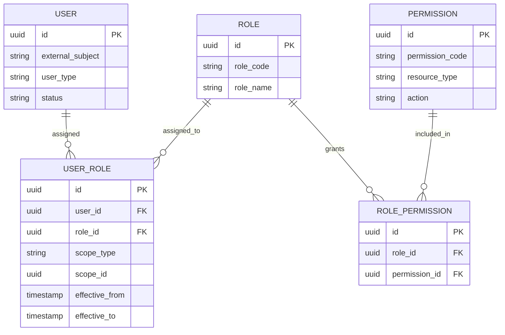

# User, Role, Permission, and Commercial Authority Model

## 1. Core Idea

User, role, permission, and commercial authority modelling menjawab:

> Siapa boleh melihat, membuat, mengubah, menyetujui, membatalkan, mengonversi, memperbaiki, atau mengeksekusi data bisnis tertentu, dalam scope apa, dengan authority apa, dan dengan audit apa?

Dalam CPQ / Quote / Order / Billing, permission bukan hanya UI concern.

Permission dan authority menentukan:

- siapa boleh membuat quote,
- siapa boleh memberi discount,
- siapa boleh approve margin exception,
- siapa boleh convert quote to order,
- siapa boleh cancel order,
- siapa boleh melakukan manual correction,
- siapa boleh melihat invoice/pricing/margin,
- siapa boleh mengubah billing account,
- siapa boleh resolve fallout,
- siapa boleh access customer hierarchy tertentu.

Mental model:

> Access control protects data visibility. Commercial authority protects business decisions. Both must be modelled explicitly and audited.

---

## 2. Why This Model Matters

Tanpa model user/role/authority yang jelas, sistem rawan:

- user mengubah quote milik account lain,
- sales rep memberi discount melebihi authority,
- approval dilakukan oleh orang yang tidak berwenang,
- delegated approver tidak tercatat,
- billing data diakses oleh role yang salah,
- manual production correction tanpa authority,
- service account/system user mengubah data tanpa trace,
- support user melihat customer yang tidak menjadi scope-nya,
- data privacy breach,
- audit tidak bisa menjawab siapa melakukan apa.

Dalam enterprise system, permission dan authority adalah bagian dari data correctness.

---

## 3. User Types

Not all users are human employees.

| User type | Meaning |
|---|---|
| Internal user | Employee/operator/sales/support. |
| Customer user | User from customer organization/portal. |
| Partner user | Reseller/integrator/partner. |
| System user | Non-human service account. |
| Batch user | Scheduled job actor. |
| Integration user | External system/API credential. |
| Support user | Internal support/operator. |
| Admin user | Configuration/security administrator. |

Audit must distinguish human and non-human actors.

Example:

```text
actor_type = USER / SYSTEM / INTEGRATION / BATCH
actor_id = ...
source_system = ...
```

---

## 4. Identity vs Application User

Identity may be owned outside application.

Examples:

- corporate IdP,
- SSO provider,
- IAM,
- customer portal identity,
- partner identity,
- API client credentials.

Application user model may store:

- internal user reference,
- external subject ID,
- display name,
- email,
- status,
- user type,
- organization/account scope,
- last sync time.

Do not assume application owns password/authentication unless it truly does.

---

## 5. Role vs Permission vs Authority

| Concept | Meaning |
|---|---|
| Role | Named bundle of responsibilities. |
| Permission | Specific allowed action/resource. |
| Authority | Business decision power, often threshold/scoped. |
| Scope | Where role/permission/authority applies. |
| Delegation | Temporary assignment of authority/responsibility. |
| Ownership | Accountability for object/process. |

Example:

```text
Role:
  Sales Manager

Permission:
  submit quote
  approve discount

Authority:
  approve discount up to 15% for APAC enterprise accounts

Scope:
  account hierarchy = APAC

Delegation:
  delegated to another manager from Aug 1 to Aug 7
```

RBAC alone may not model commercial authority sufficiently.

---

## 6. RBAC Model

Role-Based Access Control:



RBAC answers:

> What can this user generally do?

But it may not answer:

> Can this user approve this specific discount on this specific account at this amount?

That requires authority/guard model.

---

## 7. ABAC and Scope

Attribute-Based Access Control uses attributes:

- user department,
- account owner,
- customer segment,
- region,
- quote status,
- discount amount,
- product line,
- billing sensitivity,
- data classification.

Example rule:

```text
User can view quote if:
  user has VIEW_QUOTE permission
  and quote.account_id is within user's account scope
  and quote.data_classification is not above user's clearance.
```

Scope dimensions:

- organization,
- customer,
- account,
- billing account,
- site,
- region,
- product family,
- sales territory,
- owner team,
- tenant.

Model scope explicitly if application must evaluate it.

---

## 8. Commercial Authority

Commercial authority is business approval power.

It can depend on:

- discount percentage,
- discount amount,
- margin,
- deal value,
- product family,
- customer segment,
- region,
- sales channel,
- contract term,
- payment term,
- non-standard clause,
- billing risk,
- credit hold,
- manual override type.

Example authority:

```text
Approver A may approve:
  discount <= 10%
  margin >= 30%
  deal value <= $100k
  region = APAC
  product family = Connectivity
```

Commercial authority should be data-driven or at least auditable.

---

## 9. Authority Rule Model

Conceptual model:

```text
commercial_authority_rule
- id
- authority_type
- subject_type = USER / ROLE / GROUP
- subject_id
- scope_type
- scope_id
- threshold_type
- threshold_value
- currency
- condition_expression
- effective_from
- effective_to
- status
```

Examples:

```text
authority_type = DISCOUNT_APPROVAL
threshold_type = MAX_DISCOUNT_PERCENT
threshold_value = 15

authority_type = DEAL_APPROVAL
threshold_type = MAX_DEAL_VALUE
threshold_value = 500000
currency = USD
```

Avoid hard-coding all thresholds in scattered service logic if commercial authority changes often.

---

## 10. Approval Authority vs Workflow Step

Approval workflow step says:

> This quote needs approval at level 2.

Authority says:

> This actor is allowed to make the level 2 decision for this quote.

Do not confuse them.

Approval request model should validate:

- required approval level,
- candidate approvers,
- authority at decision time,
- delegation,
- conflict of interest,
- maker-checker rule,
- scope,
- decision audit.

---

## 11. Maker-Checker Rule

Maker-checker prevents same person from creating and approving sensitive action.

Examples:

```text
Sales rep who requested discount cannot approve own discount.
User who created manual billing adjustment cannot approve it.
User who performed data correction cannot verify it.
```

Model support:

```text
approval_policy
- maker_checker_required
- conflict_rule
```

Decision guard:

```text
decision.actor_id != request.created_by
```

But real rules can be more complex: same team, same manager, delegated authority, emergency override.

---

## 12. Delegation Model

Delegation allows temporary transfer of authority.

Use cases:

- approver on vacation,
- regional manager delegates to deputy,
- support lead delegates fallout resolution,
- finance approver delegates billing adjustment approval.

Delegation fields:

```text
authority_delegation
- id
- delegator_user_id
- delegate_user_id
- authority_type
- scope_type
- scope_id
- effective_from
- effective_to
- reason_code
- status
- approved_by
```

Delegation must be time-bound and audited.

Failure mode:

```text
Delegated approver retains authority permanently after temporary need.
```

---

## 13. Group and Team Model

Users often belong to groups/teams.

Examples:

- Sales Team APAC,
- Pricing Team,
- Deal Desk,
- Billing Operations,
- Fulfillment Ops,
- Support Tier 2,
- DBA/Platform Admin,
- Product Catalog Admin.

Group membership fields:

```text
user_group_membership
- user_id
- group_id
- role_in_group
- effective_from
- effective_to
```

Team/group can own work queues:

- approval queue,
- fallout queue,
- billing correction queue,
- product catalog review queue.

Do not overload team membership as authority unless explicitly governed.

---

## 14. Sales Rep and Owner Model

Ownership matters for quote/order/account.

Owner types:

- account owner,
- quote owner,
- order owner,
- sales rep,
- sales manager,
- fulfillment owner,
- billing owner,
- support owner.

Ownership can be represented as related party role:

```text
entity_related_user
- subject_type
- subject_id
- user_id
- role = OWNER / SALES_REP / ORDER_MANAGER / APPROVER
- effective_from
- effective_to
```

Ownership affects:

- visibility,
- assignment,
- approval route,
- escalation,
- reporting,
- accountability.

---

## 15. Access to Sensitive Commercial Data

Not every user who can view quote can view margin/cost.

Sensitive fields:

- cost,
- margin,
- internal discount threshold,
- approval rule,
- pricing override,
- profitability,
- customer credit status,
- contract clauses,
- invoice/payment details.

Use field-level or projection-level control.

Examples:

```text
VIEW_QUOTE
VIEW_QUOTE_PRICE
VIEW_MARGIN
VIEW_COST
VIEW_BILLING_DETAILS
APPROVE_DISCOUNT
```

Do not expose sensitive fields through generic DTOs without permission filtering.

---

## 16. System User and Service Account

Background jobs and integrations must have actor identity.

Examples:

- quote expiry job,
- order decomposition worker,
- billing activation integration,
- reconciliation job,
- Kafka consumer,
- Camunda worker,
- external CRM integration.

Audit should record:

```text
actor_type = SYSTEM
actor_id = quote-expiry-job
source_system = quote-service
correlation_id = ...
```

Avoid audit entries like:

```text
updated_by = null
```

Null actor weakens audit and debugging.

---

## 17. Permission Model for Commands

Commands should map to permissions.

Examples:

| Command | Permission |
|---|---|
| Create quote | `QUOTE_CREATE` |
| Update quote item | `QUOTE_ITEM_UPDATE` |
| Submit quote | `QUOTE_SUBMIT` |
| Approve discount | `QUOTE_APPROVE_DISCOUNT` |
| Accept quote | `QUOTE_ACCEPT` |
| Convert quote to order | `QUOTE_CONVERT_TO_ORDER` |
| Cancel order | `ORDER_CANCEL` |
| Resolve fallout | `FULFILLMENT_FALLOUT_RESOLVE` |
| Apply billing correction | `BILLING_CORRECTION_APPLY` |
| Publish catalog | `CATALOG_PUBLISH` |

Command guard should evaluate permission + scope + lifecycle + authority.

Permission alone is not enough.

---

## 18. Access Control Decision Record

For sensitive operations, record decision evidence.

Fields:

```text
access_decision_log
- id
- actor_id
- actor_type
- resource_type
- resource_id
- action
- decision
- reason_code
- evaluated_policy_version
- scope_type
- scope_id
- correlation_id
- evaluated_at
```

Do not log every read at high volume unless required. But sensitive writes/approvals/corrections should be auditable.

---

## 19. Commercial Approval Decision

Approval decision should store:

- approval request,
- approver actor,
- authority used,
- decision,
- reason/comment,
- threshold evaluated,
- quote/order/pricing snapshot,
- delegation reference if used,
- maker-checker evidence,
- timestamp,
- correlation ID.

Do not store only:

```text
approval_status = APPROVED
```

That is not enough for audit.

---

## 20. Role and Permission Lifecycle

Roles and permissions change.

Need:

- effective date,
- assignment status,
- assignment reason,
- granted by,
- revoked by,
- revocation reason,
- last sync from IdP,
- source system,
- audit history.

For production support and compliance, you must answer:

- who had access at the time of action?
- who granted access?
- was access still valid?
- was user delegated?
- did user have authority for this amount/scope?

---

## 21. PostgreSQL Physical Design

User table:

```sql
create table app_user (
  id uuid primary key,
  external_subject text,
  user_type text not null,
  display_name text,
  email text,
  status text not null,
  source_system text,
  last_synced_at timestamptz,
  created_at timestamptz not null,
  updated_at timestamptz not null
);
```

Role/permission:

```sql
create table role (
  id uuid primary key,
  role_code text not null unique,
  role_name text not null,
  status text not null
);

create table permission (
  id uuid primary key,
  permission_code text not null unique,
  resource_type text not null,
  action text not null,
  description text
);

create table role_permission (
  role_id uuid not null references role(id),
  permission_id uuid not null references permission(id),
  primary key (role_id, permission_id)
);
```

User role with scope:

```sql
create table user_role_assignment (
  id uuid primary key,
  user_id uuid not null references app_user(id),
  role_id uuid not null references role(id),
  scope_type text,
  scope_id uuid,
  effective_from timestamptz not null,
  effective_to timestamptz,
  granted_by uuid,
  status text not null
);
```

Commercial authority:

```sql
create table commercial_authority_rule (
  id uuid primary key,
  authority_type text not null,
  subject_type text not null,
  subject_id uuid not null,
  scope_type text,
  scope_id uuid,
  threshold_type text,
  threshold_value numeric(18,4),
  currency char(3),
  condition_expression text,
  effective_from timestamptz not null,
  effective_to timestamptz,
  status text not null,
  created_at timestamptz not null,
  updated_at timestamptz not null
);
```

Delegation:

```sql
create table authority_delegation (
  id uuid primary key,
  delegator_user_id uuid not null,
  delegate_user_id uuid not null,
  authority_type text not null,
  scope_type text,
  scope_id uuid,
  effective_from timestamptz not null,
  effective_to timestamptz not null,
  reason_code text,
  status text not null,
  approved_by uuid,
  created_at timestamptz not null
);
```

Useful indexes:

```sql
create index idx_user_role_user_status
on user_role_assignment (user_id, status, effective_from desc);

create index idx_user_role_scope
on user_role_assignment (scope_type, scope_id, status);

create index idx_authority_subject
on commercial_authority_rule (subject_type, subject_id, authority_type, status);

create index idx_authority_scope
on commercial_authority_rule (scope_type, scope_id, authority_type, status);

create index idx_delegation_delegate_time
on authority_delegation (delegate_user_id, authority_type, effective_from, effective_to);
```

---

## 22. Java/JAX-RS Backend Implications

Access control should be evaluated in application/service boundary.

Bad pattern:

```java
if (user.role().equals("ADMIN")) {
    approveQuote();
}
```

Better pattern:

```java
authorizationService.assertAllowed(
    actor,
    Action.APPROVE_DISCOUNT,
    Resource.quote(quote.id()),
    AuthorizationContext.from(quote, discount, accountHierarchy)
);

commercialAuthorityService.assertHasAuthority(
    actor,
    AuthorityType.DISCOUNT_APPROVAL,
    CommercialDecisionContext.from(quote, discount, margin)
);
```

Typical structure:

```text
Resource layer
  -> Authentication context extraction
  -> Application service
      -> Authorization service
      -> Commercial authority service
      -> Domain invariant checker
      -> Audit service
```

Do not rely only on UI hiding buttons.

---

## 23. API Model Considerations

Expose safe identity/permission models.

Examples:

```http
GET /me
GET /me/permissions
GET /me/scopes
GET /approval-authorities
POST /authority-delegations
GET /users/{id}/assignments
```

Sensitive admin APIs should be protected.

Avoid returning all permissions/authorities for all users to ordinary clients.

For frontend enablement, a summarized capability response may be safer:

```json
{
  "canSubmitQuote": true,
  "canApproveDiscount": false,
  "canViewMargin": false
}
```

But server must still enforce all checks.

---

## 24. Event Model

Events:

- `UserRoleAssigned`
- `UserRoleRevoked`
- `PermissionChanged`
- `CommercialAuthorityGranted`
- `CommercialAuthorityRevoked`
- `AuthorityDelegated`
- `AuthorityDelegationExpired`
- `ApprovalAuthorityUsed`
- `AccessDenied`
- `SensitiveActionPerformed`

Payload example:

```json
{
  "eventId": "uuid",
  "eventType": "CommercialAuthorityGranted",
  "eventVersion": 1,
  "occurredAt": "2026-07-12T10:00:00Z",
  "subjectType": "USER",
  "subjectId": "user-id",
  "authorityType": "DISCOUNT_APPROVAL",
  "scopeType": "ACCOUNT",
  "scopeId": "account-id",
  "thresholdType": "MAX_DISCOUNT_PERCENT",
  "thresholdValue": "15",
  "effectiveFrom": "2026-07-12T00:00:00Z",
  "correlationId": "corr-123"
}
```

Access/permission events may be security-sensitive. Limit payload and protect consumers.

---

## 25. Redis/Cache Impact

Permissions and authorities are often cached.

Risks:

- revoked role still cached,
- expired delegation still active,
- authority threshold changed but cache stale,
- access scope changes not reflected,
- user sees data after transfer/removal.

Mitigation:

- short TTL for permission cache,
- versioned permission cache,
- event-driven invalidation,
- cache key includes user and permission version,
- force re-evaluation for sensitive commands,
- never trust client-side cached permission for server enforcement.

---

## 26. Camunda/Workflow Impact

Workflow tasks often use roles/groups.

Examples:

- approval task assigned to pricing team,
- fallout task assigned to fulfillment ops,
- billing correction task assigned to finance,
- manual review task assigned to deal desk.

Important:

- workflow candidate group is not sufficient authority proof,
- task completion should call domain service,
- domain service revalidates permission/authority,
- delegation should be reflected in task assignment or decision guard,
- Camunda user/group model may differ from application identity.

Workflow state should not bypass commercial authority checks.

---

## 27. Reporting and Audit Impact

Reports:

- approvals by approver,
- discount approved by authority level,
- access role assignments,
- delegation usage,
- sensitive action audit,
- manual correction by user,
- approval SLA by group,
- access denied trends,
- role creep / unused roles,
- user activity by customer/account scope.

Audit must answer:

- who acted,
- what role/authority they used,
- what scope applied,
- whether delegation was used,
- what policy version evaluated,
- what decision was made,
- what data snapshot was approved.

---

## 28. Data Quality Checks

```sql
-- Active role assignment with invalid effective interval
select id, user_id, role_id
from user_role_assignment
where effective_to is not null
  and effective_to <= effective_from;

-- Expired delegation still active
select id, delegator_user_id, delegate_user_id, effective_to
from authority_delegation
where status = 'ACTIVE'
  and effective_to < now();

-- Authority rule without scope for scoped authority types
select id, authority_type, subject_type, subject_id
from commercial_authority_rule
where authority_type in ('DISCOUNT_APPROVAL', 'DEAL_APPROVAL')
  and scope_type is null
  and scope_id is null;

-- Duplicate active role assignment
select user_id, role_id, scope_type, scope_id, count(*)
from user_role_assignment
where status = 'ACTIVE'
  and (effective_to is null or effective_to > now())
group by user_id, role_id, scope_type, scope_id
having count(*) > 1;
```

Adjust enum names and schema internally.

---

## 29. Security and Privacy

This model directly affects security.

Controls:

- least privilege,
- separation of duties,
- maker-checker,
- delegated authority expiry,
- approval audit,
- sensitive field-level access,
- privileged action logging,
- service account ownership,
- credential rotation,
- external identity sync validation,
- account scope enforcement,
- tenant isolation,
- emergency access break-glass audit.

Be careful with:

- admin roles,
- support impersonation,
- production data correction,
- billing/payment data access,
- cost/margin visibility,
- customer hierarchy visibility.

---

## 30. Failure Modes

| Failure mode | Symptom | Likely cause | Prevention |
|---|---|---|---|
| Unauthorized discount approval | Revenue leakage/audit failure | Authority not threshold/scoped | Commercial authority model |
| User sees wrong customer data | Privacy breach | Access scope ignored | Scoped permission check |
| Revoked user still acts | Security incident | Stale permission cache | TTL/invalidation/re-evaluation |
| Delegation never expires | Unauthorized long-term approval | No effective_to/status check | Time-bound delegation |
| System update untraceable | Audit gap | Null/system actor missing | System actor model |
| Same person requests and approves | Control violation | No maker-checker | Maker-checker guard |
| Margin visible to broad users | Sensitive data leak | Field-level permissions missing | Sensitive permission model |
| Workflow task bypasses authority | Invalid approval | Workflow assignment trusted too much | Domain authority check |
| Role explosion | Governance impossible | Roles used for every exception | Role/permission/authority design |
| Access decision unexplainable | Audit failure | No decision evidence | Access/approval decision log |

---

## 31. PR Review Checklist

When reviewing user/role/authority changes, ask:

- Is this identity, user, role, permission, group, team, or authority?
- Is the user human, system, integration, or batch?
- Does permission have resource/action semantics?
- Is scope explicit?
- Is commercial authority distinct from generic permission?
- Are thresholds and currencies modelled?
- Is delegation time-bound and audited?
- Is maker-checker needed?
- Are sensitive fields protected?
- Does command enforce server-side authorization?
- Does workflow task completion recheck authority?
- Is permission cache safe after revocation?
- Are service accounts auditable?
- Does approval decision store authority evidence?
- Are access-denied and sensitive actions observable?
- Are security/privacy requirements met?
- Are internal IdP/IAM ownership assumptions verified?

---

## 32. Internal Verification Checklist

Verify these in the internal CSG/team context:

- Whether identity is owned by internal app, SSO/IdP, IAM, or customer portal.
- Actual user table/entity and external subject mapping.
- Actual role and permission model.
- Whether permissions are command-based, resource-based, or UI-only.
- Whether account/customer/site scope exists.
- Whether commercial authority/approval threshold is modelled separately.
- Whether discount/margin/deal approval authority is data-driven or hard-coded.
- Whether delegation exists and is time-bound.
- Whether maker-checker is required for discounts, billing correction, data correction, or catalog publication.
- Whether system/batch/integration users are represented in audit.
- Whether service accounts are owned and rotated.
- Whether approval decision stores authority evidence.
- Whether workflow/Camunda tasks revalidate domain authority.
- Whether Redis/session/permission cache invalidation exists.
- Whether sensitive fields like cost, margin, discount threshold, billing/payment data are field-protected.
- Whether access control is enforced server-side.
- Whether incidents mention unauthorized approval, stale role, data leak, or untraceable system update.

---

## 33. Summary

User, role, permission, and commercial authority modelling is security plus business correctness.

A strong model must define:

- user identity,
- human/system/integration actors,
- roles,
- permissions,
- scopes,
- groups/teams,
- ownership,
- commercial authority,
- thresholds,
- delegation,
- maker-checker,
- sensitive field access,
- workflow integration,
- audit evidence,
- cache invalidation,
- access decision trace.

The key principle:

> Permission says what action a user may perform. Commercial authority says what business decision they are trusted to make. Enterprise quote-to-cash systems need both.
