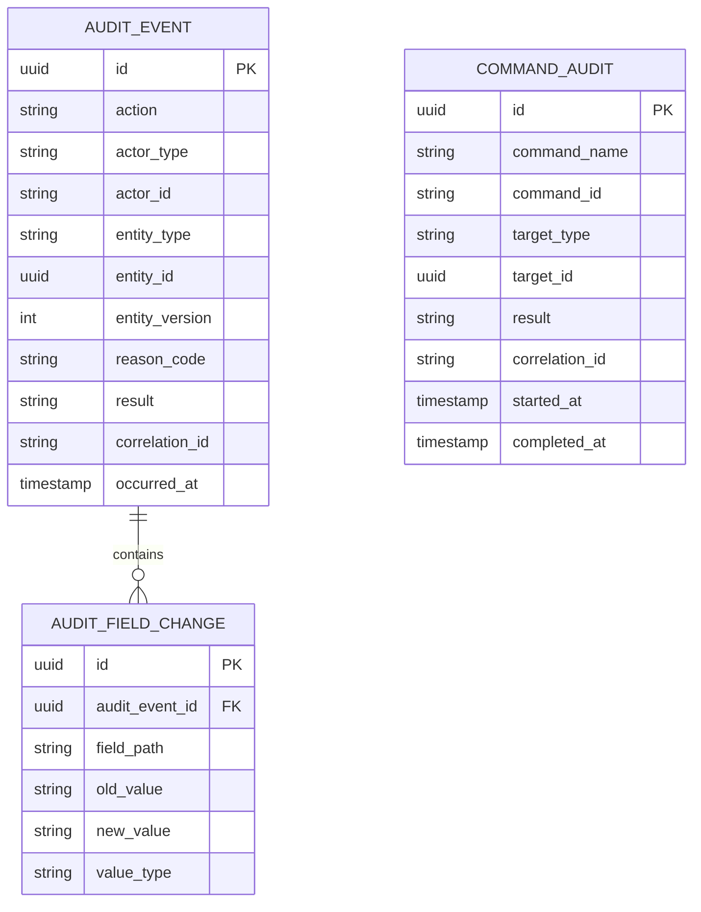

# Audit Trail and Change History Model

## 1. Core Idea

Audit trail adalah data model yang menjawab:

> Siapa melakukan apa, pada entity apa, kapan, dari mana, kenapa, dengan before/after apa, melalui command apa, dalam correlation apa, dan dengan hasil apa?

Change history menjawab:

> Data berubah dari nilai apa ke nilai apa, pada versi mana, oleh actor siapa, dan karena business action apa?

Dalam enterprise CPQ / Quote / Order / Billing, audit bukan nice-to-have. Audit diperlukan untuk:

- dispute,
- compliance,
- financial correctness,
- approval evidence,
- incident review,
- production debugging,
- fraud prevention,
- root cause analysis,
- customer support,
- legal proof,
- data repair.

Mental model:

> Audit trail is the evidence layer. If a critical business change cannot be explained later, the model is incomplete.

---

## 2. Why Audit Modelling Matters

Tanpa audit yang kuat:

- tidak bisa membuktikan siapa mengubah discount,
- tidak bisa menjelaskan kenapa order cancelled,
- tidak tahu apakah billing account berubah sebelum invoice,
- tidak bisa melihat sebelum/sesudah correction,
- approval dispute tidak bisa dijawab,
- quote converted to order tapi source snapshot tidak jelas,
- incident investigation bergantung pada log yang sudah rotate,
- compliance gagal karena missing actor/reason,
- support tidak bisa menjawab customer complaint,
- data repair tidak punya evidence.

Audit harus diperlakukan sebagai first-class domain data untuk business-critical operations.

---

## 3. Audit vs Logging vs Event

Ketiga konsep ini sering tertukar.

| Concept | Purpose | Audience |
|---|---|---|
| Application log | Debug runtime behavior. | Engineers/SRE. |
| Domain event | Communicate business fact to systems. | Services/consumers. |
| Audit trail | Preserve evidence of action/change/decision. | Business, compliance, support, incident review. |
| Change history | Record before/after data changes. | Support, audit, debugging, reporting. |

Logs can disappear or be sampled. Audit must be durable according to retention policy.

Events can be integration contracts. Audit can contain internal evidence not suitable for events.

---

## 4. What Should Be Audited

Audit critical actions:

- create/update/delete quote,
- add/remove/modify quote item,
- price calculation/recalculation,
- discount/adjustment/override,
- approval request/decision,
- quote accepted,
- quote converted to order,
- order created/submitted/cancelled/amended,
- fulfillment fallout resolution,
- billing account change,
- charge activation/termination,
- invoice adjustment,
- payment status update if locally owned,
- product inventory change,
- service/resource inventory correction,
- user/role/permission/authority change,
- data correction/manual repair,
- catalog publish,
- pricing rule change.

Not every technical field update needs full field-level audit, but critical business changes do.

---

## 5. Who / What / When / Why / How

Minimum audit questions:

| Question | Example field |
|---|---|
| Who acted? | `actor_id`, `actor_type`, `actor_display_name`. |
| What was affected? | `entity_type`, `entity_id`, `entity_version`. |
| What action? | `action`, `command_name`. |
| When? | `occurred_at`. |
| Why? | `reason_code`, `reason_text`. |
| How? | `source_system`, `channel`, `api_endpoint`. |
| From where? | `ip_address`, `user_agent`, `client_id` where appropriate. |
| What changed? | `before_snapshot`, `after_snapshot`, field changes. |
| Was it successful? | `result`, `error_code`. |
| Correlation? | `correlation_id`, `causation_id`, `request_id`. |

Audit without reason is often weak for business-sensitive actions.

---

## 6. Actor Model

Actor can be:

- human user,
- system user,
- integration client,
- batch job,
- workflow engine,
- support impersonation,
- delegated actor.

Audit actor fields:

```text
actor_type
actor_id
actor_display_name
actor_source
impersonated_by
delegation_id
service_account_id
```

Avoid null actor.

Bad:

```text
updated_by = null
```

Better:

```text
actor_type = SYSTEM
actor_id = quote-expiry-job
source_system = quote-service
```

---

## 7. Action Model

Audit action should be semantic, not only HTTP method.

Bad audit:

```text
PATCH /quotes/123
```

Better:

```text
action = APPLY_DISCOUNT
command = ApplyQuoteDiscount
entity_type = QUOTE
entity_id = quote-123
```

Examples:

- `QUOTE_CREATED`
- `QUOTE_ITEM_ADDED`
- `PRICE_RECALCULATED`
- `DISCOUNT_OVERRIDDEN`
- `APPROVAL_DECISION_RECORDED`
- `QUOTE_ACCEPTED`
- `ORDER_CANCELLED`
- `FULFILLMENT_FALLOUT_RESOLVED`
- `BILLING_ACCOUNT_CHANGED`
- `CHARGE_TERMINATED`
- `PRODUCT_INSTANCE_SUSPENDED`
- `DATA_CORRECTION_APPLIED`

Semantic action makes audit usable by support and compliance.

---

## 8. Entity Reference

Audit should reference affected entity.

Fields:

```text
entity_type
entity_id
entity_number
entity_version
parent_entity_type
parent_entity_id
```

Examples:

```text
entity_type = QUOTE_ITEM
entity_id = quote-item-1
parent_entity_type = QUOTE
parent_entity_id = quote-123
```

This helps query all audit entries for a quote/order.

---

## 9. Before/After Snapshot

For critical changes, store before/after.

Options:

| Option | Meaning |
|---|---|
| Field-level diff | Efficient and readable for changed fields. |
| Full before/after snapshot | Strong evidence, more storage. |
| Hash/reference | Secure/large payload evidence. |
| Domain-specific summary | Good for support. |
| Hybrid | Common for enterprise. |

Field-level change example:

```text
field_name = discountPercent
old_value = 10
new_value = 18
```

Snapshot example:

```json
{
  "quoteVersion": 4,
  "totalAmount": "500000.00",
  "discountPercent": "18.0",
  "currency": "USD"
}
```

Sensitive snapshots must be protected.

---

## 10. Field-Level Change History

Conceptual model:

```text
entity_change_history
- id
- entity_type
- entity_id
- entity_version
- change_group_id
- field_path
- old_value
- new_value
- value_type
- changed_by
- changed_at
```

`change_group_id` groups multiple field changes from one command.

Example:

```text
Change group:
  command = UpdateBillingAccount

Field changes:
  billingAccountId: BA-001 -> BA-002
  billingContactId: C-111 -> C-222
```

This is useful for support and audit.

---

## 11. Command Audit

Command audit records attempted business commands.

Fields:

```text
command_audit
- id
- command_name
- command_id
- actor_id
- actor_type
- target_type
- target_id
- idempotency_key
- request_payload_hash
- result
- error_code
- started_at
- completed_at
- correlation_id
```

Why command audit matters:

- rejected command evidence,
- idempotency debugging,
- API dispute,
- concurrent update investigation,
- retry analysis.

You may not store full request payload for privacy/security. Store hash/reference where needed.

---

## 12. Status History

Lifecycle states should have explicit history.

Examples:

- quote status history,
- order status history,
- order item state history,
- product status history,
- billing account status history,
- subscription status history,
- approval status history.

Status history fields:

```text
status_history
- id
- entity_type
- entity_id
- from_status
- to_status
- command
- actor_id
- reason_code
- correlation_id
- transitioned_at
```

Status history is often more important than generic field diff for lifecycle-driven systems.

---

## 13. Decision Audit

Decision audit applies to approvals, overrides, corrections, and manual judgments.

Fields:

```text
decision_audit
- id
- decision_type
- target_type
- target_id
- target_version
- decision
- decided_by
- authority_reference
- evidence_reference
- reason_code
- comment
- decided_at
```

Examples:

- discount approved,
- serviceability override approved,
- billing credit approved,
- data correction approved,
- catalog publish approved.

Decision audit must preserve evidence at decision time.

---

## 14. Correction Audit

Production correction needs strong audit.

Fields:

```text
data_correction_audit
- id
- correction_id
- target_entity_type
- target_entity_id
- correction_type
- before_snapshot
- after_snapshot
- reason_code
- incident_reference
- requested_by
- approved_by
- applied_by
- verified_by
- applied_at
- verified_at
```

Never rely only on manual SQL notes for critical business correction.

---

## 15. Event Audit and Outbox Trace

When domain events are published, audit should link:

- business command,
- state change,
- outbox event,
- broker publish,
- consumer processing if available.

Fields:

```text
event_audit
- event_id
- event_type
- aggregate_type
- aggregate_id
- event_version
- outbox_id
- publish_status
- published_at
- correlation_id
- causation_id
```

This helps answer:

- was event generated?
- was event published?
- did consumer receive/process it?
- did event correspond to state change?

---

## 16. Correlation and Causation

Correlation connects all records for one flow.

Example flow:

```text
User approves quote
  -> approval decision
  -> quote status change
  -> outbox event
  -> order conversion
  -> order created
```

Use:

```text
correlation_id = same across whole business flow
causation_id = previous command/event that caused this record
request_id = technical HTTP/request id
```

Correlation ID is essential for production debugging.

---

## 17. Immutability

Audit records should be append-only or strongly protected.

Risks:

- audit row updated/deleted,
- evidence changed after dispute,
- support correction modifies history,
- admin deletes sensitive audit.

Controls:

- append-only table policy,
- restricted DB permissions,
- immutable storage,
- hash chaining if required,
- write-once retention where required,
- separate audit schema,
- audit audit-access if sensitive.

Not every system needs blockchain-like complexity, but audit must be trustworthy.

---

## 18. Audit Retention

Retention depends on:

- legal requirement,
- financial record retention,
- customer contract,
- security policy,
- privacy policy,
- operational debugging need,
- data minimization.

Different audit types may have different retention:

| Audit type | Typical consideration |
|---|---|
| Financial audit | Long retention. |
| Security access audit | Compliance-driven. |
| Debug command audit | Shorter possible. |
| PII-containing payload | Minimize/mask/delete by policy. |
| Approval evidence | Often tied to contract/quote retention. |

Do not store sensitive data forever without policy.

---

## 19. Audit and Privacy

Audit often stores sensitive data.

Examples:

- personal user names/emails,
- customer contact,
- address,
- payment reference,
- pricing/discount,
- margin/cost,
- comments,
- raw payload.

Privacy controls:

- avoid full sensitive payload where hash/reference is enough,
- mask values,
- encrypt sensitive fields,
- limit access,
- audit audit-log access,
- define retention/purge/anonymization,
- avoid logging secrets/tokens.

Audit must balance evidence and minimization.

---

## 20. Audit Query Patterns

Common queries:

- show all changes for quote/order,
- who changed discount,
- why billing account changed,
- what happened before order cancellation,
- who approved credit,
- what was value before correction,
- what event was published after status change,
- what user/role had access at action time,
- what workflow step caused transition,
- what changed between quote revisions.

Design indexes for these.

Typical filters:

```text
entity_type + entity_id
correlation_id
actor_id
action
occurred_at
reason_code
parent_entity_id
```

---

## 21. Conceptual ERD



---

## 22. PostgreSQL Physical Design

Generic audit event:

```sql
create table audit_event (
  id uuid primary key,
  action text not null,
  actor_type text not null,
  actor_id text not null,
  actor_display_name text,
  source_system text,
  channel text,
  entity_type text not null,
  entity_id uuid not null,
  entity_number text,
  entity_version integer,
  parent_entity_type text,
  parent_entity_id uuid,
  reason_code text,
  reason_text text,
  result text not null,
  error_code text,
  correlation_id text,
  causation_id text,
  request_id text,
  occurred_at timestamptz not null,
  metadata jsonb
);
```

Field change:

```sql
create table audit_field_change (
  id uuid primary key,
  audit_event_id uuid not null references audit_event(id),
  field_path text not null,
  old_value text,
  new_value text,
  value_type text,
  old_value_hash text,
  new_value_hash text
);
```

Command audit:

```sql
create table command_audit (
  id uuid primary key,
  command_name text not null,
  command_id text,
  actor_type text not null,
  actor_id text not null,
  target_type text not null,
  target_id uuid not null,
  idempotency_key text,
  request_payload_hash text,
  result text not null,
  error_code text,
  started_at timestamptz not null,
  completed_at timestamptz,
  correlation_id text,
  request_id text
);
```

Useful indexes:

```sql
create index idx_audit_entity_time
on audit_event (entity_type, entity_id, occurred_at desc);

create index idx_audit_parent_time
on audit_event (parent_entity_type, parent_entity_id, occurred_at desc);

create index idx_audit_actor_time
on audit_event (actor_id, occurred_at desc);

create index idx_audit_correlation
on audit_event (correlation_id);

create index idx_audit_action_time
on audit_event (action, occurred_at desc);

create index idx_command_audit_target
on command_audit (target_type, target_id, started_at desc);

create index idx_command_audit_correlation
on command_audit (correlation_id);
```

For very high volume audit, consider partitioning by time.

---

## 23. Domain-Specific vs Generic Audit

Generic audit is flexible, but domain-specific audit is often clearer.

Examples of domain-specific tables:

- `quote_status_history`
- `order_status_history`
- `approval_decision`
- `billing_adjustment_audit`
- `product_instance_status_history`
- `catalog_publication_history`

Recommended pattern:

- domain-specific history for core lifecycle/decision evidence,
- generic audit event for cross-cutting search and user activity,
- correlation ID links them.

Do not force every audit need into one generic JSON table if domain queries are important.

---

## 24. Java/JAX-RS Backend Implications

Audit should be written from application/domain services, not only HTTP filters.

HTTP filter can capture:

- request ID,
- actor,
- endpoint,
- status code.

But domain service knows:

- business action,
- entity,
- before/after,
- reason,
- command,
- decision evidence.

Structure:

```text
Command handler
  -> Load before state
  -> Validate command
  -> Apply domain change
  -> Save entity
  -> Write domain history
  -> Write audit event
  -> Write outbox event
```

Avoid audit as afterthought in controller.

---

## 25. MyBatis/JPA/JDBC Implications

### MyBatis

Can explicitly insert audit rows in same transaction.

Risk:

- developer forgets audit insert in one mapper path.

Mitigation:

- central command service,
- audit helper,
- tests for audit side effects.

### JPA

Can use entity listeners for technical audit fields, but do not rely on them for business audit.

Entity listener can capture updated_at/updated_by. It cannot reliably capture business reason/command/evidence.

### JDBC

Good for explicit transaction and audit writes.

General rule:

> Technical audit fields are not enough. Business audit must be command-aware.

---

## 26. Event-Sourcing vs Audit Trail

Event sourcing stores domain events as source of truth.

Audit trail stores evidence of actions/changes.

They can overlap but are not identical.

Event-sourced system still may need audit metadata:

- actor,
- reason,
- request,
- authorization,
- evidence,
- decision,
- source system.

Non-event-sourced system can still have robust audit.

Do not claim audit is solved just because Kafka events exist.

---

## 27. Outbox and Audit

Outbox event records are not audit by themselves.

Outbox answers:

> What integration event should be published?

Audit answers:

> What business action occurred and why?

They should link via correlation/causation:

```text
audit_event.id
outbox_event.causation_audit_id
```

This helps incident review:

```text
discount approved -> quote approved event -> order conversion requested event
```

---

## 28. Observability

Audit health monitors:

- critical status changes without audit event,
- audit events without actor,
- audit events without correlation ID,
- correction without approval,
- approval decision without evidence,
- status history mismatch with current status,
- outbox event without corresponding audit,
- audit write failures,
- audit table growth/partition lag.

Example checks:

```sql
-- Audit event with missing actor
select id, action, entity_type, entity_id, occurred_at
from audit_event
where actor_id is null
   or actor_type is null;

-- Critical action without reason
select id, action, entity_type, entity_id
from audit_event
where action in ('ORDER_CANCELLED', 'DISCOUNT_OVERRIDDEN', 'DATA_CORRECTION_APPLIED')
  and reason_code is null;

-- Audit events missing correlation id for command-driven changes
select id, action, entity_type, entity_id
from audit_event
where correlation_id is null
  and occurred_at > now() - interval '1 day';
```

---

## 29. Reporting and Support Impact

Audit supports:

- customer support timeline,
- order history view,
- quote revision history,
- approval history,
- billing dispute investigation,
- operational incident review,
- manual correction report,
- security report,
- compliance export,
- user activity report.

A good support timeline may combine:

- quote status history,
- approval decisions,
- order lifecycle events,
- fulfillment fallout,
- billing changes,
- product inventory changes,
- audit events.

---

## 30. Audit Timeline Model

For UI/support, create timeline projection.

Timeline item fields:

```text
timeline_item
- id
- subject_type
- subject_id
- occurred_at
- event_type
- title
- summary
- actor_display
- severity
- source_reference_type
- source_reference_id
```

This can be a read model derived from audit/history/events.

Do not let timeline replace source audit tables.

---

## 31. Data Quality Checks

```sql
-- Quote current status but no status history
select q.id, q.quote_number, q.status
from quote q
left join quote_status_history h on h.quote_id = q.id
where h.id is null;

-- Order cancellation audit without reason
select id, action, entity_id, occurred_at
from audit_event
where action = 'ORDER_CANCELLED'
  and reason_code is null;

-- Data correction without before/after field changes
select ae.id, ae.entity_type, ae.entity_id
from audit_event ae
left join audit_field_change fc on fc.audit_event_id = ae.id
where ae.action = 'DATA_CORRECTION_APPLIED'
group by ae.id, ae.entity_type, ae.entity_id
having count(fc.id) = 0;
```

Adjust schema names internally.

---

## 32. Security Failure Modes

| Failure mode | Symptom | Likely cause | Prevention |
|---|---|---|---|
| Audit tampered | Evidence untrusted | Audit table mutable by broad roles | Restricted append-only policy |
| Sensitive data leaked | Audit exposes payment/margin/PII | Full payload stored unmasked | Mask/hash/encrypt |
| Actor missing | Cannot attribute action | System jobs not modelled | System actor identity |
| Reason missing | Cannot justify change | Command reason optional | Reason-required policy |
| Audit write failed silently | Data changed no evidence | Audit not transactional/monitored | Same transaction + alerts |
| Logs used as audit | Evidence unavailable later | Log retention shorter | Durable audit table |
| Approval evidence missing | Decision dispute | Status-only approval | Decision evidence model |
| Correction hidden | Manual SQL update | No correction process | Correction audit workflow |
| Stale audit projection | UI timeline wrong | Projection not source of truth | Source audit/history tables |
| Overbroad audit access | Internal data leak | No audit access control | Permission and masking |

---

## 33. PR Review Checklist

When reviewing data-changing code, ask:

- Is this business-critical change?
- Does it need audit?
- What semantic action should be recorded?
- Who is actor?
- What is reason?
- What entity/version is affected?
- Are before/after values needed?
- Are sensitive values masked?
- Is audit written in same transaction?
- Is status history updated?
- Is command audit useful?
- Is correlation ID propagated?
- Is outbox event linked?
- Can support reconstruct timeline?
- Can compliance/dispute prove decision?
- Does audit survive retries/idempotency?
- Are tests verifying audit records?

---

## 34. Internal Verification Checklist

Verify these in the internal CSG/team context:

- Existing audit tables/logging standards.
- Whether audit is generic, domain-specific, or both.
- Whether quote/order/status histories exist.
- Whether audit captures actor, action, reason, correlation ID.
- Whether before/after values are stored for sensitive changes.
- Whether approval decisions store evidence.
- Whether manual corrections are audited.
- Whether system/batch/integration actors are represented.
- Whether audit is written in same transaction as business change.
- Whether audit events are immutable/restricted.
- Whether audit retention policy exists.
- Whether sensitive audit payload is masked/encrypted.
- Whether support timeline exists and its source.
- Whether outbox events can be correlated to audit.
- Whether access to audit data is controlled.
- Whether incidents mention missing audit, untraceable change, or insufficient evidence.

---

## 35. Summary

Audit trail and change history are evidence infrastructure.

A strong audit model must define:

- actor,
- action,
- entity,
- version,
- timestamp,
- reason,
- before/after,
- command,
- status transition,
- decision evidence,
- correction evidence,
- event/outbox correlation,
- correlation/causation IDs,
- immutability,
- retention,
- sensitive data handling,
- support timeline.

The key principle:

> If a critical business change cannot be explained months later without reading ephemeral logs or asking the developer, the data model is not enterprise-ready.
