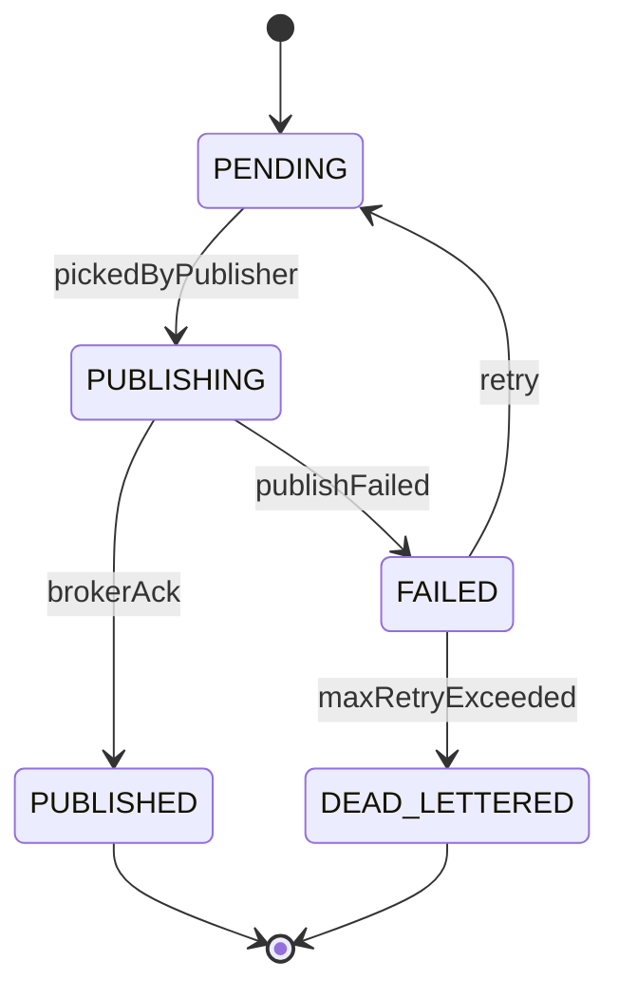

# Event, Outbox, Inbox, and Integration Data Model

## 1. Core Idea

Enterprise microservices tidak cukup hanya menyimpan data di database. Mereka juga harus mengirim dan menerima fakta bisnis secara reliable.

Dalam CPQ / Quote / Order / Billing / Catalog / Telco BSS/OSS, event dan integration message digunakan untuk:

- quote accepted,
- quote converted to order,
- order created,
- order fulfilled,
- product activated,
- billing triggered,
- invoice issued,
- customer updated,
- catalog published,
- approval decided,
- fallout raised,
- reconciliation mismatch detected.

Masalahnya:

> Database transaction and message broker publish are separate failure domains.

Outbox dan inbox pattern dibuat untuk menjaga consistency, idempotency, traceability, retry, and replay.

Mental model:

> Outbox protects reliable event publication. Inbox protects reliable event consumption. Event metadata protects traceability and idempotency.

---

## 2. Why Event Modelling Matters

Tanpa event model yang kuat:

- order dibuat tetapi event tidak terkirim,
- event terkirim tetapi database rollback,
- consumer memproses event dua kali,
- duplicate order/charge dibuat,
- event schema berubah dan consumer rusak,
- replay menciptakan side effect baru,
- broker retry menyebabkan duplicate fulfillment,
- DLQ penuh tetapi tidak ada trace ke business object,
- support tidak tahu event mana yang hilang,
- correlation chain quote-to-order-to-billing putus.

Event-driven architecture bukan hanya Kafka/RabbitMQ. Ia membutuhkan data model untuk event lifecycle.

---

## 3. Domain Event vs Integration Event

| Event type | Meaning | Audience |
|---|---|---|
| Domain event | Internal fact from domain model. | Same bounded context/internal module. |
| Integration event | Stable external contract for other services. | Other bounded contexts/services. |
| Technical event | Infrastructure event, retry, sync, projection. | Platform/worker. |
| Audit event | Evidence of action/decision. | Audit/support/compliance. |

Example:

```text
Domain event:
  QuoteApproved

Integration event:
  QuoteApproved.v1 published to other services

Audit event:
  User X approved Quote Q-100 v4 because discount threshold was met
```

Do not expose internal domain object structure as integration event payload directly.

---

## 4. Event Core Fields

Every event should have stable metadata.

| Field | Purpose |
|---|---|
| `event_id` | Globally unique event identity. |
| `event_type` | Semantic event name. |
| `event_version` | Schema version. |
| `aggregate_type` | Quote, order, product, billing account, etc. |
| `aggregate_id` | Business entity ID. |
| `aggregate_version` | Version of aggregate after event. |
| `occurred_at` | When business fact occurred. |
| `published_at` | When event was published. |
| `correlation_id` | Business flow trace. |
| `causation_id` | Command/event that caused this event. |
| `producer` | Service/source. |
| `tenant_id` | Tenant boundary if applicable. |
| `payload` | Event data. |
| `metadata` | Additional technical/security metadata. |

Important:

> `occurred_at` and `published_at` are different.

---

## 5. Outbox Pattern

Outbox stores event in same database transaction as business change.

Flow:

```text
Begin transaction
  update quote status to ACCEPTED
  insert quote status history
  insert outbox event QuoteAccepted
Commit

Outbox publisher later:
  read unpublished outbox rows
  publish to broker
  mark published
```

This avoids:

- DB committed but event missing,
- event published but DB rolled back.

Conceptual outbox table:

```text
outbox_event
- id
- aggregate_type
- aggregate_id
- event_type
- event_version
- payload
- metadata
- status
- created_at
- published_at
- retry_count
- error_message
```

---

## 6. Outbox Lifecycle



Do not delete pending/failed outbox rows without reconciliation.

---

## 7. Inbox Pattern

Inbox stores received event IDs and processing result to prevent duplicate consumption.

Flow:

```text
Consumer receives event
  Check inbox by event_id/subscriber
  If already processed: ack/skip
  Else:
    Begin transaction
      insert inbox record
      apply side effect idempotently
      mark inbox processed
    Commit
```

Inbox table:

```text
inbox_message
- id
- event_id
- subscriber_name
- event_type
- source_system
- aggregate_type
- aggregate_id
- status
- received_at
- processed_at
- retry_count
- error_message
```

Unique key:

```text
(event_id, subscriber_name)
```

---

## 8. Idempotent Consumer

Consumers must handle duplicate events.

Duplicate sources:

- broker redelivery,
- producer retry,
- replay,
- consumer restart,
- timeout after commit,
- DLQ reprocessing,
- manual republish.

Idempotency strategies:

- inbox event ID,
- natural business key,
- unique constraint,
- idempotency key in command,
- compare aggregate version,
- ignore if state already reached,
- store external reference.

Example:

```text
Order service consumes QuoteConversionRequested.
It must not create two orders for same quote/version.
```

Use unique constraint:

```text
product_order(source_quote_id, source_quote_version)
```

plus inbox record.

---

## 9. Exactly Once vs Effectively Once

Most systems do not truly provide end-to-end exactly-once business side effects.

Practical goal:

> At-least-once delivery + idempotent processing = effectively once business outcome.

Do not rely on broker marketing claims alone.

Business idempotency must be enforced by database/state model.

---

## 10. Event Ordering

Ordering matters for some flows.

Examples:

- quote revised before quote accepted,
- order cancelled before fulfillment complete,
- product suspended before resumed,
- charge terminated before invoice generated.

Broker ordering is often partition/key-based.

Kafka:

```text
key = aggregate_id
```

RabbitMQ:

- queue ordering can be affected by retries/concurrency.

Model should not assume global ordering. Use aggregate version and state guards.

---

## 11. Aggregate Version in Events

Event should include aggregate version.

Example:

```json
{
  "aggregateId": "quote-id",
  "aggregateVersion": 5,
  "eventType": "QuoteAccepted"
}
```

Consumer can detect:

- duplicate version,
- out-of-order version,
- missing version,
- stale event.

If consumer maintains projection, aggregate version helps ensure monotonic updates.

---

## 12. Correlation and Causation

Correlation tracks business flow.

Causation tracks direct cause.

Example:

```text
Command: AcceptQuote
  correlation_id = C1
  command_id = CMD1

Event: QuoteAccepted
  correlation_id = C1
  causation_id = CMD1

Event: QuoteConversionRequested
  correlation_id = C1
  causation_id = QuoteAccepted.event_id

Event: ProductOrderCreated
  correlation_id = C1
  causation_id = QuoteConversionRequested.event_id
```

This enables end-to-end trace.

---

## 13. Schema Versioning

Event schema evolves.

Rules:

- never break consumers silently,
- use `event_version`,
- prefer additive changes,
- avoid changing field meaning,
- deprecate fields gradually,
- document required/optional fields,
- validate schema in CI,
- support old versions during migration.

Event version is not aggregate version.

| Version | Meaning |
|---|---|
| event_version | Schema version of event payload. |
| aggregate_version | Business entity version after change. |
| payload_version | Sometimes same as event version, if explicit. |

---

## 14. Event Payload Design

Good event payload is:

- stable,
- minimal but sufficient,
- contract-oriented,
- versioned,
- not a raw database row dump,
- does not expose unnecessary sensitive data,
- includes references for large/sensitive data.

Example:

```json
{
  "eventId": "uuid",
  "eventType": "ProductOrderCreated",
  "eventVersion": 1,
  "aggregateId": "order-id",
  "orderNumber": "O-10001",
  "sourceQuoteId": "quote-id",
  "sourceQuoteVersion": 4,
  "customerId": "customer-id",
  "billingAccountId": "billing-account-id",
  "status": "CAPTURED",
  "occurredAt": "2026-07-12T10:00:00Z"
}
```

Avoid:

```json
{
  "entireOrderEntityWithEveryInternalField": "..."
}
```

---

## 15. Event Granularity

Too coarse:

```text
OrderUpdated
```

Consumer cannot know what happened.

Too fine:

```text
OrderInternalFlagXChanged
```

Consumers become coupled to internals.

Good semantic events:

- `ProductOrderCreated`
- `ProductOrderSubmitted`
- `ProductOrderCancelled`
- `OrderItemFulfilled`
- `BillingReady`
- `ChargeActivated`
- `ProductInstanceTerminated`

Event granularity should match business fact consumers care about.

---

## 16. Command vs Event

Command requests action.

Event states fact.

Command:

```text
ConvertQuoteToOrder
```

Event:

```text
QuoteConvertedToOrder
```

Command can fail or be rejected. Event should describe something that happened.

Do not name events like commands unless intentionally modelling request events:

```text
QuoteConversionRequested
```

This event means request was recorded, not conversion completed.

---

## 17. Request Event vs Completion Event

Important distinction:

| Event | Meaning |
|---|---|
| `QuoteConversionRequested` | Conversion request persisted. |
| `ProductOrderCreatedFromQuote` | Order was created. |
| `QuoteConvertedToOrder` | Quote marked converted. |
| `QuoteConversionFailed` | Conversion failed. |

Using only one event name creates ambiguity.

For asynchronous flows, model lifecycle events explicitly.

---

## 18. Retry and Dead Letter

Event publish and consumption can fail.

Retry model fields:

```text
retry_count
next_retry_at
last_error_code
last_error_message
max_retries
```

Dead letter fields:

```text
dead_letter_reason
dead_lettered_at
operator_action_required
repair_status
```

DLQ is not a final state. It is an operational queue needing ownership and resolution.

---

## 19. Replay

Replay reprocesses old events.

Use cases:

- rebuild projection,
- repair downstream consumer,
- backfill analytics,
- recover from bug,
- re-run integration.

Risks:

- duplicate side effects,
- old event schema,
- events no longer valid under current rules,
- external calls repeated,
- state transitions illegal today.

Replay-safe consumers:

- distinguish projection rebuild from side-effect execution,
- use inbox/idempotency,
- use replay mode flag,
- avoid sending external side effects during projection replay unless intended.

---

## 20. Projection and Read Model

Events often update projections.

Examples:

- customer order summary,
- quote pipeline view,
- billing dashboard,
- product inventory search index,
- support timeline,
- reporting fact table.

Projection state should track:

```text
projection_name
last_event_id
last_event_offset
last_processed_at
status
```

Projection can lag. UI/API should understand freshness.

---

## 21. Integration Message Tracking

For external systems, track messages.

Fields:

```text
integration_message
- id
- direction = OUTBOUND / INBOUND
- target_system
- source_system
- message_type
- business_entity_type
- business_entity_id
- payload_reference
- status
- external_message_id
- sent_at
- acknowledged_at
- retry_count
- correlation_id
```

This helps support:

- was message sent?
- did external system acknowledge?
- what payload version?
- what error?
- can it be retried?

---

## 22. PostgreSQL Physical Design

Outbox table:

```sql
create table outbox_event (
  id uuid primary key,
  aggregate_type text not null,
  aggregate_id uuid not null,
  aggregate_version integer,
  event_type text not null,
  event_version integer not null,
  payload jsonb not null,
  metadata jsonb,
  correlation_id text,
  causation_id text,
  producer text not null,
  status text not null,
  retry_count integer not null default 0,
  next_retry_at timestamptz,
  last_error_code text,
  last_error_message text,
  created_at timestamptz not null,
  published_at timestamptz
);
```

Inbox table:

```sql
create table inbox_message (
  id uuid primary key,
  event_id uuid not null,
  subscriber_name text not null,
  event_type text not null,
  event_version integer not null,
  source_system text,
  aggregate_type text,
  aggregate_id uuid,
  status text not null,
  retry_count integer not null default 0,
  received_at timestamptz not null,
  processed_at timestamptz,
  last_error_code text,
  last_error_message text,
  correlation_id text,
  unique (event_id, subscriber_name)
);
```

Integration message table:

```sql
create table integration_message (
  id uuid primary key,
  direction text not null,
  source_system text,
  target_system text,
  message_type text not null,
  message_version integer,
  business_entity_type text,
  business_entity_id uuid,
  payload_reference text,
  payload_hash text,
  status text not null,
  external_message_id text,
  sent_at timestamptz,
  acknowledged_at timestamptz,
  retry_count integer not null default 0,
  error_code text,
  error_message text,
  correlation_id text,
  created_at timestamptz not null,
  updated_at timestamptz not null
);
```

Indexes:

```sql
create index idx_outbox_pending
on outbox_event (status, next_retry_at, created_at)
where status in ('PENDING', 'FAILED');

create index idx_outbox_aggregate
on outbox_event (aggregate_type, aggregate_id, aggregate_version);

create index idx_outbox_correlation
on outbox_event (correlation_id);

create index idx_inbox_subscriber_status
on inbox_message (subscriber_name, status, received_at);

create index idx_integration_business_entity
on integration_message (business_entity_type, business_entity_id, created_at desc);

create index idx_integration_correlation
on integration_message (correlation_id);
```

---

## 23. Java/JAX-RS Backend Implications

Application service pattern:

```java
@Transactional
public Quote acceptQuote(AcceptQuoteCommand command) {
    Quote quote = quoteRepository.getForUpdate(command.quoteId());

    quote.accept(command.actor());

    quoteRepository.save(quote);
    auditRepository.append(...);

    outboxRepository.append(
        IntegrationEvent.quoteAccepted(quote, command.correlationId())
    );

    return quote;
}
```

Outbox publisher:

```text
poll pending outbox rows
publish to broker
mark published
retry on failure
dead-letter after threshold
```

Consumer:

```text
receive event
check inbox
process idempotently in transaction
mark inbox processed
ack broker
```

Do not publish directly to broker inside domain service without outbox if reliability matters.

---

## 24. Kafka Considerations

Kafka modelling concerns:

- topic naming,
- partition key,
- schema registry or schema governance,
- event versioning,
- replay semantics,
- consumer group,
- offset management,
- ordering per key,
- compaction if applicable,
- PII in topic retention,
- DLQ/retry topics,
- idempotent producer does not replace business idempotency.

Partition key examples:

| Event | Suggested key |
|---|---|
| Quote events | quote_id |
| Order events | order_id |
| Product inventory events | product_instance_id |
| Billing account events | billing_account_id |
| Customer events | customer_id |

Choose key based on ordering need.

---

## 25. RabbitMQ Considerations

RabbitMQ modelling concerns:

- exchange type,
- routing key,
- queue per consumer group/use case,
- ack/nack,
- retry delay,
- DLQ,
- poison message,
- idempotent consumer,
- message TTL,
- order may be affected by requeue/retry.

Routing key example:

```text
quote.accepted
order.created
order.fulfillment.fallout
billing.charge.activated
product.instance.terminated
```

RabbitMQ delivery guarantees still require inbox/idempotency.

---

## 26. Camunda / Workflow Integration

Workflow engines produce/consume messages too.

Best practice:

- domain event triggers process,
- process task calls domain command,
- domain command writes outbox event,
- process instance ID linked to business entity,
- message correlation uses stable business key.

Avoid process variables as sole integration state.

Store:

```text
workflow_message_correlation
- business_key
- process_instance_id
- message_name
- correlation_status
- correlated_at
```

---

## 27. Security and Privacy

Events can leak sensitive data.

Sensitive data examples:

- customer PII,
- billing address,
- invoice/payment information,
- margin/cost,
- discount thresholds,
- contract details,
- resource/network identifiers.

Controls:

- minimal payload,
- data classification,
- encryption if required,
- topic/queue access control,
- avoid raw payload in logs,
- retention policy,
- masking for DLQ tools,
- payload references for sensitive documents.

---

## 28. Observability

Monitors:

- pending outbox age,
- failed outbox count,
- dead-lettered events,
- inbox processing failures,
- duplicate event count,
- consumer lag,
- projection lag,
- integration message timeout,
- event schema validation failure,
- outbox rows without publisher,
- business object state with missing event.

Example queries:

```sql
-- Outbox stuck
select event_type, count(*), min(created_at) as oldest
from outbox_event
where status in ('PENDING', 'FAILED')
group by event_type
order by oldest;

-- Inbox failures by subscriber
select subscriber_name, event_type, count(*)
from inbox_message
where status = 'FAILED'
group by subscriber_name, event_type
order by count(*) desc;

-- Integration messages not acknowledged
select id, target_system, message_type, business_entity_type, business_entity_id, sent_at
from integration_message
where status = 'SENT'
  and acknowledged_at is null
  and sent_at < now() - interval '30 minutes';
```

---

## 29. Reconciliation

Event/integration reconciliation asks:

| Source | Target | Check |
|---|---|
| Business state | Outbox | Critical state change produced event. |
| Outbox | Broker | Event published. |
| Broker | Inbox | Consumer received/processed. |
| Inbox | Side effect | Consumer created/updated expected data. |
| Integration message | External system | External ack/status received. |
| Projection | Source aggregate | Projection not stale/missing events. |

Example:

```text
Quote status = ACCEPTED
Expected outbox event = QuoteAccepted
Expected order conversion request = exists
```

Reconciliation closes reliability gaps.

---

## 30. Failure Modes

| Failure mode | Symptom | Likely cause | Prevention |
|---|---|---|---|
| DB updated but event missing | Downstream not triggered | No outbox | Transactional outbox |
| Event published but DB rollback | Consumer sees false fact | Direct publish before commit | Publish after commit via outbox |
| Duplicate consumer side effect | Duplicate order/charge | No inbox/idempotency | Inbox + unique constraints |
| Out-of-order projection | UI shows old state | No aggregate version check | Aggregate version |
| Schema break | Consumer fails after deploy | Breaking event change | Versioned schema |
| Replay causes external calls | Duplicate downstream work | Consumer not replay-safe | Replay mode/idempotency |
| DLQ ignored | Integration stuck | No owner/monitor | DLQ process and alert |
| Correlation lost | Debugging impossible | Missing correlation propagation | Correlation/causation IDs |
| Sensitive event leak | Privacy incident | Overbroad payload | Minimal payload/masking |
| Projection stale | Reporting wrong | Consumer lag hidden | Projection lag monitoring |

---

## 31. PR Review Checklist

When reviewing event/integration changes, ask:

- Is this domain event or integration event?
- What business fact does it represent?
- Is event emitted in same transaction via outbox?
- What is event schema version?
- What is aggregate type/id/version?
- What is partition/routing key?
- Is payload minimal and safe?
- Is correlation/causation included?
- Are consumers idempotent?
- Is inbox used for side-effect consumers?
- What happens on duplicate delivery?
- What happens on out-of-order delivery?
- Is replay safe?
- Is DLQ/retry model defined?
- Are projection freshness and lag monitored?
- Are integration messages traceable?
- Are data privacy controls satisfied?

---

## 32. Internal Verification Checklist

Verify these in the internal CSG/team context:

- Whether services use transactional outbox.
- Whether consumers use inbox/idempotency table.
- Whether Kafka, RabbitMQ, or both are used for specific flows.
- Topic/exchange naming conventions.
- Partition/routing key conventions.
- Event schema/versioning governance.
- Whether events include aggregate version.
- Whether correlation/causation IDs are propagated.
- Whether DLQ/retry policy exists.
- Whether replay is supported and safe.
- Whether integration message tracking exists.
- Whether projection lag is monitored.
- Whether event payloads contain sensitive data.
- Whether outbox publishing failure alerts exist.
- Whether consumers have database unique constraints for business idempotency.
- Whether incidents mention missing events, duplicate processing, stale projection, DLQ pileup, or schema incompatibility.

---

## 33. Summary

Event, outbox, and inbox modelling protect distributed correctness.

A strong model must define:

- domain vs integration event,
- event metadata,
- schema version,
- aggregate version,
- outbox lifecycle,
- inbox lifecycle,
- idempotent consumer,
- retry and dead letter,
- replay safety,
- projection tracking,
- integration message tracking,
- correlation and causation,
- security and privacy,
- reconciliation and observability.

The key principle:

> Event-driven systems are not reliable because they use Kafka or RabbitMQ. They are reliable when business state, event publication, event consumption, and side effects are modelled as recoverable, idempotent, auditable data.
