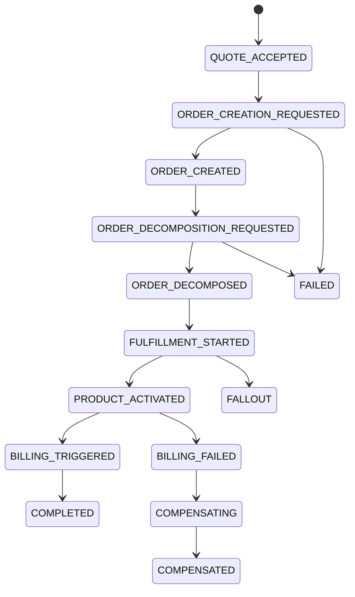

# Distributed Consistency, Saga, and Transaction Boundary Model

## 1. Core Idea

Dalam enterprise microservices, tidak semua perubahan dapat dilakukan dalam satu database transaction.

Quote-to-cash flow sering melewati banyak bounded context:

```text
Quote accepted
  -> Order created
  -> Order decomposed
  -> Fulfillment task created
  -> Service activated
  -> Product inventory updated
  -> Subscription activated
  -> Charge activated
  -> Billing system acknowledged
```

Setiap step bisa dimiliki service berbeda, database berbeda, dan external system berbeda.

Mental model:

> Local transaction protects local invariant. Saga protects long-running business process. Reconciliation protects reality when eventual consistency fails.

Distributed consistency bukan berarti semua harus real-time atomic. Ia berarti setiap langkah punya state, ownership, idempotency, compensation, timeout, and recovery model.

---

## 2. Why Distributed Consistency Matters

Tanpa model distributed consistency:

- quote accepted tetapi order tidak pernah dibuat,
- order created tetapi quote tidak marked converted,
- fulfillment completed tetapi product inventory tidak updated,
- product active tetapi charge tidak activated,
- billing activated tetapi service belum active,
- cancellation local berhasil tetapi downstream tetap jalan,
- retry menciptakan duplicate order/charge/product,
- workflow selesai tetapi domain state tidak sinkron,
- support tidak tahu step mana yang gagal,
- reconciliation hanya dilakukan manual saat incident.

Enterprise systems must assume partial failure.

The question is not:

> Can failure happen?

The real question is:

> When failure happens, is it visible, recoverable, idempotent, and auditable?

---

## 3. Local Transaction Boundary

Local transaction boundary adalah unit atomic dalam satu service/database.

Examples:

### Quote service transaction

```text
Begin transaction
  quote.status = ACCEPTED
  insert quote_status_history
  insert audit_event
  insert outbox_event QuoteAccepted
Commit
```

### Order service transaction

```text
Begin transaction
  create product_order
  create product_order_items
  insert order_status_history
  insert outbox_event ProductOrderCreated
Commit
```

Local transaction should protect:

- aggregate invariant,
- status history,
- audit,
- outbox,
- idempotency record.

Do not include external API calls inside DB transaction unless intentionally controlled. External call can hang, fail, or succeed while DB rolls back.

---

## 4. Aggregate Boundary

Aggregate boundary defines what must be consistent immediately.

Examples:

| Aggregate | Strong local consistency |
|---|---|
| Quote | Header total equals item totals; version controlled; lifecycle valid. |
| Order | Order item belongs to same order; header state consistent with item summary. |
| Approval request | Step/decision aggregation valid. |
| Product instance | Status and current characteristics coherent. |
| Billing charge | Charge amount/currency/account valid. |

Cross-aggregate consistency can be eventual.

Example:

```text
Quote accepted now.
Order created shortly after.
```

This is acceptable if status is visible:

```text
quote.conversion_status = PENDING
```

and reconciliation checks if order creation never happens.

---

## 5. Strong Consistency vs Eventual Consistency

| Consistency type | Use when |
|---|---|
| Strong local consistency | Same aggregate/service/database invariant. |
| Eventual consistency | Cross-service state propagation. |
| Read-your-writes consistency | User immediately expects own change. |
| Monotonic projection consistency | Projection must not regress. |
| External consistency | Third-party/downstream system acknowledges state. |

Example:

```text
Quote status accepted must be local strong consistency.
Billing activation after fulfillment can be eventual consistency.
```

Do not force distributed transaction for every flow. But do not hide eventual consistency without status/reconciliation.

---

## 6. Saga

Saga is a long-running transaction split into steps.

Example quote-to-order saga:



Saga state should be queryable. Do not leave saga state only in logs.

---

## 7. Saga State Model

Conceptual model:

```text
saga_instance
- id
- saga_type
- business_key
- status
- current_step
- correlation_id
- started_at
- completed_at
- failed_at
- failure_code
- failure_message
```

Step model:

```text
saga_step
- id
- saga_instance_id
- step_name
- step_order
- status
- target_context
- command_id
- event_id
- retry_count
- started_at
- completed_at
- failed_at
- compensation_step_name
```

This lets support answer:

- where is the quote-to-order flow stuck?
- which command/event caused it?
- is it retryable?
- has compensation started?
- what is the current owner group?

---

## 8. Orchestration vs Choreography

### Orchestration

A central orchestrator decides next step.

Example:

```text
QuoteToOrderSaga orchestrator:
  call/create order
  wait for order created
  request decomposition
  wait for decomposition completed
```

Pros:

- easier visibility,
- centralized process state,
- clear timeout/retry,
- good for complex workflow.

Cons:

- orchestrator can become central coupling point,
- process logic concentrated.

### Choreography

Services react to events.

Example:

```text
QuoteAccepted -> Order service creates order
ProductOrderCreated -> Fulfillment service decomposes order
ProductActivated -> Billing service activates charge
```

Pros:

- loose coupling,
- autonomous services,
- simple flows.

Cons:

- harder to see overall process,
- failure/recovery scattered,
- event chain can become implicit.

Both need data model for state, retry, idempotency, and reconciliation.

---

## 9. Saga Step Semantics

Each saga step should define:

```text
step_name
owner_context
input_event_or_command
expected_output_event
timeout
retry_policy
compensation_action
idempotency_key
terminal_success_states
terminal_failure_states
```

Example:

```text
Step: CreateProductOrder
Owner: Order service
Command: CreateOrderFromQuote
Expected event: ProductOrderCreated
Timeout: 5 minutes
Retry: safe with idempotency key source_quote_id + quote_version
Compensation: mark quote conversion failed or cancel order if partial
```

Do not encode this only in hidden workflow code.

---

## 10. Idempotency in Distributed Flow

Idempotency must exist at every boundary.

Examples:

| Boundary | Idempotency key |
|---|---|
| Accept quote | `quote_id + quote_version + accept_request_id` |
| Convert quote to order | `quote_id + quote_version` |
| Create order item | `order_id + source_quote_item_id + mapping_type` |
| Activate charge | `product_instance_id + recurring_charge_type + effective_from` |
| Send provisioning request | `fulfillment_task_id + attempt_group` |
| Publish event | `event_id` |
| Consume event | `event_id + subscriber_name` |

Do not rely only on HTTP retry behavior or broker delivery semantics.

---

## 11. Timeout Model

Distributed steps can hang.

Timeout must be modelled.

Fields:

```text
timeout_at
timeout_policy
timeout_status
timeout_reason
last_heartbeat_at
owner_group
```

Examples:

- order creation requested but no order created event,
- fulfillment task sent but no downstream acknowledgement,
- billing trigger sent but no billing acknowledgement,
- approval request pending beyond SLA,
- external serviceability check never responds.

Timeout should transition to:

- retry pending,
- fallout,
- manual intervention,
- failed,
- compensation.

---

## 12. Retry Model

Retry should be explicit.

Fields:

```text
retry_attempt
- id
- target_type
- target_id
- attempt_no
- idempotency_key
- status
- started_at
- completed_at
- error_code
- next_retry_at
```

Retry policy:

- max attempts,
- exponential backoff,
- retryable error codes,
- non-retryable error codes,
- manual approval for risky retry,
- idempotency requirement,
- external status check before retry.

Critical rule:

> Retry must not create a second business effect unless that effect is explicitly intended.

---

## 13. Compensation

Compensation is action that offsets partial success.

Examples:

| Partial success | Compensation |
|---|---|
| Order created but quote conversion fails | Cancel/supersede order or mark conversion failed. |
| Product activated but billing fails | Retry billing or suspend/flag product depending policy. |
| Billing activated but service not active | Stop billing/credit customer. |
| Resource reserved but order cancelled | Release resource. |
| Device shipped but order cancelled | Return/recovery task. |

Compensation is not always exact rollback.

Model:

```text
compensation_action
- id
- saga_instance_id
- source_step_id
- compensation_type
- target_context
- target_entity_type
- target_entity_id
- status
- reason_code
- created_at
- completed_at
```

---

## 14. Reversal vs Compensation

Reversal attempts to undo the same effect.

Compensation applies a new offsetting effect.

Example:

```text
Reversal:
  Cancel unsent provisioning request.

Compensation:
  Service already activated.
  Create disconnect order and credit adjustment.
```

Data model should not call both simply "rollback".

---

## 15. Pending State and User Experience

Eventually consistent flows need visible pending states.

Examples:

```text
quote.conversion_status = PENDING
order.fulfillment_status = IN_PROGRESS
billing_trigger.status = SENT
product_instance.billing_status = PENDING_ACTIVATION
```

Avoid UI/API that says "done" while downstream is still pending.

Good API response:

```json
{
  "quoteId": "quote-id",
  "conversionStatus": "PENDING",
  "orderId": null,
  "correlationId": "corr-123"
}
```

or:

```http
202 Accepted
Location: /quote-conversions/{conversionId}
```

---

## 16. Consistency Status Entity

For long-running conversion:

```text
quote_conversion
- id
- quote_id
- quote_version
- status
- order_id
- requested_by
- requested_at
- completed_at
- failed_at
- failure_code
- idempotency_key
- correlation_id
```

This is better than only changing quote status.

It provides:

- idempotency,
- progress tracking,
- failure visibility,
- retry target,
- reconciliation anchor.

---

## 17. Cross-Service Reconciliation

Reconciliation detects saga gaps.

Examples:

| Expected | Missing |
|---|---|
| Accepted quote | Product order |
| Created order | Decomposition |
| Fulfilled order item | Product instance |
| Active product | Active charge |
| Billing trigger sent | Billing ack |
| Product terminated | Charge terminated |
| Cancelled order | Downstream cancellation ack |

Reconciliation result should be persisted.

```text
distributed_reconciliation_result
- id
- reconciliation_type
- source_entity_type
- source_entity_id
- expected_target_type
- expected_target_id
- actual_status
- result
- mismatch_code
- severity
- checked_at
- repair_status
```

---

## 18. Saga and Workflow Engine

If using Camunda/workflow engine:

- workflow process instance can represent saga,
- domain state must still be stored in domain tables,
- workflow task completion should call domain command,
- workflow incidents should create business fallout/saga failure records,
- workflow variables should not be the only evidence.

Link:

```text
saga_instance.workflow_instance_id
saga_step.workflow_task_id
```

This lets you debug business state and process state together.

---

## 19. Distributed Locking

Avoid distributed locks unless necessary.

Many problems can be solved with:

- aggregate-level optimistic locking,
- idempotency key,
- unique constraint,
- command deduplication,
- event ordering key,
- state transition guard.

If distributed lock is used, define:

- lock owner,
- lock key,
- TTL,
- renewal,
- failure behavior,
- unlock guarantee,
- audit/monitoring.

Do not use distributed lock to hide poor ownership boundaries.

---

## 20. Concurrency Hazards

Common races:

- quote accepted twice,
- quote converted while revised,
- order cancelled while fulfillment completes,
- billing trigger while order enters fallout,
- subscription cancelled while renewal job runs,
- product modified while disconnect in progress,
- two rating jobs consume same allowance,
- two consumers process same event.

Mitigation:

- expected version,
- state compare-and-set,
- idempotency keys,
- unique constraints,
- pending action conflict check,
- event inbox,
- reconciliation.

---

## 21. Transactional Outbox in Saga

Every state transition should publish events through outbox.

Example:

```text
Begin transaction
  order.status = CREATED
  insert order_status_history
  insert outbox_event ProductOrderCreated
Commit
```

Saga orchestrator/consumer should also use inbox for consumed events.

This creates reliable chain:

```text
state change -> outbox -> broker -> inbox -> next state change
```

---

## 22. PostgreSQL Physical Design

Saga instance:

```sql
create table saga_instance (
  id uuid primary key,
  saga_type text not null,
  business_key text not null,
  status text not null,
  current_step text,
  workflow_instance_id text,
  correlation_id text,
  started_at timestamptz not null,
  completed_at timestamptz,
  failed_at timestamptz,
  failure_code text,
  failure_message text,
  created_at timestamptz not null,
  updated_at timestamptz not null
);
```

Saga step:

```sql
create table saga_step (
  id uuid primary key,
  saga_instance_id uuid not null references saga_instance(id),
  step_name text not null,
  step_order integer,
  target_context text,
  status text not null,
  command_id text,
  event_id uuid,
  idempotency_key text,
  retry_count integer not null default 0,
  timeout_at timestamptz,
  started_at timestamptz,
  completed_at timestamptz,
  failed_at timestamptz,
  failure_code text,
  failure_message text
);
```

Compensation action:

```sql
create table compensation_action (
  id uuid primary key,
  saga_instance_id uuid not null references saga_instance(id),
  source_step_id uuid references saga_step(id),
  compensation_type text not null,
  target_context text,
  target_entity_type text,
  target_entity_id uuid,
  status text not null,
  reason_code text,
  created_at timestamptz not null,
  completed_at timestamptz
);
```

Indexes:

```sql
create unique index uq_saga_business_key
on saga_instance (saga_type, business_key);

create index idx_saga_status_step
on saga_instance (status, current_step, updated_at);

create index idx_saga_correlation
on saga_instance (correlation_id);

create index idx_saga_step_timeout
on saga_step (status, timeout_at)
where status in ('STARTED', 'PENDING', 'WAITING');

create index idx_compensation_status
on compensation_action (status, created_at);
```

---

## 23. Java/JAX-RS Backend Implications

Expose progress resources for long-running operations.

Examples:

```http
POST /quotes/{id}/convert-to-order
GET /quote-conversions/{conversionId}
GET /sagas/{sagaId}
POST /sagas/{sagaId}/retry
POST /sagas/{sagaId}/compensate
```

Command response:

```json
{
  "conversionId": "conversion-id",
  "status": "PENDING",
  "correlationId": "corr-123"
}
```

Service structure:

```text
QuoteConversionResource
  -> QuoteConversionService
      -> IdempotencyRepository
      -> SagaRepository
      -> QuoteRepository
      -> OutboxRepository
      -> AuditRepository
```

Important:

- do not block HTTP request for entire long-running fulfillment,
- return accepted/progress,
- persist saga state,
- publish event/command reliably.

---

## 24. Choreography Data Model

If no central saga table exists, each service still needs state.

Example:

```text
quote_conversion_status
order_conversion_reference
fulfillment_task_status
billing_trigger_status
reconciliation_result
```

Choreography requires better observability because flow state is distributed.

Create cross-context correlation/search view if possible.

---

## 25. Reporting and Support Impact

Distributed consistency model supports:

- conversion success rate,
- saga failure rate,
- average quote-to-order time,
- average order-to-activation time,
- billing activation lag,
- compensation rate,
- retry rate,
- timeout count,
- stuck saga dashboard,
- reconciliation mismatch count.

Support timeline should show:

```text
Quote accepted
Order creation requested
Order created
Order decomposed
Fulfillment fallout raised
Retry succeeded
Product activated
Billing triggered
```

---

## 26. Observability

Key monitors:

- saga stuck in same step too long,
- step timeout passed,
- retry exhausted,
- compensation pending,
- accepted quote with no conversion status,
- order created with no quote conversion completion,
- product active with no billing trigger,
- billing active with no product activation proof,
- reconciliation mismatch unresolved.

Example queries:

```sql
-- Stuck saga steps
select si.id, si.saga_type, si.business_key, ss.step_name, ss.status, ss.timeout_at
from saga_instance si
join saga_step ss on ss.saga_instance_id = si.id
where ss.status in ('PENDING', 'STARTED', 'WAITING')
  and ss.timeout_at < now();

-- Failed sagas by code
select saga_type, failure_code, count(*)
from saga_instance
where status = 'FAILED'
group by saga_type, failure_code
order by count(*) desc;

-- Pending compensation
select id, saga_instance_id, compensation_type, target_context, created_at
from compensation_action
where status not in ('COMPLETED', 'CANCELLED')
  and created_at < now() - interval '1 hour';
```

---

## 27. Failure Modes

| Failure mode | Symptom | Likely cause | Prevention |
|---|---|---|---|
| Quote accepted no order | Revenue/order gap | Missing event/consumer failure | Saga/conversion status + reconciliation |
| Duplicate order | Same quote converted twice | Missing idempotency | Unique source quote/version |
| Product active no charge | Revenue leakage | Billing trigger lost | Reconciliation active product vs charge |
| Billing active no service | Customer dispute | Billing before fulfillment proof | Billing readiness guard |
| Saga stuck silently | Support cannot see failure | No saga state/timeout | Saga step status and monitoring |
| Compensation missing | Partial state remains | No compensation model | Compensation action table |
| Retry duplicate effect | Two external requests | No idempotency key | Stable idempotent command |
| Out-of-order event breaks state | Status regression | No aggregate version guard | Versioned events |
| Workflow/domain mismatch | Process done, order pending | Workflow is only truth | Domain state + workflow link |
| Manual repair untracked | Audit gap | No correction/reconciliation model | Repair workflow/audit |

---

## 28. PR Review Checklist

When reviewing distributed flow changes, ask:

- What is the local transaction boundary?
- Which aggregate owns each state change?
- Is cross-service consistency eventual or strong?
- Is there a saga/conversion/progress state?
- Is every external side effect idempotent?
- What is the idempotency key?
- What happens if event is delivered twice?
- What happens if event is missing?
- What is the timeout?
- What is retry policy?
- What is compensation action?
- Is reconciliation available?
- Is outbox/inbox used?
- Is correlation ID propagated?
- Is user/API response honest about pending state?
- Are support dashboards updated?
- Are failure states auditable?

---

## 29. Internal Verification Checklist

Verify these in the internal CSG/team context:

- Which quote-to-order/order-to-fulfillment/billing flows are synchronous vs asynchronous.
- Whether saga/orchestration tables exist.
- Whether Camunda workflow is used and how process state maps to domain state.
- Whether quote conversion status is first-class data.
- Whether order creation from quote is idempotent.
- Whether accepted quote without order reconciliation exists.
- Whether product activation to billing trigger is reconciled.
- Whether compensation actions are modelled.
- Whether retries are persisted with idempotency key.
- Whether timeouts are monitored.
- Whether support can see end-to-end flow by correlation ID.
- Whether manual recovery is audited.
- Whether incidents mention stuck saga, duplicate order, missing billing trigger, or workflow/domain mismatch.

---

## 30. Summary

Distributed consistency is production recovery design.

A strong model must define:

- local transaction boundary,
- aggregate ownership,
- saga state,
- saga steps,
- orchestration/choreography,
- idempotency,
- timeout,
- retry,
- compensation,
- pending states,
- outbox/inbox,
- correlation,
- reconciliation,
- support visibility,
- failure monitoring.

The key principle:

> Do not design distributed quote-to-cash flows as if every step always succeeds. Model the gaps, pending states, retries, compensations, and reconciliation from day one.
