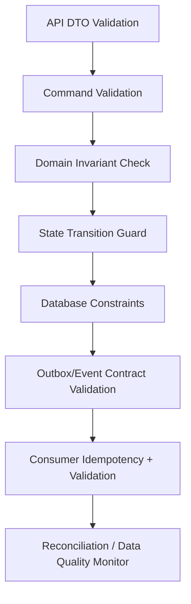

# Data Validation, Constraints, Invariants, and State Guard Model

## 1. Core Idea

Data correctness is not achieved by "checking input once".

Enterprise systems need multiple layers of correctness:

- API validation,
- command validation,
- domain invariant,
- state transition guard,
- database constraint,
- uniqueness constraint,
- foreign key or logical reference validation,
- async consumer validation,
- integration contract validation,
- reconciliation rule,
- data quality monitor.

Mental model:

> Validation rejects bad input. Constraints prevent impossible persistence. Invariants protect business truth. Guards control lifecycle movement. Reconciliation detects what escaped.

---

## 2. Why This Model Matters

Without explicit validation/invariant model:

- quote item created without required configuration,
- price total mismatches item totals,
- order completed while item still open,
- product disconnected without product instance reference,
- active recurring charge exists for terminated product,
- duplicate order created from same quote,
- billing account inactive but order submitted,
- approval bypassed by status patch,
- effective-dated records overlap,
- usage charged twice,
- downstream event creates invalid local projection.

Production correctness requires layered defense.

---

## 3. Validation vs Constraint vs Invariant vs Guard

| Concept | Meaning |
|---|---|
| Validation | Check data/input before accepting command. |
| Constraint | Persistence-level rule preventing invalid storage. |
| Invariant | Business rule that must always hold. |
| Guard | Rule that must pass before state transition/action. |
| Policy | Business-specific decision rule that may change. |
| Reconciliation | Detect mismatch after distributed/async processing. |

Example:

```text
Validation:
  quantity must be provided.

Constraint:
  quantity > 0.

Invariant:
  quote total = sum quote item totals.

Guard:
  quote cannot be accepted unless required approvals are approved.

Reconciliation:
  accepted quote should have one converted order.
```

---

## 4. Layered Correctness Model



No single layer is enough.

API validation helps user feedback.

Database constraint protects data even if application has bug.

Reconciliation catches distributed failures.

---

## 5. API Validation

API validation checks request shape and basic rules.

Examples:

- required field present,
- string length,
- valid UUID format,
- valid enum value,
- positive quantity,
- valid date format,
- currency code format,
- page size limit.

Example DTO validation:

```text
CreateQuoteRequest
- customerId required
- currency required
- items not empty
- item.quantity > 0
```

API validation should not contain all business logic.

It cannot verify complex lifecycle or cross-service rules alone.

---

## 6. Command Validation

Command validation checks whether a business command is well-formed.

Example:

```text
AcceptQuoteCommand
- quoteId required
- expectedVersion required
- acceptedBy required
- acceptanceEvidence required if policy requires
- idempotencyKey required for external channel
```

Command validation bridges API DTO and domain model.

It should be independent of transport where possible.

---

## 7. Domain Invariants

Domain invariants must always hold within aggregate boundary.

Examples:

### Quote

```text
Quote total must equal sum of active quote item totals.
Accepted quote must be immutable.
Quote cannot have duplicate active item sequence.
```

### Order

```text
Order item must belong to same order as parent item.
Order cannot be completed while mandatory items are non-terminal.
```

### Product inventory

```text
Active product instance must have valid customer and product offering reference.
Terminated product must have termination date.
```

### Billing

```text
Invoice total must equal line totals plus tax minus discount.
One-time charge must not bill twice for same trigger.
```

Invariants should be expressed in code and, where feasible, database constraints.

---

## 8. State Transition Guards

State transition guard controls lifecycle movement.

Example quote guard:

```text
DRAFT -> PRICED:
  all required configuration valid
  price calculation successful

PRICED -> SUBMITTED:
  no blocking pricing errors
  quote not expired

SUBMITTED -> APPROVED:
  required approval decisions approved

APPROVED -> ACCEPTED:
  approval not invalidated
  quote validUntil not expired
```

Guards should be centralized. Do not scatter lifecycle `if` checks across controllers, mappers, and consumers.

---

## 9. Database Constraints

Database constraints are last line of defense.

Common constraints:

- primary key,
- unique key,
- not null,
- check constraint,
- foreign key,
- exclusion constraint,
- partial unique index,
- generated column constraint.

Examples:

```sql
alter table quote_item
add constraint chk_quote_item_quantity_positive
check (quantity > 0);
```

```sql
create unique index uq_order_from_quote_version
on product_order (source_quote_id, source_quote_version)
where source_quote_id is not null;
```

Database constraints should protect non-negotiable invariants.

Do not depend only on application code for uniqueness/idempotency.

---

## 10. Logical References in Microservices

In microservices, foreign keys across databases may not be possible.

Example:

```text
order.billing_account_id references billing account owned by billing service
```

You cannot enforce DB FK if separate DBs.

Alternatives:

- validate via API at command time,
- store reference snapshot,
- subscribe to account events,
- maintain local projection,
- reconcile invalid references,
- reject if projection stale beyond policy.

Logical reference still needs ownership and validation.

---

## 11. Uniqueness and Idempotency Constraints

Uniqueness protects business idempotency.

Examples:

```text
One order per source quote version.
One active billing account number.
One current product characteristic per product/name.
One active recurring charge per subscription item/type/effective period.
One inbox message per event/subscriber.
```

Use partial unique indexes where needed.

Example:

```sql
create unique index uq_current_product_characteristic
on product_instance_characteristic (product_instance_id, characteristic_name)
where effective_to is null;
```

Be careful if business allows multiple current values.

---

## 12. Cross-Field Validation

Many rules involve multiple fields.

Examples:

```text
If action = MODIFY, targetProductInstanceId is required.
If billingStatus = ACTIVATED, billingActivatedAt is required.
If status = TERMINATED, terminationDate is required.
If autoRenew = true, renewalPolicy is required.
If approvalRequired = true, approvalRequestId is required.
```

Database check example:

```sql
alter table product_order_item
add constraint chk_modify_requires_product_instance
check (
  action not in ('MODIFY', 'DISCONNECT', 'SUSPEND', 'RESUME')
  or target_product_instance_id is not null
);
```

Application must still provide good error messages.

---

## 13. Temporal Constraints

Temporal constraints prevent historical ambiguity.

Examples:

- effective_to > effective_from,
- effective periods do not overlap,
- term_end_date >= term_start_date,
- billing_period_end > billing_period_start,
- quote valid_until after created_at,
- cancellation effective date not before activation unless policy allows.

Check constraints handle simple rules.

Overlap often needs application logic, exclusion constraints, or reconciliation.

---

## 14. Money Constraints

Financial data needs precision and consistency.

Examples:

- currency required,
- amount scale consistent,
- negative amount allowed only for credit/discount,
- invoice total equals line totals,
- discount cannot exceed allowed threshold without approval,
- margin cannot be below threshold without approval,
- tax amount cannot be negative unless adjustment.

Some are database constraints. Some are business guards.

Never use floating point for money.

---

## 15. Quantity and Unit Constraints

Quantity depends on product.

Examples:

- quantity must be integer for devices,
- quantity can be decimal for bandwidth/storage,
- quantity must equal one for non-quantity product,
- unit must match meter/product type,
- usage quantity cannot be negative unless correction event.

This often requires catalog-driven validation.

Fields:

```text
quantity
unit_of_measure
quantity_semantics
quantity_precision
```

---

## 16. Configuration Validation

Product configuration validation checks:

- required characteristics present,
- values allowed by characteristic spec,
- dependencies between characteristics,
- compatibility with offering,
- site/serviceability,
- bundle rules,
- quantity rules,
- current product state for modify,
- catalog version.

Example:

```text
Static IP add-on requires parent internet access product.
Bandwidth must be one of allowed values for offering and site.
```

Configuration validation should produce structured errors, not one generic invalid config message.

---

## 17. Pricing Validation

Pricing validation checks:

- price list exists,
- price effective date valid,
- currency supported,
- discount allowed,
- override reason present,
- approval required if threshold exceeded,
- total matches item price,
- tax assumption valid,
- price snapshot captured.

Pricing rules are business policies, not only math.

---

## 18. Billing Readiness Validation

Before billing trigger:

- billing account active,
- billing profile complete,
- billing address valid,
- tax profile valid,
- product/service activated,
- charge snapshot available,
- duplicate charge absent,
- effective date valid,
- no blocking credit hold unless override.

Billing readiness result should be stored if disputes are common.

---

## 19. Async Consumer Validation

Event consumers must validate incoming events.

Examples:

- schema version supported,
- required fields present,
- aggregate version monotonic,
- referenced local projection exists or can be resolved,
- event not already processed,
- event state transition allowed,
- payload not stale.

Do not blindly trust events, especially from external systems.

Use inbox and validation errors.

---

## 20. Integration Contract Validation

External payloads should be validated at boundary.

Examples:

- CRM order request,
- billing ack,
- OSS provisioning response,
- address validation response,
- usage feed,
- payment status file.

Store validation errors:

```text
integration_validation_error
- message_id
- source_system
- error_code
- field_path
- raw_value_reference
- detected_at
- status
```

Do not silently discard malformed external messages.

---

## 21. Data Quality Rule Model

Some validations run after the fact.

Data quality rule:

```text
data_quality_rule
- id
- rule_code
- entity_type
- severity
- description
- query_or_check_reference
- owner_group
- active
```

Data quality result:

```text
data_quality_result
- rule_id
- entity_type
- entity_id
- result
- severity
- detected_at
- resolved_at
- resolution_action
```

This makes data quality operationally visible.

---

## 22. Severity

Validation and data quality issues need severity.

| Severity | Meaning |
|---|---|
| ERROR | Must block command/process. |
| WARNING | Allow but notify/record. |
| INFO | Non-blocking observation. |
| CRITICAL | Production incident / financial/customer impact. |

Example:

```text
Missing optional billing contact = WARNING
Inactive billing account = ERROR
Duplicate charge = CRITICAL
```

Do not treat every issue equally.

---

## 23. Exception and Override Model

Business may allow override.

Examples:

- serviceability unknown but manager approves,
- credit hold overridden by finance,
- discount threshold approved,
- backdated billing correction approved,
- invalid address manually accepted.

Override must store:

```text
override_id
override_type
target_type
target_id
rule_code
approved_by
approval_reference
reason_code
expires_at
created_at
```

Override is not deletion of validation rule. It is controlled exception.

---

## 24. Rule Versioning

Validation rules change.

Examples:

- new product requires new characteristic,
- discount threshold changes,
- serviceability policy changes,
- billing readiness rule changes.

Store rule version in validation result when important:

```text
validation_rule_version
evaluated_at
evaluated_value
```

This helps answer:

> Why did this quote pass validation at that time?

---

## 25. PostgreSQL Physical Design

Validation result:

```sql
create table validation_result (
  id uuid primary key,
  target_type text not null,
  target_id uuid not null,
  validation_context text not null,
  status text not null,
  evaluated_at timestamptz not null,
  rule_version text,
  correlation_id text
);
```

Validation violation:

```sql
create table validation_violation (
  id uuid primary key,
  validation_result_id uuid not null references validation_result(id),
  rule_code text not null,
  severity text not null,
  field_path text,
  message text,
  actual_value text,
  expected_value text,
  blocking boolean not null default true
);
```

Data quality rule/result:

```sql
create table data_quality_rule (
  id uuid primary key,
  rule_code text not null unique,
  entity_type text not null,
  severity text not null,
  description text,
  owner_group text,
  active boolean not null default true
);
```

```sql
create table data_quality_result (
  id uuid primary key,
  rule_id uuid not null references data_quality_rule(id),
  entity_type text not null,
  entity_id uuid not null,
  result text not null,
  severity text not null,
  detected_at timestamptz not null,
  resolved_at timestamptz,
  resolution_action text
);
```

Indexes:

```sql
create index idx_validation_target
on validation_result (target_type, target_id, evaluated_at desc);

create index idx_violation_rule_severity
on validation_violation (rule_code, severity);

create index idx_dq_result_open
on data_quality_result (entity_type, severity, detected_at)
where resolved_at is null;
```

---

## 26. Java/JAX-RS Backend Implications

Validation should be layered.

Example:

```text
Resource DTO validation:
  bean validation / request parser

Application service:
  command validation
  permission/authority check
  state guard

Domain service:
  aggregate invariants

Repository:
  unique constraints / DB constraints

Async:
  consumer validation + inbox

Ops:
  reconciliation/data quality job
```

Pseudo-code:

```java
public Quote acceptQuote(AcceptQuoteCommand command) {
    commandValidator.validate(command);

    Quote quote = quoteRepository.load(command.quoteId());

    authorizationService.assertAllowed(command.actor(), ACCEPT_QUOTE, quote);
    quoteStateGuard.assertCanAccept(quote);
    approvalGuard.assertApprovalsValid(quote);
    invariantChecker.assertQuoteTotalsValid(quote);

    quote.accept(command.actor());

    quoteRepository.save(quote);
    outbox.append(QuoteAcceptedEvent.from(quote));
    audit.append(...);

    return quote;
}
```

---

## 27. Bean Validation Is Not Enough

Java Bean Validation can check:

```java
@NotNull
@Size
@Positive
```

It cannot fully enforce:

- quote lifecycle,
- customer/account eligibility,
- serviceability,
- approval authority,
- cross-item bundle rules,
- database uniqueness,
- distributed idempotency,
- billing readiness,
- event consumer idempotency.

Use Bean Validation for boundary shape, not full domain correctness.

---

## 28. Error Model

Validation errors should map to stable error codes.

Example:

```json
{
  "errorCode": "VALIDATION_FAILED",
  "violations": [
    {
      "ruleCode": "BILLING_ACCOUNT_ACTIVE_REQUIRED",
      "field": "billingAccountId",
      "severity": "ERROR",
      "message": "Billing account must be active"
    }
  ],
  "correlationId": "corr-123"
}
```

For internal logs/audit, store rule code and target.

Do not rely only on free-text messages.

---

## 29. Observability

Monitor:

- validation failure rate,
- top rule violations,
- data quality open issues,
- critical data quality breaches,
- override usage,
- DB constraint violations,
- event validation failures,
- integration validation failures,
- reconciliation mismatch trend.

Example queries:

```sql
-- Top validation violations
select rule_code, severity, count(*)
from validation_violation
group by rule_code, severity
order by count(*) desc;

-- Open critical data quality issues
select dqr.rule_code, r.entity_type, r.entity_id, r.detected_at
from data_quality_result r
join data_quality_rule dqr on dqr.id = r.rule_id
where r.resolved_at is null
  and r.severity = 'CRITICAL';

-- Overrides expiring soon
select id, override_type, target_type, target_id, expires_at
from validation_override
where expires_at between now() and now() + interval '7 days';
```

---

## 30. Failure Modes

| Failure mode | Symptom | Likely cause | Prevention |
|---|---|---|---|
| Invalid order state | Order completed with open items | Missing state guard | Header/item invariant |
| Duplicate order | Same quote converted twice | No uniqueness/idempotency | Unique source quote/version |
| Bad product config | Fulfillment fails | Weak configuration validation | Catalog-driven validation |
| Wrong billing account | Billing rejected | No billing readiness validation | Billing account guard |
| Duplicate charge | Customer billed twice | Retry without DB uniqueness | Idempotency constraint |
| Temporal overlap | Double billing | No effective period validation | Non-overlap rule |
| Approval bypass | Discount accepted unapproved | Generic status update | Approval guard |
| Event corrupts projection | Consumer accepts invalid event | No consumer validation | Schema/version/state check |
| Data quality invisible | Bad records accumulate | No DQ result model | DQ rules and dashboard |
| Override abuse | Rule bypass becomes normal | No expiry/audit | Controlled override model |

---

## 31. PR Review Checklist

When reviewing data-changing code, ask:

- What validation layer handles this?
- What invariant must always hold?
- Is there a database constraint for non-negotiable rule?
- Is uniqueness/idempotency enforced by DB?
- Is lifecycle transition guarded?
- Are cross-field rules checked?
- Are temporal overlaps prevented?
- Are money/currency rules enforced?
- Is configuration/catalog validation involved?
- Is billing readiness validated?
- Are async consumers validating events?
- Are validation errors structured?
- Are overrides allowed and audited?
- Are data quality/reconciliation checks needed?
- Are tests covering invalid state and concurrency?

---

## 32. Internal Verification Checklist

Verify these in the internal CSG/team context:

- Standard validation framework and error response model.
- Where domain invariants are implemented.
- Whether lifecycle guards are centralized.
- Whether database constraints exist for uniqueness/idempotency.
- Whether quote total/item total consistency is checked.
- Whether order header/item state consistency is checked.
- Whether billing readiness validation exists.
- Whether serviceability/configuration validation exists.
- Whether approval guard is enforced server-side.
- Whether event consumer validation exists.
- Whether integration validation errors are persisted.
- Whether data quality rules/results are monitored.
- Whether override/exception model exists.
- Whether incidents mention invalid state, duplicate charge/order, missing validation, or bad data escaping into billing/fulfillment.

---

## 33. Summary

Validation is only one layer of correctness.

A strong enterprise model must define:

- API validation,
- command validation,
- domain invariants,
- state guards,
- database constraints,
- uniqueness/idempotency constraints,
- temporal constraints,
- money/quantity/configuration validation,
- async consumer validation,
- integration validation,
- data quality rules,
- override model,
- reconciliation checks.

The key principle:

> Trust no single layer. Production correctness comes from layered validation, enforced invariants, database constraints, idempotency, and continuous reconciliation.
