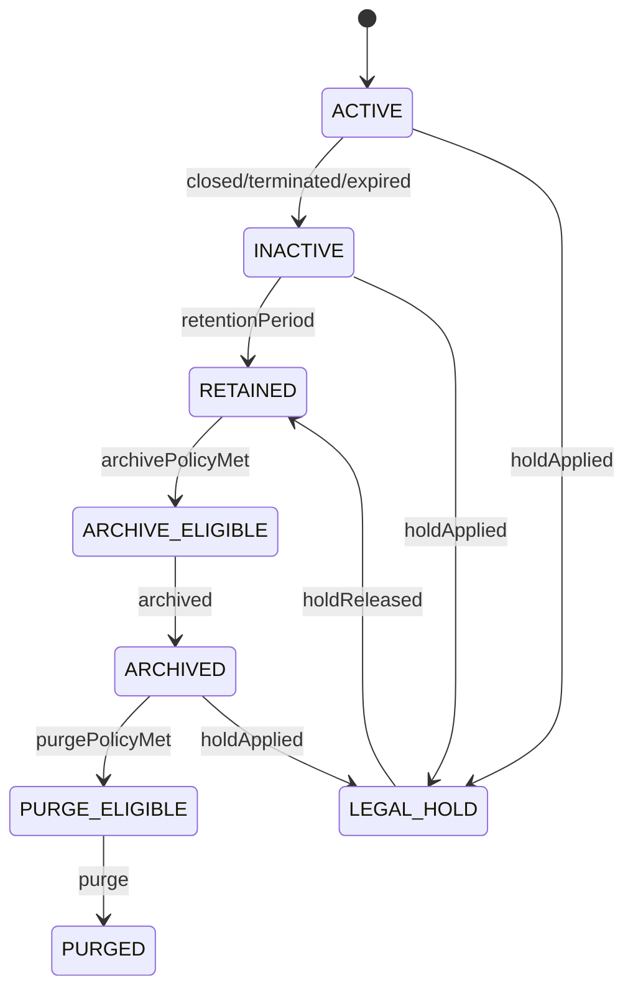

# Data Retention, Archival, Purge, and Legal Hold Model

## 1. Core Idea

Data lifecycle tidak selesai saat entity tidak aktif.

Enterprise systems harus tahu:

- kapan data masih operationally active,
- kapan data menjadi historical,
- kapan data harus diarsipkan,
- kapan data boleh/dilarang dihapus,
- kapan data harus dianonymize,
- kapan legal hold menghentikan purge,
- bagaimana menjaga audit/financial/legal evidence tanpa menyimpan data sensitif berlebihan.

Dalam CPQ / Quote / Order / Billing / Telco BSS/OSS, retention sangat kompleks karena data saling terkait:

```text
quote -> order -> product inventory -> subscription -> charge -> invoice -> payment -> audit
```

Mental model:

> Data retention is business lifecycle plus legal/compliance lifecycle plus technical storage lifecycle.

---

## 2. Why Retention Modelling Matters

Tanpa retention model:

- data sensitif disimpan selamanya tanpa alasan,
- invoice evidence terhapus terlalu cepat,
- audit hilang sebelum dispute selesai,
- customer deletion request tidak bisa diproses,
- soft-deleted data tetap muncul di search/reporting,
- archive memutus referential trace,
- legal hold terlanggar oleh purge job,
- analytics menyimpan PII setelah source dipurge,
- product history hilang sehingga billing dispute tidak bisa dijawab,
- storage bengkak karena event/audit/raw payload retention tidak dikontrol.

Retention harus balance antara historical correctness, compliance, privacy, cost, and operational usefulness.

---

## 3. Retention vs Archival vs Purge

| Concept | Meaning |
|---|---|
| Retention | Berapa lama data disimpan. |
| Archival | Memindahkan data dari hot operational store ke cold/cheaper/history store. |
| Purge | Menghapus data secara permanen atau membuatnya tidak tersedia. |
| Anonymization | Menghapus/mengubah identitas personal tapi menjaga analytical value. |
| Pseudonymization | Mengganti identitas dengan token yang masih bisa dipetakan secara terbatas. |
| Legal hold | Menahan data dari purge karena legal/compliance/dispute need. |
| Soft delete | Mark data deleted, masih ada di DB. |
| Hard delete | Physically delete data. |

Jangan menyamakan archive dengan delete.

---

## 4. Data Lifecycle States

Conceptual lifecycle:



Data lifecycle state is separate from business status.

Example:

```text
order.status = COMPLETED
data_lifecycle_status = RETAINED
```

---

## 5. Retention Policy Model

Retention policy should be explicit.

Fields:

```text
retention_policy
- id
- policy_code
- entity_type
- data_category
- retention_period
- retention_basis
- archive_after
- purge_after
- anonymization_required
- legal_hold_allowed
- owner_group
- active
```

Examples:

| Entity | Possible basis |
|---|---|
| Invoice | financial/legal retention. |
| Quote | sales/commercial retention. |
| Order | fulfillment/legal/support retention. |
| Audit | compliance/security retention. |
| Usage raw event | billing dispute window. |
| Payment token reference | payment/security policy. |
| Contact PII | relationship/consent/privacy policy. |

Actual durations must be verified internally/legal/compliance. Do not invent legal retention periods.

---

## 6. Retention Basis

Retention basis explains why data is kept.

Examples:

- contract obligation,
- financial record,
- tax requirement,
- customer support,
- legal dispute,
- operational troubleshooting,
- billing dispute window,
- security audit,
- analytics/statistical use,
- regulatory reporting,
- active service relationship.

A field/entity may have multiple retention bases.

Example:

```text
invoice_line:
  financial record + tax + dispute evidence
```

Retention should use the strongest applicable requirement.

---

## 7. Entity Retention Classification

Common categories:

| Category | Examples |
|---|---|
| Commercial | quote, price snapshot, approval. |
| Operational | order, fulfillment task, fallout. |
| Inventory | product/service/resource instance. |
| Financial | charge, invoice, payment status. |
| Identity/contact | user, contact, address. |
| Security/audit | access audit, command audit. |
| Integration | outbox/inbox, external message. |
| Usage/raw payload | usage events, external payload references. |
| Analytics | fact tables, snapshots, aggregates. |

Each category may have different retention/archival strategy.

---

## 8. Soft Delete

Soft delete marks row deleted.

Fields:

```text
deleted_at
deleted_by
delete_reason
data_lifecycle_status
```

Use cases:

- hide draft objects,
- remove user-created non-financial draft,
- deactivate records while preserving reference.

Risks:

- soft-deleted data still visible in queries,
- unique constraints complicated,
- reporting accidentally includes deleted data,
- PII remains stored,
- does not satisfy true deletion requirement.

Soft delete is not privacy deletion unless data is anonymized/purged as required.

---

## 9. Hard Delete

Hard delete removes data physically.

Use carefully because:

- foreign key references break,
- audit trace may be lost,
- financial/legal evidence may be destroyed,
- downstream projections may still hold copies,
- event logs may retain payload.

Hard delete usually applies to:

- transient technical data,
- expired idempotency records,
- temporary files,
- failed drafts without legal value,
- anonymized/purged personal data where allowed.

Before hard delete, check legal hold and retention policy.

---

## 10. Anonymization

Anonymization removes identity while preserving useful record.

Example:

```text
customer_contact.name = null
customer_contact.email = anonymized-{hash}@redacted.local
phone = null
address_line = null
```

For analytics:

```text
customer_id replaced by irreversible surrogate
region retained
product category retained
amount retained
```

Anonymization must be irreversible if claimed as anonymized.

If reversible, it is pseudonymization, not anonymization.

---

## 11. Pseudonymization

Pseudonymization replaces identity with token but mapping exists.

Use cases:

- analytics requiring repeat-customer grouping,
- test data,
- controlled research,
- support-limited view.

Model:

```text
pseudonym_mapping
- original_entity_type
- original_entity_id
- pseudonym_token
- mapping_scope
- access_policy
- created_at
```

Mapping must be protected like sensitive data.

---

## 12. Legal Hold

Legal hold prevents deletion/purge/archive change for specific data.

Fields:

```text
legal_hold
- id
- hold_number
- hold_type
- target_type
- target_id
- scope
- reason_code
- requested_by
- approved_by
- status
- effective_from
- effective_to
- released_at
```

Legal hold can apply to:

- customer,
- account,
- quote,
- order,
- invoice,
- audit records,
- product/service data,
- communication records,
- exports.

Purge job must check legal hold.

---

## 13. Retention Eligibility

Data is eligible for archive/purge when:

- business status terminal,
- retention period passed,
- no open dispute,
- no legal hold,
- no active product/subscription dependency,
- no open invoice/payment/billing issue,
- no open data quality/repair case,
- no active child entity needing reference,
- anonymization/preservation requirements satisfied.

Eligibility should be computed, not guessed.

Model:

```text
retention_eligibility_result
- target_type
- target_id
- eligible_for_archive
- eligible_for_purge
- blocking_reason_codes
- evaluated_at
```

---

## 14. Archive Model

Archive is controlled movement to historical/cold store.

Archive record:

```text
archive_record
- id
- entity_type
- entity_id
- archive_batch_id
- archive_location
- archive_status
- archived_at
- checksum
- retention_policy_id
```

Archive should preserve:

- entity identity,
- business number,
- source system,
- snapshot/checksum,
- retrieval mechanism,
- access controls,
- lineage.

Archive does not mean data is public or less protected.

---

## 15. Archive Query Strategy

Operational system may need to retrieve archived data for:

- dispute,
- audit,
- support,
- compliance,
- reporting,
- incident review.

Options:

- restore from archive,
- query archive store,
- keep summary/index in hot store,
- timeline references archived details,
- export archive package.

Design retrieval intentionally.

Do not archive so aggressively that support cannot answer legitimate historical questions.

---

## 16. Purge Model

Purge should be auditable.

Fields:

```text
purge_record
- id
- purge_batch_id
- entity_type
- entity_id
- purge_type
- retention_policy_id
- legal_hold_checked
- status
- purged_at
- purged_by
- evidence_hash
```

Purge result may keep minimal tombstone:

```text
entity_type
entity_id
business_number_hash
purged_at
policy_code
```

Tombstone helps avoid reimport or explain absence without retaining sensitive content.

---

## 17. Cascading Retention

Entities are linked.

Example:

```text
Customer
  -> Quote
  -> Order
  -> Product instance
  -> Charge
  -> Invoice
  -> Payment
  -> Audit
```

You cannot purge parent blindly if child must be retained.

Strategies:

- cascade purge,
- anonymize parent but retain financial child,
- keep minimal reference snapshot,
- detach/de-identify,
- preserve legal entity but remove personal contact,
- retain invoice but mask contact data.

Cascading retention should be modelled.

---

## 18. Snapshot Preservation

Historical artifacts often need snapshots.

Examples:

- invoice billing address snapshot,
- accepted quote snapshot,
- approval evidence snapshot,
- price snapshot,
- order item snapshot,
- serviceability result snapshot.

If source PII is anonymized, historical snapshot may still contain PII.

Need policy:

- retain snapshot as legal evidence,
- mask/anonymize snapshot,
- split sensitive fields,
- store secure encrypted archive,
- purge after legal retention.

Do not forget snapshots during deletion/anonymization.

---

## 19. Event and Audit Retention

Events/audit can contain sensitive data.

Outbox/inbox:

- pending/failed need operational retention,
- published processed events may be purged after safe period,
- event payload may need archive or compacted metadata,
- idempotency records can expire after safe window.

Audit:

- security/financial audit may require longer retention,
- payload should be minimized,
- sensitive before/after values may require masking/encryption,
- access to audit should be controlled.

Define retention per audit/event category.

---

## 20. Raw Payload Retention

External raw payloads are risky.

Examples:

- usage feed raw file,
- CRM request payload,
- billing response payload,
- OSS provisioning payload,
- address validation response,
- payment gateway response.

Raw payload may contain PII/secrets.

Policy options:

- do not store raw payload,
- store redacted payload,
- store secure reference,
- store hash only,
- short retention,
- archive encrypted with restricted access.

Raw payload should not be kept forever by default.

---

## 21. Search Index and Cache Purge

Deleting data from primary DB is not enough.

Copies may exist in:

- Redis cache,
- search index,
- reporting read model,
- analytics warehouse,
- DLQ tools,
- logs,
- export files,
- object storage,
- backups,
- data lake,
- monitoring traces.

Retention/purge must track major derived stores.

Model:

```text
data_copy_registry
- source_entity_type
- target_store
- copy_type
- purge_method
- owner_group
```

This is especially important for privacy deletion/anonymization.

---

## 22. Backup Retention

Backups retain old data.

Privacy/legal deletion usually has special handling for backups depending policy.

Model governance should define:

- backup retention period,
- restore procedure,
- deletion re-application after restore,
- legal hold interaction,
- encrypted backups,
- access control.

Do not claim data is fully deleted if backups still contain it unless policy accounts for backup lifecycle.

---

## 23. PostgreSQL Physical Design

Retention policy:

```sql
create table retention_policy (
  id uuid primary key,
  policy_code text not null unique,
  entity_type text not null,
  data_category text not null,
  retention_period interval,
  archive_after interval,
  purge_after interval,
  anonymization_required boolean not null default false,
  legal_hold_allowed boolean not null default true,
  owner_group text,
  active boolean not null default true,
  created_at timestamptz not null,
  updated_at timestamptz not null
);
```

Legal hold:

```sql
create table legal_hold (
  id uuid primary key,
  hold_number text not null unique,
  hold_type text not null,
  target_type text not null,
  target_id uuid,
  scope jsonb,
  reason_code text not null,
  requested_by text,
  approved_by text,
  status text not null,
  effective_from timestamptz not null,
  effective_to timestamptz,
  released_at timestamptz,
  created_at timestamptz not null
);
```

Archive record:

```sql
create table archive_record (
  id uuid primary key,
  entity_type text not null,
  entity_id uuid not null,
  archive_batch_id uuid,
  archive_location text,
  archive_status text not null,
  checksum text,
  retention_policy_id uuid references retention_policy(id),
  archived_at timestamptz,
  created_at timestamptz not null
);
```

Purge record:

```sql
create table purge_record (
  id uuid primary key,
  purge_batch_id uuid,
  entity_type text not null,
  entity_id uuid,
  purge_type text not null,
  retention_policy_id uuid references retention_policy(id),
  legal_hold_checked boolean not null default false,
  status text not null,
  evidence_hash text,
  purged_by text,
  purged_at timestamptz,
  created_at timestamptz not null
);
```

Indexes:

```sql
create index idx_legal_hold_target_status
on legal_hold (target_type, target_id, status);

create index idx_archive_entity
on archive_record (entity_type, entity_id);

create index idx_purge_entity
on purge_record (entity_type, entity_id);

create index idx_retention_policy_entity
on retention_policy (entity_type, data_category, active);
```

---

## 24. Java/JAX-RS Backend Implications

Possible APIs:

```http
GET /retention-policies
POST /retention-evaluations
POST /archive-runs
POST /purge-runs
POST /legal-holds
POST /legal-holds/{id}/release
GET /entities/{type}/{id}/retention-status
```

Service responsibilities:

- evaluate retention policy,
- check legal hold,
- check open dependencies,
- archive safely,
- purge/anonymize safely,
- write audit,
- publish purge/anonymization events,
- update search/read models,
- verify completion.

Purge/anonymization should not be random SQL script. It needs controlled service/process.

---

## 25. Purge/Anonymization Workflow

Workflow:

```text
Request
  -> validate authority
  -> identify data scope
  -> evaluate retention and legal hold
  -> identify derived copies
  -> approve if required
  -> anonymize/purge source
  -> purge/update projections/search/cache
  -> write audit/purge record
  -> verify
  -> close request
```

For privacy requests, track status and SLA if required internally.

---

## 26. Event Model

Events:

- `RetentionPolicyCreated`
- `ArchiveEligibilityEvaluated`
- `EntityArchived`
- `PurgeRequested`
- `EntityPurged`
- `EntityAnonymized`
- `LegalHoldApplied`
- `LegalHoldReleased`
- `DerivedCopyPurgeRequested`
- `RetentionPurgeFailed`

Payload should avoid exposing purged sensitive data.

Example:

```json
{
  "eventId": "uuid",
  "eventType": "EntityAnonymized",
  "eventVersion": 1,
  "occurredAt": "2026-07-12T10:00:00Z",
  "entityType": "CONTACT",
  "entityId": "contact-id",
  "policyCode": "CONTACT_PRIVACY_RETENTION",
  "correlationId": "corr-123"
}
```

---

## 27. Reporting and Analytics Impact

Analytics may need:

- historical facts without PII,
- anonymized customer/contact,
- aggregated metrics,
- deleted/anonymized dimension handling,
- legal hold exclusion,
- purge status.

Design dimension rows for deletion/anonymization:

```text
customer_name = "Anonymized Customer"
contact_email = null
anonymized_flag = true
```

But financial/historical facts may remain if allowed/required.

Metric definitions should handle purged/anonymized dimensions.

---

## 28. Data Quality Checks

Examples:

```sql
-- Legal hold active but purge record completed
select p.id, p.entity_type, p.entity_id
from purge_record p
join legal_hold lh
  on lh.target_type = p.entity_type
 and lh.target_id = p.entity_id
where p.status = 'COMPLETED'
  and lh.status = 'ACTIVE';

-- Archived record without checksum
select id, entity_type, entity_id
from archive_record
where archive_status = 'ARCHIVED'
  and checksum is null;

-- Retention policy missing for sensitive entity
select distinct entity_type
from data_classification_rule dcr
where dcr.sensitivity_level in ('RESTRICTED', 'PII')
  and not exists (
    select 1 from retention_policy rp
    where rp.entity_type = dcr.entity_type
      and rp.active = true
  );
```

---

## 29. Failure Modes

| Failure mode | Symptom | Likely cause | Prevention |
|---|---|---|---|
| Legal evidence deleted | Cannot answer dispute | Purge ignored legal/financial retention | Retention policy + legal hold check |
| PII kept forever | Privacy/compliance risk | No retention policy | Classification + retention |
| Soft delete leaks | Deleted data appears in search | Search/read model not updated | Derived copy purge |
| Archive unusable | Cannot retrieve old order | No archive index/checksum | Archive record and retrieval plan |
| Legal hold violated | Compliance incident | Purge job no hold check | Legal hold guard |
| Analytics keeps deleted PII | Privacy breach | No lineage/copy registry | Anonymize derived data |
| Raw payload leak | PII/secrets retained | Raw integration payload stored indefinitely | Payload retention policy |
| Cascade break | FK/reference missing | Hard delete parent too early | Dependency evaluation |
| Purge unaudited | Cannot prove deletion | No purge record | Purge audit |
| Backup restore resurrects data | Deleted data returns | No reapply deletion process | Backup deletion handling |

---

## 30. PR Review Checklist

When reviewing data lifecycle changes, ask:

- What data category is this?
- Is retention policy defined?
- Is data classified as PII/restricted?
- Is this data financial/legal/audit evidence?
- Can it be archived?
- Can it be purged?
- Can it be anonymized instead?
- Does legal hold apply?
- Are derived copies known?
- Does search/cache/read model need purge update?
- Are snapshots included?
- Are audit/events included?
- Is raw payload retention controlled?
- Is purge/anonymization audited?
- Is restore-from-backup considered?
- Are internal legal/compliance requirements verified?

---

## 31. Internal Verification Checklist

Verify these in the internal CSG/team context:

- Official retention policies by entity/data category.
- Whether legal hold process exists.
- Whether archive/purge jobs exist.
- Whether customer/contact deletion/anonymization is supported.
- Whether invoice/order/audit retention differs from quote/draft retention.
- Whether raw integration payload retention is controlled.
- Whether outbox/inbox retention policy exists.
- Whether search/read model/analytics copies are tracked.
- Whether backup retention and restore deletion handling are defined.
- Whether purge/anonymization events are published.
- Whether purge is audited.
- Whether sensitive snapshots are included in retention decisions.
- Whether incidents mention deleted data still visible, missing historical evidence, or legal hold/purge conflict.

---

## 32. Summary

Retention and purge are part of enterprise data modelling.

A strong model must define:

- retention policy,
- retention basis,
- data category,
- lifecycle state,
- archive eligibility,
- purge eligibility,
- legal hold,
- soft vs hard delete,
- anonymization,
- pseudonymization,
- cascade/dependency evaluation,
- snapshot preservation,
- event/audit/raw payload retention,
- derived copy purge,
- archive retrieval,
- purge audit,
- compliance verification.

The key principle:

> Do not keep everything forever, and do not delete blindly. Retention design must preserve required evidence while minimizing sensitive data across source systems, events, caches, search, analytics, archives, and backups.
