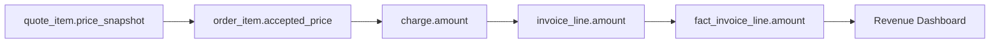

# Data Lineage, Provenance, and Impact Analysis Model

## 1. Core Idea

Data lineage menjawab:

> Data ini berasal dari mana, berubah melalui proses apa, dipakai di mana, dan apa yang terdampak jika field/schema/rule ini berubah?

Dalam CPQ / Quote / Order / Billing / Catalog / Telco BSS/OSS, satu field bisa mengalir melewati banyak lapisan:

```text
CRM customer/account
  -> CPQ quote
  -> accepted quote snapshot
  -> product order
  -> fulfillment task
  -> product inventory
  -> billing charge
  -> invoice line
  -> data warehouse fact
  -> KPI dashboard
```

Provenance menjawab:

> Nilai ini berasal dari source/system/rule versi apa dan kapan dihitung?

Impact analysis menjawab:

> Jika kita mengubah field ini, event ini, table ini, atau rule ini, consumer/projection/report mana yang ikut terdampak?

Mental model:

> Lineage is the dependency map of enterprise truth. Without lineage, every change is a guessing game.

---

## 2. Why Lineage Matters

Tanpa lineage:

- tidak tahu kenapa invoice amount berbeda dari quote amount,
- tidak tahu dashboard MRR mengambil source dari charge atau invoice,
- perubahan event payload mematahkan consumer tanpa diketahui,
- field di table dihapus padahal dipakai report finance,
- mapping customer dari CRM ke billing tidak bisa dilacak,
- support tidak bisa menjawab asal billing account pada order,
- incident review tidak tahu transform mana yang salah,
- backfill memperbaiki source tetapi projection tetap salah,
- data privacy purge tidak menjangkau derived copies,
- schema migration mengubah semantic field tanpa impact analysis.

Lineage membantu engineering, analytics, compliance, support, and operations.

---

## 3. Types of Lineage

| Lineage type | Meaning |
|---|---|
| Technical lineage | Table/column/job/event dependency. |
| Business lineage | Business meaning and source-of-truth mapping. |
| Operational lineage | Command/event/process chain that produced data. |
| Analytical lineage | Metric/report source and transformation. |
| Security lineage | Where sensitive data is copied/derived. |
| Temporal lineage | Which version/time produced the value. |
| Integration lineage | External system mapping and message flow. |

A mature enterprise system often needs all of them.

---

## 4. Provenance vs Lineage

| Concept | Question |
|---|---|
| Provenance | Where did this value come from? |
| Lineage | Through what path did data flow? |
| Impact analysis | What depends on this data? |
| Traceability | Can we follow one business object end-to-end? |

Example:

```text
invoice_line.amount = 120.00
```

Provenance:

```text
source charge_id = CH-1
rating_rule_version = RATING-V12
currency = USD
calculated_at = 2026-07-12T10:00Z
```

Lineage:

```text
usage_event -> rated_usage -> charge -> invoice_line -> revenue_fact
```

Impact:

```text
rating rule changes affect rated_usage, charge, invoice_line, revenue report.
```

---

## 5. Source-to-Target Mapping

Lineage starts with source-to-target mapping.

Example:

```text
target: product_order.billing_account_id
source: accepted_quote.billing_account_id_snapshot
transformation: direct copy during quote-to-order conversion
fallback: customer default billing account if quote field missing
owner: order service
```

Model:

```text
data_lineage_mapping
- id
- source_system
- source_entity
- source_field
- target_system
- target_entity
- target_field
- transformation_type
- transformation_rule
- owner_group
- active
```

This is especially useful for migrations and analytics.

---

## 6. Field-Level Lineage

Field-level lineage is important for critical fields:

- price amount,
- discount,
- margin,
- billing account,
- customer/account ID,
- product offering version,
- order item action,
- product activation date,
- charge effective date,
- invoice line amount,
- service/resource ID,
- tax category,
- approval status.

Example:

```text
order_item.price_amount
  <- quote_item.accepted_price_snapshot.amount
```

This tells engineer not to recompute order price from current catalog.

---

## 7. Entity-Level Lineage

Entity-level lineage tracks object creation.

Examples:

```text
product_order created_from quote
product_order_item created_from quote_item
product_instance created_from order_item
charge created_from product_instance/order_item
invoice_line created_from charge
```

Fields:

```text
source_entity_type
source_entity_id
source_entity_version
target_entity_type
target_entity_id
relationship_type
created_at
```

This overlaps with external/reference mapping but focuses on internal lineage.

---

## 8. Transformation Metadata

Transformation should be explainable.

Fields:

```text
transformation_name
transformation_version
transformation_type
rule_version
code_version
job_run_id
executed_at
executed_by
input_hash
output_hash
```

Examples:

- quote pricing calculation,
- order decomposition,
- billing charge generation,
- usage rating,
- tax calculation,
- invoice generation,
- analytics ETL,
- read model projection.

If transformation changes, historical values should still be explainable.

---

## 9. Transformation Types

Common transformation types:

| Type | Example |
|---|---|
| Direct copy | quote.account_id -> order.account_id |
| Lookup | product_offering_id -> product_family |
| Calculation | invoice total = line sum + tax |
| Aggregation | customer MRR = sum active recurring charge |
| Filter | only completed orders included in KPI |
| Derivation | billing readiness status from multiple checks |
| Mapping | external status -> internal status |
| Normalization | raw usage -> normalized usage |
| Enrichment | order enriched with customer segment |
| Snapshot | billing address copied to invoice |

Each type has different audit and validation needs.

---

## 10. Event Lineage

Event-driven systems need event lineage.

Example:

```text
QuoteAccepted event
  -> QuoteConversionRequested event
  -> ProductOrderCreated event
  -> OrderDecomposed event
  -> ProductActivated event
  -> ChargeActivated event
```

Event lineage fields:

```text
event_id
event_type
aggregate_type
aggregate_id
correlation_id
causation_id
parent_event_id
producer
consumer
processed_at
```

Causation chain helps reconstruct distributed flow.

---

## 11. Projection Lineage

Read models/projections must record source.

Projection fields:

```text
projection_name
source_event_id
source_aggregate_id
source_aggregate_version
transformation_version
projected_at
```

If a support summary is wrong, you need to know:

- which event produced it,
- whether later event was missed,
- what projection version ran,
- whether rebuild is needed.

Projection lineage prevents projection from becoming mysterious derived truth.

---

## 12. Analytics Lineage

Analytics lineage answers:

> Which source tables/events and transformation produced this KPI?

For a metric:

```text
metric = quote_conversion_rate
source = fact_quote_funnel
fields = accepted_at, order_created_at
transformation = count converted / count accepted
time basis = quote accepted date
version = metric definition v3
```

Fields:

```text
metric_code
source_model
source_fields
transformation_version
metric_definition_version
refresh_run_id
```

Dashboard without metric lineage is hard to trust.

---

## 13. Sensitive Data Lineage

Security/privacy requires knowing where sensitive data flows.

Example:

```text
billing_contact_email
  -> quote related party
  -> order installation contact
  -> fulfillment task
  -> support timeline
  -> search index
  -> analytics export
```

Sensitive data lineage supports:

- field masking,
- purge/anonymization,
- access control,
- export governance,
- data classification impact analysis.

Model should identify derived copies.

---

## 14. Dependency Graph

Lineage can be represented as graph.

Nodes:

- system,
- service,
- table,
- column,
- event,
- API field,
- job,
- dashboard,
- metric,
- file/feed,
- external system.

Edges:

- reads,
- writes,
- publishes,
- consumes,
- transforms,
- derives,
- maps,
- snapshots,
- exports.

Example:



Graph enables impact analysis.

---

## 15. Impact Analysis

Impact analysis questions:

- If we rename this field, who breaks?
- If we change status meaning, which reports change?
- If we retire reason code, which workflows validate it?
- If we mask contact email, which exports/read models need update?
- If we change event schema, which consumers are affected?
- If we change order lifecycle, which dashboards/KPIs are affected?
- If we move ownership of billing account, which services reference it?

Impact analysis is not optional for production schema/API/event changes.

---

## 16. Impact Severity

Not all dependencies are equal.

| Dependency | Severity |
|---|---|
| Finance report uses field | High |
| External API client uses field | High |
| Internal optional dashboard uses field | Medium |
| Debug-only log uses field | Low |
| Deprecated consumer uses field | Depends |
| Security masking uses field | High |
| Migration/backfill uses field | High during migration |

Lineage metadata should store dependency criticality.

---

## 17. Runtime Lineage vs Catalog Lineage

Two kinds:

### Catalog/design lineage

Documented expected dependency.

```text
fact_order.source_quote_id comes from product_order.source_quote_id
```

### Runtime lineage

Actual observed run dependency.

```text
ETL run 2026-07-12 read 1,200,000 order rows and produced fact_order version 18
```

Both are useful.

Design lineage tells what should happen. Runtime lineage tells what happened.

---

## 18. Job Run Lineage

Batch/ETL/backfill/reconciliation jobs need lineage.

Fields:

```text
job_run
- id
- job_name
- job_version
- status
- input_source
- input_watermark
- output_target
- output_count
- started_at
- completed_at
```

For each run:

```text
job_run_input
job_run_output
job_run_error
```

This helps answer:

- did this run process the missing data?
- which version transformed the data?
- can we rerun safely?
- what records failed?

---

## 19. Source Watermark

Watermark indicates source coverage.

Examples:

```text
last_event_offset
last_event_time
last_updated_at_processed
last_id_processed
snapshot_date
```

Projection/analytics lineage should include watermark.

If dashboard says data fresh to `2026-07-12 10:00`, user knows events after that may not appear.

---

## 20. Lineage for Migrations and Backfills

Migration/backfill should record:

- source fields,
- target fields,
- transformation logic,
- batch/run,
- exception rows,
- validation result,
- source/target checksum,
- cutover decision.

Example:

```text
order.billing_account_id backfilled from accepted_quote.billing_account_id_snapshot
```

If later billing issue appears, migration lineage helps identify whether bad source, bad transform, or exception handling caused it.

---

## 21. Data Contract Lineage

Data contracts should link producer and consumers.

Example:

```text
QuoteAccepted.v2
  producer = quote-service
  consumers = order-service, analytics-ingest, notification-service
  criticality = high for order-service
```

If event changes, impact analysis uses consumer registry.

---

## 22. PostgreSQL Physical Design

Lineage mapping:

```sql
create table data_lineage_mapping (
  id uuid primary key,
  source_system text not null,
  source_entity text not null,
  source_field text,
  target_system text not null,
  target_entity text not null,
  target_field text,
  transformation_type text not null,
  transformation_rule text,
  transformation_version text,
  dependency_criticality text,
  owner_group text,
  active boolean not null default true,
  created_at timestamptz not null,
  updated_at timestamptz not null
);
```

Entity lineage:

```sql
create table entity_lineage (
  id uuid primary key,
  source_entity_type text not null,
  source_entity_id uuid not null,
  source_entity_version integer,
  target_entity_type text not null,
  target_entity_id uuid not null,
  relationship_type text not null,
  transformation_name text,
  transformation_version text,
  correlation_id text,
  created_at timestamptz not null
);
```

Job run lineage:

```sql
create table lineage_job_run (
  id uuid primary key,
  job_name text not null,
  job_version text,
  status text not null,
  input_source text,
  input_watermark text,
  output_target text,
  input_count bigint,
  output_count bigint,
  error_count bigint,
  started_at timestamptz not null,
  completed_at timestamptz,
  correlation_id text
);
```

Indexes:

```sql
create index idx_lineage_source
on data_lineage_mapping (source_system, source_entity, source_field);

create index idx_lineage_target
on data_lineage_mapping (target_system, target_entity, target_field);

create index idx_entity_lineage_source
on entity_lineage (source_entity_type, source_entity_id);

create index idx_entity_lineage_target
on entity_lineage (target_entity_type, target_entity_id);

create index idx_lineage_job_name_time
on lineage_job_run (job_name, started_at desc);
```

---

## 23. Java/JAX-RS Backend Implications

Possible internal APIs:

```http
GET /lineage/entities/{type}/{id}/upstream
GET /lineage/entities/{type}/{id}/downstream
GET /lineage/fields?system=order-service&entity=product_order&field=billing_account_id
GET /lineage/impact?system=quote-service&event=QuoteAccepted&version=2
GET /lineage/jobs/{jobRunId}
```

Service behavior:

- write entity lineage during conversion/derivation,
- write transformation metadata during batch/read-model rebuild,
- attach correlation ID,
- expose lineage for support/incident review,
- protect sensitive lineage metadata if it reveals customer/system details.

---

## 24. Lineage and Documentation

Lineage metadata should connect to human docs:

- model documentation,
- data dictionary,
- API contract,
- event schema,
- metric definition,
- runbook,
- dashboard link,
- owner group.

Example:

```text
data_lineage_mapping.documentation_url
metric_definition.documentation_url
```

This helps onboarding and PR review.

---

## 25. Lineage and Testing

Tests should verify critical lineage.

Examples:

- accepted quote creates order with source quote ID/version,
- order item maps to source quote item,
- charge maps to product instance/order item,
- invoice line maps to charge,
- projection stores last event ID/version,
- analytics fact stores source entity ID,
- backfill writes migration run ID.

Lineage correctness is testable.

---

## 26. Observability

Monitor:

- missing source lineage for critical entity,
- orphan target without source,
- transformation job without output count,
- dashboard with unknown source,
- sensitive field copied to unmanaged target,
- event contract without registered consumers,
- stale lineage metadata after schema change.

Example checks:

```sql
-- Product instances without source order item lineage
select pi.id
from product_instance pi
left join entity_lineage el
  on el.target_entity_type = 'PRODUCT_INSTANCE'
 and el.target_entity_id = pi.id
where pi.created_at > now() - interval '7 days'
  and el.id is null;

-- Active lineage mapping without owner
select id, source_system, source_entity, target_system, target_entity
from data_lineage_mapping
where active = true
  and owner_group is null;
```

---

## 27. Failure Modes

| Failure mode | Symptom | Likely cause | Prevention |
|---|---|---|---|
| Cannot explain invoice amount | No charge/rating lineage | Missing entity/field lineage | Source-to-target mapping |
| Dashboard dispute | Unknown metric source | No analytics lineage | Metric lineage registry |
| Schema change breaks report | Dependency unknown | No impact analysis | Dependency graph |
| Purge misses copy | PII remains in read model | No sensitive data lineage | Data copy registry |
| Migration wrong | Bad backfill source | Source-of-truth not documented | Migration lineage |
| Event consumer breaks | Unknown consumer | No contract lineage | Producer-consumer registry |
| Projection incorrect | Missed event unknown | No projection source version | Projection lineage |
| Support stuck | External ID not traced | Missing mapping/lineage | Entity lineage + external reference |
| Audit incomplete | Cannot trace decision data | No decision snapshot lineage | Evidence provenance |
| Ownership unclear | No one fixes issue | Lineage lacks owner | Owner metadata |

---

## 28. PR Review Checklist

When reviewing changes, ask:

- What upstream fields/entities/events does this depend on?
- What downstream consumers/reports depend on this?
- Is source of truth documented?
- Is transformation rule/version recorded?
- Does this create derived sensitive data?
- Does purge/anonymization need update?
- Does API/event contract dependency change?
- Does analytics metric lineage change?
- Is entity lineage written for created objects?
- Is projection source event/version recorded?
- Is migration/backfill lineage captured?
- Is owner group documented?
- Is impact analysis performed before removing/renaming fields?

---

## 29. Internal Verification Checklist

Verify these in the internal CSG/team context:

- Whether data catalog/lineage tooling exists.
- Whether source-to-target mappings are documented.
- Whether quote-to-order, order-to-product, product-to-charge lineage is stored.
- Whether analytics metric lineage is documented.
- Whether event producer-consumer registry exists.
- Whether sensitive data lineage exists for PII/margin/billing data.
- Whether projections store source event/version.
- Whether migration/backfill runs store source/target metadata.
- Whether support can trace invoice line to charge/order/product.
- Whether incidents mention unknown data origin, broken report dependency, or missed derived copy.

---

## 30. Summary

Lineage makes enterprise data explainable and changeable.

A strong model must define:

- source-to-target mapping,
- field lineage,
- entity lineage,
- transformation metadata,
- event lineage,
- projection lineage,
- analytics lineage,
- sensitive data lineage,
- dependency graph,
- impact analysis,
- job run lineage,
- watermark,
- migration lineage,
- owner and documentation.

The key principle:

> Every important data value should have an origin story, a transformation story, and a dependency story. Without those, enterprise change becomes unsafe.
