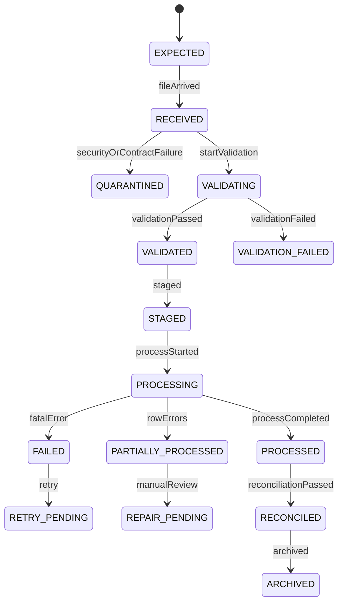

# Batch, File Feed, Bulk Import, and Bulk Export Model

## 1. Core Idea

Tidak semua integration enterprise bersifat real-time API atau event.

Dalam CPQ / Quote / Order / Billing / Telco BSS/OSS, banyak proses masih menggunakan:

- batch job,
- scheduled feed,
- CSV/fixed-width file,
- SFTP delivery,
- object storage drop,
- billing extract,
- usage feed,
- reconciliation file,
- bulk customer import,
- bulk product migration,
- ERP export,
- invoice export,
- tax/regulatory report,
- data warehouse extract.

Mental model:

> Batch and file feeds are data contracts with delayed execution, larger blast radius, and stronger need for validation, staging, idempotency, replay, and reconciliation.

Batch bukan sekadar script. Batch adalah production data pipeline yang harus punya lifecycle, ownership, audit, and recovery model.

---

## 2. Why Batch/File Modelling Matters

Batch/file integration sering menjadi sumber incident karena:

- file diproses dua kali,
- file urutan salah,
- partial file diproses sebelum complete,
- row gagal silently skipped,
- column berubah tanpa contract,
- encoding/delimiter berbeda,
- amount/currency salah parse,
- usage event duplicate,
- invoice export tidak lengkap,
- staging table tidak dibersihkan,
- backfill job overwrite production data,
- retry menciptakan duplicate charge,
- file diterima dari wrong environment/tenant,
- PII diexport ke lokasi yang salah,
- reconciliation file tidak match dengan source.

Batch processing harus dirancang seperti distributed system: idempotent, observable, recoverable.

---

## 3. Batch vs Stream vs API

| Pattern | Characteristics | Example |
|---|---|---|
| API | Request/response, immediate validation. | Create quote, update order. |
| Event stream | Async fact propagation. | OrderCreated, ProductActivated. |
| Batch job | Scheduled/large processing. | Nightly charge generation. |
| File feed | Contracted file exchange. | Usage CSV from network system. |
| Bulk import | Mass create/update. | Import customer/site/product data. |
| Bulk export | Mass extract. | Invoice export to ERP. |

Batch/file has different correctness concerns:

- file completeness,
- row-level validation,
- run-level status,
- replay safety,
- duplicate detection,
- batch window,
- cutoff time,
- reconciliation totals.

---

## 4. File Contract

A file/feed must have contract.

Fields:

```text
file_contract
- id
- contract_code
- producer_system
- consumer_system
- file_type
- schema_version
- format
- delimiter
- encoding
- header_required
- trailer_required
- delivery_channel
- schedule
- owner_group
- data_classification
```

Contract should define:

- filename pattern,
- expected columns,
- required/optional columns,
- data types,
- date/time format,
- decimal separator,
- currency format,
- timezone,
- row uniqueness key,
- trailer totals,
- checksum,
- compression/encryption,
- retry/replay behavior.

---

## 5. File Lifecycle



Do not treat "file received" as "file processed".

---

## 6. File Receipt Model

Fields:

```text
file_receipt
- id
- file_contract_id
- file_name
- file_uri
- file_size
- file_hash
- producer_system
- tenant_id
- environment
- received_at
- status
- correlation_id
```

Important:

- hash detects duplicate/corrupt file,
- size detects partial file,
- tenant/environment prevents wrong routing,
- contract version selects parser,
- file URI should be secure reference, not raw public path.

---

## 7. Header and Trailer

Many enterprise files use header/trailer.

Header may include:

- file type,
- producer,
- creation timestamp,
- sequence number,
- schema version,
- tenant/customer,
- environment.

Trailer may include:

- row count,
- total amount,
- checksum,
- ending marker.

Validation:

```text
actual row count == trailer row count
sum(amount) == trailer total amount
file sequence number expected
```

Trailer mismatch should block or quarantine depending severity.

---

## 8. Staging Table Pattern

Do not apply file rows directly to final tables.

Pattern:

```text
file received
  -> parse into staging rows
  -> validate staging
  -> process valid rows into domain commands
  -> record row result
  -> reconcile totals
```

Staging row fields:

```text
staging_file_row
- id
- file_receipt_id
- row_number
- raw_row_hash
- parse_status
- validation_status
- processing_status
- error_code
- target_entity_type
- target_entity_id
```

Staging provides traceability and retry.

---

## 9. Raw Payload and Parsed Payload

Store raw payload carefully.

Options:

- store raw row text,
- store parsed JSON,
- store secure file reference,
- store hash only,
- store redacted raw payload.

For sensitive feeds, avoid storing raw PII/payment data broadly.

Fields:

```text
raw_payload_reference
parsed_payload
payload_hash
redacted_payload
```

Security/privacy classification must apply.

---

## 10. Row-Level Validation

Validate each row.

Examples:

- required field missing,
- invalid date format,
- invalid amount,
- unknown currency,
- unknown product code,
- duplicate row key,
- customer not found,
- billing account inactive,
- effective date outside allowed range,
- usage quantity negative,
- external service ID unmapped.

Row validation result:

```text
file_row_validation_error
- file_receipt_id
- row_number
- field_name
- error_code
- severity
- message
```

Do not hide row errors inside generic file failed message.

---

## 11. File-Level Validation

Validate whole file.

Examples:

- wrong schema version,
- wrong producer/system,
- wrong tenant/environment,
- missing header/trailer,
- invalid checksum,
- row count mismatch,
- duplicate file sequence,
- file arrived outside window,
- file size too small/large,
- encryption/signature invalid.

File-level failures often block whole file.

---

## 12. Idempotency for Files

File processing must be idempotent.

Keys:

- file hash,
- producer file ID,
- sequence number,
- file name + contract + period,
- row natural key,
- external event ID,
- usage event ID.

Example:

```text
usage feed row idempotency key:
source_system + external_usage_event_id
```

Example duplicate file protection:

```text
unique(file_contract_id, producer_system, file_sequence_number)
```

or:

```text
unique(file_contract_id, file_hash)
```

Depends contract.

---

## 13. Replay and Reprocessing

Files may need replay.

Reasons:

- parser bug fixed,
- downstream failure,
- partial process,
- reconciliation mismatch,
- missing rows,
- backfill,
- correction.

Replay must define:

- replay all rows or failed rows only,
- use same file version or new transformation version,
- suppress duplicate side effects,
- mark previous run superseded,
- preserve audit history.

Replay is unsafe without row-level idempotency.

---

## 14. Bulk Import Model

Bulk import use cases:

- customer/account import,
- site/address import,
- product catalog import,
- price list import,
- discount rule import,
- contract import,
- legacy order import,
- product inventory migration,
- user/role import.

Bulk import should use staging and validation.

Fields:

```text
bulk_import_job
- id
- import_type
- source_file_id
- status
- requested_by
- approved_by
- started_at
- completed_at
- success_count
- failure_count
```

Import row should map to domain command, not direct table mutation where invariants matter.

---

## 15. Bulk Export Model

Bulk export use cases:

- invoice export,
- ERP revenue export,
- customer data export,
- product inventory export,
- quote/order report,
- regulatory report,
- data warehouse extract,
- legal discovery export.

Export fields:

```text
bulk_export_job
- id
- export_type
- scope
- filter_criteria
- status
- requested_by
- approval_required
- approved_by
- file_reference
- row_count
- checksum
- expires_at
```

Exports must enforce:

- authorization,
- tenant scope,
- data classification,
- masking,
- approval if sensitive,
- expiry,
- audit.

---

## 16. Usage Feed Example

Usage feed flow:

```text
Network/OSS usage file
  -> receive file
  -> validate contract/header/trailer
  -> stage rows
  -> deduplicate usage events
  -> normalize units
  -> map external service ID to product/service
  -> aggregate usage
  -> rate usage
  -> create usage charge
  -> reconcile totals
```

Critical fields:

- source usage ID,
- external service/resource ID,
- event time,
- quantity,
- unit,
- timezone,
- product/customer mapping,
- rating period,
- duplicate key.

Usage feed is high-risk for duplicate billing.

---

## 17. Billing/ERP Export Example

Invoice export flow:

```text
Invoice issued
  -> export candidate selected
  -> export file generated
  -> file checksum/trailer generated
  -> sent to ERP
  -> ERP acknowledgement received
  -> export status updated
  -> reconciliation confirms invoice in ERP
```

Important:

- invoice should not export twice unless correction/reissue,
- export file should have sequence,
- ERP ack should map to file and invoice,
- failed export should be retryable,
- voided/reissued invoice semantics must be clear.

---

## 18. Batch Window and Cutoff

Batch often has window/cutoff.

Fields:

```text
batch_window
- window_start
- window_end
- cutoff_time
- timezone
- business_date
```

Example:

```text
Usage file for service date July 1 must arrive by July 2 02:00 local time.
```

Late arrival policy:

- reject,
- process in next cycle,
- adjustment,
- rerating,
- manual review.

Late data must be modelled, not ignored.

---

## 19. Run Model

Batch run fields:

```text
batch_run
- id
- job_name
- job_version
- tenant_id
- environment
- business_date
- status
- started_at
- completed_at
- input_count
- success_count
- failure_count
- skipped_count
- correlation_id
```

Run status supports operations and incident review.

---

## 20. Checkpoint and Watermark

Batch process needs checkpoint.

Fields:

```text
batch_checkpoint
- job_name
- tenant_id
- source_system
- last_successful_business_date
- last_processed_id
- last_processed_time
- status
- updated_at
```

Checkpoint supports:

- resume,
- catch-up,
- duplicate prevention,
- SLA tracking,
- reporting freshness.

---

## 21. Reconciliation Totals

File/batch should reconcile:

- row count,
- amount totals,
- hash/checksum,
- source total vs target total,
- file total vs processed total,
- exported invoices vs acknowledged invoices.

Example:

```text
trailer_total_amount = 1,000,000
processed_total_amount = 999,500
difference = 500
```

Persist reconciliation result.

---

## 22. PostgreSQL Physical Design

File contract:

```sql
create table file_contract (
  id uuid primary key,
  contract_code text not null unique,
  producer_system text not null,
  consumer_system text not null,
  file_type text not null,
  schema_version text not null,
  format text not null,
  delivery_channel text,
  schedule text,
  owner_group text,
  data_classification text,
  active boolean not null default true,
  created_at timestamptz not null,
  updated_at timestamptz not null
);
```

File receipt:

```sql
create table file_receipt (
  id uuid primary key,
  file_contract_id uuid not null references file_contract(id),
  tenant_id uuid,
  environment text,
  file_name text not null,
  file_uri text not null,
  file_size bigint,
  file_hash text,
  producer_system text not null,
  file_sequence_number text,
  status text not null,
  received_at timestamptz not null,
  processed_at timestamptz,
  correlation_id text
);
```

Staging row:

```sql
create table staging_file_row (
  id uuid primary key,
  file_receipt_id uuid not null references file_receipt(id),
  row_number integer not null,
  row_key text,
  raw_row_hash text,
  parsed_payload jsonb,
  parse_status text not null,
  validation_status text,
  processing_status text,
  target_entity_type text,
  target_entity_id uuid,
  error_code text,
  created_at timestamptz not null,
  unique (file_receipt_id, row_number)
);
```

Batch run:

```sql
create table batch_run (
  id uuid primary key,
  job_name text not null,
  job_version text,
  tenant_id uuid,
  environment text,
  business_date date,
  status text not null,
  started_at timestamptz not null,
  completed_at timestamptz,
  input_count bigint,
  success_count bigint,
  failure_count bigint,
  skipped_count bigint,
  correlation_id text
);
```

Indexes:

```sql
create index idx_file_receipt_contract_status
on file_receipt (file_contract_id, status, received_at);

create unique index uq_file_contract_hash
on file_receipt (file_contract_id, file_hash)
where file_hash is not null;

create index idx_staging_file_status
on staging_file_row (file_receipt_id, processing_status, row_number);

create index idx_batch_run_job_time
on batch_run (job_name, started_at desc);
```

---

## 23. Java/JAX-RS Backend Implications

Internal APIs:

```http
GET /file-feeds/receipts
POST /file-feeds/receipts/{id}/validate
POST /file-feeds/receipts/{id}/process
POST /file-feeds/receipts/{id}/replay
GET /batch-runs/{id}
POST /bulk-imports
POST /bulk-exports
```

Service pattern:

```text
FileReceiptService
  -> contract validation
  -> virus/security check if applicable
  -> parser
  -> staging repository
  -> validation service
  -> processor
  -> reconciliation service
  -> archive service
```

File processing should be resumable and idempotent.

---

## 24. MyBatis/JPA/JDBC Implications

### MyBatis/JDBC

Good for:

- batch insert staging rows,
- bulk validation queries,
- batch updates,
- reconciliation totals,
- paginated row processing.

### JPA

Can be risky for huge files due to memory and flush overhead.

General rule:

> For bulk ingestion/export, use bounded streaming/batch processing and avoid loading entire file into memory.

---

## 25. Security and Privacy

File feeds/exports are high-risk.

Controls:

- secure delivery channel,
- encryption,
- signature/checksum,
- access control,
- data classification,
- masking,
- export approval,
- expiry,
- archive/purge policy,
- audit download/access,
- tenant/environment validation.

Never write sensitive file to broad temporary folder or log raw rows.

---

## 26. Observability

Monitor:

- expected file missing,
- late file,
- duplicate file,
- validation failures,
- row error rate,
- batch run duration,
- stuck processing,
- replay count,
- reconciliation difference,
- export acknowledgement missing,
- file archive failure.

Example queries:

```sql
-- Files stuck in processing
select id, file_name, status, received_at
from file_receipt
where status in ('RECEIVED', 'VALIDATING', 'PROCESSING')
  and received_at < now() - interval '1 hour';

-- Row errors by code
select error_code, count(*)
from staging_file_row
where file_receipt_id = :file_receipt_id
  and error_code is not null
group by error_code
order by count(*) desc;
```

---

## 27. Failure Modes

| Failure mode | Symptom | Likely cause | Prevention |
|---|---|---|---|
| File processed twice | Duplicate billing/import | No file/row idempotency | File hash + row key uniqueness |
| Partial file processed | Missing rows | No trailer/checksum validation | Header/trailer validation |
| Row silently skipped | Data loss | No row-level result | Staging/result model |
| Wrong tenant import | Data leak/corruption | Tenant missing from file/context | Tenant/environment validation |
| Parser breaks | Format changed | No file contract/version | File contract registry |
| Export leaks PII | Sensitive data in CSV | No classification/export control | Export governance |
| Late usage not billed | Revenue leakage | No late-arrival policy | Batch window policy |
| Replay duplicates side effect | Duplicate charge/order | Non-idempotent processor | Idempotent row processing |
| Reconciliation mismatch ignored | Financial/control issue | No recon result/owner | Reconciliation model |
| Batch overloads DB | Production latency | Unbounded job | Bounded batches/rate limits |

---

## 28. PR Review Checklist

When reviewing batch/file changes, ask:

- What is the file/batch contract?
- Is schema versioned?
- Is tenant/environment validated?
- Is file complete before processing?
- Are header/trailer/checksum validated?
- Is processing staged?
- Is row-level validation/result stored?
- What is idempotency key?
- Can file/rows be replayed safely?
- What happens to partial failures?
- Is reconciliation defined?
- Is sensitive data protected?
- Is export authorized/audited?
- Is batch window/cutoff defined?
- Are metrics/alerts available?
- Is archive/retention defined?

---

## 29. Internal Verification Checklist

Verify these in the internal CSG/team context:

- Existing SFTP/object-store/file feed standards.
- File contract/schema registry for usage/billing/OSS/ERP feeds.
- Whether staging tables are used.
- Whether usage feed deduplication keys exist.
- Whether invoice/export acknowledgement is tracked.
- Whether batch jobs have run/checkpoint metadata.
- Whether row-level validation errors are persisted.
- Whether replay/reprocessing process is safe.
- Whether file encryption/checksum/signature is required.
- Whether bulk import/export approvals exist.
- Whether incidents mention duplicate file processing, partial file, parser break, or missed export ack.

---

## 30. Summary

Batch and file feeds are enterprise data contracts with operational lifecycle.

A strong model must define:

- file contract,
- file receipt,
- header/trailer validation,
- staging rows,
- row-level validation,
- idempotency,
- replay,
- bulk import/export jobs,
- batch window/cutoff,
- checkpoint,
- reconciliation totals,
- security/privacy,
- archive/retention,
- observability.

The key principle:

> Treat every batch and file feed as a production integration product, not a temporary script. It needs contract, staging, idempotency, validation, reconciliation, audit, and recovery.
