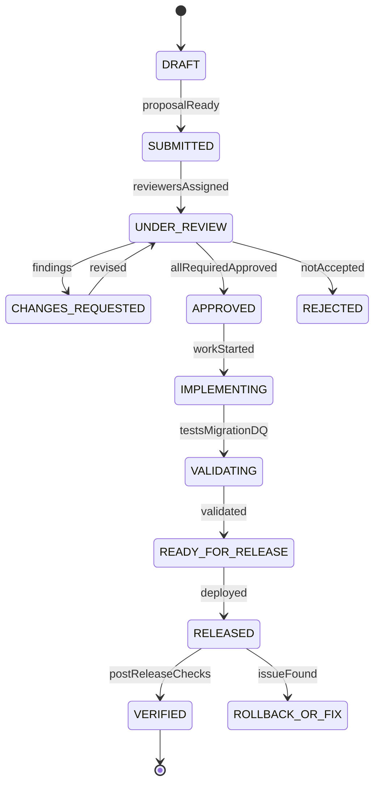

# Data Model Governance, ADR, and Review Workflow Model

## 1. Core Idea

Data model enterprise tidak boleh berubah hanya karena satu ticket membutuhkan satu field baru.

Dalam CPQ / Quote / Order / Billing / Catalog / Telco BSS/OSS, satu perubahan kecil bisa berdampak ke:

- quote pricing,
- approval,
- order conversion,
- fulfillment,
- product inventory,
- billing charge,
- invoice,
- reporting,
- audit,
- events,
- API clients,
- data warehouse,
- support tools,
- compliance/privacy,
- migration/backfill,
- performance.

Mental model:

> Data model governance is the process that makes data changes intentional, reviewed, traceable, and safe for production.

Governance bukan birokrasi. Governance adalah safety net agar system tidak berubah menjadi kumpulan field ad-hoc tanpa ownership, semantics, and compatibility.

---

## 2. Why Governance Matters

Tanpa governance:

- field baru dibuat dengan meaning tidak jelas,
- table baru overlap dengan existing source-of-truth,
- status baru mematahkan reporting,
- enum diubah tanpa consumer review,
- API payload berubah tanpa versioning,
- event membawa PII tanpa security review,
- index tidak dibuat untuk query baru,
- migration tidak punya rollback,
- billing-impacting field tidak direview finance/domain owner,
- data warehouse memakai field yang ternyata temporary,
- duplicate source of truth muncul,
- engineer baru tidak tahu alasan design lama,
- incident terjadi karena keputusan data tidak terdokumentasi.

Data model governance membuat perubahan lebih lambat sedikit di awal, tetapi jauh lebih murah daripada production repair.

---

## 3. Governance Scope

Data governance harus berlaku untuk perubahan seperti:

- entity baru,
- field baru,
- table baru,
- status/reason code baru,
- lifecycle transition baru,
- foreign/reference relationship baru,
- API DTO change,
- event schema change,
- file/feed schema change,
- read model/reporting dataset change,
- sensitive data exposure,
- retention/purge rule,
- migration/backfill,
- cross-service ownership change,
- external system mapping,
- cache/search projection,
- metric/KPI definition.

Tidak semua perubahan butuh review besar. Tapi semua perubahan butuh standar minimum.

---

## 4. Change Classification

Klasifikasi perubahan membantu menentukan review depth.

| Class | Example | Review level |
|---|---|---|
| Low-risk additive | Add optional internal metadata field. | Team review. |
| Medium-risk additive | Add API optional field, new index. | Team + owner review. |
| High-risk lifecycle | Add order state/status transition. | Architecture/domain review. |
| High-risk financial | Change charge/invoice semantics. | Billing/finance/domain review. |
| High-risk privacy | Add PII to event/report/export. | Security/privacy review. |
| Breaking contract | Remove/rename API/event field. | Contract governance. |
| Migration-heavy | Backfill millions of rows. | DB/platform/release review. |
| Cross-service ownership | Move source-of-truth. | Architecture review. |

A simple risk taxonomy prevents over-reviewing everything while catching dangerous changes.

---

## 5. Architecture Decision Record

ADR captures important decision.

ADR should answer:

```text
Context
Decision
Options considered
Tradeoffs
Consequences
Rollout plan
Rollback/mitigation
Owner
Date
Status
```

Data model ADR examples:

- choose quote snapshot instead of reference-only pricing,
- use order item action model instead of status-only mutation,
- adopt transactional outbox,
- use effective dating for product characteristics,
- use external_reference table instead of per-entity external_id columns,
- use event versioning strategy,
- use tenant_id row-level isolation,
- use JSONB snapshot + relational extracted fields.

ADR preserves why, not only what.

---

## 6. Data Model Decision Record

For data-specific changes, ADR can be extended.

Fields:

```text
data_model_decision
- decision_id
- title
- domain_area
- affected_entities
- affected_services
- decision_status
- decision_type
- owner_group
- approved_by
- decided_at
```

Decision types:

- new entity,
- ownership change,
- lifecycle change,
- contract change,
- privacy classification,
- retention change,
- migration strategy,
- performance/index strategy,
- integration mapping.

---

## 7. Decision Status

Statuses:

```text
PROPOSED
UNDER_REVIEW
APPROVED
REJECTED
SUPERSEDED
DEPRECATED
RETIRED
```

Important:

- old decisions can be superseded,
- rejected decisions should sometimes remain documented,
- deprecated decisions need replacement link,
- decision must be searchable by domain area/entity.

---

## 8. Design Proposal Template

A data model proposal should include:

```text
Problem statement
Business context
Affected bounded contexts
Current model
Proposed model
Entity/field definitions
Ownership/source of truth
Lifecycle/state transitions
API/event/file impacts
Migration/backfill plan
Security/privacy classification
Retention impact
Reporting impact
Performance/index impact
Data quality/reconciliation plan
Rollback/forward-fix plan
Open questions
Internal verification checklist
```

This template prevents hidden risk.

---

## 9. Review Participants

Depending risk, reviewers may include:

- domain owner,
- backend/service owner,
- database/platform engineer,
- API owner,
- event/integration owner,
- billing/finance domain expert,
- security/privacy reviewer,
- data/analytics owner,
- support/operations representative,
- QA/test owner,
- release manager,
- customer/on-prem deployment owner.

Not every change needs all reviewers. But ownership must match impact.

---

## 10. Data Ownership Review

Key questions:

- Which service owns this entity?
- Which service can mutate it?
- Who can read it?
- Is this source-of-truth or projection?
- Is duplicate source-of-truth being created?
- Is external system authoritative?
- How are conflicts resolved?
- What happens during migration/cutover?

Ownership ambiguity is one of the highest-risk data design issues.

---

## 11. Semantic Review

Semantic review asks:

- What does this field mean?
- Is the name precise?
- Is it current-state, snapshot, or historical?
- Is it derived or user-entered?
- Is it nullable? What does null mean?
- What unit/currency/timezone?
- Is it inclusive/exclusive?
- Is it effective-dated?
- Is it tenant-scoped?
- Does it have legal/financial/customer impact?

Example bad field:

```text
status
```

Better:

```text
order_lifecycle_status
billing_activation_status
fulfillment_status
```

Names encode semantics.

---

## 12. Contract Review

Contract review applies when API/event/file/dataset changes.

Questions:

- Is this backward compatible?
- Are consumers known?
- Is version bump needed?
- Are samples updated?
- Are contract tests updated?
- Is enum behavior documented?
- Are date/time/money formats stable?
- Is sensitive data included?
- Is deprecation needed?
- Is usage tracking available?

Schema change without contract review can break production consumers.

---

## 13. Lifecycle Review

For status/action changes:

- What are allowed transitions?
- Which transitions are terminal?
- Which transitions are reversible?
- Which transitions trigger events?
- Which transitions affect billing?
- Which transitions affect fulfillment?
- Which transitions require audit/reason?
- Which transitions require approval?
- Which reports need mapping?
- How are old records migrated?

Adding one status can require changes in many places.

---

## 14. Financial/Billing Review

Financial data changes need stricter review.

Examples:

- charge amount,
- discount,
- margin,
- tax,
- invoice line,
- recurring charge,
- usage rating,
- proration,
- credit/debit adjustment,
- payment status,
- revenue metrics.

Questions:

- Is amount exact decimal?
- Is currency required?
- Is tax included/excluded?
- Is period/effective date explicit?
- Is invoice immutable after issue?
- Is correction via adjustment instead of overwrite?
- Is reconciliation needed?
- Is reporting/finance metric affected?

---

## 15. Security and Privacy Review

Questions:

- Is field PII/restricted?
- Is classification assigned?
- Can it appear in API/event/report/search/cache?
- Is masking required?
- Is encryption/tokenization required?
- Is access audit needed?
- Is export allowed?
- Is retention policy defined?
- Does lower environment test data need masking?
- Does purge/anonymization cover derived copies?

Security review should happen before field is copied everywhere.

---

## 16. Migration Review

Questions:

- Is schema change additive or breaking?
- Is expand/contract needed?
- Is backfill required?
- Is backfill idempotent?
- What is source of truth?
- How are exceptions handled?
- What is batch size?
- What is rollback/forward-fix plan?
- Does it lock hot table?
- Are old/new app versions compatible?
- Are reports/projections affected?
- Is validation/reconciliation ready?

Migration review prevents "works in dev, locks prod" incidents.

---

## 17. Performance Review

Questions:

- What query patterns use this field/table?
- What row volume is expected?
- Is index needed?
- Is this hot table?
- Is this append-only/history?
- Does new index slow writes?
- Is partitioning needed?
- Will dashboard query OLTP?
- Is pagination stable?
- Are JSONB fields queried?
- Is archive/retention considered?

Performance is part of data model design, not afterthought.

---

## 18. Data Quality Review

Questions:

- What invariants must hold?
- Can DB constraints enforce them?
- What validation is needed?
- What reconciliation rule is needed?
- What data quality rule monitors it?
- Who owns violations?
- What severity?
- What repair workflow?
- What tests cover violations?

If a new relationship can drift, add reconciliation.

---

## 19. Review Outcome Model

Review result should be recorded.

Fields:

```text
data_model_review
- id
- review_number
- title
- change_type
- risk_level
- status
- owner_group
- requested_by
- approved_by
- created_at
- completed_at
```

Review finding:

```text
data_model_review_finding
- review_id
- category
- severity
- finding
- required_action
- status
- resolved_at
```

This creates audit trail and learning history.

---

## 20. Production Readiness Checklist

Before release:

- schema deployed safely,
- app compatibility verified,
- backfill runbook ready,
- event/API contracts published,
- consumers notified,
- index/query plan tested,
- security classification approved,
- DQ/reconciliation rules ready,
- dashboards updated,
- test data updated,
- rollback/forward-fix plan documented,
- support/runbook updated,
- monitoring/alerts configured.

For high-risk data change, production readiness should be explicit.

---

## 21. Data Model Review Workflow



Governance should track post-release verification, not only pre-release approval.

---

## 22. PostgreSQL Physical Design

Decision record:

```sql
create table data_model_decision (
  id uuid primary key,
  decision_number text not null unique,
  title text not null,
  domain_area text not null,
  decision_type text not null,
  status text not null,
  owner_group text,
  context_summary text,
  decision_summary text,
  consequences text,
  supersedes_decision_id uuid,
  approved_by text,
  decided_at timestamptz,
  created_at timestamptz not null,
  updated_at timestamptz not null
);
```

Review:

```sql
create table data_model_review (
  id uuid primary key,
  review_number text not null unique,
  title text not null,
  change_type text not null,
  risk_level text not null,
  status text not null,
  owner_group text,
  requested_by text not null,
  approved_by text,
  created_at timestamptz not null,
  completed_at timestamptz,
  release_reference text
);
```

Review finding:

```sql
create table data_model_review_finding (
  id uuid primary key,
  review_id uuid not null references data_model_review(id),
  category text not null,
  severity text not null,
  finding text not null,
  required_action text,
  status text not null,
  resolved_at timestamptz
);
```

Affected asset:

```sql
create table data_model_review_asset (
  id uuid primary key,
  review_id uuid not null references data_model_review(id),
  asset_type text not null,
  asset_name text not null,
  impact_type text,
  criticality text
);
```

Indexes:

```sql
create index idx_decision_domain_status
on data_model_decision (domain_area, status, decided_at desc);

create index idx_review_status_risk
on data_model_review (status, risk_level, created_at desc);

create index idx_review_asset_name
on data_model_review_asset (asset_type, asset_name);

create index idx_review_finding_open
on data_model_review_finding (review_id, severity)
where status <> 'RESOLVED';
```

---

## 23. Java/JAX-RS Backend Implications

Internal governance APIs:

```http
POST /data-model-reviews
GET /data-model-reviews/{id}
POST /data-model-reviews/{id}/findings
POST /data-model-reviews/{id}/approve
POST /data-model-decisions
GET /data-model-decisions?entity=...
```

CI/CD integration can require:

- linked review number for risky DB migration,
- approved contract change,
- decision record for ownership change,
- security approval for sensitive field,
- migration plan for backfill,
- test evidence for data invariants.

---

## 24. Review Automation

Automatable checks:

- migration contains destructive DDL,
- new column lacks comment/metadata,
- sensitive field name detected,
- event schema breaking change,
- API OpenAPI breaking diff,
- table lacks tenant_id in tenant-owned domain,
- field lacks classification,
- missing index for new query,
- missing migration rollback note,
- enum/status added without mapping,
- contract sample missing.

Automation does not replace human semantics review, but catches many mistakes.

---

## 25. Documentation Linkage

Each important model element should link to:

- ADR/decision,
- data dictionary,
- contract,
- migration,
- owner,
- lineage,
- runbook,
- dashboard,
- test scenario.

This creates discoverability.

Example:

```text
quote.source_quote_version
  owner = quote/order service
  decision = ADR-042
  lineage = quote -> order conversion
  contract = ProductOrderCreated.v2
```

---

## 26. Anti-Patterns

Avoid:

- creating new table without ownership,
- adding nullable field with unclear null semantics,
- changing status enum because UI needs label,
- using free-text reason instead of governed code,
- adding event field without consumer review,
- exposing entity as DTO,
- making migration without data volume test,
- using JSONB to avoid design discussion,
- copying PII into read model without classification,
- creating duplicate source-of-truth,
- approving data model with no post-release validation.

---

## 27. Failure Modes

| Failure mode | Symptom | Likely cause | Prevention |
|---|---|---|---|
| Duplicate source of truth | Two services mutate same field | Ownership not reviewed | Ownership review |
| Breaking consumer | Deploy causes failures | Contract change unreviewed | Contract review |
| Billing mismatch | Amount semantics changed | Financial review missing | Billing review |
| PII leak | Sensitive field copied | Security review missing | Classification review |
| Migration outage | Table locked | Migration review missing | Online migration review |
| KPI dispute | Field meaning unclear | Semantic review missing | Data dictionary/metric review |
| Status chaos | New states inconsistent | Lifecycle review missing | State machine governance |
| Slow query | Query pattern ignored | Performance review missing | Index/query review |
| DQ drift | New relation unmonitored | Data quality review missing | DQ/reconciliation rule |
| Lost rationale | No one knows why | ADR missing | Decision record |

---

## 28. PR Review Checklist

When reviewing data model governance itself, ask:

- Is change risk classified?
- Is owner identified?
- Is source of truth clear?
- Is semantic definition written?
- Are affected contracts listed?
- Are affected reports/read models listed?
- Are security/privacy classifications done?
- Is migration/backfill plan present?
- Is performance/index impact reviewed?
- Are invariants and DQ rules defined?
- Are tests updated?
- Is rollback/forward-fix plan defined?
- Is ADR needed?
- Is post-release verification planned?

---

## 29. Internal Verification Checklist

Verify these in the internal CSG/team context:

- Existing architecture review process.
- Whether ADRs are used.
- Whether database schema changes require review.
- Whether API/event contract changes require review.
- Whether billing-impacting changes require domain/finance approval.
- Whether data classification review exists.
- Whether migration/backfill runbooks are required.
- Whether data dictionary/metadata catalog exists.
- Whether production readiness checklist includes DQ/reconciliation.
- Whether incidents mention missing review, unclear ownership, or undocumented decision.

---

## 30. Summary

Data model governance keeps enterprise systems coherent as they evolve.

A strong governance model must define:

- change classification,
- review workflow,
- ADR/decision record,
- ownership review,
- semantic review,
- contract review,
- lifecycle review,
- financial/billing review,
- security/privacy review,
- migration review,
- performance review,
- data quality review,
- production readiness,
- post-release verification,
- documentation linkage.

The key principle:

> In enterprise systems, unmanaged data changes accumulate into architectural debt. Governed changes create a model that can evolve without breaking correctness, contracts, performance, or trust.
