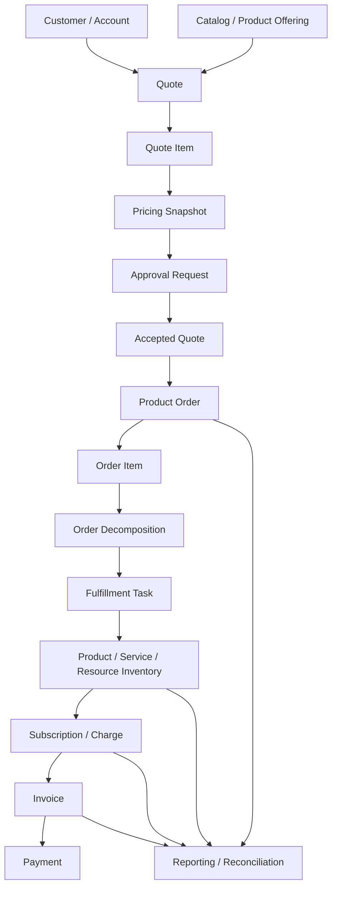

# End-to-End Quote-to-Cash Data Flow Case Study

## 1. Core Idea

Setelah memahami puluhan building blocks data modelling, kita perlu melihat semuanya sebagai satu flow.

Quote-to-cash bukan satu entity. Ia adalah rangkaian model:

```text
Customer/Account
  -> Catalog/Product Offering
  -> Quote
  -> Quote Item
  -> Pricing
  -> Approval
  -> Accepted Quote Snapshot
  -> Product Order
  -> Order Item
  -> Decomposition
  -> Fulfillment Task
  -> Product/Service/Resource Inventory
  -> Subscription/Charge
  -> Invoice
  -> Payment
  -> Reconciliation
  -> Reporting
```

Mental model:

> End-to-end correctness depends on preserving intent, snapshot, lineage, state, idempotency, and reconciliation across every boundary.

Case study ini bersifat generic enterprise CPQ/order/billing. Detail internal CSG/team harus diverifikasi pada sistem nyata.

---

## 2. Case Scenario

Scenario:

```text
Enterprise customer requests a new connectivity service for a site.
Sales creates quote.
Quote is configured and priced.
Discount requires approval.
Customer accepts quote.
System converts accepted quote into product order.
Order decomposes into fulfillment tasks.
Service is activated.
Product inventory is created.
Recurring charge starts.
Invoice is generated.
Payment is received.
```

Entities involved:

- customer,
- account,
- billing account,
- site/address,
- product offering,
- product specification,
- quote,
- quote item,
- approval request,
- product order,
- order item,
- fulfillment task,
- product instance,
- service instance,
- resource instance,
- subscription,
- recurring charge,
- invoice,
- payment.

---

## 3. High-Level Flow



Every arrow should preserve reference/lineage.

---

## 4. Step 1 — Customer and Account Context

Quote starts with customer/account context.

Important data:

```text
customer_id
account_id
billing_account_id
related_party roles
contact
site/location
currency
sales channel
tenant/environment
```

Key modelling questions:

- Is customer/account source-of-truth internal or external?
- Is billing account selected now or later?
- Is billing account active?
- Is site serviceable?
- Which organization hierarchy applies?
- Which currency and price list apply?
- What access scope does sales user have?

Common mistake:

```text
Only store customer name on quote and lose customer/account ID.
```

Better:

```text
Store reference IDs + required snapshots.
```

---

## 5. Step 2 — Catalog Selection

Sales selects product offering.

Important data:

```text
product_offering_id
product_offering_version
product_specification_id
catalog_version
price_list_id
characteristic selections
bundle parent/child
eligibility/serviceability result
```

Why version matters:

> Order must reflect what customer accepted at quote time, not what catalog says today.

Store:

- offering reference,
- offering version,
- configuration snapshot,
- price snapshot,
- serviceability evidence if needed.

---

## 6. Step 3 — Quote Item Configuration

Quote item captures commercial intent.

Quote item should model:

- action: add/modify/disconnect,
- product offering/spec,
- quantity,
- site/location,
- characteristics,
- parent/child bundle,
- target product instance for modify/disconnect,
- validation result,
- price snapshot.

Example:

```text
quote_item.action = ADD
quote_item.product_offering_id = INTERNET_500_MBPS
quote_item.site_id = SITE-1
quote_item.bandwidth = 500 Mbps
```

Invariants:

- required characteristics present,
- site serviceable,
- quantity valid,
- bundle dependencies valid,
- target product required for modify/disconnect.

---

## 7. Step 4 — Pricing Snapshot

Pricing generates quote price.

Important fields:

```text
list_price
discount_amount
discount_percent
net_price
currency
tax_estimate
price_rule_version
price_list_version
effective_date
calculated_at
```

Quote should store accepted price snapshot.

Do not recompute old accepted quote price from current price rules during order creation.

Lineage:

```text
quote_item_price <- price_rule_version + product_offering_version + discount decision
```

---

## 8. Step 5 — Approval

Discount or non-standard terms may require approval.

Approval data:

```text
approval_request_id
target_quote_id
target_quote_version
approval_type
step
approver
decision
decision_reason
decision_evidence
decision_at
```

Critical invariant:

> Approval applies to a specific quote version and commercial snapshot.

If quote materially changes after approval, approval may need invalidation.

---

## 9. Step 6 — Quote Acceptance

Quote acceptance is commitment boundary.

At acceptance:

- quote version becomes immutable,
- accepted snapshot is frozen,
- acceptance evidence captured,
- status history written,
- audit written,
- outbox event written,
- conversion status initiated or pending.

Example transaction:

```text
Begin transaction
  quote.status = ACCEPTED
  quote.accepted_at = now
  insert quote_status_history
  insert quote_acceptance_evidence
  insert outbox_event QuoteAccepted
Commit
```

Important:

- idempotency key for accept command,
- expected quote version,
- validUntil guard,
- approval still valid,
- pricing snapshot still valid.

---

## 10. Step 7 — Quote-to-Order Conversion

Accepted quote becomes product order.

Mapping:

| Quote | Order |
|---|---|
| quote.id/version | order.source_quote_id/version |
| quote.customer/account | order.customer/account snapshot/reference |
| quote.billing_account | order.billing_account |
| quote item | order item |
| quote item action | order item action |
| quote price snapshot | order item commercial snapshot |
| quote site | order item site |
| quote configuration | order item configuration snapshot |

Conversion must be idempotent.

Unique rule:

```text
one order per accepted quote version
```

If retry happens, return existing order.

---

## 11. Step 8 — Product Order

Order is executable transaction.

Order fields:

```text
order_id
order_number
source_quote_id
source_quote_version
customer_id
account_id
billing_account_id
status
fulfillment_status
billing_status
requested_completion_date
correlation_id
idempotency_key
```

Order status should not mean everything.

Suggested separation:

```text
lifecycle_status
fulfillment_status
billing_status
reconciliation_status
```

Order is now operational, not just commercial proposal.

---

## 12. Step 9 — Order Items

Each quote item maps to order item.

Order item fields:

```text
order_item_id
source_quote_item_id
action
product_offering_id/version
product_spec_id
target_product_instance_id
site_id
quantity
configuration_snapshot
commercial_snapshot
status
dependency
```

Order item drives downstream work.

Examples:

- ADD -> create product/service/resource,
- MODIFY -> update existing product/service/resource,
- DISCONNECT -> terminate product/service/resource and charges.

---

## 13. Step 10 — Decomposition

Order decomposition turns commercial order into executable tasks.

Outputs:

- service order,
- resource order,
- fulfillment task,
- billing instruction,
- inventory update plan,
- dependency graph.

Lineage:

```text
decomposition_output.source_order_item_id
decomposition_output.rule_version
decomposition_output.workflow_template_version
```

Why important:

> If fulfillment task is wrong, engineer needs to know which order item and decomposition rule created it.

---

## 14. Step 11 — Fulfillment

Fulfillment tasks execute work.

Task data:

```text
fulfillment_task_id
order_item_id
task_type
target_system
status
external_request_id
retry_count
fallout_reason_code
completion_proof
```

Task states:

```text
CREATED
READY
SENT
ACKNOWLEDGED
IN_PROGRESS
COMPLETED
FALLOUT
RETRY_PENDING
MANUAL_INTERVENTION
CANCELLED
```

Fulfillment completion should not blindly complete order. It should update the relevant item/task and trigger inventory update where appropriate.

---

## 15. Step 12 — Product, Service, and Resource Inventory

On successful fulfillment:

```text
product_instance created/updated
service_instance created/updated
resource_instance reserved/assigned/activated
```

Product instance fields:

```text
product_instance_id
source_order_id
source_order_item_id
customer_id
account_id
product_offering_id/version
status
activation_date
billing_account_id
subscription_id
```

Service/resource realizes product.

Lineage:

```text
product_instance <- order_item <- quote_item <- product_offering_version
```

This lineage supports future modify/disconnect.

---

## 16. Step 13 — Subscription and Charge Activation

For recurring product:

```text
subscription created/activated
recurring_charge created/activated
billing schedule created
```

Charge fields:

```text
charge_id
product_instance_id
subscription_item_id
billing_account_id
charge_type
amount
currency
effective_from
effective_to
status
source_order_item_id
```

Billing readiness guard:

- product active,
- billing account active,
- charge snapshot exists,
- no duplicate active charge,
- effective date valid,
- billing profile complete.

---

## 17. Step 14 — Invoice

Billing system generates invoice/invoice lines.

Invoice line should trace to:

- charge,
- product instance,
- order item,
- billing account,
- service period.

Important:

```text
invoice_line.charge_id
invoice_line.product_instance_id
invoice_line.order_item_id
billing_period_start/end
amount
tax_amount
currency
```

Invoice is usually immutable once issued. Corrections should use adjustment/credit/debit according to policy.

---

## 18. Step 15 — Payment

Payment may be external.

Payment data:

```text
payment_id
invoice_id
payment_provider_reference
amount
currency
status
paid_at
payment_method_reference
```

Do not store raw payment secret/card data unless explicitly compliant and required.

Payment status should reconcile to invoice status.

---

## 19. End-to-End Identity and Lineage

Critical references:

```text
quote.id/version
quote_item.id
order.id
order_item.id
fulfillment_task.id
product_instance.id
service_instance.id
resource_instance.id
subscription.id
charge.id
invoice.id
invoice_line.id
payment.id
```

A support/engineer should trace:

```text
invoice line -> charge -> product instance -> order item -> quote item -> quote
```

If this trace is impossible, the model is not enterprise-grade.

---

## 20. End-to-End Events

Possible event chain:

```text
QuoteCreated
QuotePriced
ApprovalRequested
ApprovalApproved
QuoteAccepted
QuoteConversionRequested
ProductOrderCreated
ProductOrderSubmitted
OrderDecomposed
FulfillmentTaskCreated
FulfillmentTaskCompleted
ProductActivated
ChargeActivated
InvoiceIssued
PaymentReceived
```

Event metadata:

```text
event_id
event_type
event_version
aggregate_id
aggregate_version
tenant_id
correlation_id
causation_id
occurred_at
```

Events should be minimal, versioned, and idempotent.

---

## 21. End-to-End Correlation

A single correlation ID should connect:

- API request,
- quote acceptance,
- order conversion,
- outbox events,
- workflow process,
- fulfillment integration,
- billing trigger,
- inventory update,
- support timeline.

Example:

```text
correlation_id = corr-quote-accept-123
```

This lets support reconstruct the full flow.

---

## 22. End-to-End Idempotency

Idempotency boundaries:

| Action | Key |
|---|---|
| Accept quote | quote_id + quote_version + accept request |
| Convert quote to order | quote_id + quote_version |
| Create order item | order_id + source_quote_item_id |
| Create fulfillment task | order_item_id + task_type + decomposition_run |
| Activate product | order_item_id + product_spec/resource key |
| Activate charge | product_instance_id + charge_type + effective_from |
| Create invoice line | charge_id + billing_period |
| Process payment callback | provider + transaction_id |

Idempotency should be enforced by persistence, not only memory/cache.

---

## 23. End-to-End Reconciliation

Important reconciliation rules:

```text
Accepted quote should have order.
Order item fulfilled should have product instance.
Active product should have active charge if billable.
Terminated product should not have active charge beyond end date.
Charge should appear on invoice line when billed.
Invoice paid status should match payment.
Product inventory should match service/resource inventory where applicable.
Outbox published events should be consumed by required consumers.
```

Reconciliation closes the gap between distributed steps.

---

## 24. Support Timeline Example

Support timeline for this case:

```text
10:00 Quote created
10:05 Quote priced
10:07 Approval requested
10:30 Approval approved
10:45 Quote accepted
10:45 QuoteAccepted event published
10:46 Order created
10:47 Order decomposed
10:49 Fulfillment task sent to OSS
11:10 Fulfillment completed
11:11 Product instance activated
11:12 Charge activated
Next cycle Invoice issued
Payment received
```

Timeline should include failures, retries, and manual repairs if any.

---

## 25. Failure Scenario A — Accepted Quote but No Order

Symptoms:

- quote accepted,
- customer expects order,
- no order exists.

Likely causes:

- outbox event stuck,
- order consumer failed,
- idempotency conflict,
- conversion validation error,
- workflow issue.

Detection:

```text
Accepted quote older than threshold with no order.
```

Repair:

- inspect quote conversion status,
- check outbox/inbox,
- retry conversion using same idempotency key,
- avoid duplicate order,
- record repair.

---

## 26. Failure Scenario B — Product Active but Not Billed

Symptoms:

- service delivered,
- product inventory active,
- no recurring charge.

Likely causes:

- billing trigger failed,
- billing account invalid,
- charge creation duplicate conflict,
- event lost,
- product not marked billable,
- mapping missing.

Detection:

```text
Active billable product without active recurring charge.
```

Repair:

- verify billing readiness,
- create/retry charge idempotently,
- reconcile with billing system,
- audit financial impact.

This is revenue leakage risk.

---

## 27. Failure Scenario C — Billing Active but Service Not Active

Symptoms:

- customer billed,
- service not delivered.

Likely causes:

- billing triggered before fulfillment proof,
- service activation failed after charge activation,
- state regression,
- integration mismatch.

Detection:

```text
Active charge but product/service not active.
```

Repair:

- suspend/stop billing or issue credit,
- fix fulfillment,
- create compensation,
- link incident.

This is customer trust risk.

---

## 28. Failure Scenario D — Modify Order Loses Product Lineage

Symptoms:

- customer wants modify existing product,
- system cannot find installed product/source order,
- wrong product modified.

Likely causes:

- product instance missing source order item,
- external ID mapping ambiguous,
- quote item target product not captured,
- migration lost lineage.

Prevention:

```text
modify quote/order item must reference target_product_instance_id
product instance must preserve source_order_item_id
external_reference must map OSS/billing IDs
```

---

## 29. Failure Scenario E — Reporting Dispute

Symptoms:

- sales dashboard says booking amount X,
- billing dashboard says revenue Y,
- finance says recognized revenue Z.

Cause:

- different metrics:
  - quoted,
  - booked,
  - billed,
  - collected,
  - recognized.

Prevention:

- metric definitions,
- fact grain,
- source lineage,
- time basis,
- revenue stage separation.

Do not force one number to mean all financial states.

---

## 30. PostgreSQL Traceability Query Examples

Trace invoice line back to quote:

```sql
select
  il.id as invoice_line_id,
  c.id as charge_id,
  pi.id as product_instance_id,
  oi.id as order_item_id,
  qi.id as quote_item_id,
  q.id as quote_id,
  q.quote_number
from invoice_line il
join charge c on c.id = il.charge_id
join product_instance pi on pi.id = c.product_instance_id
join product_order_item oi on oi.id = pi.source_order_item_id
join quote_item qi on qi.id = oi.source_quote_item_id
join quote q on q.id = qi.quote_id
where il.id = :invoice_line_id;
```

Actual schema may differ. The pattern matters: preserve links.

Find accepted quotes without order:

```sql
select q.id, q.quote_number, q.version, q.accepted_at
from quote q
left join product_order o
  on o.source_quote_id = q.id
 and o.source_quote_version = q.version
where q.status = 'ACCEPTED'
  and q.accepted_at < now() - interval '15 minutes'
  and o.id is null;
```

Find active billable products without charge:

```sql
select pi.id, pi.product_instance_number, pi.customer_id
from product_instance pi
left join recurring_charge rc
  on rc.product_instance_id = pi.id
 and rc.status = 'ACTIVE'
where pi.status = 'ACTIVE'
  and pi.billable = true
  and rc.id is null;
```

---

## 31. Java/JAX-RS Service Boundary View

Possible services:

```text
QuoteService
ApprovalService
OrderService
FulfillmentService
InventoryService
BillingIntegrationService
InvoiceService
PaymentIntegrationService
ReconciliationService
ReportingProjectionService
```

Important:

- each service owns its data,
- commands enforce invariants,
- events propagate facts,
- projections support reads,
- reconciliation verifies cross-service truth,
- support timeline joins operational evidence.

Avoid one service directly mutating all tables.

---

## 32. Case Study PR Review Checklist

For quote-to-cash flow changes, ask:

- Is quote snapshot preserved?
- Is quote version used?
- Is quote-to-order idempotent?
- Is source quote item mapped to order item?
- Is order item action explicit?
- Is fulfillment output linked to order item?
- Is product instance linked to order item?
- Is charge linked to product instance/order item?
- Is invoice line linked to charge?
- Are billing readiness guards defined?
- Are events versioned and correlated?
- Are reconciliation rules updated?
- Are support timeline entries available?
- Are reporting metric definitions affected?
- Are external IDs/mappings preserved?
- Are privacy/security classifications respected?

---

## 33. Internal Verification Checklist

Verify these in the internal CSG/team context:

- Actual source-of-truth for quote/order/billing/product inventory.
- Whether quote-to-order conversion stores quote version.
- Whether order items map to quote items.
- Whether product instances map to order items.
- Whether billing charges map to product instances/order items.
- Whether invoice lines map to charges.
- Whether fulfillment/service/resource inventory mapping exists.
- Whether end-to-end correlation ID is propagated.
- Whether support can trace invoice line back to quote/order.
- Whether accepted quote without order reconciliation exists.
- Whether active product without charge reconciliation exists.
- Whether billing active but service inactive reconciliation exists.
- Whether CSG-specific extensions to TMF APIs affect this flow.

---

## 34. Summary

End-to-end quote-to-cash modelling is about preserving business intent through execution.

A strong flow must preserve:

- customer/account context,
- catalog version,
- quote item configuration,
- pricing snapshot,
- approval evidence,
- quote acceptance immutability,
- quote-to-order mapping,
- order item actions,
- decomposition lineage,
- fulfillment evidence,
- product/service/resource inventory,
- subscription/charge linkage,
- invoice/payment traceability,
- correlation/causation,
- idempotency,
- reconciliation,
- support timeline,
- reporting source definitions.

The key principle:

> Quote-to-cash correctness is not a single status or table. It is a chain of snapshots, references, events, states, and reconciliations that must remain traceable from customer promise to cash collection.
